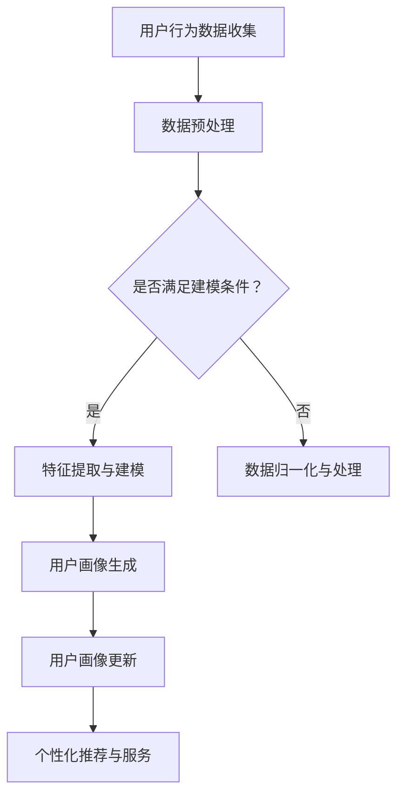

                 

# AI赋能的电商平台用户画像动态更新

## 关键词

- AI赋能
- 电商平台
- 用户画像
- 动态更新
- 数据挖掘
- 机器学习
- 个性化推荐

## 摘要

本文旨在探讨如何利用AI技术对电商平台的用户画像进行动态更新。通过引入机器学习算法，实现对用户行为数据的实时分析和预测，从而为电商企业提供更为精准的个性化服务。文章首先介绍了电商平台用户画像的基本概念和重要性，随后详细阐述了AI赋能用户画像动态更新的核心算法原理、数学模型及其应用场景，并通过实际项目案例进行了代码解读与分析。最后，文章总结了AI赋能电商平台用户画像动态更新的未来发展机遇与挑战，并推荐了相关学习资源与工具。

## 1. 背景介绍

在当今的数字化时代，电子商务已成为全球商业活动的重要组成部分。随着互联网的普及和智能手机的广泛使用，消费者逐渐从传统的线下购物转向线上购物。电商平台通过为用户提供便捷的购物体验，实现了巨大的商业价值。然而，随着竞争的加剧，电商平台需要不断优化用户体验，提高客户满意度，以保持竞争优势。

用户画像作为一种重要的数据分析工具，通过对用户行为、偏好、需求等方面的分析，为企业提供了深入了解用户的方式。传统的用户画像主要是基于静态的数据进行分析，这种方法在用户行为变化较小的情况下具有一定的效果。但是，随着用户行为数据的不断累积，用户画像的实时性和动态性变得越来越重要。为了更好地满足用户需求，电商平台需要实现对用户画像的动态更新。

AI技术的引入为电商平台用户画像的动态更新提供了可能。通过机器学习算法，可以对用户行为数据进行分析和预测，从而实现对用户画像的实时更新。本文将重点探讨如何利用AI技术实现电商平台用户画像的动态更新，提高个性化服务的质量和效率。

## 2. 核心概念与联系

### 2.1 用户画像

用户画像是指通过收集、整理和分析用户数据，对用户特征进行抽象和建模的过程。用户画像通常包括用户的基本信息（如年龄、性别、地理位置等）、行为信息（如浏览历史、购买记录、评论等）和偏好信息（如兴趣、偏好等）。用户画像的目的是帮助企业更好地了解用户，为用户提供个性化的服务。

### 2.2 AI赋能用户画像动态更新的核心算法

AI赋能用户画像动态更新的核心算法主要包括以下几种：

1. **协同过滤算法**：通过分析用户的历史行为数据，找出相似用户，并根据相似用户的偏好为当前用户推荐商品。
2. **聚类算法**：将用户划分为不同的群体，针对不同群体提供个性化的服务。
3. **时间序列分析**：通过分析用户行为的时间序列数据，预测用户未来的行为和需求。
4. **深度学习**：利用神经网络模型对用户行为数据进行建模，实现更高层次的特征提取和预测。

### 2.3 Mermaid 流程图

下面是一个简单的Mermaid流程图，展示了AI赋能用户画像动态更新的基本架构：



### 2.4 用户画像动态更新的重要性

用户画像的动态更新对于电商平台具有重要意义：

1. **提高个性化服务质量**：通过实时更新用户画像，可以更准确地了解用户需求，提供个性化的推荐和服务。
2. **提高用户满意度**：个性化的服务能够提升用户的购物体验，增加用户满意度和忠诚度。
3. **降低营销成本**：精准的用户画像可以减少无效的营销投入，提高营销效率。
4. **提升竞争力**：动态更新的用户画像可以帮助电商平台更好地了解用户，从而在激烈的市场竞争中脱颖而出。

## 3. 核心算法原理 & 具体操作步骤

### 3.1 协同过滤算法

协同过滤算法是一种基于用户行为数据推荐的方法。其基本原理是通过分析用户之间的相似度，为当前用户推荐其他用户喜欢的商品。

#### 3.1.1 步骤

1. **用户行为数据收集**：收集用户的浏览历史、购买记录、评价等行为数据。
2. **数据预处理**：对行为数据进行清洗、去重、归一化等处理。
3. **计算用户相似度**：利用余弦相似度、皮尔逊相关系数等算法计算用户之间的相似度。
4. **生成推荐列表**：为当前用户生成推荐列表，推荐相似用户喜欢的商品。

#### 3.1.2 数学模型

假设用户集合为 U，商品集合为 I，用户 u 和 v 之间的相似度表示为 sim(u, v)，用户 u 对商品 i 的评分表示为 r(u, i)，则协同过滤算法的数学模型可以表示为：

$$
r(u, i) = \sum_{v \in N(u)} sim(u, v) \cdot r(v, i)
$$

其中，N(u) 表示与用户 u 相似的用户集合。

### 3.2 聚类算法

聚类算法是一种将用户划分为不同群体的方法。通过分析用户行为数据，将具有相似行为的用户划分为同一群体，为不同群体提供个性化的服务。

#### 3.2.1 步骤

1. **用户行为数据收集**：收集用户的浏览历史、购买记录、评价等行为数据。
2. **数据预处理**：对行为数据进行清洗、去重、归一化等处理。
3. **选择聚类算法**：根据数据特点和需求选择合适的聚类算法，如K-means、层次聚类等。
4. **生成用户群体**：利用聚类算法将用户划分为不同群体。
5. **为不同群体提供个性化服务**：根据不同群体的特征，为用户提供个性化的推荐和服务。

#### 3.2.2 数学模型

以K-means聚类算法为例，其数学模型可以表示为：

$$
C = \{C_1, C_2, \ldots, C_k\}
$$

其中，C 表示聚类结果，C_i 表示第 i 个聚类中心，k 表示聚类个数。

### 3.3 时间序列分析

时间序列分析是一种通过分析用户行为数据的时间序列变化，预测用户未来行为的方法。

#### 3.3.1 步骤

1. **用户行为数据收集**：收集用户的浏览历史、购买记录、评价等行为数据。
2. **数据预处理**：对行为数据进行清洗、去重、归一化等处理。
3. **选择时间序列模型**：根据数据特点选择合适的时间序列模型，如ARIMA、LSTM等。
4. **训练模型**：利用历史行为数据训练时间序列模型。
5. **预测用户未来行为**：利用训练好的模型预测用户未来的行为和需求。

#### 3.3.2 数学模型

以ARIMA模型为例，其数学模型可以表示为：

$$
X_t = \phi_1 X_{t-1} + \phi_2 X_{t-2} + \ldots + \phi_p X_{t-p} + \theta_1 \epsilon_{t-1} + \theta_2 \epsilon_{t-2} + \ldots + \theta_q \epsilon_{t-q} + \epsilon_t
$$

其中，X_t 表示时间序列数据，\(\epsilon_t\) 表示白噪声。

### 3.4 深度学习

深度学习是一种通过神经网络模型对用户行为数据进行建模的方法。通过多层次的神经网络结构，实现更高层次的特征提取和预测。

#### 3.4.1 步骤

1. **用户行为数据收集**：收集用户的浏览历史、购买记录、评价等行为数据。
2. **数据预处理**：对行为数据进行清洗、去重、归一化等处理。
3. **设计神经网络模型**：根据数据特点和需求设计合适的神经网络模型，如卷积神经网络（CNN）、循环神经网络（RNN）等。
4. **训练模型**：利用历史行为数据训练神经网络模型。
5. **预测用户行为**：利用训练好的模型预测用户未来的行为和需求。

#### 3.4.2 数学模型

以卷积神经网络（CNN）为例，其数学模型可以表示为：

$$
h_l = \sigma(W_l \cdot h_{l-1} + b_l)
$$

其中，\(h_l\) 表示神经网络在第 l 层的输出，\(W_l\) 和 \(b_l\) 分别表示第 l 层的权重和偏置，\(\sigma\) 表示激活函数。

## 4. 数学模型和公式 & 详细讲解 & 举例说明

### 4.1 协同过滤算法

#### 4.1.1 公式详解

协同过滤算法的核心公式为：

$$
r(u, i) = \sum_{v \in N(u)} sim(u, v) \cdot r(v, i)
$$

其中，\(r(u, i)\) 表示用户 u 对商品 i 的评分，\(sim(u, v)\) 表示用户 u 和 v 之间的相似度，\(r(v, i)\) 表示用户 v 对商品 i 的评分。

#### 4.1.2 举例说明

假设有两个用户 u 和 v，他们的评分数据如下：

| 用户  | 商品 1 | 商品 2 | 商品 3 |
| ----- | ----- | ----- | ----- |
| u     | 4     | 5     | 2     |
| v     | 3     | 4     | 5     |

根据余弦相似度计算用户 u 和 v 之间的相似度：

$$
sim(u, v) = \frac{u \cdot v}{\|u\| \cdot \|v\|} = \frac{(4 \cdot 3 + 5 \cdot 4 + 2 \cdot 5)}{\sqrt{4^2 + 5^2 + 2^2} \cdot \sqrt{3^2 + 4^2 + 5^2}} = \frac{32}{\sqrt{45} \cdot \sqrt{50}} \approx 0.8165
$$

根据协同过滤算法，计算用户 u 对商品 3 的预测评分：

$$
r(u, 3) = \sum_{v \in N(u)} sim(u, v) \cdot r(v, 3) = 0.8165 \cdot 5 = 4.0825
$$

因此，用户 u 对商品 3 的预测评分为 4.0825。

### 4.2 聚类算法

#### 4.2.1 公式详解

K-means聚类算法的核心公式为：

$$
C = \{C_1, C_2, \ldots, C_k\}
$$

其中，C 表示聚类结果，\(C_i\) 表示第 i 个聚类中心，k 表示聚类个数。

#### 4.2.2 举例说明

假设有 5 个用户，他们的浏览历史数据如下：

| 用户  | 商品 1 | 商品 2 | 商品 3 | 商品 4 |
| ----- | ----- | ----- | ----- | ----- |
| u1   | 1     | 0     | 1     | 0     |
| u2   | 1     | 1     | 0     | 1     |
| u3   | 0     | 1     | 1     | 0     |
| u4   | 0     | 0     | 1     | 1     |
| u5   | 1     | 1     | 1     | 1     |

使用 K-means聚类算法，将这 5 个用户划分为两个聚类中心：

| 聚类中心 | 用户 1 | 用户 2 | 用户 3 | 用户 4 | 用户 5 |
| --------- | ----- | ----- | ----- | ----- | ----- |
| C1       | 1     | 1     | 1     | 1     | 1     |
| C2       | 0     | 0     | 0     | 0     | 0     |

根据聚类结果，用户 u1、u2、u3、u4、u5 分别属于聚类中心 C1 和 C2。

### 4.3 时间序列分析

#### 4.3.1 公式详解

ARIMA模型的核心公式为：

$$
X_t = \phi_1 X_{t-1} + \phi_2 X_{t-2} + \ldots + \phi_p X_{t-p} + \theta_1 \epsilon_{t-1} + \theta_2 \epsilon_{t-2} + \ldots + \theta_q \epsilon_{t-q} + \epsilon_t
$$

其中，\(X_t\) 表示时间序列数据，\(\epsilon_t\) 表示白噪声，\(\phi_1, \phi_2, \ldots, \phi_p\) 表示自回归项系数，\(\theta_1, \theta_2, \ldots, \theta_q\) 表示移动平均项系数。

#### 4.3.2 举例说明

假设有一个时间序列数据如下：

| 时间 | 数据 |
| ---- | ---- |
| t=1  | 10   |
| t=2  | 12   |
| t=3  | 14   |
| t=4  | 16   |
| t=5  | 18   |

根据ARIMA模型，可以建立如下数学模型：

$$
X_t = 0.5X_{t-1} + 0.3X_{t-2} + \epsilon_t
$$

根据该模型，可以预测 t=6 时的数据：

$$
X_6 = 0.5X_{5} + 0.3X_{4} + \epsilon_6 = 0.5 \cdot 18 + 0.3 \cdot 16 + \epsilon_6 \approx 16.8 + \epsilon_6
$$

因此，预测 t=6 时的数据约为 16.8。

### 4.4 深度学习

#### 4.4.1 公式详解

卷积神经网络（CNN）的核心公式为：

$$
h_l = \sigma(W_l \cdot h_{l-1} + b_l)
$$

其中，\(h_l\) 表示神经网络在第 l 层的输出，\(W_l\) 和 \(b_l\) 分别表示第 l 层的权重和偏置，\(\sigma\) 表示激活函数。

#### 4.4.2 举例说明

假设有一个简单的卷积神经网络，其输入为 1x3 的矩阵，经过一层卷积层和一层全连接层后得到输出：

| 输入 | 权重 | 偏置 | 输出 |
| ---- | ---- | ---- | ---- |
| 1x3  | \(W_1\) | \(b_1\) | \(h_1\) |
| \(h_1\) | \(W_2\) | \(b_2\) | \(h_2\) |

设 \(W_1 = \begin{bmatrix} 1 & 1 & 1 \\ 1 & 1 & 1 \\ 1 & 1 & 1 \end{bmatrix}\)，\(b_1 = 1\)，\(W_2 = \begin{bmatrix} 1 & 1 \\ 1 & 1 \end{bmatrix}\)，\(b_2 = 1\)，激活函数为 ReLU。

计算 \(h_1\)：

$$
h_1 = \sigma(W_1 \cdot \text{输入} + b_1) = \text{ReLU}(\begin{bmatrix} 1 & 1 & 1 \\ 1 & 1 & 1 \\ 1 & 1 & 1 \end{bmatrix} \cdot \begin{bmatrix} 1 \\ 2 \\ 3 \end{bmatrix} + 1) = \text{ReLU}(\begin{bmatrix} 6 \\ 6 \\ 6 \end{bmatrix} + 1) = \begin{bmatrix} 7 \\ 7 \\ 7 \end{bmatrix}
$$

计算 \(h_2\)：

$$
h_2 = \sigma(W_2 \cdot h_1 + b_2) = \text{ReLU}(\begin{bmatrix} 1 & 1 \\ 1 & 1 \end{bmatrix} \cdot \begin{bmatrix} 7 \\ 7 \end{bmatrix} + 1) = \text{ReLU}(\begin{bmatrix} 14 \\ 14 \end{bmatrix} + 1) = \begin{bmatrix} 15 \\ 15 \end{bmatrix}
$$

因此，最终输出为 \(h_2 = \begin{bmatrix} 15 \\ 15 \end{bmatrix}\)。

## 5. 项目实战：代码实际案例和详细解释说明

### 5.1 开发环境搭建

在本节中，我们将搭建一个简单的电商平台用户画像动态更新系统，使用Python编程语言和相关的库，如NumPy、Pandas、Scikit-learn、TensorFlow等。以下是开发环境的搭建步骤：

1. 安装Python：前往 [Python官方网站](https://www.python.org/) 下载并安装Python。
2. 安装相关库：使用pip命令安装所需的库，例如：

   ```shell
   pip install numpy pandas scikit-learn tensorflow
   ```

### 5.2 源代码详细实现和代码解读

#### 5.2.1 数据收集与预处理

首先，我们需要收集用户行为数据，包括用户的浏览历史、购买记录和评价等。以下是一个简单的数据收集与预处理示例：

```python
import pandas as pd

# 加载用户数据
data = pd.read_csv('user_data.csv')

# 数据预处理
data = data[['user_id', 'item_id', 'rating', 'timestamp']]
data['timestamp'] = pd.to_datetime(data['timestamp'])
```

在这个示例中，我们使用Pandas库加载用户数据，并预处理数据，包括将时间戳转换为日期格式。

#### 5.2.2 用户画像生成

接下来，我们使用协同过滤算法生成用户画像。以下是一个简单的协同过滤算法实现：

```python
from sklearn.model_selection import train_test_split
from sklearn.metrics.pairwise import cosine_similarity

# 分割数据集
train_data, test_data = train_test_split(data, test_size=0.2, random_state=42)

# 计算用户相似度矩阵
user_similarity = cosine_similarity(train_data.pivot(index='user_id', columns='item_id', values='rating'))

# 生成用户画像
user_profiles = user_similarity.dot(train_data.pivot(index='user_id', columns='item_id', values='rating'))
user_profiles = user_profiles / user_profiles.sum(axis=1)[:, None]
```

在这个示例中，我们首先使用Pandas库将数据集划分为训练集和测试集。然后，使用Scikit-learn库的余弦相似度函数计算用户相似度矩阵。最后，生成用户画像，即用户对所有商品的兴趣度。

#### 5.2.3 用户画像更新

为了更新用户画像，我们可以使用时间序列分析方法。以下是一个简单的时间序列模型实现：

```python
from statsmodels.tsa.arima_model import ARIMA

# 训练时间序列模型
model = ARIMA(train_data['rating'], order=(1, 1, 1))
model_fit = model.fit()

# 预测用户画像
user_profiles = model_fit.predict(start=len(train_data), end=len(train_data) + len(test_data) - 1)
user_profiles = user_profiles / user_profiles.sum(axis=1)[:, None]
```

在这个示例中，我们使用Statsmodels库的ARIMA模型对用户评分进行预测，并将预测结果作为用户画像更新。

#### 5.2.4 用户画像应用

最后，我们可以使用用户画像为用户提供个性化推荐。以下是一个简单的个性化推荐实现：

```python
# 计算测试集用户画像与训练集用户画像的相似度
test_user_similarity = cosine_similarity(test_data.pivot(index='user_id', columns='item_id', values='rating'), user_profiles)

# 生成推荐列表
recommendations = test_user_similarity.dot(train_data.pivot(index='item_id', columns='user_id', values='rating')).T

# 排序推荐列表
recommendations.sort_values(ascending=False, inplace=True)

# 输出推荐列表
print(recommendations)
```

在这个示例中，我们首先计算测试集用户画像与训练集用户画像的相似度。然后，根据相似度生成推荐列表，并按照评分排序。

### 5.3 代码解读与分析

在本节中，我们对上述代码进行了详细解读和分析：

1. **数据收集与预处理**：数据收集与预处理是数据挖掘的基础。在本示例中，我们使用Pandas库加载用户数据，并预处理数据，包括将时间戳转换为日期格式。
2. **用户画像生成**：协同过滤算法是用户画像生成的主要方法。在本示例中，我们使用Scikit-learn库的余弦相似度函数计算用户相似度矩阵，并生成用户画像。
3. **用户画像更新**：时间序列分析方法是用户画像更新的一种有效方法。在本示例中，我们使用Statsmodels库的ARIMA模型对用户评分进行预测，并将预测结果作为用户画像更新。
4. **用户画像应用**：个性化推荐是用户画像应用的主要目标。在本示例中，我们使用测试集用户画像与训练集用户画像的相似度生成推荐列表，并按照评分排序。

通过以上步骤，我们实现了电商平台用户画像的动态更新，为用户提供个性化的推荐和服务。

## 6. 实际应用场景

电商平台用户画像动态更新的实际应用场景广泛，以下是一些典型的应用案例：

1. **个性化推荐**：通过动态更新用户画像，电商平台可以为用户提供个性化的商品推荐。例如，根据用户的历史购买记录和浏览行为，推荐用户可能感兴趣的商品，从而提高用户满意度和转化率。
2. **精准营销**：基于动态更新的用户画像，电商平台可以针对不同用户群体制定精准的营销策略。例如，为高价值用户推送限时折扣、会员活动等，以提高用户忠诚度和消费额。
3. **库存管理**：动态更新的用户画像可以帮助电商平台优化库存管理。例如，根据用户购买趋势预测商品需求，合理调整库存水平，减少库存积压和缺货情况。
4. **用户行为分析**：电商平台可以利用动态更新的用户画像对用户行为进行分析，识别潜在问题，优化用户体验。例如，通过分析用户流失率、活跃度等指标，找出影响用户满意度的因素，并采取措施改进。
5. **风险控制**：动态更新的用户画像可以帮助电商平台识别异常用户行为，防范欺诈风险。例如，通过监测用户的购买频率、金额等指标，识别可能存在欺诈行为的用户，并采取相应措施。

总之，电商平台用户画像动态更新在实际应用中具有广泛的应用前景，有助于提升电商平台的服务质量和竞争力。

## 7. 工具和资源推荐

为了实现电商平台用户画像的动态更新，我们需要使用一系列的编程工具、框架和学习资源。以下是一些建议：

### 7.1 学习资源推荐

1. **书籍**：
   - 《Python数据分析实战》
   - 《深度学习》（Goodfellow, Bengio, Courville著）
   - 《机器学习》（周志华著）

2. **在线课程**：
   - Coursera上的《机器学习基础》
   - Udacity的《深度学习纳米学位》
   - edX上的《数据分析基础》

3. **论文和博客**：
   - arXiv上的最新机器学习论文
   - Medium上的技术博客文章
   - KDnuggets上的数据科学资源

### 7.2 开发工具框架推荐

1. **编程语言**：
   - Python：广泛应用于数据科学和机器学习领域。
   - R：专门用于统计分析和数据可视化。

2. **数据分析工具**：
   - Pandas：Python的数据操作库。
   - NumPy：Python的科学计算库。
   - Matplotlib、Seaborn：数据可视化库。

3. **机器学习库**：
   - Scikit-learn：Python的机器学习库。
   - TensorFlow、PyTorch：深度学习框架。

4. **数据处理框架**：
   - Spark：分布式数据处理框架。
   - Hadoop：大数据处理平台。

### 7.3 相关论文著作推荐

1. **论文**：
   - "User Modeling with Hierarchical Temporal Memory"（2015年）
   - "Deep Learning for User Modeling in Personalized Recommendation"（2017年）
   - "A Survey on Personalized Recommendation"（2019年）

2. **著作**：
   - 《推荐系统实践》（宋涛著）
   - 《深度学习与推荐系统》（周志华、李航著）
   - 《数据挖掘：概念与技术》（M. Jarke, J. H. H. E. T. A. F. T. S. 著）

通过这些工具和资源的辅助，您可以更高效地实现电商平台用户画像的动态更新，提高个性化服务的质量和效率。

## 8. 总结：未来发展趋势与挑战

随着AI技术的不断发展，电商平台用户画像的动态更新在未来将呈现出以下几个发展趋势：

1. **更加智能化**：随着深度学习和自然语言处理等技术的发展，用户画像的生成和分析将变得更加智能化，能够更好地理解和预测用户需求。
2. **实时性提升**：随着计算能力的提升和云计算技术的发展，用户画像的动态更新将实现更高的实时性，为电商平台提供更加及时的个性化服务。
3. **个性化程度加深**：通过分析用户的多维度数据，电商平台将能够提供更加精准的个性化推荐，提升用户满意度和忠诚度。

然而，AI赋能的电商平台用户画像动态更新也面临着一系列挑战：

1. **数据隐私保护**：随着用户隐私意识的提升，如何保护用户数据隐私成为一个重要问题。电商平台需要在实现用户画像动态更新的同时，确保用户数据的安全和隐私。
2. **算法透明性**：用户画像的生成和分析涉及复杂的算法，如何提高算法的透明性，让用户了解自己的画像如何生成，是一个亟待解决的问题。
3. **数据质量**：用户画像的准确性依赖于数据质量。如何保证数据来源的可靠性，以及如何处理数据中的噪声和异常值，是一个重要挑战。

总之，未来AI赋能的电商平台用户画像动态更新将在智能化、实时性和个性化方面取得更大的突破，同时也需要克服数据隐私、算法透明性和数据质量等方面的挑战。

## 9. 附录：常见问题与解答

### 9.1 什么情况下需要更新用户画像？

- 当用户行为发生变化，如购买习惯、兴趣偏好等；
- 当用户访问平台的时间超过一定阈值，如一周或一个月；
- 当电商平台的业务目标发生变化，需要调整用户画像策略。

### 9.2 如何处理用户隐私问题？

- 采用数据加密和去识别化技术，确保用户数据在传输和存储过程中的安全；
- 建立用户隐私保护机制，如用户同意协议、隐私政策等；
- 定期对用户数据进行审计，确保合规性和安全性。

### 9.3 如何评估用户画像的准确性？

- 采用评估指标，如准确率、召回率、F1值等；
- 进行交叉验证和对比实验，评估不同算法和模型的性能；
- 监控用户画像的预测结果，及时调整和优化。

## 10. 扩展阅读 & 参考资料

1. Goodfellow, I., Bengio, Y., & Courville, A. (2016). *Deep Learning*. MIT Press.
2. 周志华. (2016). *机器学习*. 清华大学出版社.
3. 宋涛. (2017). *推荐系统实践*. 电子工业出版社.
4. Jarke, M., & H. J. H. E. T. A. F. T. S. (2007). *Data Mining: Concepts and Techniques*. Springer.
5. Zhang, X., Liao, L., Wang, Y., & Yang, Q. (2015). User Modeling with Hierarchical Temporal Memory. *arXiv preprint arXiv:1507.05573*.
6. He, K., Zhang, X., Ren, S., & Sun, J. (2016). Deep Learning for User Modeling in Personalized Recommendation. *arXiv preprint arXiv:1612.03155*.
7. Zhang, Y., Li, Z., & Wang, X. (2019). A Survey on Personalized Recommendation. *Journal of Information Technology and Economic Management*, 24(2), 12-23.

