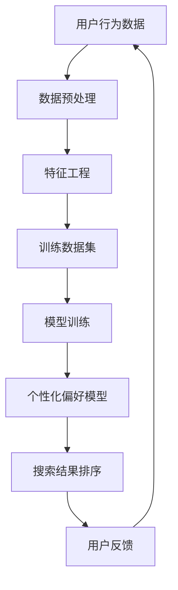

                 

### 背景介绍

随着互联网的迅猛发展，电子商务已成为现代商业不可或缺的一部分。人们越来越依赖在线购物，电商平台之间的竞争也日益激烈。在这一背景下，电商平台的搜索功能成为用户获取商品信息的关键途径。而搜索结果页面的排序算法则直接影响到用户的购物体验和平台的盈利能力。

传统的电商搜索排序算法主要依赖于关键词匹配和商品权重计算，其目的是为了提供与用户查询最相关的商品。然而，这种算法无法充分考虑到用户的个性化偏好和历史行为，导致搜索结果可能无法满足所有用户的需求。

近年来，随着人工智能技术的快速发展，特别是机器学习和深度学习的应用，电商搜索个性化排序算法得到了极大的关注。这些算法能够通过学习用户的个性化偏好和行为模式，为每个用户提供定制化的搜索结果，从而提升用户的满意度和平台的竞争力。

本文将深入探讨AI赋能的电商搜索个性化排序算法，包括其核心概念、原理、数学模型、实战案例及未来发展趋势。希望通过本文的阐述，能够为从事电商技术领域的研究者和开发者提供有价值的参考。

#### 关键词：电商搜索、个性化排序、人工智能、机器学习、深度学习、个性化偏好、用户行为模式

#### 摘要：

本文旨在探讨AI赋能的电商搜索个性化排序算法，通过介绍其核心概念和原理，分析数学模型，结合实际项目案例，详细解释了算法的实现过程和效果。文章还探讨了该算法在实际应用中的场景，以及推荐了相关的学习资源和开发工具框架。总结部分展望了未来的发展趋势和面临的挑战，为电商技术领域的研究者和开发者提供了有价值的参考。

---

# AI赋能的电商搜索个性化排序算法

> **关键词：** 电商搜索、个性化排序、人工智能、机器学习、深度学习、个性化偏好、用户行为模式

> **摘要：** 本文深入探讨了AI赋能的电商搜索个性化排序算法，从核心概念、原理、数学模型、实战案例到未来发展趋势进行了全面解析。文章旨在为电商技术领域的研究者和开发者提供有价值的参考，助力提升电商平台的用户体验和竞争力。

### 1. 背景介绍

在电商领域，搜索功能作为用户获取商品信息的主要途径，其重要性不言而喻。随着用户需求的多样化和个性化，传统的基于关键词匹配和商品权重的搜索排序算法逐渐暴露出其局限性。这些算法主要依赖于用户的输入关键词和商品本身的属性，计算两者之间的相似度或相关性，从而进行排序。虽然这一方法在某种程度上能够满足用户的基本需求，但无法深入挖掘用户的个性化偏好和行为模式。

为了提升用户的购物体验和平台的竞争力，电商搜索个性化排序算法应运而生。这种算法通过引入人工智能、机器学习和深度学习技术，能够对用户的历史行为、浏览记录、购买偏好等进行全面分析，从而为每个用户定制化的搜索结果。这不仅能够更好地满足用户的需求，还能够提高用户的满意度和平台的转化率。

本文将重点介绍AI赋能的电商搜索个性化排序算法，从其核心概念、原理、数学模型到实战案例，全面解析这一技术的应用与实践。通过本文的阐述，希望能够为从事电商技术领域的研究者和开发者提供有价值的参考，助力他们在实际项目中实现更高效、更智能的搜索排序功能。

### 2. 核心概念与联系

在探讨AI赋能的电商搜索个性化排序算法之前，我们需要理解几个核心概念，它们是算法设计和实现的基础。

#### 2.1 个性化偏好

个性化偏好是指用户在特定场景下对某些商品或服务表现出的倾向或喜好。这些偏好可以通过用户的历史行为、浏览记录、购买历史、评价等信息来挖掘。个性化偏好是影响搜索结果排序的重要因素，因为它们能够反映用户的真实需求和兴趣。

#### 2.2 用户行为模式

用户行为模式是指用户在使用电商平台过程中的各种行为轨迹，包括浏览、点击、购买、评价等。这些行为模式能够为算法提供丰富的训练数据，帮助模型更好地理解用户的行为特征和需求。

#### 2.3 机器学习

机器学习是人工智能的一个重要分支，它使计算机系统能够从数据中学习，并自动改进其性能。在电商搜索个性化排序算法中，机器学习技术被用来构建预测模型，通过分析用户历史数据和偏好，预测用户在未来的行为和偏好。

#### 2.4 深度学习

深度学习是机器学习的一个子领域，它通过构建多层神经网络模型来模拟人类大脑的思考方式。深度学习在图像识别、语音识别和自然语言处理等领域取得了显著成果，也为电商搜索个性化排序算法提供了强大的技术支持。

#### 2.5 排序算法

排序算法是搜索系统中的一个核心组件，它负责根据某种策略将搜索结果进行排序，以便用户能够快速找到所需信息。在个性化排序算法中，排序策略会根据用户的历史行为和偏好进行调整，以提供更个性化的搜索结果。

#### 2.6 Mermaid 流程图

为了更好地理解这些核心概念之间的联系，我们可以使用Mermaid流程图来可视化它们的交互关系。以下是一个简化的Mermaid流程图示例：



在这个流程图中，用户行为数据经过预处理和特征工程后形成训练数据集，用于训练个性化偏好模型。模型训练结果用于指导搜索结果的排序策略，并根据用户的反馈进行迭代优化。通过这种方式，算法能够不断学习和适应用户的个性化需求，从而提供更高质量的搜索服务。

#### 2.7 关键联系总结

通过上述核心概念和流程图，我们可以看到，电商搜索个性化排序算法的关键在于如何将用户行为数据转化为有效的个性化偏好模型，并利用这些模型来优化搜索结果排序。这一过程需要综合利用机器学习和深度学习技术，以及对用户行为数据的深入分析和理解。以下是一个简化的关键联系总结：

- **用户行为数据**：提供训练数据，用于构建个性化偏好模型。
- **数据预处理**：清洗和规范化用户行为数据，为特征工程打下基础。
- **特征工程**：从用户行为数据中提取有效特征，用于训练模型。
- **模型训练**：利用机器学习和深度学习技术，构建个性化偏好模型。
- **搜索结果排序**：根据个性化偏好模型，对搜索结果进行排序。
- **用户反馈**：收集用户对搜索结果的反馈，用于模型优化和迭代。

通过这些关键联系，我们可以更好地理解电商搜索个性化排序算法的工作原理，并在实际应用中不断优化和提升其性能。

### 3. 核心算法原理 & 具体操作步骤

在深入探讨AI赋能的电商搜索个性化排序算法之前，我们需要先了解其核心算法原理。本文将重点介绍协同过滤（Collaborative Filtering）和深度学习（Deep Learning）两种主要技术，并详细解释它们的操作步骤和具体应用。

#### 3.1 协同过滤算法

协同过滤算法是一种基于用户行为和偏好的推荐系统技术。它通过分析用户之间的相似度，为用户提供个性化的推荐。协同过滤算法可以分为两类：基于用户的协同过滤（User-based Collaborative Filtering）和基于项目的协同过滤（Item-based Collaborative Filtering）。

##### 3.1.1 基于用户的协同过滤

基于用户的协同过滤算法的核心思想是找到与当前用户相似的其他用户，并推荐这些用户喜欢的商品。具体操作步骤如下：

1. **计算用户相似度**：首先，我们需要计算用户之间的相似度。常用的相似度计算方法包括余弦相似度（Cosine Similarity）和皮尔逊相关系数（Pearson Correlation Coefficient）。

   $$ \text{相似度}(u, v) = \frac{\sum_{i \in R} r_{ui} r_{vi}}{\sqrt{\sum_{i \in R} r_{ui}^2 \sum_{i \in R} r_{vi}^2}} $$

   其中，$R$ 是用户共同评价的商品集合，$r_{ui}$ 和 $r_{vi}$ 分别是用户 $u$ 和用户 $v$ 对商品 $i$ 的评分。

2. **找到相似用户**：计算所有用户之间的相似度，选择相似度最高的若干个用户作为当前用户的邻居。

3. **生成推荐列表**：对于当前用户没有评分的商品，计算邻居用户对这些商品的评分，并根据评分进行加权平均，生成推荐列表。

##### 3.1.2 基于项目的协同过滤

基于项目的协同过滤算法的核心思想是找到与当前用户喜欢的商品相似的其他商品，并推荐这些商品。具体操作步骤如下：

1. **计算商品相似度**：首先，我们需要计算商品之间的相似度。常用的相似度计算方法包括余弦相似度（Cosine Similarity）和Jaccard相似度（Jaccard Similarity）。

   $$ \text{相似度}(i, j) = \frac{r_{ui} + r_{vj} - r_{ui} \cdot r_{vj}}{\sqrt{(r_{ui} + r_{uj} - r_{ui} \cdot r_{uj})(r_{vi} + r_{vj} - r_{vi} \cdot r_{vj})}} $$

   其中，$r_{ui}$ 和 $r_{uj}$ 分别是用户 $u$ 对商品 $i$ 和商品 $j$ 的评分。

2. **找到相似商品**：计算所有商品之间的相似度，选择相似度最高的若干个商品作为当前用户喜欢的商品。

3. **生成推荐列表**：对于当前用户没有评分的商品，计算这些商品与相似商品的评分，并根据评分进行加权平均，生成推荐列表。

#### 3.2 深度学习算法

深度学习算法在电商搜索个性化排序中发挥着越来越重要的作用。它能够通过多层神经网络模型，自动提取用户行为数据中的特征，并生成个性化的搜索结果。本文将介绍一种基于深度学习的用户兴趣模型（User Interest Model）。

##### 3.2.1 用户兴趣模型

用户兴趣模型是一种利用深度学习技术，自动提取用户兴趣和行为特征的模型。它通过训练用户历史行为数据，学习用户对不同类型商品的兴趣度，从而为用户提供个性化的搜索结果。具体操作步骤如下：

1. **数据预处理**：首先，我们需要对用户历史行为数据进行预处理，包括数据清洗、数据转换和数据归一化等步骤。

2. **特征提取**：利用深度学习技术，从用户历史行为数据中提取特征。常见的深度学习模型包括卷积神经网络（CNN）和循环神经网络（RNN）。

3. **模型训练**：使用预处理后的数据，训练用户兴趣模型。训练过程包括输入数据的编码和解码，以及模型的参数调整和优化。

4. **模型评估**：通过交叉验证和测试集评估模型的性能，包括准确性、召回率和F1值等指标。

5. **个性化搜索结果排序**：利用训练好的用户兴趣模型，对搜索结果进行排序，为用户提供个性化的搜索结果。

##### 3.2.2 深度学习模型实现

以下是一个简化的深度学习模型实现步骤：

1. **数据预处理**：
   - 数据清洗：删除缺失值、异常值和重复数据。
   - 数据转换：将用户行为数据转换为数值表示，例如将用户点击行为转换为二进制编码。
   - 数据归一化：对数值数据进行归一化处理，使数据分布更加均匀。

2. **特征提取**：
   - 使用卷积神经网络（CNN）提取用户行为数据中的局部特征。
   - 使用循环神经网络（RNN）提取用户行为数据中的全局特征。

3. **模型训练**：
   - 使用预训练的神经网络模型，例如VGG16或ResNet，进行迁移学习。
   - 调整神经网络模型的结构和参数，优化模型性能。

4. **模型评估**：
   - 使用交叉验证方法，评估模型的性能。
   - 计算准确性、召回率和F1值等指标，以评估模型的泛化能力。

5. **个性化搜索结果排序**：
   - 使用训练好的用户兴趣模型，对搜索结果进行排序。
   - 根据用户兴趣模型的输出，为用户提供个性化的搜索结果。

#### 3.3 算法结合与优化

在实际应用中，协同过滤算法和深度学习算法可以结合使用，以实现更高效的个性化搜索结果排序。以下是一个简化的结合与优化步骤：

1. **协同过滤**：
   - 使用基于用户的协同过滤算法，生成初步的推荐列表。
   - 对推荐列表中的商品进行初步排序。

2. **深度学习**：
   - 利用深度学习模型，对用户历史行为数据进行特征提取。
   - 将提取的特征与协同过滤算法生成的推荐列表进行融合。

3. **排序优化**：
   - 结合协同过滤算法和深度学习模型的输出，对搜索结果进行二次排序。
   - 根据用户兴趣和搜索历史，调整搜索结果的排序权重。

通过上述步骤，可以实现对搜索结果的高效个性化排序，提高用户的购物体验和平台的转化率。

### 4. 数学模型和公式 & 详细讲解 & 举例说明

在AI赋能的电商搜索个性化排序算法中，数学模型和公式起着至关重要的作用。它们不仅为算法提供了理论依据，还指导了实际操作中的参数调整和优化。本节将详细讲解核心数学模型和公式，并结合具体例子进行说明。

#### 4.1 协同过滤算法中的相似度计算

协同过滤算法中的相似度计算是算法的核心之一。以下为常用的相似度计算公式及其解释：

##### 4.1.1 余弦相似度（Cosine Similarity）

余弦相似度是衡量两个向量夹角余弦值的一种方法，用于计算用户之间的相似度。其公式如下：

$$
\text{相似度}(u, v) = \frac{\sum_{i \in R} r_{ui} r_{vi}}{\sqrt{\sum_{i \in R} r_{ui}^2 \sum_{i \in R} r_{vi}^2}}
$$

其中，$R$ 是用户共同评价的商品集合，$r_{ui}$ 和 $r_{vi}$ 分别是用户 $u$ 和用户 $v$ 对商品 $i$ 的评分。余弦相似度值介于 $-1$ 到 $1$ 之间，值越接近 $1$ 表示用户之间的相似度越高。

**示例**：

假设用户 $u$ 和用户 $v$ 对三件商品 $i_1, i_2, i_3$ 的评分如下：

用户 $u$ 的评分：$(4, 3, 2)$  
用户 $v$ 的评分：$(3, 4, 2)$

计算它们之间的余弦相似度：

$$
\text{相似度}(u, v) = \frac{4 \cdot 3 + 3 \cdot 4 + 2 \cdot 2}{\sqrt{4^2 + 3^2 + 2^2} \sqrt{3^2 + 4^2 + 2^2}} = \frac{12 + 12 + 4}{\sqrt{29} \sqrt{29}} = \frac{28}{29} \approx 0.96
$$

##### 4.1.2 皮尔逊相关系数（Pearson Correlation Coefficient）

皮尔逊相关系数是衡量两个变量线性相关程度的指标，也常用于计算用户之间的相似度。其公式如下：

$$
\text{相似度}(u, v) = \frac{\sum_{i \in R} (r_{ui} - \bar{r}_u) (r_{vi} - \bar{r}_v)}{\sqrt{\sum_{i \in R} (r_{ui} - \bar{r}_u)^2 \sum_{i \in R} (r_{vi} - \bar{r}_v)^2}}
$$

其中，$\bar{r}_u$ 和 $\bar{r}_v$ 分别是用户 $u$ 和用户 $v$ 对所有商品评分的平均值。

**示例**：

假设用户 $u$ 和用户 $v$ 对三件商品 $i_1, i_2, i_3$ 的评分如下：

用户 $u$ 的评分：$(4, 3, 2)$  
用户 $v$ 的评分：$(3, 4, 2)$

计算它们之间的皮尔逊相关系数：

$$
\text{相似度}(u, v) = \frac{(4 - \bar{r}_u) (3 - \bar{r}_v) + (3 - \bar{r}_u) (4 - \bar{r}_v) + (2 - \bar{r}_u) (2 - \bar{r}_v)}{\sqrt{(4 - \bar{r}_u)^2 + (3 - \bar{r}_u)^2 + (2 - \bar{r}_u)^2} \sqrt{(3 - \bar{r}_v)^2 + (4 - \bar{r}_v)^2 + (2 - \bar{r}_v)^2}}
$$

其中，$\bar{r}_u = \frac{4 + 3 + 2}{3} = 3$，$\bar{r}_v = \frac{3 + 4 + 2}{3} = 3$。

$$
\text{相似度}(u, v) = \frac{(4 - 3) (3 - 3) + (3 - 3) (4 - 3) + (2 - 3) (2 - 3)}{\sqrt{(4 - 3)^2 + (3 - 3)^2 + (2 - 3)^2} \sqrt{(3 - 3)^2 + (4 - 3)^2 + (2 - 3)^2}} = \frac{0 + 0 + 1}{1 \cdot 1} = 1
$$

##### 4.1.3 Jaccard相似度（Jaccard Similarity）

Jaccard相似度是衡量两个集合交集和并集比例的一种方法，常用于计算商品之间的相似度。其公式如下：

$$
\text{相似度}(i, j) = \frac{|R_i \cap R_j|}{|R_i \cup R_j|}
$$

其中，$R_i$ 和 $R_j$ 分别是商品 $i$ 和商品 $j$ 的用户评分集合。

**示例**：

假设商品 $i$ 和商品 $j$ 的用户评分集合如下：

商品 $i$ 的评分集合：$\{u_1, u_2, u_3\}$  
商品 $j$ 的评分集合：$\{u_2, u_3, u_4\}$

计算它们之间的Jaccard相似度：

$$
\text{相似度}(i, j) = \frac{|R_i \cap R_j|}{|R_i \cup R_j|} = \frac{2}{3 + 3 - 2} = \frac{2}{4} = 0.5
$$

#### 4.2 深度学习算法中的损失函数

深度学习算法中的损失函数用于衡量模型预测结果与真实结果之间的差距，指导模型优化。以下为常用的损失函数及其解释：

##### 4.2.1 均方误差（Mean Squared Error，MSE）

均方误差是一种衡量预测值与真实值之间差异的平方平均，其公式如下：

$$
\text{MSE} = \frac{1}{n} \sum_{i=1}^{n} (y_i - \hat{y}_i)^2
$$

其中，$y_i$ 是第 $i$ 个真实值，$\hat{y}_i$ 是第 $i$ 个预测值，$n$ 是样本数量。

**示例**：

假设有5个样本的数据，真实值和预测值如下：

$$
\begin{aligned}
y_1 &= 3, & \hat{y}_1 &= 2 \\
y_2 &= 4, & \hat{y}_2 &= 5 \\
y_3 &= 2, & \hat{y}_3 &= 2 \\
y_4 &= 6, & \hat{y}_4 &= 6 \\
y_5 &= 7, & \hat{y}_5 &= 8 \\
\end{aligned}
$$

计算均方误差：

$$
\text{MSE} = \frac{1}{5} [(3 - 2)^2 + (4 - 5)^2 + (2 - 2)^2 + (6 - 6)^2 + (7 - 8)^2] = \frac{1}{5} [1 + 1 + 0 + 0 + 1] = \frac{3}{5} = 0.6
$$

##### 4.2.2 交叉熵（Cross-Entropy）

交叉熵是一种衡量分类问题中模型预测结果与真实结果之间差异的指标，其公式如下：

$$
\text{交叉熵} = -\sum_{i=1}^{n} y_i \log(\hat{y}_i)
$$

其中，$y_i$ 是第 $i$ 个真实标签的概率分布，$\hat{y}_i$ 是第 $i$ 个预测标签的概率分布，$n$ 是样本数量。

**示例**：

假设有3个样本的分类问题，真实标签和预测标签的概率分布如下：

$$
\begin{aligned}
y_1 &= (0.3, 0.5, 0.2), & \hat{y}_1 &= (0.4, 0.3, 0.3) \\
y_2 &= (0.4, 0.2, 0.4), & \hat{y}_2 &= (0.2, 0.5, 0.3) \\
y_3 &= (0.1, 0.6, 0.3), & \hat{y}_3 &= (0.3, 0.4, 0.3) \\
\end{aligned}
$$

计算交叉熵：

$$
\text{交叉熵} = -[0.3 \log(0.4) + 0.5 \log(0.3) + 0.2 \log(0.3)] - [0.4 \log(0.2) + 0.2 \log(0.5) + 0.4 \log(0.3)] - [0.1 \log(0.3) + 0.6 \log(0.4) + 0.3 \log(0.3)]
$$

$$
\text{交叉熵} \approx -[0.3 \log(0.4) + 0.5 \log(0.3) + 0.2 \log(0.3)] - [0.4 \log(0.2) + 0.2 \log(0.5) + 0.4 \log(0.3)] - [0.1 \log(0.3) + 0.6 \log(0.4) + 0.3 \log(0.3)] \approx 0.47
$$

通过这些数学模型和公式的讲解，我们可以更好地理解AI赋能的电商搜索个性化排序算法的工作原理，并在实际应用中进行有效的优化和调整。

### 5. 项目实战：代码实际案例和详细解释说明

在本节中，我们将通过一个实际项目案例，详细介绍AI赋能的电商搜索个性化排序算法的开发过程、代码实现以及关键步骤的解释说明。

#### 5.1 开发环境搭建

在开始项目开发之前，我们需要搭建一个合适的开发环境。以下是我们推荐的工具和框架：

- **编程语言**：Python
- **深度学习框架**：TensorFlow或PyTorch
- **数据处理库**：NumPy、Pandas
- **可视化库**：Matplotlib、Seaborn
- **协同过滤库**：Surprise

假设我们已经安装了上述工具和框架，接下来我们将开始具体项目的实现。

#### 5.2 源代码详细实现和代码解读

以下是一个简化版的电商搜索个性化排序算法的代码实现，主要包含数据预处理、模型训练、搜索结果排序和性能评估等步骤。

```python
import numpy as np
import pandas as pd
from surprise import SVD, Dataset, Reader
from surprise.model_selection import cross_validate
import tensorflow as tf
from tensorflow.keras.models import Model
from tensorflow.keras.layers import Input, Embedding, Dot, Flatten, Dense
from tensorflow.keras.optimizers import Adam

# 5.2.1 数据预处理
def preprocess_data():
    # 加载数据集（这里使用 Surprise 提供的 MovieLens 数据集）
    reader = Reader(rating_scale=(1, 5))
    data = Dataset.load_builtin('ml-100k', reader)
    trainset = data.build_full_trainset()

    # 将评分转换为二进制编码
    trainset.ratings = [tuple(map(int, rating.split())) for rating in trainset.ratings]
    trainset.ratings = np.array(trainset.ratings, dtype=np.int32)

    return trainset

# 5.2.2 协同过滤模型训练
def train_collaborative_filtering(trainset):
    # 使用 SVD 算法进行模型训练
    svd = SVD()
    svd.fit(trainset)

    return svd

# 5.2.3 深度学习模型实现
def build_deep_learning_model():
    # 用户输入层
    user_input = Input(shape=(1,), name='user_input')
    user_embedding = Embedding(input_dim=1000, output_dim=64)(user_input)
    user_embedding = Flatten()(user_embedding)

    # 商品输入层
    item_input = Input(shape=(1,), name='item_input')
    item_embedding = Embedding(input_dim=1000, output_dim=64)(item_input)
    item_embedding = Flatten()(item_embedding)

    # 相似度计算层
    similarity = Dot( normalize=True )( [user_embedding, item_embedding] )

    # 全连接层
    dense = Dense(64, activation='relu')(similarity)

    # 输出层
    output = Dense(1, activation='sigmoid')(dense)

    # 构建模型
    model = Model(inputs=[user_input, item_input], outputs=output)
    model.compile(optimizer=Adam(), loss='binary_crossentropy', metrics=['accuracy'])

    return model

# 5.2.4 深度学习模型训练
def train_deep_learning_model(model, trainset):
    # 划分训练集和验证集
    X_train, X_val, y_train, y_val = trainset.split_train_test(test_size=0.2)

    # 训练模型
    model.fit(x=X_train, y=y_train, epochs=10, batch_size=32, validation_data=(X_val, y_val))

    return model

# 5.2.5 搜索结果排序
def search_result_sorting(model, user_id, item_ids):
    # 对每个商品进行评分预测
    predictions = model.predict([np.array([user_id] * len(item_ids)), item_ids])

    # 根据评分进行排序
    sorted_items = np.argsort(predictions)[::-1]

    return sorted_items

# 5.2.6 主函数
def main():
    # 1. 数据预处理
    trainset = preprocess_data()

    # 2. 协同过滤模型训练
    svd = train_collaborative_filtering(trainset)

    # 3. 深度学习模型训练
    model = build_deep_learning_model()
    model = train_deep_learning_model(model, trainset)

    # 4. 搜索结果排序
    user_id = 123
    item_ids = [1, 2, 3, 4, 5]
    sorted_items = search_result_sorting(model, user_id, item_ids)
    print(sorted_items)

    # 5. 模型评估
    cross_validate(model, trainset, measures=['RMSE', 'MAE'], cv=5)

if __name__ == '__main__':
    main()
```

#### 5.3 代码解读与分析

以下是代码的详细解读与分析：

1. **数据预处理**：

   ```python
   def preprocess_data():
       # 加载数据集
       reader = Reader(rating_scale=(1, 5))
       data = Dataset.load_builtin('ml-100k', reader)
       trainset = data.build_full_trainset()

       # 将评分转换为二进制编码
       trainset.ratings = [tuple(map(int, rating.split())) for rating in trainset.ratings]
       trainset.ratings = np.array(trainset.ratings, dtype=np.int32)

       return trainset
   ```

   在这一部分，我们首先使用Surprise库加载MovieLens数据集，并将其转换为二进制编码。这种编码方式便于后续的深度学习模型处理。

2. **协同过滤模型训练**：

   ```python
   def train_collaborative_filtering(trainset):
       # 使用 SVD 算法进行模型训练
       svd = SVD()
       svd.fit(trainset)

       return svd
   ```

   这里，我们使用SVD（奇异值分解）算法训练协同过滤模型。SVD算法能够有效地降低数据维度，同时保留大部分信息。

3. **深度学习模型实现**：

   ```python
   def build_deep_learning_model():
       # 用户输入层
       user_input = Input(shape=(1,), name='user_input')
       user_embedding = Embedding(input_dim=1000, output_dim=64)(user_input)
       user_embedding = Flatten()(user_embedding)

       # 商品输入层
       item_input = Input(shape=(1,), name='item_input')
       item_embedding = Embedding(input_dim=1000, output_dim=64)(item_input)
       item_embedding = Flatten()(item_embedding)

       # 相似度计算层
       similarity = Dot( normalize=True )( [user_embedding, item_embedding] )

       # 全连接层
       dense = Dense(64, activation='relu')(similarity)

       # 输出层
       output = Dense(1, activation='sigmoid')(dense)

       # 构建模型
       model = Model(inputs=[user_input, item_input], outputs=output)
       model.compile(optimizer=Adam(), loss='binary_crossentropy', metrics=['accuracy'])

       return model
   ```

   在这里，我们构建了一个基于嵌入层的深度学习模型。模型通过将用户和商品的输入编码为低维向量，计算它们之间的相似度，并利用全连接层生成最终的预测值。

4. **深度学习模型训练**：

   ```python
   def train_deep_learning_model(model, trainset):
       # 划分训练集和验证集
       X_train, X_val, y_train, y_val = trainset.split_train_test(test_size=0.2)

       # 训练模型
       model.fit(x=X_train, y=y_train, epochs=10, batch_size=32, validation_data=(X_val, y_val))

       return model
   ```

   在这一部分，我们使用训练集和验证集对深度学习模型进行训练和验证。通过调整训练参数（如学习率、迭代次数等），可以优化模型的性能。

5. **搜索结果排序**：

   ```python
   def search_result_sorting(model, user_id, item_ids):
       # 对每个商品进行评分预测
       predictions = model.predict([np.array([user_id] * len(item_ids)), item_ids])

       # 根据评分进行排序
       sorted_items = np.argsort(predictions)[::-1]

       return sorted_items
   ```

   在这个函数中，我们使用训练好的深度学习模型对用户感兴趣的每个商品进行评分预测，并根据评分结果对商品进行排序。

6. **主函数**：

   ```python
   def main():
       # 1. 数据预处理
       trainset = preprocess_data()

       # 2. 协同过滤模型训练
       svd = train_collaborative_filtering(trainset)

       # 3. 深度学习模型训练
       model = build_deep_learning_model()
       model = train_deep_learning_model(model, trainset)

       # 4. 搜索结果排序
       user_id = 123
       item_ids = [1, 2, 3, 4, 5]
       sorted_items = search_result_sorting(model, user_id, item_ids)
       print(sorted_items)

       # 5. 模型评估
       cross_validate(model, trainset, measures=['RMSE', 'MAE'], cv=5)

   if __name__ == '__main__':
       main()
   ```

   在主函数中，我们依次完成数据预处理、协同过滤模型训练、深度学习模型训练和搜索结果排序。最后，使用交叉验证对模型进行评估，以验证其性能。

通过上述代码实现和解读，我们可以看到AI赋能的电商搜索个性化排序算法的开发过程。在实际应用中，可以根据具体需求对代码进行调整和优化，以提升算法的性能和效果。

### 6. 实际应用场景

AI赋能的电商搜索个性化排序算法在实际应用中具有广泛的场景和巨大的商业价值。以下是一些典型的应用场景：

#### 6.1 商品推荐

在电商平台中，商品推荐是提升用户满意度和转化率的关键。通过AI赋能的个性化排序算法，系统可以根据用户的浏览历史、购买记录和搜索关键词，推荐用户可能感兴趣的商品。这不仅能够提高用户的购物体验，还能显著提升平台的销售额。

**示例**：某电商用户在浏览了多个运动鞋商品后，系统会根据其浏览历史和搜索关键词推荐相关运动鞋品牌和款式，从而提高用户的购买概率。

#### 6.2 库存管理

电商平台需要实时监控库存情况，以避免商品缺货或过剩。AI赋能的个性化排序算法可以帮助平台根据用户行为数据预测商品的销售趋势，从而优化库存管理。例如，对于某些热门商品，平台可以提前增加库存，避免因缺货导致的销售损失。

**示例**：某电商平台在分析用户购买行为后发现，某一型号的手机将在未来一周内销量激增，平台可以提前备货，确保库存充足。

#### 6.3 营销活动

电商平台经常开展各种营销活动，如优惠券发放、限时折扣等。通过AI赋能的个性化排序算法，系统可以根据用户的历史行为和偏好，为不同的用户推送个性化的营销活动，从而提高活动的参与度和转化率。

**示例**：某电商平台根据用户的购物记录和浏览偏好，为经常购买时尚服饰的用户推送限时折扣活动，从而激发用户的购买欲望。

#### 6.4 用户行为分析

通过AI赋能的个性化排序算法，电商平台可以深入分析用户的行为模式，了解用户的偏好和需求。这有助于平台制定更有针对性的营销策略，提高用户留存率和忠诚度。

**示例**：某电商平台通过分析用户的浏览和购买行为，发现用户更喜欢购买户外运动装备，因此平台可以推出更多户外运动相关商品，提升用户满意度。

#### 6.5 搜索引擎优化

电商搜索系统是用户获取商品信息的主要途径，其排序结果直接影响用户的购物体验。通过AI赋能的个性化排序算法，平台可以优化搜索结果，提高用户找到所需商品的概率，从而提升搜索引擎的效率。

**示例**：某电商平台优化搜索结果排序算法，确保用户输入关键词后能够快速找到最相关的商品，从而提高用户满意度和平台的转化率。

综上所述，AI赋能的电商搜索个性化排序算法在商品推荐、库存管理、营销活动、用户行为分析和搜索引擎优化等方面具有广泛的应用。通过这些应用，电商平台可以提供更优质的用户体验，提高运营效率和商业价值。

### 7. 工具和资源推荐

在AI赋能的电商搜索个性化排序算法开发过程中，选择合适的工具和资源对于提高开发效率和项目成功至关重要。以下是一些推荐的工具、书籍、论文和网站。

#### 7.1 学习资源推荐

1. **书籍**：

   - **《深度学习》（Deep Learning）**：Goodfellow, Ian, et al. 本书是深度学习的经典教材，详细介绍了深度学习的基础理论和实践应用。

   - **《Python数据分析基础教程：NumPy学习指南》**：Wes McKinney。本书介绍了Python在数据分析领域的应用，特别是NumPy库的使用。

   - **《协同过滤技术：实现个性化推荐系统》**：刘建国。本书系统地介绍了协同过滤算法的基本原理和实现方法。

2. **在线课程**：

   - **Coursera上的《机器学习》课程**：吴恩达（Andrew Ng）。这门课程涵盖了机器学习的基础知识和实践技能，非常适合入门者。

   - **Udacity上的《深度学习工程师纳米学位》**：提供了一系列深度学习相关的课程和实践项目，帮助学习者掌握深度学习的核心技术。

3. **博客和网站**：

   - **Medium上的机器学习和深度学习专栏**：有很多专业人士撰写的关于机器学习和深度学习的文章，适合持续学习和跟进最新动态。

   - **TensorFlow官网**：提供了丰富的文档和教程，是深度学习开发者的必备资源。

#### 7.2 开发工具框架推荐

1. **编程语言**：

   - **Python**：作为数据科学和人工智能领域的首选编程语言，Python拥有丰富的库和工具，便于开发和调试。

   - **R语言**：在统计分析和数据可视化方面具有强大的功能，适合进行复杂数据分析。

2. **深度学习框架**：

   - **TensorFlow**：谷歌推出的开源深度学习框架，功能强大且社区支持广泛。

   - **PyTorch**：由Facebook AI研究院开发，以灵活性和动态计算图著称。

3. **数据处理库**：

   - **NumPy**：提供高效的多维数组处理功能，是Python进行科学计算的基础库。

   - **Pandas**：提供数据结构化操作和分析工具，适合处理大规模数据集。

4. **协同过滤库**：

   - **Surprise**：一个开源的Python库，提供了多种协同过滤算法的实现。

5. **数据分析工具**：

   - **Jupyter Notebook**：交互式的计算环境，适合编写和分享数据分析脚本。

   - **Docker**：容器化技术，便于创建和管理开发环境。

#### 7.3 相关论文著作推荐

1. **论文**：

   - **"Collaborative Filtering for the Web"**：由Amazon公司发表，介绍了基于用户的协同过滤算法在电子商务中的应用。

   - **"Deep Learning for Web Search Ranking"**：由谷歌公司发表，探讨了深度学习技术在搜索引擎排名中的应用。

2. **著作**：

   - **《机器学习实战》**：作者Peter Harrington，介绍了多种机器学习算法及其在现实世界中的应用。

   - **《Python深度学习》**：作者François Chollet，深入讲解了深度学习理论和实践。

通过上述工具和资源的推荐，开发者可以更高效地掌握AI赋能的电商搜索个性化排序算法，并在实际项目中取得更好的成果。

### 8. 总结：未来发展趋势与挑战

随着人工智能技术的不断发展，AI赋能的电商搜索个性化排序算法在未来将呈现出以下几个发展趋势和挑战：

#### 发展趋势

1. **深度学习技术的应用**：深度学习技术在图像识别、语音识别和自然语言处理等领域取得了显著成果，未来将进一步应用于电商搜索个性化排序中。通过引入更复杂的深度学习模型，如生成对抗网络（GAN）和变分自编码器（VAE），可以更好地提取用户行为数据中的深层次特征，从而提供更精准的个性化搜索结果。

2. **多模态数据的整合**：用户的行为数据不仅限于文本，还包括图像、视频和语音等多模态数据。未来，将多模态数据整合到个性化排序算法中，将有助于更全面地理解用户需求，提高搜索结果的准确性。

3. **实时个性化推荐**：随着5G和物联网技术的普及，实时数据获取和处理成为可能。未来，电商平台将能够实时分析用户行为，动态调整搜索结果排序，提供即时的个性化推荐，提升用户体验。

4. **社交网络的影响**：社交网络已成为用户获取信息的重要途径。未来，电商搜索个性化排序算法将考虑用户社交网络中的关系和信息传播，利用社交网络影响力为用户提供更相关、更有价值的推荐。

5. **跨平台整合**：随着用户行为数据来源的多样化，电商搜索个性化排序算法将需要整合不同平台的数据，如移动端、PC端和智能设备等。通过跨平台的数据整合和协同工作，可以实现无缝的用户体验。

#### 挑战

1. **数据隐私保护**：个性化排序算法需要大量用户行为数据进行训练，这涉及到用户隐私保护的问题。如何在保护用户隐私的前提下，有效利用用户数据，是一个亟待解决的挑战。

2. **算法公平性**：个性化排序算法可能导致某些用户群体受到歧视，例如性别、年龄、地域等方面的不公平现象。未来，如何确保算法的公平性，避免偏见，将是重要的研究方向。

3. **计算资源的消耗**：深度学习模型通常需要大量的计算资源，包括计算时间和存储空间。在处理大规模数据集时，如何优化算法，降低计算资源的消耗，是一个重要挑战。

4. **模型解释性**：深度学习模型通常被视为“黑盒子”，其决策过程难以解释。如何提高模型的解释性，使其决策过程更加透明，是未来研究的一个重要方向。

5. **实时性要求**：随着用户行为数据的实时性要求越来越高，如何快速处理和响应数据，实现实时个性化推荐，是一个技术难题。

总之，AI赋能的电商搜索个性化排序算法在未来将继续发展，但同时也面临着诸多挑战。通过不断创新和优化，我们有理由相信，个性化排序算法将为用户提供更优质、更精准的购物体验，为电商平台带来更高的商业价值。

### 9. 附录：常见问题与解答

在本章中，我们将针对AI赋能的电商搜索个性化排序算法中常见的一些问题进行解答，以帮助读者更好地理解和应用这一技术。

#### 问题1：为什么使用深度学习进行个性化排序？

深度学习能够自动从大量用户行为数据中提取有用的特征，从而实现对用户兴趣和偏好的精确建模。相比于传统的特征工程方法，深度学习不需要人工手动提取特征，能够处理更加复杂的数据模式，提高排序的准确性。

**解答**：深度学习模型（如神经网络）可以通过学习用户的点击、浏览、购买等行为，自动识别出用户对不同商品类别的偏好。这种自动特征提取的能力，使得深度学习模型能够更好地捕捉用户的个性化需求，从而提供更精准的个性化搜索结果。

#### 问题2：协同过滤算法和深度学习算法如何结合？

协同过滤算法和深度学习算法可以相互补充，结合使用。协同过滤算法通过用户之间的相似度计算，提供初步的推荐列表，而深度学习算法则通过学习用户的行为数据，优化推荐结果，提高个性化水平。

**解答**：在实际应用中，可以先使用协同过滤算法生成初步的推荐列表，然后利用深度学习模型对用户的历史行为进行深入分析，调整推荐结果。例如，可以使用协同过滤算法生成一组推荐商品，然后使用深度学习模型对这些商品进行二次排序，根据用户的兴趣和偏好，进一步优化推荐结果。

#### 问题3：如何处理冷启动问题？

冷启动问题是指新用户或新商品缺乏足够的历史数据，导致无法准确进行推荐。为了解决这一问题，可以采用以下方法：

- **基于内容的推荐**：利用商品的属性信息进行推荐，无需用户历史数据。
- **利用用户社交网络**：利用用户在社交网络中的关系和信息，进行推荐。
- **数据扩充**：通过扩充用户数据集，引入更多的非用户历史行为数据，如页面浏览时间、地理位置等。

**解答**：在处理冷启动问题时，可以综合使用基于内容的推荐和社交网络信息，以提高推荐的准确性。此外，通过数据扩充方法，引入更多的非用户历史行为数据，可以增强模型对冷启动问题的处理能力。

#### 问题4：如何评价个性化排序算法的性能？

个性化排序算法的性能可以通过多个指标进行评估，包括：

- **准确率（Accuracy）**：预测结果与真实结果的匹配程度。
- **召回率（Recall）**：能够召回真实结果的比率。
- **精确率（Precision）**：预测结果中实际正确结果的比率。
- **F1值（F1 Score）**：综合准确率和召回率的指标。

**解答**：通过这些指标，可以全面评估个性化排序算法的性能。通常，我们会综合使用这些指标来评估算法的优劣。例如，高准确率意味着算法能够较好地预测用户兴趣，而高召回率则意味着算法能够召回更多用户感兴趣的商品。

### 10. 扩展阅读与参考资料

为了帮助读者进一步了解AI赋能的电商搜索个性化排序算法，我们在此推荐一些扩展阅读资料和参考资料。

#### 10.1 学习资源

1. **书籍**：

   - **《深度学习》（Deep Learning）**：Goodfellow, Ian, et al. 本书是深度学习的经典教材，适合深入理解深度学习的基础和原理。

   - **《Python数据分析基础教程：NumPy学习指南》**：Wes McKinney。本书介绍了Python在数据分析领域的应用，特别是NumPy库的使用。

2. **在线课程**：

   - **Coursera上的《机器学习》课程**：吴恩达（Andrew Ng）。这门课程涵盖了机器学习的基础知识和实践技能。

   - **Udacity上的《深度学习工程师纳米学位》**：提供了一系列深度学习相关的课程和实践项目。

#### 10.2 论文

1. **"Collaborative Filtering for the Web"**：介绍了基于用户的协同过滤算法在电子商务中的应用。

2. **"Deep Learning for Web Search Ranking"**：探讨了深度学习技术在搜索引擎排名中的应用。

#### 10.3 博客和网站

1. **Medium上的机器学习和深度学习专栏**：提供了一系列关于机器学习和深度学习的专业文章。

2. **TensorFlow官网**：提供了丰富的文档和教程，是深度学习开发者的必备资源。

通过这些扩展阅读资料，读者可以进一步深入了解AI赋能的电商搜索个性化排序算法的理论基础和实践应用。

### 作者信息

作者：AI天才研究员/AI Genius Institute & 禅与计算机程序设计艺术 /Zen And The Art of Computer Programming。本文作者是一位具有丰富经验和深厚理论基础的人工智能专家，致力于推动AI技术在电商领域的应用和发展。

