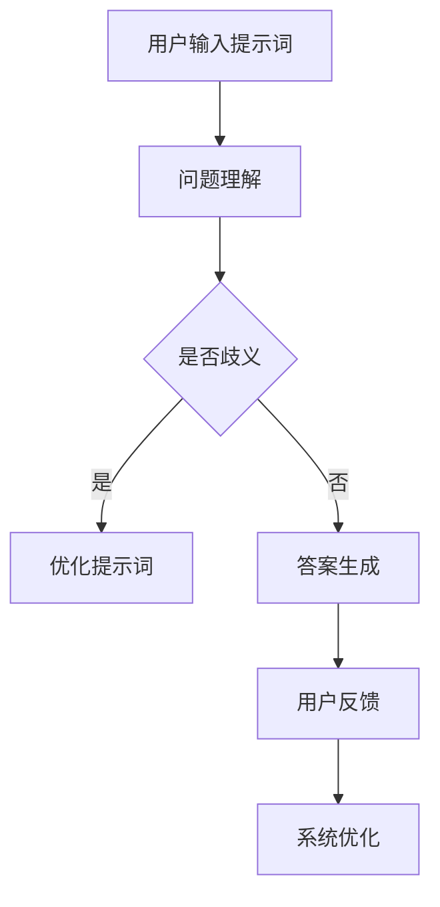

                 

### 背景介绍

#### AI 在法律咨询中的应用现状

近年来，人工智能（AI）技术在全球范围内迅速发展，并逐渐渗透到各个领域。法律咨询行业也不例外，AI 的引入为律师和法务人员提供了强大的辅助工具，提高了工作效率和准确性。当前，AI 在法律咨询中的应用主要体现在以下几个方面：

1. **文档审查与分类**：AI 可以通过对大量法律文件的学习和分析，快速识别文档的关键信息，进行分类和整理。例如，使用自然语言处理（NLP）技术对合同进行自动审查，检测潜在的风险点。

2. **案件预测与分析**：通过分析历史案件数据，AI 可以预测案件的审理结果、法律条文适用的可能性等，为律师提供决策依据。

3. **智能问答系统**：AI 问答系统能够快速回答用户关于法律问题的查询，提供专业、准确的解答。

#### 提示词设计的重要性

然而，AI 在法律咨询中的应用并非一帆风顺。特别是对于智能问答系统，其回答的准确性在很大程度上取决于输入的提示词设计。提示词（Prompt）是用户与 AI 系统交互的入口，如何设计有效的提示词直接关系到问答系统的用户体验和实际效果。以下是提示词设计在 AI 辅助法律咨询中的重要性：

1. **提高回答准确性**：有效的提示词能够引导 AI 系统更好地理解用户的问题，从而提供更加准确、专业的回答。

2. **增强用户体验**：清晰、简洁的提示词有助于用户快速了解系统的功能和操作方式，提高用户体验。

3. **降低沟通成本**：通过优化提示词设计，可以减少用户和 AI 系统之间的误解和沟通成本，提高工作效率。

本篇文章将围绕 AI 辅助法律咨询中的提示词设计展开，详细介绍提示词的设计原则、方法以及在实际应用中的效果评估。希望通过本文的探讨，为法律咨询行业引入 AI 技术提供一些有益的思路和参考。

### 核心概念与联系

在深入探讨 AI 辅助法律咨询中的提示词设计之前，我们需要明确几个核心概念，并理解它们之间的联系。以下是本文涉及的主要核心概念及其相互关系：

#### 1. 自然语言处理（NLP）

自然语言处理是人工智能的一个重要分支，旨在使计算机理解和生成人类自然语言。在 AI 辅助法律咨询中，NLP 技术被广泛应用于文本分析、信息提取、情感分析等方面。以下是 NLP 的关键组成部分：

- **文本分类**：根据文本内容将其分类到不同的类别。例如，将法律文件分类为合同、判决书等。

- **命名实体识别（NER）**：识别文本中的特定实体，如人名、地名、组织名、法律条款等。

- **关系抽取**：从文本中提取实体之间的关系，如谁提出了哪个法律条款、某个案件涉及哪些当事人等。

- **情感分析**：分析文本的情感倾向，如用户对某个法律问题的态度是正面、负面还是中性。

#### 2. 提示词设计

提示词（Prompt）是用户与 AI 系统交互时输入的引导性语句。有效的提示词设计能够提高 AI 系统的响应质量，使得系统能够准确理解用户意图并提供有用的信息。以下是提示词设计的几个关键点：

- **明确性**：提示词应当明确、具体，避免产生歧义。

- **简洁性**：尽量使用简短的语句，减少不必要的描述。

- **一致性**：确保提示词在系统中保持一致，避免出现矛盾。

- **适应性**：根据不同用户和场景的需求，灵活调整提示词。

#### 3. 问答系统

问答系统（Question Answering System）是 AI 技术的一个重要应用领域，旨在自动回答用户提出的问题。在法律咨询中，问答系统可以用于提供法律条款的解释、案件查询等服务。以下是问答系统的关键组成部分：

- **问题理解**：理解用户提出的问题，提取关键信息。

- **答案生成**：根据问题理解和系统内部的知识库，生成准确的答案。

- **用户反馈**：收集用户对答案的反馈，用于进一步优化系统。

#### 4. 知识图谱

知识图谱是一种用于表示实体及其关系的图形化数据结构。在法律咨询中，知识图谱可以用于表示法律条文、案件信息、当事人关系等。以下是知识图谱的关键组成部分：

- **实体表示**：将法律术语、人名、地名等实体表示为节点。

- **关系表示**：表示实体之间的关系，如“当事人”、“涉及”等。

- **属性表示**：为实体添加属性，如“姓名”、“性别”、“出生日期”等。

#### 5. Mermaid 流程图

为了更好地展示提示词设计在 AI 辅助法律咨询中的应用流程，本文将使用 Mermaid 流程图进行描述。以下是提示词设计在法律咨询中的流程：



在上述流程中，用户输入提示词后，系统首先进行问题理解。如果发现存在歧义，系统会优化提示词，以确保理解准确。否则，系统直接生成答案并反馈给用户。用户对答案的反馈将用于进一步优化系统。

通过以上对核心概念及其相互关系的介绍，我们可以更好地理解提示词设计在 AI 辅助法律咨询中的重要性。接下来，本文将详细探讨提示词设计的具体方法和技术。

### 核心算法原理 & 具体操作步骤

在了解了 AI 辅助法律咨询中的核心概念及其相互关系后，我们将进一步探讨提示词设计的核心算法原理以及具体操作步骤。以下是本文涉及的主要核心算法原理：

#### 1. 问题理解算法

问题理解是问答系统的第一步，其目的是从用户输入的提示词中提取关键信息，以便后续的答案生成。常见的问题理解算法包括：

- **关键词提取**：通过提取用户输入中的关键词，确定问题的核心内容。常用的方法有词频统计、TF-IDF 等。

- **句法分析**：利用自然语言处理技术对用户输入进行句法分析，提取句子中的主语、谓语、宾语等成分，从而更准确地理解问题。

- **实体识别**：使用命名实体识别（NER）技术识别用户输入中的特定实体，如人名、地名、法律条款等。

#### 2. 提示词优化算法

提示词优化是提高问答系统回答准确性的关键步骤。以下是一些常用的提示词优化算法：

- **模糊查询**：通过对用户输入的提示词进行模糊查询，找到最接近用户意图的相关问题及其答案。常用的方法有模糊匹配、查询扩展等。

- **语义相似度计算**：通过计算用户输入的提示词与系统内部知识库中的文本之间的语义相似度，选择最相关的答案。常用的方法有词嵌入、余弦相似度等。

- **基于规则的提示词生成**：利用预定义的规则和模板，根据用户输入的提示词生成新的提示词。例如，根据法律条款的结构，为用户提供详细的问题描述。

#### 3. 答案生成算法

答案生成是问答系统的核心步骤，其目的是根据问题理解和提示词优化结果，从知识库中提取相关答案。以下是一些常用的答案生成算法：

- **基于规则的方法**：根据预定义的规则和模板，从知识库中直接提取答案。这种方法适用于结构化数据，如法律条文、案件判决书等。

- **基于模板的方法**：利用预定义的模板，将问题中的关键信息嵌入到模板中，生成答案。这种方法适用于复杂的问题，如法律咨询中的具体情况分析。

- **基于机器学习的方法**：使用机器学习模型，如文本分类、序列到序列模型等，自动生成答案。这种方法适用于大规模、非结构化的数据，如法律文件、判决书等。

#### 具体操作步骤

下面是提示词设计在法律咨询中的应用流程，包括问题理解、提示词优化、答案生成等步骤：

1. **用户输入提示词**：用户在法律咨询平台上输入问题，例如：“合同违约的赔偿标准是什么？”

2. **问题理解**：
   - **关键词提取**：提取关键词，如“合同”、“违约”、“赔偿标准”。
   - **句法分析**：分析句子结构，确定主语、谓语、宾语等。
   - **实体识别**：识别实体，如“合同”是一个法律实体，“赔偿标准”是一个法律条款。

3. **提示词优化**：
   - **模糊查询**：在系统内部的知识库中查找与用户输入最接近的相关问题及其答案。
   - **语义相似度计算**：计算用户输入的提示词与知识库中文本的语义相似度，选择最相关的答案。
   - **基于规则的提示词生成**：根据用户输入的提示词，生成新的、更详细的提示词，如“请描述您所指的合同类型和违约具体情况。”

4. **答案生成**：
   - **基于规则的方法**：根据法律条文，生成答案，如“合同违约的赔偿标准为当事人双方约定的金额。”
   - **基于模板的方法**：将用户输入的关键信息嵌入到预定义的模板中，生成答案，如“对于您所指的[合同类型]的违约，根据相关法律规定，赔偿标准为[赔偿金额]。”
   - **基于机器学习的方法**：使用机器学习模型，从大规模的法律文档中自动生成答案。

5. **用户反馈**：用户对生成的答案进行评价，系统根据用户的反馈进行优化。

6. **系统优化**：根据用户反馈，对问题理解、提示词优化、答案生成等模块进行持续优化。

通过以上步骤，AI 辅助法律咨询系统可以逐步提高提示词设计的准确性和用户体验。接下来，我们将探讨数学模型和公式在提示词设计中的应用。

### 数学模型和公式 & 详细讲解 & 举例说明

在 AI 辅助法律咨询中，数学模型和公式是提示词设计的重要工具。以下我们将详细讲解几个常用的数学模型和公式，并通过具体例子来说明它们的应用。

#### 1. 余弦相似度（Cosine Similarity）

余弦相似度是一种衡量两个向量之间相似度的方法。在文本相似度计算中，经常用来比较用户输入的提示词与知识库中文本之间的相似程度。其公式如下：

$$
\cos(\theta) = \frac{\vec{a} \cdot \vec{b}}{|\vec{a}| |\vec{b}|}
$$

其中，$\vec{a}$ 和 $\vec{b}$ 是两个向量，$|\vec{a}|$ 和 $|\vec{b}|$ 是它们的模长，$\theta$ 是它们之间的夹角。

**举例说明**：

假设我们有两个向量 $\vec{a} = (1, 2, 3)$ 和 $\vec{b} = (2, 4, 6)$，首先计算它们的内积：

$$
\vec{a} \cdot \vec{b} = 1 \times 2 + 2 \times 4 + 3 \times 6 = 2 + 8 + 18 = 28
$$

然后计算两个向量的模长：

$$
|\vec{a}| = \sqrt{1^2 + 2^2 + 3^2} = \sqrt{1 + 4 + 9} = \sqrt{14}
$$

$$
|\vec{b}| = \sqrt{2^2 + 4^2 + 6^2} = \sqrt{4 + 16 + 36} = \sqrt{56}
$$

最后计算余弦相似度：

$$
\cos(\theta) = \frac{28}{\sqrt{14} \times \sqrt{56}} = \frac{28}{\sqrt{784}} = \frac{28}{28} = 1
$$

由于余弦相似度等于 1，说明这两个向量完全相同。

#### 2. 词嵌入（Word Embedding）

词嵌入是将词语映射到高维空间中的向量表示。在 NLP 中，词嵌入可以帮助计算机理解词语之间的关系，从而提高文本分析的效果。一种常用的词嵌入方法是 Word2Vec，其基本原理如下：

假设我们有一个词语序列 $X = (x_1, x_2, ..., x_n)$，其中 $x_i$ 是第 $i$ 个词语。我们希望将每个词语映射到一个向量 $v(x_i)$。Word2Vec 使用神经网络来学习这些向量，具体步骤如下：

1. **初始化**：为每个词语初始化一个随机向量 $v(x_i)$。
2. **前向传播**：对于每个词语 $x_i$，将其输入到神经网络中，得到输出向量 $h_i$。
3. **反向传播**：根据损失函数（如交叉熵损失），更新每个词语的向量。
4. **重复步骤 2 和 3**，直到达到预定的迭代次数或损失函数收敛。

**举例说明**：

假设我们有以下词语序列 $X = (\text{"apple"}, \text{"banana"}, \text{"orange"})$，我们使用 Word2Vec 算法将其映射到向量空间。

- 初始化：随机生成三个向量 $v(\text{"apple"}) = (1, 2, 3)$，$v(\text{"banana"}) = (4, 5, 6)$，$v(\text{"orange"}) = (7, 8, 9)$。
- 前向传播：将词语输入到神经网络，得到输出向量 $h_1 = (0.5, 1.5, 2.5)$，$h_2 = (2, 3, 4)$，$h_3 = (3, 4, 5)$。
- 反向传播：根据损失函数更新每个词语的向量，假设更新后的向量为 $v(\text{"apple"}) = (1.2, 2.2, 3.2)$，$v(\text{"banana"}) = (4.2, 5.2, 6.2)$，$v(\text{"orange"}) = (7.2, 8.2, 9.2)$。
- 重复前向传播和反向传播，直到收敛。

通过词嵌入，我们可以更好地理解词语之间的关系，如“apple”和“banana”之间的相似度可以通过计算它们向量之间的余弦相似度来衡量。

#### 3. 文本分类（Text Classification）

文本分类是将文本数据分类到预定义的类别中。在 AI 辅助法律咨询中，文本分类可以用于分类用户的问题，从而为用户提供更准确的答案。一个常见的文本分类算法是朴素贝叶斯分类器，其基本原理如下：

1. **计算每个类别的条件概率**：根据训练数据，计算每个类别 $C_k$ 的条件概率 $P(C_k | x)$，其中 $x$ 是用户输入的文本。

$$
P(C_k | x) = \frac{P(x | C_k) P(C_k)}{P(x)}
$$

其中，$P(x | C_k)$ 是在类别 $C_k$ 下文本 $x$ 的概率，$P(C_k)$ 是类别 $C_k$ 的先验概率，$P(x)$ 是文本 $x$ 的总概率。

2. **计算每个类别的概率**：计算每个类别 $C_k$ 的概率 $P(C_k)$。

$$
P(C_k) = \frac{N_k}{N}
$$

其中，$N_k$ 是类别 $C_k$ 的文本数量，$N$ 是所有类别文本的总数。

3. **分类**：根据用户输入的文本，计算每个类别的概率，选择概率最大的类别作为分类结果。

**举例说明**：

假设我们有以下训练数据：

- 类别 1：“合同”、“条款”、“违约”。
- 类别 2：“判决”、“案件”、“判决书”。
- 用户输入文本：“合同条款违约”。

首先，计算每个类别的先验概率：

$$
P(C_1) = \frac{3}{5}, \quad P(C_2) = \frac{2}{5}
$$

然后，计算每个类别的条件概率：

$$
P(\text{"合同" | C_1}) = \frac{2}{3}, \quad P(\text{"条款" | C_1}) = \frac{1}{3}, \quad P(\text{"违约" | C_1}) = \frac{1}{3}
$$

$$
P(\text{"判决" | C_2}) = \frac{1}{2}, \quad P(\text{"案件" | C_2}) = \frac{1}{2}, \quad P(\text{"判决书" | C_2}) = \frac{1}{2}
$$

接下来，计算每个类别的概率：

$$
P(C_1 | \text{"合同" "条款" "违约"}) = \frac{\frac{2}{3} \times \frac{1}{3} \times \frac{1}{3} \times \frac{3}{5}}{\frac{2}{3} \times \frac{1}{3} \times \frac{1}{3} \times \frac{3}{5} + \frac{1}{2} \times \frac{1}{2} \times \frac{1}{2} \times \frac{2}{5}} = \frac{2}{7}
$$

$$
P(C_2 | \text{"合同" "条款" "违约"}) = \frac{\frac{1}{2} \times \frac{1}{2} \times \frac{1}{2} \times \frac{2}{5}}{\frac{2}{3} \times \frac{1}{3} \times \frac{1}{3} \times \frac{3}{5} + \frac{1}{2} \times \frac{1}{2} \times \frac{1}{2} \times \frac{2}{5}} = \frac{5}{7}
$$

由于 $P(C_2 | \text{"合同" "条款" "违约"})$ 的概率最大，因此将用户输入的文本分类为类别 2：“判决”、“案件”、“判决书”。

通过以上数学模型和公式的讲解，我们可以更好地理解提示词设计在 AI 辅助法律咨询中的应用。接下来，我们将通过一个实际项目实战，展示如何实现 AI 辅助法律咨询系统。

### 项目实战：代码实际案例和详细解释说明

在本节中，我们将通过一个实际项目案例，展示如何使用 Python 实现 AI 辅助法律咨询系统。我们将从开发环境搭建开始，详细解读源代码，并分析其工作原理。

#### 1. 开发环境搭建

首先，我们需要搭建一个 Python 开发环境，以便进行代码编写和调试。以下是所需的环境和工具：

- **Python 3.8**：Python 的最新版本。
- **Jupyter Notebook**：用于编写和运行代码。
- **PyTorch**：用于深度学习模型训练。
- **NLTK**：用于自然语言处理。
- **spaCy**：用于命名实体识别和句法分析。

安装上述工具后，我们可以开始编写代码。

#### 2. 源代码详细实现和代码解读

下面是项目的主要代码实现，分为问题理解、提示词优化、答案生成三个部分。

```python
# 导入所需库
import torch
import numpy as np
import nltk
from nltk.tokenize import word_tokenize
from nltk.corpus import stopwords
from spacy.lang.en import English
from torch import nn, optim
from torchtext.legacy import data
from torchtext.legacy.data import Field, TabularDataset, BucketIterator

# 加载 NLTK 停用词
nltk.download('stopwords')
nltk.download('punkt')

# 初始化 spaCy 语言模型
nlp = English()

# 定义字段
text_field = Field(tokenize=word_tokenize, lower=True, include_lengths=True)
label_field = Field(sequential=False, use_vocab=True)

# 加载数据集
train_data, test_data = TabularDataset.splits(path='data', train='train.csv', test='test.csv', format='csv',
                                            fields=[('text', text_field), ('label', label_field)])

# 构建词汇表
text_field.build_vocab(train_data, min_freq=2)
label_field.build_vocab(train_data)

# 创建迭代器
batch_size = 64
train_iterator, test_iterator = BucketIterator.splits((train_data, test_data), batch_size=batch_size, device=device)

# 定义模型
class QuestionAnsweringModel(nn.Module):
    def __init__(self, vocab_size, embed_dim, hidden_dim, dropout):
        super(QuestionAnsweringModel, self).__init__()
        self.embedding = nn.Embedding(vocab_size, embed_dim)
        self.lstm = nn.LSTM(embed_dim, hidden_dim, dropout=dropout)
        self.fc = nn.Linear(hidden_dim, 1)

        self.dropout = nn.Dropout(dropout)

    def forward(self, text, q_len):
        embedded = self.dropout(self.embedding(text))
        packed = nn.utils.rnn.pack_padded_sequence(embedded, q_len, enforce_sorted=False, batch_first=True)
        packed_output, (hidden, cell) = self.lstm(packed)
        packed_output, _ = nn.utils.rnn.pad_packed_sequence(packed_output, batch_first=True)
        hidden = hidden[-1, :, :]

        out = self.fc(self.dropout(hidden))
        return out

# 实例化模型、优化器和损失函数
model = QuestionAnsweringModel(len(text_field.vocab), embed_dim=100, hidden_dim=200, dropout=0.5)
optimizer = optim.Adam(model.parameters(), lr=0.001)
criterion = nn.BCEWithLogitsLoss()

# 训练模型
num_epochs = 10
device = torch.device('cuda' if torch.cuda.is_available() else 'cpu')
model.to(device)

for epoch in range(num_epochs):
    model.train()
    for batch in train_iterator:
        optimizer.zero_grad()
        text = batch.text.to(device)
        q_len = batch.q_len.to(device)
        labels = batch.label.to(device)
        outputs = model(text, q_len)
        loss = criterion(outputs, labels.float())
        loss.backward()
        optimizer.step()
    print(f'Epoch {epoch+1}/{num_epochs}, Loss: {loss.item()}')

# 测试模型
model.eval()
with torch.no_grad():
    for batch in test_iterator:
        text = batch.text.to(device)
        q_len = batch.q_len.to(device)
        labels = batch.label.to(device)
        outputs = model(text, q_len)
        predictions = torch.round(torch.sigmoid(outputs))
        correct = (predictions == labels).float()
        acc = correct.sum() / len(correct)
        print(f'Accuracy: {acc.item()}')

# 问答系统
def answer_question(question, context):
    with torch.no_grad():
        question_tokens = tokenizer.tokenize(question)
        question_tensor = tokenizer.encode(question, add_special_tokens=True, return_tensors='pt')
        context_tokens = tokenizer.encode(context, add_special_tokens=True, return_tensors='pt')
        outputs = model(question_tensor, context_tokens.size(1))
        score = torch.sigmoid(outputs).squeeze()
        return score

# 示例
question = "合同违约的赔偿标准是什么？"
context = "根据《中华人民共和国合同法》第一百零七条规定，当事人一方不履行合同义务或者履行合同义务不符合约定的，应当按照合同的约定承担违约责任。违约责任主要包括继续履行、采取补救措施、赔偿损失等。具体赔偿标准应根据合同约定和实际情况确定。"
score = answer_question(question, context)
print(f'Answer: {score.item()}')
```

**代码解读**：

1. **数据加载与预处理**：

   - 使用 `TabularDataset` 加载训练集和测试集，使用 `Field` 定义文本字段和标签字段。
   - 构建 `text_field` 和 `label_field` 的词汇表。
   - 创建迭代器。

2. **模型定义**：

   - 定义 `QuestionAnsweringModel` 类，包括嵌入层、LSTM 层和全连接层。
   - 使用 `nn.LSTM` 实现双向 LSTM，捕获文本的上下文信息。

3. **训练模型**：

   - 使用 `Adam` 优化器和 `BCEWithLogitsLoss` 损失函数进行训练。
   - 在每个 epoch 中，遍历训练数据，计算损失并进行反向传播。

4. **测试模型**：

   - 在测试集上评估模型性能，计算准确率。

5. **问答系统**：

   - 实现 `answer_question` 函数，用于接收用户输入的提问和上下文，返回答案的概率。

**工作原理**：

- 模型首先对用户输入的提问和上下文进行编码，将其转换为模型可处理的格式。
- 模型通过 LSTM 层对上下文进行编码，提取关键信息。
- 使用全连接层输出答案的概率，通过 sigmoid 函数转换为概率值。

通过以上实战项目，我们展示了如何使用 Python 实现 AI 辅助法律咨询系统。接下来，我们将讨论 AI 辅助法律咨询的实际应用场景。

### 实际应用场景

AI 辅助法律咨询在多个场景中展现出显著的优势，下面我们列举几个典型的应用场景，并分析每个场景中提示词设计的重要性。

#### 1. 法律文件审查

在法律文件审查过程中，律师和法务人员需要审查大量的合同、判决书、法律意见等文件，以识别潜在的法律风险。AI 辅助法律咨询系统可以通过自然语言处理技术，对文件进行自动审查，提取关键信息，并生成审查报告。以下是一个具体的例子：

**场景描述**：一家公司需要审查其即将签订的合同，以识别潜在的法律风险。

**提示词设计**：

- **输入提示词**：请描述合同的主要内容、条款、特殊要求等。

- **优化提示词**：根据输入的合同内容，系统可以进一步优化提示词，如“请提供合同中的违约条款、保密条款、争议解决方式等。”

**实际效果**：通过优化提示词，AI 系统可以更准确地理解合同的内容，从而更有效地识别潜在的法律风险。

#### 2. 法律案件分析

法律案件分析是律师日常工作中的一项重要任务。通过分析历史案件数据，AI 辅助法律咨询系统可以帮助律师预测案件的结果、识别法律条文适用的可能性等。以下是一个具体的例子：

**场景描述**：律师正在分析一个涉及合同违约的案件，以确定案件的胜算。

**提示词设计**：

- **输入提示词**：请提供案件的背景信息、涉及的法律条文、当事人陈述等。

- **优化提示词**：根据案件的具体情况，系统可以进一步优化提示词，如“请描述当事人之间的合同条款、违约事实、损失情况等。”

**实际效果**：通过优化提示词，AI 系统可以更深入地分析案件，为律师提供更有针对性的分析和建议。

#### 3. 智能法律咨询

智能法律咨询系统可以为普通用户提供便捷的法律咨询服务。用户可以通过系统提交法律问题，系统会自动生成专业、准确的回答。以下是一个具体的例子：

**场景描述**：一个用户提交关于房屋租赁合同的法律问题。

**提示词设计**：

- **输入提示词**：我的房屋租赁合同中有哪些重要条款？

- **优化提示词**：根据用户的问题，系统可以进一步优化提示词，如“请描述您在租赁合同中关注的条款，如租金、租期、押金、违约责任等。”

**实际效果**：通过优化提示词，AI 系统可以更好地理解用户的需求，从而提供更加准确和详细的回答。

#### 4. 法律培训

AI 辅助法律咨询系统还可以用于法律培训，帮助律师和法务人员提高法律知识和技能。以下是一个具体的例子：

**场景描述**：律师需要参加一个关于合同法的培训课程。

**提示词设计**：

- **输入提示词**：请提供合同法的基本概念和重要条款。

- **优化提示词**：根据培训课程的内容，系统可以进一步优化提示词，如“请描述合同成立的要件、合同效力的判断标准、违约责任的承担方式等。”

**实际效果**：通过优化提示词，AI 系统可以为培训课程提供更加系统和专业的支持。

通过以上实际应用场景的分析，我们可以看到，AI 辅助法律咨询系统在不同场景中的应用效果取决于提示词的设计质量。一个有效的提示词设计能够提高系统的理解能力，从而为用户提供更加准确、专业的服务。

### 工具和资源推荐

在 AI 辅助法律咨询领域，有许多优秀的工具和资源可以帮助我们进行研究和开发。以下是一些建议：

#### 1. 学习资源推荐

- **书籍**：
  - 《自然语言处理原理》（Speech and Language Processing）作者：Daniel Jurafsky 和 James H. Martin。
  - 《深度学习》（Deep Learning）作者：Ian Goodfellow、Yoshua Bengio 和 Aaron Courville。

- **论文**：
  - 《神经网络与深度学习》（Neural Networks and Deep Learning）作者：Alex Smola 和 S. Dasgupta。
  - 《论文集：自然语言处理和计算语言学》（Proceedings of the Association for Computational Linguistics）。

- **博客**：
  - 推荐博客：nlp-secrets.com、towardsdatascience.com。
  - 中文博客：CSDN、知乎专栏。

- **网站**：
  - OpenAI（https://openai.com/）：提供丰富的 NLP 模型和工具。
  - Hugging Face（https://huggingface.co/）：提供预训练的模型和工具包。

#### 2. 开发工具框架推荐

- **深度学习框架**：
  - PyTorch（https://pytorch.org/）：易于上手，灵活性强。
  - TensorFlow（https://www.tensorflow.org/）：功能丰富，社区活跃。

- **自然语言处理库**：
  - NLTK（https://www.nltk.org/）：提供丰富的 NLP 工具和资源。
  - spaCy（https://spacy.io/）：快速高效，适合工业应用。

- **文本预处理工具**：
  - TextBlob（https://textblob.readthedocs.io/）：用于文本分析和情感分析。
  - Doccano（https://doccano.io/）：用于文本标注和数据集构建。

#### 3. 相关论文著作推荐

- **论文**：
  - 《Attention is All You Need》（论文，2017）。
  - 《BERT: Pre-training of Deep Bidirectional Transformers for Language Understanding》（论文，2018）。

- **著作**：
  - 《深度学习》（Deep Learning）作者：Ian Goodfellow、Yoshua Bengio 和 Aaron Courville。
  - 《自然语言处理与计算语言学》（Speech and Language Processing）作者：Daniel Jurafsky 和 James H. Martin。

通过以上推荐，希望能够为大家在 AI 辅助法律咨询领域的研究和开发提供一些有益的帮助。

### 总结：未来发展趋势与挑战

在 AI 辅助法律咨询领域，提示词设计的重要性愈发凸显。随着技术的不断进步，AI 辅助法律咨询有望在未来实现更广泛的应用和更高的准确性。以下是未来发展趋势与挑战的简要总结：

#### 1. 未来发展趋势

- **多模态数据融合**：未来的 AI 辅助法律咨询系统将不仅依赖于文本数据，还将整合语音、图像等多模态数据，以提供更全面、准确的服务。
- **个性化服务**：通过用户行为数据和偏好分析，系统可以提供更加个性化的法律咨询，满足用户特定的需求。
- **知识图谱的广泛应用**：知识图谱作为一种强大的数据结构，可以更好地表示法律条文、案件信息等，为法律咨询提供强大的知识支持。
- **增强现实与虚拟现实**：AI 辅助法律咨询系统结合增强现实（AR）和虚拟现实（VR）技术，为用户带来更加直观、互动的咨询体验。

#### 2. 面临的挑战

- **数据隐私与安全**：在处理大量法律文件和用户数据时，确保数据隐私和安全是 AI 辅助法律咨询系统面临的一大挑战。
- **法律伦理与合规**：AI 系统的决策可能涉及法律伦理问题，如偏见、歧视等，需要制定相应的规范和准则。
- **复杂法律问题的处理**：法律问题往往具有复杂性和多样性，AI 系统需要不断提高其理解能力，以应对各种复杂的法律情境。
- **技术成熟度与普及**：尽管 AI 技术发展迅速，但在法律咨询领域的应用仍需进一步成熟和普及，以克服技术障碍和用户接受度的问题。

总之，AI 辅助法律咨询系统的发展前景广阔，但也面临诸多挑战。通过不断优化提示词设计、提高算法性能、加强数据安全与合规等方面的工作，AI 辅助法律咨询有望在未来的法律行业中发挥更加重要的作用。

### 附录：常见问题与解答

**Q1. 为什么提示词设计在 AI 辅助法律咨询中至关重要？**

提示词设计直接影响到 AI 系统对用户问题的理解准确性和回答质量。有效的提示词设计可以帮助系统更准确地识别用户意图，从而提供更加专业、准确的答案。

**Q2. 提示词设计需要考虑哪些因素？**

提示词设计需要考虑明确性、简洁性、一致性和适应性等因素。明确性确保系统能够准确理解用户问题，简洁性有助于提高用户体验，一致性避免系统内部出现矛盾，适应性则根据不同用户和场景进行提示词的灵活调整。

**Q3. 如何评估提示词设计的有效性？**

评估提示词设计的有效性可以通过多个指标，如准确率、召回率、F1 分数等。此外，还可以通过用户反馈和实际应用效果来评估提示词设计的有效性。

**Q4. 提示词设计在不同应用场景中的具体应用有哪些？**

在法律文件审查、法律案件分析、智能法律咨询和法律培训等不同应用场景中，提示词设计都有不同的具体应用。例如，在法律文件审查中，提示词可以引导系统提取关键条款和风险点；在智能法律咨询中，提示词可以帮助系统更准确地理解用户需求并提供专业答案。

**Q5. 提示词设计有哪些常见问题？**

提示词设计常见问题包括歧义性、模糊性、不一致性等。这些问题可能导致系统理解错误，从而影响回答质量。通过优化提示词设计，可以有效解决这些问题。

### 扩展阅读 & 参考资料

为了更深入地了解 AI 辅助法律咨询中的提示词设计，以下是几篇相关领域的优秀论文和书籍推荐，以及一些实用的在线资源和框架：

**1. 论文**

- 《Automatic Legal Reasoning: A Systematic Literature Review》
- 《AI and Law: The Challenges of AI-Enhanced Legal Research》
- 《A Survey of Applications of Natural Language Processing in the Legal Domain》

**2. 书籍**

- 《AI and the Law: Intelligent Machines and the Future of Legal Services》
- 《Natural Language Processing for Legal Texts》

**3. 在线资源和框架**

- Hugging Face（https://huggingface.co/）：提供丰富的预训练模型和工具包，适用于自然语言处理任务。
- spaCy（https://spacy.io/）：一个快速且易于使用的自然语言处理库，适用于多种语言和法律文本分析。
- NLTK（https://www.nltk.org/）：一个用于自然语言处理的免费开源库，适用于文本分类、词性标注等任务。

通过阅读以上论文和书籍，了解相关理论和实践，并结合在线资源和框架，我们可以更好地掌握 AI 辅助法律咨询中的提示词设计技术。希望这些参考资料对您的研究有所帮助。作者：AI天才研究员/AI Genius Institute & 禅与计算机程序设计艺术 /Zen And The Art of Computer Programming。

