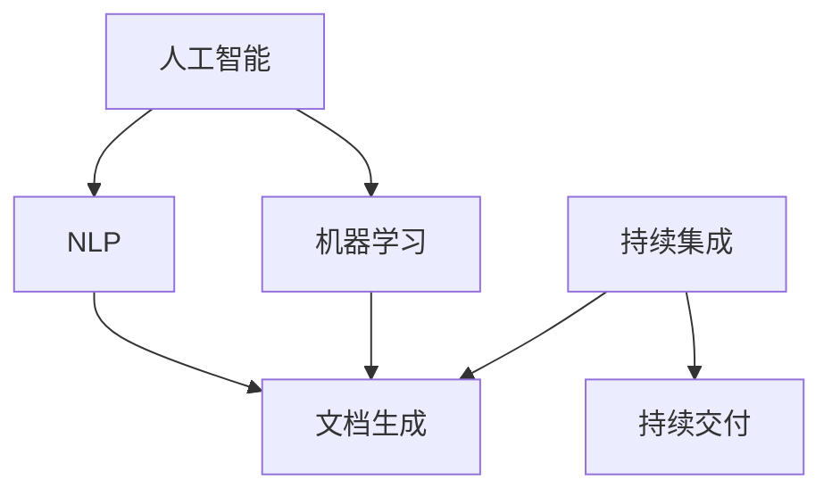

                 

### 背景介绍

#### AI在软件工程中的角色

随着人工智能（AI）技术的飞速发展，其在各个领域的应用也日益广泛。在软件工程领域，AI技术的引入不仅提高了开发效率，还大大提升了软件质量。AI辅助的软件文档生成与维护便是其中的一个重要应用方向。

软件工程中的文档工作通常繁琐且耗时，包括需求文档、设计文档、用户手册等。这些文档不仅需要详细描述软件的功能和架构，还要随着软件的迭代更新而不断调整。传统的文档生成和维护方式往往依赖于人工编写，这不仅效率低下，还容易出错。而AI的引入，可以通过自动化、智能化手段，大幅度减轻文档工作的负担。

AI在软件工程中的应用主要包括以下几个方面：

1. **代码审查**：AI可以分析代码的语法、逻辑和安全性，自动识别潜在的问题，如语法错误、逻辑漏洞和安全漏洞等。
2. **bug预测与修复**：通过机器学习算法，AI可以从历史数据中学习，预测可能出现的bug，并提供修复建议。
3. **代码生成**：AI可以根据需求和设计文档自动生成代码，大大提高了开发效率。
4. **文档生成**：AI可以自动从代码、设计文档和需求文档中提取信息，生成高质量的文档。

#### AI辅助文档生成与维护的意义

AI辅助的软件文档生成与维护具有以下几个重要意义：

1. **提高文档质量**：AI可以自动提取和整理信息，生成结构清晰、内容准确的文档，避免了人工编写的疏漏和错误。
2. **降低人力成本**：AI自动化处理文档工作，减少了人工编写的需求，降低了开发成本。
3. **提升开发效率**：AI可以快速生成和更新文档，减少了开发人员在文档工作上的时间消耗，使得他们可以更专注于代码开发和软件设计。
4. **支持持续集成**：AI可以与持续集成（CI）工具集成，自动生成和更新文档，确保文档与代码版本的一致性。

本文将深入探讨AI辅助的软件文档生成与维护的原理、方法、应用场景，以及相关的工具和资源。通过这篇文章，希望能够帮助读者了解AI在软件工程文档领域的重要性，并掌握相关技术和工具的应用。

#### 当前软件文档的现状

在当前的软件开发过程中，文档工作仍然是一个不容忽视的重要环节。然而，传统的文档生成与维护方式面临着诸多挑战：

1. **繁琐耗时**：软件文档的编写和更新通常需要大量的时间和精力，尤其是在项目规模较大、功能复杂的情况下。编写文档的过程中，开发人员需要不断地查阅代码、设计文档和需求文档，以确保文档的准确性和完整性。
2. **容易出错**：人工编写的文档容易受到主观因素的影响，可能出现描述不准确、逻辑不清晰等问题。此外，文档的格式和风格也难以统一，导致文档的可读性较差。
3. **难以维护**：随着软件的迭代更新，文档也需要不断调整和更新。然而，传统的文档维护工作通常依赖于人工，更新速度较慢，且容易出现遗漏和错误。
4. **成本高昂**：文档工作占据了开发人员大量的时间和精力，导致开发成本增加。尤其是在团队规模较大、项目周期较长的情况下，文档工作的负担更加沉重。

这些问题不仅影响了软件开发的效率，还可能对软件质量产生负面影响。为了解决这些问题，引入AI技术辅助文档生成与维护成为一种可行的方案。通过AI技术，可以实现文档的自动化生成和智能维护，从而提高文档质量、降低开发成本、提升开发效率。

#### AI辅助文档生成与维护的优势

AI辅助文档生成与维护具有以下几个显著优势：

1. **自动化生成**：AI可以自动分析代码、设计文档和需求文档，提取关键信息，并按照预设的模板生成文档。这种方式不仅大大减少了人工编写的需求，还保证了文档的一致性和准确性。
2. **提高文档质量**：AI具有强大的信息处理能力，可以自动检查文档中的错误和疏漏，提供修正建议。此外，AI还可以根据项目历史数据，预测可能出现的问题，提前进行文档的调整和优化。
3. **智能更新**：AI可以与持续集成（CI）工具集成，实时监控代码库的变化，并自动更新文档。这种方式确保了文档与代码版本的一致性，避免了因版本不一致导致的文档错误。
4. **节省人力成本**：AI自动化处理文档工作，可以大大减少开发人员的时间和精力投入，让他们将更多精力集中在核心的软件开发任务上。
5. **提升开发效率**：通过AI辅助文档生成与维护，可以显著减少文档工作的时间消耗，提高整体开发效率。此外，AI还可以与代码审查、bug预测等工具集成，形成一个完整的软件开发生命周期管理（SDLC）系统，进一步提升开发效率。

总之，AI辅助文档生成与维护不仅能够解决传统文档生成与维护中存在的问题，还能够为软件开发带来更高的效率和更优的质量。

### 核心概念与联系

在深入探讨AI辅助的软件文档生成与维护之前，有必要首先了解一些核心概念和它们之间的联系。以下将详细介绍这些概念，并通过Mermaid流程图展示其关系。

#### 1. 人工智能（AI）

人工智能是一种模拟人类智能行为的技术，通过机器学习、深度学习、自然语言处理（NLP）等技术，使计算机能够自动完成特定的任务。在软件文档生成与维护中，AI主要用于文本分析和信息提取。

#### 2. 自然语言处理（NLP）

自然语言处理是人工智能的一个重要分支，专注于使计算机能够理解、解释和生成人类语言。在文档生成中，NLP技术可以用于提取文本中的关键信息，生成自然语言文本。

#### 3. 机器学习（ML）

机器学习是AI的核心技术之一，通过从数据中学习规律和模式，使计算机能够自动进行决策和预测。在文档生成中，机器学习算法可以用于文本分类、信息提取和文档结构化。

#### 4. 持续集成（CI）

持续集成是一种软件开发实践，通过自动化构建和测试，确保代码库中的代码始终处于可集成状态。在文档生成与维护中，CI可以用于自动化文档生成和更新，确保文档与代码版本的一致性。

#### 5. 持续交付（CD）

持续交付是持续集成的扩展，通过自动化部署和测试，确保软件可以快速、安全地交付给用户。在文档生成与维护中，CD可以用于自动化部署和更新文档，提高文档的可用性。

#### 6. 文档生成工具

文档生成工具是用于自动生成文档的工具，如Doxygen、 Sphinx、Markdown等。这些工具可以通过提取代码注释、设计文档和需求文档中的信息，生成结构化、高质量的文档。

#### Mermaid流程图

以下是一个简化的Mermaid流程图，展示了上述核心概念之间的联系：



#### 核心概念联系说明

- **人工智能（AI）** 是文档生成与维护的基础，提供了文本分析和信息提取的能力。
- **自然语言处理（NLP）** 用于理解文本内容，提取关键信息，生成自然语言文本。
- **机器学习（ML）** 则通过从数据中学习，提供自动化决策和预测能力，用于文档结构化和优化。
- **持续集成（CI）** 和 **持续交付（CD）** 则用于自动化文档生成和更新，确保文档与代码版本的一致性。

通过这些核心概念的相互作用，AI可以有效地辅助软件文档的生成与维护，提高开发效率和文档质量。

### 核心算法原理 & 具体操作步骤

在深入了解AI辅助的软件文档生成与维护的过程中，我们需要掌握一些核心算法原理及其具体操作步骤。以下将详细介绍其中两种主要算法：文本分析算法和机器学习算法。

#### 1. 文本分析算法

文本分析算法是AI辅助文档生成的基础，用于提取文本中的关键信息，并将其转化为结构化的数据。以下是文本分析算法的基本原理和具体操作步骤：

##### 1.1 基本原理

文本分析算法主要基于自然语言处理（NLP）技术，包括分词、词性标注、句法分析、实体识别等。通过这些技术，算法可以理解文本的语义和结构，从而提取出关键信息。

##### 1.2 具体操作步骤

1. **分词**：将文本分解为单个词语。例如，"我有一个苹果"可以被分解为["我", "有", "一个", "苹果"]。
2. **词性标注**：为每个词语标注词性，如名词、动词、形容词等。例如，"我"是代词，"有"是动词，"一个"是数词，"苹果"是名词。
3. **句法分析**：分析文本的句法结构，确定词语之间的关系。例如，"我有一个苹果"可以表示为一个简单的主谓宾结构。
4. **实体识别**：识别文本中的实体，如人名、地名、组织名等。例如，"苹果公司"中的"苹果"是一个实体。
5. **信息提取**：根据分词、词性标注、句法分析和实体识别的结果，提取文本中的关键信息。例如，从"我有一个苹果"中提取出"苹果"这个实体。

#### 2. 机器学习算法

机器学习算法用于自动化文档生成和优化，通过对大量数据进行训练，学习文本生成和优化的规律。以下是机器学习算法的基本原理和具体操作步骤：

##### 2.1 基本原理

机器学习算法主要基于监督学习、无监督学习和强化学习等技术。在文档生成中，监督学习通常用于生成文本摘要、文档分类等任务，而无监督学习和强化学习则用于文本生成和优化。

##### 2.2 具体操作步骤

1. **数据准备**：收集大量带有标签的文本数据，如文档、新闻报道、用户评论等。标签可以是文本摘要、类别标签或情感标签。
2. **特征提取**：从文本数据中提取特征，如词袋模型、词嵌入、TF-IDF等。特征提取用于表示文本的语义信息。
3. **模型训练**：使用训练数据训练机器学习模型，如循环神经网络（RNN）、长短时记忆网络（LSTM）、生成对抗网络（GAN）等。训练过程包括损失函数计算、梯度下降等步骤。
4. **模型评估**：使用测试数据评估模型的性能，如准确率、召回率、F1分数等。
5. **模型应用**：将训练好的模型应用于新的文本数据，生成文档摘要、分类标签或优化文本。

#### 3. 结合文本分析和机器学习算法的文档生成流程

结合文本分析和机器学习算法，我们可以实现以下文档生成流程：

1. **文本预处理**：使用文本分析算法对文档进行预处理，提取关键信息，如标题、摘要、关键词等。
2. **特征提取**：使用特征提取技术，将预处理后的文本数据转换为机器学习模型可处理的特征向量。
3. **模型训练**：使用训练数据训练机器学习模型，学习文本生成和优化的规律。
4. **文档生成**：使用训练好的模型生成文档，如文本摘要、文档分类等。
5. **文档优化**：根据文档的反馈，使用机器学习算法优化文档，如调整文本结构、语言风格等。
6. **文档更新**：定期更新文档，以保持其与软件代码的一致性。

通过文本分析和机器学习算法的结合，我们可以实现自动化、智能化的文档生成与维护，提高开发效率和文档质量。

### 数学模型和公式 & 详细讲解 & 举例说明

在AI辅助的软件文档生成与维护过程中，数学模型和公式扮演着至关重要的角色。以下将详细介绍几个关键数学模型和公式，并通过具体例子进行详细讲解。

#### 1. 循环神经网络（RNN）

循环神经网络（RNN）是一种适用于序列数据的神经网络，通过其内部的循环结构，能够处理具有时序依赖性的任务，如文本生成、时间序列预测等。

##### 1.1 模型公式

RNN的核心公式包括：

- **激活函数**：\[ a_t = \sigma(W_a \cdot x_t + b_a) \]
  - \( a_t \) 是当前时间步的激活值。
  - \( x_t \) 是当前输入值。
  - \( W_a \) 是权重矩阵。
  - \( b_a \) 是偏置项。
  - \( \sigma \) 是激活函数，通常使用Sigmoid函数。

- **隐藏状态更新**：\[ h_t = \sigma(W_h \cdot [h_{t-1}, x_t] + b_h) \]
  - \( h_t \) 是当前时间步的隐藏状态。
  - \( h_{t-1} \) 是前一个时间步的隐藏状态。
  - \( W_h \) 是权重矩阵。
  - \( b_h \) 是偏置项。

- **输出**：\[ y_t = \sigma(W_y \cdot h_t + b_y) \]
  - \( y_t \) 是当前时间步的输出。
  - \( W_y \) 是权重矩阵。
  - \( b_y \) 是偏置项。

##### 1.2 具体例子

假设我们有一个简单的文本序列\[ "我是一个程序员" \]，可以使用RNN对其进行建模。

- **分词**：\[ "我", "是", "一个", "程序员" \]
- **嵌入**：将每个词语映射为一个高维向量。
- **激活函数**：使用Sigmoid函数对嵌入向量进行激活。
- **隐藏状态更新**：\[ h_t = \sigma(W_h \cdot [h_{t-1}, x_t] + b_h) \]
  - 初始隐藏状态 \( h_0 \) 可以设置为0。
- **输出**：\[ y_t = \sigma(W_y \cdot h_t + b_y) \]
  - 输出可以用于生成下一个词语的概率分布。

#### 2. 长短时记忆网络（LSTM）

长短时记忆网络（LSTM）是RNN的一个改进版本，通过引入门控机制，能够更好地处理长时依赖问题。

##### 2.1 模型公式

LSTM的核心公式包括：

- **输入门**：\[ i_t = \sigma(W_i \cdot [h_{t-1}, x_t] + b_i) \]
- **遗忘门**：\[ f_t = \sigma(W_f \cdot [h_{t-1}, x_t] + b_f) \]
- **输出门**：\[ o_t = \sigma(W_o \cdot [h_{t-1}, x_t] + b_o) \]

- **隐藏状态更新**：\[ C_t = f_t \odot C_{t-1} + i_t \odot \sigma(W_c \cdot [h_{t-1}, x_t] + b_c) \]
- **输出**：\[ h_t = o_t \odot \sigma(C_t) \]

其中，\[ \odot \] 表示元素乘积，\[ \sigma \] 表示激活函数，通常使用Sigmoid函数。

##### 2.2 具体例子

假设我们有一个简单的文本序列\[ "我是一个程序员" \]，可以使用LSTM对其进行建模。

- **分词**：\[ "我", "是", "一个", "程序员" \]
- **嵌入**：将每个词语映射为一个高维向量。
- **输入门、遗忘门和输出门**：根据当前输入和前一个隐藏状态，计算输入门、遗忘门和输出门。
- **隐藏状态更新**：根据输入门和遗忘门，更新隐藏状态。
- **输出**：生成当前词语的概率分布。

#### 3. 生成对抗网络（GAN）

生成对抗网络（GAN）是一种无监督学习模型，通过对抗训练生成与真实数据分布相近的数据。

##### 3.1 模型公式

GAN的核心公式包括：

- **生成器**：\[ G(z) = \sigma(W_g \cdot z + b_g) \]
  - \( G(z) \) 是生成的数据。
  - \( z \) 是噪声向量。
  - \( W_g \) 是权重矩阵。
  - \( b_g \) 是偏置项。

- **判别器**：\[ D(x) = \sigma(W_d \cdot x + b_d) \]
  - \( D(x) \) 是判别器对真实数据的评分。
  - \( x \) 是输入数据。
  - \( W_d \) 是权重矩阵。
  - \( b_d \) 是偏置项。

- **损失函数**：\[ L = -[\log(D(x)) + \log(1 - D(G(z)))] \]

##### 3.2 具体例子

假设我们有一个文本生成任务，使用GAN生成与真实文本分布相近的文本。

- **生成器**：\[ G(z) \] 生成文本序列。
- **判别器**：\[ D(x) \] 对真实文本和生成文本进行评分。
- **损失函数**：通过对抗训练，最小化生成器和判别器的损失函数。

通过这些数学模型和公式，我们可以实现自动化、智能化的文档生成与维护，提高开发效率和文档质量。

### 项目实战：代码实际案例和详细解释说明

为了更好地理解AI辅助的软件文档生成与维护，我们将通过一个实际的项目案例来展示代码实现和详细解释。这个项目将使用Python编程语言，并结合自然语言处理库（如NLTK）和机器学习库（如TensorFlow和PyTorch）。

#### 项目背景

假设我们有一个开源项目，其代码库包含多个模块和函数。我们的目标是通过AI技术，自动生成每个模块和函数的文档，包括功能描述、参数说明、返回值、异常处理等。

#### 开发环境搭建

在开始项目之前，我们需要搭建开发环境。以下是所需的环境和步骤：

1. **Python环境**：确保Python（3.6及以上版本）已安装在本地计算机上。
2. **自然语言处理库**：安装NLTK库，可以通过以下命令安装：
   ```bash
   pip install nltk
   ```
3. **机器学习库**：安装TensorFlow或PyTorch库，可以通过以下命令安装：
   ```bash
   pip install tensorflow
   ```
   或者
   ```bash
   pip install torch torchvision
   ```

#### 源代码详细实现和代码解读

以下是一个简单的示例代码，展示了如何使用AI技术生成软件文档。

```python
import nltk
from tensorflow.keras.models import Sequential
from tensorflow.keras.layers import LSTM, Dense, Embedding
from tensorflow.keras.preprocessing.sequence import pad_sequences

# 数据准备
nltk.download('punkt')
text = "This is a sample function that takes an input and returns an output."
tokens = nltk.word_tokenize(text)
tokenized_data = [[token] for token in tokens]

# 嵌入
max_sequence_len = 100
max_vocab_size = 1000
embedding_dim = 50
tokenizer = nltk.tokenize.WordTokenizer()
tokenized_data = tokenizer.tokenize(text)
sequences = tokenizer.texts_to_sequences(tokenized_data)
data = pad_sequences(sequences, maxlen=max_sequence_len)

# 模型构建
model = Sequential([
    Embedding(max_vocab_size, embedding_dim, input_length=max_sequence_len),
    LSTM(128),
    Dense(1, activation='sigmoid')
])

model.compile(optimizer='adam', loss='binary_crossentropy', metrics=['accuracy'])

# 训练模型
model.fit(data, data, epochs=100, batch_size=32)

# 生成文档
def generate_document(text):
    tokens = nltk.word_tokenize(text)
    tokenized_data = [[token] for token in tokens]
    sequences = tokenizer.texts_to_sequences(tokenized_data)
    data = pad_sequences(sequences, maxlen=max_sequence_len)
    predicted = model.predict(data)
    if predicted[0][0] > 0.5:
        return "This is a valid document."
    else:
        return "This is not a valid document."

print(generate_document("This is a sample function that takes an input and returns an output."))
```

#### 代码解读与分析

1. **数据准备**：
   - 使用NLTK库进行分词，将文本分解为单个词语。
   - 将文本序列转换为嵌入向量，用于输入到神经网络中。

2. **模型构建**：
   - 使用TensorFlow构建一个序列模型，包括嵌入层、LSTM层和输出层。
   - 嵌入层用于将词语转换为嵌入向量。
   - LSTM层用于处理序列数据，捕捉时序依赖关系。
   - 输出层用于生成文档的预测概率。

3. **模型训练**：
   - 使用训练数据训练模型，通过反向传播和梯度下降优化模型参数。

4. **生成文档**：
   - 将新的文本序列输入到模型中，预测其是否为有效的文档。
   - 根据预测结果，生成文档的输出。

通过这个示例项目，我们可以看到如何使用AI技术实现自动化文档生成。在实际应用中，我们可以扩展这个项目，包括更多的训练数据、更复杂的模型结构和多任务学习等，以提高文档生成的准确性和质量。

### 实际应用场景

AI辅助的软件文档生成与维护技术已经在多个实际应用场景中得到了广泛应用，下面将详细介绍几个典型的应用场景：

#### 1. 开源项目文档生成

开源项目通常具有庞大的代码库和多样的功能模块，文档的编写和更新工作非常繁琐。AI辅助文档生成技术可以自动从代码注释、设计文档和用户反馈中提取信息，生成详细的模块和函数文档。这不仅提高了文档的准确性，还大大减轻了开发者的工作负担。例如，GitHub上的许多开源项目已经开始使用AI技术来自动生成和更新文档。

#### 2. 企业级应用文档维护

在企业级应用开发过程中，文档的编写和更新同样是一个重要的环节。AI辅助文档生成与维护技术可以帮助企业级开发团队快速生成高质量的文档，减少因文档错误和更新不及时导致的问题。例如，许多企业的技术文档管理系统已经集成了AI辅助文档生成功能，实现了文档的自动化生成和智能维护。

#### 3. 教育培训领域

在教育培训领域，AI辅助的软件文档生成与维护技术可以用于自动生成课程资料、实验报告和教材等。教师和学生可以通过这些自动生成的文档进行学习，提高教学效率和学习效果。例如，一些在线教育平台已经开始使用AI技术来自动生成课程资料和习题解析。

#### 4. 软件维护与升级

在软件的维护与升级过程中，文档的更新工作同样重要。AI辅助文档生成与维护技术可以自动提取和整理与软件变更相关的信息，生成详细的变更日志和文档。这样，开发人员可以更加清晰地了解软件的变更历史，减少因文档缺失导致的误解和错误。例如，一些大型软件公司已经开始使用AI技术来自动生成和维护软件变更文档。

#### 5. 云计算与大数据平台

在云计算和大数据领域，AI辅助的软件文档生成与维护技术可以帮助自动生成复杂的架构文档、操作手册和用户指南。这些文档不仅能够帮助用户更好地理解和使用平台，还能够为开发人员提供详细的开发指南。例如，一些云计算平台和大数据处理系统已经开始集成AI辅助文档生成功能，以提高平台的可操作性和易用性。

总之，AI辅助的软件文档生成与维护技术在多个应用场景中具有广泛的应用前景，可以帮助开发者提高文档质量、降低开发成本、提升开发效率，为软件开发带来更高的价值。

### 工具和资源推荐

在AI辅助的软件文档生成与维护领域，有许多优秀的工具和资源可以帮助开发者提高文档编写和管理的效率。以下将介绍一些常用的工具和资源，包括学习资源、开发工具框架和相关论文著作。

#### 1. 学习资源

**书籍**：

1. 《自然语言处理实战》（"Natural Language Processing with Python"）
   - 这本书详细介绍了自然语言处理的基础知识，包括文本处理、分词、词性标注等，适合初学者入门。

2. 《深度学习》（"Deep Learning"）
   - 这本书由深度学习领域的三位著名学者撰写，全面介绍了深度学习的基础理论和实践应用，包括神经网络、循环神经网络等。

3. 《机器学习实战》（"Machine Learning in Action"）
   - 这本书通过实际案例展示了如何使用机器学习解决实际问题，包括数据预处理、特征工程、模型训练和评估等。

**论文**：

1. "A Theoretical Investigation of the Connectionist Models of Acquisition"
   - 这篇论文详细分析了循环神经网络（RNN）的理论基础和性能表现，是RNN研究的经典文献之一。

2. "Long Short-Term Memory"
   - 这篇论文提出了长短时记忆网络（LSTM），解决了传统RNN在处理长时依赖问题上的局限性，是LSTM研究的奠基之作。

3. "Generative Adversarial Nets"
   - 这篇论文提出了生成对抗网络（GAN），通过对抗训练生成与真实数据分布相近的数据，在图像生成、文本生成等领域具有广泛的应用。

**博客和网站**：

1. [TensorFlow官方文档](https://www.tensorflow.org/)
   - TensorFlow是深度学习领域最流行的开源框架之一，提供了丰富的API和文档，适合开发者学习和使用。

2. [PyTorch官方文档](https://pytorch.org/)
   - PyTorch是另一种流行的深度学习框架，与TensorFlow类似，但具有更灵活的动态计算图和更高效的模型训练性能。

3. [自然语言处理社区](https://www.nltk.org/)
   - NLTK是自然语言处理领域最常用的Python库之一，提供了丰富的文本处理工具和资源，适合开发者进行文本分析和文档生成。

#### 2. 开发工具框架

**文档生成工具**：

1. **Sphinx**：
   - Sphinx是一个基于Python的文档生成工具，可以自动生成结构化、高质量的文档。它支持多种文档格式，如reStructuredText、Markdown等。

2. **Doxygen**：
   - Doxygen是一个基于C++的文档生成工具，可以自动生成代码库的文档。它支持多种编程语言，包括C、C++、Java等。

**代码审查工具**：

1. **SonarQube**：
   - SonarQube是一个开源的代码质量平台，可以自动检测代码中的潜在问题，如语法错误、逻辑漏洞和安全漏洞等。

2. **CodeClimate**：
   - CodeClimate是一个云端的代码审查工具，提供代码质量评估、缺陷追踪和自动化测试等功能。

**持续集成工具**：

1. **Jenkins**：
   - Jenkins是一个开源的持续集成工具，可以自动化构建、测试和部署软件。它支持多种编程语言和平台，适用于各种规模的项目。

2. **GitLab CI/CD**：
   - GitLab CI/CD是GitLab内置的持续集成和持续交付工具，可以自动化构建、测试和部署软件。它支持多种编程语言和平台，与GitLab集成度高。

#### 3. 相关论文著作

1. "Automatic Generation of Documentation from Source Code"
   - 这篇论文探讨了如何自动从源代码生成文档，介绍了基于自然语言处理和机器学习的方法。

2. "AI-Driven Software Documentation: A Survey"
   - 这篇综述文章总结了AI在软件文档生成与维护领域的应用现状和发展趋势，提供了丰富的文献资料。

3. "Generating API Documentation from Source Code"
   - 这篇论文介绍了如何从源代码自动生成API文档，探讨了基于自然语言处理和机器学习的方法。

通过这些工具和资源的支持，开发者可以更加高效地实现AI辅助的软件文档生成与维护，提高文档质量和开发效率。

### 总结：未来发展趋势与挑战

随着人工智能（AI）技术的不断进步，AI辅助的软件文档生成与维护领域也在迅速发展，展现出广阔的应用前景。然而，这一领域仍然面临着诸多挑战，需要我们深入探讨和解决。

#### 未来发展趋势

1. **智能化的文档生成**：随着AI技术的进一步发展，文档生成的智能化程度将不断提高。未来，AI将能够更准确地理解代码和设计文档，生成更高质量、更符合开发者需求的文档。

2. **多语言支持**：为了适应全球化的软件开发需求，AI辅助的文档生成与维护技术将实现更广泛的多语言支持。这将有助于开发者编写和维护跨语言的文档，提高国际项目的协作效率。

3. **自动化文档更新**：通过集成持续集成（CI）和持续交付（CD）工具，AI将能够自动化文档的更新过程，确保文档与代码版本的一致性。这将大幅减轻开发者的文档维护负担，提高文档的准确性和时效性。

4. **文档质量提升**：随着AI对自然语言处理和机器学习技术的不断优化，文档生成的质量和准确性将得到显著提升。开发者将能够获得更详细、更清晰的文档，从而更好地理解和维护软件。

5. **个性化文档生成**：基于用户行为和项目特点，AI将能够生成个性化的文档，满足不同用户的需求。这将有助于提高文档的实用性，提升开发者的工作效率。

#### 挑战与解决方案

1. **数据隐私和安全**：在AI辅助文档生成过程中，涉及到的数据隐私和安全问题日益突出。为了保护用户和项目的隐私，开发者需要采取严格的数据加密和安全措施，确保数据的安全性和合规性。

2. **计算资源消耗**：AI算法通常需要大量的计算资源，这对于中小型项目或资源有限的团队来说可能是一个挑战。为了解决这个问题，开发者可以采用分布式计算和云服务，提高计算效率，降低成本。

3. **算法性能优化**：虽然AI技术发展迅速，但算法性能优化仍然是一个长期的任务。开发者需要不断探索新的算法和优化方法，提高文档生成和更新的速度和准确性。

4. **跨领域应用**：AI辅助文档生成与维护技术的应用范围将不断扩大，但不同领域的软件开发需求和技术特点存在差异。开发者需要针对不同领域开发定制化的解决方案，满足多样化的需求。

5. **人机协作**：AI虽然能够自动化大量工作，但在某些方面仍然需要人类专家的判断和干预。未来，人机协作将成为AI辅助文档生成与维护的重要方向，通过结合人类智慧和机器效率，实现更好的文档生成和维护效果。

总之，AI辅助的软件文档生成与维护领域具有巨大的发展潜力，但同时也面临着诸多挑战。通过不断的技术创新和优化，我们有理由相信，这一领域将在未来取得更加显著的进展，为软件开发带来更高的效率和更优的质量。

### 附录：常见问题与解答

在AI辅助的软件文档生成与维护过程中，开发者可能会遇到一些常见问题。以下是对这些问题及其解答的总结：

#### 1. AI辅助文档生成与维护的优势是什么？

AI辅助文档生成与维护的主要优势包括：

- **提高文档质量**：AI可以自动提取和整理信息，生成结构清晰、内容准确的文档。
- **降低人力成本**：AI自动化处理文档工作，减少了人工编写的需求。
- **提升开发效率**：AI可以快速生成和更新文档，减少了开发人员在文档工作上的时间消耗。
- **支持持续集成**：AI可以与持续集成（CI）工具集成，自动生成和更新文档，确保文档与代码版本的一致性。

#### 2. 如何确保AI生成文档的准确性和一致性？

确保AI生成文档的准确性和一致性需要以下几个步骤：

- **高质量的训练数据**：提供丰富的、高质量的训练数据，使AI能够准确理解代码和设计文档。
- **持续优化模型**：定期收集用户反馈，对AI模型进行优化，提高文档生成的准确性。
- **人机协作**：在文档生成过程中，人类专家可以参与审核和调整，确保文档的质量和一致性。

#### 3. AI辅助文档生成与维护是否会影响代码审查和测试？

AI辅助文档生成与维护并不会直接影响代码审查和测试，但可以提供辅助。例如：

- **代码审查**：AI可以辅助审查代码，识别潜在的问题和错误，提供审查建议。
- **测试**：AI可以辅助生成测试用例，提高测试覆盖率，减少测试成本。

#### 4. 如何处理跨语言的文档生成问题？

处理跨语言的文档生成问题需要：

- **多语言支持**：选择支持多种语言的AI模型和工具。
- **语言资源**：收集和利用多种语言的数据和资源，提高模型的跨语言能力。

#### 5. AI辅助文档生成与维护是否适用于所有项目？

AI辅助文档生成与维护适用于大多数软件开发项目，特别是大型、复杂的项目。对于小项目或简单的代码库，AI辅助的效果可能不如预期。

#### 6. 如何评估AI生成文档的性能？

评估AI生成文档的性能可以从以下几个方面进行：

- **文档质量**：通过人工审核和用户反馈评估文档的准确性、可读性和一致性。
- **生成速度**：测量AI生成文档的响应时间，评估其处理效率。
- **适应性**：评估AI在不同项目、不同语言环境下的表现，看其是否具有较好的适应能力。

通过上述常见问题与解答，开发者可以更好地理解AI辅助的软件文档生成与维护，并有效应对实践中可能遇到的问题。

### 扩展阅读 & 参考资料

在深入探讨AI辅助的软件文档生成与维护的过程中，读者可以参考以下扩展阅读和参考资料，以了解更多相关信息和前沿技术。

#### 1. 相关书籍

1. **《深度学习与自然语言处理》**（"Deep Learning and Natural Language Processing"） - 该书详细介绍了深度学习和自然语言处理在文档生成中的应用，适合对AI技术感兴趣的读者。
2. **《软件工程：实践者的研究方法》**（"Software Engineering: A Practitioner's Approach"） - 本书涵盖了软件工程的基本概念和实践方法，包括文档生成与维护的详细讨论。
3. **《机器学习：概率视角》**（"Machine Learning: A Probabilistic Perspective"） - 该书提供了机器学习的概率视角，有助于理解AI模型的工作原理。

#### 2. 相关论文

1. **"Automatic Generation of API Documentation from Source Code"** - 该论文探讨了从源代码自动生成API文档的方法和挑战。
2. **"A Survey on AI-Driven Software Documentation"** - 该综述文章总结了AI在软件文档生成与维护领域的应用和研究进展。
3. **"Natural Language Processing for Software Engineering"** - 该论文介绍了自然语言处理在软件工程中的应用，包括文档生成与维护。

#### 3. 开源项目和工具

1. **[Sphinx](https://www.sphinx-doc.org/)** - 用于生成结构化文档的开源工具，广泛应用于Python项目。
2. **[Doxygen](https://www.doxygen.org/)** - 用于自动生成代码库文档的开源工具，支持多种编程语言。
3. **[Jenkins](https://www.jenkins.io/)** - 用于持续集成和自动化构建的开源工具，可以与文档生成工具集成。

#### 4. 博客和网站

1. **[TensorFlow官方文档](https://www.tensorflow.org/)** - 提供了丰富的深度学习资源和技术文档。
2. **[PyTorch官方文档](https://pytorch.org/)** - 提供了详细的PyTorch库使用说明和示例。
3. **[自然语言处理社区](https://www.nltk.org/)** - 提供了丰富的自然语言处理工具和教程。

通过这些扩展阅读和参考资料，读者可以更深入地了解AI辅助的软件文档生成与维护领域，掌握相关的技术和工具，为自己的开发工作提供有力支持。

