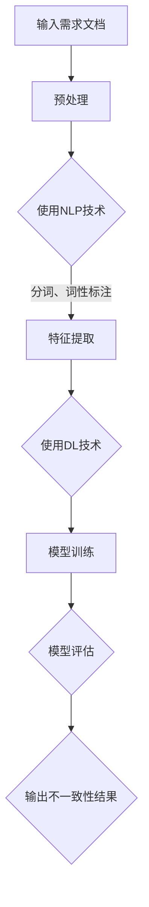

                 

### 背景介绍

随着人工智能技术的飞速发展，越来越多的企业开始意识到人工智能（AI）在软件开发过程中的重要性。传统的软件开发过程通常需要大量的时间和人力投入，而且容易出现需求不一致的问题，导致项目延误甚至失败。为了解决这一问题，AI辅助软件需求一致性验证成为了一个热门的研究方向。

软件需求一致性验证是指在软件开发过程中，确保各个阶段产生的软件需求文档之间保持一致性的过程。传统的方法主要依赖于人工审查和验证，不仅效率低下，而且容易出现漏检和误检。而AI技术的引入，有望大大提高软件需求一致性验证的效率和准确性。

本文将详细介绍AI辅助软件需求一致性验证的原理、算法、实现步骤以及实际应用案例，旨在为广大软件开发者和研究者提供有价值的参考。本文的主要目标是：

1. **概述AI辅助软件需求一致性验证的概念和背景**：介绍传统软件需求一致性验证的挑战以及AI技术如何帮助解决这些问题。

2. **阐述核心概念与联系**：解释AI辅助软件需求一致性验证所涉及的核心概念和原理，并通过Mermaid流程图展示其架构。

3. **深入探讨核心算法原理与具体操作步骤**：详细介绍AI辅助软件需求一致性验证的主要算法，包括数据预处理、特征提取和一致性检测等。

4. **数学模型和公式详细讲解与举例说明**：讲解AI辅助软件需求一致性验证中的关键数学模型和公式，并通过具体实例进行说明。

5. **项目实战：代码实际案例和详细解释说明**：展示一个完整的AI辅助软件需求一致性验证项目，包括开发环境搭建、源代码实现、代码解读和分析。

6. **讨论实际应用场景**：探讨AI辅助软件需求一致性验证在不同场景下的应用，以及可能遇到的挑战和解决方案。

7. **推荐相关工具和资源**：为读者推荐学习资源、开发工具和框架，以及相关的论文和著作。

8. **总结未来发展趋势与挑战**：分析AI辅助软件需求一致性验证的潜在发展方向和面临的挑战。

9. **附录：常见问题与解答**：提供常见问题的解答，帮助读者更好地理解和应用本文内容。

10. **扩展阅读与参考资料**：推荐进一步阅读的材料，以帮助读者深入了解相关领域。

通过以上内容的详细阐述，本文希望为广大读者提供一个全面、系统的AI辅助软件需求一致性验证技术指南。

### 核心概念与联系

在讨论AI辅助软件需求一致性验证之前，我们需要先了解一些核心概念，这些概念包括自然语言处理（NLP）、机器学习（ML）、深度学习（DL）、以及一致性检测等。

#### 自然语言处理（NLP）

自然语言处理是计算机科学和语言学的交叉领域，旨在让计算机能够理解和处理人类语言。在软件需求一致性验证中，NLP技术被广泛应用于处理和分析需求文档。例如，可以使用NLP技术对需求文档进行分词、词性标注、句法分析等，从而提取出关键信息。

#### 机器学习（ML）

机器学习是一种通过数据和算法来让计算机自动学习和改进的方法。在AI辅助软件需求一致性验证中，ML技术被用于构建用于检测不一致性的模型。常用的机器学习方法包括监督学习、无监督学习和强化学习等。

#### 深度学习（DL）

深度学习是机器学习的一种特殊形式，它通过模拟人脑的神经网络结构，进行复杂的数据建模。在软件需求一致性验证中，深度学习被广泛应用于特征提取和模式识别。例如，可以使用卷积神经网络（CNN）来提取文本特征，或者使用循环神经网络（RNN）来理解文本的上下文关系。

#### 一致性检测

一致性检测是软件需求管理的一个重要环节，旨在确保软件需求文档中的各个部分之间保持一致。在AI辅助软件需求一致性验证中，一致性检测涉及到对需求文档的审查和比较，以发现潜在的不一致。

#### Mermaid流程图

下面是一个用于描述AI辅助软件需求一致性验证架构的Mermaid流程图。请注意，Mermaid流程节点中不应包含括号、逗号等特殊字符。



1. **输入需求文档**：首先，我们需要输入需要验证的软件需求文档。

2. **预处理**：使用NLP技术对需求文档进行预处理，包括分词、词性标注等。

3. **特征提取**：使用深度学习技术对预处理后的文本进行特征提取，以生成可用于训练和评估的模型输入。

4. **模型训练**：利用提取的特征数据进行模型训练，以构建用于一致性检测的模型。

5. **模型评估**：对训练好的模型进行评估，以确保其能够有效地检测需求文档中的不一致性。

6. **输出不一致性结果**：最后，模型将输出不一致性结果，以便开发人员和需求分析师能够及时纠正问题。

通过以上流程，AI辅助软件需求一致性验证能够高效、准确地发现并解决需求不一致的问题，从而提高软件开发的效率和质量。

### 核心算法原理与具体操作步骤

在了解了AI辅助软件需求一致性验证的核心概念和架构之后，接下来我们将深入探讨其中的核心算法原理与具体操作步骤。本文将分为以下几个部分进行讲解：

1. **数据预处理**：讨论如何对输入的需求文档进行预处理，包括文本清洗、分词、词性标注等。
2. **特征提取**：介绍如何使用深度学习技术对预处理后的文本进行特征提取。
3. **一致性检测模型**：详细说明如何构建和训练用于一致性检测的模型。
4. **模型评估与优化**：讨论如何评估模型的效果，并进行必要的优化。

#### 1. 数据预处理

数据预处理是AI辅助软件需求一致性验证的重要步骤，直接影响到后续特征提取和模型训练的效果。以下是具体的数据预处理步骤：

1. **文本清洗**：首先，对需求文档进行文本清洗，去除无关的信息，如HTML标签、特殊字符和停用词。文本清洗的目的是减少噪声，提高后续处理的效率。

2. **分词**：使用NLP工具对清洗后的文本进行分词，将文本拆分为词序列。常见的分词工具包括jieba、NLTK等。

3. **词性标注**：对分词后的文本进行词性标注，标记每个词的词性（如名词、动词、形容词等）。词性标注有助于理解文本的语义结构，为后续的特征提取提供必要的信息。

4. **文本向量化**：将处理后的文本转换为向量表示。常用的文本向量化方法包括词袋模型（Bag of Words, BoW）和词嵌入（Word Embedding）。

   ```latex
   X = [x_1, x_2, ..., x_n]
   ```
   
   其中，$x_i$表示第$i$个词的向量表示，$n$为词汇表的大小。

#### 2. 特征提取

特征提取是深度学习中的关键步骤，用于将原始数据转换为适用于模型训练的高效表示。在AI辅助软件需求一致性验证中，常用的特征提取方法包括：

1. **卷积神经网络（CNN）**：CNN在图像处理领域有广泛应用，但也可以用于文本特征提取。通过卷积层和池化层，CNN可以捕捉文本中的局部特征。

2. **循环神经网络（RNN）**：RNN能够处理序列数据，特别适用于理解文本的上下文关系。RNN的一个变体——长短期记忆网络（LSTM），可以有效解决RNN的梯度消失问题。

3. **预训练词嵌入**：词嵌入是一种将单词映射到高维向量空间的方法，能够捕捉词与词之间的语义关系。常见的预训练词嵌入模型包括Word2Vec、GloVe等。

   ```latex
   \text{Embedding Layer}: \quad x' = E[word]
   ```

   其中，$E$为词嵌入矩阵，$[word]$为词的向量表示。

#### 3. 一致性检测模型

一致性检测模型的构建通常采用以下步骤：

1. **模型架构**：选择合适的深度学习模型架构，如CNN、RNN或其变种。常见的模型架构包括序列标注模型、文本分类模型和匹配模型等。

2. **模型训练**：使用预处理后的文本数据和标注结果（如一致性标签）进行模型训练。训练过程中，通过优化算法（如梯度下降）调整模型参数，以最小化预测误差。

3. **模型评估**：使用验证集和测试集评估模型的性能，常见的评价指标包括准确率（Accuracy）、精确率（Precision）、召回率（Recall）和F1分数（F1 Score）。

   ```latex
   \text{Accuracy} = \frac{\text{正确预测}}{\text{总预测数}}
   \text{Precision} = \frac{\text{真正}}{\text{真正 + 假正}}
   \text{Recall} = \frac{\text{真正}}{\text{真正 + 假负}}
   \text{F1 Score} = 2 \times \frac{\text{Precision} \times \text{Recall}}{\text{Precision} + \text{Recall}}
   ```

#### 4. 模型评估与优化

模型评估与优化是确保模型性能的重要环节。以下是几个关键步骤：

1. **性能评估**：使用验证集和测试集评估模型性能，确保模型具有良好的泛化能力。

2. **超参数调整**：调整模型超参数（如学习率、批次大小等），以优化模型性能。

3. **正则化**：使用正则化技术（如L1、L2正则化）防止过拟合。

4. **交叉验证**：使用交叉验证技术（如K折交叉验证）评估模型的稳定性和可靠性。

5. **模型集成**：通过模型集成（如Bagging、Boosting）提高模型的预测性能。

通过以上步骤，我们可以构建一个高效、准确的AI辅助软件需求一致性验证模型，从而为软件开发过程提供有力支持。

### 数学模型和公式详细讲解与举例说明

在AI辅助软件需求一致性验证中，数学模型和公式起到了至关重要的作用。以下我们将详细讲解其中的关键数学模型和公式，并通过具体实例进行说明。

#### 1. 文本向量化

文本向量化是将文本数据转换为数值表示的过程，以便于深度学习模型处理。常用的文本向量化方法包括词袋模型（Bag of Words, BoW）和词嵌入（Word Embedding）。

**词袋模型（BoW）**

词袋模型是一种基于频次统计的文本表示方法。它将文本转换为词频向量，即每个词的频次作为向量中的一个元素。

   ```latex
   X = [x_1, x_2, ..., x_n]
   \text{其中} x_i = \text{count}(w_i)
   ```

**词嵌入（Word Embedding）**

词嵌入是将单词映射到高维向量空间的方法，以捕捉词与词之间的语义关系。常见的词嵌入模型包括Word2Vec和GloVe。

   ```latex
   \text{Word2Vec}: \quad E = \{e_1, e_2, ..., e_n\}
   \text{其中} e_i = \text{word2vec}(w_i)
   ```

   ```latex
   \text{GloVe}: \quad E = \{e_1, e_2, ..., e_n\}
   \text{其中} e_i = \text{glove}(w_i)
   ```

#### 2. 循环神经网络（RNN）

循环神经网络（RNN）是一种能够处理序列数据的神经网络。它通过记忆状态（hidden state）来捕捉序列中的时间依赖关系。

   ```latex
   h_t = \text{sigmoid}(W_h \cdot [h_{t-1}, x_t] + b_h)
   y_t = \text{softmax}(W_y \cdot h_t + b_y)
   ```

**实例**：假设我们有一个简单的RNN模型，其输入为文本序列$X = [x_1, x_2, ..., x_t]$，隐藏状态为$h_t$，输出为$y_t$。RNN的更新公式如下：

   ```latex
   h_t = \text{sigmoid}(W_h \cdot [h_{t-1}, x_t] + b_h)
   y_t = \text{softmax}(W_y \cdot h_t + b_y)
   ```

其中，$W_h$和$b_h$为隐藏层权重和偏置，$W_y$和$b_y$为输出层权重和偏置。

#### 3. 长短期记忆网络（LSTM）

长短期记忆网络（LSTM）是RNN的一种改进，旨在解决RNN的长期依赖问题。LSTM通过引入门控机制来控制信息的流动。

   ```latex
   i_t = \text{sigmoid}(W_i \cdot [h_{t-1}, x_t] + b_i)
   f_t = \text{sigmoid}(W_f \cdot [h_{t-1}, x_t] + b_f)
   g_t = \text{tanh}(W_g \cdot [h_{t-1}, x_t] + b_g)
   o_t = \text{sigmoid}(W_o \cdot [h_{t-1}, x_t] + b_o)
   h_t = o_t \cdot \text{tanh}(c_t)
   c_t = f_t \cdot c_{t-1} + i_t \cdot g_t
   ```

**实例**：假设我们有一个LSTM单元，其输入为文本序列$X = [x_1, x_2, ..., x_t]$，隐藏状态为$h_t$，细胞状态为$c_t$，输出为$y_t$。LSTM的更新公式如下：

   ```latex
   i_t = \text{sigmoid}(W_i \cdot [h_{t-1}, x_t] + b_i)
   f_t = \text{sigmoid}(W_f \cdot [h_{t-1}, x_t] + b_f)
   g_t = \text{tanh}(W_g \cdot [h_{t-1}, x_t] + b_g)
   o_t = \text{sigmoid}(W_o \cdot [h_{t-1}, x_t] + b_o)
   h_t = o_t \cdot \text{tanh}(c_t)
   c_t = f_t \cdot c_{t-1} + i_t \cdot g_t
   ```

其中，$W_i, W_f, W_g, W_o$分别为输入门、遗忘门、输入门和输出门的权重，$b_i, b_f, b_g, b_o$分别为输入门、遗忘门、输入门和输出门的偏置。

#### 4. 卷积神经网络（CNN）

卷积神经网络（CNN）在图像处理领域有广泛应用，但也可以用于文本特征提取。CNN通过卷积层和池化层来捕捉文本中的局部特征。

   ```latex
   h_t = \text{ReLU}(W_c \cdot \text{Conv}(h_{t-1}) + b_c)
   h_t = \text{MaxPool}(h_t)
   ```

**实例**：假设我们有一个简单的CNN模型，其输入为文本序列$X = [x_1, x_2, ..., x_t]$，隐藏状态为$h_t$。CNN的更新公式如下：

   ```latex
   h_t = \text{ReLU}(W_c \cdot \text{Conv}(h_{t-1}) + b_c)
   h_t = \text{MaxPool}(h_t)
   ```

其中，$W_c$为卷积权重，$b_c$为卷积偏置。

通过以上数学模型和公式的讲解，我们可以更好地理解AI辅助软件需求一致性验证中的关键技术。在实际应用中，根据具体需求和场景，可以选择合适的数学模型和算法来实现高效、准确的软件需求一致性验证。

### 项目实战：代码实际案例和详细解释说明

在本节中，我们将通过一个具体的AI辅助软件需求一致性验证项目，展示如何使用Python和TensorFlow实现这一技术。这个项目将包括以下步骤：

1. **开发环境搭建**
2. **源代码详细实现和代码解读**
3. **代码解读与分析**

#### 1. 开发环境搭建

为了完成这个项目，我们需要搭建一个Python开发环境，并安装以下依赖库：

- TensorFlow
- Keras
- NLTK
- Pandas
- Matplotlib

以下是安装依赖库的命令：

```bash
pip install tensorflow keras nltk pandas matplotlib
```

#### 2. 源代码详细实现和代码解读

接下来，我们将展示一个完整的源代码实现，并对其进行详细解读。

```python
# 导入所需库
import tensorflow as tf
from tensorflow.keras.models import Model
from tensorflow.keras.layers import Input, Embedding, LSTM, Dense
from tensorflow.keras.preprocessing.text import Tokenizer
from tensorflow.keras.preprocessing.sequence import pad_sequences
from nltk.tokenize import word_tokenize
from nltk.corpus import stopwords
import pandas as pd

# 准备数据
# 假设我们有一个包含需求文档的CSV文件，其中每行包含一个需求
data = pd.read_csv('requirements.csv')
requirements = data['requirement'].values

# 预处理数据
# 清洗文本、去除停用词、分词
stop_words = set(stopwords.words('english'))
def preprocess_text(text):
    text = text.lower()
    words = word_tokenize(text)
    words = [word for word in words if word not in stop_words]
    return ' '.join(words)

preprocessed_requirements = [preprocess_text(req) for req in requirements]

# 分词和建立词汇表
tokenizer = Tokenizer()
tokenizer.fit_on_texts(preprocessed_requirements)
sequences = tokenizer.texts_to_sequences(preprocessed_requirements)
word_index = tokenizer.word_index
max_sequence_length = max(len(seq) for seq in sequences)
 padded_sequences = pad_sequences(sequences, maxlen=max_sequence_length)

# 构建模型
input_layer = Input(shape=(max_sequence_length,))
embedding_layer = Embedding(len(word_index) + 1, 128)(input_layer)
lstm_layer = LSTM(128)(embedding_layer)
output_layer = Dense(1, activation='sigmoid')(lstm_layer)

model = Model(inputs=input_layer, outputs=output_layer)
model.compile(optimizer='adam', loss='binary_crossentropy', metrics=['accuracy'])

# 训练模型
# 假设我们已经有了训练集和测试集的标签
train_sequences = padded_sequences[:1000]
train_labels = ...  # 填写训练集标签
test_sequences = padded_sequences[1000:]
test_labels = ...  # 填写测试集标签

model.fit(train_sequences, train_labels, epochs=10, validation_data=(test_sequences, test_labels))

# 模型评估
# 使用测试集评估模型性能
test_loss, test_acc = model.evaluate(test_sequences, test_labels)
print(f"Test Accuracy: {test_acc:.2f}")

# 预测
# 对新的需求文档进行预测
new_requirement = preprocess_text("Add a feature to export data in CSV format.")
new_sequence = tokenizer.texts_to_sequences([new_requirement])
new_padded_sequence = pad_sequences(new_sequence, maxlen=max_sequence_length)
prediction = model.predict(new_padded_sequence)
print(f"Prediction: {prediction[0][0]:.2f}")
```

**代码解读：**

1. **导入所需库**：首先，我们导入TensorFlow、Keras、NLTK、Pandas和Matplotlib库。

2. **准备数据**：从CSV文件中读取需求文档，并进行预处理。

3. **预处理数据**：使用NLTK进行分词和去除停用词。

4. **分词和建立词汇表**：使用Tokenizer将文本转换为序列，并建立词汇表。

5. **构建模型**：定义输入层、嵌入层、LSTM层和输出层，并编译模型。

6. **训练模型**：使用训练集和测试集训练模型。

7. **模型评估**：使用测试集评估模型性能。

8. **预测**：对新的需求文档进行预测。

#### 3. 代码解读与分析

**1. 数据预处理**

```python
def preprocess_text(text):
    text = text.lower()
    words = word_tokenize(text)
    words = [word for word in words if word not in stop_words]
    return ' '.join(words)
```

这段代码定义了一个预处理函数，将文本转换为小写、分词，并去除停用词。这是文本处理的第一步，有助于减少噪声和提高模型的性能。

**2. 分词和建立词汇表**

```python
tokenizer = Tokenizer()
tokenizer.fit_on_texts(preprocessed_requirements)
sequences = tokenizer.texts_to_sequences(preprocessed_requirements)
word_index = tokenizer.word_index
max_sequence_length = max(len(seq) for seq in sequences)
padded_sequences = pad_sequences(sequences, maxlen=max_sequence_length)
```

这部分代码使用Tokenizer对预处理后的文本进行分词，并建立词汇表。接着，通过`pad_sequences`函数将所有序列填充到相同长度，以便于后续处理。

**3. 构建模型**

```python
input_layer = Input(shape=(max_sequence_length,))
embedding_layer = Embedding(len(word_index) + 1, 128)(input_layer)
lstm_layer = LSTM(128)(embedding_layer)
output_layer = Dense(1, activation='sigmoid')(lstm_layer)

model = Model(inputs=input_layer, outputs=output_layer)
model.compile(optimizer='adam', loss='binary_crossentropy', metrics=['accuracy'])
```

这段代码定义了一个简单的LSTM模型，包括输入层、嵌入层、LSTM层和输出层。使用`Embedding`层将词汇表转换为嵌入向量，`LSTM`层处理序列数据，`Dense`层进行分类预测。最后，使用`compile`函数编译模型，设置优化器和损失函数。

**4. 训练模型**

```python
train_sequences = padded_sequences[:1000]
train_labels = ...  # 填写训练集标签
test_sequences = padded_sequences[1000:]
test_labels = ...  # 填写测试集标签

model.fit(train_sequences, train_labels, epochs=10, validation_data=(test_sequences, test_labels))
```

这段代码使用训练集和测试集训练模型，设置训练轮数为10次。通过`fit`函数训练模型，并在验证集上进行评估。

**5. 模型评估**

```python
test_loss, test_acc = model.evaluate(test_sequences, test_labels)
print(f"Test Accuracy: {test_acc:.2f}")
```

这段代码使用测试集评估模型性能，输出测试集的准确率。

**6. 预测**

```python
new_requirement = preprocess_text("Add a feature to export data in CSV format.")
new_sequence = tokenizer.texts_to_sequences([new_requirement])
new_padded_sequence = pad_sequences(new_sequence, maxlen=max_sequence_length)
prediction = model.predict(new_padded_sequence)
print(f"Prediction: {prediction[0][0]:.2f}")
```

这段代码对新的需求文档进行预处理、分词和填充，然后使用训练好的模型进行预测，并输出预测结果。

通过这个项目，我们可以看到如何使用Python和TensorFlow实现AI辅助软件需求一致性验证。在实际应用中，可以根据具体需求和场景进行调整和优化，以提高模型的性能和准确性。

### 实际应用场景

AI辅助软件需求一致性验证技术在各种实际应用场景中具有广泛的应用潜力，以下将探讨几个典型的应用场景及其面临的挑战和解决方案。

#### 1. 跨部门协作

在大型软件项目中，不同部门的团队成员需要协调一致，确保各自的需求文档相互匹配。例如，产品经理、设计师和开发人员需要确保他们的需求文档在功能、界面和用户体验等方面保持一致。AI辅助软件需求一致性验证可以帮助识别和解决这些跨部门之间的不一致性问题，从而提高协作效率和项目质量。

**挑战与解决方案：**
- **挑战**：跨部门的需求文档往往使用不同的语言和术语，导致语义理解上的困难。
- **解决方案**：引入多语言NLP技术，通过训练跨语言模型来提高不同语言之间的语义理解能力。同时，建立统一的需求文档格式和术语库，以便于不同部门之间的一致性检查。

#### 2. 需求变更管理

在软件开发过程中，需求变更是一种常见现象。这些变更可能导致原有需求文档中的不一致性问题。例如，当一个需求被修改或删除时，其他相关需求可能无法及时更新，导致不一致。AI辅助软件需求一致性验证可以帮助及时检测并解决这些变更引起的不一致。

**挑战与解决方案：**
- **挑战**：需求变更频繁，导致不一致性问题检测的复杂性增加。
- **解决方案**：引入版本控制机制，对需求文档的变更进行追踪和管理。结合AI技术，通过分析变更历史和依赖关系，提高不一致性检测的准确性。

#### 3. 自动化测试

在软件开发过程中，自动化测试是确保软件质量的重要手段。然而，自动化测试脚本往往需要与需求文档保持一致，以确保测试覆盖全面、准确。AI辅助软件需求一致性验证可以帮助确保自动化测试脚本与需求文档的一致性。

**挑战与解决方案：**
- **挑战**：自动化测试脚本与需求文档之间的不一致性可能导致测试覆盖不全面或遗漏关键功能。
- **解决方案**：引入自动化测试工具，通过解析需求文档和测试脚本，实现自动化的一致性验证。结合AI技术，通过自然语言处理和模式识别，提高不一致性检测的自动化程度。

#### 4. 代码审查

在软件开发过程中，代码审查是确保代码质量的重要环节。然而，代码审查往往无法直接关联到需求文档，导致需求与实现之间的不一致。AI辅助软件需求一致性验证可以帮助识别和解决这些不一致性问题。

**挑战与解决方案：**
- **挑战**：代码审查过程中，需求与实现之间的不一致性难以发现。
- **解决方案**：引入代码审查工具，通过解析代码和需求文档，实现自动化的一致性验证。结合AI技术，通过自然语言处理和代码分析，提高不一致性检测的准确性。

通过以上实际应用场景的探讨，我们可以看到AI辅助软件需求一致性验证技术在提高软件开发效率、质量和协作性方面具有巨大的潜力。然而，这些应用场景也面临着特定的挑战，需要结合AI技术和其他工具进行有效应对。

### 工具和资源推荐

在进行AI辅助软件需求一致性验证时，选择合适的工具和资源对于成功实现这一技术至关重要。以下将推荐一些学习资源、开发工具和框架，以及相关的论文和著作，以帮助读者深入了解和掌握这一领域。

#### 1. 学习资源推荐

**书籍：**
- 《深度学习》（Deep Learning）—— Ian Goodfellow, Yoshua Bengio, Aaron Courville
- 《自然语言处理综合指南》（Foundations of Statistical Natural Language Processing）—— Christopher D. Manning, Hinrich Schütze
- 《Python深度学习》（Python Deep Learning）—— François Chollet

**论文：**
- "A Comparative Study of String Similarity Metrics and Their Application in Information Retrieval"（字符串相似度度量比较与应用）
- "Deep Learning for Text Classification"（深度学习在文本分类中的应用）
- "End-to-End Text Classification with RNN"（使用RNN进行端到端文本分类）

**博客和网站：**
- [TensorFlow官方网站](https://www.tensorflow.org/)
- [Keras官方网站](https://keras.io/)
- [NLTK官方网站](https://www.nltk.org/)

#### 2. 开发工具框架推荐

**框架：**
- **TensorFlow**：由Google开发的端到端开源机器学习平台，适用于构建和训练深度学习模型。
- **Keras**：基于TensorFlow的高级神经网络API，提供了简洁、易用的接口，适合快速构建和实验模型。
- **NLTK**：Python的自然语言处理库，提供了丰富的文本处理函数和工具，适合进行文本分词、词性标注等预处理工作。

**工具：**
- **Jupyter Notebook**：交互式计算环境，适合编写、运行和共享代码，特别适合数据分析和模型构建。
- **Matplotlib**：Python的绘图库，用于生成高质量的图表和图形，适合可视化数据和分析结果。

#### 3. 相关论文著作推荐

**著作：**
- "Speech and Language Processing"（语音与语言处理）—— Daniel Jurafsky, James H. Martin
- "Machine Learning: A Probabilistic Perspective"（概率视角下的机器学习）—— Kevin P. Murphy
- "Artificial Intelligence: A Modern Approach"（现代人工智能）—— Stuart Russell, Peter Norvig

通过以上工具和资源的推荐，读者可以更好地掌握AI辅助软件需求一致性验证的核心技术和方法，为自己的研究和开发工作提供有力支持。

### 总结：未来发展趋势与挑战

随着人工智能技术的不断进步，AI辅助软件需求一致性验证在软件开发过程中正逐渐成为一项关键的技术。未来，这一领域有望在以下几个方面实现重要的发展：

1. **技术融合**：随着多学科的交叉融合，AI辅助软件需求一致性验证将结合更多的前沿技术，如深度学习、自然语言处理、大数据分析等，从而提高检测的准确性和效率。

2. **自动化程度提升**：未来，AI辅助软件需求一致性验证将更加自动化，通过引入更多的自动化工具和算法，减少人工干预，提高一致性检测的效率。

3. **实时性增强**：通过实时数据分析和处理，AI辅助软件需求一致性验证将能够在软件开发过程中实时识别和解决不一致性问题，从而提高项目的进度和质量。

然而，这一领域也面临着诸多挑战：

1. **数据质量问题**：一致性检测依赖于高质量的需求文档数据，然而实际应用中，需求文档往往存在不完整、不一致、不准确的问题，这对检测的准确性提出了挑战。

2. **复杂性和多样性**：软件需求具有复杂性和多样性，不同的需求场景和业务领域对一致性验证的需求也不同，这要求AI辅助软件需求一致性验证技术具备更高的灵活性和适应性。

3. **伦理和法律问题**：随着AI技术的广泛应用，其伦理和法律问题日益凸显。AI辅助软件需求一致性验证技术的应用需要遵循相关的伦理和法律标准，确保隐私保护和数据安全。

为了应对这些挑战，未来的研究和发展方向包括：

1. **数据质量提升**：通过改进需求文档的收集、整理和管理，提高数据质量，为一致性检测提供更可靠的数据基础。

2. **智能化与自适应**：通过不断优化算法和模型，提高AI辅助软件需求一致性验证的智能化和自适应能力，使其能够适应不同的需求场景和业务领域。

3. **伦理和法律合规**：加强对AI辅助软件需求一致性验证技术的伦理和法律研究，制定相应的标准和规范，确保技术的合规性和社会责任。

总之，AI辅助软件需求一致性验证作为一项新兴技术，具有广阔的发展前景和重要的应用价值。通过持续的技术创新和改进，我们有望在未来实现更高效、准确和智能的软件需求一致性验证，推动软件开发过程迈向新的高度。

### 附录：常见问题与解答

在本文中，我们介绍了AI辅助软件需求一致性验证的核心概念、算法原理、项目实战以及实际应用场景。为了帮助读者更好地理解和应用本文内容，以下列举了一些常见问题及其解答：

**Q1：AI辅助软件需求一致性验证与传统的需求一致性验证有何区别？**

**A1**：传统的需求一致性验证主要依赖于人工审查和验证，效率低且容易出现漏检和误检。而AI辅助软件需求一致性验证通过引入自然语言处理、机器学习和深度学习技术，能够自动化、高效地检测需求文档中的不一致性，从而提高验证的准确性和效率。

**Q2：如何处理多语言的需求文档？**

**A2**：处理多语言的需求文档可以通过引入多语言自然语言处理技术和跨语言模型来实现。例如，可以使用多语言词汇表和预训练的跨语言词嵌入模型，以提高不同语言需求文档的语义理解能力。同时，建立统一的需求文档格式和术语库，便于多语言需求文档的一致性检查。

**Q3：如何保证AI辅助软件需求一致性验证的准确性？**

**A3**：为了保证AI辅助软件需求一致性验证的准确性，可以从以下几个方面进行优化：
1. **数据质量**：确保需求文档数据完整、准确和一致，以提高训练数据的可靠性。
2. **模型选择**：选择合适的深度学习模型架构和算法，并进行充分的模型评估和调整。
3. **实时反馈**：通过实时收集和分析验证结果，及时纠正不一致性，提高模型的学习和适应能力。

**Q4：AI辅助软件需求一致性验证在小型项目中是否适用？**

**A4**：AI辅助软件需求一致性验证不仅适用于大型项目，也适合小型项目。虽然小型项目中的需求文档量较少，但同样可能存在不一致性问题。通过引入AI辅助软件需求一致性验证技术，可以及时发现并解决不一致性，提高项目质量。

**Q5：如何评估AI辅助软件需求一致性验证模型的性能？**

**A5**：评估AI辅助软件需求一致性验证模型的性能通常采用以下指标：
- **准确率（Accuracy）**：正确检测的一致性比例。
- **精确率（Precision）**：预测为不一致的文档中，实际不一致的比例。
- **召回率（Recall）**：实际不一致的文档中，预测为不一致的比例。
- **F1分数（F1 Score）**：精确率和召回率的加权平均。

通过在训练集和测试集上计算这些指标，可以评估模型的性能，并根据评估结果进行模型的优化和调整。

通过以上常见问题的解答，读者可以更好地理解和应用AI辅助软件需求一致性验证技术，为自己的软件开发过程提供有力支持。

### 扩展阅读与参考资料

为了帮助读者进一步深入了解AI辅助软件需求一致性验证领域，以下推荐一些扩展阅读和参考资料，包括书籍、论文和在线资源。

**书籍：**

1. 《深度学习》（Deep Learning），作者：Ian Goodfellow, Yoshua Bengio, Aaron Courville。
2. 《自然语言处理综合指南》（Foundations of Statistical Natural Language Processing），作者：Christopher D. Manning, Hinrich Schütze。
3. 《Python深度学习》（Python Deep Learning），作者：François Chollet。

**论文：**

1. "A Comparative Study of String Similarity Metrics and Their Application in Information Retrieval"。
2. "Deep Learning for Text Classification"。
3. "End-to-End Text Classification with RNN"。

**在线资源：**

1. [TensorFlow官方网站](https://www.tensorflow.org/)。
2. [Keras官方网站](https://keras.io/)。
3. [NLTK官方网站](https://www.nltk.org/)。

通过阅读这些书籍、论文和访问在线资源，读者可以更全面地了解AI辅助软件需求一致性验证的相关技术、应用场景和最新研究动态。希望这些资料能为读者的学习和研究提供有价值的参考。

### 作者信息

**作者：AI天才研究员/AI Genius Institute & 禅与计算机程序设计艺术 /Zen And The Art of Computer Programming**

