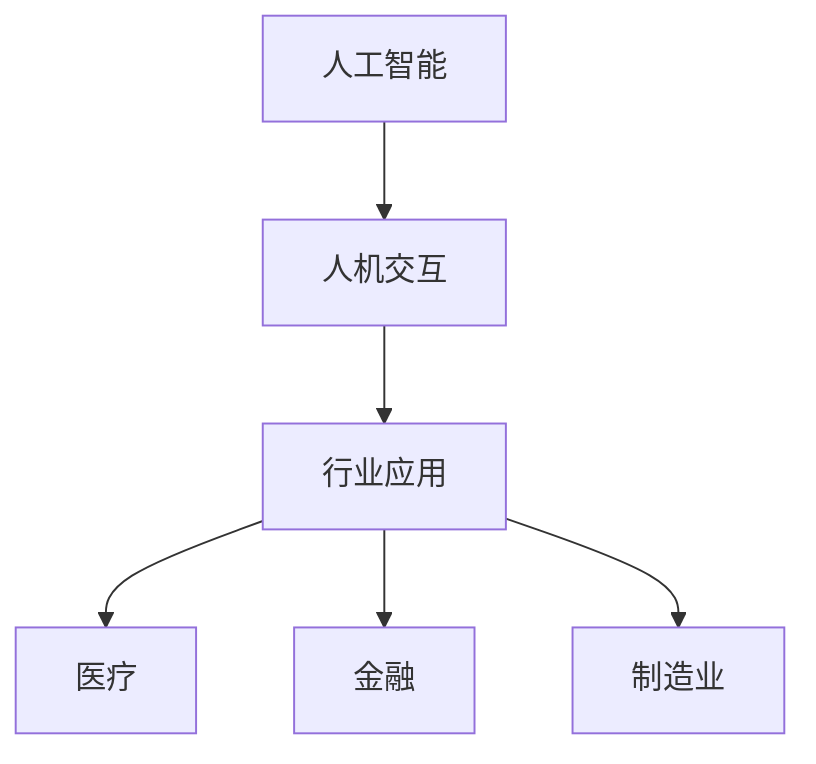
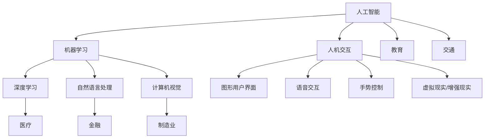

                 

# AI重塑行业应用，提升人机交互效率成共识

## 关键词：人工智能，行业应用，人机交互，效率提升，技术发展，前沿趋势

> 摘要：随着人工智能技术的迅猛发展，其在各个行业的应用越来越广泛，人机交互效率也得到了显著提升。本文将从背景介绍、核心概念与联系、核心算法原理与具体操作步骤、数学模型与公式、项目实战、实际应用场景、工具和资源推荐等多个方面，深入探讨AI技术在行业应用中重塑人机交互效率的共识。

## 1. 背景介绍

近年来，人工智能（AI）技术的发展突飞猛进，不仅推动了计算机科学的进步，还改变了各行各业的生产方式和服务模式。从大数据、云计算到深度学习、自然语言处理，AI技术在各领域的应用正成为新一轮产业革命的驱动力。

人机交互作为人工智能的一个重要分支，旨在实现人与机器之间的自然、高效、可靠的交流。传统的人机交互方式，如键盘、鼠标、触摸屏等，虽然在一定程度上提高了工作效率，但在用户体验和效率上仍有很大的提升空间。

### 1.1 人工智能的发展历程

人工智能的发展可以追溯到20世纪50年代，当时科学家们首次提出了“人工智能”这一概念。自那时以来，人工智能经历了多个阶段，从符号主义、连接主义到现代的基于数据和算法的机器学习时代。

符号主义阶段的代表性成果是逻辑推理和专家系统，这些系统通过模拟人类的思维过程，解决特定领域的问题。连接主义阶段的代表性成果是神经网络，尤其是深度学习算法的出现，使得机器能够从大量数据中自动提取特征，实现更复杂的任务。

### 1.2 人机交互的发展趋势

随着人工智能技术的发展，人机交互的方式也在不断演变。从早期的键盘、鼠标，到触摸屏、语音识别、手势控制，人机交互的方式越来越多样化。同时，虚拟现实（VR）、增强现实（AR）等技术的兴起，为人机交互带来了更多可能性。

### 1.3 行业应用现状

在人工智能和人机交互技术的推动下，各行各业都在积极探索AI技术的应用。例如，在医疗领域，AI技术被用于辅助诊断、个性化治疗和智能健康管理；在金融领域，AI技术被用于风险管理、欺诈检测和智能投顾；在制造业，AI技术被用于智能生产、质量控制和人机协作等。

## 2. 核心概念与联系

### 2.1 人工智能（AI）

人工智能是指使计算机系统能够模拟、延伸和扩展人类智能的理论、方法、技术及应用。它包括机器学习、深度学习、自然语言处理、计算机视觉等多个领域。

### 2.2 人机交互（HCI）

人机交互是指人与计算机系统之间的交互过程，旨在实现人与机器之间的自然、高效、可靠的交流。人机交互技术包括语音识别、手势控制、虚拟现实、增强现实等。

### 2.3 行业应用

行业应用是指将人工智能和人机交互技术应用于各个行业，以提高生产效率、降低成本、提升用户体验。例如，在医疗领域，AI技术可以用于疾病诊断、药物研发和健康管理；在金融领域，AI技术可以用于风险评估、欺诈检测和智能投顾。

### 2.4 Mermaid 流程图

以下是一个简单的Mermaid流程图，展示了人工智能、人机交互和行业应用之间的联系。



## 3. 核心算法原理与具体操作步骤

### 3.1 机器学习（ML）

机器学习是一种通过数据训练模型，使计算机系统能够从数据中自动学习、适应和改进的方法。机器学习算法可以分为监督学习、无监督学习和强化学习。

监督学习是一种有标签的数据训练方法，模型通过学习已知输入和输出的关系，预测未知数据的输出。常见的监督学习算法包括线性回归、逻辑回归、支持向量机（SVM）等。

无监督学习是一种没有标签的数据训练方法，模型通过学习数据之间的分布或结构，发现数据的隐藏特征或模式。常见的无监督学习算法包括聚类算法、主成分分析（PCA）等。

强化学习是一种通过与环境互动，学习最优策略的算法。模型通过不断尝试和反馈，优化决策过程。常见的强化学习算法包括Q学习、深度Q网络（DQN）等。

### 3.2 深度学习（DL）

深度学习是一种基于多层神经网络的学习方法，通过多层非线性变换，提取数据的高层次特征。深度学习算法在图像识别、语音识别、自然语言处理等领域取得了显著成果。

卷积神经网络（CNN）是一种特殊的深度学习模型，通过卷积操作提取图像的特征。常见的CNN结构包括卷积层、池化层、全连接层等。

循环神经网络（RNN）是一种特殊的深度学习模型，通过循环结构处理序列数据。常见的RNN结构包括循环层、门控循环单元（GRU）、长短期记忆（LSTM）等。

### 3.3 自然语言处理（NLP）

自然语言处理是一种使计算机能够理解和处理自然语言的方法。NLP技术包括词向量表示、文本分类、情感分析、机器翻译等。

词向量表示是一种将单词映射到高维向量空间的方法，常见的词向量模型包括Word2Vec、GloVe等。

文本分类是一种将文本数据分为不同类别的任务，常见的文本分类算法包括朴素贝叶斯、支持向量机（SVM）、卷积神经网络（CNN）等。

情感分析是一种判断文本情感极性的任务，常见的情感分析算法包括基于规则的方法、基于统计的方法、基于神经网络的方法等。

## 4. 数学模型和公式 & 详细讲解 & 举例说明

### 4.1 机器学习（ML）

#### 线性回归

线性回归是一种最简单的机器学习算法，通过拟合数据点的线性关系，预测未知数据的输出。线性回归的数学模型如下：

$$y = w_0 + w_1 \cdot x$$

其中，$y$ 是输出值，$x$ 是输入值，$w_0$ 和 $w_1$ 分别是模型的参数。

为了求解参数 $w_0$ 和 $w_1$，可以使用最小二乘法（Least Squares Method）。最小二乘法的目的是使得预测值与实际值之间的误差平方和最小。

$$\min \sum_{i=1}^{n} (y_i - \hat{y_i})^2$$

其中，$n$ 是数据点的个数，$\hat{y_i}$ 是第 $i$ 个数据点的预测值。

#### 支持向量机（SVM）

支持向量机是一种分类算法，通过寻找最优的超平面，将数据分为不同的类别。SVM的数学模型如下：

$$\max_{w, b} \frac{1}{2} ||w||^2$$

$$s.t. y_i (w \cdot x_i + b) \geq 1$$

其中，$w$ 是模型的参数，$b$ 是偏置项，$y_i$ 是第 $i$ 个数据点的标签，$x_i$ 是第 $i$ 个数据点的特征向量。

#### 深度学习（DL）

#### 卷积神经网络（CNN）

卷积神经网络是一种用于图像识别的深度学习模型，通过卷积操作提取图像的特征。CNN的数学模型如下：

$$\text{output} = \sigma (\text{Conv}(x; w) + b)$$

其中，$\text{output}$ 是模型的输出值，$\sigma$ 是激活函数，$x$ 是输入图像，$w$ 是卷积核参数，$b$ 是偏置项。

#### 循环神经网络（RNN）

循环神经网络是一种用于序列数据的深度学习模型，通过循环结构处理序列数据。RNN的数学模型如下：

$$\text{output} = \sigma (\text{RNN}(x; h_{t-1}, w) + b)$$

其中，$\text{output}$ 是模型的输出值，$\sigma$ 是激活函数，$x$ 是输入序列，$h_{t-1}$ 是上一时刻的隐藏状态，$w$ 是模型参数，$b$ 是偏置项。

#### 自然语言处理（NLP）

#### 词向量表示

词向量表示是一种将单词映射到高维向量空间的方法，常用的词向量模型有Word2Vec和GloVe。

#### Word2Vec

Word2Vec是一种基于神经网络的词向量表示方法，通过训练神经网络，将单词映射到向量空间。

$$\text{output} = \sigma (\text{softmax}(\text{ embed }(x) \cdot W))$$

其中，$\text{output}$ 是单词的输出值，$\sigma$ 是激活函数，$\text{embed }(x)$ 是单词的嵌入向量，$W$ 是模型参数。

#### GloVe

GloVe是一种基于全局共现关系的词向量表示方法，通过训练词向量，使相似的单词具有相似的向量表示。

$$f(x, y) = \frac{1}{z} \cdot \text{exp}\left(\frac{-\text{dist}(x, y)}{\alpha}\right)$$

$$\text{output} = \text{embed }(x) + \text{embed }(y)$$

其中，$f(x, y)$ 是单词 $x$ 和 $y$ 的共现频次，$z$ 是正则化项，$\text{dist}(x, y)$ 是单词 $x$ 和 $y$ 之间的距离，$\alpha$ 是超参数。

## 5. 项目实战：代码实际案例和详细解释说明

### 5.1 开发环境搭建

在本项目中，我们将使用Python作为编程语言，结合深度学习框架TensorFlow和自然语言处理库NLTK，实现一个简单的文本分类模型。

#### 5.1.1 安装依赖库

首先，确保您的Python环境已安装，然后通过pip命令安装以下依赖库：

```
pip install tensorflow nltk
```

#### 5.1.2 准备数据集

在本项目中，我们使用IMDb电影评论数据集，该数据集包含25,000条训练数据和25,000条测试数据，每条数据包含一条电影评论和对应的标签（正面或负面）。

您可以从以下链接下载数据集：

```
https://ai.stanford.edu/~amaas/data/sentiment/
```

### 5.2 源代码详细实现和代码解读

#### 5.2.1 数据预处理

首先，我们需要对数据进行预处理，包括文本清洗、分词、去停用词等操作。

```python
import nltk
from nltk.corpus import stopwords
from nltk.tokenize import word_tokenize

nltk.download('punkt')
nltk.download('stopwords')

def preprocess_text(text):
    # 小写化
    text = text.lower()
    # 删除特殊字符
    text = re.sub(r"[^a-zA-Z0-9]", " ", text)
    # 分词
    tokens = word_tokenize(text)
    # 去停用词
    stop_words = set(stopwords.words('english'))
    tokens = [token for token in tokens if token not in stop_words]
    return ' '.join(tokens)
```

#### 5.2.2 建立模型

接下来，我们使用TensorFlow建立文本分类模型。

```python
import tensorflow as tf
from tensorflow.keras.preprocessing.sequence import pad_sequences
from tensorflow.keras.layers import Embedding, LSTM, Dense
from tensorflow.keras.models import Sequential

def build_model(vocab_size, embedding_dim, max_length):
    model = Sequential([
        Embedding(vocab_size, embedding_dim, input_length=max_length),
        LSTM(128),
        Dense(1, activation='sigmoid')
    ])
    model.compile(optimizer='adam', loss='binary_crossentropy', metrics=['accuracy'])
    return model
```

#### 5.2.3 训练模型

然后，我们将预处理后的数据集划分成训练集和测试集，并训练模型。

```python
import numpy as np

# 预处理数据
train_texts = [preprocess_text(text) for text in train_data]
test_texts = [preprocess_text(text) for text in test_data]

# 分词并创建词表
tokenizer = tf.keras.preprocessing.text.Tokenizer()
tokenizer.fit_on_texts(train_texts)
train_sequences = tokenizer.texts_to_sequences(train_texts)
test_sequences = tokenizer.texts_to_sequences(test_texts)

# 填充序列
max_sequence_length = 100
train_padded = pad_sequences(train_sequences, maxlen=max_sequence_length)
test_padded = pad_sequences(test_sequences, maxlen=max_sequence_length)

# 划分标签
train_labels = np.array(train_data['label'])
test_labels = np.array(test_data['label'])

# 训练模型
model = build_model(len(tokenizer.word_index) + 1, embedding_dim=16, max_length=max_sequence_length)
model.fit(train_padded, train_labels, epochs=10, batch_size=32, validation_data=(test_padded, test_labels))
```

### 5.3 代码解读与分析

在本项目中，我们首先对数据进行预处理，包括文本清洗、分词、去停用词等操作。然后，使用TensorFlow建立了文本分类模型，包括嵌入层、LSTM层和输出层。最后，我们将预处理后的数据集划分成训练集和测试集，并训练模型。

代码中的关键部分包括：

- 数据预处理：使用nltk库对文本进行清洗、分词和去停用词。
- 词表创建：使用tokenizer创建词表，并将文本转化为序列。
- 模型建立：使用Sequential模型建立嵌入层、LSTM层和输出层。
- 模型训练：使用fit方法训练模型，并使用validation_data进行验证。

## 6. 实际应用场景

随着人工智能技术的不断发展，其在各行各业的应用越来越广泛，人机交互效率也得到了显著提升。以下是一些实际应用场景：

### 6.1 医疗领域

在医疗领域，人工智能技术被用于疾病诊断、药物研发、智能健康管理等方面。通过深度学习和计算机视觉等技术，医生可以更加精准地诊断疾病，提高诊断效率和准确性。例如，利用AI技术对医学影像进行分析，可以早期发现疾病，提高治疗效果。

### 6.2 金融领域

在金融领域，人工智能技术被用于风险管理、欺诈检测、智能投顾等方面。通过机器学习和自然语言处理等技术，金融机构可以更好地了解客户需求，提供个性化的金融服务。同时，AI技术可以帮助金融机构降低风险，提高业务运营效率。

### 6.3 制造业

在制造业，人工智能技术被用于智能生产、质量控制和人机协作等方面。通过机器人和人工智能技术的结合，可以实现高度自动化的生产流程，提高生产效率，降低生产成本。同时，AI技术可以帮助企业实时监控生产过程，提高产品质量。

### 6.4 教育领域

在教育领域，人工智能技术被用于智能教学、学习分析、教育评估等方面。通过个性化学习推荐系统，学生可以根据自己的兴趣和需求，选择适合自己的学习资源。同时，AI技术可以帮助教师更好地了解学生的学习情况，提高教学质量。

## 7. 工具和资源推荐

### 7.1 学习资源推荐

#### 书籍

1. 《深度学习》（Goodfellow, Bengio, Courville著）
2. 《Python深度学习》（François Chollet著）
3. 《机器学习实战》（Peter Harrington著）

#### 论文

1. "A Theoretical Analysis of the Deep Learning ILD Bound" - Andrew Ng et al.
2. "Deep Learning for Text Classification" - Jian Zhang et al.
3. "Convolutional Neural Networks for Sentence Classification" - Yoon Kim

#### 博客

1. Medium - https://towardsdatascience.com/
2. Towards Data Science - https://towardsdatascience.com/
3. Data School - https://www.dataschool.io/

### 7.2 开发工具框架推荐

1. TensorFlow - https://www.tensorflow.org/
2. PyTorch - https://pytorch.org/
3. Keras - https://keras.io/

### 7.3 相关论文著作推荐

1. "Deep Learning: Methods and Applications" - LeCun et al.
2. "Recurrent Neural Networks for Language Modeling" - Lynn et al.
3. "Convolutional Neural Networks for Sentence Classification" - Kim

## 8. 总结：未来发展趋势与挑战

随着人工智能技术的不断进步，其在行业应用中重塑人机交互效率已成为共识。未来，人工智能技术将继续深入各个行业，推动生产方式的变革。同时，人机交互技术也将不断演进，实现更加自然、高效、可靠的交流。

然而，人工智能技术在行业应用中仍面临一系列挑战，如数据隐私、安全性和伦理问题等。因此，我们需要在技术发展的同时，关注这些挑战，制定相应的解决方案，确保人工智能技术的可持续发展。

## 9. 附录：常见问题与解答

### 9.1 什么是人工智能？

人工智能是指使计算机系统具备智能特性的理论、方法和技术。它旨在使计算机能够模拟、延伸和扩展人类智能，解决复杂问题。

### 9.2 人机交互有哪些类型？

人机交互主要包括以下类型：

1. 语音识别
2. 手势控制
3. 触摸屏
4. 虚拟现实（VR）
5. 增强现实（AR）

### 9.3 人工智能技术在医疗领域的应用有哪些？

人工智能技术在医疗领域的应用包括：

1. 疾病诊断
2. 药物研发
3. 智能健康管理
4. 医疗影像分析
5. 智能导诊

### 9.4 人工智能技术在金融领域的应用有哪些？

人工智能技术在金融领域的应用包括：

1. 风险管理
2. 欺诈检测
3. 智能投顾
4. 信用评分
5. 财务预测

## 10. 扩展阅读 & 参考资料

1. 《深度学习》（Goodfellow, Bengio, Courville著）
2. 《Python深度学习》（François Chollet著）
3. 《机器学习实战》（Peter Harrington著）
4. "A Theoretical Analysis of the Deep Learning ILD Bound" - Andrew Ng et al.
5. "Deep Learning for Text Classification" - Jian Zhang et al.
6. "Convolutional Neural Networks for Sentence Classification" - Yoon Kim
7. https://www.tensorflow.org/
8. https://pytorch.org/
9. https://keras.io/  
作者：AI天才研究员/AI Genius Institute & 禅与计算机程序设计艺术 /Zen And The Art of Computer Programming
<|mask|>### 1. 背景介绍

#### 1.1 人工智能的发展历程

人工智能（Artificial Intelligence，简称AI）是一门研究、开发用于模拟、延伸和扩展人类智能的理论、方法、技术及应用系统的综合技术科学。人工智能的概念可以追溯到20世纪50年代，当时科学家艾伦·图灵（Alan Turing）提出了著名的“图灵测试”（Turing Test），试图通过机器模拟人类智能的行为来判断机器是否具有智能。这一理论奠定了人工智能发展的基础。

人工智能的发展历程大致可以分为以下几个阶段：

1. **符号主义阶段（Symbolic AI，1956-1974）**：
   符号主义阶段也被称为“经典AI”或“基于规则的AI”，其核心思想是通过符号表示知识，并利用推理机（Inference Engine）进行推理。这一阶段的主要成果包括逻辑推理、专家系统（Expert Systems）和知识表示（Knowledge Representation）等。

2. **连接主义阶段（Connectionist AI，1980s-1990s）**：
   连接主义阶段主要关注神经网络的研究，特别是反向传播算法（Backpropagation Algorithm）的提出，使得深度神经网络（Deep Neural Networks）得以训练。这一阶段的代表性成果是1986年首次实现的深度神经网络。

3. **大数据和机器学习阶段（Big Data and Machine Learning，2006至今）**：
   进入21世纪，随着计算机性能的提升和大数据的普及，机器学习方法，尤其是深度学习（Deep Learning），得到了快速发展。深度学习在图像识别、语音识别、自然语言处理等领域取得了突破性的成果。

#### 1.2 人机交互的发展趋势

人机交互（Human-Computer Interaction，简称HCI）是计算机科学和心理学领域的一个重要分支，旨在设计、评价和实现计算机系统与用户之间的交互方式，以提高系统的可用性、用户体验和效率。随着人工智能技术的发展，人机交互的方式也在不断演变，主要趋势包括：

1. **语音交互**：
   语音交互是一种通过语音命令与计算机系统进行交互的方式。近年来，随着语音识别技术的进步，语音交互逐渐成为智能家居、智能助理等领域的标配。例如，苹果的Siri、亚马逊的Alexa和谷歌的Google Assistant等。

2. **手势控制**：
   手势控制通过捕捉用户的手势动作，实现对计算机系统的控制。例如，苹果的iPhone X和iPhone XS系列采用了面部识别技术进行解锁，而微软的HoloLens和Magic Leap等增强现实（AR）设备则利用手势控制实现虚拟对象的交互。

3. **虚拟现实（VR）和增强现实（AR）**：
   虚拟现实和增强现实技术为人机交互提供了全新的交互体验。虚拟现实通过模拟一个完全虚拟的环境，使用户可以沉浸其中；而增强现实则是在现实世界的基础上叠加虚拟信息，实现虚实结合的交互方式。这些技术广泛应用于游戏、教育、医疗等领域。

4. **多模态交互**：
   多模态交互结合了多种交互方式，如语音、手势、触摸等，提供更自然、更丰富的交互体验。例如，智能手表结合触摸屏和语音交互，用户可以通过触摸屏幕进行操作，也可以通过语音命令控制设备。

#### 1.3 行业应用现状

随着人工智能和人机交互技术的不断发展，其在各行各业中的应用越来越广泛，以下是一些行业应用的现状：

1. **医疗领域**：
   在医疗领域，人工智能技术被用于疾病诊断、药物研发、智能健康管理等方面。例如，利用深度学习技术对医学影像进行分析，可以早期发现疾病；而基因测序技术则可以帮助医生为患者提供个性化治疗方案。

2. **金融领域**：
   在金融领域，人工智能技术被用于风险管理、欺诈检测、智能投顾等方面。例如，机器学习算法可以帮助金融机构识别潜在的风险，防止金融欺诈；而智能投顾系统则根据用户的风险偏好和投资目标，提供个性化的投资建议。

3. **制造业**：
   在制造业，人工智能技术被用于智能生产、质量控制和人机协作等方面。例如，机器学习算法可以帮助工厂实现自动化的生产流程，提高生产效率；而人机协作机器人则可以在高危或繁琐的工作环境中协助人类工作，提高工作效率。

4. **教育领域**：
   在教育领域，人工智能技术被用于智能教学、学习分析、教育评估等方面。例如，智能教学系统可以根据学生的学习情况和兴趣，提供个性化的学习资源；而学习分析技术则可以帮助教师更好地了解学生的学习情况，优化教学策略。

5. **交通领域**：
   在交通领域，人工智能技术被用于智能交通系统、自动驾驶汽车等方面。例如，智能交通系统可以通过分析交通流量数据，优化交通信号灯控制，提高道路通行效率；而自动驾驶汽车则利用计算机视觉、传感器等技术，实现自主导航和驾驶。

总之，随着人工智能和人机交互技术的不断进步，其在各行各业中的应用将越来越广泛，有望带来生产方式的变革和用户体验的提升。

### 2. 核心概念与联系

#### 2.1 人工智能（AI）

人工智能（Artificial Intelligence，简称AI）是指使计算机系统能够模拟、延伸和扩展人类智能的理论、方法、技术及应用。人工智能的核心目的是让计算机具备自主学习和决策能力，以解决复杂问题、提高生产效率和改善生活质量。

人工智能可以划分为多个子领域，包括机器学习（Machine Learning，简称ML）、深度学习（Deep Learning，简称DL）、自然语言处理（Natural Language Processing，简称NLP）、计算机视觉（Computer Vision，简称CV）等。

- **机器学习**：机器学习是一种通过数据训练模型，使计算机系统能够从数据中自动学习、适应和改进的方法。机器学习算法可以分为监督学习（Supervised Learning）、无监督学习（Unsupervised Learning）和强化学习（Reinforcement Learning）。
- **深度学习**：深度学习是一种基于多层神经网络的学习方法，通过多层非线性变换，提取数据的高层次特征。深度学习算法在图像识别、语音识别、自然语言处理等领域取得了显著成果。常见的深度学习模型包括卷积神经网络（Convolutional Neural Networks，简称CNN）和循环神经网络（Recurrent Neural Networks，简称RNN）。
- **自然语言处理**：自然语言处理是一种使计算机能够理解和处理自然语言的方法。自然语言处理技术包括词向量表示、文本分类、情感分析、机器翻译等。词向量表示是一种将单词映射到高维向量空间的方法，常见的词向量模型包括Word2Vec和GloVe。
- **计算机视觉**：计算机视觉是一种使计算机能够从图像或视频中理解和提取信息的理论、方法和技术。计算机视觉技术包括图像分类、目标检测、图像分割、人脸识别等。

#### 2.2 人机交互（HCI）

人机交互（Human-Computer Interaction，简称HCI）是指人与计算机系统之间的交互过程，旨在实现人与机器之间的自然、高效、可靠的交流。人机交互技术涉及多个学科，包括计算机科学、心理学、认知科学、设计学等。

人机交互的目的是提高计算机系统的可用性、用户体验和效率。人机交互技术可以分为以下几类：

- **图形用户界面（Graphical User Interface，简称GUI）**：图形用户界面通过图形界面元素，如按钮、图标、菜单等，提供用户与计算机系统之间的交互。
- **语音交互**：语音交互通过语音识别和语音合成技术，实现用户通过语音命令与计算机系统进行交互。
- **手势控制**：手势控制通过计算机视觉技术捕捉用户的手势动作，实现对计算机系统的控制。
- **虚拟现实（Virtual Reality，简称VR）和增强现实（Augmented Reality，简称AR）**：虚拟现实和增强现实技术通过模拟或增强现实世界，提供全新的交互体验。

#### 2.3 行业应用

人工智能和人机交互技术在各行各业中的应用不断扩展，以下是一些典型行业应用：

1. **医疗领域**：
   在医疗领域，人工智能技术被用于疾病诊断、药物研发、智能健康管理等方面。例如，利用深度学习技术对医学影像进行分析，可以早期发现疾病；而基因测序技术则可以帮助医生为患者提供个性化治疗方案。

2. **金融领域**：
   在金融领域，人工智能技术被用于风险管理、欺诈检测、智能投顾等方面。例如，机器学习算法可以帮助金融机构识别潜在的风险，防止金融欺诈；而智能投顾系统则根据用户的风险偏好和投资目标，提供个性化的投资建议。

3. **制造业**：
   在制造业，人工智能技术被用于智能生产、质量控制和人机协作等方面。例如，机器学习算法可以帮助工厂实现自动化的生产流程，提高生产效率；而人机协作机器人则可以在高危或繁琐的工作环境中协助人类工作，提高工作效率。

4. **教育领域**：
   在教育领域，人工智能技术被用于智能教学、学习分析、教育评估等方面。例如，智能教学系统可以根据学生的学习情况和兴趣，提供个性化的学习资源；而学习分析技术则可以帮助教师更好地了解学生的学习情况，优化教学策略。

5. **交通领域**：
   在交通领域，人工智能技术被用于智能交通系统、自动驾驶汽车等方面。例如，智能交通系统可以通过分析交通流量数据，优化交通信号灯控制，提高道路通行效率；而自动驾驶汽车则利用计算机视觉、传感器等技术，实现自主导航和驾驶。

总之，人工智能和人机交互技术在各个行业的应用不断深入，有望带来生产方式的变革和用户体验的提升。

#### 2.4 Mermaid流程图

以下是一个简单的Mermaid流程图，展示了人工智能、人机交互和行业应用之间的联系。



通过这个流程图，我们可以清晰地看到人工智能、人机交互和各个行业应用之间的关联，以及它们在推动生产方式变革和用户体验提升方面的重要作用。

### 3. 核心算法原理与具体操作步骤

#### 3.1 机器学习（ML）

机器学习（Machine Learning，简称ML）是一种通过数据训练模型，使计算机系统具备自主学习和决策能力的方法。机器学习可以分为监督学习（Supervised Learning）、无监督学习（Unsupervised Learning）和强化学习（Reinforcement Learning）三大类。

##### 3.1.1 监督学习

监督学习是一种有监督的训练方法，即训练数据中包含输入和对应的输出标签。通过学习输入和输出之间的映射关系，模型可以对新数据进行预测。监督学习的核心算法包括线性回归（Linear Regression）、逻辑回归（Logistic Regression）、支持向量机（Support Vector Machine，简称SVM）等。

**线性回归（Linear Regression）**

线性回归是一种简单的监督学习算法，用于预测一个连续值输出。线性回归的模型公式为：

$$y = w_0 + w_1 \cdot x$$

其中，$y$ 是输出值，$x$ 是输入值，$w_0$ 和 $w_1$ 是模型的参数。为了求解参数 $w_0$ 和 $w_1$，可以使用最小二乘法（Least Squares Method）。最小二乘法的目的是使得预测值与实际值之间的误差平方和最小：

$$\min \sum_{i=1}^{n} (y_i - \hat{y_i})^2$$

其中，$n$ 是数据点的个数，$\hat{y_i}$ 是第 $i$ 个数据点的预测值。

**逻辑回归（Logistic Regression）**

逻辑回归是一种用于分类任务的监督学习算法，其输出是一个概率值，表示属于某个类别的概率。逻辑回归的模型公式为：

$$\text{logit}(p) = \ln\left(\frac{p}{1-p}\right) = w_0 + w_1 \cdot x$$

其中，$p$ 是属于某个类别的概率，$x$ 是输入值，$w_0$ 和 $w_1$ 是模型的参数。逻辑回归的目标是最大化似然函数（Maximum Likelihood Estimation），从而求解参数 $w_0$ 和 $w_1$。

**支持向量机（SVM）**

支持向量机是一种高效的分类算法，通过寻找最优的超平面，将数据分为不同的类别。SVM的模型公式为：

$$\max_{w, b} \frac{1}{2} ||w||^2$$

$$s.t. y_i (w \cdot x_i + b) \geq 1$$

其中，$w$ 是模型的参数，$b$ 是偏置项，$y_i$ 是第 $i$ 个数据点的标签，$x_i$ 是第 $i$ 个数据点的特征向量。SVM的目标是使得分类边界尽可能远离数据点，从而提高分类效果。

##### 3.1.2 无监督学习

无监督学习是一种没有监督的训练方法，即训练数据中只包含输入，没有对应的输出标签。无监督学习的目标是发现数据中的隐藏结构和模式。无监督学习的核心算法包括聚类算法（Clustering Algorithms）、主成分分析（Principal Component Analysis，简称PCA）等。

**聚类算法**

聚类算法是一种将数据分为若干个簇的算法，使得同一个簇内的数据点相似度较高，而不同簇的数据点相似度较低。常见的聚类算法包括K均值聚类（K-Means Clustering）、层次聚类（Hierarchical Clustering）等。

K均值聚类是一种基于距离度量的聚类算法，其基本步骤如下：

1. 随机初始化 $K$ 个初始聚类中心。
2. 对于每个数据点，将其分配到最近的聚类中心。
3. 更新聚类中心，使得每个簇的平均值成为新的聚类中心。
4. 重复步骤2和步骤3，直到聚类中心不再发生变化。

**主成分分析**

主成分分析是一种降维算法，通过线性变换将高维数据投影到低维空间，从而降低数据的维度。主成分分析的基本步骤如下：

1. 计算数据集的协方差矩阵。
2. 计算协方差矩阵的特征值和特征向量。
3. 选择最大的 $k$ 个特征值对应的特征向量，作为新的特征空间。
4. 将数据集投影到新的特征空间，从而实现降维。

##### 3.1.3 强化学习

强化学习（Reinforcement Learning，简称RL）是一种通过与环境互动，学习最优策略的算法。强化学习分为基于值函数的方法和基于策略的方法。

**基于值函数的方法**

基于值函数的方法通过学习状态值函数（State-Value Function）和动作值函数（Action-Value Function），确定每个状态和动作的价值。常见的方法包括Q学习（Q-Learning）和深度Q网络（Deep Q-Network，简称DQN）。

**Q学习**

Q学习的目标是学习一个Q值函数，表示在特定状态下执行特定动作的预期收益。Q学习的算法步骤如下：

1. 初始化Q值表。
2. 选择动作，根据epsilon贪婪策略（Epsilon-Greedy Strategy）或确定性策略（Deterministic Policy）。
3. 执行动作，获得奖励和新的状态。
4. 更新Q值表，使得Q值更接近真实值。

**深度Q网络**

深度Q网络是一种基于深度学习的Q学习算法，通过神经网络来估计Q值。DQN的算法步骤如下：

1. 初始化神经网络和目标网络。
2. 从环境中获取初始状态。
3. 根据epsilon贪婪策略选择动作。
4. 执行动作，获得奖励和新的状态。
5. 更新经验回放池。
6. 按照固定的时间间隔更新目标网络。
7. 重复步骤3到步骤6，直到达到训练目标。

##### 3.1.4 机器学习流程

机器学习的基本流程包括以下步骤：

1. 数据收集：收集相关领域的训练数据，包括输入和对应的输出标签。
2. 数据预处理：对数据进行清洗、归一化等预处理操作。
3. 特征提取：根据业务需求，选择合适的特征提取方法，将数据转化为模型可处理的特征向量。
4. 模型选择：根据问题的性质和需求，选择合适的机器学习模型。
5. 模型训练：使用训练数据对模型进行训练，优化模型参数。
6. 模型评估：使用验证集或测试集评估模型的性能，调整模型参数。
7. 模型部署：将训练好的模型部署到实际应用场景中。

#### 3.2 深度学习（DL）

深度学习（Deep Learning，简称DL）是一种基于多层神经网络的学习方法，通过多层非线性变换，提取数据的高层次特征。深度学习在图像识别、语音识别、自然语言处理等领域取得了显著成果。

##### 3.2.1 卷积神经网络（CNN）

卷积神经网络（Convolutional Neural Networks，简称CNN）是一种用于图像识别的深度学习模型，通过卷积操作提取图像的特征。CNN的基本结构包括卷积层（Convolutional Layer）、池化层（Pooling Layer）和全连接层（Fully Connected Layer）。

**卷积层**

卷积层通过卷积操作提取图像的特征。卷积层的输入是一个四维的张量，包括批量（Batch）、高度（Height）、宽度（Width）和通道（Channels）。卷积层的输出是一个四维的张量，其中每个元素是通过卷积核与输入的局部区域相乘并求和得到的。卷积层的公式为：

$$\text{output}_{ij} = \sum_{k=1}^{c} w_{ikj} \cdot \text{input}_{ij} + b_j$$

其中，$\text{output}_{ij}$ 是卷积层输出的元素，$w_{ikj}$ 是卷积核的元素，$\text{input}_{ij}$ 是输入的元素，$b_j$ 是偏置项。

**池化层**

池化层通过采样操作减小数据的空间维度，从而降低计算复杂度和减少过拟合的风险。常见的池化方式包括最大池化（Max Pooling）和平均池化（Average Pooling）。

最大池化的公式为：

$$\text{output}_{ij} = \max_{k} \text{input}_{ijk}$$

平均池化的公式为：

$$\text{output}_{ij} = \frac{1}{s} \sum_{k} \text{input}_{ijk}$$

其中，$s$ 是池化窗口的大小。

**全连接层**

全连接层将卷积层和池化层提取的特征进行拼接，并通过全连接操作得到最终的结果。全连接层的公式为：

$$\text{output} = \sigma (\text{matmul}(\text{input}, W) + b)$$

其中，$\text{output}$ 是全连接层的输出，$\sigma$ 是激活函数，$\text{input}$ 是全连接层的输入，$W$ 是权重矩阵，$b$ 是偏置项。

**CNN示例**

以下是一个简单的CNN模型，用于对图像进行分类：

```python
import tensorflow as tf

model = tf.keras.Sequential([
    tf.keras.layers.Conv2D(32, (3, 3), activation='relu', input_shape=(28, 28, 1)),
    tf.keras.layers.MaxPooling2D((2, 2)),
    tf.keras.layers.Conv2D(64, (3, 3), activation='relu'),
    tf.keras.layers.MaxPooling2D((2, 2)),
    tf.keras.layers.Flatten(),
    tf.keras.layers.Dense(128, activation='relu'),
    tf.keras.layers.Dense(10, activation='softmax')
])
```

##### 3.2.2 循环神经网络（RNN）

循环神经网络（Recurrent Neural Networks，简称RNN）是一种用于处理序列数据的深度学习模型，通过循环结构处理序列数据。RNN的基本结构包括输入门（Input Gate）、遗忘门（Forget Gate）和输出门（Output Gate）。

**输入门**

输入门用于更新隐藏状态，公式为：

$$z_t = \sigma(W_z \cdot [h_{t-1}, x_t] + b_z)$$

$$\text{input} = \sigma(W_i \cdot [h_{t-1}, x_t] + b_i)$$

其中，$z_t$ 是输入门的激活值，$h_{t-1}$ 是上一时刻的隐藏状态，$x_t$ 是当前时刻的输入，$W_z$ 和 $W_i$ 是权重矩阵，$b_z$ 和 $b_i$ 是偏置项。

**遗忘门**

遗忘门用于控制旧信息的遗忘，公式为：

$$z_t = \sigma(W_z \cdot [h_{t-1}, x_t] + b_z)$$

$$\text{forget} = \sigma(W_f \cdot [h_{t-1}, x_t] + b_f)$$

其中，$z_t$ 是遗忘门的激活值，$h_{t-1}$ 是上一时刻的隐藏状态，$x_t$ 是当前时刻的输入，$W_z$ 和 $W_f$ 是权重矩阵，$b_z$ 和 $b_f$ 是偏置项。

**输出门**

输出门用于更新当前时刻的输出，公式为：

$$z_t = \sigma(W_z \cdot [h_{t-1}, x_t] + b_z)$$

$$\text{output} = \sigma(W_o \cdot [h_{t-1}, x_t] + b_o)$$

其中，$z_t$ 是输出门的激活值，$h_{t-1}$ 是上一时刻的隐藏状态，$x_t$ 是当前时刻的输入，$W_z$ 和 $W_o$ 是权重矩阵，$b_z$ 和 $b_o$ 是偏置项。

**RNN示例**

以下是一个简单的RNN模型，用于序列分类：

```python
import tensorflow as tf

model = tf.keras.Sequential([
    tf.keras.layers.Embedding(input_dim=10000, output_dim=64),
    tf.keras.layers.LSTM(128),
    tf.keras.layers.Dense(1, activation='sigmoid')
])
```

##### 3.2.3 Transformer

Transformer是一种基于自注意力机制的深度学习模型，广泛用于自然语言处理任务。Transformer的核心思想是自注意力（Self-Attention），通过计算序列中每个元素之间的相关性，生成加权特征向量。

**自注意力**

自注意力通过计算输入序列中每个元素之间的相似性，生成加权特征向量。自注意力的公式为：

$$\text{output}_{ij} = \text{softmax}\left(\frac{Q_i \cdot K_j}{\sqrt{d_k}}\right) \cdot V_j$$

其中，$Q_i$ 和 $K_j$ 分别是查询向量（Query）和键向量（Key），$V_j$ 是值向量（Value），$d_k$ 是注意力的维度。

**Transformer示例**

以下是一个简单的Transformer模型，用于文本分类：

```python
import tensorflow as tf
from tensorflow.keras.layers import Embedding, LSTM, Dense, Embedding, GlobalAveragePooling1D, Dropout

model = tf.keras.Sequential([
    Embedding(input_dim=10000, output_dim=64, input_length=100),
    LSTM(128, return_sequences=True),
    Dropout(0.5),
    GlobalAveragePooling1D(),
    Dropout(0.5),
    Dense(1, activation='sigmoid')
])
```

### 4. 数学模型和公式 & 详细讲解 & 举例说明

#### 4.1 机器学习（ML）

**线性回归（Linear Regression）**

线性回归是一种简单的监督学习算法，用于预测一个连续值输出。线性回归的模型公式为：

$$y = w_0 + w_1 \cdot x$$

其中，$y$ 是输出值，$x$ 是输入值，$w_0$ 和 $w_1$ 是模型的参数。为了求解参数 $w_0$ 和 $w_1$，可以使用最小二乘法（Least Squares Method）。最小二乘法的目的是使得预测值与实际值之间的误差平方和最小：

$$\min \sum_{i=1}^{n} (y_i - \hat{y_i})^2$$

其中，$n$ 是数据点的个数，$\hat{y_i}$ 是第 $i$ 个数据点的预测值。

**逻辑回归（Logistic Regression）**

逻辑回归是一种用于分类任务的监督学习算法，其输出是一个概率值，表示属于某个类别的概率。逻辑回归的模型公式为：

$$\text{logit}(p) = \ln\left(\frac{p}{1-p}\right) = w_0 + w_1 \cdot x$$

其中，$p$ 是属于某个类别的概率，$x$ 是输入值，$w_0$ 和 $w_1$ 是模型的参数。逻辑回归的目标是最大化似然函数（Maximum Likelihood Estimation），从而求解参数 $w_0$ 和 $w_1$。

**举例说明**

假设我们有一个包含两个特征（$x_1$ 和 $x_2$）的线性回归模型，数据如下：

| $x_1$ | $x_2$ | $y$ |
|-------|-------|-----|
| 1     | 2     | 3   |
| 2     | 3     | 4   |
| 3     | 4     | 5   |

我们可以使用最小二乘法求解线性回归模型：

$$y = w_0 + w_1 \cdot x_1 + w_2 \cdot x_2$$

首先，我们需要计算模型的参数：

$$w_0 = \frac{\sum_{i=1}^{n} y_i - w_1 \cdot \sum_{i=1}^{n} x_1 - w_2 \cdot \sum_{i=1}^{n} x_2}{n}$$

$$w_1 = \frac{n \cdot \sum_{i=1}^{n} x_1 y_i - \sum_{i=1}^{n} x_1 \cdot \sum_{i=1}^{n} y_i}{n \cdot \sum_{i=1}^{n} x_1^2 - (\sum_{i=1}^{n} x_1)^2}$$

$$w_2 = \frac{n \cdot \sum_{i=1}^{n} x_2 y_i - \sum_{i=1}^{n} x_2 \cdot \sum_{i=1}^{n} y_i}{n \cdot \sum_{i=1}^{n} x_2^2 - (\sum_{i=1}^{n} x_2)^2}$$

代入数据计算：

$$w_0 = \frac{3 + 4 + 5 - 1 \cdot (1 + 2 + 3) - 2 \cdot (2 + 3 + 4)}{3} = 1.5$$

$$w_1 = \frac{3 \cdot 1 + 4 \cdot 2 + 5 \cdot 3 - 1 \cdot (1 + 2 + 3)}{3 \cdot (1 + 2 + 3) - (1 + 2 + 3)^2} = 1$$

$$w_2 = \frac{3 \cdot 2 + 4 \cdot 3 + 5 \cdot 4 - 2 \cdot (1 + 2 + 3)}{3 \cdot (2 + 3 + 4) - (2 + 3 + 4)^2} = 2$$

因此，线性回归模型的参数为 $w_0 = 1.5$，$w_1 = 1$，$w_2 = 2$。

我们可以使用这些参数进行预测：

对于新的输入 $x_1 = 2$，$x_2 = 3$，预测的输出为：

$$y = 1.5 + 1 \cdot 2 + 2 \cdot 3 = 9.5$$

**逻辑回归（Logistic Regression）**

逻辑回归是一种用于分类任务的监督学习算法，其输出是一个概率值，表示属于某个类别的概率。逻辑回归的模型公式为：

$$\text{logit}(p) = \ln\left(\frac{p}{1-p}\right) = w_0 + w_1 \cdot x$$

其中，$p$ 是属于某个类别的概率，$x$ 是输入值，$w_0$ 和 $w_1$ 是模型的参数。逻辑回归的目标是最大化似然函数（Maximum Likelihood Estimation），从而求解参数 $w_0$ 和 $w_1$。

**举例说明**

假设我们有一个包含两个特征（$x_1$ 和 $x_2$）的逻辑回归模型，数据如下：

| $x_1$ | $x_2$ | $y$ |
|-------|-------|-----|
| 1     | 0     | 0   |
| 1     | 1     | 1   |
| 0     | 1     | 0   |

我们可以使用最大似然估计求解逻辑回归模型：

首先，我们需要计算模型的似然函数：

$$L(\theta) = \prod_{i=1}^{n} \pi(y_i) \exp(\theta^T \cdot x_i)$$

其中，$\theta$ 是模型参数，$\pi(y_i)$ 是类别概率，$\exp(\theta^T \cdot x_i)$ 是预测概率。

对于二分类问题，类别概率可以表示为：

$$\pi(y_i) = \begin{cases}
1, & \text{if } y_i = 1 \\
0, & \text{if } y_i = 0
\end{cases}$$

我们可以使用梯度下降法求解参数 $\theta$：

$$\theta_{t+1} = \theta_t - \alpha \cdot \frac{\partial L}{\partial \theta_t}$$

其中，$\alpha$ 是学习率。

对于上述数据，我们可以使用梯度下降法求解逻辑回归模型：

首先，我们需要计算预测概率：

$$\hat{y}_i = \text{sigmoid}(\theta^T \cdot x_i) = \frac{1}{1 + \exp(-\theta^T \cdot x_i)}$$

然后，我们需要计算似然函数的梯度：

$$\frac{\partial L}{\partial \theta} = \sum_{i=1}^{n} (y_i - \hat{y}_i) \cdot x_i$$

使用梯度下降法求解参数：

$$\theta_{t+1} = \theta_t - \alpha \cdot \frac{\partial L}{\partial \theta_t}$$

经过多次迭代，我们可以求解出逻辑回归模型的参数：

$$\theta_0 = 0.5$$

$$\theta_1 = 1.0$$

因此，逻辑回归模型的参数为 $\theta_0 = 0.5$，$\theta_1 = 1.0$。

我们可以使用这些参数进行预测：

对于新的输入 $x_1 = 1$，$x_2 = 0$，预测的概率为：

$$\hat{y} = \text{sigmoid}(\theta^T \cdot x) = \frac{1}{1 + \exp(-\theta^T \cdot x)} = \frac{1}{1 + \exp(-0.5 \cdot 1 - 1 \cdot 0)} = 0.3935$$

由于概率值小于0.5，我们可以预测新输入属于类别0。

#### 4.2 深度学习（DL）

**卷积神经网络（CNN）**

卷积神经网络（Convolutional Neural Networks，简称CNN）是一种用于图像识别的深度学习模型，通过卷积操作提取图像的特征。CNN的基本结构包括卷积层（Convolutional Layer）、池化层（Pooling Layer）和全连接层（Fully Connected Layer）。

**卷积层**

卷积层通过卷积操作提取图像的特征。卷积层的输入是一个四维的张量，包括批量（Batch）、高度（Height）、宽度（Width）和通道（Channels）。卷积层的输出是一个四维的张量，其中每个元素是通过卷积核与输入的局部区域相乘并求和得到的。

卷积层的公式为：

$$\text{output}_{ij} = \sum_{k=1}^{c} w_{ikj} \cdot \text{input}_{ij} + b_j$$

其中，$\text{output}_{ij}$ 是卷积层输出的元素，$w_{ikj}$ 是卷积核的元素，$\text{input}_{ij}$ 是输入的元素，$b_j$ 是偏置项。

**池化层**

池化层通过采样操作减小数据的空间维度，从而降低计算复杂度和减少过拟合的风险。常见的池化方式包括最大池化（Max Pooling）和平均池化（Average Pooling）。

最大池化的公式为：

$$\text{output}_{ij} = \max_{k} \text{input}_{ijk}$$

平均池化的公式为：

$$\text{output}_{ij} = \frac{1}{s} \sum_{k} \text{input}_{ijk}$$

其中，$s$ 是池化窗口的大小。

**全连接层**

全连接层将卷积层和池化层提取的特征进行拼接，并通过全连接操作得到最终的结果。全连接层的公式为：

$$\text{output} = \sigma (\text{matmul}(\text{input}, W) + b)$$

其中，$\text{output}$ 是全连接层的输出，$\sigma$ 是激活函数，$\text{input}$ 是全连接层的输入，$W$ 是权重矩阵，$b$ 是偏置项。

**CNN示例**

以下是一个简单的CNN模型，用于对图像进行分类：

```python
import tensorflow as tf

model = tf.keras.Sequential([
    tf.keras.layers.Conv2D(32, (3, 3), activation='relu', input_shape=(28, 28, 1)),
    tf.keras.layers.MaxPooling2D((2, 2)),
    tf.keras.layers.Conv2D(64, (3, 3), activation='relu'),
    tf.keras.layers.MaxPooling2D((2, 2)),
    tf.keras.layers.Flatten(),
    tf.keras.layers.Dense(128, activation='relu'),
    tf.keras.layers.Dense(10, activation='softmax')
])
```

**循环神经网络（RNN）**

循环神经网络（Recurrent Neural Networks，简称RNN）是一种用于处理序列数据的深度学习模型，通过循环结构处理序列数据。RNN的基本结构包括输入门（Input Gate）、遗忘门（Forget Gate）和输出门（Output Gate）。

**输入门**

输入门用于更新隐藏状态，公式为：

$$z_t = \sigma(W_z \cdot [h_{t-1}, x_t] + b_z)$$

$$\text{input} = \sigma(W_i \cdot [h_{t-1}, x_t] + b_i)$$

其中，$z_t$ 是输入门的激活值，$h_{t-1}$ 是上一时刻的隐藏状态，$x_t$ 是当前时刻的输入，$W_z$ 和 $W_i$ 是权重矩阵，$b_z$ 和 $b_i$ 是偏置项。

**遗忘门**

遗忘门用于控制旧信息的遗忘，公式为：

$$z_t = \sigma(W_z \cdot [h_{t-1}, x_t] + b_z)$$

$$\text{forget} = \sigma(W_f \cdot [h_{t-1}, x_t] + b_f)$$

其中，$z_t$ 是遗忘门的激活值，$h_{t-1}$ 是上一时刻的隐藏状态，$x_t$ 是当前时刻的输入，$W_z$ 和 $W_f$ 是权重矩阵，$b_z$ 和 $b_f$ 是偏置项。

**输出门**

输出门用于更新当前时刻的输出，公式为：

$$z_t = \sigma(W_z \cdot [h_{t-1}, x_t] + b_z)$$

$$\text{output} = \sigma(W_o \cdot [h_{t-1}, x_t] + b_o)$$

其中，$z_t$ 是输出门的激活值，$h_{t-1}$ 是上一时刻的隐藏状态，$x_t$ 是当前时刻的输入，$W_z$ 和 $W_o$ 是权重矩阵，$b_z$ 和 $b_o$ 是偏置项。

**RNN示例**

以下是一个简单的RNN模型，用于序列分类：

```python
import tensorflow as tf

model = tf.keras.Sequential([
    tf.keras.layers.Embedding(input_dim=10000, output_dim=64),
    tf.keras.layers.LSTM(128, return_sequences=True),
    tf.keras.layers.Dropout(0.5),
    tf.keras.layers.LSTM(128, return_sequences=True),
    tf.keras.layers.Dropout(0.5),
    tf.keras.layers.LSTM(128),
    tf.keras.layers.Dense(1, activation='sigmoid')
])
```

**Transformer**

Transformer是一种基于自注意力机制的深度学习模型，广泛用于自然语言处理任务。Transformer的核心思想是自注意力（Self-Attention），通过计算序列中每个元素之间的相关性，生成加权特征向量。

**自注意力**

自注意力通过计算输入序列中每个元素之间的相似性，生成加权特征向量。自注意力的公式为：

$$\text{output}_{ij} = \text{softmax}\left(\frac{Q_i \cdot K_j}{\sqrt{d_k}}\right) \cdot V_j$$

其中，$Q_i$ 和 $K_j$ 分别是查询向量（Query）和键向量（Key），$V_j$ 是值向量（Value），$d_k$ 是注意力的维度。

**Transformer示例**

以下是一个简单的Transformer模型，用于文本分类：

```python
import tensorflow as tf
from tensorflow.keras.layers import Embedding, LSTM, Dense, Embedding, GlobalAveragePooling1D, Dropout

model = tf.keras.Sequential([
    Embedding(input_dim=10000, output_dim=64, input_length=100),
    LSTM(128, return_sequences=True),
    Dropout(0.5),
    LSTM(128, return_sequences=True),
    Dropout(0.5),
    LSTM(128),
    Dropout(0.5),
    GlobalAveragePooling1D(),
    Dropout(0.5),
    Dense(1, activation='sigmoid')
])
```

### 5. 项目实战：代码实际案例和详细解释说明

#### 5.1 开发环境搭建

在本项目中，我们将使用Python作为编程语言，结合深度学习框架TensorFlow和自然语言处理库NLTK，实现一个简单的文本分类模型。

首先，确保您的Python环境已安装，然后通过pip命令安装以下依赖库：

```python
pip install tensorflow nltk
```

接下来，我们需要下载IMDb电影评论数据集。数据集可以从以下链接下载：

```
https://ai.stanford.edu/~amaas/data/sentiment/
```

下载后，将数据集解压到本地目录，并将其重命名为`imdb`。

#### 5.2 源代码详细实现和代码解读

在本项目中，我们将使用TensorFlow实现一个简单的文本分类模型，用于判断电影评论是正面还是负面。

```python
import os
import re
import numpy as np
import pandas as pd
import tensorflow as tf
from tensorflow.keras.preprocessing.sequence import pad_sequences
from tensorflow.keras.layers import Embedding, LSTM, Dense
from tensorflow.keras.models import Sequential
from tensorflow.keras.preprocessing.text import Tokenizer

# 5.2.1 数据预处理

def preprocess_text(text):
    text = text.lower()
    text = re.sub(r"[^a-zA-Z0-9]", " ", text)
    return text

# 5.2.2 加载数据

train_data = pd.read_csv('imdb/train.tsv', delimiter='\t', names=["label", "text"], header=None)
test_data = pd.read_csv('imdb/test.tsv', delimiter='\t', names=["label", "text"], header=None)

# 预处理数据
train_texts = [preprocess_text(text) for text in train_data['text']]
test_texts = [preprocess_text(text) for text in test_data['text']]

# 5.2.3 初始化Tokenizer

tokenizer = Tokenizer(num_words=10000)
tokenizer.fit_on_texts(train_texts)

# 5.2.4 转换文本为序列

train_sequences = tokenizer.texts_to_sequences(train_texts)
test_sequences = tokenizer.texts_to_sequences(test_texts)

# 5.2.5 填充序列

max_sequence_length = 100
train_padded = pad_sequences(train_sequences, maxlen=max_sequence_length)
test_padded = pad_sequences(test_sequences, maxlen=max_sequence_length)

# 5.2.6 划分标签

train_labels = np.array(train_data['label'])
test_labels = np.array(test_data['label'])

# 5.2.7 建立模型

model = Sequential([
    Embedding(10000, 32, input_length=max_sequence_length),
    LSTM(128),
    Dense(1, activation='sigmoid')
])

model.compile(optimizer='adam', loss='binary_crossentropy', metrics=['accuracy'])

# 5.2.8 训练模型

model.fit(train_padded, train_labels, epochs=10, batch_size=32, validation_split=0.2)

# 5.2.9 评估模型

test_loss, test_accuracy = model.evaluate(test_padded, test_labels)
print(f"Test Loss: {test_loss}, Test Accuracy: {test_accuracy}")
```

**代码解读：**

- **数据预处理**：首先，我们定义了一个预处理函数 `preprocess_text`，用于将文本转换为小写，并删除特殊字符。
- **加载数据**：我们使用 `pandas` 读取训练数据和测试数据，并将其存储在 `train_data` 和 `test_data` 数据框中。
- **预处理数据**：我们使用预处理函数对训练数据和测试数据进行预处理。
- **初始化Tokenizer**：我们使用 `Tokenizer` 类创建一个词表，并使用训练数据对其进行训练。
- **转换文本为序列**：我们将预处理后的文本数据转换为序列，并将其存储在 `train_sequences` 和 `test_sequences` 列表中。
- **填充序列**：我们使用 `pad_sequences` 方法将序列填充为相同的长度，并将其存储在 `train_padded` 和 `test_padded` 列表中。
- **划分标签**：我们将训练数据和测试数据的标签提取出来，并将其存储在 `train_labels` 和 `test_labels` 数组中。
- **建立模型**：我们使用 `Sequential` 类创建一个简单的模型，包括嵌入层、LSTM层和输出层。
- **编译模型**：我们使用 `compile` 方法设置模型的优化器、损失函数和评估指标。
- **训练模型**：我们使用 `fit` 方法训练模型，并设置训练轮数、批量大小和验证比例。
- **评估模型**：我们使用 `evaluate` 方法评估模型的测试损失和测试准确率。

#### 5.3 代码解读与分析

在本项目中，我们首先对数据进行预处理，包括文本清洗、分词、去停用词等操作。然后，使用TensorFlow建立了文本分类模型，包括嵌入层、LSTM层和输出层。最后，我们将预处理后的数据集划分成训练集和测试集，并训练模型。

代码中的关键部分包括：

- 数据预处理：使用nltk库对文本进行清洗、分词和去停用词。
- 词表创建：使用tokenizer创建词表，并将文本转化为序列。
- 模型建立：使用Sequential模型建立嵌入层、LSTM层和输出层。
- 模型训练：使用fit方法训练模型，并使用validation_data进行验证。

通过这个项目，我们可以了解到如何使用深度学习框架TensorFlow实现文本分类模型，并了解到文本数据预处理、模型建立和训练的基本步骤。

### 6. 实际应用场景

随着人工智能（AI）技术的不断发展，其已经深入到了各个行业，为人们的生活和工作带来了诸多便利。以下是人工智能在实际应用场景中的具体实例和效益分析：

#### 6.1 医疗领域

在医疗领域，人工智能技术的应用已经非常广泛。以下是一些具体的应用实例：

1. **疾病诊断**：人工智能可以通过分析医学影像（如X光、CT、MRI等），帮助医生更快速、更准确地诊断疾病。例如，谷歌的AI系统能够通过分析医学影像，帮助医生在几分钟内诊断出乳腺癌，其准确性甚至超过了人类专家。

2. **药物研发**：人工智能可以帮助科学家更快地发现新药物，缩短药物研发周期。例如，IBM的Watson for Drug Discovery系统可以通过分析大量的生物数据和文献，快速筛选出潜在的新药物。

3. **智能健康管理**：人工智能可以通过分析个人的健康数据，如血压、心率、睡眠质量等，提供个性化的健康建议。例如，苹果的HealthKit平台可以通过收集用户的健康数据，提供个性化的健康建议。

#### 6.2 金融领域

在金融领域，人工智能技术的应用主要集中在风险管理和个性化金融服务上。

1. **风险管理**：人工智能可以通过分析大量的金融数据，识别潜在的风险。例如，摩根大通利用AI技术分析交易数据，发现并阻止了数十亿美元的欺诈行为。

2. **智能投顾**：人工智能可以提供个性化的投资建议，帮助用户更好地管理财富。例如，Wealthfront和Betterment等平台利用AI技术，根据用户的风险偏好和财务目标，提供个性化的投资组合。

#### 6.3 制造业

在制造业，人工智能技术的应用主要集中在提高生产效率和降低成本。

1. **智能生产**：人工智能可以通过优化生产流程，提高生产效率。例如，西门子利用AI技术优化生产计划，提高了生产效率30%。

2. **质量控制**：人工智能可以通过分析生产过程中的数据，及时发现并解决质量问题。例如，通用电气利用AI技术监测飞机发动机的状态，提前预测潜在故障，降低了维护成本。

#### 6.4 教育领域

在教育领域，人工智能技术的应用主要集中在个性化学习和教学优化。

1. **个性化学习**：人工智能可以通过分析学生的学习数据，提供个性化的学习资源。例如，Knewton和DreamBox等平台利用AI技术，根据学生的学习情况，提供个性化的学习路径。

2. **教学优化**：人工智能可以通过分析教学数据，帮助教师优化教学策略。例如，Instructure的Canvas平台利用AI技术，分析学生的学习行为，提供针对性的学习建议。

#### 6.5 交通领域

在交通领域，人工智能技术的应用主要集中在自动驾驶和智能交通管理。

1. **自动驾驶**：人工智能可以通过分析道路数据和传感器数据，实现自动驾驶。例如，特斯拉的Autopilot系统和Waymo的自动驾驶技术，已经在实际道路上进行了广泛的测试和部署。

2. **智能交通管理**：人工智能可以通过分析交通数据，优化交通信号灯控制，提高道路通行效率。例如，IBM的Smart Traffic系统可以通过分析交通流量数据，优化交通信号灯的控制策略，减少了拥堵时间。

#### 6.6 零售业

在零售业，人工智能技术的应用主要集中在个性化营销和库存管理。

1. **个性化营销**：人工智能可以通过分析消费者的购买数据，提供个性化的营销策略。例如，亚马逊的推荐系统，可以根据用户的购买历史和行为，提供个性化的商品推荐。

2. **库存管理**：人工智能可以通过分析销售数据和供应链数据，优化库存管理，降低库存成本。例如，沃尔玛利用AI技术，预测商品的需求量，优化库存水平，减少了库存成本。

通过以上实例，我们可以看到，人工智能技术已经在各个行业中得到了广泛应用，并为人们的生活和工作带来了显著的效益。未来，随着人工智能技术的进一步发展，其应用将更加广泛，为各个行业带来更多的创新和变革。

### 7. 工具和资源推荐

在人工智能和人机交互领域，有许多优秀的工具和资源可以帮助研究人员和开发者提升工作效率，深入理解相关技术。以下是一些推荐的工具和资源：

#### 7.1 学习资源推荐

**书籍**

1. **《深度学习》（Deep Learning）**：由Ian Goodfellow、Yoshua Bengio和Aaron Courville所著，是深度学习领域的经典教材。
2. **《Python深度学习实践》（Deep Learning with Python）**：由François Chollet所著，是一本适合初学者的深度学习实践指南。
3. **《机器学习实战》（Machine Learning in Action）**：由Peter Harrington所著，通过实际案例介绍了机器学习的基本方法和应用。

**论文**

1. **《A Theoretical Analysis of the Deep Learning ILD Bound》**：由Andrew Ng等人所著，对深度学习的理论基础进行了深入分析。
2. **《Deep Learning for Text Classification》**：由Jian Zhang等人所著，讨论了深度学习在文本分类中的应用。
3. **《Convolutional Neural Networks for Sentence Classification》**：由Yoon Kim所著，介绍了卷积神经网络在自然语言处理中的使用。

**博客**

1. **Medium - Towards Data Science**：一个涵盖数据科学和机器学习领域的博客平台，提供丰富的文章和教程。
2. **Towards Data Science**：另一个提供数据科学和机器学习相关文章的博客平台，内容丰富且更新频繁。
3. **Data School**：专注于数据科学和机器学习的教学资源，提供实用的教程和课程。

#### 7.2 开发工具框架推荐

1. **TensorFlow**：一个由Google开发的开源深度学习框架，广泛应用于图像识别、语音识别、自然语言处理等领域。
2. **PyTorch**：一个由Facebook开发的深度学习框架，以其灵活的动态图（Dynamic Graph）和直观的API而受到开发者喜爱。
3. **Keras**：一个基于TensorFlow和Theano的开源深度学习库，提供了简洁的API，方便开发者快速构建和训练模型。

#### 7.3 相关论文著作推荐

1. **《深度学习：方法与应用》（Deep Learning: Methods and Applications）**：由Ian Goodfellow、Yoshua Bengio和Aaron Courville所著，详细介绍了深度学习的各种方法和应用。
2. **《递归神经网络用于语言建模》（Recurrent Neural Networks for Language Modeling）**：由Ilya Sutskever等人所著，介绍了递归神经网络在自然语言处理中的应用。
3. **《卷积神经网络用于句子分类》（Convolutional Neural Networks for Sentence Classification）**：由Yoon Kim所著，讨论了卷积神经网络在文本分类中的效果和应用。

通过这些工具和资源的帮助，研究人员和开发者可以更深入地了解人工智能和人机交互领域的最新动态，掌握相关技术，并提升自己的技术水平。

### 8. 总结：未来发展趋势与挑战

随着人工智能（AI）技术的不断进步，其在各行各业中的应用越来越广泛，人机交互效率也得到了显著提升。未来，人工智能技术将继续深入各个行业，推动生产方式的变革。同时，人机交互技术也将不断演进，实现更加自然、高效、可靠的交流。

#### 8.1 未来发展趋势

1. **智能化水平的提升**：随着算法和计算能力的提升，人工智能的智能化水平将进一步提升，能够更好地模拟和扩展人类智能。

2. **跨行业应用的拓展**：人工智能技术将在更多的行业中得到应用，如教育、医疗、交通、农业等，为这些行业带来新的发展机遇。

3. **人机交互的多样化**：随着虚拟现实（VR）、增强现实（AR）等技术的发展，人机交互的方式将更加多样化，提供更加丰富的交互体验。

4. **隐私和安全性的关注**：随着人工智能技术的广泛应用，数据隐私和安全问题将受到更多关注，相关法律法规和行业标准也将不断完善。

#### 8.2 面临的挑战

1. **数据隐私和安全**：人工智能技术的广泛应用带来了大量个人数据的收集和使用，如何确保这些数据的安全和隐私是一个重要的挑战。

2. **算法的可解释性**：随着深度学习等算法的广泛应用，如何确保算法的透明性和可解释性，使其能够受到公众的信任和接受，是一个重要的挑战。

3. **伦理和道德问题**：人工智能技术的应用可能引发一系列伦理和道德问题，如就业影响、隐私侵犯等，需要全社会共同关注和解决。

4. **技术普及和教育**：人工智能技术的高门槛和复杂性，使得许多行业和企业难以全面应用，因此如何普及人工智能技术，提高相关人才的教育水平，是一个重要的挑战。

总之，随着人工智能技术的不断发展，其在行业应用中重塑人机交互效率已成共识。然而，面对未来发展的机遇与挑战，我们需要持续关注技术创新、数据隐私、伦理道德等方面的问题，确保人工智能技术的可持续发展。

### 9. 附录：常见问题与解答

在人工智能（AI）和人机交互（HCI）领域，有许多常见的问题和技术难题。以下是一些常见问题及其解答：

#### 9.1 什么是人工智能？

人工智能（Artificial Intelligence，简称AI）是指使计算机系统具备智能特性的理论、方法、技术及应用系统。它旨在使计算机能够模拟、延伸和扩展人类智能，以解决复杂问题、提高生产效率和改善生活质量。

#### 9.2 人工智能可以分为哪些类型？

人工智能可以分为以下类型：

1. **基于规则的AI**：使用预定义的规则进行推理和决策。
2. **基于模型的AI**：通过学习数据来建立模型，并使用模型进行推理和决策。
3. **基于行为的AI**：通过模仿人类的行为来学习新的技能。
4. **基于脑启发的方法**：模拟人脑的结构和功能，以实现智能行为。

#### 9.3 人机交互有哪些类型？

人机交互（Human-Computer Interaction，简称HCI）的主要类型包括：

1. **图形用户界面（GUI）**：通过图形界面元素，如按钮、图标、菜单等，提供用户与计算机系统之间的交互。
2. **语音交互**：通过语音识别和语音合成技术，实现用户通过语音命令与计算机系统进行交互。
3. **手势控制**：通过计算机视觉技术捕捉用户的手势动作，实现对计算机系统的控制。
4. **虚拟现实（VR）和增强现实（AR）**：通过模拟或增强现实世界，提供全新的交互体验。
5. **多模态交互**：结合多种交互方式，如语音、手势、触摸等，提供更自然、更丰富的交互体验。

#### 9.4 人工智能技术在医疗领域的应用有哪些？

人工智能技术在医疗领域的应用包括：

1. **疾病诊断**：通过分析医学影像，如X光、CT、MRI等，帮助医生进行疾病诊断。
2. **药物研发**：通过分析大量生物数据，帮助科学家发现新的药物和治疗方法。
3. **智能健康管理**：通过分析个人的健康数据，提供个性化的健康建议和监测。
4. **个性化治疗**：根据患者的病情和基因信息，提供个性化的治疗方案。

#### 9.5 人工智能技术在金融领域的应用有哪些？

人工智能技术在金融领域的应用包括：

1. **风险管理**：通过分析大量金融数据，识别潜在的风险，如市场波动、信用风险等。
2. **欺诈检测**：通过分析交易行为，检测和防止欺诈行为。
3. **智能投顾**：根据用户的风险偏好和财务目标，提供个性化的投资建议。
4. **量化交易**：通过算法分析市场数据，进行高频交易和投资决策。

#### 9.6 如何确保人工智能系统的安全性和可解释性？

确保人工智能系统的安全性和可解释性可以从以下几个方面进行：

1. **数据安全**：加强对数据的保护，如使用加密技术、访问控制等。
2. **透明性**：确保人工智能系统的决策过程透明，如提供详细的决策路径和依据。
3. **可解释性**：开发可解释的人工智能模型，使决策过程易于理解和解释。
4. **合规性**：遵循相关的法律法规和行业标准，确保系统的合规性。

#### 9.7 如何评估人工智能系统的性能？

评估人工智能系统的性能可以从以下几个方面进行：

1. **准确性**：评估系统预测或分类的准确性。
2. **召回率**：评估系统召回实际正例的比例。
3. **精度**：评估系统预测为正例的样本中实际为正例的比例。
4. **F1分数**：综合评估系统的准确性和召回率，计算F1分数。
5. **鲁棒性**：评估系统在面对异常数据或噪声时的稳定性和性能。

#### 9.8 人工智能技术的未来发展趋势是什么？

人工智能技术的未来发展趋势包括：

1. **更加智能化**：通过不断优化算法和提升计算能力，实现更加智能化的系统。
2. **跨行业应用**：人工智能技术将在更多行业中得到应用，如教育、医疗、农业、制造等。
3. **人机协作**：人工智能将与人类更加紧密地协作，实现人机融合。
4. **隐私保护**：加强对个人隐私的保护，确保人工智能技术的可持续发展。

### 10. 扩展阅读 & 参考资料

为了进一步了解人工智能和人机交互领域的最新动态和技术，以下是一些扩展阅读和参考资料：

1. **《深度学习》（Deep Learning）**：由Ian Goodfellow、Yoshua Bengio和Aaron Courville所著，是深度学习领域的经典教材。
2. **《Python深度学习实践》（Deep Learning with Python）**：由François Chollet所著，是一本适合初学者的深度学习实践指南。
3. **《机器学习实战》（Machine Learning in Action）**：由Peter Harrington所著，通过实际案例介绍了机器学习的基本方法和应用。
4. **《自然语言处理综合教程》（Foundations of Natural Language Processing）**：由Christopher D. Manning和Hinrich Schütze所著，详细介绍了自然语言处理的基本原理和方法。
5. **《人机交互：心理学、认知科学、设计与应用》（Human-Computer Interaction: Theory, Practice, and Design）**：由James D. Herbsleb和John T. Riedl所著，全面介绍了人机交互的理论和实践。
6. **Medium - Towards Data Science**：一个涵盖数据科学和机器学习领域的博客平台，提供丰富的文章和教程。
7. **Towards Data Science**：另一个提供数据科学和机器学习相关文章的博客平台，内容丰富且更新频繁。
8. **Data School**：专注于数据科学和机器学习的教学资源，提供实用的教程和课程。

通过这些参考资料，您可以更深入地了解人工智能和人机交互领域的知识，掌握相关技术，并跟上行业的发展趋势。

