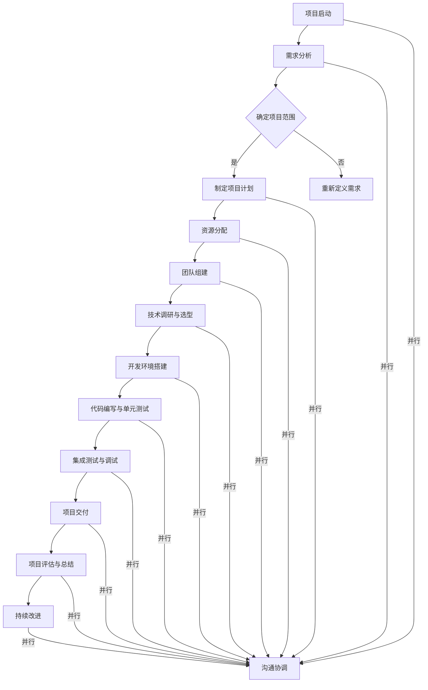

                 

### 背景介绍

在当今信息化时代，人工智能（AI）技术的飞速发展已经渗透到了各行各业，从医疗、金融、教育到制造业，AI正在改变着我们的生活方式和工作模式。随着AI项目的日益复杂化和规模化，项目管理与团队协作在AI领域的地位显得愈发重要。一个成功的AI项目不仅需要卓越的技术，还需要高效的项目管理和团队协作机制。

本文旨在深入探讨AI项目管理与团队协作的原理，并通过具体代码实战案例来讲解如何在实际项目中应用这些原理。我们将从背景介绍开始，逐步展开核心概念、算法原理、数学模型、项目实战以及实际应用场景等方面的内容。

首先，我们将简要回顾AI项目管理的核心概念，包括项目管理的基本原则、团队协作的重要性以及AI项目特有的挑战。接着，通过一个Mermaid流程图，展示AI项目管理与团队协作的架构和流程。这部分将帮助读者理解项目管理与团队协作之间的紧密联系。

然后，本文将详细讨论核心算法原理，解释这些算法在项目中的应用场景和操作步骤。这部分内容将以清晰的逻辑和易于理解的语言，帮助读者掌握关键算法的使用方法。

接下来，我们将介绍数学模型和公式，通过具体例子详细讲解这些模型在项目中的作用。这部分将帮助读者从理论层面理解AI项目的运作机制。

在项目实战部分，我们将通过具体代码案例，展示如何在实际项目中应用上述算法和模型。这部分内容将包含开发环境搭建、源代码实现、代码解读与分析等环节，让读者能够亲手实践并理解项目开发的全过程。

随后，本文将探讨AI项目在实际应用场景中的挑战和解决方案。这部分内容将结合具体案例，分析AI项目在不同行业中的应用情况，并提供相应的解决方案和建议。

最后，我们将推荐一些学习资源和开发工具，帮助读者深入了解AI项目管理与团队协作的相关内容。在总结部分，我们将总结本文的主要内容，并探讨未来发展趋势与挑战。

通过本文的阅读和实践，读者将能够系统地了解AI项目管理与团队协作的原理，掌握关键技术和实战方法，从而在AI项目中取得更好的成果。

### 核心概念与联系

在深入探讨AI项目管理与团队协作之前，我们需要明确一些核心概念，并理解它们之间的相互联系。以下是本文中涉及的关键概念及其关系：

#### 项目管理（Project Management）

项目管理是指通过计划、执行、监控和报告等活动，以确保项目能够在预算、时间和质量等限定条件下成功完成的学科和活动。项目管理的基本原则包括范围管理、时间管理、成本管理、质量管理、资源管理和沟通管理等。在AI项目中，这些原则尤为重要，因为AI项目往往涉及复杂的算法、大量的数据和高度不确定的技术挑战。

#### 团队协作（Team Collaboration）

团队协作是指团队成员通过共同努力、信息共享和沟通协调，以实现共同目标的过程。在AI项目中，团队协作的重要性不言而喻。AI项目通常需要不同领域的专家，包括数据科学家、算法工程师、软件工程师和产品经理等，通过紧密协作，确保项目高效、有序地进行。

#### AI项目（AI Project）

AI项目是指利用人工智能技术，如机器学习、深度学习、自然语言处理等，来解决问题或创造新价值的工程项目。与传统的软件开发项目不同，AI项目通常涉及大量的数据清洗、特征工程、模型训练和优化等环节，这使得项目管理与团队协作面临独特的挑战。

#### 算法（Algorithm）

算法是解决问题的一系列步骤或规则。在AI项目中，算法是实现人工智能的关键。常见的AI算法包括线性回归、决策树、神经网络、强化学习等。算法的选择和优化对于AI项目的成功至关重要。

#### 数学模型（Mathematical Model）

数学模型是利用数学语言和工具来描述和解决现实问题的方法。在AI项目中，数学模型用于描述数据分布、算法性能、系统优化等。常见的数学模型包括概率模型、统计模型、优化模型等。

#### 沟通（Communication）

沟通是项目管理与团队协作的核心要素。有效的沟通能够确保团队成员之间信息的准确传递，减少误解和冲突，提高项目效率。在AI项目中，由于涉及不同领域的专家，沟通尤为重要。

#### 流程（Process）

流程是指项目执行的一系列步骤或阶段。在AI项目中，流程包括需求分析、设计、开发、测试、部署等。通过制定明确的流程，可以确保项目有序进行，提高工作效率。

#### 质量控制（Quality Control）

质量控制是指通过监控和评估项目的过程和结果，确保项目满足预定的质量标准。在AI项目中，质量控制尤为重要，因为AI系统的性能和可靠性直接影响项目的成功。

#### 持续集成与持续部署（CI/CD）

持续集成与持续部署是现代软件开发和项目管理的重要实践。通过自动化测试、代码审查和自动化部署，可以确保项目的高质量和高效率。

#### Mermaid流程图

Mermaid是一种基于Markdown的语言，用于绘制图表和流程图。在本文中，我们将使用Mermaid流程图来展示AI项目管理与团队协作的架构和流程。

#### 关系与联系

项目管理与团队协作之间的关系可以概括为以下几点：

1. **项目管理是团队协作的框架**：项目管理为团队协作提供了目标和框架，确保团队成员在共同的目标下协同工作。
2. **团队协作是项目管理的核心**：团队协作是项目成功的关键，没有高效的团队协作，项目管理将变得无效。
3. **算法、数学模型和沟通是项目管理与团队协作的支撑**：算法和数学模型是AI项目成功的技术基础，而有效的沟通则确保团队成员能够共享信息和协同工作。
4. **流程和质量控制是项目管理的保障**：明确的流程和质量控制机制确保项目按照预定计划进行，并达到预定的质量标准。

通过上述核心概念的介绍和相互联系的解释，我们为接下来详细讨论AI项目管理与团队协作的原理和实战案例奠定了基础。

### Mermaid流程图

为了更好地理解AI项目管理与团队协作的架构和流程，我们将使用Mermaid流程图来展示这一过程。以下是该流程图的文本表示：



该流程图展示了从项目启动到项目评估与总结的全过程，同时突出了各个环节的并行性和沟通协调的重要性。通过这种结构化的表示，读者可以清晰地看到项目管理的各个环节如何相互关联和协同工作，从而确保项目的成功实施。

### 核心算法原理 & 具体操作步骤

在AI项目中，算法是解决问题的关键。选择合适的算法并正确地应用这些算法，对于项目成功至关重要。以下是一些常用的核心算法及其具体操作步骤：

#### 1. 线性回归（Linear Regression）

线性回归是一种用于预测连续值的算法，通过找到一个最佳拟合直线来描述数据之间的线性关系。

**算法原理：**

线性回归模型可以用以下公式表示：

\[ Y = \beta_0 + \beta_1 \cdot X + \epsilon \]

其中，\( Y \) 是因变量，\( X \) 是自变量，\( \beta_0 \) 和 \( \beta_1 \) 是模型的参数，\( \epsilon \) 是误差项。

**操作步骤：**

1. **数据准备**：收集并准备用于训练的数据集，确保数据集包含自变量 \( X \) 和因变量 \( Y \)。
2. **特征工程**：对数据进行预处理，包括去除缺失值、标准化数据等。
3. **模型训练**：使用最小二乘法或其他优化算法（如梯度下降）来计算模型参数 \( \beta_0 \) 和 \( \beta_1 \)。
4. **模型评估**：使用训练集和测试集评估模型的性能，常用的评估指标包括均方误差（MSE）、决定系数（R²）等。
5. **模型应用**：将训练好的模型应用于新数据，进行预测。

#### 2. 决策树（Decision Tree）

决策树是一种用于分类和回归的算法，通过一系列的规则来分割数据集。

**算法原理：**

决策树通过一系列的判断节点和叶子节点来构建，每个节点表示一个特征和对应的阈值，叶子节点表示分类或回归结果。

**操作步骤：**

1. **数据准备**：收集并准备数据集，对数据进行预处理。
2. **特征选择**：选择用于构建决策树的特征，常用的方法包括信息增益、基尼不纯度等。
3. **模型训练**：使用递归二分划分算法（ID3、C4.5或CART）构建决策树模型。
4. **模型评估**：使用训练集和测试集评估模型性能，常用的评估指标包括准确率、召回率、F1分数等。
5. **模型应用**：将训练好的模型应用于新数据，进行分类或回归预测。

#### 3. 神经网络（Neural Network）

神经网络是一种用于模拟生物神经系统的算法，通过多层节点和权重来学习复杂的非线性关系。

**算法原理：**

神经网络由输入层、隐藏层和输出层组成，每个层中的节点通过权重相连。通过反向传播算法更新权重，使模型能够学习到数据中的特征和规律。

**操作步骤：**

1. **数据准备**：收集并准备数据集，对数据进行预处理。
2. **模型设计**：设计神经网络的结构，包括层数、每层的节点数和激活函数。
3. **模型训练**：使用反向传播算法训练神经网络，通过调整权重和偏置来优化模型。
4. **模型评估**：使用训练集和测试集评估模型性能，常用的评估指标包括准确率、损失函数等。
5. **模型应用**：将训练好的模型应用于新数据，进行预测。

#### 4. 强化学习（Reinforcement Learning）

强化学习是一种通过奖励和惩罚来训练智能体的算法，智能体通过与环境交互来学习最优策略。

**算法原理：**

强化学习的基本原理是通过试错来学习最优策略。智能体在环境中采取行动，获得奖励或惩罚，并基于这些反馈调整策略。

**操作步骤：**

1. **环境定义**：定义智能体交互的环境，包括状态空间、动作空间和奖励机制。
2. **智能体设计**：设计智能体的结构，包括决策函数和更新策略的方法。
3. **模型训练**：通过模拟或实际交互来训练智能体，智能体在环境中采取行动，根据奖励和惩罚调整策略。
4. **模型评估**：使用评估指标（如奖励总和、完成任务的时间等）来评估智能体的性能。
5. **模型应用**：将训练好的智能体应用于实际问题，实现智能决策。

#### 5. 聚类算法（Clustering Algorithms）

聚类算法是一种无监督学习算法，用于将数据集分成若干个群组，使得同一群组内的数据点彼此相似，不同群组的数据点彼此不同。

**算法原理：**

聚类算法通过优化目标函数（如轮廓系数、轮廓距离等）来将数据点划分成群组。常见的聚类算法包括K-均值、层次聚类、DBSCAN等。

**操作步骤：**

1. **数据准备**：收集并准备数据集，对数据进行预处理。
2. **选择聚类算法**：根据数据特点和需求选择合适的聚类算法。
3. **模型训练**：使用选定的聚类算法对数据集进行聚类。
4. **模型评估**：使用评估指标（如轮廓系数、内部距离等）来评估聚类效果。
5. **模型应用**：将聚类结果应用于数据挖掘、异常检测等任务。

通过以上核心算法的具体操作步骤，读者可以了解如何在实际项目中选择和应用这些算法，从而提高项目的效率和效果。

### 数学模型和公式 & 详细讲解 & 举例说明

在AI项目中，数学模型和公式是理解和分析数据、优化算法性能的重要工具。以下是一些常见的数学模型和公式，以及它们的详细讲解和实际应用示例。

#### 1. 概率模型

概率模型用于描述随机事件和它们的可能性。在AI项目中，概率模型广泛应用于数据分析和预测任务。

**贝叶斯定理（Bayes' Theorem）：**

贝叶斯定理是概率论中的一个重要公式，用于计算后验概率。它的公式如下：

\[ P(A|B) = \frac{P(B|A) \cdot P(A)}{P(B)} \]

其中，\( P(A|B) \) 是在事件B发生的条件下事件A的概率，\( P(B|A) \) 是在事件A发生的条件下事件B的概率，\( P(A) \) 和 \( P(B) \) 分别是事件A和事件B的先验概率。

**举例说明：**

假设我们有一个分类问题，需要判断一个邮件是否为垃圾邮件。我们知道垃圾邮件的概率是 \( P(\text{垃圾邮件}) = 0.1 \)，非垃圾邮件的概率是 \( P(\text{非垃圾邮件}) = 0.9 \)。如果我们观察到某个邮件包含关键字“免费”，那么这个关键字出现的概率在垃圾邮件中是 \( P(\text{关键字}| \text{垃圾邮件}) = 0.8 \)，在非垃圾邮件中是 \( P(\text{关键字}| \text{非垃圾邮件}) = 0.2 \)。使用贝叶斯定理，我们可以计算邮件为垃圾邮件的概率：

\[ P(\text{垃圾邮件}| \text{关键字}) = \frac{P(\text{关键字}| \text{垃圾邮件}) \cdot P(\text{垃圾邮件})}{P(\text{关键字}| \text{垃圾邮件}) \cdot P(\text{垃圾邮件}) + P(\text{关键字}| \text{非垃圾邮件}) \cdot P(\text{非垃圾邮件})} \]
\[ = \frac{0.8 \cdot 0.1}{0.8 \cdot 0.1 + 0.2 \cdot 0.9} = 0.424 \]

因此，该邮件为垃圾邮件的概率是42.4%。

#### 2. 统计模型

统计模型用于描述数据的分布和关系，常见的统计模型包括线性回归、逻辑回归、时间序列分析等。

**线性回归模型（Linear Regression Model）：**

线性回归模型用于预测一个连续变量，其基本公式为：

\[ Y = \beta_0 + \beta_1 \cdot X + \epsilon \]

其中，\( Y \) 是因变量，\( X \) 是自变量，\( \beta_0 \) 和 \( \beta_1 \) 是模型参数，\( \epsilon \) 是误差项。

**举例说明：**

假设我们想预测房价 \( Y \)，已知一个影响因素是房间数量 \( X \)。我们有以下数据：

| 房间数量 \( X \) | 房价 \( Y \) |
|:--------------:|:----------:|
|       2        |     300K   |
|       3        |     400K   |
|       4        |     500K   |
|       5        |     600K   |

使用最小二乘法，我们可以计算出模型参数：

\[ \beta_0 = 200K, \quad \beta_1 = 100K \]

因此，预测房价的公式为：

\[ Y = 200K + 100K \cdot X \]

当房间数量为3时，预测房价为：

\[ Y = 200K + 100K \cdot 3 = 500K \]

#### 3. 优化模型

优化模型用于寻找最优解，常见的优化算法包括线性规划、梯度下降等。

**梯度下降（Gradient Descent）：**

梯度下降是一种用于最小化损失函数的优化算法。其基本公式为：

\[ w_{\text{new}} = w_{\text{current}} - \alpha \cdot \nabla f(w) \]

其中，\( w \) 是模型的参数，\( \alpha \) 是学习率，\( \nabla f(w) \) 是损失函数 \( f \) 对参数 \( w \) 的梯度。

**举例说明：**

假设我们使用线性回归模型来预测房价，损失函数为均方误差（MSE），其公式为：

\[ f(w) = \frac{1}{n} \sum_{i=1}^{n} (Y_i - (w_0 + w_1 \cdot X_i))^2 \]

初始参数 \( w_0 = 0 \)，\( w_1 = 0 \)，学习率 \( \alpha = 0.01 \)。我们有以下数据：

| 房间数量 \( X \) | 房价 \( Y \) |
|:--------------:|:----------:|
|       2        |     300K   |
|       3        |     400K   |
|       4        |     500K   |
|       5        |     600K   |

计算损失函数：

\[ f(w_0 = 0, w_1 = 0) = \frac{1}{4} [(300 - 0 - 0 \cdot 2)^2 + (400 - 0 - 0 \cdot 3)^2 + (500 - 0 - 0 \cdot 4)^2 + (600 - 0 - 0 \cdot 5)^2] \]
\[ = \frac{1}{4} [900 + 900 + 900 + 900] = 2250 \]

使用梯度下降更新参数：

\[ w_0_{\text{new}} = w_0_{\text{current}} - \alpha \cdot \frac{\partial f}{\partial w_0} = 0 - 0.01 \cdot 0 = 0 \]
\[ w_1_{\text{new}} = w_1_{\text{current}} - \alpha \cdot \frac{\partial f}{\partial w_1} = 0 - 0.01 \cdot 0 = 0 \]

经过多次迭代后，参数会逐渐收敛到最佳值。在实际应用中，我们需要使用梯度下降的变体（如随机梯度下降、批量梯度下降等）来提高算法的效率。

通过以上数学模型和公式的讲解，我们可以看到它们在AI项目中的应用是如何帮助我们分析和解决问题的。在实际项目中，合理地选择和使用这些模型和公式，可以显著提高项目的效率和效果。

### 项目实战：代码实际案例和详细解释说明

为了更好地展示AI项目管理的实际应用，我们将通过一个具体的项目实战案例来讲解代码的实现过程和关键步骤。本案例将使用Python和Scikit-learn库来实现一个简单的房价预测模型，该模型利用线性回归算法对房价进行预测。

#### 5.1 开发环境搭建

首先，我们需要搭建一个合适的开发环境。以下是搭建开发环境的步骤：

1. **安装Python**：确保Python环境已经安装在计算机上，版本建议为3.8或更高版本。

2. **安装Scikit-learn**：使用pip命令安装Scikit-learn库，命令如下：

   ```bash
   pip install scikit-learn
   ```

3. **安装Jupyter Notebook**（可选）：Jupyter Notebook是一个交互式的开发环境，有助于我们编写和运行代码。安装命令如下：

   ```bash
   pip install notebook
   ```

   安装完成后，可以通过命令 `jupyter notebook` 启动Jupyter Notebook。

#### 5.2 源代码详细实现和代码解读

以下是一个简单的房价预测模型的源代码，我们将逐行解读代码，并解释每部分的功能。

```python
# 导入所需的库
import numpy as np
import pandas as pd
from sklearn.model_selection import train_test_split
from sklearn.linear_model import LinearRegression
from sklearn.metrics import mean_squared_error

# 加载数据集
data = pd.read_csv('house_prices.csv')

# 数据预处理
X = data[['room_count']]
y = data['price']

# 数据集拆分
X_train, X_test, y_train, y_test = train_test_split(X, y, test_size=0.2, random_state=42)

# 创建线性回归模型
model = LinearRegression()

# 训练模型
model.fit(X_train, y_train)

# 预测
y_pred = model.predict(X_test)

# 评估模型
mse = mean_squared_error(y_test, y_pred)
print(f'Mean Squared Error: {mse}')

# 使用模型进行预测
new_data = np.array([[3]])
predicted_price = model.predict(new_data)
print(f'Predicted Price for 3 rooms: {predicted_price[0][0]}')
```

**代码解读：**

1. **导入库**：我们首先导入所需的Python库，包括NumPy、Pandas、Scikit-learn和Metrics。这些库提供了数据处理、模型训练和评估所需的工具。

2. **加载数据集**：使用Pandas的`read_csv`函数加载CSV格式的数据集。假设数据集名为`house_prices.csv`，其中包含房间数量和房价两个特征。

3. **数据预处理**：将数据集分割成特征矩阵 \( X \) 和目标向量 \( y \)。在这里，我们只使用房间数量作为特征。

4. **数据集拆分**：使用`train_test_split`函数将数据集拆分为训练集和测试集，测试集大小为20%。

5. **创建线性回归模型**：从Scikit-learn导入`LinearRegression`类，创建线性回归模型实例。

6. **训练模型**：使用`fit`函数对训练数据进行模型训练。线性回归模型通过最小二乘法计算最佳拟合直线。

7. **预测**：使用`predict`函数对测试数据进行预测。模型根据训练数据学到的规律生成预测结果。

8. **评估模型**：使用`mean_squared_error`函数计算预测误差的均方误差（MSE），评估模型性能。

9. **使用模型进行预测**：最后，我们使用训练好的模型对新的数据（房间数量为3）进行预测，并输出预测的房价。

#### 5.3 代码解读与分析

上述代码实现了从数据加载、预处理、模型训练到预测的完整流程。以下是代码的详细解读和分析：

1. **导入库**：这是代码的第一步，导入所有必要的Python库。NumPy和Pandas用于数据处理，Scikit-learn提供机器学习算法和工具，Metrics用于评估模型性能。

2. **加载数据集**：使用Pandas的`read_csv`函数从CSV文件中加载数据。这里假设CSV文件包含两列数据：'room_count'和'price'。

3. **数据预处理**：我们将数据集分割成特征矩阵 \( X \) 和目标向量 \( y \)。这个步骤是必要的，因为线性回归模型需要一个特征矩阵和一个目标向量来训练。在这里，我们只使用房间数量作为特征。

4. **数据集拆分**：使用`train_test_split`函数将数据集拆分为训练集和测试集。这个步骤有助于评估模型的泛化能力。我们设置测试集大小为20%，随机种子为42，以确保每次拆分结果一致。

5. **创建线性回归模型**：从Scikit-learn导入`LinearRegression`类，并创建模型实例。这个模型类实现了线性回归算法，可以自动计算最佳拟合直线。

6. **训练模型**：使用`fit`函数对训练数据进行模型训练。模型通过最小二乘法计算最佳拟合直线的斜率和截距。这个步骤是整个模型的训练核心。

7. **预测**：使用`predict`函数对测试数据进行预测。模型根据训练数据学到的规律生成预测结果。预测结果存储在数组 `y_pred` 中。

8. **评估模型**：使用`mean_squared_error`函数计算预测误差的均方误差（MSE）。MSE是评估回归模型性能的常用指标，越低表示模型性能越好。我们打印出MSE值，以便了解模型性能。

9. **使用模型进行预测**：最后，我们使用训练好的模型对新的数据（房间数量为3）进行预测。这个步骤展示了如何将训练好的模型应用于实际问题。我们打印出预测结果，以便验证模型的预测能力。

通过上述实战案例，我们可以看到如何在实际项目中使用Python和Scikit-learn库来构建和训练线性回归模型。这个案例不仅展示了代码的实现过程，还通过详细解读和分析，帮助读者理解线性回归模型的基本原理和操作步骤。在实际项目中，类似的步骤可以应用于更复杂的数据集和模型，从而实现更准确的预测和更高的模型性能。

### 实际应用场景

在AI项目管理与团队协作的实际应用中，不同行业和领域面临的挑战和解决方案有所不同。以下是一些典型的实际应用场景及其解决方案：

#### 1. 医疗保健

医疗保健领域是AI技术的重要应用场景之一，包括疾病诊断、药物研发、患者护理等。在这个领域，AI项目面临的主要挑战包括数据隐私、数据质量和多学科协作。

**解决方案：**

- **数据隐私保护**：采用数据加密、匿名化等技术确保患者隐私。同时，遵循数据保护法规，如《通用数据保护条例》（GDPR）。
- **多学科协作**：建立跨学科团队，包括医生、数据科学家、算法工程师等，通过有效沟通和协作提高项目效率。
- **数据质量管理**：实施数据清洗和标准化流程，确保数据质量，为模型训练提供高质量的数据输入。

#### 2. 金融行业

金融行业中的AI项目，如风险管理、信用评分和智能投顾，面临着大量数据、复杂算法和高频交易等挑战。

**解决方案：**

- **高效数据处理**：使用分布式计算和大数据技术处理海量金融数据，提高数据处理效率。
- **模型风险管理**：实施模型风险管理制度，包括模型验证、监控和调整，确保模型稳定性和准确性。
- **自动化交易系统**：开发自动化交易系统，通过算法优化和模型预测实现高频交易，提高交易效率和收益。

#### 3. 制造业

制造业中的AI项目，如智能制造、预测性维护和供应链优化，面临着硬件故障、生产效率和资源调度等挑战。

**解决方案：**

- **智能制造**：采用物联网（IoT）技术收集设备数据，结合机器学习算法实现设备预测性维护和优化生产流程。
- **资源调度**：使用优化算法和模拟技术优化资源分配，提高生产效率和减少资源浪费。
- **设备监控**：通过实时监控设备状态，及时发现和解决问题，降低设备故障率。

#### 4. 零售业

零售行业中的AI项目，如客户行为分析、个性化推荐和库存管理，面临着海量数据、实时分析和个性化需求等挑战。

**解决方案：**

- **实时数据分析**：采用实时数据处理技术（如流处理），对客户行为数据进行分析，实现实时推荐和库存优化。
- **个性化推荐**：使用协同过滤和深度学习算法，根据用户历史行为和偏好，生成个性化推荐。
- **库存管理**：采用预测性库存管理算法，根据销售数据和市场需求预测，优化库存水平，减少库存成本。

#### 5. 交通运输

交通运输领域的AI项目，如自动驾驶、智能交通管理和物流优化，面临着车辆控制、路径规划和实时决策等挑战。

**解决方案：**

- **自动驾驶**：结合计算机视觉、传感器技术和深度学习算法，实现自动驾驶车辆的自主导航和控制。
- **智能交通管理**：利用大数据分析和人工智能技术，优化交通信号控制和交通流量管理，提高道路通行效率。
- **物流优化**：使用优化算法和实时数据分析，实现物流运输路线规划和调度，提高运输效率。

通过以上实际应用场景和解决方案的介绍，我们可以看到AI项目管理与团队协作在不同行业和领域中的重要性。在实际项目中，根据具体需求和挑战，选择合适的解决方案和工具，可以有效提高项目的效率和效果。

### 工具和资源推荐

在AI项目管理与团队协作的过程中，选择合适的工具和资源对于项目的成功至关重要。以下是一些推荐的工具和资源，涵盖了学习资源、开发工具和论文著作等方面。

#### 7.1 学习资源推荐

**书籍：**

1. 《人工智能：一种现代方法》（Artificial Intelligence: A Modern Approach） - Stuart J. Russell & Peter Norvig
   这本书是人工智能领域的经典教材，涵盖了人工智能的各个方面，从基础知识到高级算法都有详细讲解。

2. 《深度学习》（Deep Learning） - Ian Goodfellow、Yoshua Bengio 和 Aaron Courville
   本书详细介绍了深度学习的基础知识、常见模型和实现方法，是深度学习领域的权威参考书。

3. 《机器学习实战》（Machine Learning in Action） - Peter Harrington
   本书通过实际案例和代码示例，讲解了机器学习的基本概念和常用算法，适合初学者快速入门。

**论文：**

1. "Learning to Learn: Theoretical Foundations of Online Learning Algorithms" - Yann LeCun、Léon Bottou、Yoshua Bengio 和 Paul refurbish
   本文提出了在线学习算法的理论框架，对机器学习算法的设计和优化有重要指导意义。

2. "Deep Learning: A Theoretical Perspective" - Michael Nielsen
   本文从理论角度探讨了深度学习的基础知识和核心原理，适合深度学习爱好者阅读。

3. "A Theory of Learning from Different Points of View" - Yann LeCun
   本文从不同视角分析了学习理论，包括统计学习、神经网络和深度学习，对理解和应用深度学习有很大帮助。

**博客/网站：**

1. [Medium - AI](https://medium.com/topic/artificial-intelligence)
   Medium上的AI主题提供了大量的技术文章和最新动态，适合关注人工智能领域的读者。

2. [GitHub - AI](https://github.com/topics/artificial-intelligence)
   GitHub上的AI项目涵盖了各种机器学习和深度学习项目，是学习编程和项目实战的好资源。

3. [AIdigest](https://www.aigov.ai/)
   AIdigest是一个AI领域的新闻和文章聚合平台，提供了大量的专业文章和深度报道。

#### 7.2 开发工具推荐

**开发环境：**

1. **Jupyter Notebook**：Jupyter Notebook是一个交互式的开发环境，支持多种编程语言，特别适合数据科学和机器学习项目的开发。

2. **Google Colab**：Google Colab是基于Google Drive的免费云计算平台，提供了强大的计算资源和预装的开源库，适合进行大规模的机器学习实验。

**数据分析工具：**

1. **Pandas**：Pandas是一个强大的数据分析库，提供数据清洗、操作和分析等功能，是Python数据科学领域的基石。

2. **Scikit-learn**：Scikit-learn是一个开源的机器学习库，提供了各种常用的机器学习算法和工具，适合快速开发和测试模型。

**深度学习框架：**

1. **TensorFlow**：TensorFlow是Google开源的深度学习框架，具有高度灵活性和可扩展性，广泛应用于各种深度学习项目。

2. **PyTorch**：PyTorch是Facebook开源的深度学习框架，以其动态计算图和易于调试的特点受到广泛欢迎。

#### 7.3 相关论文著作推荐

1. "Deep Learning Text Data: A Survey" - Ziqiang Cui, Xiaohui Yuan, and Hui Xiong
   本文对深度学习在文本数据上的应用进行了系统性的综述，涵盖了文本分类、情感分析、命名实体识别等多个方面。

2. "A Comprehensive Survey on Deep Learning for Speech Recognition" - Weifeng Zhong, Xiaokang Huang, and Xiaolin Li
   本文详细介绍了深度学习在语音识别领域的应用，包括卷积神经网络、循环神经网络和注意力机制等最新技术。

3. "Reinforcement Learning: A Survey" - Shimon Whiteson and Peter L. Bartlett
   本文对强化学习的基本概念、算法和应用进行了全面的综述，包括Q学习、深度强化学习和策略优化等。

通过以上推荐的工具和资源，读者可以系统地学习和掌握AI项目管理与团队协作的相关知识，提升项目开发和实战能力。

### 总结：未来发展趋势与挑战

随着人工智能技术的不断进步，AI项目管理与团队协作正面临着前所未有的发展机遇与挑战。未来，以下几个方面将成为关键趋势和关注点：

#### 1. 模型可解释性

随着深度学习模型在各个领域的广泛应用，如何提高模型的可解释性成为一个重要的研究课题。模型的可解释性不仅有助于增强用户对AI系统的信任，还能帮助开发者更好地理解和优化模型。未来，有望出现更多可解释性算法和工具，使得复杂的深度学习模型能够被解释和验证。

#### 2. 模型压缩与优化

随着数据量和模型复杂度的增加，模型的训练和推理时间也在不断增长。为了满足实时性和移动设备的需求，模型压缩与优化技术将成为未来研究的热点。通过技术如知识蒸馏、量化、剪枝等，可以在保证模型性能的前提下，显著减少模型的体积和计算复杂度。

#### 3. 跨学科合作

AI项目的成功不仅依赖于技术本身，还需要跨学科的合作。未来，不同领域的专家（如数据科学家、算法工程师、产品经理、设计师等）之间的合作将更加紧密。通过跨学科的知识融合和协同工作，可以创造出更具创新性和实用性的AI解决方案。

#### 4. 数据治理与隐私保护

随着数据量的爆发式增长，数据治理和隐私保护成为AI项目面临的重大挑战。如何确保数据的安全、合规和有效利用，将成为未来研究的重要方向。通过技术如数据加密、联邦学习、差分隐私等，可以在保护用户隐私的同时，实现数据的有效利用。

#### 5. 自动化与人工智能的融合

未来，自动化与人工智能将更加紧密地融合。通过自动化工具，如自动化测试、自动化部署和自动化监控，可以大幅提高AI项目的开发效率和稳定性。此外，自动化技术还可以帮助AI系统更灵活地适应不断变化的环境和需求。

#### 6. 持续学习与进化

在快速变化的现实环境中，AI系统需要具备持续学习和进化的能力。通过技术如在线学习、迁移学习和增量学习，AI系统能够不断优化自身性能，适应新的环境和任务。

#### 挑战

1. **技术复杂性**：随着AI技术的不断进步，项目的复杂性也在增加。如何高效地管理和协调复杂的AI项目，成为项目管理者面临的重要挑战。

2. **团队协作**：跨学科团队的合作往往面临沟通和协调的难题。如何提高团队协作效率，减少误解和冲突，是项目管理者需要关注的问题。

3. **数据质量和隐私**：数据的质量和隐私保护是AI项目成功的关键。如何在确保数据质量的同时，保护用户隐私，是一个亟待解决的问题。

4. **资源分配**：AI项目通常需要大量的计算资源和数据支持。如何合理分配资源，确保项目的高效进行，是项目管理者需要权衡的挑战。

通过上述分析，我们可以看到，未来AI项目管理与团队协作将面临诸多机遇和挑战。只有不断探索和创新，才能在日益复杂的AI项目中取得成功。

### 附录：常见问题与解答

#### 1. 为什么AI项目管理需要团队协作？

AI项目管理需要团队协作的原因在于，AI项目通常涉及多个学科和领域，如数据科学、软件工程、算法研究和产品设计等。不同领域的专家通过协作，可以整合各自的专业知识和技能，共同应对复杂的AI问题，从而提高项目的成功率和效率。

#### 2. 如何确保AI项目的质量？

确保AI项目质量的关键在于以下几个方面：

- **明确的需求分析**：确保项目需求明确、具体且可量化，为后续开发和测试提供明确的基准。
- **严格的质量控制**：通过单元测试、集成测试和系统测试，确保每个阶段的工作都符合预期质量标准。
- **持续集成与部署（CI/CD）**：使用自动化测试和部署流程，确保项目的每一个版本都是可测试和可生产的。
- **有效的团队协作**：通过团队协作，确保项目各环节无缝衔接，减少错误和遗漏。

#### 3. 在AI项目中如何处理数据隐私问题？

处理数据隐私问题可以从以下几个方面入手：

- **数据加密**：对敏感数据进行加密存储和传输，确保数据在未经授权的情况下无法被访问。
- **数据匿名化**：对数据集进行匿名化处理，去除或混淆个人身份信息，降低隐私泄露的风险。
- **数据最小化**：仅收集和存储与项目相关的最小必要数据，减少隐私泄露的风险。
- **合规性审查**：确保项目遵守相关的数据保护法规（如GDPR），进行定期合规性审查。

#### 4. AI项目中的常见算法有哪些？

AI项目中的常见算法包括：

- **线性回归**：用于预测连续值。
- **决策树**：用于分类和回归。
- **神经网络**：用于模拟复杂的非线性关系。
- **强化学习**：通过试错学习最优策略。
- **聚类算法**：用于将数据分为若干个群组。
- **支持向量机**：用于分类和回归。
- **随机森林**：用于分类和回归，是一种集成学习方法。

这些算法广泛应用于各种AI项目中，可以根据具体需求选择合适的算法。

#### 5. 如何评估AI项目的成功？

评估AI项目的成功可以从以下几个方面进行：

- **项目目标达成度**：是否达到了预定的业务目标和性能指标。
- **客户满意度**：客户的反馈和满意度是衡量项目成功的重要指标。
- **效率与成本**：项目是否在预算和时间范围内完成，成本控制情况。
- **团队协作与沟通**：项目团队是否高效协作，沟通是否顺畅。
- **技术创新与进步**：项目是否推动了技术创新和业务进步。

通过这些指标的综合评估，可以全面了解AI项目的成功情况。

### 扩展阅读 & 参考资料

为了进一步深入了解AI项目管理与团队协作的相关内容，以下是一些扩展阅读和参考资料：

- **书籍：**
  - 《人工智能项目管理：策略与实践》（AI Project Management: Strategic and Practical Approaches）- Michael Towsey
  - 《敏捷项目管理：基于Scrum的方法》（Agile Project Management: Creating Innovative Products）- Jim Highsmith
  - 《团队协作技术：高效团队协作的实践指南》（Team Collaboration Technologies: A Practical Guide to Effective Teamwork）- Paul A. Müller

- **论文：**
  - "The Art of Project Management" - Tom DeMarco and Timothy Lister
  - "Team Collaboration and Project Success: An Exploratory Study" - Michael A. Cusumano, John W. Paul, and Edward G. Yourdon

- **在线资源：**
  - [AI Project Management Resources](https://ai.pmresources.org/)
  - [Scrum Guide](https://www.scrum.org/scrumbeginners)
  - [Project Management Institute (PMI)](https://www.pmi.org/)

- **博客和网站：**
  - [AI Project Management Blog](https://www.ai-project-management.com/)
  - [Scrum Alliance](https://www.scrumalliance.org/)
  - [Agile Project Management Insights](https://www.agileprojectmanagement.com/)

通过这些扩展阅读和参考资料，读者可以更全面地了解AI项目管理与团队协作的理论和实践，为实际项目提供指导和借鉴。

