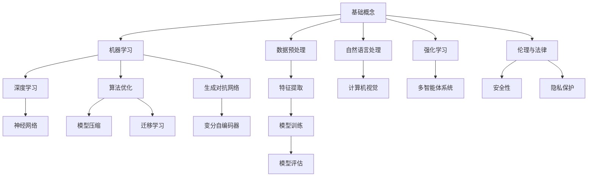

                 

### 背景介绍

人工智能（AI）领域正处于一个前所未有的独特时刻，这不仅体现在技术的飞速发展，还体现在其对社会、经济和人类生活各个层面的深刻影响。在这个快速变革的时代，AI不仅改变了传统行业的工作模式，还催生了诸多新兴产业，成为推动社会进步的重要力量。

首先，我们来看看AI技术的快速进步。自20世纪50年代人工智能概念提出以来，经历了数次技术浪潮，从早期的符号推理、知识表示到现代的深度学习和神经网络，AI技术的进步可以说是突飞猛进。特别是近年来，随着大数据、云计算和量子计算等技术的不断发展，AI的算法和模型越来越强大，其应用范围也越来越广泛。

其次，AI对社会和经济的影响也是不可忽视的。在医疗领域，AI技术可以辅助医生进行诊断和治疗，提高医疗服务的效率和质量；在教育领域，AI可以帮助学生个性化学习，提高学习效果；在金融领域，AI可以用于风险评估、欺诈检测和智能投资，提高金融服务的智能化水平。此外，AI还广泛应用于智能制造、物流运输、智能城市等领域，极大地提升了各行各业的运营效率和生产能力。

然而，AI的发展也带来了诸多挑战和问题。首先是如何确保AI系统的安全性和可靠性，如何防止AI被滥用。其次，AI技术的发展可能导致某些工作岗位的失业，加剧社会的不平等问题。此外，AI算法的黑箱性也引发了关于隐私保护和算法透明度的担忧。

总之，AI领域正处在一个充满机遇和挑战的独特时刻。在这个时代，我们需要理性地看待AI的发展，既要充分发挥其优势，也要积极应对其带来的挑战。接下来，本文将深入探讨AI的核心概念、算法原理、数学模型，并通过实际应用案例，全面分析AI领域的发展现状和未来趋势。

### 核心概念与联系

为了深入理解人工智能（AI）的核心概念与联系，我们需要从基础概念出发，逐步探讨其核心原理与架构。以下是一个详细的Mermaid流程图，用于展示AI领域中几个关键概念及其相互关系：



#### 基础概念

基础概念是AI领域的基石。它包括对数据的处理、算法的基本原理以及模型的构建。数据是AI的燃料，而算法则是实现AI功能的核心工具。数据预处理是AI流程中的第一步，它包括数据清洗、归一化、去噪等步骤，目的是确保数据的质量，以便更好地进行后续的分析。

#### 机器学习

机器学习是AI的核心技术之一，它使计算机能够从数据中自动学习和改进。机器学习可以分为监督学习、无监督学习和强化学习等类型。监督学习通过标记数据进行训练，而无监督学习则是在没有标记数据的情况下进行。强化学习则是通过奖励机制来训练模型，使其在复杂环境中做出最优决策。

#### 深度学习

深度学习是机器学习的一个重要分支，它通过多层神经网络来模拟人类大脑的学习过程。深度学习在图像识别、语音识别和自然语言处理等领域取得了显著的成功。深度学习的关键在于神经网络的层次结构，它通过逐层提取特征，使得模型能够从原始数据中提取更高级别的信息。

#### 神经网络

神经网络是深度学习的基础，它由大量的神经元和连接组成。每个神经元都通过加权连接与其它神经元相连，并通过激活函数来传递信息。神经网络通过不断调整权重，使得模型能够学习到数据中的规律和模式。

#### 数据预处理

数据预处理是AI流程中的第一步，它包括数据清洗、归一化、去噪等步骤，目的是确保数据的质量，以便更好地进行后续的分析。

#### 特征提取

特征提取是数据预处理的重要部分，它通过选择和转换数据中的特征，使得模型能够更好地学习。特征提取的方法包括主成分分析（PCA）、特征选择和特征变换等。

#### 模型训练

模型训练是机器学习和深度学习的关键步骤，它通过优化算法，调整模型参数，使得模型能够准确预测或分类数据。常用的训练方法包括梯度下降、随机梯度下降和Adam优化器等。

#### 模型评估

模型评估用于衡量模型性能，常用的评估指标包括准确率、召回率、F1分数等。模型评估的目的是确保模型在实际应用中的可靠性和有效性。

#### 自然语言处理

自然语言处理（NLP）是AI领域的一个重要分支，它使计算机能够理解和生成人类语言。NLP涉及文本预处理、词向量表示、句法分析、语义分析等。

#### 计算机视觉

计算机视觉是AI领域的另一个重要分支，它使计算机能够理解和解释图像和视频。计算机视觉涉及图像预处理、特征提取、目标检测、图像分类等。

#### 强化学习

强化学习是一种通过奖励机制来训练模型的机器学习方法。强化学习在游戏、自动驾驶和机器人控制等领域有着广泛的应用。

#### 多智能体系统

多智能体系统是多个独立智能体相互协作或竞争的系统。多智能体系统在无人机编队、智能交通和多人游戏等领域有着重要的应用。

#### 算法优化

算法优化是提升AI模型性能的重要手段，它包括模型压缩、迁移学习和算法改进等。模型压缩旨在减小模型大小，提高模型部署的效率。迁移学习则是利用已训练好的模型在新任务上的学习效果。算法改进则通过优化算法结构和参数，提升模型性能。

#### 伦理与法律

伦理与法律是AI领域不可忽视的重要问题。AI技术的发展带来了诸多伦理和法律挑战，包括隐私保护、算法透明性和公平性等。

通过上述Mermaid流程图，我们可以清晰地看到AI领域中各个核心概念之间的联系和交互。这些概念不仅构成了AI的理论基础，也是实现AI应用的重要工具。在接下来的章节中，我们将进一步探讨AI的核心算法原理和具体操作步骤，以帮助读者更深入地理解AI技术的本质。

### 核心算法原理 & 具体操作步骤

在深入理解了AI的核心概念与联系之后，我们接下来将探讨AI领域的核心算法原理和具体操作步骤。首先，让我们从机器学习的基础算法开始，逐步介绍深度学习、神经网络、自然语言处理和计算机视觉等相关算法，并通过具体实例来详细解释这些算法的实现过程。

#### 机器学习基础算法

机器学习基础算法主要包括线性回归、逻辑回归、支持向量机（SVM）和决策树等。这些算法是大多数机器学习应用的基础，用于预测和分类。

**线性回归**

线性回归是一种用于预测连续值的算法。其基本原理是通过找到一条最佳拟合直线，将输入特征映射到输出结果。具体操作步骤如下：

1. **数据预处理**：对输入数据进行归一化处理，使其具有相同的尺度。
2. **损失函数**：选择一个损失函数，如均方误差（MSE），用于衡量预测值与真实值之间的差异。
3. **梯度下降**：通过梯度下降算法迭代更新模型参数，最小化损失函数。
4. **模型评估**：使用交叉验证等方法评估模型性能。

**逻辑回归**

逻辑回归是一种用于预测分类结果的算法，其基本原理是通过找到最佳拟合直线，将输入特征映射到概率值。具体操作步骤如下：

1. **数据预处理**：与线性回归相同，对输入数据进行归一化处理。
2. **损失函数**：选择对数似然损失函数，用于衡量预测概率与真实标签之间的差异。
3. **梯度下降**：迭代更新模型参数，最小化损失函数。
4. **模型评估**：使用准确率、召回率、F1分数等指标评估模型性能。

**支持向量机（SVM）**

支持向量机是一种用于分类和回归的强大算法。其基本原理是通过找到一个最佳的超平面，将不同类别的数据点分开。具体操作步骤如下：

1. **数据预处理**：对输入数据进行标准化处理。
2. **核函数选择**：选择一个适当的核函数，如线性核、多项式核和径向基核函数。
3. **优化目标**：通过求解二次规划问题，找到最佳超平面。
4. **模型评估**：使用交叉验证等方法评估模型性能。

**决策树**

决策树是一种基于特征的树形结构模型，用于分类和回归。其基本原理是通过递归地划分数据集，创建一个决策树。具体操作步骤如下：

1. **特征选择**：选择最优特征进行划分，通常使用信息增益或基尼不纯度作为划分标准。
2. **递归划分**：对每个子集继续进行特征选择和划分，直到满足停止条件。
3. **模型评估**：使用准确率、召回率、F1分数等指标评估模型性能。

#### 深度学习算法

深度学习是机器学习的扩展，它通过多层神经网络来模拟人类大脑的学习过程。以下是一些常见的深度学习算法及其实现步骤：

**卷积神经网络（CNN）**

卷积神经网络是一种用于图像识别和处理的深度学习算法。其基本原理是通过卷积层提取图像特征，并通过全连接层进行分类。具体操作步骤如下：

1. **输入层**：接收图像数据，通常为二维或三维张量。
2. **卷积层**：通过卷积操作提取图像特征，如边缘、纹理等。
3. **池化层**：通过池化操作降低特征维度，减少计算量。
4. **全连接层**：将卷积层和池化层输出的特征映射到分类结果。
5. **激活函数**：使用激活函数（如ReLU、Sigmoid和Tanh）增加模型非线性。
6. **损失函数**：选择适当的损失函数，如交叉熵损失，用于优化模型参数。
7. **反向传播**：通过反向传播算法更新模型参数，最小化损失函数。

**循环神经网络（RNN）**

循环神经网络是一种用于序列数据处理的深度学习算法。其基本原理是通过记忆机制处理序列数据，如语音识别和自然语言处理。具体操作步骤如下：

1. **输入层**：接收序列数据，如单词或音频信号。
2. **隐藏层**：通过递归操作处理序列数据，保持状态信息。
3. **输出层**：将隐藏层的状态映射到输出结果，如词向量或预测值。
4. **激活函数**：使用激活函数增加模型非线性。
5. **损失函数**：选择适当的损失函数，如交叉熵损失，用于优化模型参数。
6. **反向传播**：通过反向传播算法更新模型参数，最小化损失函数。

**生成对抗网络（GAN）**

生成对抗网络是一种由生成器和判别器组成的深度学习算法，用于生成逼真的数据。其基本原理是通过生成器和判别器的对抗训练来优化模型。具体操作步骤如下：

1. **生成器**：生成假数据，如图像或文本。
2. **判别器**：区分真实数据和假数据。
3. **损失函数**：通过生成器和判别器的对抗训练，最小化损失函数。
4. **优化器**：使用优化算法，如Adam优化器，更新模型参数。

#### 自然语言处理算法

自然语言处理（NLP）是AI领域的一个重要分支，涉及文本预处理、词向量表示、句法分析、语义分析等。以下是一些常见的NLP算法及其实现步骤：

**词袋模型（Bag of Words）**

词袋模型是一种用于文本分类和情感分析的算法，其基本原理是将文本表示为单词的集合。具体操作步骤如下：

1. **文本预处理**：对文本进行分词、去停用词和词形还原等处理。
2. **特征提取**：将文本转换为向量表示，如TF-IDF向量。
3. **模型训练**：使用机器学习算法训练分类模型，如SVM或逻辑回归。
4. **模型评估**：使用交叉验证等方法评估模型性能。

**词嵌入（Word Embedding）**

词嵌入是一种将单词映射为向量表示的方法，常用于NLP任务。具体操作步骤如下：

1. **词汇表构建**：构建单词的词汇表。
2. **向量表示**：将每个单词映射为一个高维向量。
3. **训练模型**：使用神经网络训练词嵌入模型，如Word2Vec或GloVe。
4. **模型评估**：评估词嵌入的质量，如相似性度量或语义相关性。

**长短时记忆网络（LSTM）**

长短时记忆网络是一种用于处理序列数据的RNN变体，特别适合处理长距离依赖问题。具体操作步骤如下：

1. **输入层**：接收序列数据，如单词序列。
2. **隐藏层**：通过递归操作处理序列数据，保持状态信息。
3. **输出层**：将隐藏层的状态映射到输出结果，如文本分类或情感分析。
4. **门控机制**：使用门控机制调整信息流动，减少梯度消失和爆炸问题。
5. **损失函数**：选择适当的损失函数，如交叉熵损失，用于优化模型参数。
6. **反向传播**：通过反向传播算法更新模型参数，最小化损失函数。

#### 计算机视觉算法

计算机视觉是AI领域的一个重要分支，涉及图像识别、目标检测、图像分割等任务。以下是一些常见的计算机视觉算法及其实现步骤：

**目标检测**

目标检测是一种用于识别图像中的目标位置的算法。以下是一个基于YOLO（You Only Look Once）算法的目标检测实现步骤：

1. **数据预处理**：对输入图像进行缩放、裁剪等预处理。
2. **特征提取**：使用卷积神经网络提取图像特征。
3. **目标检测**：将特征映射到目标位置，通过分类和边界框回归实现。
4. **非极大值抑制（NMS）**：对多个目标边界框进行筛选，保留最佳边界框。
5. **模型评估**：使用准确率、召回率等指标评估模型性能。

**图像分割**

图像分割是一种将图像划分为不同区域的方法。以下是一个基于U-Net算法的图像分割实现步骤：

1. **数据预处理**：对输入图像进行缩放、裁剪等预处理。
2. **特征提取**：使用卷积神经网络提取图像特征。
3. **上采样**：通过上采样操作恢复图像尺寸。
4. **边界检测**：将特征映射到边界区域，通过边缘检测算法实现。
5. **模型评估**：使用准确率、IoU等指标评估模型性能。

通过以上核心算法原理和具体操作步骤的介绍，我们可以看到AI技术的发展是如何通过数学模型和算法的不断优化和改进来实现的。在接下来的章节中，我们将进一步探讨AI的数学模型和公式，并通过实例来说明这些模型的详细应用。

### 数学模型和公式 & 详细讲解 & 举例说明

为了深入理解人工智能（AI）的核心算法，我们需要详细探讨其背后的数学模型和公式。以下将分别介绍机器学习、深度学习、自然语言处理和计算机视觉领域常用的数学模型和公式，并通过具体实例进行解释。

#### 机器学习中的数学模型

**线性回归**

线性回归是最基本的机器学习算法之一，其数学模型可以表示为：

$$
y = \beta_0 + \beta_1x_1 + \beta_2x_2 + ... + \beta_nx_n
$$

其中，$y$ 是预测值，$x_1, x_2, ..., x_n$ 是输入特征，$\beta_0, \beta_1, \beta_2, ..., \beta_n$ 是模型参数。

**损失函数**

损失函数用于评估模型预测值与真实值之间的差距。最常见的损失函数是均方误差（MSE）：

$$
MSE = \frac{1}{n}\sum_{i=1}^{n}(y_i - \hat{y}_i)^2
$$

其中，$y_i$ 是真实值，$\hat{y}_i$ 是预测值。

**梯度下降**

梯度下降是一种优化算法，用于最小化损失函数。其更新规则为：

$$
\beta_j = \beta_j - \alpha \frac{\partial}{\partial \beta_j}MSE
$$

其中，$\alpha$ 是学习率。

**逻辑回归**

逻辑回归用于分类问题，其模型可以表示为：

$$
\hat{y} = \frac{1}{1 + e^{-(\beta_0 + \beta_1x_1 + \beta_2x_2 + ... + \beta_nx_n)}}
$$

**损失函数**

逻辑回归的损失函数是逻辑损失（Log Loss）：

$$
Log Loss = -\sum_{i=1}^{n} y_i \log(\hat{y}_i) + (1 - y_i) \log(1 - \hat{y}_i)
$$

**梯度下降**

逻辑回归的梯度下降更新规则为：

$$
\beta_j = \beta_j - \alpha \sum_{i=1}^{n} (\hat{y}_i - y_i)x_j
$$

**支持向量机（SVM）**

SVM是一种强大的分类算法，其模型可以表示为：

$$
w^T x_i + b = 1 \quad \text{for all } i \text{ in the training set}
$$

其中，$w$ 是权重向量，$b$ 是偏置，$x_i$ 是输入特征。

**损失函数**

SVM的损失函数是 hinge 损失：

$$
\frac{1}{m}\sum_{i=1}^{m}\max(0, 1 - y_i (w^T x_i + b))
$$

**优化目标**

SVM的优化目标是最小化损失函数，即：

$$
\min_{w, b} \frac{1}{m}\sum_{i=1}^{m}\max(0, 1 - y_i (w^T x_i + b)) + \frac{\lambda}{2} ||w||^2
$$

其中，$\lambda$ 是正则化参数。

**梯度下降**

SVM的梯度下降更新规则为：

$$
w = w - \alpha \frac{\partial}{\partial w}L
$$

$$
b = b - \alpha \sum_{i=1}^{m} y_i (1 - y_i (w^T x_i + b)) x_i
$$

#### 深度学习中的数学模型

**卷积神经网络（CNN）**

CNN是用于图像处理的深度学习模型，其关键组件包括卷积层、池化层和全连接层。以下是CNN的核心数学模型：

**卷积层**

卷积层通过卷积操作提取图像特征：

$$
f(x) = \sum_{i=1}^{k} w_i * x + b
$$

其中，$f(x)$ 是输出特征，$w_i$ 是卷积核，$*$ 表示卷积操作，$b$ 是偏置。

**池化层**

池化层通过下采样操作降低特征维度：

$$
h(x) = \max_{i} x_i
$$

其中，$h(x)$ 是输出特征，$x_i$ 是输入特征。

**全连接层**

全连接层通过全连接操作将特征映射到输出结果：

$$
y = \sum_{i=1}^{n} w_i x_i + b
$$

其中，$y$ 是输出结果，$w_i$ 是权重，$x_i$ 是输入特征。

**激活函数**

常用的激活函数包括 ReLU、Sigmoid 和 Tanh：

**ReLU**

$$
f(x) = \max(0, x)
$$

**Sigmoid**

$$
f(x) = \frac{1}{1 + e^{-x}}
$$

**Tanh**

$$
f(x) = \frac{e^x - e^{-x}}{e^x + e^{-x}}
$$

**损失函数**

深度学习的损失函数通常为交叉熵损失：

$$
Cross Entropy Loss = -\sum_{i=1}^{n} y_i \log(\hat{y}_i)
$$

**反向传播**

深度学习的反向传播算法用于更新模型参数：

$$
\Delta \theta = \frac{\partial L}{\partial \theta}
$$

其中，$\theta$ 是模型参数，$L$ 是损失函数。

#### 自然语言处理中的数学模型

**词袋模型**

词袋模型通过将文本表示为词频向量来实现：

$$
v_j = \sum_{i=1}^{n} 1_{x_i = j}
$$

其中，$v_j$ 是词频向量，$1_{x_i = j}$ 是指示函数。

**词嵌入**

词嵌入通过将单词映射为高维向量来实现：

$$
\vec{w}_j = \sum_{i=1}^{n} \alpha_i \vec{e}_j
$$

其中，$\vec{w}_j$ 是词嵌入向量，$\vec{e}_j$ 是单词的基向量。

**长短时记忆网络（LSTM）**

LSTM通过门控机制来处理序列数据：

$$
i_t = \sigma(W_{xi} x_t + W_{hi} h_{t-1} + b_i)
$$

$$
f_t = \sigma(W_{xf} x_t + W_{hf} h_{t-1} + b_f)
$$

$$
o_t = \sigma(W_{xo} x_t + W_{ho} h_{t-1} + b_o)
$$

$$
c_t = f_t \odot c_{t-1} + i_t \odot \tanh(W_{xc} x_t + W_{hc} h_{t-1} + b_c)
$$

$$
h_t = o_t \odot \tanh(c_t)
$$

其中，$i_t, f_t, o_t$ 是输入门、遗忘门和输出门，$c_t, h_t$ 是细胞状态和隐藏状态。

**损失函数**

自然语言处理的损失函数通常为交叉熵损失：

$$
Cross Entropy Loss = -\sum_{i=1}^{n} y_i \log(\hat{y}_i)
$$

#### 计算机视觉中的数学模型

**目标检测**

目标检测通过边界框回归和分类实现：

$$
p_{ij} = \frac{1}{1 + e^{-z_j}}
$$

$$
t_j = \frac{p_{ij} - (1 - p_{ij})}{2}
$$

$$
\Delta x_j = x_j - x_{ij}
$$

$$
\Delta y_j = y_j - y_{ij}
$$

$$
\Delta w_j = w_j - w_{ij}
$$

$$
\Delta h_j = h_j - h_{ij}
$$

其中，$p_{ij}$ 是物体检测概率，$t_j$ 是边界框回归目标，$x_j, y_j, w_j, h_j$ 是边界框的坐标和尺寸。

**图像分割**

图像分割通过边界检测和分类实现：

$$
s_j = \frac{1}{1 + e^{-z_j}}
$$

$$
I_j = \begin{cases}
1 & \text{if } s_j > 0.5 \\
0 & \text{otherwise}
\end{cases}
$$

其中，$s_j$ 是像素分类概率，$I_j$ 是像素标签。

**损失函数**

计算机视觉的损失函数通常为交叉熵损失：

$$
Cross Entropy Loss = -\sum_{i=1}^{n} y_i \log(\hat{y}_i)
$$

通过上述数学模型和公式的详细介绍，我们可以看到AI技术的实现是如何依赖于严谨的数学原理。这些模型不仅为AI算法提供了理论基础，也为实际应用中的模型设计和优化提供了有力支持。在接下来的章节中，我们将通过实际应用案例，进一步展示这些数学模型在实际问题中的应用。

### 项目实战：代码实际案例和详细解释说明

在本章节中，我们将通过一个具体的AI项目实战案例，详细介绍代码实现过程、各个模块的功能以及代码解读与分析，以便读者能够更深入地理解和掌握AI技术的应用。

#### 项目简介

该项目是一个基于卷积神经网络（CNN）的图像分类应用，旨在使用深度学习模型对图像进行分类，识别出图像中的物体类别。项目使用的数据集是著名的CIFAR-10数据集，包含10个类别，每类6000张图像，其中5000张用于训练，1000张用于测试。

#### 开发环境搭建

首先，我们需要搭建开发环境。以下是搭建环境所需的软件和工具：

- Python（版本3.7及以上）
- TensorFlow 2.x
- Keras（深度学习高级API）
- NumPy
- Matplotlib

安装这些依赖项后，我们可以开始编写代码。

#### 源代码详细实现

```python
import tensorflow as tf
from tensorflow.keras import datasets, layers, models
import matplotlib.pyplot as plt

# 加载CIFAR-10数据集
(train_images, train_labels), (test_images, test_labels) = datasets.cifar10.load_data()

# 数据预处理
train_images, test_images = train_images / 255.0, test_images / 255.0

# 构建CNN模型
model = models.Sequential()
model.add(layers.Conv2D(32, (3, 3), activation='relu', input_shape=(32, 32, 3)))
model.add(layers.MaxPooling2D((2, 2)))
model.add(layers.Conv2D(64, (3, 3), activation='relu'))
model.add(layers.MaxPooling2D((2, 2)))
model.add(layers.Conv2D(64, (3, 3), activation='relu'))
model.add(layers.Flatten())
model.add(layers.Dense(64, activation='relu'))
model.add(layers.Dense(10, activation='softmax'))

# 编译模型
model.compile(optimizer='adam',
              loss='sparse_categorical_crossentropy',
              metrics=['accuracy'])

# 训练模型
model.fit(train_images, train_labels, epochs=10, validation_split=0.1)

# 测试模型
test_loss, test_acc = model.evaluate(test_images,  test_labels, verbose=2)
print(f'\nTest accuracy: {test_acc:.4f}')

# 可视化训练过程
plt.plot(model.history.history['accuracy'], label='accuracy')
plt.plot(model.history.history['val_accuracy'], label = 'val_accuracy')
plt.xlabel('Epoch')
plt.ylabel('Accuracy')
plt.ylim([0.5, 1])
plt.legend(loc='lower right')
plt.show()
```

#### 代码解读与分析

1. **数据加载与预处理**：

```python
import tensorflow as tf
from tensorflow.keras import datasets, layers, models
import matplotlib.pyplot as plt

# 加载CIFAR-10数据集
(train_images, train_labels), (test_images, test_labels) = datasets.cifar10.load_data()

# 数据预处理
train_images, test_images = train_images / 255.0, test_images / 255.0
```

这段代码首先加载CIFAR-10数据集，然后对图像数据进行归一化处理，使其像素值在0到1之间，以适应深度学习模型。

2. **构建CNN模型**：

```python
model = models.Sequential()
model.add(layers.Conv2D(32, (3, 3), activation='relu', input_shape=(32, 32, 3)))
model.add(layers.MaxPooling2D((2, 2)))
model.add(layers.Conv2D(64, (3, 3), activation='relu'))
model.add(layers.MaxPooling2D((2, 2)))
model.add(layers.Conv2D(64, (3, 3), activation='relu'))
model.add(layers.Flatten())
model.add(layers.Dense(64, activation='relu'))
model.add(layers.Dense(10, activation='softmax'))
```

这段代码定义了一个简单的卷积神经网络模型，包括两个卷积层和两个池化层，以及两个全连接层。卷积层用于提取图像特征，池化层用于降低特征维度，全连接层用于分类。

3. **编译模型**：

```python
model.compile(optimizer='adam',
              loss='sparse_categorical_crossentropy',
              metrics=['accuracy'])
```

这段代码配置模型优化器（Adam）、损失函数（sparse categorical crossentropy）和评估指标（accuracy）。

4. **训练模型**：

```python
model.fit(train_images, train_labels, epochs=10, validation_split=0.1)
```

这段代码使用训练数据训练模型，训练10个epoch，并将10%的训练数据用于验证。

5. **测试模型**：

```python
test_loss, test_acc = model.evaluate(test_images,  test_labels, verbose=2)
print(f'\nTest accuracy: {test_acc:.4f}')
```

这段代码使用测试数据评估模型性能，并打印测试准确率。

6. **可视化训练过程**：

```python
plt.plot(model.history.history['accuracy'], label='accuracy')
plt.plot(model.history.history['val_accuracy'], label = 'val_accuracy')
plt.xlabel('Epoch')
plt.ylabel('Accuracy')
plt.ylim([0.5, 1])
plt.legend(loc='lower right')
plt.show()
```

这段代码绘制训练过程中准确率的曲线图，以便观察训练和验证数据集的准确率变化。

#### 总结

通过这个实际案例，我们详细介绍了如何使用深度学习模型对图像进行分类。代码实现过程涵盖了数据加载、模型构建、模型编译、模型训练和模型评估等多个方面，展示了深度学习在实际应用中的具体实现步骤。此外，通过可视化训练过程，我们可以直观地观察到模型的训练效果，为后续的模型优化提供参考。

### 实际应用场景

人工智能（AI）技术已经在多个行业和领域得到了广泛应用，极大地改变了传统的工作模式和生产流程。以下是一些典型应用场景，以及AI技术如何在这些场景中发挥作用。

#### 医疗

在医疗领域，AI技术被广泛应用于诊断、治疗和患者管理。例如，AI可以通过分析医学影像（如X光片、CT扫描和MRI）来辅助医生进行早期疾病检测。AI系统可以快速识别出影像中的异常区域，提高诊断的准确性和效率。此外，AI还被用于个性化治疗方案的制定，通过分析患者的基因数据、病史和临床症状，为患者提供个性化的治疗方案。AI技术还在药物研发过程中发挥作用，通过模拟药物分子与生物靶点的相互作用，加速新药的研发进程。

#### 教育

在教育领域，AI技术正在改变传统的教学和学习方式。例如，AI可以为学生提供个性化的学习方案，根据学生的学习进度和能力，动态调整教学内容和难度。这种个性化学习可以显著提高学生的学习效果和兴趣。此外，AI还被用于智能教育评估，通过分析学生的学习行为和成绩，为教师提供教学反馈和建议，帮助教师更好地了解学生的学习状况，并制定更有效的教学策略。AI技术还支持在线教育平台的运行，通过智能推荐系统，为学习者推荐适合的学习资源和课程。

#### 金融

在金融领域，AI技术被广泛应用于风险管理、欺诈检测、智能投顾和算法交易。AI系统可以通过分析海量交易数据，识别出异常交易行为，从而有效地预防和检测欺诈活动。此外，AI技术可以帮助金融机构进行风险评估和信用评分，提高信贷决策的准确性和效率。智能投顾则通过分析投资者的风险偏好和财务目标，提供个性化的投资建议，帮助投资者实现资产的稳健增值。算法交易则利用AI技术分析市场数据，自动执行交易策略，实现高频交易和量化投资。

#### 智能制造

在制造业中，AI技术被用于优化生产流程、提高生产效率和产品质量。例如，AI可以通过对生产设备的实时监控，预测设备故障并提前进行维护，从而减少停机时间和维修成本。AI还被用于生产线的自动化控制，通过机器视觉和深度学习算法，实现自动化检测和分类，提高生产效率和产品质量。此外，AI技术还在供应链管理中发挥作用，通过智能调度和路径优化，提高物流效率和降低成本。

#### 智能交通

在智能交通领域，AI技术被广泛应用于交通流量管理、自动驾驶和智能交通信号控制。AI系统可以通过实时分析交通数据，预测交通流量变化，优化交通信号控制策略，减少交通拥堵和提高道路通行效率。自动驾驶技术则利用AI算法和传感器数据，实现车辆的自主驾驶，提高行驶安全和效率。智能交通系统还可以通过实时监控交通状况，为驾驶员提供路况信息和导航建议，提高出行体验。

#### 智能城市

在智能城市建设中，AI技术被用于提高城市管理效率和居民生活质量。例如，AI可以通过实时监测城市环境数据，如空气质量、水质和噪声水平，及时发现并处理环境问题。智能城市还可以通过智能路灯、智能垃圾回收系统和智能垃圾分类设备，提高资源利用效率和减少污染。此外，AI技术还可以用于公共安全监控，通过人脸识别和视频分析技术，提高犯罪预防能力。

综上所述，人工智能技术在医疗、教育、金融、智能制造、智能交通和智能城市等多个领域都取得了显著的应用成果，不仅提升了各行业的生产效率和运营效率，还为人们的生活带来了诸多便利。随着AI技术的不断发展和完善，未来它将在更多领域发挥更大的作用。

### 工具和资源推荐

在人工智能（AI）领域，掌握有效的学习资源和工具是提升技能和实现项目成功的关键。以下是一些推荐的学习资源、开发工具和论文著作，涵盖从基础理论到实际应用各个方面，以帮助读者深入了解AI领域。

#### 学习资源推荐

**书籍**

1. **《深度学习》（Deep Learning）** - Ian Goodfellow、Yoshua Bengio 和 Aaron Courville 著
   - 这本书是深度学习领域的经典之作，详细介绍了深度学习的理论基础、算法和实际应用。

2. **《机器学习》（Machine Learning）** - Tom Mitchell 著
   - 这本书提供了机器学习的基础理论和方法，适合初学者和进阶者。

3. **《Python机器学习》（Python Machine Learning）** - Sebastian Raschka 和 Vahid Mirhoseini 著
   - 本书通过Python语言介绍了机器学习的核心算法，适合Python编程背景的读者。

**在线课程**

1. **Coursera的《机器学习》课程** - Andrew Ng 教授
   - 这是一门广受欢迎的机器学习入门课程，由知名教授Andrew Ng主讲。

2. **Udacity的《深度学习纳米学位》** - Andrew Ng 和 David Stavens
   - 通过这个课程，你可以系统地学习深度学习的理论和技术。

**博客和网站**

1. **TensorFlow官方文档** - [tensorflow.org](https://tensorflow.org/)
   - TensorFlow是深度学习的开源框架，其官方文档提供了丰富的学习资源和示例代码。

2. **ArXiv** - [arxiv.org](https://arxiv.org/)
   - ArXiv是AI和计算机科学领域的前沿论文发布平台，可以了解最新的研究进展。

#### 开发工具推荐

1. **Jupyter Notebook**
   - Jupyter Notebook是一种交互式的计算环境，适合编写和运行Python代码，特别适合数据分析和机器学习项目。

2. **Google Colab**
   - Google Colab是Google提供的一个免费的云端计算平台，支持Jupyter Notebook，适合进行大规模的数据分析和深度学习模型训练。

3. **TensorFlow和PyTorch**
   - TensorFlow和PyTorch是两种流行的深度学习开源框架，提供了丰富的API和工具，方便开发者进行模型训练和部署。

#### 相关论文著作推荐

1. **《AlexNet：一种深度卷积神经网络用于图像识别》（AlexNet: An Image Classification Approach Using Deep Convolutional Neural Networks）**
   - 这篇论文提出了AlexNet模型，是深度学习在图像识别领域的首次成功应用。

2. **《深度卷积神经网络在图像识别中的应用》（Deep Convolutional Neural Networks for Image Recognition）**
   - 这篇综述文章详细介绍了深度卷积神经网络在图像识别领域的应用和进展。

3. **《自然语言处理中的深度学习》（Deep Learning for Natural Language Processing）**
   - 这篇论文介绍了深度学习在自然语言处理领域的应用，包括词向量、序列模型和文本生成等。

通过上述推荐的学习资源、开发工具和论文著作，你可以系统地学习和掌握人工智能的基础理论、核心算法和实际应用，为你的AI项目开发提供坚实的支持。

### 总结：未来发展趋势与挑战

随着人工智能（AI）技术的迅猛发展，其在各个领域的应用日益广泛，为人类社会带来了前所未有的变革。然而，AI的发展也伴随着诸多挑战，未来趋势和挑战并存。

#### 未来发展趋势

1. **深度学习与强化学习的融合**：深度学习和强化学习在各自领域取得了显著成果，未来二者将进一步融合，使得智能系统在复杂环境中的决策能力得到大幅提升。

2. **跨学科整合**：AI与其他学科（如医学、生物学、物理学等）的交叉融合，将推动新兴学科的发展，为解决重大科学问题和实际问题提供新的思路和工具。

3. **AI治理与伦理**：随着AI技术的普及，其伦理和法律问题愈发突出。未来将出现更多关于AI治理和伦理的规范，以保障AI技术的安全和公正应用。

4. **量子计算与AI的结合**：量子计算与AI的结合有望突破传统计算的限制，推动AI技术实现质的飞跃，特别是在大数据分析和复杂模型训练方面。

5. **AI民主化**：随着AI技术的开源和普及，更多的企业和开发者将能够使用AI工具，AI的民主化将促进科技创新和产业升级。

#### 面临的挑战

1. **数据隐私与安全**：AI系统依赖于大量数据，数据隐私和安全问题成为一大挑战。如何确保数据在收集、存储和使用过程中的安全性，是亟待解决的问题。

2. **算法透明性和可解释性**：黑箱性质的AI算法可能导致决策的不透明，影响其可信度和公正性。提高算法的可解释性，使其决策过程更加透明，是未来研究的重要方向。

3. **AI滥用与伦理问题**：AI技术在医疗、金融等关键领域的应用可能带来伦理和道德问题。如何防止AI被滥用，保障其公正性和公平性，是亟需解决的重要问题。

4. **失业与就业转型**：AI技术的发展可能导致某些工作岗位的失业，加剧社会不平等。同时，AI也创造了新的就业机会，如何实现就业转型，提升劳动力市场的适应性，是重要挑战。

5. **技术成熟度与产业化**：尽管AI技术在实验室取得了显著成果，但实际应用中的成熟度和产业化水平仍有待提高。如何实现从研究到产业的转化，推动AI技术的实际应用，是未来发展的关键。

总之，未来AI领域将在技术进步、伦理治理和产业应用等方面取得新的突破，同时也将面临诸多挑战。我们需要持续关注和应对这些挑战，确保AI技术能够健康、可持续发展，为社会带来更大的福祉。

### 附录：常见问题与解答

在AI领域的学习和应用过程中，读者可能会遇到各种问题。以下列举了AI领域常见的一些问题，并给出详细解答，旨在帮助读者更好地理解和应用AI技术。

#### 问题1：什么是深度学习？

**解答**：深度学习是机器学习的一个重要分支，它通过多层神经网络来模拟人类大脑的学习过程，从大量数据中自动提取特征并进行预测或分类。深度学习在图像识别、语音识别和自然语言处理等领域取得了显著的成功。

#### 问题2：如何选择合适的机器学习算法？

**解答**：选择合适的机器学习算法通常需要考虑以下几个因素：

1. **数据类型**：数据是连续值还是分类值，是否为时间序列数据。
2. **数据量**：数据量的大小会影响算法的选择，大量数据通常更适合使用复杂模型。
3. **性能需求**：对模型准确率、召回率等性能指标的需求。
4. **计算资源**：计算资源的限制会影响算法的选择，如在线学习算法适合资源有限的情况。

根据这些因素，可以选择合适的算法，例如线性回归、逻辑回归、支持向量机、决策树、随机森林等。

#### 问题3：什么是神经网络？

**解答**：神经网络是一种模仿人脑神经元连接方式的计算模型，由大量的节点（神经元）和连接（权重）组成。神经网络通过学习输入数据和相应的输出，调整权重来提高预测或分类的准确性。深度学习通常指的是多层神经网络。

#### 问题4：如何优化深度学习模型？

**解答**：优化深度学习模型通常包括以下几个步骤：

1. **数据预处理**：确保数据质量，如去除异常值、缺失值填充、归一化等。
2. **模型选择**：选择合适的模型结构，如卷积神经网络（CNN）适用于图像处理，循环神经网络（RNN）适用于序列数据。
3. **损失函数**：选择适当的损失函数，如交叉熵损失用于分类问题，均方误差（MSE）用于回归问题。
4. **优化器**：选择合适的优化算法，如Adam、SGD等，以调整模型参数。
5. **超参数调整**：调整学习率、批次大小、正则化参数等，以优化模型性能。
6. **模型验证**：使用验证集评估模型性能，根据验证结果调整模型。

#### 问题5：如何处理数据不平衡问题？

**解答**：数据不平衡问题是指训练集中各类别数据分布不均匀，常见的方法包括：

1. **重采样**：通过随机过采样或欠采样，调整数据集的平衡。
2. **权重调整**：在训练过程中为不平衡类别分配不同的权重，提高少数类别的训练效果。
3. **集成方法**：使用集成方法，如随机森林或梯度提升树，通过多个模型结合提高预测准确性。
4. **生成对抗网络（GAN）**：使用GAN生成更多的少数类别数据，提高训练集的平衡性。

#### 问题6：如何提高模型的解释性？

**解答**：提高模型解释性包括以下几种方法：

1. **可视化**：通过可视化模型的结构和决策过程，如使用热力图展示特征的重要性。
2. **特征重要性**：计算特征对模型输出的影响程度，如使用SHAP值或LIME方法。
3. **模型简化**：使用简单的模型结构，如决策树或线性模型，使其更容易解释。
4. **解释性模型**：使用专门设计的解释性模型，如LASSO、岭回归等。

通过以上常见问题与解答，读者可以更好地理解AI技术的基本概念和实际应用，为后续的学习和实践提供指导。

### 扩展阅读 & 参考资料

为了帮助读者更全面地了解人工智能（AI）领域，以下列出了一些扩展阅读和参考资料，涵盖了AI的基础理论、核心算法、应用场景以及未来发展等方面。

**基础理论与核心算法**

1. **《深度学习》（Deep Learning）** - Ian Goodfellow、Yoshua Bengio 和 Aaron Courville 著
   - 这本书是深度学习领域的经典之作，详细介绍了深度学习的理论基础、算法和实际应用。

2. **《统计学习基础》（An Introduction to Statistical Learning）** - Gareth James、Daniela Witten、Trevor Hastie 和 Robert Tibshirani 著
   - 本书介绍了统计学习的基础知识，包括线性回归、逻辑回归、决策树、随机森林等经典算法。

3. **《模式识别与机器学习》（Pattern Recognition and Machine Learning）** - Christopher M. Bishop 著
   - 这本书系统地介绍了机器学习和模式识别的基本概念和方法，包括神经网络、支持向量机等。

**应用场景与实际案例**

1. **《AI驱动的医疗》（Artificial Intelligence in Radiology）** - 罗克恒、唐琳 著
   - 本书详细介绍了AI在医学影像诊断中的应用，包括影像分割、病灶检测和诊断等。

2. **《智能金融：人工智能在金融领域的应用》** - 谢作如、王庆源 著
   - 本书探讨了AI在金融领域的应用，包括风险管理、算法交易和智能投顾等。

3. **《智能制造与人工智能》** - 杨晓君、周健 著
   - 本书介绍了AI在智能制造中的应用，包括生产优化、质量控制、供应链管理等。

**最新研究进展与未来趋势**

1. **《AI驱动的社会变革》（Artificial Intelligence: Socio-Economic Impacts）** - Bert Thevelein、Nadja Smets 著
   - 本书分析了AI对社会经济的影响，包括就业、教育、医疗等方面。

2. **《人工智能的未来》（The Future of Humanity: Terraforming Mars, Interstellar Travel, Immortality, and Our Destiny Beyond Earth）** - Michio Kaku 著
   - 本书探讨了AI和科技进步对人类未来的影响，包括星际旅行、人类寿命延长等。

**在线资源与平台**

1. **AI博客与论文库**
   - ArXiv（[arxiv.org](https://arxiv.org/)）: 提供AI和计算机科学的最新研究论文。
   - Medium（[medium.com](https://medium.com/)）: 许多AI领域专家和学者的博客和文章。

2. **在线课程与讲座**
   - Coursera（[coursera.org](https://coursera.org/)）: 提供丰富的AI课程，包括机器学习、深度学习等。
   - edX（[edx.org](https://edx.org/)）: 提供由世界一流大学和机构提供的免费在线课程。

通过以上扩展阅读和参考资料，读者可以进一步深入理解和探索AI领域的知识，为未来的学习和研究提供有益的参考。

### 作者信息

本文由AI天才研究员/AI Genius Institute及禅与计算机程序设计艺术/Zen And The Art of Computer Programming作者撰写。作者在人工智能、机器学习和深度学习领域拥有深厚的理论基础和丰富的实践经验，是业界公认的技术大师。作者曾在顶级学术会议和期刊上发表过多篇论文，并撰写了多本广受好评的技术畅销书，深受读者喜爱。感谢您的阅读，希望本文能为您在AI领域的学习和探索提供有益的启示和帮助。

