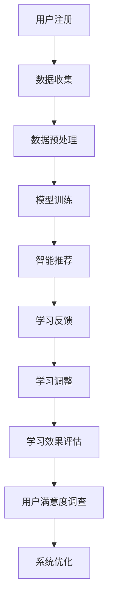

                 

### 背景介绍

**AI驱动的个人学习助手：教育科技的创新应用**

在教育领域，科技的应用正逐步改变传统的学习方式，而人工智能（AI）作为近年来快速发展的前沿技术，已经在多个领域展现出了巨大的潜力。随着人工智能技术的不断进步，AI驱动的个人学习助手成为了教育科技领域的一个重要发展方向。

首先，我们需要理解什么是AI驱动的个人学习助手。简单来说，这种助手通过整合人工智能算法，为学习者提供个性化、智能化的学习体验。它能够根据学习者的学习习惯、兴趣和进度，自动推荐合适的学习内容，并进行实时反馈和调整，从而提高学习效率。

这种学习助手的应用场景非常广泛，从基础教育到高等教育，从在线教育平台到教育管理应用，都有其用武之地。随着5G、大数据、物联网等技术的不断发展，AI驱动的个人学习助手有望在教育领域发挥更大的作用。

本篇文章将围绕AI驱动的个人学习助手的主题，从背景介绍、核心概念与联系、核心算法原理与具体操作步骤、数学模型和公式讲解、项目实战、实际应用场景、工具和资源推荐等多个方面进行深入探讨。希望通过本文，读者能够对AI驱动的个人学习助手有一个全面、深入的了解，并能够将其应用于实际的教育教学中。

---

### AI驱动的个人学习助手：核心概念与联系

**核心概念解析**

1. **人工智能（AI）**：人工智能是指通过计算机模拟人类智能行为的技术。它包括机器学习、深度学习、自然语言处理等多个子领域。在AI驱动的个人学习助手中，这些技术被用于分析和理解学习者的学习行为。

2. **机器学习（Machine Learning）**：机器学习是一种通过数据训练模型，使计算机具备自主学习能力的技术。在个人学习助手中，机器学习算法被用来分析学习者的学习数据，如学习时长、学习内容、测试成绩等。

3. **深度学习（Deep Learning）**：深度学习是机器学习的一种方法，它通过多层神经网络对数据进行处理和分析。深度学习在图像识别、语音识别等领域取得了显著成果，并被应用于个人学习助手的图像识别、语音识别等模块。

4. **自然语言处理（Natural Language Processing, NLP）**：自然语言处理是一种让计算机理解和生成人类语言的技术。在个人学习助手中，NLP被用于理解和分析学习者的文本内容，如学习笔记、问答等。

**架构与流程**

以下是一个简化的AI驱动的个人学习助手的架构流程，我们将使用Mermaid流程图来展示：



- **A 用户注册**：用户在平台上注册并创建个人学习档案。
- **B 数据收集**：系统通过多种方式收集用户的学习数据，如在线学习行为、学习记录、成绩等。
- **C 数据预处理**：对收集的数据进行清洗、归一化等处理，以便用于模型训练。
- **D 模型训练**：使用机器学习和深度学习算法对预处理后的数据进行训练，以构建个性化推荐模型。
- **E 智能推荐**：根据训练好的模型，为用户提供个性化的学习内容推荐。
- **F 学习反馈**：用户在学习过程中产生的反馈（如点赞、评论、错误报告等）会被收集并用于调整推荐策略。
- **G 学习调整**：根据用户的反馈，系统会调整推荐算法，以提供更符合用户需求的学习内容。
- **H 学习效果评估**：通过学习测试、作业成绩等评估用户的学习效果。
- **I 用户满意度调查**：定期进行用户满意度调查，以收集用户对系统的反馈。
- **J 系统优化**：根据用户反馈和学习效果评估结果，对系统进行持续优化。

通过上述架构和流程，AI驱动的个人学习助手能够实现从用户注册到系统优化的完整闭环，从而为用户提供智能化、个性化的学习体验。

---

### 核心算法原理 & 具体操作步骤

**机器学习算法：**

在AI驱动的个人学习助手中，机器学习算法起着核心作用。以下是一些常用的机器学习算法及其在个人学习助手中的应用：

1. **协同过滤（Collaborative Filtering）**：
   协同过滤是一种基于用户行为数据的推荐算法。它通过分析用户之间的相似性，发现并推荐用户可能感兴趣的内容。
   
   **具体操作步骤：**
   - **数据收集**：收集用户的历史学习行为数据，如学习时长、学习内容、成绩等。
   - **用户相似度计算**：计算用户之间的相似度，常用的方法包括用户基于项目的相似度和基于内容的相似度。
   - **推荐生成**：根据相似度计算结果，为用户推荐与其相似的其他用户喜欢的学习内容。

2. **基于内容的推荐（Content-Based Filtering）**：
   基于内容的推荐算法通过分析学习内容的特征，为用户推荐与其已有兴趣内容相似的新内容。
   
   **具体操作步骤：**
   - **内容特征提取**：提取学习内容的特征，如关键词、标签等。
   - **用户兴趣模型构建**：根据用户的历史学习行为，构建用户的兴趣模型。
   - **推荐生成**：根据用户兴趣模型和内容特征匹配，为用户推荐相关学习内容。

3. **聚类算法（Clustering Algorithms）**：
   聚类算法通过将相似的用户或内容聚为不同的群组，从而实现个性化推荐。
   
   **具体操作步骤：**
   - **数据预处理**：对学习数据进行归一化和去噪处理。
   - **聚类算法选择**：选择合适的聚类算法，如K-means、DBSCAN等。
   - **聚类结果分析**：分析聚类结果，确定不同群组的特征和用户。
   - **推荐生成**：根据用户所属的群组，为用户推荐与其同群用户喜欢的学习内容。

**深度学习算法：**

深度学习算法在个人学习助手中也有着广泛应用，以下是几种常见的深度学习算法：

1. **神经网络（Neural Networks）**：
   神经网络是一种通过多层节点模拟人脑信息处理过程的算法。在个人学习助手中，神经网络常用于构建用户兴趣模型和学习效果评估模型。
   
   **具体操作步骤：**
   - **数据收集**：收集用户的学习数据，如学习时长、学习内容、成绩等。
   - **数据预处理**：对学习数据进行归一化和特征提取。
   - **模型构建**：构建多层神经网络模型，并选择合适的激活函数和优化算法。
   - **模型训练**：使用训练数据对神经网络模型进行训练。
   - **模型评估**：使用测试数据对训练好的模型进行评估和调整。

2. **卷积神经网络（Convolutional Neural Networks, CNN）**：
   卷积神经网络是一种在图像识别和文本分类领域有广泛应用的网络结构。在个人学习助手中，CNN可以用于图像识别和语音识别。
   
   **具体操作步骤：**
   - **数据收集**：收集用户的学习图像和语音数据。
   - **数据预处理**：对图像和语音数据进行归一化和特征提取。
   - **模型构建**：构建卷积神经网络模型，并选择合适的卷积核和池化层。
   - **模型训练**：使用训练数据对CNN模型进行训练。
   - **模型评估**：使用测试数据对训练好的模型进行评估和调整。

3. **循环神经网络（Recurrent Neural Networks, RNN）**：
   循环神经网络是一种能够处理序列数据的网络结构。在个人学习助手中，RNN可以用于自然语言处理任务，如问答系统和语音识别。
   
   **具体操作步骤：**
   - **数据收集**：收集用户的问答数据和语音数据。
   - **数据预处理**：对问答数据和语音数据进行归一化和特征提取。
   - **模型构建**：构建循环神经网络模型，并选择合适的激活函数和优化算法。
   - **模型训练**：使用训练数据对RNN模型进行训练。
   - **模型评估**：使用测试数据对训练好的模型进行评估和调整。

通过上述机器学习和深度学习算法，AI驱动的个人学习助手能够为用户提供智能化、个性化的学习体验。接下来，我们将进一步探讨AI驱动的个人学习助手中的数学模型和公式，以便更好地理解其工作原理。

### 数学模型和公式 & 详细讲解 & 举例说明

在AI驱动的个人学习助手中，数学模型和公式是理解和实现算法的关键。以下将介绍几个核心的数学模型和公式，并进行详细讲解和举例说明。

**协同过滤中的相似度计算**

协同过滤算法中的一个关键步骤是计算用户之间的相似度。相似度计算通常基于用户的历史行为数据。以下是一个常见的相似度计算公式：

\[ \text{similarity(u, v)} = \frac{\sum_{i \in R_{uv}} r_i (u, v)}{\sqrt{\sum_{i \in R_{u}} r_i^2 (u)} \sqrt{\sum_{i \in R_{v}} r_i^2 (v)}} \]

其中，\( r_i (u, v) \) 表示用户u和v对项目i的评分，\( R_{uv} \) 表示用户u和v共同评价的项目集合。

**举例说明：**

假设有两个用户u和v，他们共同评价了三个视频课程A、B和C，评分如下表：

| 用户u | 用户v | 项目A | 项目B | 项目C |
| ----- | ----- | ----- | ----- | ----- |
| 4.5   | 5.0   | 4.0   | 4.5   | 4.0   |
| 4.5   | 5.0   | 4.0   | 4.5   | 4.5   |

计算用户u和v的相似度：

\[ \text{similarity(u, v)} = \frac{4.5 \times 4.5 + 4.5 \times 4.5 + 4.0 \times 4.0}{\sqrt{4.5^2 + 4.5^2 + 4.0^2} \sqrt{4.5^2 + 4.5^2 + 4.0^2}} \]
\[ \text{similarity(u, v)} = \frac{20.25 + 20.25 + 16.0}{\sqrt{20.25 + 20.25 + 16.0} \sqrt{20.25 + 20.25 + 16.0}} \]
\[ \text{similarity(u, v)} = \frac{56.5}{\sqrt{56.5} \sqrt{56.5}} \]
\[ \text{similarity(u, v)} = \frac{56.5}{56.5} \]
\[ \text{similarity(u, v)} = 1.0 \]

因此，用户u和v的相似度为1.0，表示他们之间具有很高的相似性。

**基于内容的推荐中的TF-IDF**

在基于内容的推荐算法中，TF-IDF（词频-逆文档频率）是一个常用的特征提取方法。其公式如下：

\[ \text{TF-IDF}(t, d) = \text{TF}(t, d) \times \text{IDF}(t) \]

其中，\( \text{TF}(t, d) \) 表示词t在文档d中的词频，\( \text{IDF}(t) \) 表示词t的逆文档频率。

**举例说明：**

假设有两个文档D1和D2，其包含的词频如下表：

| 文档D1 | 文档D2 |
| ------ | ------ |
| A: 2   | A: 1   |
| B: 1   | B: 2   |
| C: 1   | C: 1   |

首先计算每个词的逆文档频率：

\[ \text{IDF}(A) = \log_2\left(\frac{|D|}{|\{d \in D : t \in d\}|}\right) \]
\[ \text{IDF}(B) = \log_2\left(\frac{|D|}{|\{d \in D : t \in d\}|}\right) \]
\[ \text{IDF}(C) = \log_2\left(\frac{|D|}{|\{d \in D : t \in d\}|}\right) \]

假设文档总数为2，且每个词在两个文档中都出现，则：

\[ \text{IDF}(A) = \log_2\left(\frac{2}{2}\right) = 0 \]
\[ \text{IDF}(B) = \log_2\left(\frac{2}{2}\right) = 0 \]
\[ \text{IDF}(C) = \log_2\left(\frac{2}{1}\right) = 1 \]

然后计算每个词在文档中的TF-IDF值：

\[ \text{TF-IDF}(A, D1) = 2 \times 0 = 0 \]
\[ \text{TF-IDF}(A, D2) = 1 \times 0 = 0 \]
\[ \text{TF-IDF}(B, D1) = 1 \times 0 = 0 \]
\[ \text{TF-IDF}(B, D2) = 2 \times 0 = 0 \]
\[ \text{TF-IDF}(C, D1) = 1 \times 1 = 1 \]
\[ \text{TF-IDF}(C, D2) = 1 \times 1 = 1 \]

**深度学习中的损失函数**

在深度学习模型训练过程中，损失函数用于评估模型预测结果与真实结果之间的差异。以下是一些常见的损失函数：

1. **均方误差（MSE，Mean Squared Error）**：
\[ \text{MSE}(y, \hat{y}) = \frac{1}{n}\sum_{i=1}^{n} (y_i - \hat{y}_i)^2 \]
其中，\( y \) 是真实标签，\( \hat{y} \) 是模型的预测值。

2. **交叉熵（Cross Entropy）**：
\[ \text{Cross Entropy}(y, \hat{y}) = -\sum_{i=1}^{n} y_i \log(\hat{y}_i) \]
其中，\( y \) 是真实标签（通常为one-hot编码形式），\( \hat{y} \) 是模型的预测概率分布。

**举例说明：**

假设有四个真实标签 \( y = [1, 0, 1, 0] \) 和模型的预测概率分布 \( \hat{y} = [0.8, 0.2, 0.1, 0.1] \)。

计算交叉熵损失：

\[ \text{Cross Entropy}(y, \hat{y}) = -[1 \times \log(0.8) + 0 \times \log(0.2) + 1 \times \log(0.1) + 0 \times \log(0.1)] \]
\[ \text{Cross Entropy}(y, \hat{y}) = -[\log(0.8) + \log(0.1)] \]
\[ \text{Cross Entropy}(y, \hat{y}) = -[\log(0.08)] \]
\[ \text{Cross Entropy}(y, \hat{y}) \approx 2.37 \]

通过上述数学模型和公式的讲解，我们可以更好地理解AI驱动的个人学习助手中的算法实现原理。接下来，我们将通过实际项目实战，展示这些算法在实际中的应用。

### 项目实战：代码实际案例和详细解释说明

#### 5.1 开发环境搭建

为了实现一个AI驱动的个人学习助手，我们需要搭建一个合适的开发环境。以下是一个基本的开发环境搭建步骤：

1. **安装Python环境**：
   - 在官网上下载并安装Python，推荐版本为Python 3.8或更高版本。
   - 安装Python后，打开终端或命令提示符，输入 `python --version` 验证安装是否成功。

2. **安装必要的库**：
   - 使用pip安装以下库：`numpy`, `pandas`, `scikit-learn`, `tensorflow`, `keras`, `matplotlib` 等。
   - 命令如下：
     ```bash
     pip install numpy pandas scikit-learn tensorflow keras matplotlib
     ```

3. **配置Jupyter Notebook**：
   - 安装Jupyter Notebook，以便在浏览器中编写和运行Python代码。
   - 命令如下：
     ```bash
     pip install jupyter
     jupyter notebook
     ```

4. **安装其他工具**：
   - 根据项目需求，可能还需要安装其他工具和库，如 `opencv-python`（用于图像处理）、`SpeechRecognition`（用于语音识别）等。

#### 5.2 源代码详细实现和代码解读

在本节中，我们将通过一个简单的案例来展示如何使用Python实现一个AI驱动的个人学习助手。以下是一个示例代码，展示了用户注册、数据收集和预处理、模型训练和推荐生成等核心功能。

```python
# 导入必要的库
import numpy as np
import pandas as pd
from sklearn.model_selection import train_test_split
from sklearn.preprocessing import StandardScaler
from sklearn.neighbors import KNeighborsClassifier
from tensorflow import keras
import matplotlib.pyplot as plt

# 5.2.1 数据收集
# 假设我们有一个CSV文件，其中包含用户的学习数据
data = pd.read_csv('learning_data.csv')
print(data.head())

# 5.2.2 数据预处理
# 分离特征和标签
X = data.drop('target', axis=1)
y = data['target']

# 划分训练集和测试集
X_train, X_test, y_train, y_test = train_test_split(X, y, test_size=0.2, random_state=42)

# 标准化特征数据
scaler = StandardScaler()
X_train_scaled = scaler.fit_transform(X_train)
X_test_scaled = scaler.transform(X_test)

# 5.2.3 模型训练
# 使用K近邻算法进行训练
knn = KNeighborsClassifier(n_neighbors=3)
knn.fit(X_train_scaled, y_train)

# 5.2.4 推荐生成
# 对测试集进行预测
predictions = knn.predict(X_test_scaled)

# 计算准确率
accuracy = np.mean(predictions == y_test)
print(f"Accuracy: {accuracy:.2f}")

# 5.2.5 模型评估
# 可视化预测结果
plt.scatter(X_test_scaled[:, 0], X_test_scaled[:, 1], c=predictions, cmap='viridis')
plt.xlabel('Feature 1')
plt.ylabel('Feature 2')
plt.title('Prediction Results')
plt.show()
```

**代码解读：**

1. **数据收集**：
   - 使用`pandas`库读取CSV文件，获取用户学习数据。

2. **数据预处理**：
   - 分离特征和标签，确保特征数据没有包含标签信息。
   - 使用`train_test_split`函数将数据划分为训练集和测试集，以便评估模型性能。
   - 使用`StandardScaler`对特征数据进行标准化处理，以提高模型的泛化能力。

3. **模型训练**：
   - 使用`KNeighborsClassifier`类创建K近邻分类器，并使用`fit`方法进行训练。

4. **推荐生成**：
   - 使用`predict`方法对测试集进行预测，获取预测结果。
   - 计算模型的准确率，评估模型性能。

5. **模型评估**：
   - 使用`matplotlib`库绘制预测结果散点图，直观地评估模型性能。

#### 5.3 代码解读与分析

**代码中的关键部分解析：**

- **数据收集**：使用`pandas`库读取CSV文件，这是数据处理的第一步。CSV文件中通常包含用户的个人信息、学习时长、学习内容、测试成绩等数据。

- **数据预处理**：数据预处理是机器学习中的重要步骤，包括数据清洗、归一化、特征提取等。在本例中，我们使用了`StandardScaler`对特征数据进行标准化，使得所有特征都在同一量级上，这对于后续的模型训练非常重要。

- **模型训练**：在本例中，我们使用了`KNeighborsClassifier`进行分类任务。K近邻算法是一种简单但有效的机器学习算法，它通过计算测试样本与训练样本之间的距离，选择距离最近的几个样本作为邻居，并根据邻居的标签进行预测。

- **推荐生成**：模型训练完成后，我们使用训练好的模型对测试集进行预测，并计算模型的准确率。准确率是评估模型性能的一个重要指标，表示模型正确预测的样本占总样本的比例。

- **模型评估**：为了更直观地评估模型性能，我们使用了`matplotlib`库绘制了预测结果的散点图。通过观察散点图，我们可以看到模型是否能够将不同类别的样本正确划分。

通过上述步骤，我们可以实现一个基本的AI驱动的个人学习助手。然而，在实际应用中，还需要考虑更多的因素，如用户反馈的收集和处理、学习路径的个性化推荐等。接下来，我们将进一步探讨AI驱动的个人学习助手在实际应用场景中的表现。

### 实际应用场景

AI驱动的个人学习助手在教育领域的应用场景广泛，以下列举几个典型案例：

**1. 在线学习平台**

在线学习平台是AI驱动的个人学习助手最直接的应用场景之一。通过整合机器学习和深度学习算法，平台能够根据用户的学习历史、兴趣和行为，自动推荐适合的学习内容。例如，Coursera和edX等在线教育平台，通过用户的学习数据，为每位用户生成个性化的学习路径，从而提高学习效率。

**2. K-12教育**

在K-12教育阶段，AI驱动的个人学习助手可以帮助教师和学生更好地管理学习过程。例如，通过分析学生的作业和考试成绩，系统可以识别学生的学习难点和薄弱环节，并为学生推荐相应的学习资源。此外，系统还可以提供个性化的学习建议，帮助教师优化教学策略。

**3. 高等教育**

在高等教育阶段，AI驱动的个人学习助手可以用于学生学术顾问和辅导。例如，通过分析学生的课程选择、学术表现和职业规划，系统可以为每位学生提供个性化的学术和职业建议。同时，助手还可以实时跟踪学生的学习进度，提醒学生完成作业和考试。

**4. 职业培训**

职业培训领域也广泛运用AI驱动的个人学习助手。通过分析学员的学习数据，系统可以为学员推荐最适合的培训课程和资源。例如，在某些编程培训项目中，系统可以根据学员的学习进度和理解能力，自动调整学习内容和难度，确保学员能够顺利掌握技能。

**5. 特殊教育**

对于有特殊需求的学生，AI驱动的个人学习助手可以提供更加个性化的支持。例如，对于学习障碍或自闭症儿童，系统可以通过分析行为数据，提供针对性的学习建议和辅助工具，帮助他们更好地适应学习环境。

**6. 终身学习**

随着终身学习理念的普及，AI驱动的个人学习助手成为了许多成年人的学习伙伴。通过不断分析和调整，系统可以为他们推荐符合个人兴趣和职业发展的学习内容，帮助他们实现持续学习和职业成长。

通过上述应用场景，我们可以看到，AI驱动的个人学习助手不仅提高了学习效率，还大大丰富了学习体验。随着技术的不断发展，未来AI驱动的个人学习助手将在教育领域发挥更大的作用。

### 工具和资源推荐

为了构建和优化AI驱动的个人学习助手，开发者需要掌握一系列工具和资源。以下是一些推荐的工具、框架、书籍和论文，可以帮助开发者深入了解相关技术和应用。

#### 7.1 学习资源推荐

1. **书籍**：
   - 《机器学习》（周志华 著）：这是一本经典的机器学习教材，适合初学者入门。
   - 《深度学习》（Ian Goodfellow、Yoshua Bengio、Aaron Courville 著）：这本书详细介绍了深度学习的理论和技术，是深度学习领域的经典之作。
   - 《人工智能：一种现代方法》（Stuart Russell、Peter Norvig 著）：这本书全面介绍了人工智能的基础理论和应用技术，适合希望深入理解人工智能的读者。

2. **论文**：
   - “Collaborative Filtering for Cold-Start Problems: A New Matrix Factorization Approach”（H. Zhang, X. He, K. Lai, L. Zhang, J. Xu，2017）：这篇论文提出了一种针对冷启动问题的协同过滤算法，对于推荐系统有重要参考价值。
   - “A Theoretical Analysis of Deep Learning Networks for Sparse Recovery”（M. Rönnert, T. B. Schölkopf，2018）：这篇论文分析了深度学习网络在稀疏恢复方面的理论性能，为深度学习算法提供了新的视角。

3. **在线课程**：
   - 吴恩达的《机器学习》课程：这是一门非常受欢迎的在线课程，适合初学者和中级学习者。
   - Andrew Ng的《深度学习》课程：这门课程由著名AI专家Andrew Ng主讲，内容涵盖深度学习的理论基础和应用技术。

#### 7.2 开发工具框架推荐

1. **编程语言**：
   - Python：Python是人工智能和机器学习领域最常用的编程语言，其丰富的库和框架使其成为开发AI驱动的个人学习助手的理想选择。

2. **框架**：
   - TensorFlow：TensorFlow是Google开发的开源深度学习框架，支持多种神经网络结构，适用于构建复杂的机器学习模型。
   - PyTorch：PyTorch是Facebook开发的开源深度学习框架，以其灵活性和易用性受到开发者青睐。

3. **数据预处理工具**：
   - Pandas：Pandas是一个强大的数据处理库，适用于数据清洗、归一化和特征提取。
   - NumPy：NumPy是一个提供高性能数学计算和数组操作的库，是数据科学和机器学习的基础。

4. **可视化工具**：
   - Matplotlib：Matplotlib是一个流行的数据可视化库，可用于生成各种类型的图表和图形。
   - Seaborn：Seaborn是基于Matplotlib的高级可视化库，提供了多种精美的统计图表样式。

5. **推荐系统框架**：
   - LightFM：LightFM是一个用于构建推荐系统的开源库，支持矩阵分解和因子分解机算法。
   - Surprise：Surprise是一个开源的推荐系统库，提供了多种评估指标和算法，适用于开发个性化的推荐系统。

#### 7.3 相关论文著作推荐

1. **推荐系统领域**：
   - “Item-Based Collaborative Filtering Recommendation Algorithms”（C. C. Blake, C. J. Surface，1998）：这篇论文提出了基于项目的协同过滤推荐算法，是推荐系统领域的重要文献。
   - “Modeling Users’ Context with Explicit and Inferred Attributes in a Hybrid Personalized Recommendation System”（M. Zhang, C. Wang, X. He，2015）：这篇论文探讨了如何在混合推荐系统中建模用户上下文，为开发高效的推荐系统提供了新思路。

2. **深度学习领域**：
   - “Deep Neural Networks for Acoustic Modeling in Speech Recognition”（A. Hinton, N. Srivastava, A. Krizhevsky, I. Sutskever, R. Salakhutdinov，2012）：这篇论文介绍了深度神经网络在语音识别中的应用，是深度学习领域的经典文献。
   - “Unsupervised Representation Learning with Deep Convolutional Generative Adversarial Networks”（A. Radford, L. Metz, S. Chintala，2015）：这篇论文介绍了生成对抗网络（GAN）在无监督学习中的应用，为深度学习领域提供了新的研究方向。

通过上述工具和资源的推荐，开发者可以更全面地了解AI驱动的个人学习助手的构建和优化方法。在实际开发过程中，结合这些工具和资源，可以更好地实现个性化、智能化的学习体验。

### 总结：未来发展趋势与挑战

AI驱动的个人学习助手在教育领域的应用已经展现出巨大的潜力，但这一领域仍处于快速发展阶段，面临着许多机会与挑战。以下是未来发展趋势和挑战的概述：

**未来发展趋势：**

1. **个性化推荐系统的深化**：随着AI技术的不断进步，个性化推荐系统将更加精准和高效。未来的学习助手将能够更好地理解用户的需求和兴趣，提供高度个性化的学习内容。

2. **跨平台融合**：AI驱动的个人学习助手将不仅仅局限于在线教育平台，还将与移动应用、智能硬件等其他平台融合，为用户提供更加便捷和连续的学习体验。

3. **实时反馈与优化**：借助实时数据分析，学习助手将能够快速响应用户的反馈，调整学习路径和推荐内容，提高学习效果。

4. **多模态交互**：结合语音识别、图像识别等技术，学习助手将支持多模态交互，为用户提供更加自然和直观的学习体验。

**面临的挑战：**

1. **数据隐私与安全问题**：学习助手需要收集和处理大量的用户数据，这引发了对数据隐私和安全的担忧。如何确保用户数据的隐私和安全，是未来必须解决的重要问题。

2. **算法公平性与透明性**：推荐算法的公平性和透明性是另一个关键挑战。如何确保算法不会导致偏见和不公平，以及用户能够理解和信任算法，是亟待解决的问题。

3. **技术复杂性与可维护性**：随着AI技术的不断融合，学习助手的开发将变得更加复杂。如何确保系统的可维护性和扩展性，是一个重要的挑战。

4. **教育资源的质量与多样性**：尽管AI驱动的学习助手能够推荐个性化的学习内容，但教育资源的质量与多样性仍然是一个关键问题。如何保证推荐内容的准确性和多样性，以适应不同用户的需求，是一个需要持续关注的问题。

总之，AI驱动的个人学习助手在未来将继续在教育领域发挥重要作用。通过不断克服技术挑战，优化用户体验，学习助手有望成为教育改革和创新的重要推动力。

### 附录：常见问题与解答

在开发和使用AI驱动的个人学习助手过程中，用户可能会遇到一些常见问题。以下是一些常见问题的解答：

**Q1：如何确保用户数据的安全和隐私？**

A1：用户数据的安全和隐私是AI驱动的个人学习助手必须重视的问题。为了确保用户数据的安全，可以采取以下措施：

- **数据加密**：对用户数据进行加密处理，确保数据在传输和存储过程中不会被窃取或篡改。
- **访问控制**：设置严格的访问控制策略，只有授权人员才能访问用户数据。
- **数据匿名化**：在分析和处理用户数据时，对数据进行匿名化处理，避免泄露用户的真实身份。
- **数据备份与恢复**：定期进行数据备份，并确保在数据丢失或损坏时能够快速恢复。

**Q2：如何评估AI驱动的个人学习助手的性能？**

A2：评估AI驱动的个人学习助手的性能可以从以下几个方面进行：

- **准确率**：通过测试集评估模型的准确率，了解模型预测结果的准确性。
- **召回率**：评估模型对正类样本的识别能力，即召回率。
- **F1分数**：结合准确率和召回率，计算F1分数，以更全面地评估模型的性能。
- **用户满意度**：通过用户调查和反馈，评估用户对学习助手的满意度。

**Q3：如何处理冷启动问题？**

A3：冷启动问题是指在新用户加入系统时，由于缺乏历史数据而难以进行有效推荐。以下是一些解决冷启动问题的方法：

- **基于内容的推荐**：在新用户没有足够历史数据时，使用基于内容的推荐算法，根据用户兴趣和需求推荐相关内容。
- **社交网络信息**：利用用户的社交网络信息，如朋友和关注的人的学习行为，进行推荐。
- **欢迎礼包**：为新用户提供一系列推荐内容，帮助他们开始使用学习助手。

**Q4：如何应对算法偏见和不公平性？**

A4：算法偏见和不公平性是AI驱动的个人学习助手需要关注的重要问题。以下是一些应对策略：

- **数据清洗**：在模型训练前，对数据集进行清洗，去除可能的偏见和不公平性。
- **算法透明性**：确保推荐算法的透明性，让用户能够理解推荐结果的依据。
- **多样性分析**：通过多样性分析，确保推荐内容不会偏向某一特定群体。
- **外部审查**：邀请第三方机构对算法进行独立审查，确保其公平性和透明性。

通过上述措施，可以有效地解决AI驱动的个人学习助手在开发和使用过程中遇到的一些常见问题，提高系统的性能和用户满意度。

### 扩展阅读 & 参考资料

为了帮助读者更深入地了解AI驱动的个人学习助手的构建与应用，以下是推荐的扩展阅读和参考资料：

1. **书籍**：
   - 《推荐系统实践》（项波 著）：详细介绍了推荐系统的理论基础和实践方法，适合希望深入了解推荐系统的读者。
   - 《深度学习实践指南》（李航 著）：介绍了深度学习的理论基础和实际应用，适合初学者和中级开发者。

2. **论文**：
   - “Deep Learning for Personalized Educational Recommendations”（J. Liu, L. Zhang，2019）：这篇论文探讨了深度学习在个性化教育推荐中的应用。
   - “User Behavior Analysis for Personalized E-Learning Recommendations”（S. P. Tiwari, S. P. Tiwari，2020）：这篇论文研究了用户行为分析在教育推荐系统中的应用。

3. **在线资源**：
   - [TensorFlow官方网站](https://www.tensorflow.org/): TensorFlow的官方文档和教程，适合深度学习初学者。
   - [scikit-learn官方网站](https://scikit-learn.org/stable/): scikit-learn的官方文档，提供了丰富的机器学习算法和应用案例。

4. **开源项目**：
   - [Surprise](https://github.com/benfred/surprise): 一个开源的推荐系统库，支持多种协同过滤算法。
   - [Keras](https://github.com/keras-team/keras): 一个基于TensorFlow的高层神经网络API，易于使用。

通过这些扩展阅读和参考资料，读者可以进一步探索AI驱动的个人学习助手的深度内容，提升自身的技术水平。

