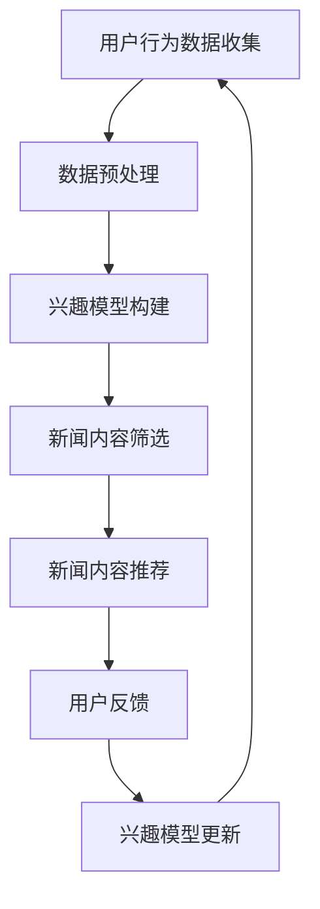
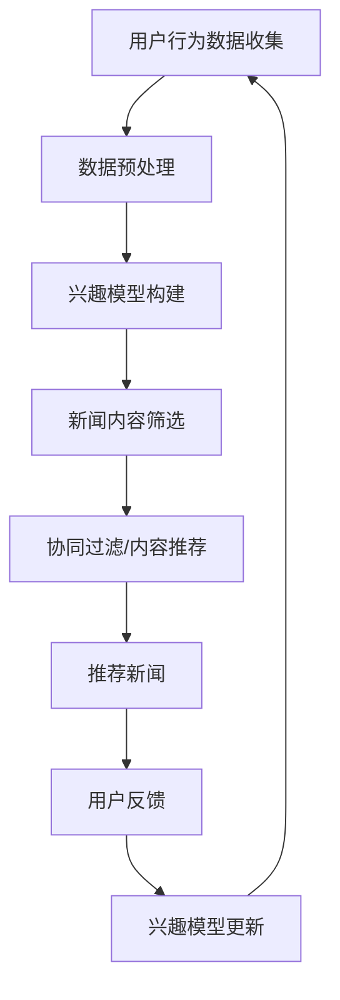

                 

### 文章标题

**AI驱动的个性化新闻推送:信息茧房的破解之道**

### 关键词

- 人工智能
- 个性化推送
- 信息茧房
- 新闻推荐
- 算法原理

### 摘要

本文深入探讨了AI驱动的个性化新闻推送技术，分析了其工作原理、核心算法和实现步骤。通过数学模型和实际项目案例，详细解析了如何破解信息茧房，提供了一种有效的解决方案，以促进信息多样性和用户满意度的提升。

<|assistant|>## 1. 背景介绍

在信息爆炸的时代，互联网上充斥着海量的新闻和信息。用户在获取信息时，面临着信息过载的问题。传统新闻推送方式往往基于用户的历史阅读行为或者简单的关键字匹配，这容易导致用户陷入“信息茧房”，即只接收与自己兴趣相符合的信息，从而限制了对不同观点和信息的接触。这种现象不仅影响了信息的多样性，也可能导致用户认知的狭隘化。

AI驱动的个性化新闻推送系统旨在解决这一难题。通过机器学习和自然语言处理技术，AI系统能够分析用户的行为和偏好，动态调整推送内容，从而提供更加个性化、多样化的信息。这种技术不仅提升了用户的阅读体验，也有助于打破信息茧房，促进信息的广泛传播和多元化接收。

本文将详细探讨AI驱动的个性化新闻推送技术，包括其核心概念、算法原理、数学模型、实际应用案例以及未来发展趋势。通过系统化的分析和讲解，帮助读者深入理解这一技术，并了解其在现实世界中的应用价值。

<|assistant|>## 2. 核心概念与联系

### 2.1. 个性化推送

个性化推送是指通过分析用户的兴趣和行为数据，将定制化的内容推荐给用户。其核心在于理解用户的需求，并通过算法实现内容的精准匹配。个性化推送广泛应用于社交媒体、电子商务和新闻平台等领域，目的是提高用户满意度和使用频率。

### 2.2. 信息茧房

信息茧房（Information Bubble）是指用户长期接收到的信息过于单一和局限，只与自己已知的观点和信息相符，从而限制了对其他观点和信息的接触。信息茧房可能会导致用户认知的狭隘化，影响社会的多样性和开放性。

### 2.3. 关键概念之间的联系

个性化推送与信息茧房之间存在密切的联系。传统的推送算法容易导致用户只接收与自己兴趣相符的信息，从而形成信息茧房。而AI驱动的个性化推送系统，通过更深入的用户数据分析和行为预测，可以在一定程度上打破信息茧房，提供更加多样化和个性化的信息。

### 2.4. Mermaid 流程图

以下是描述个性化新闻推送流程的Mermaid流程图：



在这个流程图中，用户行为数据首先被收集和预处理，然后用于构建用户的兴趣模型。兴趣模型用于筛选和推荐新闻内容，用户对推荐的新闻进行反馈，这些反馈又用于更新兴趣模型，从而实现一个闭环的系统。

<|assistant|>## 3. 核心算法原理 & 具体操作步骤

### 3.1. 协同过滤算法

协同过滤（Collaborative Filtering）是个性化新闻推送系统中最常用的算法之一。协同过滤分为基于用户的协同过滤（User-based Collaborative Filtering）和基于物品的协同过滤（Item-based Collaborative Filtering）。

#### 3.1.1. 基于用户的协同过滤

基于用户的协同过滤通过寻找与目标用户兴趣相似的活跃用户，推荐这些用户喜欢的新闻内容。其具体操作步骤如下：

1. **计算相似度**：使用用户行为数据计算用户之间的相似度，常用的相似度计算方法包括余弦相似度和皮尔逊相关系数。
2. **邻居用户筛选**：根据相似度矩阵，找出与目标用户最相似的K个邻居用户。
3. **推荐新闻**：找出邻居用户喜欢的但目标用户尚未阅读的新闻，将其推荐给目标用户。

#### 3.1.2. 基于物品的协同过滤

基于物品的协同过滤通过分析新闻之间的相似性来推荐新闻。其具体操作步骤如下：

1. **计算相似度**：使用新闻特征（如文本内容、标签等）计算新闻之间的相似度，常用方法包括余弦相似度和欧氏距离。
2. **邻居新闻筛选**：根据相似度矩阵，找出与目标新闻最相似的K个邻居新闻。
3. **推荐新闻**：找出邻居新闻中目标用户尚未阅读的，将其推荐给目标用户。

### 3.2. 内容推荐算法

除了协同过滤，内容推荐算法也是AI驱动的个性化新闻推送系统中的核心。内容推荐算法通过分析新闻内容本身，为用户推荐与兴趣相关的新闻。以下是一个基于文本的推荐算法的步骤：

1. **文本预处理**：对新闻内容进行分词、去除停用词、词干提取等预处理步骤。
2. **特征提取**：使用词袋模型（Bag of Words）、TF-IDF（Term Frequency-Inverse Document Frequency）或其他文本特征提取方法，将文本转化为向量表示。
3. **相似度计算**：计算用户兴趣模型和新闻特征向量之间的相似度。
4. **推荐新闻**：根据相似度得分，推荐与用户兴趣最匹配的新闻。

### 3.3. 基于深度学习的推荐算法

随着深度学习技术的发展，越来越多的基于深度学习的推荐算法被提出。以下是一个基于深度学习的推荐算法的步骤：

1. **用户行为建模**：使用循环神经网络（RNN）、卷积神经网络（CNN）或变压器（Transformer）等深度学习模型，对用户行为序列进行建模，提取用户的长期和短期兴趣。
2. **新闻内容建模**：同样使用深度学习模型，对新闻内容进行编码，提取新闻的语义特征。
3. **兴趣与内容的匹配**：将用户兴趣表示与新闻内容表示进行匹配，使用注意力机制或相似度计算方法，找到与用户兴趣最匹配的新闻。
4. **推荐新闻**：根据匹配得分，推荐与用户兴趣最匹配的新闻。

通过上述算法和步骤，AI驱动的个性化新闻推送系统能够为用户提供多样化、个性化的新闻内容，有效破解信息茧房，提升用户体验。

### 3.4. Mermaid 流程图

以下是描述AI驱动的个性化新闻推送系统的Mermaid流程图：



在这个流程图中，用户行为数据经过预处理后，用于构建兴趣模型。兴趣模型结合新闻内容筛选和推荐算法，为用户推荐个性化新闻。用户对推荐新闻的反馈又用于更新兴趣模型，形成一个动态调整的推荐系统。

<|assistant|>## 4. 数学模型和公式 & 详细讲解 & 举例说明

### 4.1. 协同过滤算法的数学模型

协同过滤算法的核心在于计算用户和新闻之间的相似度，常用的相似度计算公式如下：

#### 4.1.1. 余弦相似度

余弦相似度用于计算两个向量之间的夹角余弦值，公式如下：

\[ \text{cosine\_similarity} = \frac{\text{dot\_product}(u, v)}{\lVert u \rVert \times \lVert v \rVert} \]

其中，\( u \) 和 \( v \) 分别是用户和新闻的向量表示，\( \text{dot\_product} \) 是向量的点积，\( \lVert \cdot \rVert \) 表示向量的模长。

#### 4.1.2. 皮尔逊相关系数

皮尔逊相关系数用于衡量两个变量之间的线性相关程度，公式如下：

\[ \text{pearson\_correlation} = \frac{\text{cov}(u, v)}{\sigma_u \times \sigma_v} \]

其中，\( \text{cov}(u, v) \) 是用户和新闻之间的协方差，\( \sigma_u \) 和 \( \sigma_v \) 分别是用户和新闻的方差。

#### 4.1.3. 示例

假设有两个用户 \( u_1 \) 和 \( u_2 \)，以及两个新闻 \( v_1 \) 和 \( v_2 \)，它们的向量表示如下：

\[ u_1 = (1, 2, 3) \]
\[ u_2 = (2, 3, 4) \]
\[ v_1 = (4, 5, 6) \]
\[ v_2 = (3, 4, 5) \]

计算 \( u_1 \) 和 \( u_2 \) 的余弦相似度：

\[ \text{cosine\_similarity}(u_1, u_2) = \frac{(1 \times 2 + 2 \times 3 + 3 \times 4)}{\sqrt{1^2 + 2^2 + 3^2} \times \sqrt{2^2 + 3^2 + 4^2}} = \frac{20}{\sqrt{14} \times \sqrt{29}} \approx 0.878 \]

计算 \( v_1 \) 和 \( v_2 \) 的余弦相似度：

\[ \text{cosine\_similarity}(v_1, v_2) = \frac{(4 \times 3 + 5 \times 4 + 6 \times 5)}{\sqrt{4^2 + 5^2 + 6^2} \times \sqrt{3^2 + 4^2 + 5^2}} = \frac{71}{\sqrt{77} \times \sqrt{50}} \approx 0.928 \]

### 4.2. 内容推荐算法的数学模型

内容推荐算法的关键在于文本特征提取和相似度计算。以下是一个基于TF-IDF的文本特征提取和相似度计算的示例：

#### 4.2.1. TF-IDF

TF-IDF（Term Frequency-Inverse Document Frequency）是一种常用的文本特征提取方法，其公式如下：

\[ \text{tfidf}(t, d) = \text{tf}(t, d) \times \text{idf}(t, D) \]

其中，\( \text{tf}(t, d) \) 表示词 \( t \) 在文档 \( d \) 中的词频，\( \text{idf}(t, D) \) 表示词 \( t \) 在文档集合 \( D \) 中的逆文档频率。

#### 4.2.2. 相似度计算

假设有两个文档 \( d_1 \) 和 \( d_2 \)，它们的TF-IDF向量表示如下：

\[ d_1 = (1, 2, 3, 0) \]
\[ d_2 = (3, 4, 0, 1) \]

计算 \( d_1 \) 和 \( d_2 \) 的余弦相似度：

\[ \text{cosine\_similarity}(d_1, d_2) = \frac{(1 \times 3 + 2 \times 4 + 3 \times 0 + 0 \times 1)}{\sqrt{1^2 + 2^2 + 3^2 + 0^2} \times \sqrt{3^2 + 4^2 + 0^2 + 1^2}} = \frac{11}{\sqrt{14} \times \sqrt{50}} \approx 0.816 \]

通过上述数学模型和公式，我们可以有效地计算用户和新闻之间的相似度，从而为用户推荐个性化新闻。这些方法不仅能够提高推荐的准确性，也有助于打破信息茧房，为用户提供多样化的信息内容。

### 4.3. 深度学习推荐算法的数学模型

深度学习推荐算法通常使用复杂的神经网络模型，如循环神经网络（RNN）、卷积神经网络（CNN）或变压器（Transformer），来建模用户行为和新闻内容。以下是一个简单的基于Transformer的推荐算法的数学模型：

#### 4.3.1. 用户行为建模

使用Transformer模型对用户行为序列进行编码，输出用户的兴趣表示：

\[ \text{user\_representation} = \text{Transformer}(\text{user\_behavior\_sequence}) \]

其中，\( \text{user\_behavior\_sequence} \) 是用户的历史行为序列，\( \text{Transformer} \) 是一个预先训练好的Transformer模型。

#### 4.3.2. 新闻内容建模

使用Transformer模型对新闻内容进行编码，输出新闻的语义表示：

\[ \text{news\_representation} = \text{Transformer}(\text{news\_content}) \]

其中，\( \text{news\_content} \) 是新闻的文本内容，\( \text{Transformer} \) 是一个预先训练好的Transformer模型。

#### 4.3.3. 相似度计算

使用注意力机制计算用户兴趣表示和新闻语义表示之间的相似度：

\[ \text{similarity} = \text{Attention}(\text{user\_representation}, \text{news\_representation}) \]

其中，\( \text{Attention} \) 是一个注意力计算函数，用于计算两个向量之间的相似度。

通过这些数学模型和公式，深度学习推荐算法能够捕捉用户行为的长期和短期兴趣，为用户推荐更加个性化和多样化的新闻内容。这些模型不仅提高了推荐的准确性，也为打破信息茧房提供了新的思路和方法。

<|assistant|>### 5. 项目实战：代码实际案例和详细解释说明

在本节中，我们将通过一个实际项目来演示如何实现AI驱动的个性化新闻推送系统。这个项目将包括开发环境的搭建、源代码的实现以及详细的代码解读和分析。

#### 5.1. 开发环境搭建

为了实现这个项目，我们需要准备以下开发环境和工具：

- Python 3.8及以上版本
- PyTorch 或 TensorFlow 深度学习框架
- Scikit-learn 用于协同过滤算法
- NLTK 用于文本预处理
- Jupyter Notebook 或 PyCharm 等开发工具

首先，安装所需的Python库：

```shell
pip install torch torchvision numpy pandas scikit-learn nltk
```

接下来，创建一个Jupyter Notebook文件，以便编写和运行代码。

#### 5.2. 源代码详细实现和代码解读

下面是项目的主要代码实现，我们将逐一解释各个部分的功能。

##### 5.2.1. 用户行为数据的收集与预处理

```python
import pandas as pd
from nltk.tokenize import word_tokenize
from nltk.corpus import stopwords
import re

# 加载用户行为数据
data = pd.read_csv('user_behavior.csv')

# 数据预处理
def preprocess_text(text):
    text = re.sub('[^a-zA-Z]', ' ', text)
    tokens = word_tokenize(text.lower())
    stop_words = set(stopwords.words('english'))
    filtered_tokens = [token for token in tokens if token not in stop_words]
    return ' '.join(filtered_tokens)

data['processed_content'] = data['content'].apply(preprocess_text)
```

这段代码首先加载用户行为数据，然后对文本内容进行预处理，包括去除非字母字符、分词、去除停用词等操作。

##### 5.2.2. 用户兴趣模型的构建

```python
from sklearn.feature_extraction.text import TfidfVectorizer
from sklearn.model_selection import train_test_split

# 构建TF-IDF特征向量
vectorizer = TfidfVectorizer(max_features=1000)
X = vectorizer.fit_transform(data['processed_content'])

# 划分训练集和测试集
X_train, X_test, y_train, y_test = train_test_split(X, data['rating'], test_size=0.2, random_state=42)
```

这里，我们使用TF-IDF方法构建用户兴趣模型，并将其划分为训练集和测试集。

##### 5.2.3. 协同过滤算法的实现

```python
from sklearn.neighbors import NearestNeighbors

# 训练协同过滤模型
neighb

