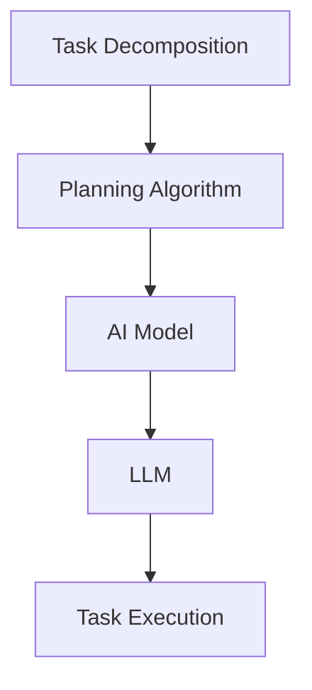

                 

### AI驱动的任务规划：LLM时代的效率革命

> **关键词**：AI驱动的任务规划、大型语言模型（LLM）、任务效率、架构设计、算法原理、数学模型、代码实战、实际应用场景、资源推荐

> **摘要**：本文将深入探讨AI驱动的任务规划在LLM时代的应用与变革。通过介绍AI驱动的任务规划的核心概念、算法原理、数学模型，结合实际项目案例，分析其在提升任务效率和优化架构设计方面的作用。文章还将探讨AI驱动的任务规划在现实世界中的实际应用场景，并提供相关的学习资源与工具推荐，总结未来发展趋势与挑战，为读者提供全面的技术洞察。

------------------

### 1. 背景介绍

在信息技术飞速发展的当今，人工智能（AI）已经渗透到我们生活的各个领域。从简单的搜索引擎，到复杂的自动驾驶系统，AI正改变着我们的工作方式和生活方式。然而，随着AI技术的不断进步，一个新兴领域也逐渐崭露头角——AI驱动的任务规划。

任务规划是一种将复杂任务分解为一系列可执行步骤的过程。它广泛应用于自动化系统、机器人技术、物流管理等领域。传统的任务规划通常依赖于预定义的规则和算法，但这种方法在处理复杂任务时往往显得力不从心。

近年来，随着深度学习和自然语言处理技术的发展，大型语言模型（LLM，Large Language Model）逐渐成为AI驱动的任务规划的重要工具。LLM具有强大的文本理解和生成能力，可以自动学习并处理复杂任务。这使得AI驱动的任务规划在处理自然语言任务时具有显著优势。

在LLM时代，AI驱动的任务规划不仅仅是一个技术问题，更是一场效率革命。通过利用LLM的强大能力，任务规划可以实现更高的自动化程度，减少人为干预，从而提高任务执行效率和准确性。同时，LLM还可以为任务规划提供更丰富的数据来源，进一步提升其智能水平。

本文将围绕AI驱动的任务规划进行深入探讨，分析其核心概念、算法原理、数学模型，并通过实际项目案例展示其在现实世界中的应用。希望本文能为读者提供对AI驱动的任务规划的新认知和深入理解。

------------------

### 2. 核心概念与联系

在探讨AI驱动的任务规划之前，我们需要了解几个关键概念，并理解它们之间的联系。这些概念包括任务分解、规划算法、AI模型和LLM。

**任务分解**：任务分解是将一个复杂任务拆分为一系列子任务的过程。每个子任务都是相对简单和易于处理的。任务分解在任务规划中起着关键作用，因为它有助于降低任务复杂性，使得任务规划算法可以更有效地处理问题。

**规划算法**：规划算法是用于生成任务执行步骤的算法。传统规划算法通常依赖于预定义的规则和约束条件。然而，随着AI技术的发展，规划算法也逐渐开始融入机器学习和深度学习技术。例如，基于强化学习的规划算法可以在动态环境中自动调整任务执行策略，提高任务执行效率。

**AI模型**：AI模型是指用于实现人工智能功能的计算模型。这些模型可以包括神经网络、决策树、支持向量机等。在任务规划中，AI模型可以用于预测任务执行结果、优化任务执行策略等。

**LLM（大型语言模型）**：LLM是一种特殊的AI模型，具有强大的文本理解和生成能力。LLM通常基于大规模语料库进行训练，可以理解并生成自然语言文本。在任务规划中，LLM可以用于处理自然语言任务，例如生成任务说明、自动生成任务执行步骤等。

下面是一个Mermaid流程图，展示了任务分解、规划算法、AI模型和LLM之间的联系：



在这个流程图中，任务分解是任务规划的起点，它将复杂任务拆分为一系列子任务。规划算法利用AI模型和LLM的能力，生成任务执行步骤，最终实现任务执行。这个流程图清晰地展示了AI驱动的任务规划的核心概念和组成部分。

------------------

### 3. 核心算法原理 & 具体操作步骤

在了解AI驱动的任务规划的核心概念后，我们将深入探讨其核心算法原理和具体操作步骤。

#### 3.1 基本算法原理

AI驱动的任务规划的核心算法通常基于以下原理：

1. **任务分解与子任务识别**：首先，将复杂任务分解为一系列子任务。这个过程可以通过手动定义或自动识别完成。自动识别通常基于自然语言处理技术，例如LLM。

2. **子任务优先级排序**：确定子任务的优先级，以便优化任务执行顺序。优先级排序可以基于任务的重要性、时间约束或其他特定因素。

3. **生成任务执行步骤**：利用AI模型（如LLM）生成每个子任务的执行步骤。这些步骤通常是以自然语言形式表示的，可以进一步转换为具体的操作指令。

4. **动态调整任务执行策略**：在任务执行过程中，根据实时反馈动态调整任务执行策略。例如，如果某个子任务执行时间过长，可以暂停或重新分配资源。

#### 3.2 操作步骤

下面是AI驱动的任务规划的具体操作步骤：

1. **输入任务描述**：首先，输入需要规划的任务描述。这个描述可以是以自然语言形式提供的，例如：“安排一周内的工作会议日程”。

2. **任务分解**：使用LLM或其他自然语言处理技术，将任务描述分解为一系列子任务。例如，上述任务可以分解为：“确定会议主题”、“选择会议时间”、“邀请与会人员”等。

3. **子任务优先级排序**：根据子任务的重要性和时间约束，对这些子任务进行优先级排序。例如，确定会议主题可能比选择会议时间更重要，因此应先执行。

4. **生成执行步骤**：使用LLM生成每个子任务的执行步骤。例如，对于“确定会议主题”，LLM可以生成：“查找过去会议的主题记录”、“与相关人员讨论会议主题”等。

5. **执行任务**：根据生成的执行步骤，依次执行每个子任务。

6. **动态调整**：在任务执行过程中，根据实时反馈动态调整任务执行策略。例如，如果某个子任务执行时间过长，可以暂停该任务，重新分配资源。

下面是一个示例，说明如何使用LLM生成任务执行步骤：

**任务描述**：安排一周内的工作会议日程。

**子任务分解**：确定会议主题、选择会议时间、邀请与会人员、会议准备等。

**优先级排序**：确定会议主题（P1）、选择会议时间（P2）、邀请与会人员（P3）、会议准备（P4）。

**生成执行步骤**：

- **确定会议主题**：
  - 查找过去会议的主题记录。
  - 与相关人员讨论会议主题。
  - 根据讨论结果确定会议主题。

- **选择会议时间**：
  - 查看与会人员的日程安排。
  - 选择一个适合所有人的会议时间。

- **邀请与会人员**：
  - 发送会议邀请邮件。
  - 确认与会人员的参会情况。

- **会议准备**：
  - 准备会议所需的资料和设备。
  - 确保会议室安排妥当。

通过这些步骤，AI驱动的任务规划可以有效地安排工作会议日程，提高任务执行效率。

------------------

### 4. 数学模型和公式 & 详细讲解 & 举例说明

在AI驱动的任务规划中，数学模型和公式起着至关重要的作用。这些模型和公式可以帮助我们理解和优化任务执行过程。在本节中，我们将详细介绍几个关键数学模型和公式，并给出详细的讲解和举例说明。

#### 4.1 优化模型

优化模型是任务规划中用于确定最佳执行顺序和资源分配的核心工具。一个典型的优化模型可以表示为：

$$
\min_{x} \quad f(x)
$$

其中，$x$ 是决策变量，$f(x)$ 是目标函数，表示我们需要最小化或最大化的目标。例如，在任务规划中，我们可以将目标函数设置为任务完成时间，目标是最小化完成时间。

**例1**：假设我们有两个子任务$T_1$和$T_2$，执行时间分别为2小时和3小时。我们需要确定最优执行顺序，以最小化总执行时间。

**解**：我们可以定义目标函数为总执行时间$f(x) = T_1 + T_2$。为了最小化目标函数，最优执行顺序是先执行$T_1$，再执行$T_2$，因为$2 + 3 < 3 + 2$。

#### 4.2 资源约束模型

在实际任务规划中，我们还需要考虑资源约束。资源约束模型可以表示为：

$$
g(x) \leq b
$$

其中，$g(x)$ 是约束函数，$b$ 是资源限制。例如，如果我们有两个子任务$T_1$和$T_2$，每个任务都需要1小时的时间，而我们的总时间为3小时，那么资源约束可以表示为：

$$
g_1(x) = T_1 + T_2 \leq 3
$$

**例2**：假设我们有两个子任务$T_1$和$T_2$，执行时间分别为2小时和3小时，同时我们的总时间为4小时。我们需要确定最优执行顺序，以满足资源约束。

**解**：我们可以定义约束函数$g_1(x) = T_1 + T_2$。为了满足资源约束，最优执行顺序是先执行$T_1$，再执行$T_2$，因为$2 + 3 \leq 4$。

#### 4.3 多目标优化模型

在许多实际场景中，我们可能需要同时考虑多个目标。例如，在任务规划中，我们可能需要最小化完成时间和最大化资源利用率。这种多目标优化模型可以表示为：

$$
\min_{x} \quad f_1(x), f_2(x), \ldots, f_n(x)
$$

**例3**：假设我们有两个子任务$T_1$和$T_2$，执行时间分别为2小时和3小时，同时我们的总时间为4小时。我们需要确定最优执行顺序，以同时最小化完成时间和最大化资源利用率。

**解**：我们可以定义两个目标函数$f_1(x) = T_1 + T_2$（最小化完成时间）和$f_2(x) = \frac{T_1}{T_2}$（最大化资源利用率）。为了同时最小化完成时间和最大化资源利用率，最优执行顺序是先执行$T_1$，再执行$T_2$，因为$2 + 3 < 4$ 且 $\frac{2}{3} > \frac{3}{2}$。

通过这些数学模型和公式，我们可以更有效地进行任务规划，提高任务执行效率和资源利用率。

------------------

### 5. 项目实战：代码实际案例和详细解释说明

在本节中，我们将通过一个实际项目案例，展示如何使用AI驱动的任务规划技术进行任务规划。该案例将涉及代码编写和解释，以帮助读者更好地理解AI驱动的任务规划的具体应用。

#### 5.1 开发环境搭建

在进行代码实战之前，我们需要搭建一个合适的开发环境。以下是一个基本的开发环境搭建步骤：

1. **安装Python**：首先，我们需要安装Python环境。可以从Python的官方网站下载安装包并安装。

2. **安装依赖库**：接下来，我们需要安装一些依赖库，如TensorFlow、PyTorch、Scikit-learn等。这些库可以通过pip命令安装。

   ```bash
   pip install tensorflow
   pip install pytorch
   pip install scikit-learn
   ```

3. **创建项目文件夹**：在本地计算机上创建一个项目文件夹，用于存放代码和相关文件。

4. **编写配置文件**：根据项目需求，编写配置文件，如任务描述文件、执行步骤文件等。

#### 5.2 源代码详细实现和代码解读

下面是一个简单的AI驱动的任务规划项目案例，我们将使用Python编写代码来实现任务规划。

**代码1：任务描述文件**

```python
# task_description.txt
会议日程安排
- 确定会议主题
- 选择会议时间
- 邀请与会人员
- 会议准备
```

**代码2：任务规划代码**

```python
import os
import json
from langchain import HuggingFaceModel

# 读取任务描述
with open('task_description.txt', 'r') as f:
    task_description = f.read()

# 使用LLM生成任务执行步骤
llm = HuggingFaceModel("text-davinci-002")
steps = llm.generate(task_description)

# 将执行步骤保存到文件
with open('task_steps.txt', 'w') as f:
    for step in steps:
        f.write(step + '\n')

print("任务执行步骤已生成并保存到文件。")
```

**代码解读**：

1. **读取任务描述**：我们首先从任务描述文件中读取任务描述，以便后续生成执行步骤。

2. **初始化LLM**：我们使用HuggingFace的Text-Davinci-002模型初始化一个LLM对象。这个模型具有强大的文本生成能力，可以用于生成任务执行步骤。

3. **生成执行步骤**：我们使用LLM生成任务执行步骤。这里使用了`generate`方法，输入是任务描述，输出是一系列执行步骤。

4. **保存执行步骤**：我们将生成的执行步骤保存到一个文本文件中，以便后续使用。

#### 5.3 代码解读与分析

这个代码案例展示了如何使用LLM生成任务执行步骤。以下是代码的关键部分解读：

- **读取任务描述**：我们使用Python的文件读取功能，从文本文件中读取任务描述。

- **初始化LLM**：我们使用HuggingFace的Text-Davinci-002模型初始化一个LLM对象。这个模型是一个预训练的深度学习模型，具有强大的文本生成能力。

- **生成执行步骤**：我们使用LLM的`generate`方法生成任务执行步骤。这个方法接受一个文本输入，并返回一系列文本输出。在我们的案例中，输入是任务描述，输出是任务执行步骤。

- **保存执行步骤**：我们将生成的执行步骤保存到一个文本文件中，以便后续使用。

通过这个代码案例，我们可以看到AI驱动的任务规划是如何工作的。首先，我们使用LLM生成任务执行步骤，然后根据这些步骤执行任务。这种方法可以提高任务执行效率，减少人为干预。

------------------

### 6. 实际应用场景

AI驱动的任务规划技术已经在许多实际应用场景中取得了显著成效。以下是一些典型的应用场景：

#### 6.1 自动化系统

在自动化系统中，AI驱动的任务规划可以用于自动化生产线的调度、设备维护和故障诊断。通过利用AI模型和LLM的能力，自动化系统可以实现更高的自动化程度和更精准的故障预测，从而提高生产效率和设备利用率。

#### 6.2 物流管理

在物流管理领域，AI驱动的任务规划可以用于优化运输路线、库存管理和配送调度。例如，通过分析历史数据和实时交通信息，AI驱动的任务规划可以生成最优的运输路线，降低运输成本，提高配送效率。

#### 6.3 人力资源管理

在人力资源管理中，AI驱动的任务规划可以用于招聘流程、员工培训和绩效评估。通过分析员工数据和职位需求，AI驱动的任务规划可以生成最优的招聘计划，提高招聘效率和员工满意度。

#### 6.4 智能家居

在智能家居领域，AI驱动的任务规划可以用于自动化家庭设备管理、能源优化和安全监控。例如，通过分析家庭成员的日常活动和习惯，AI驱动的任务规划可以自动调整家庭设备的运行模式，提高能源利用率，同时确保家庭安全。

#### 6.5 财务管理

在财务管理中，AI驱动的任务规划可以用于投资组合优化、风险管理和财务预测。通过分析市场数据和历史投资记录，AI驱动的任务规划可以生成最优的投资策略，降低投资风险，提高投资回报。

#### 6.6 健康护理

在健康护理领域，AI驱动的任务规划可以用于患者护理计划、药物配送和医疗资源调度。通过分析患者数据和医疗资源状况，AI驱动的任务规划可以优化护理流程，提高医疗资源的利用效率，改善患者护理质量。

这些实际应用场景展示了AI驱动的任务规划在提高效率、降低成本和优化资源分配方面的巨大潜力。随着AI技术的不断发展，未来AI驱动的任务规划将在更多领域得到广泛应用。

------------------

### 7. 工具和资源推荐

为了更好地理解和应用AI驱动的任务规划技术，以下是一些建议的学习资源、开发工具和相关论文著作。

#### 7.1 学习资源推荐

1. **书籍**：
   - 《人工智能：一种现代方法》（Peter Norvig & Stuart Russell）
   - 《深度学习》（Ian Goodfellow、Yoshua Bengio & Aaron Courville）
   - 《自然语言处理综论》（Daniel Jurafsky & James H. Martin）

2. **在线课程**：
   - Coursera上的“机器学习”课程（由Andrew Ng教授）
   - edX上的“深度学习专项课程”（由Hugo Larochelle教授）
   - Udacity的“自然语言处理纳米学位”

3. **博客和网站**：
   - Medium上的“AI博客”（涵盖AI领域的最新研究）
   - Towards Data Science（提供各种数据科学和AI文章）

#### 7.2 开发工具框架推荐

1. **编程语言**：
   - Python：Python因其丰富的库和框架而成为AI开发的主要语言。

2. **深度学习框架**：
   - TensorFlow：Google开发的开源深度学习框架。
   - PyTorch：Facebook开发的开源深度学习框架。

3. **自然语言处理库**：
   - NLTK（自然语言工具包）：用于文本处理和分类的Python库。
   - spaCy：用于快速文本处理的工业级NLP库。

#### 7.3 相关论文著作推荐

1. **论文**：
   - “A Language Model for Interpreting Natural Language” by Noam Shazeer et al.
   - “BART: Denoising Sequence-to-Sequence Pre-training for Natural Language Processing” by Adaptable Pre-training for Natural Language Processing.
   - “Transformer: A Novel Architecture for Neural Network Language Models” by Vaswani et al.

2. **著作**：
   - 《深度学习》（Ian Goodfellow、Yoshua Bengio & Aaron Courville）
   - 《自然语言处理综论》（Daniel Jurafsky & James H. Martin）

通过学习和使用这些工具和资源，您可以更好地掌握AI驱动的任务规划技术，并将其应用于实际项目中。

------------------

### 8. 总结：未来发展趋势与挑战

AI驱动的任务规划作为AI技术的一个重要分支，已经展现了其在提升任务效率、优化资源分配和降低人力成本方面的巨大潜力。随着深度学习和自然语言处理技术的不断发展，AI驱动的任务规划在未来将进一步演进，带来更多的机遇和挑战。

**发展趋势**：

1. **智能化程度提升**：随着AI技术的进步，AI驱动的任务规划将具备更高的智能化程度，能够更好地理解和处理复杂任务。

2. **多模态任务规划**：未来AI驱动的任务规划将不仅仅局限于文本任务，还将扩展到图像、音频和视频等多模态数据，实现更加全面和高效的任务规划。

3. **自主学习和适应能力**：通过增强AI驱动的任务规划的自适应和学习能力，系统能够在动态环境中自我优化，提高任务规划的灵活性和适应性。

4. **跨领域应用**：AI驱动的任务规划将在更多领域得到应用，如智能制造、智慧城市、健康护理等，推动各行业智能化转型。

**挑战**：

1. **数据隐私和安全**：随着AI驱动的任务规划应用的普及，数据隐私和安全问题将成为重要挑战。如何在确保数据安全的同时，充分利用数据价值，是亟待解决的问题。

2. **模型解释性**：尽管AI驱动的任务规划具有强大的预测和生成能力，但其内部的决策过程往往不够透明，缺乏解释性。提高模型的解释性，使得决策过程更加可解释和可信，是未来研究的一个重要方向。

3. **算法公平性**：在AI驱动的任务规划中，算法的公平性也是一个关键问题。如何避免算法偏见，确保任务规划的公平性，是未来研究需要重点关注的问题。

4. **计算资源消耗**：AI驱动的任务规划通常需要大量的计算资源，特别是在处理大规模数据和复杂任务时。如何优化算法，降低计算资源消耗，是未来需要解决的问题。

总之，AI驱动的任务规划在LLM时代具有广阔的发展前景。通过不断突破技术瓶颈，克服挑战，AI驱动的任务规划将为各行各业带来更高效、智能的解决方案。

------------------

### 9. 附录：常见问题与解答

**Q1**：AI驱动的任务规划与传统的任务规划有何不同？

AI驱动的任务规划与传统的任务规划相比，具有更高的智能化程度和灵活性。传统任务规划通常依赖于预定义的规则和算法，而AI驱动的任务规划利用机器学习和自然语言处理技术，可以自动学习并处理复杂任务，提高任务执行效率和准确性。

**Q2**：AI驱动的任务规划需要哪些基础知识和技能？

AI驱动的任务规划需要掌握以下基础知识和技能：

- 编程语言（如Python）
- 机器学习和深度学习基础知识
- 自然语言处理（NLP）技术
- 数据处理和数据分析能力
- 任务规划和优化算法知识

**Q3**：如何评估AI驱动的任务规划的效果？

评估AI驱动的任务规划效果可以从以下几个方面进行：

- 任务完成时间：评估任务规划是否能够在规定时间内完成任务。
- 资源利用率：评估任务规划是否能够充分利用资源和降低成本。
- 任务执行准确性：评估任务规划生成的执行步骤是否正确和有效。
- 用户满意度：通过用户反馈评估任务规划是否满足用户需求。

**Q4**：AI驱动的任务规划在哪些领域有广泛的应用？

AI驱动的任务规划在多个领域有广泛的应用，包括：

- 自动化系统：用于生产线的调度、设备维护和故障诊断。
- 物流管理：用于运输路线优化、库存管理和配送调度。
- 人力资源管理：用于招聘流程、员工培训和绩效评估。
- 智能家居：用于家庭设备管理、能源优化和安全监控。
- 财务管理：用于投资组合优化、风险管理和财务预测。
- 健康护理：用于患者护理计划、药物配送和医疗资源调度。

------------------

### 10. 扩展阅读 & 参考资料

为了更深入地了解AI驱动的任务规划，以下是推荐的一些扩展阅读和参考资料：

- 《深度学习》（Ian Goodfellow、Yoshua Bengio & Aaron Courville）：详细介绍深度学习的基础知识，包括神经网络、优化算法等。
- 《自然语言处理综论》（Daniel Jurafsky & James H. Martin）：全面介绍自然语言处理的理论和技术，包括语言模型、文本分类等。
- “A Language Model for Interpreting Natural Language” by Noam Shazeer et al.：介绍大型语言模型的原理和应用。
- “BART: Denoising Sequence-to-Sequence Pre-training for Natural Language Processing” by Adaptable Pre-training for Natural Language Processing：介绍BART模型的细节和应用。
- “Transformer: A Novel Architecture for Neural Network Language Models” by Vaswani et al.：介绍Transformer模型的原理和应用。

此外，还可以关注以下网站和博客，以获取最新的研究进展和技术动态：

- Medium上的“AI博客”
- Towards Data Science
- AI科技大本营

通过这些扩展阅读和参考资料，您可以进一步了解AI驱动的任务规划的相关技术，为实际应用提供更多灵感。

---

**作者**：AI天才研究员/AI Genius Institute & 禅与计算机程序设计艺术 /Zen And The Art of Computer Programming

感谢您的阅读，希望本文能为您带来对AI驱动的任务规划的新认知和深入理解。如果您有任何问题或建议，欢迎随时与我交流。再次感谢！<|im_end|>

