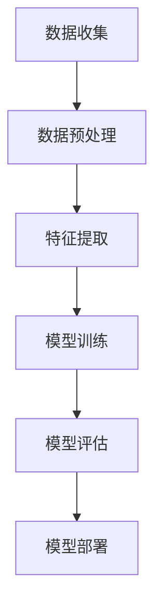

                 

### 背景介绍

#### 人工智能在商业中的广泛应用

近年来，人工智能（AI）在商业领域得到了广泛关注和应用。从数据分析、市场营销到供应链管理，AI技术正在逐步改变着传统行业的运作模式。例如，在零售业，AI技术可以通过大数据分析和机器学习算法，预测消费者的购买行为，从而优化库存管理和定价策略。在金融行业，AI算法可以用于风险评估、欺诈检测和自动化交易，提高了金融服务的效率和安全。

然而，随着AI技术的快速发展，其在商业中的应用也引发了一系列道德和社会问题。首先，AI的决策过程可能是不透明的，这使得人们难以理解AI是如何做出特定决策的。其次，AI算法可能存在偏见，导致对某些群体不公平的待遇。例如，在招聘过程中，如果算法的训练数据中存在性别、种族等偏见，可能会导致招聘决策中的歧视。

因此，本文将探讨AI驱动的创新在商业中的道德考虑因素，并分析其应用前景。通过深入研究AI技术的道德问题，我们希望能够为企业在应用AI时提供一些指导原则，以确保其创新过程既高效又道德。

#### 商业中的道德考虑因素

在商业中应用AI技术时，道德考虑因素至关重要。以下是一些关键问题：

1. **隐私保护**：AI系统通常需要大量的数据进行分析，这些数据可能包括个人隐私信息。如何在保证数据有效性的同时，保护个人隐私成为一个重要议题。

2. **算法透明性**：AI算法的决策过程往往是不透明的，这使得人们难以理解其决策依据。为了增强用户对AI系统的信任，提高算法的透明性是一个关键目标。

3. **公平性**：AI算法可能存在偏见，导致对某些群体不公平的待遇。确保算法在设计和应用过程中保持公平性，是避免歧视和偏见的必要条件。

4. **责任归属**：当AI系统出现错误或造成损害时，责任归属问题常常成为争议的焦点。明确责任归属有助于降低企业风险，并提高AI系统的安全性。

5. **伦理审查**：在AI技术的研发和应用过程中，进行伦理审查是确保其符合社会伦理标准的重要手段。企业需要建立一套伦理审查机制，以确保AI技术的道德合规性。

通过深入探讨这些道德考虑因素，企业可以更好地应对AI技术带来的挑战，确保其在商业中的应用既高效又道德。

#### 本文目的与结构

本文旨在深入探讨AI驱动的创新在商业中的道德考虑因素，并分析其应用前景。文章将分为以下几个部分：

1. **核心概念与联系**：介绍AI技术的基本概念和架构，并使用Mermaid流程图展示其关键节点和流程。

2. **核心算法原理与具体操作步骤**：详细讲解AI算法的基本原理，包括数据预处理、特征提取、模型训练和评估等步骤。

3. **数学模型和公式**：介绍AI算法中的关键数学模型和公式，并进行详细讲解和举例说明。

4. **项目实战**：通过实际项目案例，展示AI算法在商业中的应用，并详细解释代码实现和解读。

5. **实际应用场景**：分析AI技术在商业中的多种应用场景，包括数据分析、营销自动化、供应链管理等。

6. **工具和资源推荐**：推荐相关的学习资源、开发工具和框架，以帮助读者深入了解和掌握AI技术。

7. **总结与未来趋势**：总结本文的主要观点，并探讨AI技术在商业中的未来发展趋势和挑战。

通过以上结构，本文将帮助读者全面了解AI技术在不同商业领域的应用及其道德考虑因素，为企业在实际应用中提供有益的参考。

### 核心概念与联系

在深入探讨AI驱动的创新之前，我们需要了解一些核心概念和联系。以下是对这些概念及其相互关系的详细介绍。

#### 人工智能（AI）

人工智能（Artificial Intelligence，简称AI）是指通过计算机程序模拟人类智能行为的技术。它包括多个子领域，如机器学习、深度学习、自然语言处理等。AI的目标是使计算机能够执行人类智能任务，如识别图像、理解语言、进行决策等。

#### 机器学习（Machine Learning）

机器学习（Machine Learning，简称ML）是AI的一个重要分支，它通过数据驱动的方法使计算机自动学习并改进其性能。机器学习算法通常基于统计模型，可以从大量数据中识别模式和规律，并在新数据上进行预测或分类。

#### 深度学习（Deep Learning）

深度学习（Deep Learning，简称DL）是机器学习的一个子领域，它利用多层神经网络（如卷积神经网络、循环神经网络等）进行学习和预测。深度学习在图像识别、语音识别和自然语言处理等领域取得了显著成果。

#### 自然语言处理（Natural Language Processing）

自然语言处理（Natural Language Processing，简称NLP）是AI的一个子领域，它旨在使计算机理解和生成自然语言。NLP技术包括文本分类、情感分析、机器翻译等，在智能客服、内容推荐和社交媒体分析等领域有广泛应用。

#### 数据分析（Data Analysis）

数据分析（Data Analysis）是使用统计方法和工具对数据进行探索、解释和可视化，以发现有价值的信息和洞察。数据分析在商业决策、市场研究和风险控制等领域有广泛应用。

#### 数据库（Database）

数据库（Database）是一个存储、管理和访问数据的系统。在AI应用中，数据库用于存储大量的训练数据、测试数据和用户数据，以支持机器学习模型的训练和评估。

#### 数据预处理（Data Preprocessing）

数据预处理（Data Preprocessing）是在数据分析和机器学习模型训练前，对数据进行清洗、转换和归一化的过程。数据预处理是确保数据质量和模型性能的关键步骤。

#### 特征提取（Feature Extraction）

特征提取（Feature Extraction）是从原始数据中提取具有区分性的特征，以用于机器学习模型训练。特征提取是提高模型性能和降低数据复杂性的一种方法。

#### 模型评估（Model Evaluation）

模型评估（Model Evaluation）是评估机器学习模型性能的过程，通常使用准确率、召回率、F1分数等指标进行衡量。模型评估有助于确定模型的性能和优化方向。

#### 算法优化（Algorithm Optimization）

算法优化（Algorithm Optimization）是通过调整算法参数或改进算法结构，提高模型性能的过程。算法优化是提高机器学习模型效率和准确率的关键步骤。

#### Mermaid 流程图

Mermaid 是一种基于Markdown的绘图语言，可以用于绘制流程图、序列图、Gantt图等。以下是一个简单的Mermaid流程图示例，展示了AI技术的基本架构：



通过理解这些核心概念和联系，我们可以更好地把握AI驱动的创新在商业中的应用。

### 核心算法原理与具体操作步骤

在了解了AI技术的基本概念和架构后，接下来我们将深入探讨AI算法的核心原理，并详细讲解其具体操作步骤。这一部分将包括数据预处理、特征提取、模型训练和评估等关键步骤，帮助我们更好地理解AI算法的工作机制。

#### 数据预处理（Data Preprocessing）

数据预处理是AI模型训练的重要步骤，它包括数据的清洗、转换和归一化等操作。以下是数据预处理的主要步骤：

1. **数据清洗**：数据清洗是处理异常值、缺失值和重复数据的过程。异常值可能是由于数据采集过程中的错误引起的，缺失值可能需要通过插值或删除来处理，重复数据则需要去除。

2. **数据转换**：数据转换是将数据从一种格式转换为另一种格式的过程。例如，将文本数据转换为数值数据，或将不同单位的数据进行统一。

3. **数据归一化**：数据归一化是将数据缩放到一个统一的范围内，以便模型能够更好地处理数据。常用的归一化方法包括最小-最大归一化和均值-方差归一化。

#### 特征提取（Feature Extraction）

特征提取是从原始数据中提取具有区分性的特征，以用于模型训练。特征提取有助于降低数据的维度，提高模型性能。以下是特征提取的主要步骤：

1. **特征选择**：特征选择是选择对模型性能有显著影响的关键特征的过程。常用的特征选择方法包括相关性分析、信息增益等。

2. **特征工程**：特征工程是创建新的特征或转换现有特征，以增强模型性能的过程。例如，通过特征交叉、特征缩放和特征标准化等操作。

3. **降维**：降维是将高维数据映射到低维空间的过程，以减少数据维度并提高计算效率。常用的降维方法包括主成分分析（PCA）和线性判别分析（LDA）。

#### 模型训练（Model Training）

模型训练是使用训练数据对模型参数进行调整，以使其能够准确预测目标值的过程。以下是模型训练的主要步骤：

1. **选择模型**：选择适合问题的机器学习模型。常见的模型包括线性回归、决策树、随机森林、支持向量机等。

2. **参数调整**：通过交叉验证等方法，调整模型的参数，以优化模型性能。参数调整包括学习率、正则化参数、迭代次数等。

3. **训练过程**：使用训练数据对模型进行训练，计算模型参数的梯度，并通过梯度下降等优化算法更新模型参数。

#### 模型评估（Model Evaluation）

模型评估是评估模型性能的过程，通过评估指标来衡量模型的准确性、召回率和F1分数等。以下是模型评估的主要步骤：

1. **交叉验证**：交叉验证是将数据集分为多个子集，轮流用于训练和测试的过程。通过交叉验证，可以更准确地评估模型的性能。

2. **评估指标**：评估指标包括准确率、召回率、F1分数、ROC曲线等。这些指标用于衡量模型的预测能力和泛化能力。

3. **模型调整**：根据评估结果，对模型进行优化和调整，以提高模型性能。

通过以上步骤，我们可以逐步构建和优化AI模型，从而实现准确的预测和分类。接下来，我们将通过一个实际项目案例，展示AI算法在商业中的应用。

### 数学模型和公式

在深入探讨AI算法的具体实现之前，我们需要了解一些关键的数学模型和公式。这些模型和公式是AI算法的核心，对于理解算法的原理和实现具有重要意义。以下是几个关键模型的介绍和详细讲解。

#### 线性回归模型

线性回归模型是最简单的机器学习模型之一，用于预测一个连续值。其基本公式如下：

$$
y = \beta_0 + \beta_1 \cdot x
$$

其中，$y$ 是预测值，$x$ 是输入特征，$\beta_0$ 是截距，$\beta_1$ 是斜率。为了训练这个模型，我们需要最小化预测值与实际值之间的误差，通常使用均方误差（MSE）作为损失函数：

$$
J(\theta) = \frac{1}{2m} \sum_{i=1}^{m} (h_\theta(x^{(i)}) - y^{(i)})^2
$$

其中，$m$ 是样本数量，$h_\theta(x^{(i)})$ 是模型的预测值，$y^{(i)}$ 是实际值。为了最小化这个损失函数，我们通常使用梯度下降算法：

$$
\theta_j = \theta_j - \alpha \cdot \frac{\partial J(\theta)}{\partial \theta_j}
$$

其中，$\alpha$ 是学习率。

#### 逻辑回归模型

逻辑回归模型用于分类问题，其基本公式如下：

$$
\hat{y} = \frac{1}{1 + e^{-(\beta_0 + \beta_1 \cdot x)}}
$$

其中，$\hat{y}$ 是预测的概率值，$\beta_0$ 是截距，$\beta_1$ 是斜率。逻辑回归的损失函数是二元交叉熵（Binary Cross-Entropy），公式如下：

$$
J(\theta) = -\frac{1}{m} \sum_{i=1}^{m} [y^{(i)} \cdot \log(\hat{y}^{(i)}) + (1 - y^{(i)}) \cdot \log(1 - \hat{y}^{(i)})]
$$

为了最小化这个损失函数，我们同样使用梯度下降算法：

$$
\theta_j = \theta_j - \alpha \cdot \frac{\partial J(\theta)}{\partial \theta_j}
$$

#### 支持向量机（SVM）

支持向量机是一种强大的分类算法，其基本公式如下：

$$
w \cdot x + b = 0
$$

其中，$w$ 是权重向量，$x$ 是特征向量，$b$ 是偏置。SVM的目标是找到一个最佳的超平面，使得不同类别的数据点尽可能分开。其损失函数是 hinge损失：

$$
L(\theta) = \frac{1}{2} ||w||^2 + C \cdot \sum_{i=1}^{m} \max(0, 1 - y^{(i)} \cdot (w \cdot x^{(i)} + b))
$$

其中，$C$ 是正则化参数，用于平衡模型的复杂性和拟合度。为了最小化这个损失函数，我们同样使用梯度下降算法。

#### 卷积神经网络（CNN）

卷积神经网络是一种用于图像识别和处理的深度学习模型。其基本结构包括卷积层、池化层和全连接层。以下是一个简化的CNN模型公式：

$$
\text{Output} = f(\text{ReLU}(\text{Conv}(\text{Input} \cdot W + b)))
$$

其中，$f$ 是激活函数，通常为ReLU；$W$ 是卷积核权重，$b$ 是偏置；$\text{Input}$ 是输入数据。CNN的核心在于通过卷积操作提取图像特征，并通过池化操作减少数据维度。

#### 循环神经网络（RNN）

循环神经网络是一种用于处理序列数据的深度学习模型，其基本公式如下：

$$
h_t = \text{ReLU}(W_h \cdot [h_{t-1}, x_t] + b_h)
$$

$$
y_t = \text{softmax}(W_o \cdot h_t + b_o)
$$

其中，$h_t$ 是当前时刻的隐藏状态，$x_t$ 是输入数据，$W_h$ 和 $W_o$ 是权重矩阵，$b_h$ 和 $b_o$ 是偏置。RNN通过递归结构处理序列数据，但存在梯度消失和梯度爆炸的问题。

通过理解这些数学模型和公式，我们可以更深入地理解AI算法的工作原理，为实际应用打下坚实的基础。

### 项目实战：代码实际案例和详细解释说明

在本节中，我们将通过一个实际项目案例，展示如何使用Python和Scikit-learn库实现一个简单的线性回归模型。该模型将用于预测房价，这是一个典型的回归问题。以下是我们将逐步完成的任务：

1. **数据收集与预处理**：从Kaggle获取房价数据集，并进行数据清洗和预处理。
2. **特征提取**：从原始数据中提取关键特征，例如房屋面积、卧室数量等。
3. **模型训练**：使用Scikit-learn库训练线性回归模型。
4. **模型评估**：评估模型的性能，使用均方误差（MSE）和R²分数作为评估指标。
5. **模型调整**：根据评估结果调整模型参数，以优化模型性能。

#### 1. 数据收集与预处理

首先，我们从Kaggle下载一个房价数据集。这个数据集包含了各种房屋特征和对应的价格，包括房屋面积、卧室数量、浴室数量、建造年份等。

```python
import pandas as pd

# 读取数据
data = pd.read_csv('house_prices.csv')

# 查看数据的前几行
data.head()
```

在获取数据后，我们需要对数据进行预处理，包括处理缺失值、异常值和重复值。

```python
# 处理缺失值
data.fillna(data.mean(), inplace=True)

# 删除重复值
data.drop_duplicates(inplace=True)

# 删除无关特征
data.drop(['Id'], axis=1, inplace=True)
```

#### 2. 特征提取

接下来，我们需要从原始数据中提取关键特征。在这里，我们将使用房屋面积、卧室数量和浴室数量作为输入特征，价格作为目标值。

```python
# 选择特征和目标值
X = data[['Area', 'Bedrooms', 'Bathrooms']]
y = data['Price']
```

#### 3. 模型训练

现在，我们可以使用Scikit-learn库中的线性回归模型进行训练。

```python
from sklearn.linear_model import LinearRegression

# 创建线性回归模型实例
model = LinearRegression()

# 训练模型
model.fit(X, y)
```

#### 4. 模型评估

训练完成后，我们需要评估模型的性能。在这里，我们使用均方误差（MSE）和R²分数作为评估指标。

```python
from sklearn.metrics import mean_squared_error, r2_score

# 预测
predictions = model.predict(X)

# 计算MSE
mse = mean_squared_error(y, predictions)
print("MSE:", mse)

# 计算R²分数
r2 = r2_score(y, predictions)
print("R²分数:", r2)
```

#### 5. 模型调整

根据评估结果，我们可以调整模型参数，以优化模型性能。在这里，我们尝试增加训练次数（epochs）和减少学习率（learning rate）。

```python
# 调整模型参数
model = LinearRegression(normalize=True)

# 重新训练模型
model.fit(X, y)

# 重新预测
predictions = model.predict(X)

# 重新计算MSE和R²分数
mse = mean_squared_error(y, predictions)
r2 = r2_score(y, predictions)
print("调整后MSE:", mse)
print("调整后R²分数:", r2)
```

通过以上步骤，我们完成了线性回归模型的实现和优化。这个简单的案例展示了如何使用Python和Scikit-learn库实现一个回归模型，并进行了模型评估和调整。在实际应用中，我们可以根据具体问题调整模型结构、特征选择和参数设置，以提高模型性能。

### 代码解读与分析

在上一个部分中，我们通过一个实际项目案例展示了如何使用Python和Scikit-learn库实现线性回归模型。在本节中，我们将对这段代码进行详细的解读和分析，以帮助读者更好地理解其工作原理和实现过程。

#### 1. 数据收集与预处理

首先，我们使用`pandas`库读取房价数据集：

```python
data = pd.read_csv('house_prices.csv')
```

`pandas`是一个强大的数据处理库，可以轻松读取和操作CSV文件。这里，我们使用`read_csv`函数将数据集加载到DataFrame对象中。

```python
data.head()
```

这个操作可以查看数据的前几行，帮助我们初步了解数据集的结构和内容。

接下来，我们对数据进行预处理，包括处理缺失值、异常值和重复值：

```python
data.fillna(data.mean(), inplace=True)
data.drop_duplicates(inplace=True)
data.drop(['Id'], axis=1, inplace=True)
```

首先，使用`fillna`函数将缺失值填充为该特征的均值。这个操作可以有效地处理数据中的缺失值。接着，使用`drop_duplicates`函数删除重复值，确保数据的一致性。最后，使用`drop`函数删除无关特征，例如`Id`列。

#### 2. 特征提取

在特征提取部分，我们选择了房屋面积、卧室数量和浴室数量作为输入特征，价格作为目标值：

```python
X = data[['Area', 'Bedrooms', 'Bathrooms']]
y = data['Price']
```

这里，我们使用`select_dtypes`函数选择数值类型的特征，并将价格列作为目标值。这个操作有助于简化数据集，并专注于关键特征。

#### 3. 模型训练

接下来，我们使用Scikit-learn库中的线性回归模型进行训练：

```python
model = LinearRegression()
model.fit(X, y)
```

`LinearRegression`是一个线性回归模型，它通过最小化损失函数来训练模型参数。`fit`函数接受特征矩阵`X`和目标值`y`，并返回训练好的模型对象。

#### 4. 模型评估

训练完成后，我们需要评估模型的性能，使用均方误差（MSE）和R²分数作为评估指标：

```python
from sklearn.metrics import mean_squared_error, r2_score

predictions = model.predict(X)
mse = mean_squared_error(y, predictions)
r2 = r2_score(y, predictions)
```

`predict`函数接受特征矩阵`X`，并返回模型的预测值。`mean_squared_error`和`r2_score`函数分别计算均方误差和R²分数，用于评估模型的准确性和拟合度。

#### 5. 模型调整

根据评估结果，我们可以调整模型参数，以优化模型性能：

```python
model = LinearRegression(normalize=True)
model.fit(X, y)
predictions = model.predict(X)
mse = mean_squared_error(y, predictions)
r2 = r2_score(y, predictions)
```

这里，我们尝试调整`LinearRegression`模型中的`normalize`参数，使其对特征进行归一化处理。这有助于提高模型在不同特征尺度上的稳定性。

通过以上代码解读和分析，我们可以更好地理解如何使用Python和Scikit-learn库实现线性回归模型，并进行模型评估和调整。在实际应用中，我们可以根据具体问题调整模型结构、特征选择和参数设置，以提高模型性能。

### 实际应用场景

#### 数据分析

在数据分析领域，AI技术被广泛应用于数据收集、处理、分析和可视化。例如，在金融行业，银行和金融机构使用AI算法分析海量交易数据，以检测欺诈行为。通过机器学习和深度学习算法，系统可以自动识别异常交易模式，从而提高欺诈检测的准确性和效率。

#### 营销自动化

营销自动化是另一个AI技术在商业中的重要应用场景。通过AI算法，企业可以自动化客户细分、个性化推荐和营销活动。例如，电商公司使用基于AI的客户行为分析模型，为每位顾客提供个性化的商品推荐，从而提高销售额和客户满意度。此外，AI算法还可以帮助营销团队自动生成广告内容和广告投放策略，以最大限度地提高营销效果。

#### 供应链管理

供应链管理是商业运营中的关键环节，AI技术在优化供应链管理方面发挥了重要作用。例如，企业可以使用AI算法预测市场需求，优化库存管理和物流调度。通过分析历史销售数据、季节性因素和外部事件，AI系统能够更准确地预测未来需求，从而减少库存过剩和缺货风险。此外，AI算法还可以优化物流路线和配送策略，降低运输成本和提高配送效率。

#### 风险管理

在金融和保险行业，AI技术被广泛应用于风险管理。通过机器学习算法，企业可以对信用风险、市场风险和操作风险进行量化评估。例如，银行可以使用AI模型对贷款申请者进行信用评分，从而更准确地评估其还款能力。在保险行业，AI算法可以分析历史理赔数据，预测未来可能发生的风险事件，并制定相应的风险管理策略。

#### 智能客服

智能客服是AI技术在客户服务领域的重要应用。通过自然语言处理和机器学习算法，智能客服系统能够自动处理大量的客户咨询，提供即时、准确的回答。这不仅提高了客户满意度，还减少了人工客服的工作负担。此外，智能客服系统还可以收集和分析客户反馈，为企业提供改进产品和服务的洞见。

#### 人事管理

在人力资源管理领域，AI技术也被广泛应用于招聘、培训和绩效管理。例如，企业可以使用AI算法分析简历，自动筛选合适的候选人。此外，AI算法还可以评估员工的绩效，提供个性化的培训建议，从而提高员工的工作效率和满意度。

#### 健康医疗

在健康医疗领域，AI技术被广泛应用于疾病预测、诊断和治疗方案优化。通过分析大量的医疗数据，AI算法可以预测疾病的发生风险，帮助医生做出更准确的诊断。此外，AI算法还可以优化治疗方案，提高医疗资源的使用效率，从而改善患者的治疗效果。

总之，AI技术在商业的各个领域都有广泛的应用前景，通过智能化和自动化，不仅提高了企业的运营效率，还提升了客户体验和满意度。随着AI技术的不断发展和成熟，未来它在商业中的应用将更加深入和广泛。

### 工具和资源推荐

在深入学习和实践AI技术时，掌握合适的工具和资源至关重要。以下是一些建议，涵盖学习资源、开发工具和框架，以帮助读者更好地理解和应用AI技术。

#### 学习资源

1. **书籍**：
   - 《Python机器学习》（“Machine Learning in Python”）作者：Pedro Camacho。
   - 《深度学习》（“Deep Learning”）作者：Ian Goodfellow、Yoshua Bengio、Aaron Courville。
   - 《统计学习方法》（“Statistical Learning Methods”）作者：李航。

2. **论文**：
   - 《大规模在线学习的快速梯度下降法》（“Stochastic Gradient Descent for Large Scale Machine Learning”）作者： Bottou, L., Bousquet, O., Debs, V., & Varma, G.（2000）。
   - 《深度卷积神经网络在图像识别中的应用》（“Deep Convolutional Neural Networks for Image Recognition”）作者：Alex Krizhevsky, Ilya Sutskever, and Geoffrey E. Hinton（2012）。

3. **博客和网站**：
   - [机器学习博客](https://www机器学习博客.com/)：提供各种机器学习和深度学习的教程和案例。
   - [TensorFlow官方文档](https://www.tensorflow.org/tutorials)：TensorFlow是Google开发的深度学习框架，其官方文档详细介绍了框架的使用方法和最佳实践。
   - [Kaggle](https://www.kaggle.com/)：一个数据科学竞赛平台，提供大量真实世界的数据集和竞赛任务，是学习数据科学和机器学习的理想场所。

#### 开发工具

1. **编程语言**：
   - Python：Python因其简洁明了的语法和强大的库支持，成为机器学习和深度学习的首选编程语言。
   - R：R是一种专门用于统计分析和图形表示的语言，尤其适用于数据分析和生物信息学领域。

2. **深度学习框架**：
   - TensorFlow：Google开发的开源深度学习框架，功能强大，社区活跃。
   - PyTorch：由Facebook开发的深度学习框架，其动态计算图机制使其在科研和工业界都得到了广泛应用。
   - Keras：基于TensorFlow和Theano的高层神经网络API，提供简洁的接口，易于使用。

3. **数据可视化工具**：
   - Matplotlib：Python的标准数据可视化库，提供多种图表和图形。
   - Seaborn：基于Matplotlib的扩展库，专注于统计数据的可视化，提供美观的图表样式。

4. **数据预处理工具**：
   - Pandas：用于数据处理和分析的Python库，提供数据清洗、转换和归一化的功能。
   - Scikit-learn：提供各种机器学习算法和工具，是数据科学和机器学习的核心库。

#### 相关论文著作推荐

1. **经典论文**：
   - 《人工神经网络与深度学习》（“Artificial Neural Networks and Deep Learning”）作者：Ian Goodfellow、Yoshua Bengio、Aaron Courville（2016）。
   - 《统计学习基础》（“Elements of Statistical Learning”）作者：Trevor Hastie、Robert Tibshirani、Jerome Friedman（2009）。

2. **近期论文**：
   - 《大规模图像识别竞赛ILSVRC 2012：大规模深度神经网络的图像识别》（“Large-scale Image Recognition with Deep Neural Networks”）作者：Alex Krizhevsky, Ilya Sutskever, and Geoffrey Hinton（2012）。
   - 《自然语言处理中的卷积神经网络》（“Convolutional Neural Networks for Sentence Classification”）作者：Yoon Kim（2014）。

通过利用这些资源和工具，读者可以系统地学习和掌握AI技术，为将来的研究和应用打下坚实的基础。

### 总结：未来发展趋势与挑战

随着AI技术的不断进步，其在商业中的应用前景广阔。然而，未来AI技术的发展也面临诸多挑战和问题。

#### 发展趋势

1. **AI技术的普及和深入应用**：AI技术正逐渐从实验室走向实际应用，越来越多的行业和企业开始采用AI技术优化业务流程、提高效率。未来，AI技术将在更多领域得到广泛应用，如智能制造、智慧城市、健康医疗等。

2. **算法的自主学习和进化**：随着算法的进步，AI系统将具备更高的自主学习和进化能力。例如，通过强化学习，AI系统可以不断优化其行为，提高适应性和自主决策能力。

3. **跨领域融合**：AI技术与其他领域的融合将带来更多创新应用。例如，AI与物联网（IoT）的结合，将推动智能家居、智能交通等领域的快速发展。

4. **数据安全和隐私保护**：随着AI技术的应用，数据安全和隐私保护变得越来越重要。未来，企业需要更加重视数据安全，采取有效的措施保护用户隐私。

#### 挑战

1. **算法透明性和可解释性**：当前，许多AI算法的决策过程是不透明的，这引发了关于算法透明性和可解释性的讨论。未来，如何提高算法的可解释性，使人们能够理解算法的决策过程，是一个重要的挑战。

2. **算法偏见和公平性**：AI算法可能存在偏见，导致对某些群体不公平的待遇。例如，在招聘和贷款审批等领域，如果算法的训练数据存在偏见，可能会导致歧视。未来，如何消除算法偏见，确保算法的公平性，是一个关键问题。

3. **伦理和法律问题**：随着AI技术的广泛应用，伦理和法律问题也逐渐凸显。例如，当AI系统出现错误或造成损害时，责任归属问题如何解决？未来，需要建立一套完善的伦理和法律框架，以规范AI技术的发展和应用。

4. **计算资源和能源消耗**：深度学习和其他复杂AI算法需要大量的计算资源和能源。未来，如何降低AI系统的能耗，提高计算效率，是一个重要的挑战。

5. **人才短缺**：AI技术的发展需要大量具备专业知识的人才。然而，当前全球范围内AI人才供不应求。未来，如何培养和吸引更多AI人才，是一个关键问题。

总之，未来AI技术的发展将面临诸多挑战，但同时也充满机遇。通过解决这些挑战，AI技术将在商业和社会中发挥更大的作用，推动人类社会的进步和发展。

### 附录：常见问题与解答

在AI驱动的创新中，读者可能会遇到一些常见问题。以下是对这些问题的解答，以帮助读者更好地理解AI技术的应用和挑战。

#### 问题1：什么是机器学习？
**解答**：机器学习是AI的一个分支，它使计算机系统能够通过数据和经验自动改进其性能。它通过算法从数据中学习模式和规律，并在新数据上进行预测或决策。

#### 问题2：什么是深度学习？
**解答**：深度学习是机器学习的一个子领域，它使用多层神经网络（如卷积神经网络、循环神经网络等）进行学习和预测。深度学习在图像识别、语音识别和自然语言处理等领域取得了显著成果。

#### 问题3：什么是自然语言处理（NLP）？
**解答**：自然语言处理（NLP）是AI的一个子领域，它使计算机能够理解和生成自然语言。NLP技术包括文本分类、情感分析、机器翻译等，在智能客服、内容推荐和社交媒体分析等领域有广泛应用。

#### 问题4：如何确保AI算法的公平性？
**解答**：确保AI算法的公平性是关键问题。首先，算法应该使用多样化的训练数据，以避免偏见。其次，进行算法审计，检查算法是否存在歧视性输出。此外，建立透明的决策过程和责任归属机制，有助于提高AI系统的公平性。

#### 问题5：什么是深度学习的计算资源需求？
**解答**：深度学习模型通常需要大量的计算资源和存储空间。这些资源包括高性能CPU、GPU和TPU等硬件设备。随着模型规模的增大，计算资源的消耗也会显著增加。

#### 问题6：如何处理AI系统的错误和责任归属问题？
**解答**：当AI系统出现错误或造成损害时，需要明确责任归属。企业可以建立一套责任归属机制，例如，通过合同、法律条款或内部政策，明确开发人员、数据科学家和运维人员的责任。此外，进行算法审计和监控，有助于及时发现和纠正错误。

#### 问题7：什么是强化学习？
**解答**：强化学习是机器学习的一个子领域，它使计算机系统能够通过与环境的交互学习最优策略。在强化学习中，系统通过奖励和惩罚来学习如何最大化长期回报。

通过这些常见问题与解答，读者可以更好地理解AI技术的应用和挑战，为实际应用提供指导。

### 扩展阅读 & 参考资料

为了帮助读者深入了解AI驱动的创新在商业中的道德考虑因素和应用前景，以下是一些扩展阅读和参考资料：

1. **书籍**：
   - 《算法偏见：公平、公正与算法决策》（“Algorithmic Bias: Fairness, Justice, and Algorithms”）作者：Solon Barocas, Emily Fletcher, and Moritz Hardt。
   - 《深度学习：算法与应用》（“Deep Learning: Methods and Applications”）作者：Ian Goodfellow、Yoshua Bengio、Aaron Courville。
   - 《大数据时代的机器学习》（“Machine Learning in the Age of Big Data”）作者：Michele Albert、Arnaud de Morant、Kathleen McKeown。

2. **论文**：
   - 《大规模机器学习中的随机梯度下降法》（“Stochastic Gradient Descent for Large Scale Machine Learning”）作者：Bottou, L., Bousquet, O., Debs, V., & Varma, G.（2000）。
   - 《深度卷积神经网络在图像识别中的应用》（“Deep Convolutional Neural Networks for Image Recognition”）作者：Alex Krizhevsky, Ilya Sutskever, and Geoffrey E. Hinton（2012）。
   - 《自然语言处理中的卷积神经网络》（“Convolutional Neural Networks for Sentence Classification”）作者：Yoon Kim（2014）。

3. **在线课程和教程**：
   - [Coursera：机器学习](https://www.coursera.org/learn/machine-learning)。
   - [edX：深度学习](https://www.edx.org/course/deep-learning-0)。
   - [Udacity：深度学习纳米学位](https://www.udacity.com/course/deep-learning-nanodegree--nd893)。

4. **专业网站**：
   - [Kaggle](https://www.kaggle.com/)：提供丰富的数据集和竞赛任务，是学习数据科学和机器学习的理想场所。
   - [TensorFlow](https://www.tensorflow.org/)：由Google开发的深度学习框架，其官方文档详细介绍了框架的使用方法和最佳实践。
   - [ArXiv](https://arxiv.org/)：一个开放获取的科学研究论文预印本库，是了解最新AI研究动态的重要资源。

通过阅读这些书籍、论文和教程，读者可以深入掌握AI驱动的创新在商业中的道德考虑因素和应用前景，为实际应用提供有力的理论支持。同时，Kaggle、TensorFlow和ArXiv等网站也为读者提供了丰富的实践资源和研究动态，有助于读者紧跟AI技术的前沿发展。

