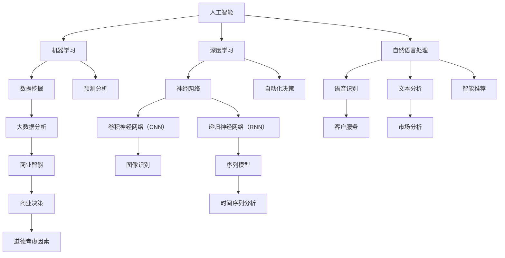

                 

### 背景介绍

#### 人工智能与商业：变革与创新

人工智能（AI）作为当前技术领域的热点话题，已经深刻地影响了各行各业。在商业领域，人工智能的应用不仅带来了生产效率的提升，还在决策制定、客户服务、风险控制等方面产生了深远影响。AI驱动的创新，成为了推动企业发展的新动力。

近年来，随着计算能力的提升和大数据技术的发展，AI算法的准确性和实用性得到了显著提高。从最初的机器学习到深度学习，再到如今的强化学习，人工智能在技术层面不断突破，为商业应用提供了更加丰富的工具和解决方案。

#### 道德考虑因素：AI在商业中的伦理挑战

然而，人工智能的快速发展也带来了诸多伦理和社会问题。在商业应用中，道德考虑因素变得尤为重要。例如，AI算法的决策过程是否公平、透明？数据隐私如何保障？自动化带来的就业问题如何解决？这些问题成为了学术界和产业界关注的焦点。

道德考虑因素不仅关系到企业的社会责任，还直接影响到用户体验和社会信任。因此，如何在商业应用中平衡技术创新与伦理道德，成为了一个亟待解决的重要课题。

#### 应用趋势：AI在商业中的实践探索

尽管面临伦理挑战，AI在商业领域的应用趋势依然明显。以下是一些AI在商业中的实践探索：

1. **智能客服：**通过自然语言处理和机器学习技术，智能客服能够提供24/7全天候的客户服务，提高客户满意度。
2. **供应链优化：**利用AI算法对海量数据进行分析和预测，帮助企业优化供应链管理，降低成本，提高效率。
3. **风险管理：**AI技术在风险评估和预测方面具有显著优势，可以帮助金融机构识别潜在风险，降低金融犯罪。
4. **人力资源：**通过AI技术进行人才招聘、绩效评估和员工培训，企业能够更加精准地管理人力资源。
5. **市场营销：**利用大数据分析和机器学习，企业可以更好地了解消费者行为，制定更加精准的营销策略。

这些实践探索不仅展示了AI在商业中的巨大潜力，也为后续讨论提供了实际案例。

综上所述，本文将从AI驱动的创新出发，探讨人类计算在商业中的道德考虑因素与应用趋势，以期为企业提供有价值的参考和指导。

### 核心概念与联系

在深入探讨AI驱动的创新及其道德考虑因素之前，我们需要明确几个核心概念，并探讨它们之间的联系。以下将使用Mermaid流程图（Mermaid 流程节点中不要有括号、逗号等特殊字符）来展示这些概念及其关系。



#### 核心概念解释

1. **人工智能（AI）：**人工智能是指计算机系统模拟人类智能行为的科学和技术。它包括多个子领域，如机器学习、深度学习和自然语言处理等。
2. **机器学习（Machine Learning）：**机器学习是AI的一个重要分支，通过数据和算法使计算机系统能够自动学习和改进。
3. **深度学习（Deep Learning）：**深度学习是机器学习的一个子领域，主要利用多层神经网络进行特征学习和模式识别。
4. **自然语言处理（Natural Language Processing，NLP）：**NLP是AI的一个子领域，旨在让计算机理解和生成自然语言。
5. **数据挖掘（Data Mining）：**数据挖掘是指从大量数据中提取有价值的信息和知识的过程。
6. **大数据分析（Big Data Analysis）：**大数据分析涉及使用各种算法和技术来分析海量数据，以发现趋势和模式。
7. **商业智能（Business Intelligence，BI）：**商业智能是通过分析企业数据来支持决策制定的过程。
8. **道德考虑因素（Ethical Considerations）：**道德考虑因素涉及在技术应用过程中如何处理伦理和社会问题。

#### 关系与联系

- **人工智能与机器学习、深度学习：**人工智能是机器学习和深度学习的基础，而机器学习和深度学习是人工智能的重要组成部分。
- **自然语言处理与语音识别、文本分析：**自然语言处理包括语音识别和文本分析，这两者分别处理语音和文本数据。
- **数据挖掘与大数据分析、商业智能：**数据挖掘和大数据分析是商业智能的重要组成部分，它们共同帮助企业从数据中提取有价值的信息。
- **道德考虑因素与商业决策：**在商业应用中，道德考虑因素直接影响到决策的制定和实施。
- **客户服务、市场分析、预测分析：**这些应用领域利用AI技术来提高效率和效果，同时需要考虑道德和社会影响。

通过上述流程图和概念解释，我们可以清晰地看到AI在商业中的应用及其核心概念之间的联系。这为我们后续探讨AI在商业中的道德考虑因素和应用趋势奠定了基础。

### 核心算法原理 & 具体操作步骤

在了解核心概念及其联系之后，接下来我们将深入探讨AI在商业应用中的核心算法原理及具体操作步骤。本文将重点介绍几种关键算法，包括机器学习、深度学习和自然语言处理（NLP），并详细解释它们的原理和操作步骤。

#### 1. 机器学习算法

机器学习算法是AI的核心组成部分，主要包括监督学习、无监督学习和强化学习。以下以监督学习为例，介绍其基本原理和操作步骤：

**原理：**
监督学习是一种通过已标记的数据训练模型，然后利用模型进行预测的方法。其基本原理是通过特征学习和模式识别，使得模型能够在新的未知数据上进行准确的预测。

**操作步骤：**
1. **数据收集与预处理：**收集相关数据，并进行清洗、归一化和特征提取。
2. **选择模型：**根据问题类型和数据特征，选择合适的模型，如线性回归、决策树、支持向量机等。
3. **训练模型：**使用标记数据对模型进行训练，调整模型参数。
4. **模型评估：**使用验证集或测试集评估模型性能，调整模型参数以优化性能。
5. **模型应用：**在新的未知数据上进行预测。

**示例：**假设我们要预测股票价格，可以使用线性回归模型。首先，收集股票历史数据，提取特征（如开盘价、收盘价、成交量等），然后使用线性回归算法训练模型，最后利用模型对新数据进行预测。

#### 2. 深度学习算法

深度学习是机器学习的一个重要分支，主要基于多层神经网络进行特征学习和模式识别。以下以卷积神经网络（CNN）为例，介绍其原理和操作步骤：

**原理：**
CNN是一种在图像处理和计算机视觉中广泛应用的深度学习模型。其基本原理是通过卷积操作提取图像中的特征，并通过池化操作减少数据维度，从而提高模型的效率和准确性。

**操作步骤：**
1. **数据收集与预处理：**收集图像数据，并进行预处理，如归一化和数据增强。
2. **构建神经网络：**定义CNN的结构，包括卷积层、池化层和全连接层等。
3. **训练模型：**使用图像数据训练CNN模型，调整模型参数。
4. **模型评估：**使用验证集或测试集评估模型性能，调整模型参数以优化性能。
5. **模型应用：**在新的图像数据上进行预测。

**示例：**假设我们要进行图像分类，可以使用CNN模型。首先，收集大量的图像数据，然后使用CNN模型训练模型，最后利用模型对新的图像进行分类。

#### 3. 自然语言处理（NLP）算法

NLP是AI在语言领域的重要应用，包括文本分析、情感分析和机器翻译等。以下以词嵌入（Word Embedding）为例，介绍其原理和操作步骤：

**原理：**
词嵌入是一种将词语映射到高维空间中，使得语义相似的词语在空间中距离较近的方法。其基本原理是通过神经网络模型，如Word2Vec、GloVe等，学习词语的向量表示。

**操作步骤：**
1. **数据收集与预处理：**收集文本数据，并进行预处理，如分词、去停用词等。
2. **构建模型：**定义词嵌入模型，如Word2Vec、GloVe等。
3. **训练模型：**使用文本数据训练词嵌入模型，调整模型参数。
4. **模型评估：**使用验证集或测试集评估模型性能，调整模型参数以优化性能。
5. **模型应用：**在新的文本数据上进行语义分析、情感分析等。

**示例：**假设我们要进行文本情感分析，可以使用Word2Vec模型。首先，收集大量的文本数据，然后使用Word2Vec模型训练模型，最后利用模型对新的文本进行情感分类。

通过上述核心算法的介绍和具体操作步骤，我们可以更好地理解AI在商业应用中的技术原理和实现方法。这些算法不仅为商业提供了强大的工具，也带来了新的挑战，需要我们进一步探索和解决。

### 数学模型和公式 & 详细讲解 & 举例说明

在理解了AI的核心算法原理后，接下来我们将深入探讨这些算法背后的数学模型和公式，并进行详细讲解与举例说明。本文将重点介绍机器学习、深度学习和自然语言处理（NLP）中的关键数学模型，以帮助读者更好地理解AI技术。

#### 1. 机器学习中的关键数学模型

**线性回归模型**

**原理：**
线性回归模型是一种简单的监督学习算法，用于预测连续值。其基本公式为：
\[ y = \beta_0 + \beta_1x + \epsilon \]
其中，\( y \) 是预测值，\( x \) 是输入特征，\( \beta_0 \) 和 \( \beta_1 \) 是模型的参数，\( \epsilon \) 是误差项。

**详细讲解：**
线性回归模型通过最小二乘法（Least Squares Method）来估计参数 \( \beta_0 \) 和 \( \beta_1 \)。具体步骤如下：
1. **数据预处理：**收集并预处理数据，包括归一化和特征提取。
2. **参数初始化：**随机初始化参数 \( \beta_0 \) 和 \( \beta_1 \)。
3. **损失函数计算：**计算预测值与实际值之间的误差，使用均方误差（Mean Squared Error，MSE）作为损失函数：
\[ J(\beta_0, \beta_1) = \frac{1}{2m} \sum_{i=1}^{m} (y_i - (\beta_0 + \beta_1x_i))^2 \]
4. **梯度下降：**通过梯度下降（Gradient Descent）更新参数，最小化损失函数：
\[ \beta_0 = \beta_0 - \alpha \frac{\partial J}{\partial \beta_0} \]
\[ \beta_1 = \beta_1 - \alpha \frac{\partial J}{\partial \beta_1} \]
其中，\( \alpha \) 是学习率。

**举例说明：**
假设我们要预测房价，已知数据集包含房屋面积和房价。首先，收集并预处理数据，然后使用线性回归模型进行训练，最后利用模型对新数据进行预测。例如，对于一个新的房屋面积 \( x \)，预测房价为：
\[ y = \beta_0 + \beta_1x \]

**支持向量机（SVM）模型**

**原理：**
支持向量机是一种强大的分类算法，其核心思想是找到最佳的超平面，使得分类边界最大化。

**详细讲解：**
SVM模型的基本公式为：
\[ w \cdot x - b = 0 \]
其中，\( w \) 是超平面的法向量，\( x \) 是特征向量，\( b \) 是偏置项。

SVM通过求解以下优化问题来确定最佳超平面：
\[ \min_{w, b} \frac{1}{2} ||w||^2 \]
同时满足：
\[ y_i (w \cdot x_i - b) \geq 1 \]
其中，\( y_i \) 是第 \( i \) 个样本的标签。

通过求解上述优化问题，我们可以得到最优的 \( w \) 和 \( b \)，从而确定分类边界。

**举例说明：**
假设我们要分类两类手写数字图像。首先，收集并预处理图像数据，然后使用SVM模型进行训练。训练完成后，对于一个新的手写数字图像，我们可以通过计算其特征向量与超平面的内积来判断其类别。

#### 2. 深度学习中的关键数学模型

**卷积神经网络（CNN）模型**

**原理：**
卷积神经网络是一种专门用于图像处理的深度学习模型，其核心思想是通过卷积操作提取图像特征。

**详细讲解：**
CNN的基本架构包括卷积层、池化层和全连接层。其数学模型可以表示为：
\[ \text{Output}(i, j) = \sum_{k, l} \text{Weight}(k, l) \times \text{Input}(i - k, j - l) + \text{Bias} \]
其中，\( \text{Output}(i, j) \) 是输出特征图上的元素，\( \text{Input}(i, j) \) 是输入图像上的元素，\( \text{Weight}(k, l) \) 是卷积核，\( \text{Bias} \) 是偏置项。

通过多个卷积层和池化层的堆叠，CNN可以逐步提取图像的层次特征。

**举例说明：**
假设我们要进行图像分类，可以使用CNN模型。首先，收集并预处理图像数据，然后定义CNN的结构，包括卷积层和全连接层。训练完成后，对于一个新的图像，我们可以通过模型提取特征并分类。

**递归神经网络（RNN）模型**

**原理：**
递归神经网络是一种专门用于序列数据处理的学习模型，其核心思想是通过循环连接来处理历史信息。

**详细讲解：**
RNN的基本公式为：
\[ h_t = \sigma(W_h \cdot [h_{t-1}, x_t] + b_h) \]
\[ y_t = \sigma(W_y \cdot h_t + b_y) \]
其中，\( h_t \) 是第 \( t \) 个时刻的隐藏状态，\( x_t \) 是输入特征，\( \sigma \) 是激活函数，\( W_h \) 和 \( W_y \) 是权重矩阵，\( b_h \) 和 \( b_y \) 是偏置项。

RNN通过反向传播算法来更新权重和偏置，从而优化模型。

**举例说明：**
假设我们要进行时间序列预测，可以使用RNN模型。首先，收集并预处理时间序列数据，然后定义RNN的结构。训练完成后，对于一个新的时间序列，我们可以通过模型进行预测。

#### 3. 自然语言处理（NLP）中的关键数学模型

**词嵌入模型**

**原理：**
词嵌入是一种将词语映射到高维空间的方法，使得语义相似的词语在空间中距离较近。

**详细讲解：**
词嵌入的基本公式为：
\[ \text{Embedding}(w) = \sum_{i=1}^{V} e_i \]
其中，\( w \) 是词语，\( V \) 是词汇表大小，\( e_i \) 是第 \( i \) 个词的嵌入向量。

常用的词嵌入模型包括Word2Vec和GloVe。Word2Vec模型通过训练神经网络来学习词语的嵌入向量，而GloVe模型则通过矩阵分解来学习词语的嵌入向量。

**举例说明：**
假设我们要进行文本情感分析，可以使用Word2Vec模型。首先，收集并预处理文本数据，然后使用Word2Vec模型训练词嵌入。训练完成后，对于一个新的句子，我们可以通过计算其嵌入向量的平均值来表示句子的语义。

通过上述数学模型和公式的详细讲解与举例说明，我们可以更好地理解AI在商业应用中的技术原理。这些模型不仅为AI算法提供了理论支持，也为实际应用提供了可行的解决方案。在接下来的章节中，我们将进一步探讨AI在商业中的实际应用场景和道德考虑因素。

### 项目实战：代码实际案例和详细解释说明

在前面的章节中，我们介绍了AI的核心算法原理和数学模型。为了更好地理解这些理论在实际中的应用，本节将通过一个具体的实战项目，展示如何使用Python和TensorFlow框架实现一个简单的图像分类器。我们将详细解释代码的每个部分，并分析其关键步骤。

#### 1. 开发环境搭建

在开始项目之前，我们需要搭建一个Python开发环境，并安装必要的库。以下是在Ubuntu 20.04系统中安装所需的库：

```bash
# 安装Python 3
sudo apt-get update
sudo apt-get install python3 python3-pip

# 安装TensorFlow
pip3 install tensorflow

# 安装其他辅助库
pip3 install numpy matplotlib
```

#### 2. 源代码详细实现和代码解读

**代码实现：**

```python
import tensorflow as tf
from tensorflow.keras import datasets, layers, models
import matplotlib.pyplot as plt

# 加载并预处理数据集
(train_images, train_labels), (test_images, test_labels) = datasets.cifar10.load_data()

# 归一化数据
train_images, test_images = train_images / 255.0, test_images / 255.0

# 查看数据集的形状
print(train_images.shape)

# 构建卷积神经网络模型
model = models.Sequential()
model.add(layers.Conv2D(32, (3, 3), activation='relu', input_shape=(32, 32, 3)))
model.add(layers.MaxPooling2D((2, 2)))
model.add(layers.Conv2D(64, (3, 3), activation='relu'))
model.add(layers.MaxPooling2D((2, 2)))
model.add(layers.Conv2D(64, (3, 3), activation='relu'))

# 添加全连接层
model.add(layers.Flatten())
model.add(layers.Dense(64, activation='relu'))
model.add(layers.Dense(10, activation='softmax'))

# 编译模型
model.compile(optimizer='adam',
              loss='sparse_categorical_crossentropy',
              metrics=['accuracy'])

# 训练模型
model.fit(train_images, train_labels, epochs=10, validation_split=0.1)

# 评估模型
test_loss, test_acc = model.evaluate(test_images, test_labels)
print(f'Test accuracy: {test_acc:.4f}')

# 可视化模型结构
model.summary()

# 可视化训练过程
plt.plot(model.history.history['accuracy'], label='accuracy')
plt.plot(model.history.history['val_accuracy'], label='val_accuracy')
plt.xlabel('Epochs')
plt.ylabel('Accuracy')
plt.legend()
plt.show()
```

**代码解读：**

- **数据预处理：**使用CIFAR-10数据集，这是一个常见的图像分类数据集。我们首先将数据集加载到内存中，然后对图像数据进行归一化处理，以便模型更好地学习。
- **模型构建：**我们使用卷积神经网络（CNN）来构建模型。首先，添加一个卷积层（`Conv2D`），使用32个卷积核，每个卷积核的大小为3x3，激活函数为ReLU。接着，添加一个最大池化层（`MaxPooling2D`）。为了增加模型的复杂性和准确性，我们再添加一个卷积层和另一个最大池化层。最后，我们将卷积层输出通过展平层（`Flatten`）转化为一维向量，并添加两个全连接层（`Dense`），最后一个全连接层使用10个神经元和softmax激活函数，用于多分类。
- **模型编译：**我们使用Adam优化器和sparse categorical cross-entropy损失函数来编译模型，并指定accuracy作为评价指标。
- **模型训练：**使用训练数据集训练模型，并设置10个epochs。我们将10%的数据作为验证集，以便在训练过程中评估模型的性能。
- **模型评估：**使用测试数据集评估模型的准确性，并打印结果。
- **模型可视化：**我们使用matplotlib库将训练过程中accuracy的变化可视化。

#### 3. 代码解读与分析

- **数据预处理：**数据预处理是机器学习项目中的关键步骤。对于图像数据，我们通常需要进行归一化处理，将像素值缩放到[0, 1]范围内，以便模型能够更好地学习。
- **模型构建：**在构建模型时，我们使用了卷积神经网络（CNN），因为CNN在处理图像数据时表现出色。我们通过堆叠多个卷积层和池化层来提取图像的层次特征。全连接层用于分类。
- **模型编译：**编译模型时，我们选择Adam优化器，因为它在大多数任务中表现出色。使用sparse categorical cross-entropy损失函数是因为我们的目标是进行多分类。
- **模型训练：**通过训练，模型学会了识别图像中的不同类别。我们在训练过程中使用了验证集来监控模型的性能，并在需要时进行调整。
- **模型评估：**评估模型时，我们使用测试集来确保模型在未见过的数据上能够保持良好的性能。
- **模型可视化：**可视化训练过程可以帮助我们理解模型的性能变化，并优化训练策略。

通过这个项目实战，我们不仅实现了图像分类，还详细解释了代码的每个部分。这为我们进一步探索AI在商业中的实际应用提供了宝贵的经验和参考。

### 实际应用场景

在了解了AI的核心算法原理和实际项目实战后，接下来我们将探讨AI在商业中的实际应用场景。AI技术的广泛应用不仅改变了企业的运营方式，也带来了前所未有的机遇和挑战。

#### 1. 智能客服

智能客服是AI在商业中应用最为广泛的场景之一。通过自然语言处理（NLP）和机器学习技术，智能客服系统能够理解和回答客户的问题，提供24/7全天候的客户服务。以下是智能客服在商业中的实际应用：

- **提高客户满意度：**智能客服能够快速响应客户问题，减少客户的等待时间，提高客户满意度。
- **降低运营成本：**通过自动化处理常见问题，智能客服能够减少人力资源成本，提高运营效率。
- **数据收集与分析：**智能客服系统在处理客户问题的过程中，可以收集大量客户数据，为企业提供宝贵的洞察，用于改进产品和服务。

#### 2. 供应链优化

供应链优化是另一个AI在商业中的重要应用领域。通过机器学习算法和大数据分析，企业能够优化供应链管理，降低成本，提高效率。以下是供应链优化在商业中的实际应用：

- **需求预测：**利用机器学习算法，企业可以对市场需求进行准确预测，从而优化库存管理，减少库存成本。
- **物流优化：**通过分析运输数据，企业可以优化运输路线，减少运输时间和成本。
- **风险管理：**AI技术可以帮助企业识别供应链中的潜在风险，如供应链中断、供应链欺诈等，从而采取预防措施。

#### 3. 风险管理

在金融行业中，风险管理是至关重要的一环。AI技术在风险管理中的应用，使得金融机构能够更加精准地识别和管理风险。以下是AI在风险管理中的实际应用：

- **欺诈检测：**利用机器学习算法，AI能够识别和检测金融交易中的异常行为，从而有效防范欺诈行为。
- **信用评估：**通过分析借款人的历史数据和社交网络信息，AI可以帮助金融机构更准确地评估借款人的信用风险。
- **市场预测：**AI技术可以分析大量市场数据，预测市场趋势，为投资决策提供依据。

#### 4. 人力资源

人力资源是企业的核心资源。AI技术在人力资源中的应用，使得企业能够更加高效地管理人力资源。以下是AI在人力资源中的实际应用：

- **招聘：**利用自然语言处理（NLP）技术，AI可以帮助企业筛选和匹配求职者与职位，提高招聘效率。
- **绩效评估：**通过分析员工的工作数据和表现，AI可以为企业提供客观、准确的绩效评估，帮助管理者做出更科学的决策。
- **员工培训：**AI技术可以自动生成培训内容，根据员工的实际需求提供个性化的培训，提高培训效果。

#### 5. 市场营销

市场营销是企业实现增长的关键环节。AI技术在市场营销中的应用，使得企业能够更加精准地定位目标客户，制定有效的营销策略。以下是AI在市场营销中的实际应用：

- **客户分析：**通过分析客户行为数据，AI可以帮助企业了解客户需求，制定个性化的营销策略。
- **广告投放：**利用机器学习算法，AI可以优化广告投放策略，提高广告的点击率和转化率。
- **内容推荐：**通过分析用户兴趣和浏览行为，AI可以为企业提供内容推荐，提高用户粘性和留存率。

通过上述实际应用场景，我们可以看到AI在商业中具有广泛的应用前景。它不仅提高了企业的运营效率，还为企业带来了新的增长机会。然而，随着AI技术的不断发展，我们也需要关注其带来的伦理和社会问题，并寻求合理的解决方案。

### 工具和资源推荐

在探索AI驱动的创新过程中，选择合适的工具和资源是至关重要的。以下将推荐一些学习资源、开发工具和相关论文著作，以帮助读者深入了解AI技术及其在商业中的应用。

#### 1. 学习资源推荐

**书籍：**
1. **《Python机器学习》（Machine Learning with Python）** - 这一书籍提供了丰富的Python机器学习实践案例，适合初学者和有一定基础的读者。
2. **《深度学习》（Deep Learning）** - 由Ian Goodfellow、Yoshua Bengio和Aaron Courville合著，这是深度学习的经典教材，适合对深度学习有深入研究的读者。
3. **《自然语言处理实战》（Natural Language Processing with Python）** - 这本书详细介绍了NLP的基本概念和实践方法，适合对自然语言处理感兴趣的读者。

**在线课程：**
1. **Coursera上的《机器学习》（Machine Learning）** - 吴恩达（Andrew Ng）讲授的这门课程是机器学习的入门经典，适合初学者。
2. **Udacity的《深度学习工程师纳米学位》（Deep Learning Nanodegree）** - 这一纳米学位课程提供了从基础到高级的深度学习知识，适合有一定基础的读者。
3. **edX上的《自然语言处理与深度学习》（Natural Language Processing with Deep Learning）** - 由Google AI的 researcher Sammi Pfeifer讲授，适合对NLP有深入研究的读者。

#### 2. 开发工具框架推荐

**编程语言：**
1. **Python** - Python因其简洁易学的特性，成为机器学习和深度学习的首选编程语言。
2. **R** - R语言在统计分析方面有强大的功能，适合进行复杂数据分析和机器学习项目。

**框架和库：**
1. **TensorFlow** - TensorFlow是Google开发的开源机器学习和深度学习框架，适用于各种复杂场景。
2. **PyTorch** - PyTorch是Facebook开发的开源深度学习框架，以其动态计算图和灵活的API受到广泛使用。
3. **Scikit-learn** - Scikit-learn是一个简单易用的Python机器学习库，适用于快速原型开发和实验。
4. **NLTK** - NLTK是一个强大的自然语言处理库，提供了丰富的NLP工具和资源。

#### 3. 相关论文著作推荐

**论文：**
1. **“Deep Learning”** - 由Yoshua Bengio等人在2013年发表，详细介绍了深度学习的理论基础和技术发展。
2. **“The Unreasonable Effectiveness of Data”** - 由C.Manning等人在2014年发表，探讨了数据在机器学习中的重要性及其影响。
3. **“Natural Language Processing with Deep Learning”** - 由理查德·索莫斯（Richard Socher）等人在2018年发表，介绍了深度学习在NLP中的应用。

**著作：**
1. **《机器学习》（Machine Learning）** - 威廉·贺普菲尔德（William H.贺普菲尔德）和汤姆·米切尔（Tom M. Mitchell）合著，这是机器学习领域的经典教材。
2. **《深度学习》（Deep Learning）** - Ian Goodfellow、Yoshua Bengio和Aaron Courville合著，提供了深度学习的全面讲解。
3. **《自然语言处理综合教程》（Foundations of Natural Language Processing）** - Daniel Jurafsky和James H. Martin合著，是NLP领域的权威教材。

通过上述工具和资源的推荐，读者可以系统地学习AI技术，掌握核心概念和实现方法。这些资源不仅适用于学术研究，也为实际项目开发提供了宝贵的参考。

### 总结：未来发展趋势与挑战

随着人工智能（AI）技术的快速发展，其在商业领域的应用趋势也日益明显。未来，AI将继续在商业中发挥重要作用，推动企业创新和增长。以下是未来AI在商业中的一些发展趋势和挑战。

#### 发展趋势

1. **智能化应用普及：**AI技术将更加深入地应用于各个行业，从智能客服到供应链优化，再到风险管理，AI的应用将变得更加广泛和普及。

2. **边缘计算与云计算的结合：**边缘计算（Edge Computing）将与云计算（Cloud Computing）相结合，实现实时数据处理和智能分析，提高系统响应速度和效率。

3. **人机协同：**未来，人类与AI的协同工作将成为常态。通过AI技术，企业能够更好地理解客户需求，优化业务流程，提高生产效率。

4. **个性化服务：**AI技术将帮助企业提供更加个性化的服务，通过分析客户行为和偏好，制定更精准的营销策略，提升客户满意度。

5. **跨行业融合：**AI技术将在不同行业之间实现跨行业融合，推动产业升级和转型，例如，智能制造、智慧城市等领域。

#### 挑战

1. **伦理问题：**随着AI技术的广泛应用，伦理问题变得更加突出。如何确保AI算法的公平性、透明性和可解释性，是当前需要解决的重要问题。

2. **数据隐私：**在AI应用过程中，如何保障用户数据隐私，避免数据泄露，是企业和政府需要共同面对的挑战。

3. **技术人才短缺：**AI技术的快速发展导致了对高级技术人才的需求急剧增加。然而，现有的人才储备和能力建设还无法满足这一需求，人才短缺问题亟待解决。

4. **技术垄断：**大型科技公司在AI领域的技术垄断现象日益严重，如何打破垄断，实现技术共享和公平竞争，是一个重要的课题。

5. **法律与监管：**随着AI技术的不断演进，现有的法律和监管框架可能无法完全适应。如何制定和完善相关法律法规，确保AI技术的健康发展，是政府和企业需要共同关注的问题。

#### 未来展望

未来，AI将在商业中扮演更加重要的角色。通过不断创新和应用，AI将为企业带来更高的生产效率、更好的客户体验和更大的商业价值。同时，企业也需要关注AI技术带来的伦理、法律和社会问题，寻求合理的解决方案，确保技术的可持续发展。

总之，AI在商业中的应用前景广阔，但也面临着诸多挑战。只有通过技术创新和社会责任相结合，才能实现AI的良性发展，推动企业和社会的共同进步。

### 附录：常见问题与解答

在探讨AI驱动的创新过程中，读者可能对一些关键概念和技术细节有疑问。以下是一些常见问题及其解答，以帮助读者更好地理解AI技术及其在商业中的应用。

#### 问题1：什么是机器学习？

**解答：**机器学习是人工智能（AI）的一个重要分支，通过使用算法从数据中自动学习和改进。机器学习模型可以从训练数据中学习规律，并在新的数据上进行预测或分类。常见的机器学习算法包括线性回归、决策树、支持向量机和深度学习等。

#### 问题2：深度学习和机器学习的区别是什么？

**解答：**深度学习是机器学习的一个子领域，它使用多层神经网络（如卷积神经网络（CNN）和递归神经网络（RNN））进行特征学习和模式识别。深度学习通常需要大量数据和计算资源，而机器学习算法更加多样，包括监督学习、无监督学习和强化学习等，适用于不同的应用场景。

#### 问题3：什么是自然语言处理（NLP）？

**解答：**自然语言处理（NLP）是AI的一个分支，专注于使计算机理解和生成自然语言（如英语、中文等）。NLP技术包括文本分类、情感分析、机器翻译、语音识别等，广泛应用于智能客服、搜索引擎、信息抽取等领域。

#### 问题4：什么是词嵌入（Word Embedding）？

**解答：**词嵌入（Word Embedding）是将词语映射到高维空间中的向量表示，使得语义相似的词语在空间中距离较近。常见的词嵌入模型包括Word2Vec和GloVe，这些模型通过神经网络训练来学习词语的向量表示，用于文本分析、情感分析和机器翻译等应用。

#### 问题5：如何保障AI算法的公平性？

**解答：**保障AI算法的公平性是一个复杂的问题。以下是一些常见的方法：
- **数据清洗：**在训练数据集中去除偏见和错误信息，确保数据的质量和代表性。
- **算法透明性：**设计可解释的AI模型，使算法的决策过程能够被理解和审查。
- **公平性测试：**使用公平性测试工具和方法，评估AI算法在不同群体上的表现，确保没有系统性偏见。
- **多元化团队：**组建多元背景的团队，从不同角度考虑和评估算法的公平性。

#### 问题6：AI在商业中的实际应用有哪些？

**解答：**AI在商业中的实际应用非常广泛，包括：
- **智能客服：**提供24/7的客户服务，提高客户满意度。
- **供应链优化：**通过需求预测和物流优化，降低运营成本。
- **风险管理：**利用AI技术进行欺诈检测和信用评估，降低金融风险。
- **人力资源：**进行招聘、绩效评估和员工培训，优化人力资源管理。
- **市场营销：**通过客户分析和广告投放优化，提高营销效果。

通过上述问题的解答，读者可以更深入地了解AI技术及其在商业中的应用，为未来的学习和实践提供指导。

### 扩展阅读 & 参考资料

在探索AI驱动的创新和商业应用的过程中，以下参考资料将为读者提供更深入的学习和思考方向。

**1. 顶级学术论文：**
- Goodfellow, I., Bengio, Y., & Courville, A. (2016). "Deep Learning". MIT Press.
- Bengio, Y., Courville, A., & Vincent, P. (2013). "Representation Learning: A Review and New Perspectives". IEEE Transactions on Pattern Analysis and Machine Intelligence.
- Manning, C. D., Raghavan, P., & Schütze, H. (2008). "Foundations of Statistical Natural Language Processing". MIT Press.

**2. 权威书籍推荐：**
- Mitchell, T. M. (1997). "Machine Learning". McGraw-Hill.
- Jurafsky, D., & Martin, J. H. (2008). "Speech and Language Processing". Prentice Hall.
- Russell, S., & Norvig, P. (2010). "Artificial Intelligence: A Modern Approach". Prentice Hall.

**3. 优质在线课程：**
- 吴恩达（Andrew Ng）的《机器学习》（Coursera）: https://www.coursera.org/learn/machine-learning
- 《深度学习专项课程》（DeepLearning.AI）: https://www.deeplearning.ai/
- 《自然语言处理与深度学习》（edX）: https://www.edx.org/course/natural-language-processing-with-deep-learning

**4. 重要会议与期刊：**
- **会议：**NIPS（NeurIPS）、ICML（International Conference on Machine Learning）、ACL（Association for Computational Linguistics）。
- **期刊：**Journal of Machine Learning Research (JMLR)、IEEE Transactions on Pattern Analysis and Machine Intelligence (TPAMI)、ACM Transactions on Information Systems (TOIS)。

通过上述扩展阅读和参考资料，读者可以进一步深入了解AI技术的理论基础、前沿研究和实际应用，为探索AI驱动的商业创新提供强有力的支持。

