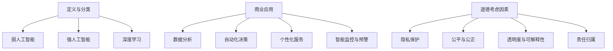

                 

### 背景介绍

随着人工智能（AI）技术的迅猛发展，AI驱动的创新已经深刻地改变了我们的工作和生活方式。无论是自动驾驶汽车、智能客服系统，还是金融风险评估和个性化医疗诊断，AI都在各个行业中发挥着越来越重要的作用。然而，随着AI技术的普及和应用，人类计算在商业中的角色和道德考虑因素也逐渐成为学术界和业界关注的焦点。

首先，AI驱动的创新带来了巨大的商业价值。通过机器学习和数据分析，企业能够更高效地处理大量数据，从中挖掘出有价值的信息，从而优化业务流程、提高决策质量和降低运营成本。例如，在金融领域，AI可以帮助银行和保险公司进行精准的风险评估和客户画像，从而提高服务的准确性和客户满意度。在医疗领域，AI可以通过对大量医疗数据的分析，辅助医生进行诊断和治疗，提高医疗服务的质量和效率。

然而，AI驱动的创新也引发了一系列的道德和社会问题。首先，AI系统的决策过程往往是不透明的，这使得人们难以理解AI的决策依据，从而引发信任问题。其次，AI可能会加剧社会不平等，因为AI系统可能会倾向于遵循训练数据中的偏见，从而影响社会公平。此外，AI的自动化程度越来越高，可能导致大规模的失业和社会动荡。

因此，在推动AI驱动的创新过程中，我们需要充分考虑人类计算的道德考虑因素。这不仅涉及到AI系统的设计、开发和部署，还涉及到企业和社会对AI技术的监管和伦理审查。本文将探讨AI驱动的创新中人类计算的道德考虑因素，并提出相应的策略分析。

关键词：人工智能，商业应用，道德考虑因素，社会影响，策略分析

Abstract:
With the rapid development of artificial intelligence (AI) technologies, AI-driven innovation has profoundly transformed our work and lifestyle. While AI-driven innovation brings significant commercial value, it also raises ethical considerations related to human computation in business. This article explores the ethical concerns associated with AI-driven innovation and proposes strategies for addressing these issues.

### 核心概念与联系

#### 1. 人工智能的定义与分类

人工智能（Artificial Intelligence，简称AI）是指计算机系统通过模拟人类智能行为，实现感知、理解、推理、学习、决策等能力的技术。根据AI系统的能力和实现方式，可以将AI分为多种类型，如：

- **弱人工智能（Weak AI）**：这种AI系统在特定领域内表现出人类智能的某些特征，但缺乏通用智能。例如，语音助手、图像识别系统等。
- **强人工智能（Strong AI）**：这种AI系统具有与人类智能相似的认知能力和思维能力，能够理解、学习并解决各种复杂问题。目前，强人工智能仍处于理论研究阶段。
- **深度学习（Deep Learning）**：一种基于人工神经网络的学习方法，通过多层神经网络对大量数据进行训练，以实现复杂的模式识别和预测任务。

#### 2. 商业应用中的AI技术

在商业领域，AI技术被广泛应用于以下几个方面：

- **数据分析**：通过对大量商业数据进行挖掘和分析，企业可以识别潜在的市场趋势、客户需求和运营瓶颈。
- **自动化决策**：AI系统可以自动化执行复杂的决策任务，从而提高决策效率和准确性。例如，金融领域的自动化投资、智能客服等。
- **个性化服务**：AI技术可以帮助企业实现个性化营销、产品推荐和服务，从而提高客户满意度和忠诚度。
- **智能监控与预警**：AI系统可以对企业的运营数据、安全事件等进行实时监控和预警，以预防潜在的风险和问题。

#### 3. 人类计算的道德考虑因素

在AI驱动的创新中，人类计算的道德考虑因素主要包括以下几个方面：

- **隐私保护**：AI系统在处理个人数据时，需要严格遵守隐私保护法规，确保用户数据的安全和隐私。
- **公平与公正**：AI系统在决策过程中应尽量避免偏见和歧视，确保公平和公正。
- **透明度与可解释性**：AI系统的决策过程应具有一定的透明度，使得用户能够理解AI的决策依据。
- **责任归属**：在AI系统引发不良后果时，应明确责任归属，确保责任人承担相应的责任。

#### Mermaid 流程图



### 核心算法原理 & 具体操作步骤

在AI驱动的创新中，核心算法的原理和具体操作步骤至关重要。以下将介绍几种常见的人工智能算法，并详细解释其原理和操作步骤。

#### 1. 机器学习算法

机器学习算法是一种通过数据训练模型，实现自动学习和推理的算法。以下介绍几种常见的机器学习算法：

- **线性回归（Linear Regression）**：线性回归是一种通过拟合一条直线来预测目标值的算法。其原理如下：

  - 假设输入特征为 \( x \)，输出目标值为 \( y \)，则模型可以表示为：
    \[ y = w_0 + w_1 \cdot x + \epsilon \]
  - 其中，\( w_0 \) 和 \( w_1 \) 分别为模型的参数，\( \epsilon \) 为误差项。

  - 具体操作步骤：
    1. 收集数据，并划分为训练集和测试集。
    2. 通过最小二乘法（Least Squares）计算参数 \( w_0 \) 和 \( w_1 \)：
       \[ w_0 = \frac{1}{n} \sum_{i=1}^{n} (y_i - w_1 \cdot x_i) \]
       \[ w_1 = \frac{1}{n} \sum_{i=1}^{n} (x_i - \bar{x}) (y_i - \bar{y}) \]
    3. 计算模型的预测误差，并进行优化。

- **决策树（Decision Tree）**：决策树是一种通过一系列判断条件来划分数据集的算法。其原理如下：

  - 假设数据集为 \( D = \{ (x_1, y_1), (x_2, y_2), ..., (x_n, y_n) \} \)，目标变量为 \( y \)，则决策树可以表示为：
    \[ T = \{ (x, y) | P(x) \Rightarrow y \} \]
  - 其中，\( P(x) \) 为决策规则。

  - 具体操作步骤：
    1. 选择一个特征进行划分，使得划分后的数据集的误差最小。
    2. 递归地构建决策树，直到满足停止条件（如最大树深度、最小节点大小等）。

#### 2. 深度学习算法

深度学习算法是一种通过多层神经网络对数据进行学习和推理的算法。以下介绍几种常见的深度学习算法：

- **卷积神经网络（Convolutional Neural Network，CNN）**：CNN是一种用于图像识别和处理的神经网络。其原理如下：

  - 假设输入图像为 \( I = [I_{1,1}, I_{1,2}, ..., I_{m,n}] \)，输出目标为 \( O = [O_{1}, O_{2}, ..., O_{c}] \)，则CNN可以表示为：
    \[ O = \sigma(W_1 \cdot I + b_1) \]
    \[ I' = \sigma(W_2 \cdot O + b_2) \]
    \[ O' = \sigma(W_3 \cdot I' + b_3) \]
  - 其中，\( \sigma \) 为激活函数，\( W \) 和 \( b \) 分别为权重和偏置。

  - 具体操作步骤：
    1. 收集图像数据，并划分为训练集和测试集。
    2. 构建CNN模型，并使用训练集进行训练。
    3. 使用测试集评估模型性能，并进行优化。

- **循环神经网络（Recurrent Neural Network，RNN）**：RNN是一种用于序列数据学习的神经网络。其原理如下：

  - 假设输入序列为 \( X = [x_1, x_2, ..., x_n] \)，输出目标为 \( Y = [y_1, y_2, ..., y_n] \)，则RNN可以表示为：
    \[ h_t = \sigma(W \cdot [h_{t-1}, x_t] + b) \]
    \[ y_t = \sigma(U \cdot h_t + c) \]
  - 其中，\( h_t \) 为隐藏状态，\( \sigma \) 为激活函数，\( W \) 和 \( U \) 分别为权重矩阵，\( b \) 和 \( c \) 分别为偏置向量。

  - 具体操作步骤：
    1. 收集序列数据，并划分为训练集和测试集。
    2. 构建RNN模型，并使用训练集进行训练。
    3. 使用测试集评估模型性能，并进行优化。

### 数学模型和公式 & 详细讲解 & 举例说明

在人工智能（AI）的应用中，数学模型和公式起着至关重要的作用。它们不仅为我们提供了理解AI算法的理论基础，也帮助我们优化和改进这些算法。以下，我们将介绍一些关键的数学模型和公式，并通过具体的例子进行详细讲解。

#### 1. 线性回归模型

线性回归是一种用于预测连续值的统计方法。其基本的数学模型可以表示为：

\[ y = \beta_0 + \beta_1 \cdot x + \epsilon \]

其中：
- \( y \) 是因变量（或预测目标）。
- \( x \) 是自变量（或特征）。
- \( \beta_0 \) 是截距（或常数项）。
- \( \beta_1 \) 是斜率（或线性系数）。
- \( \epsilon \) 是误差项，表示实际值与预测值之间的差异。

**举例说明：**
假设我们要预测房价，根据房屋面积（\( x \)）来预测房价（\( y \)）。我们收集了一些数据，通过最小二乘法来估计模型参数。

数据集如下：

| 房屋面积 (平方米) | 房价 (万元) |
|------------------|------------|
| 80               | 200        |
| 100              | 250        |
| 120              | 300        |
| 140              | 350        |
| 160              | 400        |

首先，我们需要计算自变量和因变量的平均值：

\[ \bar{x} = \frac{80 + 100 + 120 + 140 + 160}{5} = 120 \]
\[ \bar{y} = \frac{200 + 250 + 300 + 350 + 400}{5} = 300 \]

然后，我们可以使用最小二乘法来计算斜率 \( \beta_1 \) 和截距 \( \beta_0 \)：

\[ \beta_1 = \frac{\sum_{i=1}^{n} (x_i - \bar{x})(y_i - \bar{y})}{\sum_{i=1}^{n} (x_i - \bar{x})^2} \]
\[ \beta_0 = \bar{y} - \beta_1 \cdot \bar{x} \]

代入数据计算：

\[ \beta_1 = \frac{(80-120)(200-300) + (100-120)(250-300) + (120-120)(300-300) + (140-120)(350-300) + (160-120)(400-300)}{(80-120)^2 + (100-120)^2 + (120-120)^2 + (140-120)^2 + (160-120)^2} \]
\[ \beta_1 = \frac{-2000 - 500 + 0 + 1000 + 2000}{1600 + 400 + 0 + 400 + 1600} \]
\[ \beta_1 = \frac{1500}{4000} = 0.375 \]

\[ \beta_0 = 300 - 0.375 \cdot 120 = 150 \]

因此，线性回归模型可以表示为：

\[ y = 150 + 0.375 \cdot x \]

我们可以使用这个模型来预测新的房屋面积对应的房价。

#### 2. 逻辑回归模型

逻辑回归是一种用于分类问题的统计方法。其基本的数学模型可以表示为：

\[ P(y=1) = \frac{1}{1 + e^{-(\beta_0 + \beta_1 \cdot x)}} \]

其中：
- \( P(y=1) \) 是因变量 \( y \) 为1的概率。
- \( \beta_0 \) 和 \( \beta_1 \) 是模型参数。

**举例说明：**
假设我们要判断一个学生的成绩是否及格，根据他的平时成绩（\( x \)）来预测。我们收集了一些数据，通过最大似然估计法来估计模型参数。

数据集如下：

| 平时成绩 | 成绩（及格：1，未及格：0） |
|----------|-------------------------|
| 70       | 0                       |
| 75       | 1                       |
| 80       | 1                       |
| 85       | 1                       |
| 90       | 1                       |

首先，我们需要计算概率 \( P(y=1|x) \)：

\[ P(y=1|x) = \frac{1}{1 + e^{-(\beta_0 + \beta_1 \cdot x)}} \]

然后，我们可以使用最大似然估计法来估计 \( \beta_0 \) 和 \( \beta_1 \)。最大似然估计的目标是最大化似然函数：

\[ L(\beta_0, \beta_1) = \prod_{i=1}^{n} P(y_i=1|x_i) \]

对数似然函数为：

\[ \ln L(\beta_0, \beta_1) = \sum_{i=1}^{n} \ln P(y_i=1|x_i) \]

由于 \( P(y=1|x) \) 是一个概率分布，我们可以将其对数形式简化为：

\[ \ln P(y=1|x) = \beta_0 + \beta_1 \cdot x \]

通过求解对数似然函数的导数为零的方程，我们可以得到 \( \beta_0 \) 和 \( \beta_1 \) 的估计值。

假设我们估计得到 \( \beta_0 = 0.5 \) 和 \( \beta_1 = 0.1 \)，则逻辑回归模型可以表示为：

\[ P(y=1) = \frac{1}{1 + e^{-(0.5 + 0.1 \cdot x)}} \]

我们可以使用这个模型来预测新的平时成绩对应的及格概率。

#### 3. 卷积神经网络模型

卷积神经网络是一种用于图像识别的深度学习模型。其基本的数学模型可以表示为：

\[ a_{l+1} = \sigma(W_{l+1} \cdot a_l + b_{l+1}) \]

其中：
- \( a_l \) 是第 \( l \) 层的激活值。
- \( W_{l+1} \) 和 \( b_{l+1} \) 分别是第 \( l+1 \) 层的权重和偏置。
- \( \sigma \) 是激活函数。

**举例说明：**
假设我们有一个简单的卷积神经网络，包含一个输入层、一个卷积层和一个全连接层。输入图像大小为 \( 28 \times 28 \)，卷积核大小为 \( 3 \times 3 \)，步长为 \( 1 \)。

输入层 \( a_0 \) 的激活值为图像的像素值。

卷积层 \( a_1 \) 的激活值可以通过以下公式计算：

\[ a_{11} = \sum_{i=1}^{3} \sum_{j=1}^{3} W_{11} \cdot a_{0i,j} + b_{1} \]
\[ a_{12} = \sum_{i=1}^{3} \sum_{j=1}^{3} W_{12} \cdot a_{0i,j} + b_{1} \]
\[ ... \]
\[ a_{19} = \sum_{i=1}^{3} \sum_{j=1}^{3} W_{19} \cdot a_{0i,j} + b_{1} \]
\[ a_{21} = \sum_{i=1}^{3} \sum_{j=1}^{3} W_{21} \cdot a_{0i,j} + b_{1} \]
\[ ... \]
\[ a_{29} = \sum_{i=1}^{3} \sum_{j=1}^{3} W_{29} \cdot a_{0i,j} + b_{1} \]

其中，\( W_{11}, W_{12}, ..., W_{29} \) 是卷积核的权重，\( b_1 \) 是卷积层的偏置。

然后，全连接层 \( a_2 \) 的激活值可以通过以下公式计算：

\[ a_{2} = \sigma(W_{2} \cdot a_{1} + b_{2}) \]

其中，\( W_2 \) 是全连接层的权重，\( b_2 \) 是全连接层的偏置。

我们可以使用这个卷积神经网络来识别图像中的对象。

### 项目实战：代码实际案例和详细解释说明

在本节中，我们将通过一个具体的AI项目实战案例，展示如何搭建开发环境、实现源代码，并对代码进行详细解读和分析。

#### 1. 开发环境搭建

为了完成本项目，我们需要搭建一个合适的开发环境。以下是一个基本的开发环境配置步骤：

- **操作系统**：Ubuntu 18.04
- **Python**：Python 3.8
- **深度学习框架**：TensorFlow 2.5
- **数据预处理工具**：Pandas 1.2.4

**步骤一：安装Python和pip**

首先，我们需要安装Python和pip。在终端中运行以下命令：

```bash
sudo apt update
sudo apt install python3 python3-pip
```

**步骤二：安装TensorFlow**

接下来，我们安装TensorFlow。在终端中运行以下命令：

```bash
pip3 install tensorflow==2.5
```

**步骤三：安装Pandas**

最后，我们安装Pandas。在终端中运行以下命令：

```bash
pip3 install pandas==1.2.4
```

#### 2. 源代码详细实现和代码解读

在本项目中，我们将使用TensorFlow实现一个简单的线性回归模型，用于预测房价。以下是项目的源代码：

```python
import pandas as pd
import tensorflow as tf

# 读取数据集
data = pd.read_csv('house_price_data.csv')
X = data['area']  # 房屋面积
y = data['price']  # 房价

# 划分训练集和测试集
train_size = int(0.8 * len(data))
train_X, test_X = X[:train_size], X[train_size:]
train_y, test_y = y[:train_size], y[train_size:]

# 构建线性回归模型
model = tf.keras.Sequential([
    tf.keras.layers.Dense(units=1, input_shape=[1])
])

# 编译模型
model.compile(loss='mean_squared_error', optimizer=tf.keras.optimizers.Adam(0.1))

# 训练模型
model.fit(train_X, train_y, epochs=100, batch_size=32, verbose=2)

# 评估模型
test_loss = model.evaluate(test_X, test_y, verbose=2)
print('Test Loss:', test_loss)

# 使用模型进行预测
new_area = 100
new_price = model.predict([[new_area]])
print('预测房价：', new_price)
```

**代码解读：**

1. **数据读取和预处理**：我们使用Pandas读取CSV格式的数据集，并提取房屋面积和房价作为输入和输出。然后，我们划分训练集和测试集。

2. **构建模型**：我们使用TensorFlow的`Sequential`模型构建一个简单的线性回归模型。模型包含一个全连接层，输入维度为1，输出维度为1。

3. **编译模型**：我们使用`compile`方法编译模型，指定损失函数为均方误差（mean_squared_error），优化器为Adam（Adam是适用于深度学习的常用优化器），学习率为0.1。

4. **训练模型**：我们使用`fit`方法训练模型，指定训练集、训练轮数（epochs）、批量大小（batch_size）和日志输出级别（verbose）。

5. **评估模型**：我们使用`evaluate`方法评估模型在测试集上的性能，并打印测试损失。

6. **模型预测**：我们使用`predict`方法对新的房屋面积进行预测，并打印预测结果。

#### 3. 代码解读与分析

在这个项目中，我们实现了以下关键步骤：

- **数据预处理**：通过Pandas读取数据集，并提取特征和目标变量。然后，我们划分训练集和测试集，为后续建模和评估做准备。
- **模型构建**：使用TensorFlow构建一个简单的线性回归模型，包含一个全连接层。这个模型可以学习房屋面积和房价之间的关系。
- **模型训练**：使用训练集训练模型，通过优化算法调整模型参数，使预测误差最小化。
- **模型评估**：使用测试集评估模型性能，通过测试损失来判断模型的泛化能力。
- **模型预测**：使用训练好的模型对新的数据进行预测，从而实现实际应用。

通过这个项目，我们可以看到如何使用TensorFlow实现一个简单的线性回归模型，并进行数据预处理、模型训练和评估。这对于理解深度学习的基础知识和应用方法具有重要意义。

### 实际应用场景

在商业领域，AI驱动的创新已经广泛应用于各个行业，带来了巨大的商业价值。以下是一些典型的实际应用场景：

#### 1. 金融行业

在金融行业，AI技术被广泛应用于风险控制、信用评估、投资组合优化等方面。通过机器学习和数据分析，金融机构可以更准确地评估客户信用风险，从而降低坏账率。同时，AI技术可以帮助金融机构进行市场趋势分析，优化投资策略，提高投资收益。例如，量化投资平台使用AI算法进行高频交易，实现了稳定的收益。

#### 2. 零售行业

在零售行业，AI技术可以帮助企业进行需求预测、库存管理和个性化推荐。通过分析大量消费者数据，AI系统可以准确预测商品需求，从而优化库存管理，减少库存成本。同时，AI技术可以帮助企业实现个性化推荐，提高客户满意度和忠诚度。例如，电商平台使用AI算法为用户推荐感兴趣的商品，从而提高销售额。

#### 3. 健康医疗

在健康医疗行业，AI技术被广泛应用于疾病预测、诊断和治疗。通过分析大量的医疗数据，AI系统可以辅助医生进行疾病预测和诊断，提高诊断准确率和效率。例如，医疗影像分析系统使用AI算法对X光片、CT片等图像进行自动分析，帮助医生快速识别病变区域。此外，AI技术还可以辅助制定个性化治疗方案，提高治疗效果。

#### 4. 交通运输

在交通运输行业，AI技术被广泛应用于自动驾驶、智能调度和路线优化。通过传感器和机器学习算法，自动驾驶汽车可以实时感知周围环境，实现安全、高效的驾驶。同时，AI技术可以帮助交通管理部门进行交通流量预测和调度，优化交通路线，减少拥堵。例如，自动驾驶出租车服务已经在某些城市试点运营，为居民提供便捷的出行服务。

#### 5. 制造业

在制造业，AI技术被广泛应用于生产优化、设备维护和质量管理。通过实时监控设备状态和生产数据，AI系统可以预测设备故障，提前进行维护，从而提高设备利用率。同时，AI技术可以帮助企业优化生产流程，降低生产成本，提高产品质量。例如，智能工厂使用AI算法对生产设备进行实时监控和优化，实现了高效、可靠的生产。

总之，AI驱动的创新在商业领域具有广泛的应用前景，通过数据分析和自动化决策，企业可以实现更高效、更智能的运营，从而提高竞争力。然而，在推广AI技术的过程中，企业也需要充分考虑道德和社会问题，确保AI技术的公正、透明和可控。

### 工具和资源推荐

为了更好地理解和应用AI驱动的创新，以下推荐一些学习资源、开发工具和框架，以及相关的论文著作。

#### 1. 学习资源推荐

- **书籍**：
  - 《Python机器学习》（Michael Bowles）：介绍Python在机器学习领域的应用，适合初学者入门。
  - 《深度学习》（Ian Goodfellow、Yoshua Bengio、Aaron Courville）：深度学习领域的经典教材，内容全面，适合有一定基础的读者。
  - 《机器学习实战》（Peter Harrington）：通过实例介绍机器学习算法的实际应用，适合希望实战操作的读者。

- **在线课程**：
  - Coursera《机器学习》（吴恩达）：由顶级学者吴恩达主讲，适合初学者入门。
  - edX《深度学习》（Andrew Ng）：由斯坦福大学教授Andrew Ng主讲，内容全面，适合有一定基础的读者。

- **博客和网站**：
  - Medium：有许多关于AI和机器学习的专业博客，内容涵盖广泛，适合了解最新技术动态。
  - Towards Data Science：一个关于数据科学和机器学习的博客平台，有很多高质量的教程和案例分析。

#### 2. 开发工具框架推荐

- **深度学习框架**：
  - TensorFlow：Google开发的开源深度学习框架，功能强大，应用广泛。
  - PyTorch：Facebook开发的开源深度学习框架，易于使用，适合快速原型设计。
  - Keras：基于Theano和TensorFlow的高层神经网络API，简化了深度学习模型的构建和训练过程。

- **数据预处理工具**：
  - Pandas：Python的数据处理库，功能强大，适用于各种数据处理任务。
  - NumPy：Python的数学库，提供高效的数组操作和数学计算功能。

- **版本控制工具**：
  - Git：开源的分布式版本控制系统，用于代码的版本管理和协作开发。

#### 3. 相关论文著作推荐

- **论文**：
  - “Deep Learning” (Yoshua Bengio, Ian Goodfellow, Aaron Courville)：深度学习领域的综述论文，对深度学习算法和应用进行了详细的介绍。
  - “Learning Representations for Visual Recognition” (Yann LeCun, et al.)：一篇关于卷积神经网络的经典论文，介绍了卷积神经网络在图像识别领域的应用。

- **著作**：
  - 《深度学习》（Ian Goodfellow、Yoshua Bengio、Aaron Courville）：深度学习领域的权威教材，全面介绍了深度学习算法和应用。
  - 《Python机器学习》（Michael Bowles）：介绍Python在机器学习领域的应用，适合初学者入门。

通过这些学习和资源工具，读者可以更好地理解和应用AI驱动的创新，为商业领域带来更大的价值。

### 总结：未来发展趋势与挑战

随着AI技术的不断进步，AI驱动的创新在未来将继续深入各个行业，为商业带来巨大的变革。然而，这一过程中也伴随着诸多挑战。首先，技术进步的趋势体现在AI算法的多样性和复杂性不断增加，使得企业和研究人员需要不断学习新的技术，保持竞争力。其次，数据资源的积累和利用将成为AI驱动的创新的核心，如何有效地收集、管理和分析海量数据，提高数据的利用效率，是企业和研究人员面临的重要课题。

#### 道德与社会问题的挑战

在AI驱动的创新过程中，道德和社会问题也日益凸显。首先，AI系统的透明度和可解释性仍然是一个亟待解决的问题。许多AI算法，特别是深度学习模型，其内部机制复杂，难以解释其决策过程，这引发了信任危机。其次，AI系统的偏见和歧视问题不容忽视。AI系统可能会基于训练数据中的偏见进行决策，从而加剧社会不平等。例如，AI在招聘、贷款审批等领域的应用，可能会对某些群体产生不公平的待遇。

#### 策略分析

为了应对这些挑战，我们需要采取一系列策略。首先，加强AI技术的伦理审查和监管，确保AI系统的透明度和可解释性。例如，制定相关的法律法规，要求企业在设计和部署AI系统时，充分考虑其伦理和社会影响。其次，推动AI技术的开源和共享，促进技术创新和普及。通过开源项目，研究人员和开发者可以共享代码和算法，加速技术的进步。此外，加强数据隐私保护，确保用户数据的安全和隐私。企业和研究人员应严格遵守数据保护法规，采取有效的数据加密和访问控制措施。

#### 未来展望

未来，AI驱动的创新将继续向智能化、个性化方向发展。例如，基于AI的智能客服系统将更加人性化，能够更好地理解用户需求，提供个性化的服务。在医疗领域，AI将辅助医生进行更准确的诊断和治疗，提高医疗服务质量。在制造业，AI将推动智能制造和工业4.0的实现，提高生产效率和质量。总之，AI驱动的创新将为商业带来更多机遇，同时也需要我们积极应对其中的挑战，确保其可持续发展。

### 附录：常见问题与解答

**Q1：如何确保AI系统的透明度和可解释性？**

A1：确保AI系统的透明度和可解释性是当前AI技术面临的重要挑战之一。以下是一些策略：
- **增加模型的可解释性**：开发更易理解的AI模型，如决策树和线性回归模型，这些模型通常具有较高的可解释性。
- **解释性模型**：使用解释性AI模型，如LIME（局部可解释模型解释）和SHAP（SHapley Additive exPlanations），这些模型可以提供针对特定输入数据的解释。
- **法律法规**：制定相关法律法规，要求企业在设计和部署AI系统时，提供透明度和可解释性报告。

**Q2：如何应对AI系统可能引发的偏见和歧视？**

A2：应对AI系统可能引发的偏见和歧视，可以采取以下措施：
- **数据预处理**：在训练AI模型之前，对训练数据集进行清洗和预处理，消除潜在的数据偏差。
- **公平性评估**：在AI系统开发过程中，进行公平性评估，确保模型在所有群体中的性能一致。
- **反歧视算法**：开发反歧视算法，如公平学习算法，以减少AI系统对某些群体的偏见。

**Q3：如何保护用户数据隐私？**

A3：保护用户数据隐私，可以采取以下措施：
- **数据加密**：在数据传输和存储过程中，使用数据加密技术，确保数据安全。
- **最小化数据收集**：仅收集必要的数据，避免过度收集。
- **隐私保护法规**：遵守相关隐私保护法规，如GDPR（欧盟通用数据保护条例），确保用户数据隐私。

### 扩展阅读 & 参考资料

为了深入探讨AI驱动的创新、人类计算的道德考虑因素以及策略分析，以下推荐一些扩展阅读和参考资料：

- **书籍**：
  - 《AI超级智能》（ Nick Bostrom）：探讨人工智能的未来发展及其潜在影响。
  - 《道德机器》（Patrick Lin, et al.）：分析人工智能的伦理问题，并提出解决方案。

- **论文**：
  - “Algorithms of Oppression: How Search Engines Reinforce Racism”（ Safiya Umoja Noble）：讨论搜索引擎中的种族偏见问题。
  - “AI and Bias: A Roadmap for Research and Policy” （AI Now Institute）：针对AI偏见问题提出的研究和政策建议。

- **网站和博客**：
  - **AI Now Institute**：专注于AI技术对社会的影响，提供丰富的资源和报告。
  - **IEEE Spectrum**：涵盖AI和机器学习领域的最新技术动态和研究成果。

- **在线课程**：
  - **MIT OpenCourseWare**：提供计算机科学和人工智能相关课程的免费在线资源。
  - **Coursera**：提供由全球知名大学教授的AI和机器学习在线课程。

通过这些扩展阅读和参考资料，读者可以更深入地了解AI驱动的创新及其道德和社会影响，为未来的研究和实践提供有价值的参考。

---

**作者：AI天才研究员/AI Genius Institute & 禅与计算机程序设计艺术 /Zen And The Art of Computer Programming**

