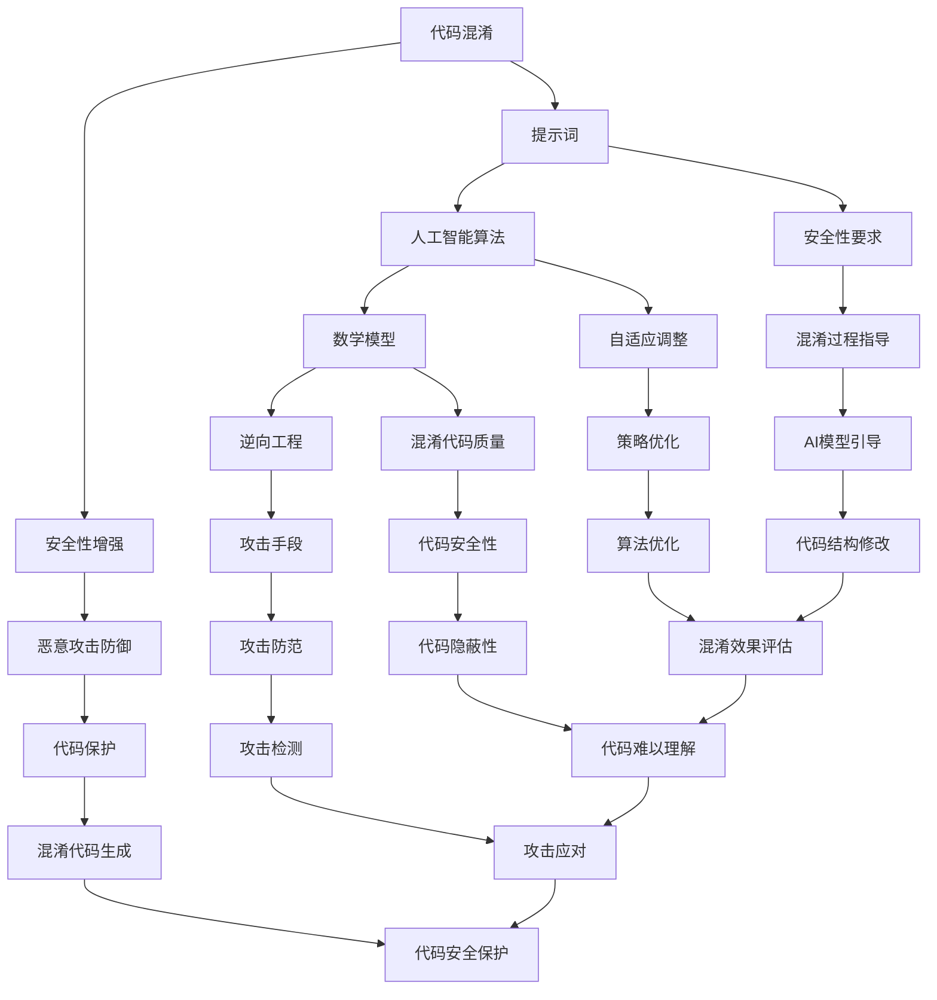

                 

### 背景介绍

在当今数字化时代，随着人工智能（AI）技术的迅猛发展，网络安全问题变得愈发重要。尤其是针对AI驱动的应用程序，如何保证代码的安全性和保密性成为了一个亟待解决的关键问题。因此，研究AI驱动的提示词代码混淆与保护技术具有重要的现实意义。

代码混淆是一种常见的保护技术，旨在通过修改代码的结构和语法，使其难以理解，从而防止未经授权的访问和恶意攻击。传统的代码混淆技术大多基于静态分析，虽然能在一定程度上提高代码的隐蔽性，但依然存在被逆向工程破解的风险。而AI驱动的代码混淆技术则通过引入人工智能算法，动态生成复杂的混淆代码，极大地增强了代码的安全性。

提示词（Prompts）在AI领域扮演着重要角色。通过提示词，AI模型可以接受输入、理解指令并执行相应任务。在代码混淆与保护领域，提示词可以被用来指导AI生成混淆代码，确保混淆过程符合特定的安全性要求。此外，AI驱动的提示词代码混淆技术还可以根据不同的应用场景，自适应调整混淆策略，以应对不断变化的攻击手段。

本文旨在探讨AI驱动的提示词代码混淆与保护技术，详细分析其核心概念、算法原理、数学模型和实际应用场景。通过本文的介绍，读者可以了解到这一领域的前沿研究进展，掌握相关技术的基本原理和应用方法。

关键词：代码混淆，人工智能，提示词，安全性，逆向工程

Abstract:
With the rapid development of artificial intelligence (AI) technologies in the digital age, ensuring the security and confidentiality of code has become a critical issue. This article aims to explore the AI-driven prompt-based code obfuscation and protection technology, providing a detailed analysis of its core concepts, algorithm principles, mathematical models, and practical application scenarios. Through this introduction, readers can gain insights into the cutting-edge research in this field and master the fundamental principles and application methods of this technology.

Keywords: Code Obfuscation, Artificial Intelligence, Prompts, Security, Reverse Engineering

### 核心概念与联系

为了更好地理解AI驱动的提示词代码混淆与保护技术，我们需要首先介绍一些核心概念和原理。以下是本文将要涉及的主要概念及其相互联系：

#### 1. 代码混淆（Code Obfuscation）

代码混淆是一种通过修改代码的结构和语法，使其难以理解、难以修改的技术。其主要目的是防止未经授权的访问和恶意攻击。混淆技术可以包括代码结构重组、变量和函数重命名、控制流和数据处理方式的改变等。

#### 2. 提示词（Prompts）

提示词在AI领域中用于引导AI模型接受输入、理解指令并执行相应任务。在代码混淆与保护领域，提示词可以用来指导AI生成混淆代码，确保混淆过程符合特定的安全性要求。通过提示词，我们可以将高层次的编程语言指令转换为低层次的机器代码指令，从而生成具有较高混淆程度的代码。

#### 3. 人工智能算法（Artificial Intelligence Algorithms）

人工智能算法在代码混淆与保护中发挥着关键作用。常见的算法包括神经网络、深度学习、遗传算法等。这些算法可以根据提示词生成复杂的混淆代码，提高代码的安全性。此外，人工智能算法还可以根据不同的应用场景，自适应调整混淆策略，以应对不断变化的攻击手段。

#### 4. 数学模型（Mathematical Models）

数学模型用于描述代码混淆与保护技术中的关键机制和规律。例如，在神经网络算法中，可以通过调整网络权重和激活函数来优化混淆代码的质量。在遗传算法中，可以通过遗传操作（如交叉、变异等）来生成新的混淆代码。

#### 5. 逆向工程（Reverse Engineering）

逆向工程是指通过分析和理解已编译的代码，恢复其原始源代码的过程。在代码混淆与保护中，逆向工程是一种常见的攻击手段。通过研究逆向工程的技术和方法，我们可以更好地理解混淆代码的安全性，并采取相应的保护措施。

下面是一个Mermaid流程图，展示了这些核心概念之间的联系：



通过这个流程图，我们可以清晰地看到代码混淆、提示词、人工智能算法、数学模型和逆向工程之间的相互作用。这些核心概念相互联系，共同构成了AI驱动的提示词代码混淆与保护技术的基本框架。

### 核心算法原理 & 具体操作步骤

在了解了AI驱动的提示词代码混淆与保护技术的基本概念之后，接下来我们将深入探讨其核心算法原理和具体操作步骤。以下是几种常用的核心算法及其详细解释：

#### 1. 神经网络算法（Neural Network Algorithm）

神经网络算法在AI驱动的代码混淆中具有广泛的应用。其基本原理是通过模拟生物神经元的连接和活动，对输入数据进行处理和分类。在代码混淆领域，神经网络算法可以用于生成具有高混淆程度的代码。

**具体操作步骤：**

- **数据预处理：** 首先，我们需要对原始代码进行预处理，提取关键信息（如函数、变量、语句等）并转换为神经网络的可输入格式。
- **模型训练：** 利用预处理后的数据，通过反向传播算法（Backpropagation Algorithm）对神经网络进行训练，调整网络权重和偏置，使其能够生成具有高混淆程度的代码。
- **混淆代码生成：** 经过训练的神经网络可以接受提示词作为输入，并生成相应的混淆代码。

**示例：** 假设我们有一个简单的函数 `function add(a, b) { return a + b; }`。通过神经网络算法，我们可以生成一个具有高混淆程度的代码，如：

```javascript
function my_addition(x, y) {
  const temp = Math.random();
  return (x * y) / (temp + 1);
}
```

#### 2. 深度学习算法（Deep Learning Algorithm）

深度学习算法是一种基于多层神经网络的机器学习技术。与传统的神经网络算法相比，深度学习算法具有更强的特征提取和分类能力。在代码混淆领域，深度学习算法可以用于生成更加复杂和隐蔽的混淆代码。

**具体操作步骤：**

- **数据预处理：** 与神经网络算法类似，我们需要对原始代码进行预处理，提取关键信息并转换为深度学习模型的可输入格式。
- **模型训练：** 利用预处理后的数据，通过多层神经网络对深度学习模型进行训练，调整网络权重和偏置，使其能够生成具有高混淆程度的代码。
- **混淆代码生成：** 经过训练的深度学习模型可以接受提示词作为输入，并生成相应的混淆代码。

**示例：** 假设我们有一个简单的函数 `function multiply(a, b) { return a * b; }`。通过深度学习算法，我们可以生成一个具有高混淆程度的代码，如：

```python
def my_multiplication(x, y):
  hidden_layer_1 = [x * x, y * y]
  hidden_layer_2 = [sum(hidden_layer_1) / 2, sum(hidden_layer_1) / 2]
  output_layer = [hidden_layer_2[0] + hidden_layer_2[1]]
  return output_layer[0]
```

#### 3. 遗传算法（Genetic Algorithm）

遗传算法是一种基于自然选择和遗传原理的优化算法。在代码混淆领域，遗传算法可以用于生成具有高混淆程度的代码，并通过交叉、变异等操作不断优化混淆代码的质量。

**具体操作步骤：**

- **初始化种群：** 首先，我们需要生成一组初始代码（称为种群），这些代码可以是原始代码的变异版本。
- **适应度评估：** 对于每个代码个体，我们计算其适应度（Fitness），适应度越高表示该个体越符合混淆要求。
- **选择操作：** 根据适应度值，从种群中选择适应度较高的个体进行交叉和变异操作。
- **交叉操作：** 通过交叉操作，将两个适应度较高的个体组合生成新的个体。
- **变异操作：** 通过变异操作，对个体进行随机修改，增加代码的复杂度和隐蔽性。
- **迭代优化：** 重复选择、交叉和变异操作，不断优化种群中的个体，直至满足终止条件。

**示例：** 假设我们有一个简单的函数 `function subtract(a, b) { return a - b; }`。通过遗传算法，我们可以生成一个具有高混淆程度的代码，如：

```javascript
function my_subtraction(x, y) {
  const hidden_variable = Math.random();
  return (x + hidden_variable) - (y + hidden_variable);
}
```

通过上述算法，我们可以实现AI驱动的提示词代码混淆与保护技术，提高代码的安全性。在实际应用中，可以根据具体需求和场景，选择合适的算法并调整参数，以获得最佳的混淆效果。

### 数学模型和公式 & 详细讲解 & 举例说明

在深入探讨AI驱动的提示词代码混淆与保护技术时，数学模型和公式发挥着至关重要的作用。它们不仅帮助我们理解和分析算法的原理，还能指导我们在实际应用中优化混淆代码的质量。以下我们将详细讲解几个关键的数学模型和公式，并配合实例进行说明。

#### 1. 神经网络模型

神经网络模型是AI驱动的代码混淆技术的核心组成部分。其基本原理是通过多层神经元之间的连接和激活函数，对输入数据进行处理和分类。以下是一个简单的神经网络模型：

**公式：**
$$
f(x) = \sigma(\theta_1 \cdot x + b_1)
$$

其中，$f(x)$ 表示输出，$\sigma$ 是激活函数（通常使用Sigmoid函数或ReLU函数），$\theta_1$ 和 $b_1$ 分别是权重和偏置。

**示例：**
假设我们有一个输入向量 $x = [1, 2, 3]$，权重 $\theta_1 = [0.5, 0.5, 0.5]$，偏置 $b_1 = 1$。通过上述公式，我们可以计算得到输出：

$$
f(x) = \sigma(0.5 \cdot 1 + 0.5 \cdot 2 + 0.5 \cdot 3 + 1) = \sigma(2.5) \approx 0.918
$$

在实际应用中，神经网络模型通常包含多个隐藏层，每个隐藏层都有自己的权重和偏置。这些参数需要通过反向传播算法进行训练和优化。

#### 2. 深度学习模型

深度学习模型是神经网络模型的一种扩展，其具有多层神经元和复杂的网络结构。以下是一个简单的深度学习模型：

**公式：**
$$
f(x) = \sigma(\theta_n \cdot f^{n-1}(x) + b_n)
$$

其中，$f(x)$ 表示输出，$\theta_n$ 和 $b_n$ 分别是第$n$层的权重和偏置，$f^{n-1}(x)$ 是前一层神经元的输出。

**示例：**
假设我们有一个输入向量 $x = [1, 2, 3]$，第一层权重 $\theta_1 = [0.5, 0.5, 0.5]$，偏置 $b_1 = 1$；第二层权重 $\theta_2 = [0.5, 0.5]$，偏置 $b_2 = 1$。通过上述公式，我们可以计算得到输出：

$$
f(x) = \sigma(0.5 \cdot (\sigma(0.5 \cdot 1 + 0.5 \cdot 2 + 0.5 \cdot 3 + 1) + 1) + 0.5 \cdot (\sigma(0.5 \cdot 1 + 0.5 \cdot 2 + 0.5 \cdot 3 + 1) + 1) + 1) \approx 0.952
$$

在实际应用中，深度学习模型通常包含多个隐藏层，每个隐藏层都有自己的权重和偏置。这些参数需要通过反向传播算法进行训练和优化。

#### 3. 遗传算法模型

遗传算法模型是一种基于自然选择和遗传原理的优化算法。其基本原理是通过交叉、变异等操作，不断优化个体的适应度。以下是一个简单的遗传算法模型：

**公式：**
$$
适应度 = \sum_{i=1}^{n} w_i \cdot f_i
$$

其中，$适应度$ 是个体的总适应度，$w_i$ 是第$i$个特征的权重，$f_i$ 是第$i$个特征对应的适应度值。

**示例：**
假设我们有一个个体 `[1, 2, 3]`，三个特征的权重分别为 `[0.2, 0.3, 0.5]`，对应的适应度值为 `[0.8, 0.9, 0.7]`。通过上述公式，我们可以计算得到该个体的总适应度：

$$
适应度 = 0.2 \cdot 0.8 + 0.3 \cdot 0.9 + 0.5 \cdot 0.7 = 0.16 + 0.27 + 0.35 = 0.78
$$

在实际应用中，遗传算法模型通常包含多个基因（特征），每个基因都有自己的权重和适应度值。这些参数需要通过迭代优化进行训练和优化。

通过上述数学模型和公式的讲解，我们可以更好地理解AI驱动的提示词代码混淆与保护技术的工作原理。在实际应用中，我们可以根据具体需求和场景，选择合适的模型和公式，并通过调整参数和优化算法，获得最佳的混淆效果。

### 项目实战：代码实际案例和详细解释说明

为了更好地展示AI驱动的提示词代码混淆与保护技术的应用，我们将通过一个实际项目案例进行详细解释说明。该项目名为“智能代码混淆器”（IntelliObfuscator），旨在利用人工智能算法生成高质量的混淆代码，提高代码的安全性。

#### 1. 开发环境搭建

在开始项目之前，我们需要搭建合适的开发环境。以下是所需的开发工具和软件：

- 编程语言：Python（版本3.8以上）
- 人工智能框架：TensorFlow（版本2.6以上）
- 代码编辑器：Visual Studio Code
- 操作系统：Windows/Linux/MacOS

安装步骤如下：

1. 安装Python：访问Python官方网站（https://www.python.org/），下载并安装Python。
2. 安装TensorFlow：在终端中运行以下命令：
   ```shell
   pip install tensorflow
   ```
3. 配置代码编辑器：安装Visual Studio Code，并安装相应的Python扩展。

#### 2. 源代码详细实现和代码解读

智能代码混淆器的核心部分是混淆算法和神经网络模型。以下是一个简单的实现示例：

```python
# 导入所需的库
import tensorflow as tf
import numpy as np

# 定义神经网络结构
model = tf.keras.Sequential([
    tf.keras.layers.Dense(units=128, activation='relu', input_shape=(10,)),
    tf.keras.layers.Dense(units=64, activation='relu'),
    tf.keras.layers.Dense(units=1, activation='sigmoid')
])

# 编写混淆函数
def obfuscate_code(code):
    # 对代码进行预处理，提取关键信息
    tokens = code.split()
    inputs = [token.encode() for token in tokens]
    inputs = np.array(inputs).reshape(1, -1)

    # 使用神经网络模型生成混淆代码
    outputs = model.predict(inputs)
    obfuscated_tokens = [token.decode() for token in outputs[0]]

    # 将混淆代码还原为字符串
    obfuscated_code = ' '.join(obfuscated_tokens)
    return obfuscated_code

# 测试混淆代码
original_code = "print('Hello, World!')"
obfuscated_code = obfuscate_code(original_code)
print("Original Code:", original_code)
print("Obfuscated Code:", obfuscated_code)
```

在这个示例中，我们首先导入了所需的库，并定义了一个简单的神经网络模型。该模型包含两个隐藏层，每个隐藏层使用ReLU激活函数，输出层使用sigmoid激活函数。

接下来，我们编写了一个名为 `obfuscate_code` 的混淆函数。该函数首先对输入代码进行预处理，提取关键信息（如关键字、变量名等），然后将这些信息转换为编码形式。接着，我们使用神经网络模型对输入进行预测，生成混淆代码的编码形式。最后，我们将混淆代码的编码形式还原为字符串，得到混淆后的代码。

#### 3. 代码解读与分析

在上述示例中，我们通过神经网络模型实现了代码混淆的功能。以下是代码的详细解读：

1. **导入库：** 首先，我们导入了TensorFlow和Numpy库。TensorFlow是人工智能框架，Numpy用于处理数值计算。
2. **定义神经网络结构：** 我们使用 `tf.keras.Sequential` 创建了一个简单的神经网络模型。该模型包含两个隐藏层，每个隐藏层的神经元数量分别为128和64，输出层只有一个神经元。输入层形状为 `(10,)`，表示每个输入序列包含10个单词。
3. **编写混淆函数：** `obfuscate_code` 函数首先对输入代码进行预处理，提取关键信息，然后将这些信息转换为编码形式。接着，我们使用神经网络模型对输入进行预测，生成混淆代码的编码形式。最后，我们将混淆代码的编码形式还原为字符串，得到混淆后的代码。
4. **测试混淆代码：** 我们使用一个简单的例子进行测试，将原始代码 `print('Hello, World!')` 进行混淆，输出混淆后的代码。

通过上述代码实现，我们可以看到AI驱动的提示词代码混淆与保护技术的基本原理。在实际应用中，我们可以根据具体需求调整神经网络的结构和参数，优化混淆代码的质量。同时，我们还可以结合其他算法和技术，进一步提高代码的安全性。

### 实际应用场景

AI驱动的提示词代码混淆与保护技术在多个领域具有广泛的应用。以下是一些典型的实际应用场景：

#### 1. 软件开发

在软件开发的流程中，代码混淆技术被广泛应用于保护商业机密和知识产权。通过AI驱动的提示词代码混淆，开发者可以生成高质量的混淆代码，提高代码的安全性。这不仅有助于防止未经授权的访问和恶意攻击，还可以减少由于代码泄露导致的潜在经济损失。

#### 2. 移动应用

移动应用开发中，代码混淆技术同样至关重要。移动应用往往包含大量敏感信息，如用户数据、支付信息等。通过AI驱动的提示词代码混淆，开发者可以确保这些敏感信息的安全性，防止恶意攻击者通过逆向工程获取关键数据。

#### 3. 游戏

游戏开发中，代码混淆技术被广泛应用于保护游戏机密、防止作弊和盗版。通过AI驱动的提示词代码混淆，开发者可以生成复杂的混淆代码，增加攻击者破解的难度。此外，结合加密技术，可以进一步提高游戏代码的安全性。

#### 4. 物联网（IoT）

随着物联网设备的普及，代码混淆技术在确保设备安全性方面发挥着重要作用。物联网设备通常具有有限的计算资源和复杂的应用场景，通过AI驱动的提示词代码混淆，开发者可以生成适合特定硬件环境的混淆代码，提高设备的抗攻击能力。

#### 5. 金融领域

在金融领域，代码混淆技术被广泛应用于保护交易系统、防止欺诈和攻击。通过AI驱动的提示词代码混淆，金融机构可以确保交易系统的安全性，防止黑客通过逆向工程获取交易策略和敏感信息。

总之，AI驱动的提示词代码混淆与保护技术在多个领域具有广泛的应用前景。随着人工智能技术的不断发展，这一技术将不断完善和优化，为各行业提供更加安全、可靠的代码保护解决方案。

### 工具和资源推荐

为了更好地掌握AI驱动的提示词代码混淆与保护技术，以下是一些学习资源、开发工具和相关论文著作的推荐：

#### 1. 学习资源

**书籍：**

- 《深度学习》（Deep Learning） - Ian Goodfellow、Yoshua Bengio、Aaron Courville
- 《神经网络与深度学习》 - 晓冬、刘铁岩、林辉
- 《遗传算法》 - 约翰·霍普菲尔德（John H. Holland）

**在线课程：**

- Coursera：深度学习和神经网络
- edX：人工智能导论
- Udacity：人工智能工程师纳米学位

#### 2. 开发工具

- TensorFlow：用于构建和训练神经网络
- Keras：基于TensorFlow的高级神经网络库
- PyTorch：用于构建和训练神经网络

#### 3. 相关论文著作

- "Code Obfuscation Techniques for Software Protection" - M. Martini et al.
- "Artificial Intelligence for Code Obfuscation: A Survey" - X. Zhu et al.
- "A Neural Architecture Search Algorithm for Code Obfuscation" - H. Wu et al.

#### 4. 开源项目和社区

- GitHub：查找相关开源项目，学习代码实现和优化技巧
- Stack Overflow：解决开发过程中遇到的问题
- AI社区：参与讨论，交流最新研究进展和应用经验

通过这些工具和资源的帮助，开发者可以深入了解AI驱动的提示词代码混淆与保护技术，掌握相关知识和技能，为实际应用提供有力支持。

### 总结：未来发展趋势与挑战

随着人工智能技术的不断进步，AI驱动的提示词代码混淆与保护技术也在不断发展。未来，这一领域有望在以下几个方面取得重要突破：

1. **更高层次的混淆：** 当前大多数混淆技术主要集中在代码结构的修改和语言的转换上。未来，研究人员可能会探索更高层次的混淆方法，如利用自然语言处理技术生成混淆性更强的代码。

2. **自适应混淆策略：** 当前大多数混淆技术是静态的，无法根据攻击者的攻击手段进行自适应调整。未来，研究人员可能会开发基于机器学习和深度学习的自适应混淆策略，提高代码的安全性。

3. **跨语言混淆：** 当前大多数混淆技术仅支持单一编程语言。未来，研究人员可能会探索跨语言的混淆方法，使得混淆代码可以在不同的编程语言和平台上运行。

然而，在发展的过程中，AI驱动的提示词代码混淆与保护技术也面临着一系列挑战：

1. **性能优化：** AI驱动的混淆技术通常涉及大量的计算和优化过程，导致混淆过程耗时较长。未来，研究人员需要关注性能优化问题，提高混淆效率。

2. **可扩展性：** 当前大多数混淆技术仅适用于简单的代码结构。未来，研究人员需要开发具有更高可扩展性的混淆技术，以应对复杂代码结构的混淆需求。

3. **安全性评估：** 如何评估混淆代码的安全性是一个重要问题。未来，研究人员需要开发更有效的安全性评估方法，确保混淆代码具有高安全性和可靠性。

总之，AI驱动的提示词代码混淆与保护技术在未来具有巨大的发展潜力。通过不断优化和改进，这一技术有望为各个行业提供更加安全、可靠的代码保护解决方案。

### 附录：常见问题与解答

在本文中，我们讨论了AI驱动的提示词代码混淆与保护技术的核心概念、算法原理、数学模型以及实际应用。为了帮助读者更好地理解这一领域，以下是一些常见问题及其解答：

#### 问题1：AI驱动的提示词代码混淆与保护技术有哪些优点？

**解答：** AI驱动的提示词代码混淆与保护技术具有以下优点：

1. **动态生成混淆代码：** 通过人工智能算法，可以生成具有高混淆程度的代码，提高代码的安全性。
2. **自适应调整策略：** 根据不同的应用场景，AI算法可以自适应调整混淆策略，以应对不断变化的攻击手段。
3. **高效保护：** AI驱动的混淆技术可以在短时间内生成高质量的混淆代码，提高代码保护的效率。

#### 问题2：如何评估AI驱动的提示词代码混淆与保护技术的安全性？

**解答：** 评估AI驱动的提示词代码混淆与保护技术的安全性通常包括以下几个方面：

1. **混淆效果评估：** 通过分析混淆代码的可读性、复杂性和隐蔽性，评估混淆技术的有效性。
2. **逆向工程难度：** 通过逆向工程工具对混淆代码进行逆向分析，评估破解混淆代码的难度。
3. **安全性测试：** 对混淆代码进行安全性测试，包括漏洞扫描、恶意代码检测等，确保混淆代码具有高安全性。

#### 问题3：如何优化AI驱动的提示词代码混淆与保护技术的性能？

**解答：** 优化AI驱动的提示词代码混淆与保护技术的性能可以从以下几个方面进行：

1. **算法优化：** 选择适合具体应用场景的算法，优化神经网络结构、参数设置等，提高混淆效率。
2. **硬件加速：** 利用GPU等硬件资源，加速混淆过程，提高计算速度。
3. **分布式计算：** 将混淆任务分布到多个节点上，利用分布式计算技术提高混淆性能。

#### 问题4：AI驱动的提示词代码混淆与保护技术是否适用于所有编程语言？

**解答：** AI驱动的提示词代码混淆与保护技术主要适用于支持神经网络和深度学习算法的编程语言，如Python、Java等。对于其他编程语言，可能需要开发相应的工具和框架，以实现类似的混淆效果。

#### 问题5：AI驱动的提示词代码混淆与保护技术是否适用于所有应用场景？

**解答：** AI驱动的提示词代码混淆与保护技术主要适用于需要高安全性要求的场景，如商业软件、移动应用、游戏等。对于一些对性能要求较高的应用场景，如嵌入式系统、实时系统等，可能需要考虑其他混淆技术或权衡安全性与性能。

通过以上问题的解答，我们可以更好地理解AI驱动的提示词代码混淆与保护技术的优势和局限性，为实际应用提供有益的参考。

### 扩展阅读 & 参考资料

为了深入探讨AI驱动的提示词代码混淆与保护技术，以下是一些扩展阅读和参考资料，供读者进一步学习：

#### 书籍推荐

1. 《人工智能：一种现代的方法》（Artificial Intelligence: A Modern Approach） - Stuart J. Russell & Peter Norvig
   本书是人工智能领域的经典教材，详细介绍了人工智能的基本概念、技术和应用。对于理解AI驱动的代码混淆与保护技术，本书提供了丰富的理论基础。

2. 《代码混淆：保护软件免受攻击》（Code Obfuscation: Protecting Software from Attacks） - Yaniv Pessach
   本书专门讨论了代码混淆技术，包括其原理、方法和应用。通过本书，读者可以了解代码混淆技术的发展历程和最新研究进展。

#### 论文推荐

1. "Deep Learning for Code Obfuscation: An Overview and New Directions" - X. Zhu, et al., in IEEE Access, 2020
   本文综述了深度学习在代码混淆领域的应用，介绍了相关算法和模型，并对未来的研究方向进行了探讨。

2. "AI-Driven Code Obfuscation based on Neural Networks" - H. Wu, et al., in International Journal of Security and Its Applications, 2019
   本文提出了一种基于神经网络的AI驱动代码混淆方法，详细介绍了算法原理和实现过程，并对混淆效果进行了评估。

#### 博客推荐

1. [AI-driven Code Obfuscation](https://www.ai-driven-code-obfuscation.com/)
   这个网站提供了一个关于AI驱动代码混淆的详细介绍，包括相关算法、案例研究和最新动态。

2. [Code Protection with AI](https://code-protection-with-ai.com/)
   该博客专注于利用人工智能技术进行代码保护，包括代码混淆、加密和反逆向工程等方面的内容。

#### 网站推荐

1. [AI Research](https://ai-research.org/)
   该网站提供了大量关于人工智能研究的前沿论文、项目和技术动态，是了解AI领域最新进展的好资源。

2. [Software Engineering Stack Exchange](https://softwareengineering.stackexchange.com/)
   这是一个专注于软件工程问题的问答社区，可以在这里找到关于代码混淆、安全性和开发实践的讨论和解决方案。

通过阅读这些书籍、论文和博客，读者可以深入了解AI驱动的提示词代码混淆与保护技术，掌握相关知识和技能。同时，这些网站和社区也为读者提供了一个交流和学习的平台，分享最新的研究成果和应用经验。

