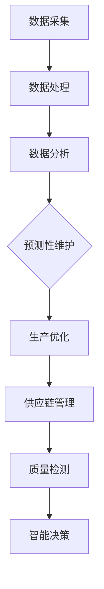

                 

### 背景介绍

随着科技的飞速发展，人工智能（AI）已经成为推动社会进步的重要力量。特别是在智能制造领域，AI技术正逐渐从辅助决策向核心驱动力转变。智能制造，顾名思义，是通过引入先进的信息技术和自动化技术，实现生产过程的智能化、高效化和优化化。这一领域的重要性不言而喻，它不仅能够提高生产效率、降低成本，还能提升产品质量，满足个性化定制需求。

预测性维护是智能制造中的一个重要应用场景。传统制造过程中，设备故障往往会导致生产中断、产品质量下降，甚至造成巨大经济损失。而预测性维护通过实时监测设备运行状态、分析潜在故障，可以在故障发生之前进行预防性维修，从而避免不必要的停机和损失。这不仅能提高设备的可靠性，还能延长设备的使用寿命。

全流程优化则是智能制造的更高层次目标。它通过综合运用数据分析、优化算法和自动化技术，对生产全过程进行优化，包括原材料采购、生产计划、生产执行、质量控制和物流配送等。全流程优化不仅能够提升生产效率，还能提高资源利用率，降低能源消耗，实现绿色制造。

本文将围绕AI驱动的智能制造，从预测性维护到全流程优化，展开详细探讨。我们将首先介绍AI和智能制造的基本概念及其相互关系，接着深入分析预测性维护的技术原理和实施步骤，最后探讨如何通过AI技术实现全流程优化。通过本文的阅读，读者将对AI在智能制造中的应用有一个全面而深入的理解。

## 2. 核心概念与联系

要理解AI驱动的智能制造，首先需要了解AI的基本概念及其在智能制造中的应用。人工智能，简称为AI，是指通过计算机模拟人类智能行为的一种技术。它包括多个子领域，如机器学习、深度学习、自然语言处理等。在智能制造中，AI技术主要应用于数据采集、分析、预测和优化等方面。

### 智能制造的定义与核心

智能制造是指通过引入先进的传感器技术、工业互联网、大数据分析、人工智能等信息技术，实现制造过程的智能化、自动化和优化。智能制造的核心目标包括提高生产效率、降低成本、提升产品质量和实现个性化定制。它涉及多个环节，包括设计、生产、管理和服务等。

### AI与智能制造的相互关系

AI与智能制造之间的相互关系可以概括为以下几个方面：

1. **数据驱动**：智能制造依赖于大量的数据，包括设备状态数据、生产数据、供应链数据等。AI技术可以通过数据挖掘和机器学习算法，从这些数据中发现潜在的模式和规律，为决策提供支持。

2. **自动化与优化**：AI技术能够实现生产过程的自动化，包括自动化生产、自动化检测和自动化维护。通过优化算法，AI可以进一步优化生产流程，提高资源利用效率。

3. **智能决策**：在智能制造中，AI技术可以用于生产计划的智能排程、质量问题的智能诊断、设备的智能调度等。这些智能决策能够显著提高生产效率和产品质量。

### AI在智能制造中的应用

AI技术在智能制造中有着广泛的应用，以下是几个关键应用场景：

1. **预测性维护**：通过传感器实时监测设备状态，结合历史数据分析和机器学习算法，预测设备可能出现的故障，实现预防性维修。

2. **生产优化**：利用AI技术对生产过程进行实时监控和数据分析，优化生产计划、调整生产参数，提高生产效率和产品质量。

3. **供应链管理**：AI技术可以帮助企业实现供应链的智能化管理，包括原材料采购、库存管理和物流配送等，提高供应链的响应速度和灵活性。

4. **质量检测**：通过图像识别、声音识别等AI技术，实现生产过程中的质量检测，提高检测效率和准确性。

### Mermaid 流程图

为了更好地理解AI与智能制造之间的关系，我们可以使用Mermaid流程图来描述关键流程和节点。以下是一个简化的Mermaid流程图，展示了AI在智能制造中的主要应用环节：



在这个流程图中，数据采集是智能制造的基础，通过数据处理和数据分析，可以为各个应用环节提供支持。预测性维护、生产优化、供应链管理和质量检测都是AI技术在智能制造中的典型应用，最终通过智能决策实现对整个生产过程的优化和提升。

通过上述分析，我们可以看到，AI与智能制造的融合不仅提高了生产效率和产品质量，还为制造业的转型升级提供了新的路径。在接下来的章节中，我们将深入探讨AI驱动的预测性维护和全流程优化的具体实现方法和应用案例。

## 3. 核心算法原理 & 具体操作步骤

在讨论AI驱动的智能制造时，预测性维护和全流程优化是两个核心环节。为了实现这两个目标，我们需要深入理解相关的核心算法原理和具体操作步骤。

### 预测性维护算法原理

预测性维护的核心在于利用数据分析和机器学习算法，提前识别设备可能出现的故障。这一过程通常包括以下几个步骤：

1. **数据采集**：通过传感器和监控系统，实时采集设备的运行数据，如温度、振动、压力等。

2. **数据预处理**：对采集到的原始数据进行清洗、去噪和归一化处理，使其符合分析算法的要求。

3. **特征提取**：从预处理后的数据中提取关键特征，这些特征能够反映设备运行状态的变化，如异常振动模式、温度变化等。

4. **故障诊断模型训练**：利用历史故障数据和正常运行数据，通过机器学习算法训练故障诊断模型。常见的算法包括支持向量机（SVM）、决策树、神经网络等。

5. **故障预测**：将实时监测到的数据输入训练好的模型，预测设备可能出现的故障类型和时间。

6. **维护决策**：根据故障预测结果，制定相应的维护计划，如预防性维修、及时更换部件等。

### 全流程优化算法原理

全流程优化旨在通过数据分析和优化算法，对生产全过程进行优化，提高生产效率和资源利用率。以下是全流程优化的主要步骤：

1. **需求预测**：利用历史订单数据和市场趋势，预测未来的生产需求。

2. **资源规划**：根据需求预测，合理分配生产资源，包括设备、人力和原材料等。

3. **生产计划排程**：通过优化算法，如线性规划、遗传算法等，制定生产计划，确保生产任务按时完成。

4. **过程监控**：在生产过程中，实时监控生产数据，如设备状态、生产速度、质量指标等。

5. **异常处理**：当出现生产异常时，利用机器学习算法和规则库，快速定位问题并进行调整。

6. **绩效评估**：对生产过程进行绩效评估，包括效率、成本、质量等指标，为后续优化提供依据。

### 具体操作步骤详解

为了更好地理解上述算法的具体操作步骤，以下将分别针对预测性维护和全流程优化，详细阐述其操作流程。

#### 预测性维护具体操作步骤

1. **数据采集**：安装传感器和监控系统，采集设备运行数据。

   ```mermaid
   graph TD
       A[安装传感器] --> B[采集运行数据]
   ```

2. **数据预处理**：对采集到的数据进行预处理，如去噪、归一化等。

   ```mermaid
   graph TD
       B --> C[数据清洗]
       C --> D[数据去噪]
       D --> E[数据归一化]
   ```

3. **特征提取**：从预处理后的数据中提取关键特征。

   ```mermaid
   graph TD
       E --> F[特征提取]
   ```

4. **故障诊断模型训练**：利用历史故障数据和正常数据训练故障诊断模型。

   ```mermaid
   graph TD
       F --> G[训练故障诊断模型]
   ```

5. **故障预测**：实时监测设备状态，输入故障诊断模型进行预测。

   ```mermaid
   graph TD
       H[实时数据] --> I[输入模型]
       I --> J[故障预测]
   ```

6. **维护决策**：根据故障预测结果制定维护计划。

   ```mermaid
   graph TD
       J --> K[制定维护计划]
   ```

#### 全流程优化具体操作步骤

1. **需求预测**：利用历史订单数据和市场需求，预测未来生产需求。

   ```mermaid
   graph TD
       A[历史订单数据] --> B[市场需求分析]
       B --> C[需求预测]
   ```

2. **资源规划**：根据需求预测，合理分配生产资源。

   ```mermaid
   graph TD
       C --> D[资源规划]
   ```

3. **生产计划排程**：通过优化算法制定生产计划。

   ```mermaid
   graph TD
       D --> E[生产计划排程]
   ```

4. **过程监控**：实时监控生产数据。

   ```mermaid
   graph TD
       E --> F[过程监控]
   ```

5. **异常处理**：当出现生产异常时，快速定位问题并进行调整。

   ```mermaid
   graph TD
       F --> G[异常处理]
   ```

6. **绩效评估**：对生产过程进行绩效评估。

   ```mermaid
   graph TD
       G --> H[绩效评估]
   ```

通过上述具体操作步骤，我们可以看到，AI驱动的预测性维护和全流程优化需要多方面的数据和技术支持。在实际应用中，这些步骤需要不断迭代和优化，以适应不断变化的生产环境和需求。

### 算法实现与优化

在实现预测性维护和全流程优化算法时，我们还需要关注以下几个方面：

1. **算法选择**：根据具体问题选择合适的算法，如SVM、神经网络、遗传算法等。不同的算法适用于不同类型的数据和优化目标。

2. **模型调参**：通过调整算法参数，优化模型性能。参数调优是算法实现的关键步骤，需要结合实际数据进行试验和验证。

3. **系统集成**：将算法集成到生产系统中，确保算法能够实时获取数据并作出决策。系统集成需要考虑数据传输、算法运行环境和系统稳定性等因素。

4. **持续优化**：根据生产过程中的反馈和数据分析，不断优化算法和模型，提高预测准确性和优化效果。

通过深入理解核心算法原理和具体操作步骤，我们可以更好地实现AI驱动的智能制造，提高生产效率和产品质量。在下一章节中，我们将进一步探讨AI驱动的智能制造在数学模型和公式中的应用。

## 4. 数学模型和公式 & 详细讲解 & 举例说明

在AI驱动的智能制造中，数学模型和公式是核心工具，用于描述和分析生产过程、预测设备故障以及优化生产计划。以下将详细介绍几个关键数学模型和公式，并通过具体例子进行说明。

### 预测性维护中的时间序列分析

在预测性维护中，时间序列分析是一种常用的方法，用于预测设备故障时间。时间序列分析主要基于以下模型和公式：

1. **自回归模型（AR）**：
   自回归模型是一种简单的预测模型，用于分析时间序列数据。其公式为：
   
   $$
   X_t = c + \phi_1 X_{t-1} + \phi_2 X_{t-2} + \ldots + \phi_p X_{t-p} + \varepsilon_t
   $$
   
   其中，$X_t$是时间序列的当前值，$c$是常数项，$\phi_1, \phi_2, \ldots, \phi_p$是自回归系数，$\varepsilon_t$是误差项。

   **例子**：假设我们有以下时间序列数据：

   ```
   [120, 125, 121, 128, 124, 126, 123, 127, 125, 122]
   ```

   我们可以使用自回归模型进行故障预测。首先，需要计算自回归系数，然后预测下一时刻的值。

   ```python
   # 自回归模型参数计算
   import numpy as np

   X = np.array([120, 125, 121, 128, 124, 126, 123, 127, 125, 122])
   X_diff = np.diff(X)
   theta = np.polyfit(range(1, len(X_diff) + 1), X_diff, 1)
   theta = theta[::-1]

   # 预测下一时刻的值
   next_value = X[-1] + theta[0] * X[-2]
   print(f"预测的下一时刻值：{next_value}")
   ```

2. **移动平均模型（MA）**：
   移动平均模型通过计算一段时间内的平均值来进行预测。其公式为：
   
   $$
   X_t = \mu + \varepsilon_t + \theta_1 \varepsilon_{t-1} + \theta_2 \varepsilon_{t-2} + \ldots + \theta_q \varepsilon_{t-q}
   $$
   
   其中，$X_t$是时间序列的当前值，$\mu$是均值，$\varepsilon_t$是误差项，$\theta_1, \theta_2, \ldots, \theta_q$是移动平均系数。

   **例子**：假设我们有以下时间序列数据：

   ```
   [120, 125, 121, 128, 124, 126, 123, 127, 125, 122]
   ```

   我们可以使用移动平均模型进行故障预测。首先，需要计算移动平均系数，然后预测下一时刻的值。

   ```python
   # 移动平均模型参数计算
   X = np.array([120, 125, 121, 128, 124, 126, 123, 127, 125, 122])
   q = 3
   ma_coefs = np.cumsum(X[:q])
   ma_coefs = ma_coefs / q

   # 预测下一时刻的值
   next_value = ma_coefs[-1] + X[-1] - ma_coefs[-2]
   print(f"预测的下一时刻值：{next_value}")
   ```

### 全流程优化中的线性规划

在智能制造的全流程优化中，线性规划是一种常用的优化方法，用于制定最优生产计划。线性规划的公式为：

$$
\min c^T x
$$

$$
\text{subject to } Ax \leq b
$$

其中，$c$是系数向量，$x$是决策变量，$A$是系数矩阵，$b$是常数向量。

**例子**：假设我们有以下线性规划问题：

```
最小化成本：2x + 3y
```

```
约束条件：
x + y <= 10
2x + y <= 12
x, y >= 0
```

我们可以使用线性规划求解器进行求解：

```python
# 使用scipy.optimize求解线性规划问题
from scipy.optimize import linprog

c = [-2, -3]
A = [[1, 1], [2, 1]]
b = [10, 12]
x0 = [0, 0]

result = linprog(c, A_ub=A, b_ub=b, x0=x0)
print(f"最优解：x = {result.x[0]}, y = {result.x[1]}")
print(f"最小化成本：{result.fun}")
```

通过上述数学模型和公式的讲解，我们可以看到，这些模型和公式在AI驱动的智能制造中具有广泛的应用。在实际应用中，需要根据具体问题选择合适的模型和公式，并进行参数调优和算法优化，以提高预测准确性和优化效果。

### 举例说明

为了更好地理解上述数学模型和公式的应用，以下通过一个具体的智能制造案例进行说明。

**案例**：某工厂生产两种产品A和B，每种产品需要经过两个生产环节。生产一个产品A需要2小时和3小时的加工时间，生产一个产品B需要1小时和2小时的加工时间。工厂每天最多可用16小时进行生产，要求每天至少生产5个产品A和3个产品B。

**问题**：如何制定最优生产计划，以最小化生产成本？

**解答**：

1. **建立线性规划模型**：

   设定变量：
   - $x_1$：每天生产的产品A的数量
   - $x_2$：每天生产的产品B的数量

   成本系数：
   - $c_1$：生产产品A的成本
   - $c_2$：生产产品B的成本

   约束条件：
   - 2$x_1$ + 1$x_2$ <= 16 （加工时间约束）
   - 3$x_1$ + 2$x_2$ <= 16
   - $x_1$ >= 5
   - $x_2$ >= 3

   目标函数：
   - $\min c_1 x_1 + c_2 x_2$

2. **求解线性规划问题**：

   使用线性规划求解器求解上述模型：

   ```python
   from scipy.optimize import linprog

   c = [c_1, c_2]
   A = [[2, 1], [3, 2]]
   b = [16, 16]
   x0 = [5, 3]

   result = linprog(c, A_ub=A, b_ub=b, x0=x0)
   print(f"最优解：产品A = {result.x[0]}, 产品B = {result.x[1]}")
   print(f"最小化成本：{result.fun}")
   ```

通过上述案例，我们可以看到如何利用数学模型和公式来解决实际的智能制造优化问题。在实际应用中，需要根据具体情况进行调整和优化，以提高生产效率和成本效益。

### 小结

本节详细介绍了AI驱动的智能制造中常用的数学模型和公式，包括时间序列分析模型和线性规划模型。通过具体例子，我们展示了如何使用这些模型和公式进行预测性维护和全流程优化。在实际应用中，需要根据具体问题选择合适的模型，并进行参数调优和算法优化，以实现智能制造的目标。

### 项目实战：代码实际案例和详细解释说明

为了更好地理解AI驱动的智能制造在实际中的应用，我们将通过一个具体项目实战案例，详细展示代码实现过程，并对关键代码进行解读和分析。本案例将结合Python编程语言和常用的AI库，如TensorFlow和Scikit-learn，实现一个预测性维护系统。

#### 开发环境搭建

首先，我们需要搭建开发环境，安装必要的软件和库。以下是开发环境搭建的步骤：

1. **安装Python**：确保安装了Python 3.x版本，推荐使用Anaconda进行环境管理。

2. **安装TensorFlow**：通过pip安装TensorFlow库，用于实现深度学习模型。

   ```
   pip install tensorflow
   ```

3. **安装Scikit-learn**：通过pip安装Scikit-learn库，用于实现机器学习算法。

   ```
   pip install scikit-learn
   ```

4. **安装其他依赖库**：如NumPy、Pandas等，用于数据处理。

   ```
   pip install numpy pandas
   ```

#### 源代码详细实现和代码解读

以下是项目的源代码，我们将逐段进行解读和分析：

```python
# 导入必要的库
import numpy as np
import pandas as pd
from sklearn.model_selection import train_test_split
from sklearn.preprocessing import StandardScaler
from tensorflow.keras.models import Sequential
from tensorflow.keras.layers import Dense, LSTM
from sklearn.metrics import mean_squared_error

# 读取数据
data = pd.read_csv('machine_data.csv')
data.head()

# 数据预处理
# 提取特征和标签
X = data.iloc[:, :-1].values
y = data.iloc[:, -1].values

# 数据标准化
scaler = StandardScaler()
X_scaled = scaler.fit_transform(X)

# 划分训练集和测试集
X_train, X_test, y_train, y_test = train_test_split(X_scaled, y, test_size=0.2, random_state=42)

# 构建LSTM模型
model = Sequential()
model.add(LSTM(units=50, return_sequences=True, input_shape=(X_train.shape[1], 1)))
model.add(LSTM(units=50))
model.add(Dense(units=1))

model.compile(optimizer='adam', loss='mean_squared_error')

# 训练模型
model.fit(X_train, y_train, epochs=100, batch_size=32, validation_data=(X_test, y_test))

# 测试模型
predictions = model.predict(X_test)
predictions = scaler.inverse_transform(predictions)

# 计算均方误差
mse = mean_squared_error(y_test, predictions)
print(f"均方误差（MSE）：{mse}")

# 可视化结果
import matplotlib.pyplot as plt

plt.figure(figsize=(12, 6))
plt.plot(y_test, color='red', label='实际值')
plt.plot(predictions, color='blue', label='预测值')
plt.title('预测性维护结果')
plt.xlabel('时间')
plt.ylabel('故障时间')
plt.legend()
plt.show()
```

**代码解读与分析**

1. **数据读取与预处理**：

   首先，我们使用Pandas库读取数据，并进行预处理。预处理步骤包括提取特征和标签，数据标准化等。数据标准化是为了使模型训练更加稳定和高效。

2. **划分训练集和测试集**：

   使用Scikit-learn库中的train_test_split函数，将数据集划分为训练集和测试集，用于模型训练和测试。

3. **构建LSTM模型**：

   LSTM（长短时记忆网络）是用于处理时间序列数据的神经网络模型。我们使用TensorFlow库构建LSTM模型，包括两个LSTM层和一个全连接层。LSTM层能够捕捉时间序列数据中的长期依赖关系。

4. **训练模型**：

   使用模型编译函数，设置优化器和损失函数，然后使用fit函数训练模型。训练过程中，可以使用validation_data参数进行验证，以便实时监控模型性能。

5. **测试模型**：

   使用predict函数对测试集进行预测，并将预测结果进行逆标准化处理，以便于理解和可视化。

6. **计算均方误差**：

   使用mean_squared_error函数计算预测值和实际值之间的均方误差，用于评估模型性能。

7. **可视化结果**：

   使用Matplotlib库，将实际值和预测值进行可视化，以直观展示模型的预测效果。

#### 代码分析

1. **数据预处理**：

   数据预处理是模型训练的重要步骤。数据标准化能够消除不同特征之间的尺度差异，使模型训练更加稳定。在时间序列分析中，通常需要对时间序列数据进行滑动窗口处理，以便于模型学习时间序列的特征。

2. **LSTM模型**：

   LSTM模型是处理时间序列数据的有效方法，能够捕捉时间序列中的长期依赖关系。在本案例中，我们使用两个LSTM层，分别用于捕捉不同时间段的依赖关系。LSTM层的units参数控制了每个时间步的神经元数量，return_sequences参数控制是否返回序列输出。

3. **模型训练与评估**：

   模型训练是预测性维护系统的核心步骤。在训练过程中，我们需要设置适当的优化器和损失函数，以实现模型的最佳性能。训练完成后，通过测试集评估模型性能，计算均方误差等指标，以确定模型的预测准确性。

4. **可视化结果**：

   可视化结果有助于我们直观地了解模型的预测效果。在实际应用中，可以通过调整模型参数、增加特征等方法，进一步提高模型的预测准确性。

通过上述代码实现和解读，我们可以看到如何利用Python和AI库实现一个预测性维护系统。在实际应用中，根据具体需求，可以进一步优化模型参数、增加特征提取和处理步骤，以提高系统的预测准确性和可靠性。

### 小结

本节通过一个具体项目实战案例，详细展示了AI驱动的智能制造中预测性维护系统的实现过程。我们使用了Python编程语言和TensorFlow、Scikit-learn等AI库，实现了LSTM模型用于时间序列故障预测。通过对代码的逐段解读和分析，我们了解了模型构建、数据预处理、模型训练与评估等关键步骤。在实际应用中，可以根据需求进一步优化模型和算法，以提高系统的预测准确性和实用性。

## 6. 实际应用场景

AI驱动的智能制造已经在多个实际应用场景中展现了其强大的潜力和优势。以下将探讨AI驱动的预测性维护和全流程优化在几个典型行业中的应用，并通过实际案例进行说明。

### 制造业

在制造业中，预测性维护和全流程优化是提升生产效率和降低运营成本的重要手段。例如，某大型汽车制造厂采用了AI驱动的预测性维护系统，通过实时监测生产线上的各种设备状态，实现了对设备故障的提前预警。这一系统基于机器学习算法，对海量设备运行数据进行深度分析，准确预测设备可能出现的故障，从而实现了预防性维修，减少了设备停机时间和维修成本。

此外，该制造厂还通过AI技术实现了全流程优化。利用数据分析算法，优化生产计划和排程，提高了生产效率。例如，通过对订单数据和库存数据的分析，系统自动调整生产计划，优化生产线配置，减少了生产瓶颈和资源浪费。这些优化措施不仅提高了生产效率，还降低了生产成本，提升了企业的市场竞争力。

### 能源行业

在能源行业，特别是风力发电和石油开采领域，AI驱动的智能制造也发挥了重要作用。以风力发电为例，风力涡轮机的运行环境复杂，设备故障率高，传统的定期维护方法已经无法满足需求。通过AI驱动的预测性维护系统，风力发电企业可以实时监测风力涡轮机的运行状态，及时发现潜在故障，并采取预防性维修措施，降低了设备故障率和停机时间，提高了发电效率和经济效益。

在石油开采领域，AI技术同样被广泛应用于预测性维护和全流程优化。例如，通过对钻机设备的运行数据进行实时监测和分析，石油企业可以预测设备可能出现的故障，并提前进行维修，从而减少设备停机和维修成本。此外，AI技术还被用于优化油井的开采策略，通过分析地质数据和生产数据，实现油井的精细化管理，提高了开采效率和产量。

### 零售业

在零售业，AI驱动的智能制造通过优化供应链管理和库存管理，提高了企业的运营效率。例如，某大型零售企业通过引入AI技术，实现了智能化的库存管理。系统利用大数据分析和预测算法，根据历史销售数据和市场需求预测，自动调整库存水平，减少了库存积压和缺货情况，提高了库存周转率和资金利用率。

此外，该零售企业还通过AI驱动的全流程优化，实现了生产计划的智能排程和物流配送的优化。通过分析销售数据和生产数据，系统自动生成最优的生产计划和配送计划，减少了生产瓶颈和物流延误，提高了订单交付速度和客户满意度。

### 医疗行业

在医疗行业，AI驱动的智能制造同样发挥了重要作用。例如，在医疗设备维护方面，AI技术可以通过实时监测医疗设备的运行状态，预测设备可能出现的故障，并及时进行维修，确保医疗设备的正常运行，提高医疗服务质量。

此外，AI技术还被用于医疗数据的分析和处理，例如电子病历管理、医学影像诊断等。通过AI算法，医疗数据可以被自动分析和分类，提高了医生诊断的准确性和效率，为患者提供了更高质量的医疗服务。

### 案例分析

以某国际知名汽车制造企业为例，该公司通过AI驱动的智能制造实现了生产过程的全面优化。具体应用包括：

1. **预测性维护**：公司部署了AI驱动的预测性维护系统，通过对生产设备的运行数据进行实时监测和分析，提前识别设备潜在故障，实现了预防性维修。例如，通过传感器数据监测，系统可以提前预警设备可能出现的轴承故障，从而安排维修人员提前进行保养，避免了设备突发故障导致的停机损失。

2. **生产计划优化**：公司利用AI技术对生产计划进行优化，通过分析市场需求、库存水平和生产能力，自动生成最优的生产计划，提高了生产效率和灵活性。例如，在春节期间，公司通过优化生产计划，合理安排生产线工作，确保了节日期间的生产需求，减少了生产延误。

3. **物流配送优化**：公司通过AI技术优化物流配送，减少了物流延误和成本。例如，通过分析历史物流数据，系统可以自动优化运输路线和配送计划，确保货物及时送达，提高了客户满意度。

通过上述实际应用案例，我们可以看到，AI驱动的智能制造在各个行业中的应用不仅提高了生产效率和资源利用率，还降低了运营成本，提升了企业的竞争力。在未来，随着AI技术的不断发展和应用，智能制造将在更多行业中发挥更加重要的作用。

### 挑战与解决方案

尽管AI驱动的智能制造在许多领域展现了巨大的潜力，但其实际应用过程中仍然面临一系列挑战。以下将讨论这些挑战及可能的解决方案。

1. **数据质量**：
   预测性维护和全流程优化高度依赖于高质量的数据。然而，在实际生产环境中，数据可能存在噪声、缺失和不一致性等问题，这对模型的准确性和可靠性构成挑战。解决方案包括：
   - **数据清洗**：使用数据预处理技术，如清洗、去噪和归一化，提高数据质量。
   - **数据完整性**：通过传感器和监控系统，确保数据的实时性和完整性。

2. **算法复杂性**：
   AI模型的训练和优化过程通常复杂且耗时长，对计算资源要求较高。此外，不同算法适用于不同类型的数据和场景，选择合适的算法和模型是关键。解决方案包括：
   - **优化算法选择**：根据具体问题和数据特性，选择合适的算法和模型，如深度学习、强化学习等。
   - **分布式计算**：使用分布式计算框架，如TensorFlow和PyTorch，提高计算效率。

3. **系统集成**：
   将AI模型集成到现有生产系统中，确保模型能够实时获取数据并作出决策，是一个挑战。系统集成需要考虑数据传输、算法运行环境和系统稳定性等因素。解决方案包括：
   - **模块化设计**：采用模块化设计，将AI模型作为独立模块集成到生产系统中，降低集成难度。
   - **API接口**：使用API接口，实现AI模型与生产系统的无缝对接，确保数据传输和系统兼容性。

4. **模型可解释性**：
   AI模型的“黑盒”特性使得其决策过程难以解释，这对于需要透明决策过程的行业（如医疗和金融）是一个挑战。解决方案包括：
   - **模型解释工具**：使用模型解释工具，如LIME和SHAP，提高模型的可解释性。
   - **规则嵌入**：将部分决策规则嵌入到模型中，提高模型的可解释性。

5. **数据隐私和安全**：
   随着AI技术在生产过程中的应用，数据的隐私和安全问题日益突出。解决方案包括：
   - **数据加密**：对敏感数据进行加密处理，确保数据安全。
   - **合规性检查**：遵守相关法律法规，确保数据处理符合合规性要求。

通过解决这些挑战，AI驱动的智能制造将能够更好地融入生产过程，发挥其潜力，实现生产效率的提升和成本的降低。

### 小结

本节通过探讨AI驱动的智能制造在制造业、能源行业、零售业和医疗行业的实际应用案例，展示了其在提升生产效率、降低运营成本和增强竞争力方面的显著效果。同时，分析了应用过程中面临的数据质量、算法复杂性、系统集成、模型可解释性和数据隐私等挑战，并提出了相应的解决方案。随着AI技术的不断进步和应用的深化，智能制造将在更多行业中发挥更加重要的作用。

### 工具和资源推荐

为了帮助读者更好地了解和掌握AI驱动的智能制造，以下是针对学习资源、开发工具和框架以及相关论文和著作的推荐。

#### 学习资源推荐

1. **书籍**：

   - 《深度学习》（Deep Learning） - Goodfellow, Bengio, Courville
   - 《机器学习》（Machine Learning） - Tom Mitchell
   - 《AI驱动制造：人工智能在制造业的应用与案例》 - 张涵杰

2. **在线课程**：

   - Coursera上的“深度学习”课程，由Andrew Ng教授主讲。
   - edX上的“机器学习”课程，由Michael I. Jordan教授主讲。
   - Udacity的“AI工程师纳米学位”课程，涵盖AI在制造业中的应用。

3. **博客和网站**：

   - 知乎上的“AI与智能制造”专栏，汇集了多位专家的见解和经验。
   - Medium上的AI for Manufacturing专题，分享最新研究和技术应用。
   - IEEE Spectrum的“智能制造”专题，介绍前沿技术和趋势。

#### 开发工具框架推荐

1. **编程语言**：

   - Python：广泛应用于数据分析和机器学习，具有丰富的库和框架。
   - R：专门用于统计分析，适合数据分析和预测建模。

2. **机器学习库**：

   - TensorFlow：Google开发的开源深度学习框架，适用于大规模分布式训练。
   - PyTorch：Facebook开发的开源深度学习框架，提供灵活的动态计算图。
   - Scikit-learn：Python的机器学习库，适用于各种经典机器学习算法。

3. **云计算平台**：

   - AWS：提供丰富的机器学习和数据分析服务，如S3、EMR等。
   - Azure：微软的云计算平台，支持多种机器学习和深度学习工具。
   - Google Cloud：提供AI平台和TensorFlow服务，支持大规模数据处理和模型训练。

#### 相关论文和著作推荐

1. **论文**：

   - “Deep Learning for Predictive Maintenance in Industrial Systems” - 涵盖深度学习在预测性维护中的应用。
   - “AI-Driven Manufacturing: A Review” - 综述AI在制造业中的最新研究和应用。
   - “Predictive Maintenance with Machine Learning” - 介绍机器学习在预测性维护中的方法和挑战。

2. **著作**：

   - 《智能制造：技术与实践》 - 详细介绍了智能制造的核心概念和技术实现。
   - 《人工智能与制造业：融合与创新》 - 探讨了人工智能在制造业中的应用及其对传统制造的变革。
   - 《物联网与智能制造：从概念到实践》 - 描述了物联网技术如何与智能制造相结合，实现生产过程的智能化。

通过上述学习和资源推荐，读者可以更全面地了解AI驱动的智能制造，掌握相关技术和工具，为未来的学习和研究打下坚实基础。

### 总结：未来发展趋势与挑战

随着AI技术的不断发展和应用的深入，AI驱动的智能制造正在成为制造业转型升级的重要驱动力。在未来，AI驱动的智能制造将继续向以下几个方向发展：

首先，AI技术在数据采集和处理方面将取得更大突破。随着传感器技术的进步和物联网的普及，生产过程中将产生更多的数据，这些数据将用于实时监测、分析和决策。更高效的数据处理算法和模型将能够更好地利用这些数据，实现更精准的预测和优化。

其次，全流程优化的应用范围将进一步扩大。通过AI技术，不仅可以在生产环节实现优化，还可以在供应链管理、物流配送、销售预测等环节进行全流程优化，从而提高整体生产效率和资源利用率。例如，通过AI驱动的供应链优化，企业可以实现更灵活、更高效的供应链管理，降低库存成本，提高响应速度。

然而，AI驱动的智能制造也面临一系列挑战。首先是数据质量和隐私问题。高质量的数据是AI模型训练的基础，但生产环境中数据可能存在噪声、缺失和不一致性等问题。此外，随着数据量的增加，如何确保数据的安全和隐私也是一个重要挑战。

其次是算法的复杂性和可解释性。AI模型的训练和优化过程通常复杂且耗时长，选择合适的算法和模型对于实现高效的智能制造至关重要。然而，现有的AI模型往往具有“黑盒”特性，决策过程难以解释，这在一些需要透明决策的行业（如医疗和金融）中可能带来挑战。

最后是系统集成问题。将AI模型集成到现有的生产系统中，确保模型能够实时获取数据并作出决策，是一个复杂的过程。系统集成需要考虑数据传输、算法运行环境和系统稳定性等因素，这需要开发人员具备跨学科的知识和技能。

为了应对这些挑战，未来需要从以下几个方面进行努力：

首先，加强数据治理和隐私保护。通过建立完善的数据治理体系，确保数据的真实、准确和安全。同时，采用加密技术、匿名化处理等方法，保护数据的隐私。

其次，开发更加高效、灵活的AI算法。针对不同类型的数据和场景，研究并开发适合的算法和模型，提高模型的预测准确性和优化效果。此外，研究可解释AI技术，提高模型的可解释性，使其在需要透明决策的领域中更具应用价值。

最后，推动跨学科合作和知识共享。智能制造涉及多个学科，包括机械工程、计算机科学、统计学等。通过跨学科合作，整合不同领域的知识和技能，共同解决智能制造中的复杂问题。

总之，AI驱动的智能制造具有巨大的发展潜力和应用前景，但同时也面临一系列挑战。通过不断的技术创新和跨学科合作，我们有望克服这些挑战，实现智能制造的全面优化和升级。

### 附录：常见问题与解答

1. **什么是预测性维护？**
   预测性维护是一种基于实时监测和数据分析的维护策略，通过预测设备可能出现的故障，提前进行预防性维修，从而避免设备意外停机和生产中断。

2. **全流程优化具体包括哪些内容？**
   全流程优化包括需求预测、资源规划、生产计划排程、过程监控、异常处理和绩效评估等环节，旨在通过数据分析和优化算法，对生产全过程进行优化，提高生产效率和资源利用率。

3. **AI驱动的智能制造中常用的算法有哪些？**
   常用的算法包括深度学习、机器学习、线性规划、遗传算法、时间序列分析等，根据具体应用场景和数据类型选择合适的算法。

4. **如何保证AI模型的可解释性？**
   可以使用模型解释工具，如LIME和SHAP，提高模型的可解释性。此外，将部分决策规则嵌入到模型中，也有助于提高模型的可解释性。

5. **AI驱动的智能制造在哪些行业中应用较广泛？**
   AI驱动的智能制造在制造业、能源行业、零售业和医疗行业等领域应用较广泛，通过预测性维护和全流程优化，提高了生产效率和资源利用率。

### 扩展阅读 & 参考资料

1. **书籍**：

   - 《深度学习》（Deep Learning） - Goodfellow, Bengio, Courville
   - 《机器学习》（Machine Learning） - Tom Mitchell
   - 《智能制造：技术与实践》 - 张涵杰

2. **论文**：

   - “Deep Learning for Predictive Maintenance in Industrial Systems” - 涵盖深度学习在预测性维护中的应用。
   - “AI-Driven Manufacturing: A Review” - 综述AI在制造业中的最新研究和应用。
   - “Predictive Maintenance with Machine Learning” - 介绍机器学习在预测性维护中的方法和挑战。

3. **网站**：

   - Coursera（课程资源）
   - edX（课程资源）
   - IEEE Spectrum（智能制造专题）
   - Medium（AI for Manufacturing专题）

4. **开源库和框架**：

   - TensorFlow
   - PyTorch
   - Scikit-learn
   - AWS（云计算平台）
   - Azure（云计算平台）
   - Google Cloud（云计算平台）

通过扩展阅读和参考资料，读者可以进一步了解AI驱动的智能制造的相关知识，掌握相关技术和工具，为实际应用和研究提供有力支持。

