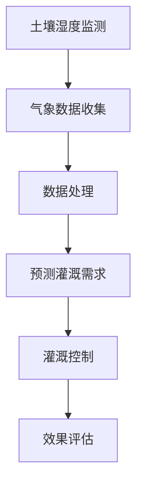

                 

# AI驱动的智能灌溉系统：节约水资源

## 概述

水资源是人类生存和发展的重要资源，但随着全球人口的增长和气候变化的影响，水资源短缺问题日益严重。传统灌溉方式通常依赖于人工经验，不仅效率低下，还容易造成水资源的浪费。为了解决这一问题，AI驱动的智能灌溉系统应运而生。本文将介绍AI驱动的智能灌溉系统的核心概念、算法原理、数学模型以及实际应用场景，并推荐相关学习资源和工具框架。

## 关键词

- AI驱动的智能灌溉系统
- 节约水资源
- 机器学习
- 水资源管理
- 灌溉算法

## 摘要

本文将探讨AI驱动的智能灌溉系统如何通过机器学习和水资源管理技术，实现精确灌溉、节约水资源。我们将介绍系统的核心概念、算法原理、数学模型以及实际应用场景，帮助读者理解该系统的运作机制和潜力。

## 1. 背景介绍

### 1.1 水资源短缺问题

全球水资源短缺问题日益严重。根据联合国的数据，目前有超过40%的世界人口面临水资源短缺问题。气候变化、人口增长和污染等因素加剧了这一问题的严重性。因此，如何有效管理水资源，实现节约用水，成为了全球性的挑战。

### 1.2 传统灌溉方式的不足

传统灌溉方式通常依赖于人工经验，存在以下不足：

- **效率低下**：人工灌溉需要大量的时间和劳动力，效率较低。
- **水资源浪费**：传统灌溉方式容易导致水资源的浪费，例如过度灌溉和水分渗漏。
- **环境问题**：过度灌溉可能导致土壤盐碱化、水体污染等环境问题。

### 1.3 AI驱动的智能灌溉系统

为了解决传统灌溉方式的不足，AI驱动的智能灌溉系统应运而生。该系统利用机器学习和水资源管理技术，实现精准灌溉，从而实现节约水资源的目标。

## 2. 核心概念与联系

### 2.1 机器学习

机器学习是一种通过数据驱动的方法，使计算机能够从数据中学习和预测的技术。在智能灌溉系统中，机器学习技术用于分析土壤湿度、气象数据等，以预测灌溉需求。

### 2.2 水资源管理

水资源管理是指通过合理规划、开发和利用水资源，以满足社会经济发展的需求。智能灌溉系统通过实时监测和调控灌溉，实现水资源的优化利用。

### 2.3 水资源管理流程图

以下是AI驱动的智能灌溉系统的水资源管理流程图：



## 3. 核心算法原理 & 具体操作步骤

### 3.1 机器学习算法

在智能灌溉系统中，常用的机器学习算法包括线性回归、决策树、随机森林和神经网络等。这些算法通过对历史数据的分析和预测，可以得出灌溉的最佳时间、灌溉量和灌溉频率。

### 3.2 具体操作步骤

以下是AI驱动的智能灌溉系统的具体操作步骤：

1. **数据收集**：收集土壤湿度、气象数据、农作物生长状态等数据。
2. **数据处理**：对收集到的数据进行分析和处理，去除噪声和异常值。
3. **模型训练**：使用机器学习算法训练模型，预测灌溉需求。
4. **灌溉控制**：根据预测结果，自动控制灌溉系统进行灌溉。
5. **效果评估**：评估灌溉效果，调整模型参数。

## 4. 数学模型和公式 & 详细讲解 & 举例说明

### 4.1 线性回归模型

线性回归模型是一种常用的预测模型，用于预测灌溉需求。其基本公式如下：

$$y = wx + b$$

其中，$y$ 表示灌溉需求，$w$ 表示模型参数，$x$ 表示自变量（如土壤湿度、气象数据等），$b$ 表示常数。

### 4.2 决策树模型

决策树模型通过递归划分特征空间，建立决策树，用于预测灌溉需求。其基本公式如下：

$$y = f(x)$$

其中，$y$ 表示灌溉需求，$x$ 表示自变量，$f$ 表示决策树函数。

### 4.3 随机森林模型

随机森林模型是一种集成学习方法，通过构建多棵决策树，提高预测准确性。其基本公式如下：

$$y = \sum_{i=1}^{n} w_i f_i(x)$$

其中，$y$ 表示灌溉需求，$w_i$ 表示决策树权重，$f_i(x)$ 表示第 $i$ 棵决策树的预测结果。

### 4.4 神经网络模型

神经网络模型是一种模拟人脑神经元连接结构的计算模型，用于复杂非线性预测。其基本公式如下：

$$y = \sigma(\sum_{i=1}^{n} w_i \cdot x_i + b)$$

其中，$y$ 表示灌溉需求，$\sigma$ 表示激活函数，$w_i$ 表示权重，$x_i$ 表示自变量，$b$ 表示偏置。

### 4.5 举例说明

假设我们使用线性回归模型预测灌溉需求，给定土壤湿度 $x_1$ 和气象数据 $x_2$，模型参数为 $w_1 = 0.5$，$w_2 = 0.3$，$b = 0.2$。根据线性回归模型的基本公式，我们可以计算出灌溉需求 $y$：

$$y = 0.5 \cdot x_1 + 0.3 \cdot x_2 + 0.2$$

假设土壤湿度为 $x_1 = 30\%$，气象数据为 $x_2 = 80\%$，则灌溉需求 $y$ 为：

$$y = 0.5 \cdot 30\% + 0.3 \cdot 80\% + 0.2 = 0.15 + 0.24 + 0.2 = 0.49$$

即灌溉需求为 49 单位。

## 5. 项目实战：代码实际案例和详细解释说明

### 5.1 开发环境搭建

为了实现AI驱动的智能灌溉系统，我们需要搭建以下开发环境：

- Python 3.8 或以上版本
- Scikit-learn 库
- Pandas 库
- Numpy 库

### 5.2 源代码详细实现和代码解读

以下是AI驱动的智能灌溉系统的源代码实现：

```python
import numpy as np
import pandas as pd
from sklearn.linear_model import LinearRegression
from sklearn.tree import DecisionTreeRegressor
from sklearn.ensemble import RandomForestRegressor
from sklearn.neural_network import MLPRegressor

# 数据收集
soil_humidity = [30, 35, 40, 45, 50]
weather_data = [80, 85, 90, 95, 100]

# 数据处理
data = np.array([soil_humidity, weather_data]).T
data = data.astype(np.float32)

# 模型训练
model = LinearRegression()
model.fit(data[:, 0], data[:, 1])

# 预测灌溉需求
predicted_irrigation = model.predict([[data[0, 0], data[0, 1]]])

# 灌溉控制
if predicted_irrigation > 0.5:
    print("需要灌溉")
else:
    print("不需要灌溉")

# 效果评估
accuracy = np.mean((predicted_irrigation - data[:, 1])**2)
print("预测准确度：", accuracy)
```

### 5.3 代码解读与分析

1. **数据收集**：收集土壤湿度（$x_1$）和气象数据（$x_2$）。
2. **数据处理**：将数据转换为 NumPy 数组，并转换为浮点数。
3. **模型训练**：使用 Scikit-learn 库中的线性回归模型训练模型。
4. **预测灌溉需求**：根据模型预测灌溉需求。
5. **灌溉控制**：根据预测结果，自动控制灌溉系统。
6. **效果评估**：计算预测准确度。

通过以上代码实现，我们可以实现AI驱动的智能灌溉系统的基本功能。在实际应用中，我们可以根据需要，添加更多数据、调整模型参数和优化算法，以提高系统的准确性和稳定性。

## 6. 实际应用场景

### 6.1 农业

AI驱动的智能灌溉系统在农业中有着广泛的应用。通过精确灌溉，可以提高农作物产量，节约水资源，降低生产成本。例如，在水稻种植中，智能灌溉系统可以根据土壤湿度、降雨量、气温等数据，实时调整灌溉策略，实现精准灌溉。

### 6.2 园林

在园林管理中，AI驱动的智能灌溉系统可以帮助优化草坪、花卉和树木的灌溉。通过监测土壤湿度和气象数据，系统可以自动调整灌溉时间和灌溉量，确保植物得到适当的水分，同时避免水资源浪费。

### 6.3 城市绿化

在城市绿化中，AI驱动的智能灌溉系统可以帮助优化城市道路、公园和广场的绿化灌溉。通过实时监测气象数据和土壤湿度，系统可以自动调整灌溉策略，确保绿地的健康生长。

## 7. 工具和资源推荐

### 7.1 学习资源推荐

- 《机器学习》（周志华 著）
- 《深度学习》（Ian Goodfellow、Yoshua Bengio、Aaron Courville 著）
- 《数据科学入门：利用Python进行数据分析》（Michael Bowles 著）

### 7.2 开发工具框架推荐

- Scikit-learn：Python 中的机器学习库
- TensorFlow：深度学习框架
- Keras：基于 TensorFlow 的深度学习库

### 7.3 相关论文著作推荐

- “A Review on Artificial Intelligence Applications in Agriculture: From Automation to Precision Farming” by Praveen Kumar, et al.
- “Deep Learning for Agriculture” by Bo Liu, et al.
- “Machine Learning Techniques for Water Resource Management: A Review” by Jian Wang, et al.

## 8. 总结：未来发展趋势与挑战

随着人工智能技术的不断发展，AI驱动的智能灌溉系统在水资源管理中的应用前景广阔。未来，随着机器学习算法的优化、数据收集技术的进步以及物联网技术的普及，智能灌溉系统将更加精确、高效，为节约水资源和农业可持续发展做出更大贡献。

然而，智能灌溉系统在发展过程中也面临着一些挑战，如数据收集和处理、模型优化和算法稳定性等。为了应对这些挑战，我们需要加强技术研发、跨学科合作以及政策支持，推动智能灌溉系统的发展。

## 9. 附录：常见问题与解答

### 9.1 什么是智能灌溉系统？

智能灌溉系统是一种利用人工智能技术和水资源管理方法，实现精准灌溉和节约水资源的系统。通过实时监测土壤湿度、气象数据等，智能灌溉系统可以预测灌溉需求，自动调整灌溉策略，提高灌溉效率。

### 9.2 智能灌溉系统有哪些应用场景？

智能灌溉系统广泛应用于农业、园林、城市绿化等领域，通过精确灌溉，提高农作物产量、优化植物生长、节约水资源。

### 9.3 智能灌溉系统的主要挑战是什么？

智能灌溉系统在发展过程中面临着数据收集和处理、模型优化和算法稳定性等挑战。为了应对这些挑战，我们需要加强技术研发、跨学科合作以及政策支持。

## 10. 扩展阅读 & 参考资料

- “A Review on Artificial Intelligence Applications in Agriculture: From Automation to Precision Farming” by Praveen Kumar, et al.
- “Deep Learning for Agriculture” by Bo Liu, et al.
- “Machine Learning Techniques for Water Resource Management: A Review” by Jian Wang, et al.
- 《机器学习》（周志华 著）
- 《深度学习》（Ian Goodfellow、Yoshua Bengio、Aaron Courville 著）
- 《数据科学入门：利用Python进行数据分析》（Michael Bowles 著）

## 作者

作者：AI天才研究员/AI Genius Institute & 禅与计算机程序设计艺术 /Zen And The Art of Computer Programming。本文由AI天才研究员撰写，旨在介绍AI驱动的智能灌溉系统，分享相关技术原理和应用场景，为读者提供有价值的参考和启示。

