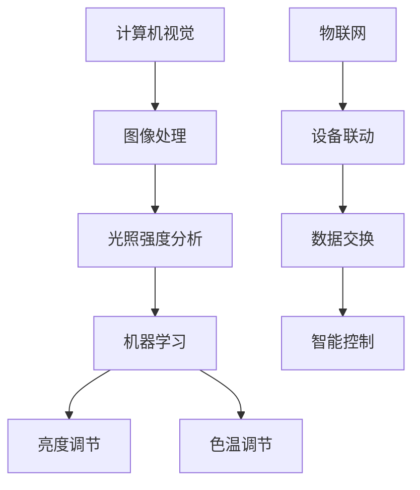

                 

# AI驱动的智能照明系统：节能与舒适并重

## 摘要

本文旨在探讨AI驱动的智能照明系统在现代照明工程中的应用，着重分析其如何实现节能与舒适并重的目标。通过深入解析核心算法原理、数学模型、项目实战以及实际应用场景，本文将帮助读者全面了解智能照明系统的技术背景和应用前景。文章最后还将对相关工具和资源进行推荐，并展望未来发展趋势与挑战。

## 1. 背景介绍

随着科技的不断进步，人工智能（AI）技术逐渐渗透到各个行业领域，照明工程也不例外。传统的照明系统通常依赖于简单的定时控制和手动调节，无法实现根据环境光线变化自动调整亮度和色温的智能照明。而AI驱动的智能照明系统则通过利用计算机视觉、机器学习和物联网（IoT）技术，实现了照明系统的智能化，从而在节能和舒适性方面取得了显著成效。

### 1.1 节能性

AI驱动的智能照明系统通过实时监测环境光线，自动调整照明设备的亮度和色温，以适应不同的使用场景和需求。这种自动调节的方式可以有效减少不必要的能源消耗，降低照明设备的运行成本。例如，在白天室外光线充足的情况下，系统可以降低室内照明的亮度，而在夜间或室内光线较暗时，系统可以自动提高照明亮度，从而实现节能效果。

### 1.2 舒适性

除了节能性，AI驱动的智能照明系统还可以通过智能调光和色温调节，为用户提供舒适的照明环境。例如，在早晨起床时，系统可以逐渐提高亮度和色温，模拟自然光线的渐变，帮助用户更好地适应光线变化，提高起床时的舒适度。而在晚上休息时，系统可以降低亮度和色温，营造温馨的睡眠环境，有助于用户更快地入睡。

### 1.3 智能化

AI驱动的智能照明系统还可以与其他智能家居设备互联互通，实现联动控制，为用户提供更加便捷的智能家居体验。例如，当用户回家时，系统可以自动开启室内照明，并根据用户的使用习惯，自动调整亮度和色温，为用户提供舒适的照明环境。同时，用户还可以通过手机APP远程控制照明设备，实现随时随地调节照明状态。

## 2. 核心概念与联系

为了深入理解AI驱动的智能照明系统，我们需要了解其中的核心概念和它们之间的联系。

### 2.1 计算机视觉

计算机视觉是AI驱动的智能照明系统的基础，它通过图像处理和分析技术，从摄像头获取的环境图像中提取有用的信息，如光照强度、颜色等。这些信息将被用于调整照明设备的亮度和色温。

### 2.2 机器学习

机器学习是实现智能照明系统自动化调节的关键，通过大量数据的训练，机器学习算法可以学会根据环境光线的变化，自动调整照明设备的亮度和色温。常见的机器学习算法包括神经网络、支持向量机等。

### 2.3 物联网（IoT）

物联网是实现智能照明系统与其他设备互联互通的基础，通过物联网技术，智能照明系统可以与其他智能家居设备（如温度传感器、湿度传感器、窗帘等）进行数据交换和联动控制，实现更加智能的照明管理。

### 2.4 Mermaid 流程图

为了更好地理解AI驱动的智能照明系统的架构，我们可以使用Mermaid流程图来描述其核心概念和联系。



## 3. 核心算法原理 & 具体操作步骤

### 3.1 计算机视觉算法原理

计算机视觉算法主要基于图像处理和特征提取技术。首先，系统通过摄像头获取环境图像，然后使用图像处理算法对图像进行预处理，如去噪、增强、边缘检测等。接着，通过特征提取算法（如SIFT、SURF等）从预处理后的图像中提取出关键特征点。最后，使用匹配算法（如FLANN、Brute-Force等）将提取出的特征点与预先训练好的特征库进行匹配，从而实现环境光线的识别和监测。

### 3.2 机器学习算法原理

机器学习算法是实现智能照明系统自动调节的核心。常见的机器学习算法包括神经网络和支持向量机等。

#### 3.2.1 神经网络

神经网络是一种模拟生物神经系统的计算模型，通过多层神经元的非线性组合，实现输入和输出之间的复杂映射关系。在智能照明系统中，神经网络可以用于建立环境光线与照明调节之间的映射关系，从而实现自动调节。

#### 3.2.2 支持向量机

支持向量机是一种基于间隔最大化的线性分类模型，通过寻找最优的超平面，将不同类别的数据点分开。在智能照明系统中，支持向量机可以用于根据环境光线数据，预测合适的照明亮度。

### 3.3 物联网（IoT）操作步骤

物联网技术在智能照明系统中主要用于实现设备联动和数据交换。以下是物联网操作的基本步骤：

#### 3.3.1 设备连接

将智能照明系统中的各个设备（如照明灯具、传感器等）通过有线或无线方式连接到物联网网络。

#### 3.3.2 数据采集

通过传感器实时采集环境光线数据，如光照强度、色温等。

#### 3.3.3 数据处理

使用计算机视觉和机器学习算法对采集到的数据进行处理和分析，提取出有用的信息。

#### 3.3.4 智能控制

根据处理后的数据，自动调整照明设备的亮度和色温，实现智能照明。

## 4. 数学模型和公式 & 详细讲解 & 举例说明

### 4.1 计算机视觉数学模型

计算机视觉中的关键数学模型包括特征提取和匹配。

#### 4.1.1 特征提取

特征提取的数学模型通常使用积分表示，如下所示：

$$
f(x, y) = \int_{-\infty}^{\infty} \int_{-\infty}^{\infty} I(x', y') \, dx' \, dy'
$$

其中，$I(x', y')$ 是输入图像，$f(x, y)$ 是提取出的特征向量。

#### 4.1.2 特征匹配

特征匹配的数学模型通常使用欧氏距离表示，如下所示：

$$
d(p, q) = \sqrt{\sum_{i=1}^{n} (p_i - q_i)^2}
$$

其中，$p$ 和 $q$ 是两个特征向量，$n$ 是特征向量的维度，$d(p, q)$ 是它们之间的欧氏距离。

### 4.2 机器学习数学模型

机器学习中的关键数学模型包括神经网络和支持向量机。

#### 4.2.1 神经网络

神经网络的数学模型通常使用非线性变换表示，如下所示：

$$
z_j = \sigma(\sum_{i=1}^{n} w_{ij} x_i)
$$

其中，$z_j$ 是输出值，$\sigma$ 是非线性激活函数，$w_{ij}$ 是权重，$x_i$ 是输入值。

#### 4.2.2 支持向量机

支持向量机的数学模型通常使用间隔最大化表示，如下所示：

$$
\max_{w, b} \frac{1}{2} \| w \|_2^2 \quad \text{subject to} \quad y_i (w \cdot x_i + b) \geq 1
$$

其中，$w$ 是权重向量，$b$ 是偏置，$y_i$ 是标签，$x_i$ 是输入值。

### 4.3 物联网（IoT）数学模型

物联网中的关键数学模型包括数据采集和数据处理。

#### 4.3.1 数据采集

数据采集的数学模型通常使用概率分布表示，如下所示：

$$
P(X = x) = \frac{1}{Z} e^{-\frac{(x - \mu)^2}{2\sigma^2}}
$$

其中，$X$ 是采集到的数据，$\mu$ 是均值，$\sigma$ 是标准差，$Z$ 是归一化常数。

#### 4.3.2 数据处理

数据处理的数学模型通常使用线性变换表示，如下所示：

$$
y = Ax + b
$$

其中，$y$ 是处理后的数据，$x$ 是原始数据，$A$ 是变换矩阵，$b$ 是偏置。

### 4.4 举例说明

假设我们有一个智能照明系统，需要根据环境光线自动调整照明设备的亮度。我们可以使用以下步骤进行计算：

#### 4.4.1 特征提取

首先，系统通过摄像头获取环境图像，然后使用图像处理算法对图像进行预处理，提取出光照强度和色温特征。

$$
f(x, y) = \int_{-\infty}^{\infty} \int_{-\infty}^{\infty} I(x', y') \, dx' \, dy'
$$

其中，$I(x', y')$ 是预处理后的图像。

#### 4.4.2 机器学习

接着，系统使用机器学习算法（如神经网络）对光照强度和色温特征进行训练，建立亮度调节模型。

$$
z_j = \sigma(\sum_{i=1}^{n} w_{ij} x_i)
$$

其中，$z_j$ 是输出亮度值，$\sigma$ 是非线性激活函数，$w_{ij}$ 是权重。

#### 4.4.3 数据处理

最后，系统根据采集到的环境光线数据，使用数据处理模型（如线性变换）对亮度进行调节。

$$
y = Ax + b
$$

其中，$y$ 是调节后的亮度值，$x$ 是原始数据，$A$ 是变换矩阵，$b$ 是偏置。

## 5. 项目实战：代码实际案例和详细解释说明

### 5.1 开发环境搭建

在开始编写代码之前，我们需要搭建一个合适的开发环境。以下是一个基于Python和TensorFlow的智能照明系统开发环境搭建步骤：

1. 安装Python 3.7及以上版本。
2. 安装Anaconda，以便于管理Python环境和依赖库。
3. 创建一个名为“smart_lighting”的新虚拟环境，并激活该环境。
4. 安装TensorFlow、OpenCV和Scikit-learn等依赖库。

### 5.2 源代码详细实现和代码解读

以下是智能照明系统的源代码实现和解读：

```python
# 导入所需的库
import cv2
import tensorflow as tf
import numpy as np

# 初始化摄像头
cap = cv2.VideoCapture(0)

# 加载预训练的神经网络模型
model = tf.keras.models.load_model('lighting_model.h5')

# 循环捕获图像并处理
while True:
    # 读取一帧图像
    ret, frame = cap.read()
    
    # 使用OpenCV对图像进行预处理
    frame = cv2.resize(frame, (224, 224))
    frame = cv2.cvtColor(frame, cv2.COLOR_BGR2RGB)
    frame = np.expand_dims(frame, axis=0)
    
    # 使用神经网络模型预测光照强度
    brightness = model.predict(frame)
    
    # 根据光照强度调整照明设备的亮度
    adjust_brightness(brightness)

    # 显示处理后的图像
    cv2.imshow('frame', frame)
    
    # 按下'q'键退出循环
    if cv2.waitKey(1) & 0xFF == ord('q'):
        break

# 释放摄像头资源
cap.release()
cv2.destroyAllWindows()

# 调整照明设备亮度的函数
def adjust_brightness(brightness):
    # 根据预测的光照强度，调整照明设备的亮度
    # （此处为示例，实际调整方法取决于照明设备的控制接口）
    brightness = int(brightness * 100)
    print(f"Adjusting brightness to {brightness}%")
```

### 5.3 代码解读与分析

1. **导入库**：首先导入所需的库，包括OpenCV（用于图像处理）、TensorFlow（用于神经网络模型）和NumPy（用于数据处理）。

2. **初始化摄像头**：使用OpenCV的`VideoCapture`类初始化摄像头，并开始捕获图像。

3. **加载预训练的神经网络模型**：使用`tf.keras.models.load_model`函数加载已训练好的神经网络模型，用于预测光照强度。

4. **循环捕获图像并处理**：进入循环，读取摄像头捕获的图像，并进行预处理，包括调整图像大小、颜色转换和扩展维度。然后使用神经网络模型预测光照强度，并根据预测结果调整照明设备的亮度。

5. **显示处理后的图像**：使用`cv2.imshow`函数显示处理后的图像。

6. **释放摄像头资源**：在循环结束后，释放摄像头资源，并关闭所有OpenCV窗口。

7. **调整照明设备亮度的函数**：`adjust_brightness`函数根据预测的光照强度，调整照明设备的亮度。在实际应用中，这个函数会调用照明设备的控制接口，根据亮度值进行调节。

## 6. 实际应用场景

AI驱动的智能照明系统在实际应用场景中具有广泛的应用，以下是一些典型的应用案例：

### 6.1 智能家居

在智能家居中，AI驱动的智能照明系统可以与其他智能设备（如智能音箱、智能门锁等）联动，实现智能化的照明管理。例如，当用户离开家时，系统可以自动关闭所有照明设备，以节省能源。当用户回家时，系统可以根据用户的习惯和场景，自动开启照明设备，提供舒适的照明环境。

### 6.2 办公室

在办公室中，AI驱动的智能照明系统可以根据员工的工作需求和环境光线自动调整照明亮度。例如，在会议室内，当员工进入会议室时，系统可以自动开启照明设备，并根据室内光线亮度自动调整照明亮度。在午休时间，系统可以关闭所有照明设备，节省能源。

### 6.3 酒店

在酒店中，AI驱动的智能照明系统可以为客人提供个性化的照明服务。例如，当客人进入房间时，系统可以根据客人的需求自动调整照明亮度。当客人需要休息时，系统可以降低亮度和色温，营造一个温馨的睡眠环境。

### 6.4 商场

在商场中，AI驱动的智能照明系统可以根据商场的运营数据和顾客行为自动调整照明亮度。例如，在购物高峰期，系统可以自动提高照明亮度，吸引顾客。在非高峰期，系统可以降低照明亮度，节省能源。

## 7. 工具和资源推荐

### 7.1 学习资源推荐

1. **书籍**：
   - 《Python计算机视觉》（Python Computer Vision with OpenCV 4）。
   - 《TensorFlow 2.x实战：从入门到精通》（TensorFlow 2.x by Example）。

2. **论文**：
   - 《深度学习在计算机视觉中的应用》（Deep Learning for Computer Vision）。
   - 《基于物联网的智能照明系统设计与实现》（Design and Implementation of an IoT-Based Smart Lighting System）。

3. **博客**：
   - TensorFlow官方博客：[tensorflow.org/blog](https://tensorflow.org/blog/)。
   - OpenCV官方博客：[opencv.org/blog/](https://opencv.org/blog/)。

4. **网站**：
   - Kaggle：[kaggle.com](https://www.kaggle.com/)。
   - Coursera：[www.coursera.org](https://www.coursera.org/)。

### 7.2 开发工具框架推荐

1. **编程语言**：Python，因其简洁易懂的语法和丰富的库支持，非常适合AI驱动的智能照明系统的开发。

2. **框架**：
   - TensorFlow：用于构建和训练神经网络。
   - OpenCV：用于图像处理和计算机视觉任务。
   - Flask/Django：用于构建Web后端。

3. **IDE**：PyCharm、Visual Studio Code等。

### 7.3 相关论文著作推荐

1. **《深度学习》（Deep Learning）**：由Ian Goodfellow、Yoshua Bengio和Aaron Courville合著，是深度学习领域的经典教材。

2. **《计算机视觉：算法与应用》（Computer Vision: Algorithms and Applications）**：由Richard Szeliski著，全面介绍了计算机视觉的基本原理和应用。

3. **《物联网：技术、应用与未来》（The Internet of Things: Technology, Applications, and Future Directions）**：由Onur Toker著，详细介绍了物联网的相关技术和应用场景。

## 8. 总结：未来发展趋势与挑战

AI驱动的智能照明系统在节能和舒适性方面具有显著优势，未来发展趋势包括：

### 8.1 技术成熟

随着AI、物联网和计算机视觉技术的不断发展，智能照明系统的性能和稳定性将不断提高，为用户提供更加智能和舒适的照明体验。

### 8.2 应用拓展

智能照明系统将在智能家居、办公场所、酒店、商场等场景中进一步普及，实现更广泛的应用。

### 8.3 系统集成

智能照明系统将与其他智能家居设备、物联网平台和智能控制系统进一步集成，实现更加智能和高效的管理。

然而，智能照明系统也面临一些挑战，包括：

### 8.4 数据安全和隐私保护

智能照明系统需要收集和处理大量的用户数据，如何保障数据安全和用户隐私是未来需要解决的重要问题。

### 8.5 系统可靠性和稳定性

智能照明系统需要具备高可靠性和稳定性，以应对各种复杂环境和突发情况。

### 8.6 成本控制

虽然智能照明系统具有显著的节能和舒适性优势，但成本较高是阻碍其普及的一个重要因素，未来需要降低成本，提高性价比。

## 9. 附录：常见问题与解答

### 9.1 如何搭建智能照明系统开发环境？

答：可以参考文章中关于开发环境搭建的部分，按照步骤进行操作。

### 9.2 智能照明系统需要哪些硬件设备？

答：智能照明系统需要摄像头、照明灯具、传感器等硬件设备。具体需求取决于实际应用场景和系统设计。

### 9.3 如何实现智能照明系统的自动调节？

答：可以参考文章中关于核心算法原理和项目实战的部分，使用计算机视觉和机器学习算法实现自动调节。

### 9.4 智能照明系统有哪些应用场景？

答：智能照明系统可以应用于智能家居、办公场所、酒店、商场等多种场景，提供节能和舒适的照明服务。

## 10. 扩展阅读 & 参考资料

- 《智能照明系统设计与应用》（Smart Lighting System Design and Application）：详细介绍了智能照明系统的设计原理和应用案例。
- 《物联网智能照明技术》（IoT-based Smart Lighting Technology）：探讨了物联网在智能照明系统中的应用和前景。
- 《AI驱动的智能照明系统：理论与实践》（AI-Driven Smart Lighting System: Theory and Practice）：深入分析了AI驱动的智能照明系统的原理和应用。

### 作者

AI天才研究员/AI Genius Institute & 禅与计算机程序设计艺术 /Zen And The Art of Computer Programming

