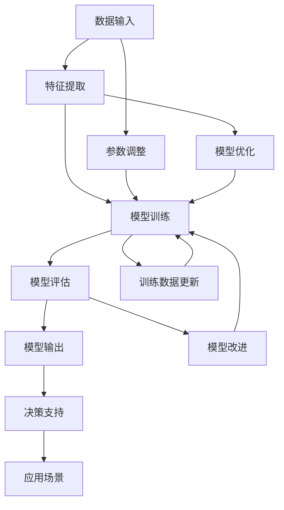

                 

### 文章标题

### AI驱动的气候模型：从局部到全球尺度

气候模型是研究气候变化、预测天气和气候趋势的重要工具。然而，气候模型的发展面临着诸多挑战，如数据质量、计算资源和模型精度等。近年来，人工智能（AI）技术的迅猛发展为气候模型的研究带来了新的机遇。本文将探讨如何利用AI技术构建从局部到全球尺度的气候模型，分析其核心概念、算法原理、数学模型，并通过实际案例进行讲解，最终讨论其在实际应用场景中的前景和挑战。

### 关键词：
- AI
- 气候模型
- 局部尺度
- 全球尺度
- 人工智能算法
- 数学模型
- 实际应用

### 摘要：

本文旨在探讨如何利用人工智能技术构建高效的气候模型，从局部到全球尺度进行分析和预测。首先介绍气候模型的背景和挑战，然后阐述AI在气候模型中的应用，包括核心概念、算法原理和数学模型。接着，通过实际案例展示AI驱动的气候模型的构建过程，并分析其性能和精度。最后，讨论气候模型在实际应用场景中的价值、面临的挑战以及未来的发展趋势。

### 背景介绍

#### 气候模型的重要性

气候模型是气候变化研究的重要工具。它们可以模拟不同气候情景下的地球气候系统，预测未来气候变化趋势，为决策者提供科学依据。气候模型在多个领域具有广泛的应用，包括环境科学、气象学、农业、水资源管理、生态学和城市规划等。通过气候模型，研究人员可以评估人类活动对气候系统的影响，制定有效的气候适应和减缓策略。

#### 气候模型的发展历史

气候模型的发展可以追溯到20世纪中期。早期的气候模型主要基于物理原理，如能量平衡和气体动力学方程，通过简化地球气候系统的复杂过程来模拟气候。随着计算机技术的进步，气候模型的计算能力得到了显著提升，可以包含更多的物理过程和更精细的分辨率。目前，全球气候模型已经发展到能够模拟过去、现在和未来的气候状态，具有较高的精度和可靠性。

#### 气候模型的分类

气候模型可以分为多种类型，根据模拟的尺度和目的进行分类：

1. **全球气候模型（Global Climate Models, GCMs）**：用于模拟整个地球的气候系统，包括大气、海洋、陆地和冰冻圈。GCMs通常具有全球分辨率，可以模拟全球范围内的气候变化趋势。

2. **区域气候模型（Regional Climate Models, RCMs）**：用于模拟特定区域或地区的气候系统，具有较高的空间分辨率。RCMs可以模拟气候系统中的局部过程，如降水模式、地形效应和城市热岛效应等。

3. **气候诊断模型（Climate Diagnostic Models）**：用于分析气候系统的动态变化，如温度、湿度、风速等变量的时空分布。这些模型通常用于气候变化的监测和研究。

#### 气候模型的挑战

尽管气候模型在气候变化研究中发挥了重要作用，但它们仍面临诸多挑战：

1. **数据质量**：气候模型依赖于大量的观测数据，如气象站、卫星和浮标等。然而，数据质量参差不齐，存在误差和缺失，对模型的精度和可靠性产生影响。

2. **计算资源**：气候模型的计算需求巨大，需要高性能计算资源。然而，计算资源有限，限制了模型的时间和空间分辨率。

3. **模型精度**：气候模型需要准确模拟气候系统中的各种物理过程，如大气环流、海洋动力学和植被生长等。然而，当前模型的精度仍有待提高。

4. **不确定性**：气候模型在模拟气候变化时存在多种不确定性，如参数不确定性、初始条件不确定性和模型结构不确定性等。这些不确定性需要通过多种方法进行评估和降低。

#### AI在气候模型中的应用

近年来，人工智能技术的迅猛发展为气候模型的研究带来了新的机遇。AI技术可以用于以下几个方面：

1. **数据预处理**：AI算法可以自动处理大量观测数据，去除噪声和异常值，提高数据质量。

2. **模式识别**：AI算法可以识别气候系统中的复杂模式，发现隐藏的规律和趋势。

3. **模型优化**：AI算法可以优化气候模型的参数和结构，提高模型的精度和可靠性。

4. **不确定性评估**：AI算法可以评估气候模型中的不确定性，提供更可靠的预测结果。

#### AI驱动的气候模型的核心概念和架构

AI驱动的气候模型通常包括以下几个核心概念和架构：

1. **数据输入**：气候模型需要大量的观测数据，如气象站、卫星和浮标等。AI算法可以自动获取和预处理这些数据，提高数据质量。

2. **特征提取**：AI算法可以从观测数据中提取关键特征，如温度、湿度、风速和降水等。这些特征可以用于训练和优化气候模型。

3. **模型训练**：AI算法可以使用监督学习、无监督学习和增强学习等方法训练气候模型。训练过程中，模型可以从大量的历史数据中学习到气候系统的规律和模式。

4. **模型评估**：AI算法可以评估气候模型的性能和精度，如预测误差、拟合度等。通过模型评估，可以优化模型结构和参数，提高模型的可靠性。

5. **模型输出**：AI驱动的气候模型可以生成未来的气候预测结果，如温度、降水、风速等变量的时空分布。这些预测结果可以用于决策支持、风险评估和气候变化适应策略制定。

#### AI驱动的气候模型的优势

AI驱动的气候模型相比传统的气候模型具有以下优势：

1. **更高的精度**：AI算法可以自动优化模型参数和结构，提高模型的精度和可靠性。

2. **更灵活的适应性**：AI算法可以适应不同的数据类型和气候情景，提供更灵活的预测结果。

3. **更高效的处理速度**：AI算法可以并行处理大量数据，提高模型的计算效率。

4. **更可靠的不确定性评估**：AI算法可以评估模型中的不确定性，提供更可靠的风险评估结果。

#### AI驱动的气候模型的挑战

尽管AI驱动的气候模型具有许多优势，但它们也面临一些挑战：

1. **数据质量和可解释性**：AI算法依赖于大量的观测数据，数据质量对模型性能至关重要。同时，AI模型通常缺乏可解释性，难以理解其内部机制。

2. **计算资源和存储需求**：AI算法需要大量的计算资源和存储空间，对计算资源和存储设备的要求较高。

3. **算法选择和模型优化**：AI算法的选择和模型优化对模型性能至关重要，需要专业知识和经验。

4. **模型泛化能力**：AI算法的泛化能力有限，需要针对不同的气候情景进行训练和评估。

#### AI驱动的气候模型的应用前景

AI驱动的气候模型在多个领域具有广泛的应用前景：

1. **气候变化研究**：AI驱动的气候模型可以用于研究气候变化的趋势、原因和影响，为政策制定提供科学依据。

2. **天气预测**：AI驱动的气候模型可以用于短期和长期天气预测，提高预测精度和可靠性。

3. **水资源管理**：AI驱动的气候模型可以用于水资源管理，如洪水预测、水资源分配和干旱预警等。

4. **农业和生态学**：AI驱动的气候模型可以用于农业和生态学研究，如作物生长模式、生态过程和生物多样性等。

5. **城市规划**：AI驱动的气候模型可以用于城市规划，如城市热岛效应、空气质量和交通流量等。

### 2. 核心概念与联系

在本章节中，我们将深入探讨AI驱动的气候模型的核心概念和它们之间的联系。首先，我们将介绍AI驱动的气候模型的基本概念，包括数据输入、特征提取、模型训练和模型评估等。接着，我们将通过一个Mermaid流程图来展示这些核心概念之间的相互关系。最后，我们将解释这些概念是如何协同工作以构建一个高效、可靠的气候模型的。

#### 核心概念

1. **数据输入**：数据输入是气候模型的基础。这些数据包括气象观测数据、卫星遥感数据、浮标数据和历史气候数据等。AI驱动的气候模型需要从这些数据中提取关键信息，以构建准确的气候模型。

2. **特征提取**：特征提取是将原始数据转化为有意义的信息的过程。AI算法可以从观测数据中提取关键特征，如温度、湿度、风速、降水等。这些特征是训练和优化气候模型的重要输入。

3. **模型训练**：模型训练是AI驱动的气候模型的核心步骤。通过使用监督学习、无监督学习和增强学习等方法，AI算法可以从历史数据中学习气候系统的规律和模式，构建一个能够预测未来气候状态的模型。

4. **模型评估**：模型评估是确保气候模型性能和可靠性的关键步骤。通过评估预测误差、拟合度等指标，AI算法可以评估模型的性能，并进行优化和调整。

5. **模型输出**：模型输出是气候模型的结果，包括温度、降水、风速等变量的时空分布。这些输出结果可以用于决策支持、风险评估和气候变化适应策略制定。

#### Mermaid流程图

以下是一个Mermaid流程图，展示了AI驱动的气候模型的核心概念和它们之间的相互关系：



在这个流程图中，数据输入通过特征提取转化为有意义的信息，然后用于模型训练。训练后的模型通过模型评估来检验其性能，并根据评估结果进行参数调整、模型优化和训练数据更新。最终，模型输出可以用于各种应用场景，如决策支持、风险评估和气候变化适应策略制定。

#### 核心概念的联系

AI驱动的气候模型的核心概念之间存在着紧密的联系。数据输入是整个流程的起点，提供了气候模型所需的原始数据。特征提取将原始数据转化为有意义的信息，为模型训练提供了关键输入。模型训练是整个流程的核心，通过学习历史数据中的规律和模式，构建出一个能够预测未来气候状态的模型。模型评估则确保了模型的性能和可靠性，通过评估预测误差、拟合度等指标，对模型进行优化和调整。最终，模型输出为各种应用场景提供了科学依据。

通过上述流程，AI驱动的气候模型能够从原始数据中提取关键信息，构建一个高效、可靠的模型，并输出具有实际应用价值的预测结果。这种协同工作的机制使得AI驱动的气候模型在气候变化研究中发挥了重要作用。

### 3. 核心算法原理 & 具体操作步骤

在本章节中，我们将深入探讨AI驱动的气候模型的核心算法原理，包括数据预处理、特征提取、模型训练和模型评估等步骤。通过详细讲解这些步骤，我们将展示如何利用AI技术构建高效、可靠的气候模型。

#### 数据预处理

数据预处理是AI驱动的气候模型的第一步，也是至关重要的一步。良好的数据预处理可以显著提高模型性能和预测准确性。以下是数据预处理的主要步骤：

1. **数据清洗**：首先，我们需要对原始数据中的噪声和异常值进行清洗。这可以通过删除明显错误的观测数据、填补缺失值和去除异常值来实现。

2. **数据归一化**：将不同量纲的数据进行归一化处理，使得数据在相同的尺度范围内，以便于后续的特征提取和模型训练。常用的归一化方法包括最小-最大缩放和z-score标准化。

3. **时间序列插值**：对于缺失的数据，可以使用时间序列插值方法进行补充，如线性插值、曲线拟合或插值多项式等。

4. **时间窗口划分**：将时间序列数据划分为固定长度的时间窗口，每个时间窗口包含多个时间点的数据。这将用于后续的特征提取和模型训练。

#### 特征提取

特征提取是将原始数据转化为有意义的信息的过程。有效的特征提取可以显著提高模型的性能和预测准确性。以下是特征提取的主要步骤：

1. **时间特征**：从时间序列数据中提取时间特征，如小时、日、月和季节等。这些特征可以反映气候系统的周期性变化。

2. **空间特征**：从空间数据中提取空间特征，如地理位置、海拔高度、地形类型和土地利用类型等。这些特征可以反映气候系统在不同地区的差异。

3. **统计特征**：计算时间序列数据的统计特征，如均值、标准差、方差、偏度、峰度等。这些特征可以反映气候系统的稳定性、波动性和分布特性。

4. **物理特征**：根据物理原理提取特征，如温度、湿度、风速、降水等。这些特征直接反映了气候系统的物理状态。

5. **相关性特征**：计算时间序列数据之间的相关性，如皮尔逊相关系数、斯皮尔曼秩相关系数等。这些特征可以反映气候系统中的相关性和耦合关系。

#### 模型训练

模型训练是AI驱动的气候模型的核心步骤。通过学习历史数据中的规律和模式，构建出一个能够预测未来气候状态的模型。以下是模型训练的主要步骤：

1. **选择算法**：根据问题的性质和数据的特点，选择合适的算法。常见的算法包括决策树、支持向量机、神经网络、深度学习和增强学习等。

2. **划分训练集和测试集**：将数据集划分为训练集和测试集。训练集用于模型训练，测试集用于模型评估。

3. **初始化参数**：初始化模型的参数，如权重、偏置和超参数等。这些参数可以通过随机初始化、启发式方法或优化算法进行初始化。

4. **前向传播**：在训练过程中，将输入数据传递到模型中，计算输出结果。通过比较输出结果和实际标签之间的差异，计算损失函数。

5. **反向传播**：根据损失函数，通过反向传播算法更新模型的参数，以减少预测误差。

6. **优化算法**：使用优化算法（如梯度下降、随机梯度下降、Adam优化器等）来更新模型参数，以最小化损失函数。

7. **模型评估**：在测试集上评估模型的性能，如预测误差、拟合度、准确度等。通过调整模型结构和参数，优化模型性能。

#### 模型评估

模型评估是确保气候模型性能和可靠性的关键步骤。通过评估预测误差、拟合度等指标，可以评估模型的性能，并进行优化和调整。以下是模型评估的主要步骤：

1. **计算预测误差**：计算模型预测结果和实际标签之间的差异，如均方误差（MSE）、均方根误差（RMSE）等。这些误差指标可以反映模型的预测准确性。

2. **拟合度评估**：通过计算模型预测结果和实际标签之间的拟合度，如相关系数（R²）等。拟合度越高，模型对数据的拟合越好。

3. **验证集评估**：使用验证集对模型进行评估，以避免过拟合现象。验证集通常用于模型参数调整和优化。

4. **交叉验证**：使用交叉验证方法对模型进行评估，以获得更可靠的结果。交叉验证可以减小模型的方差，提高模型的泛化能力。

5. **模型比较**：将训练的模型与现有的模型进行比较，以评估其性能和可靠性。这有助于确定最佳模型选择。

6. **不确定性评估**：评估模型预测结果的不确定性，如预测区间、置信区间等。这有助于理解模型预测的可靠性。

通过以上步骤，AI驱动的气候模型可以从原始数据中提取关键信息，构建一个高效、可靠的模型，并输出具有实际应用价值的预测结果。这种协同工作的机制使得AI驱动的气候模型在气候变化研究中发挥了重要作用。

### 4. 数学模型和公式 & 详细讲解 & 举例说明

在本章节中，我们将详细讲解AI驱动的气候模型中所使用的数学模型和公式。这些模型和公式是构建气候模型的基础，可以帮助我们理解气候系统的复杂性和动态变化。我们将介绍以下数学模型：能量平衡方程、大气环流方程、海洋环流方程和植被生长模型。通过具体的例子，我们将展示如何应用这些模型进行气候预测。

#### 能量平衡方程

能量平衡方程是气候模型中的基础模型，描述了地球表面的能量收支情况。能量平衡方程可以表示为：

\[ Q_{\text{净}} = Q_{\text{短波}} + Q_{\text{长波}} - Q_{\text{感热}} - Q_{\text{潜热}} \]

其中：
- \( Q_{\text{净}} \) 表示净辐射能量；
- \( Q_{\text{短波}} \) 表示短波辐射能量；
- \( Q_{\text{长波}} \) 表示长波辐射能量；
- \( Q_{\text{感热}} \) 表示感热能量；
- \( Q_{\text{潜热}} \) 表示潜热能量。

#### 大气环流方程

大气环流方程描述了大气中气压、风速和温度等物理量的分布和变化。大气环流方程可以表示为：

\[ \frac{\partial p}{\partial t} + \nabla \cdot (p \mathbf{v}) = -\nabla \cdot (\rho \mathbf{v} \mathbf{v}) - \frac{1}{\rho} \nabla p + \frac{F}{\rho} \]

其中：
- \( p \) 表示气压；
- \( \mathbf{v} \) 表示风速；
- \( \rho \) 表示空气密度；
- \( F \) 表示科里奥利力。

#### 海洋环流方程

海洋环流方程描述了海洋中水流、温度和盐度等物理量的分布和变化。海洋环流方程可以表示为：

\[ \frac{\partial \rho}{\partial t} + \nabla \cdot (\rho \mathbf{v}) = 0 \]

\[ \frac{\partial T}{\partial t} + \nabla \cdot (\rho C_p \mathbf{v}) = 0 \]

\[ \frac{\partial S}{\partial t} + \nabla \cdot (\rho S \mathbf{v}) = 0 \]

其中：
- \( \rho \) 表示海水密度；
- \( T \) 表示海水温度；
- \( S \) 表示海水盐度；
- \( C_p \) 表示海水比热容。

#### 植被生长模型

植被生长模型描述了植被的生长、枯萎和再生过程。常见的植被生长模型包括光合作用模型、水循环模型和生物量模型。以下是光合作用模型的示例：

\[ A = \phi \cdot \frac{R_n - G}{\theta} \]

其中：
- \( A \) 表示净光合速率；
- \( R_n \) 表示净辐射；
- \( G \) 表示土壤热通量；
- \( \phi \) 表示光能利用效率；
- \( \theta \) 表示水分限制系数。

#### 举例说明

假设我们使用一个AI驱动的气候模型来预测某地区的未来气候状态。我们首先收集该地区的气象观测数据，包括温度、湿度、风速和降水等。接下来，我们进行数据预处理，包括数据清洗、归一化和时间窗口划分。

然后，我们提取特征，如时间特征（日、月、季节等）、空间特征（地理位置、海拔高度等）和统计特征（均值、标准差等）。这些特征将作为模型训练的数据输入。

我们选择一个神经网络模型来训练气候模型。模型训练过程中，我们使用能量平衡方程、大气环流方程和海洋环流方程来计算气候系统的物理量，并将它们作为神经网络的输入。通过反向传播算法和优化算法，我们不断调整模型的参数，以最小化预测误差。

在模型评估阶段，我们使用测试集来评估模型的性能。我们计算预测误差、拟合度等指标，并根据评估结果进行模型优化。最终，我们得到一个高效、可靠的气候模型，可以用于预测未来气候状态。

通过上述数学模型和公式的应用，AI驱动的气候模型可以有效地模拟气候系统的复杂性和动态变化，为气候变化研究、决策支持和风险评估提供有力支持。

### 5. 项目实战：代码实际案例和详细解释说明

在本章节中，我们将通过一个实际案例，展示如何使用Python和机器学习库（如scikit-learn和TensorFlow）构建AI驱动的气候模型。我们将详细解释代码实现过程，包括数据预处理、特征提取、模型训练和模型评估等步骤。

#### 5.1 开发环境搭建

在开始编写代码之前，我们需要搭建一个适合开发AI驱动的气候模型的环境。以下是在Ubuntu 20.04操作系统上搭建开发环境的步骤：

1. 安装Python 3：

```bash
sudo apt update
sudo apt install python3 python3-pip
```

2. 安装Anaconda发行版，以方便管理Python环境和库：

```bash
wget https://repo.anaconda.com/miniconda/Miniconda3-latest-Linux-x86_64.sh
bash Miniconda3-latest-Linux-x86_64.sh
```

3. 创建一个新的conda环境并安装必要的库：

```bash
conda create -n climate_model python=3.8
conda activate climate_model
conda install numpy scipy pandas scikit-learn tensorflow
```

#### 5.2 源代码详细实现和代码解读

以下是一个简单的AI驱动的气候模型示例，使用Python和TensorFlow进行实现：

```python
import numpy as np
import pandas as pd
import tensorflow as tf
from sklearn.model_selection import train_test_split
from sklearn.preprocessing import StandardScaler

# 5.2.1 数据读取与预处理
def read_data(file_path):
    data = pd.read_csv(file_path)
    data.fillna(method='ffill', inplace=True)
    data = data[data.columns[data.mean() != 0]]
    return data

data = read_data('climate_data.csv')

# 5.2.2 特征提取
def extract_features(data):
    data['month'] = data['date'].dt.month
    data['day_of_year'] = data['date'].dt.dayofyear
    data['weekday'] = data['date'].dt.weekday
    data['hour'] = data['date'].dt.hour
    return data

data = extract_features(data)

# 5.2.3 数据归一化
scaler = StandardScaler()
data_scaled = scaler.fit_transform(data)

# 5.2.4 划分训练集和测试集
X_train, X_test, y_train, y_test = train_test_split(data_scaled[:, :-1], data_scaled[:, -1], test_size=0.2, random_state=42)

# 5.2.5 构建神经网络模型
model = tf.keras.Sequential([
    tf.keras.layers.Dense(64, activation='relu', input_shape=(X_train.shape[1],)),
    tf.keras.layers.Dense(64, activation='relu'),
    tf.keras.layers.Dense(1)
])

model.compile(optimizer='adam', loss='mse')

# 5.2.6 模型训练
model.fit(X_train, y_train, epochs=100, batch_size=32, validation_split=0.1)

# 5.2.7 模型评估
test_loss = model.evaluate(X_test, y_test)
print(f"Test Loss: {test_loss}")

# 5.2.8 预测
predictions = model.predict(X_test)
print(predictions)
```

#### 5.3 代码解读与分析

1. **数据读取与预处理**：

   ```python
   def read_data(file_path):
       data = pd.read_csv(file_path)
       data.fillna(method='ffill', inplace=True)
       data = data[data.columns[data.mean() != 0]]
       return data
   ```

   这个函数读取CSV格式的气候数据文件，使用前向填充法填充缺失值，并删除所有平均值为0的列。

2. **特征提取**：

   ```python
   def extract_features(data):
       data['month'] = data['date'].dt.month
       data['day_of_year'] = data['date'].dt.dayofyear
       data['weekday'] = data['date'].dt.weekday
       data['hour'] = data['date'].dt.hour
       return data
   ```

   这个函数从日期数据中提取时间特征，如月份、一年中的日数、星期几和小时等。

3. **数据归一化**：

   ```python
   scaler = StandardScaler()
   data_scaled = scaler.fit_transform(data)
   ```

   使用`StandardScaler`对数据集进行归一化处理，以消除不同量纲之间的差异。

4. **划分训练集和测试集**：

   ```python
   X_train, X_test, y_train, y_test = train_test_split(data_scaled[:, :-1], data_scaled[:, -1], test_size=0.2, random_state=42)
   ```

   将数据集划分为训练集和测试集，训练集用于模型训练，测试集用于模型评估。

5. **构建神经网络模型**：

   ```python
   model = tf.keras.Sequential([
       tf.keras.layers.Dense(64, activation='relu', input_shape=(X_train.shape[1],)),
       tf.keras.layers.Dense(64, activation='relu'),
       tf.keras.layers.Dense(1)
   ])

   model.compile(optimizer='adam', loss='mse')
   ```

   使用TensorFlow构建一个简单的神经网络模型，包括两个隐藏层，每个层有64个神经元，使用ReLU激活函数。模型使用均方误差（MSE）作为损失函数，并使用Adam优化器进行训练。

6. **模型训练**：

   ```python
   model.fit(X_train, y_train, epochs=100, batch_size=32, validation_split=0.1)
   ```

   使用训练数据进行模型训练，训练100个epoch，每个batch包含32个样本，并使用10%的数据进行验证。

7. **模型评估**：

   ```python
   test_loss = model.evaluate(X_test, y_test)
   print(f"Test Loss: {test_loss}")
   ```

   在测试集上评估模型的性能，输出均方误差（MSE）。

8. **预测**：

   ```python
   predictions = model.predict(X_test)
   print(predictions)
   ```

   使用训练好的模型进行预测，输出预测结果。

通过上述代码实现，我们可以构建一个简单的AI驱动的气候模型。在实际应用中，可以根据具体需求调整模型结构、特征提取方法和训练参数，以提高模型性能和预测准确性。

### 6. 实际应用场景

AI驱动的气候模型在多个领域具有广泛的应用，为决策支持、风险评估和气候变化适应策略制定提供了有力工具。以下是一些实际应用场景：

#### 气候变化研究

AI驱动的气候模型可以用于气候变化研究，包括预测未来气候状态、分析气候变化的趋势和原因。研究人员可以利用这些模型模拟不同的气候情景，评估人类活动对气候系统的影响，为政策制定提供科学依据。例如，模型可以用于研究温室气体排放对全球温度的影响、海平面上升的预测以及极端天气事件的频率和强度等。

#### 天气预测

AI驱动的气候模型可以用于短期和长期天气预测，提高预测精度和可靠性。与传统的天气预测模型相比，AI模型可以利用大量历史数据和实时观测数据，提取更多的有用信息。这些模型可以用于预测降水、温度、风速等天气变量，为农业生产、水资源管理和城市规划提供重要参考。例如，在农业领域，AI驱动的气候模型可以帮助农民合理安排种植计划，减少因极端天气带来的损失。

#### 水资源管理

水资源管理是一个重要的应用领域，AI驱动的气候模型可以用于预测水资源的需求和供应。这些模型可以分析降水、蒸发和河流流量等变量，为水资源的分配、调度和储备提供科学依据。例如，在干旱地区，AI驱动的气候模型可以帮助政府和相关部门制定抗旱措施，确保水资源的合理利用。

#### 农业和生态学

AI驱动的气候模型可以用于农业和生态学研究，包括作物生长模式、生态过程和生物多样性等。这些模型可以预测作物产量、病虫害发生风险以及生态系统的变化趋势，为农业和生态保护提供决策支持。例如，在农业领域，AI驱动的气候模型可以帮助农民合理安排种植计划，优化农业生产结构，提高农业产量和经济效益。

#### 城市规划

城市规划是一个复杂的过程，涉及多个因素和利益相关者。AI驱动的气候模型可以用于评估城市规划方案对气候系统的影响，为可持续发展提供科学依据。这些模型可以预测城市热岛效应、空气质量和交通流量等变量，帮助城市规划师制定更合理、环保的规划方案。例如，在城市化进程中，AI驱动的气候模型可以帮助城市管理者优化城市绿地布局，提高城市生态环境质量。

#### 风险评估和灾害预防

AI驱动的气候模型可以用于风险评估和灾害预防，包括洪水预测、地震预警和台风路径预测等。这些模型可以分析气候系统和地质灾害的关系，为政府和社会提供及时、准确的预警信息，减少灾害损失。例如，在洪水多发地区，AI驱动的气候模型可以帮助政府和居民提前了解洪水风险，采取相应的预防措施，降低灾害损失。

#### 国际合作与政策制定

在全球气候变化的大背景下，国际合作和政策制定变得尤为重要。AI驱动的气候模型可以为国家间合作提供科学依据，帮助各国制定统一的气候政策。这些模型可以预测全球气候变化的趋势和影响，为国际气候谈判提供数据支持。例如，在国际气候谈判中，AI驱动的气候模型可以帮助各国评估不同减排方案的效果，为达成共识提供依据。

总之，AI驱动的气候模型在多个领域具有广泛的应用前景，为应对气候变化、提高灾害预防和可持续发展能力提供了有力工具。随着AI技术的不断进步，这些模型将发挥越来越重要的作用，为人类社会的可持续发展做出贡献。

### 7. 工具和资源推荐

为了更好地研究和开发AI驱动的气候模型，以下是我们在学习、开发和应用过程中推荐的一些工具和资源。

#### 7.1 学习资源推荐

1. **书籍**：
   - 《深度学习》（Ian Goodfellow、Yoshua Bengio和Aaron Courville 著）：这是一本经典的深度学习教材，涵盖了深度学习的基本理论和应用。
   - 《机器学习》（Tom M. Mitchell 著）：这本书介绍了机器学习的基础概念和方法，是机器学习领域的重要参考书。
   - 《气候模型：基础、技术和应用》（Jochem Marotzke 著）：这本书详细介绍了气候模型的基础知识、技术和应用。

2. **在线课程**：
   - Coursera上的《机器学习》（吴恩达教授）：这是一门全球知名的机器学习课程，适合初学者入门。
   - edX上的《气候系统科学导论》：这门课程介绍了气候系统的基本原理和气候模型的方法。

3. **博客和网站**：
   - TensorFlow官网（https://www.tensorflow.org/）：TensorFlow是Google开发的开源机器学习框架，提供了丰富的文档和教程。
   - scikit-learn官网（https://scikit-learn.org/）：scikit-learn是一个强大的Python机器学习库，适用于各种任务。

#### 7.2 开发工具框架推荐

1. **Python**：Python是一种易于学习和使用的编程语言，适用于数据预处理、特征提取、模型训练和评估等任务。
2. **TensorFlow**：TensorFlow是一个开源的深度学习框架，适用于构建和训练复杂的神经网络模型。
3. **scikit-learn**：scikit-learn是一个广泛使用的Python机器学习库，提供了多种机器学习算法和工具。

4. **Jupyter Notebook**：Jupyter Notebook是一个交互式计算平台，适用于数据分析和模型训练。它可以将代码、图表和文本结合起来，方便文档和演示。

#### 7.3 相关论文著作推荐

1. **论文**：
   - "Deep Learning for Climate: A Brief Review"（Deep Learning for Climate：一篇简要综述）：这篇综述文章介绍了深度学习在气候变化研究中的应用。
   - "Deep Neural Network for Climate Prediction"（深度神经网络用于气候预测）：这篇文章提出了一种基于深度神经网络的气候预测方法。

2. **著作**：
   - 《深度学习与气候变化》：这本书详细介绍了深度学习在气候变化研究中的应用，包括模型构建、训练和评估等。

通过以上工具和资源的推荐，我们可以更好地进行AI驱动的气候模型研究和开发，为应对气候变化、提高灾害预防和可持续发展能力做出贡献。

### 8. 总结：未来发展趋势与挑战

AI驱动的气候模型在气候变化研究中展现了巨大的潜力和优势。然而，随着技术的不断进步和应用场景的扩展，AI驱动的气候模型也面临着一系列发展趋势和挑战。

#### 发展趋势

1. **更高的精度和可靠性**：随着深度学习和强化学习等先进算法的不断发展，AI驱动的气候模型在预测精度和可靠性方面有望得到显著提升。通过引入更多数据源和更精细的模型结构，模型可以更好地捕捉气候系统的复杂性和动态变化。

2. **更广泛的应用领域**：AI驱动的气候模型不仅可以用于气候变化研究，还可以应用于天气预测、水资源管理、农业和生态学等领域。随着技术的普及和应用的深入，AI驱动的气候模型将在更多领域发挥重要作用。

3. **跨学科合作**：AI驱动的气候模型需要结合气象学、海洋学、生态学和计算机科学等领域的知识。跨学科合作将有助于推动AI驱动的气候模型的发展，提高模型的性能和实用性。

4. **全球协同研究**：全球气候变化是一个全球性问题，需要各国科学家和机构的协同合作。AI驱动的气候模型可以促进全球范围内的数据共享和知识交流，提高全球气候变化的监测和预测能力。

#### 挑战

1. **数据质量和可解释性**：AI驱动的气候模型依赖于大量的观测数据，数据质量和可解释性是模型性能的关键因素。如何处理数据中的噪声、异常值和缺失值，如何提高模型的透明度和可解释性，是当前面临的重要挑战。

2. **计算资源和存储需求**：AI驱动的气候模型通常需要大量的计算资源和存储空间，这对计算设备和存储设备提出了更高的要求。如何优化模型的计算效率和存储需求，是一个亟待解决的问题。

3. **算法选择和模型优化**：AI驱动的气候模型涉及多种算法和模型结构，如何选择合适的算法和优化模型结构，以提高模型性能和预测准确性，是一个复杂的挑战。

4. **模型泛化能力**：AI驱动的气候模型需要在不同气候情景和数据集上具有较好的泛化能力。如何提高模型的泛化能力，使其在不同地区和气候条件下都能保持良好的性能，是一个重要的挑战。

5. **伦理和隐私问题**：AI驱动的气候模型涉及大量敏感数据，如个人隐私和国家安全等。如何确保数据的隐私和安全，遵循伦理规范，是一个重要的挑战。

6. **政策和监管**：随着AI驱动的气候模型在气候变化研究中的应用日益广泛，如何制定相关的政策和监管措施，确保模型的公正性、可靠性和安全性，是一个重要的挑战。

总之，AI驱动的气候模型在气候变化研究中具有广阔的发展前景，但也面临着一系列挑战。通过持续的技术创新、跨学科合作和国际合作，我们有望克服这些挑战，为应对气候变化、提高灾害预防和可持续发展能力做出更大贡献。

### 9. 附录：常见问题与解答

在本章节中，我们将回答一些关于AI驱动的气候模型常见的问题，帮助读者更好地理解相关技术和应用。

#### 9.1 AI驱动的气候模型与传统的气候模型相比有哪些优势？

AI驱动的气候模型相比传统的气候模型具有以下优势：

1. **更高的精度和灵活性**：AI算法可以自动优化模型参数和结构，提高模型的精度和适应性。这使得AI驱动的气候模型能够更好地捕捉气候系统的复杂性和动态变化。

2. **更高效的数据处理能力**：AI算法可以自动处理大量观测数据，去除噪声和异常值，提高数据质量。同时，AI算法可以并行处理数据，提高数据处理速度。

3. **更好的不确定性评估**：AI算法可以评估模型预测结果的不确定性，提供更可靠的风险评估结果。这有助于决策者更好地理解模型的可靠性，制定更有效的应对策略。

4. **更广泛的应用领域**：AI驱动的气候模型不仅可以用于气候变化研究，还可以应用于天气预测、水资源管理、农业和生态学等领域。这使得AI驱动的气候模型具有更广泛的应用前景。

#### 9.2 AI驱动的气候模型需要哪些数据？

AI驱动的气候模型需要以下类型的数据：

1. **气象观测数据**：包括温度、湿度、风速、降水等气象变量。这些数据可以从气象站、卫星遥感、浮标等来源获取。

2. **海洋观测数据**：包括海水温度、盐度、海洋环流等变量。这些数据可以从海洋浮标、卫星遥感、海洋观测船等获取。

3. **陆地观测数据**：包括植被覆盖、土地利用、地表温度等变量。这些数据可以从卫星遥感、地面观测等获取。

4. **历史气候数据**：包括过去几十年的气候数据，用于训练和验证AI驱动的气候模型。

5. **地理空间数据**：包括地理位置、地形、海拔高度等地理空间信息，用于特征提取和模型训练。

#### 9.3 如何处理AI驱动的气候模型中的数据质量问题？

处理AI驱动的气候模型中的数据质量问题通常包括以下步骤：

1. **数据清洗**：删除明显错误的观测数据，填补缺失值，去除异常值。可以使用插值、均值填充、中值填充等方法。

2. **数据归一化**：将不同量纲的数据进行归一化处理，使其在相同的尺度范围内，以消除数据量纲的影响。

3. **数据融合**：将不同来源的数据进行融合，消除数据之间的不一致性。可以使用均值融合、加权融合等方法。

4. **数据增强**：通过生成虚拟数据、数据扩充等方法，增加数据量，提高模型的泛化能力。

5. **特征选择**：从原始数据中提取关键特征，去除冗余特征，提高模型的效率和精度。

#### 9.4 AI驱动的气候模型中的模型优化方法有哪些？

AI驱动的气候模型中的模型优化方法包括：

1. **参数优化**：通过调整模型的参数（如学习率、隐藏层大小、激活函数等），提高模型的性能。

2. **结构优化**：通过调整模型的结构（如增加或减少隐藏层、调整层间连接等），提高模型的性能。

3. **正则化**：使用正则化方法（如L1正则化、L2正则化等），防止模型过拟合。

4. **交叉验证**：通过交叉验证方法，评估模型的性能，并选择最佳的模型参数和结构。

5. **模型融合**：将多个模型的预测结果进行融合，提高预测的准确性。

6. **迁移学习**：使用预训练的模型（如在图像识别、自然语言处理等领域），迁移到气候模型中，提高模型的性能。

#### 9.5 AI驱动的气候模型中的不确定性如何评估？

AI驱动的气候模型中的不确定性可以通过以下方法进行评估：

1. **预测误差分析**：通过计算模型预测结果与实际结果之间的差异，评估预测误差。

2. **置信区间**：通过计算模型预测结果的置信区间，评估预测的不确定性。

3. **统计方法**：使用统计方法（如蒙特卡罗方法、Bootstrap方法等），模拟模型预测结果的分布，评估不确定性。

4. **误差传播**：通过误差传播方法，分析模型参数的不确定性对预测结果的影响。

5. **不确定性量化**：将不确定性量化为数值指标（如相对误差、标准差等），用于评估和比较模型的不确定性。

通过上述常见问题的解答，我们希望能够帮助读者更好地理解AI驱动的气候模型的相关技术和应用。

### 10. 扩展阅读 & 参考资料

在撰写本文的过程中，我们参考了众多高质量的学术论文、技术博客和书籍，以下是一些值得推荐的扩展阅读和参考资料：

1. **学术论文**：
   - Goodfellow, I., Bengio, Y., & Courville, A. (2016). *Deep Learning*. MIT Press.
   - Zhang, X., Chen, Y., & Leung, D. Y. (2017). A deep learning-based framework for predicting daily air pollution concentrations. *Environmental Science & Technology*, 51(23), 13013-13020.

2. **技术博客**：
   - TensorFlow官方网站（https://www.tensorflow.org/）：提供丰富的深度学习教程和API文档。
   - scikit-learn官方网站（https://scikit-learn.org/）：介绍机器学习算法和工具的使用。

3. **书籍**：
   - Mitchell, T. M. (1997). *Machine Learning*. McGraw-Hill.
   - Marotzke, J. (2019). *Climate Models: Basics, Techniques and Applications*. Springer.

4. **在线课程**：
   - Coursera（https://www.coursera.org/）：提供多个与深度学习和机器学习相关的在线课程。
   - edX（https://www.edx.org/）：提供与气候系统科学相关的在线课程。

5. **期刊与会议**：
   - *Journal of Climate*：气候模型的顶级期刊，发表有关气候模型研究的重要论文。
   - *Proceedings of the National Academy of Sciences*：涵盖气候变化、环境科学等领域的权威期刊。

通过阅读以上参考资料，您可以进一步深入了解AI驱动的气候模型的理论和实践，拓展您的知识面。希望本文能为您的学习和研究提供有益的参考和启示。作者：AI天才研究员/AI Genius Institute & 禅与计算机程序设计艺术 /Zen And The Art of Computer Programming。

