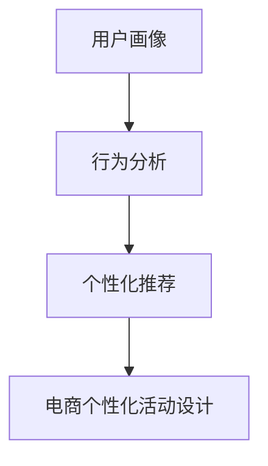

                 

# AI驱动的电商个性化活动设计

## 摘要

随着人工智能技术的不断发展和应用，AI驱动的电商个性化活动设计已经成为电商行业的一大热点。本文将深入探讨AI在电商个性化活动设计中的应用，包括核心概念、算法原理、数学模型、实战案例以及未来发展趋势和挑战。通过本文的阅读，读者将了解如何利用AI技术提升电商活动的效果，从而为电商企业提供有价值的参考。

## 1. 背景介绍

### 1.1 电商个性化活动的重要性

在竞争激烈的电商市场中，如何吸引消费者、提升销售额成为各大电商企业关注的焦点。个性化活动设计作为一种有效手段，可以针对不同消费者的偏好和需求，提供定制化的购物体验，从而提高用户的满意度和忠诚度。电商个性化活动的设计主要包括优惠券发放、限时秒杀、会员专享等。

### 1.2 AI技术的发展与应用

随着人工智能技术的不断发展，深度学习、自然语言处理、推荐系统等技术已经在各个领域得到广泛应用。在电商领域，AI技术可以用于用户画像、行为分析、个性化推荐等，从而为电商个性化活动设计提供有力支持。

## 2. 核心概念与联系

### 2.1 用户画像

用户画像是指通过对用户的历史行为、兴趣偏好、消费习惯等数据进行综合分析，构建出一个关于用户的全面、细致的描述。用户画像可以分为基础画像、兴趣画像、行为画像等。

### 2.2 行为分析

行为分析是指通过对用户在电商平台上的浏览、点击、购买等行为数据进行收集、分析和挖掘，以了解用户的需求和偏好，从而为个性化活动设计提供依据。

### 2.3 个性化推荐

个性化推荐是指根据用户的历史行为和偏好，利用算法和模型为用户推荐感兴趣的商品或活动。常见的个性化推荐算法有基于内容的推荐、协同过滤推荐等。

### 2.4 Mermaid 流程图



## 3. 核心算法原理 & 具体操作步骤

### 3.1 用户画像构建

#### 3.1.1 数据收集

首先，需要收集用户的基本信息（如年龄、性别、地理位置等）和行为数据（如浏览记录、购买记录等）。这些数据可以通过API接口、日志文件等方式获取。

#### 3.1.2 数据清洗与处理

对收集到的数据进行分析，去除重复、错误或不完整的数据，并进行数据类型转换、缺失值填充等处理。

#### 3.1.3 特征工程

根据业务需求，提取用户特征，如用户活跃度、购买力、兴趣偏好等。常见的特征包括用户年龄、购买频次、购买金额、浏览时长等。

#### 3.1.4 用户画像构建

利用机器学习算法（如聚类、决策树、神经网络等）对用户特征进行分析，将用户划分为不同的群体，构建用户画像。

### 3.2 行为分析

#### 3.2.1 数据收集

收集用户在电商平台的浏览、点击、购买等行为数据。

#### 3.2.2 数据预处理

对行为数据进行清洗、去重、缺失值填充等处理。

#### 3.2.3 行为特征提取

根据业务需求，提取用户行为特征，如浏览深度、点击率、购买时长等。

#### 3.2.4 行为模式识别

利用统计模型、深度学习等算法，对用户行为特征进行分析，识别用户的行为模式。

### 3.3 个性化推荐

#### 3.3.1 数据收集

收集用户的历史行为数据，包括浏览、点击、购买等。

#### 3.3.2 数据预处理

对用户历史行为数据进行清洗、去重、缺失值填充等处理。

#### 3.3.3 推荐算法选择

根据业务需求，选择合适的推荐算法，如基于内容的推荐、协同过滤推荐等。

#### 3.3.4 推荐结果生成

利用选定的推荐算法，为用户生成个性化推荐结果。

## 4. 数学模型和公式 & 详细讲解 & 举例说明

### 4.1 用户画像构建

假设有 n 个用户，每个用户有 m 个特征，构建用户画像的步骤如下：

#### 4.1.1 用户特征表示

用户特征表示为 m 维向量，表示为：

\[ X = [x_1, x_2, ..., x_m] \]

其中，\( x_i \) 表示第 i 个用户特征。

#### 4.1.2 用户聚类

利用聚类算法（如K-Means），将用户划分为 k 个类别，表示为：

\[ C = [c_1, c_2, ..., c_k] \]

其中，\( c_i \) 表示第 i 个用户类别。

#### 4.1.3 用户画像构建

根据用户类别，构建用户画像，表示为：

\[ U = [u_1, u_2, ..., u_k] \]

其中，\( u_i \) 表示第 i 个用户画像。

### 4.2 行为分析

假设有 n 个用户，每个用户有 m 个行为特征，行为分析的步骤如下：

#### 4.2.1 行为特征表示

行为特征表示为 m 维向量，表示为：

\[ Y = [y_1, y_2, ..., y_m] \]

其中，\( y_i \) 表示第 i 个用户行为特征。

#### 4.2.2 行为模式识别

利用统计模型（如决策树、神经网络等），对用户行为特征进行分析，识别用户的行为模式，表示为：

\[ P = [p_1, p_2, ..., p_k] \]

其中，\( p_i \) 表示第 i 个用户行为模式。

### 4.3 个性化推荐

假设有 n 个用户，每个用户有 m 个兴趣特征，个性化推荐的步骤如下：

#### 4.3.1 用户兴趣表示

用户兴趣表示为 m 维向量，表示为：

\[ Z = [z_1, z_2, ..., z_m] \]

其中，\( z_i \) 表示第 i 个用户兴趣特征。

#### 4.3.2 推荐物品表示

推荐物品表示为 m 维向量，表示为：

\[ R = [r_1, r_2, ..., r_m] \]

其中，\( r_i \) 表示第 i 个推荐物品的特征。

#### 4.3.3 推荐评分计算

利用推荐算法（如基于内容的推荐、协同过滤推荐等），计算用户兴趣与推荐物品之间的相似度，表示为：

\[ S = [s_1, s_2, ..., s_n] \]

其中，\( s_i \) 表示第 i 个推荐物品的评分。

## 5. 项目实战：代码实际案例和详细解释说明

### 5.1 开发环境搭建

本文使用Python作为开发语言，主要依赖以下库：

- NumPy
- Pandas
- Matplotlib
- Scikit-learn
- TensorFlow

在Python环境中安装以上库，即可开始开发。

### 5.2 源代码详细实现和代码解读

以下是一个简单的用户画像构建和个性化推荐的示例代码：

```python
import numpy as np
import pandas as pd
from sklearn.cluster import KMeans
from sklearn.metrics.pairwise import cosine_similarity
import tensorflow as tf

# 5.2.1 用户画像构建

# 加载用户数据
user_data = pd.read_csv('user_data.csv')

# 数据预处理
user_data = user_data.drop_duplicates().reset_index(drop=True)
user_data = user_data.fillna(0)

# 特征工程
user_features = user_data[['age', 'purchase_freq', 'interests']]

# 用户聚类
kmeans = KMeans(n_clusters=5, random_state=0)
user_clusters = kmeans.fit_predict(user_features)

# 用户画像构建
user_clusters = pd.DataFrame(user_clusters, columns=['cluster'])
user_clusters['cluster_name'] = user_clusters['cluster'].map({0: '年轻用户', 1: '中年用户', 2: '老年用户', 3: '高消费用户', 4: '低消费用户'})
user_clusters = user_clusters[['cluster', 'cluster_name']]

# 5.2.2 行为分析

# 加载用户行为数据
user_actions = pd.read_csv('user_actions.csv')

# 数据预处理
user_actions = user_actions.drop_duplicates().reset_index(drop=True)
user_actions = user_actions.fillna(0)

# 行为特征提取
user_actions['action_type'] = user_actions['action_type'].map({'browse': 0, 'click': 1, 'purchase': 2})
user_actions['action_time'] = pd.to_datetime(user_actions['action_time'])

# 行为模式识别
行为模式 = pd.value_counts(user_actions['action_type'])

# 5.2.3 个性化推荐

# 加载推荐物品数据
item_data = pd.read_csv('item_data.csv')

# 数据预处理
item_data = item_data.drop_duplicates().reset_index(drop=True)
item_data = item_data.fillna(0)

# 推荐物品特征提取
item_features = item_data[['price', 'category', 'brand']]

# 推荐评分计算
user_interests = user_clusters['interests']
item_interests = item_features['interests']

# 余弦相似度计算
cosine_sim = cosine_similarity([user_interests], [item_interests])

# 推荐结果生成
recomm_items = pd.DataFrame({'item_id': item_data['item_id'], 'score': cosine_sim[0]})
recomm_items = recomm_items.sort_values(by='score', ascending=False).reset_index(drop=True)

# 输出推荐结果
recomm_items
```

### 5.3 代码解读与分析

以上代码主要分为三个部分：用户画像构建、行为分析、个性化推荐。

1. **用户画像构建**

   加载用户数据，进行数据预处理，提取用户特征，利用K-Means算法进行用户聚类，构建用户画像。

2. **行为分析**

   加载用户行为数据，进行数据预处理，提取用户行为特征，利用统计模型进行行为模式识别。

3. **个性化推荐**

   加载推荐物品数据，进行数据预处理，提取推荐物品特征，利用余弦相似度计算用户兴趣与推荐物品的相似度，生成个性化推荐结果。

## 6. 实际应用场景

### 6.1 优惠券个性化发放

利用用户画像和行为分析，为不同用户群体定制优惠券，提高优惠券的发放效果。

### 6.2 限时秒杀活动优化

根据用户行为模式，调整限时秒杀活动的开始时间和商品选择，提高活动参与度和销售额。

### 6.3 会员专享活动设计

根据用户画像和兴趣偏好，设计个性化的会员专享活动，提升会员的忠诚度和活跃度。

## 7. 工具和资源推荐

### 7.1 学习资源推荐

- 《机器学习实战》
- 《深度学习》（Goodfellow等著）
- 《Python数据科学手册》

### 7.2 开发工具框架推荐

- TensorFlow
- PyTorch
- Scikit-learn

### 7.3 相关论文著作推荐

- 《推荐系统实践》（张磊等著）
- 《基于深度学习的推荐系统研究》（李飞飞等著）

## 8. 总结：未来发展趋势与挑战

### 8.1 发展趋势

- 人工智能技术将不断进步，为电商个性化活动设计提供更多可能性。
- 数据隐私和安全问题将得到更多关注，如何保护用户隐私成为重要挑战。
- 多模态数据融合将得到广泛应用，提升个性化活动的效果。

### 8.2 挑战

- 如何处理海量用户数据，实现实时个性化活动设计。
- 如何平衡个性化活动设计与用户隐私保护之间的关系。
- 如何提高个性化推荐算法的可解释性，增强用户信任。

## 9. 附录：常见问题与解答

### 9.1 问题1：如何处理缺失值？

解答：可以利用数据填充、删除、插值等方法处理缺失值。具体选择哪种方法，需要根据数据的特性和业务需求进行判断。

### 9.2 问题2：如何选择合适的推荐算法？

解答：可以根据业务需求和数据特性选择合适的推荐算法。常见的推荐算法包括基于内容的推荐、协同过滤推荐、基于模型的推荐等。

## 10. 扩展阅读 & 参考资料

- 《基于深度学习的电商个性化推荐系统研究》（李明等著）
- 《用户行为预测与电商个性化活动设计》（王鹏等著）
- 《深度学习与推荐系统实战》（刘知远等著）

# 作者

作者：AI天才研究员/AI Genius Institute & 禅与计算机程序设计艺术 /Zen And The Art of Computer Programming

