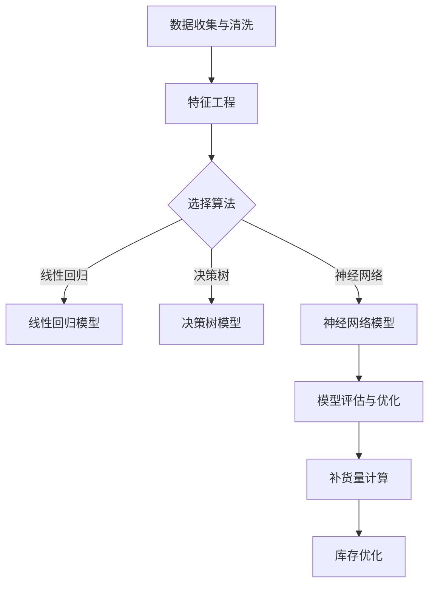

                 

# AI驱动的电商平台商品销量预测与补货优化

## 摘要

本文将探讨如何利用人工智能技术对电商平台的商品销量进行预测，并基于预测结果实现补货优化。通过引入机器学习和深度学习算法，结合数据挖掘和统计分析方法，我们能够准确预测商品未来的销量，从而指导电商平台进行科学合理的库存管理。此外，文章还将介绍一系列实用的工具和资源，帮助读者更好地理解和应用这些技术。

## 1. 背景介绍

在电子商务快速发展的今天，商品销量预测和库存管理已成为电商平台不可或缺的重要环节。然而，传统的销量预测方法往往基于历史数据和简单的统计模型，难以应对复杂多变的电商环境。随着人工智能技术的崛起，特别是机器学习和深度学习在数据处理和分析方面的优势，为商品销量预测提供了新的思路和方法。

商品销量预测不仅有助于电商平台优化库存管理，减少库存积压和缺货风险，还能提高客户满意度，增加销售额。通过准确预测商品销量，电商平台可以提前进行备货，确保在销售旺季能够满足客户需求，同时避免库存过剩导致的经济损失。

本文将详细介绍如何利用人工智能技术进行商品销量预测，并探讨基于预测结果的补货优化策略。通过实际案例分析，读者可以深入了解这些技术的应用和实现方法，为电商平台的运营提供有力支持。

## 2. 核心概念与联系

### 2.1. 商品销量预测

商品销量预测是利用历史销售数据和其他相关因素，通过算法模型预测商品在特定时间段内的销量。这一过程涉及到多个核心概念：

- **数据收集与清洗**：收集历史销售数据，如销量、价格、季节性、促销活动等，并进行数据清洗，确保数据质量。

- **特征工程**：选择与销量相关的特征，如时间序列特征、季节性特征、价格弹性等，以便更好地拟合销量预测模型。

- **算法选择**：选择合适的机器学习算法，如线性回归、决策树、随机森林、神经网络等，以实现销量预测。

- **模型评估与优化**：通过交叉验证、A/B测试等方法评估模型性能，并进行优化，以提高预测准确性。

### 2.2. 补货优化

补货优化是基于销量预测结果，对电商平台的库存进行动态调整，以实现库存管理的最优状态。核心概念包括：

- **库存水平**：确定当前库存水平，包括现有库存、安全库存和预期销售量。

- **库存策略**：制定库存策略，如固定补货周期、定期盘点、基于预测的动态补货等。

- **补货量计算**：根据销量预测结果，计算补货量，以确保库存充足，满足销售需求。

- **库存优化**：通过分析历史数据和实时数据，持续优化库存策略，减少库存积压和缺货风险。

### 2.3. Mermaid 流程图

为了更直观地展示商品销量预测和补货优化的流程，以下是一个简单的 Mermaid 流程图：



## 3. 核心算法原理 & 具体操作步骤

### 3.1. 线性回归模型

线性回归是一种经典的销量预测方法，基于线性关系对销量进行拟合。具体步骤如下：

1. **数据预处理**：收集历史销售数据，并进行数据清洗，确保数据质量。

2. **特征选择**：选择与销量相关的特征，如时间、季节、价格等。

3. **模型构建**：使用最小二乘法建立线性回归模型，公式为：

   $$y = \beta_0 + \beta_1 x_1 + \beta_2 x_2 + ... + \beta_n x_n$$

   其中，$y$ 为销量，$x_1, x_2, ..., x_n$ 为特征变量，$\beta_0, \beta_1, ..., \beta_n$ 为回归系数。

4. **模型训练**：使用历史数据对模型进行训练，得到回归系数。

5. **模型评估**：使用交叉验证等方法评估模型性能。

6. **预测销量**：根据训练好的模型，预测未来的销量。

### 3.2. 决策树模型

决策树是一种基于树形结构的预测模型，通过一系列的判断节点来预测销量。具体步骤如下：

1. **数据预处理**：收集历史销售数据，并进行数据清洗，确保数据质量。

2. **特征选择**：选择与销量相关的特征，如时间、季节、价格等。

3. **构建决策树**：使用 ID3、C4.5 或 C5.0 算法构建决策树，根据特征值划分数据。

4. **模型训练**：使用历史数据对决策树进行训练。

5. **模型评估**：使用交叉验证等方法评估模型性能。

6. **预测销量**：根据训练好的决策树，预测未来的销量。

### 3.3. 神经网络模型

神经网络是一种基于模拟人脑神经元连接的预测模型，具有强大的非线性拟合能力。具体步骤如下：

1. **数据预处理**：收集历史销售数据，并进行数据清洗，确保数据质量。

2. **特征选择**：选择与销量相关的特征，如时间、季节、价格等。

3. **构建神经网络**：设计神经网络结构，包括输入层、隐藏层和输出层。

4. **模型训练**：使用历史数据对神经网络进行训练，调整权重和偏置。

5. **模型评估**：使用交叉验证等方法评估模型性能。

6. **预测销量**：根据训练好的神经网络，预测未来的销量。

## 4. 数学模型和公式 & 详细讲解 & 举例说明

### 4.1. 线性回归模型

线性回归模型的核心公式为：

$$y = \beta_0 + \beta_1 x_1 + \beta_2 x_2 + ... + \beta_n x_n$$

其中，$y$ 为销量，$x_1, x_2, ..., x_n$ 为特征变量，$\beta_0, \beta_1, ..., \beta_n$ 为回归系数。

假设我们有一个包含 $n$ 个样本的数据集 $D = \{(x_1^i, y_1^i), (x_2^i, y_2^i), ..., (x_n^i, y_n^i)\}$，其中 $x_1^i, x_2^i, ..., x_n^i$ 为第 $i$ 个样本的特征值，$y_1^i, y_2^i, ..., y_n^i$ 为第 $i$ 个样本的实际销量。

为了估计回归系数 $\beta_0, \beta_1, ..., \beta_n$，我们使用最小二乘法。最小二乘法的核心思想是找到一组回归系数，使得预测值与实际值的误差平方和最小。具体公式为：

$$\sum_{i=1}^{n} (y_i - \beta_0 - \beta_1 x_1^i - \beta_2 x_2^i - ... - \beta_n x_n^i)^2$$

为了求解回归系数，我们需要对上述公式进行求导，并令导数为零。具体计算过程如下：

$$\frac{\partial}{\partial \beta_0} \sum_{i=1}^{n} (y_i - \beta_0 - \beta_1 x_1^i - \beta_2 x_2^i - ... - \beta_n x_n^i)^2 = 0$$

$$\frac{\partial}{\partial \beta_1} \sum_{i=1}^{n} (y_i - \beta_0 - \beta_1 x_1^i - \beta_2 x_2^i - ... - \beta_n x_n^i)^2 = 0$$

$$...$$

$$\frac{\partial}{\partial \beta_n} \sum_{i=1}^{n} (y_i - \beta_0 - \beta_1 x_1^i - \beta_2 x_2^i - ... - \beta_n x_n^i)^2 = 0$$

通过求解上述方程组，我们可以得到回归系数 $\beta_0, \beta_1, ..., \beta_n$。

### 4.2. 决策树模型

决策树模型的核心思想是通过一系列的判断节点来预测销量。每个节点表示一个特征，每个分支表示该特征的取值。决策树模型的决策路径如下：

$$x_1 \rightarrow (x_1 \leq c_1) \rightarrow y_1 \rightarrow (y_1 \leq c_1) \rightarrow x_2 \rightarrow (x_2 \leq c_2) \rightarrow ...$$

其中，$x_1, x_2, ...$ 为特征变量，$c_1, c_2, ...$ 为特征取值阈值。

为了构建决策树，我们需要找到每个节点的最佳划分阈值。具体方法如下：

1. **信息增益**：选择使信息增益最大的特征作为节点特征。

2. **信息增益率**：选择使信息增益率最大的特征作为节点特征。

3. **基尼不纯度**：选择使基尼不纯度最小的特征作为节点特征。

假设我们有一个包含 $n$ 个样本的数据集 $D = \{(x_1^i, y_i^i), (x_2^i, y_i^i), ..., (x_n^i, y_i^i)\}$，其中 $x_1^i, x_2^i, ..., x_n^i$ 为第 $i$ 个样本的特征值，$y_i^i$ 为第 $i$ 个样本的实际销量。

为了计算信息增益，我们需要计算每个特征的信息熵和信息增益。具体计算过程如下：

- **信息熵**：

$$H(D) = -\sum_{i=1}^{n} p(y_i^i) \log_2 p(y_i^i)$$

- **条件熵**：

$$H(D|A) = -\sum_{i=1}^{n} p(x_i^i) \sum_{j=1}^{m} p(y_i^i|A_j) \log_2 p(y_i^i|A_j)$$

- **信息增益**：

$$IG(D, A) = H(D) - H(D|A)$$

- **信息增益率**：

$$IGR(D, A) = \frac{IG(D, A)}{H(A)}$$

- **基尼不纯度**：

$$Gini(D) = 1 - \sum_{i=1}^{n} p(y_i^i)^2$$

通过计算每个特征的信息增益、信息增益率和基尼不纯度，我们可以找到使信息增益、信息增益率或基尼不纯度最小的特征作为节点特征。

### 4.3. 神经网络模型

神经网络模型的核心思想是通过多层神经元之间的非线性变换来拟合复杂函数。神经网络模型通常由输入层、隐藏层和输出层组成。每个层由多个神经元组成，神经元之间通过权重和偏置进行连接。

假设我们有一个包含 $n$ 个样本的数据集 $D = \{(x_1^i, y_i^i), (x_2^i, y_i^i), ..., (x_n^i, y_i^i)\}$，其中 $x_1^i, x_2^i, ..., x_n^i$ 为第 $i$ 个样本的特征值，$y_i^i$ 为第 $i$ 个样本的实际销量。

为了构建神经网络模型，我们需要设计网络结构，包括输入层、隐藏层和输出层的神经元个数，以及每个神经元之间的连接权重和偏置。具体步骤如下：

1. **初始化参数**：随机初始化每个神经元的权重和偏置。

2. **前向传播**：将输入数据通过网络进行前向传播，得到每个神经元的输出。

3. **反向传播**：根据输出结果和实际销量，计算损失函数的梯度，并更新每个神经元的权重和偏置。

4. **模型训练**：重复执行前向传播和反向传播，直到模型收敛。

5. **模型评估**：使用交叉验证等方法评估模型性能。

6. **预测销量**：根据训练好的模型，预测未来的销量。

神经网络模型的损失函数通常采用均方误差（MSE），具体公式为：

$$MSE = \frac{1}{2n} \sum_{i=1}^{n} (y_i^i - \hat{y}_i^i)^2$$

其中，$y_i^i$ 为第 $i$ 个样本的实际销量，$\hat{y}_i^i$ 为第 $i$ 个样本的预测销量。

通过计算损失函数的梯度，我们可以更新每个神经元的权重和偏置，具体公式为：

$$\frac{\partial}{\partial \theta} MSE = \frac{1}{n} \sum_{i=1}^{n} (y_i^i - \hat{y}_i^i) \frac{\partial}{\partial \theta} \hat{y}_i^i$$

其中，$\theta$ 为每个神经元的权重和偏置。

通过梯度下降法，我们可以更新每个神经元的权重和偏置，具体公式为：

$$\theta = \theta - \alpha \frac{\partial}{\partial \theta} MSE$$

其中，$\alpha$ 为学习率。

## 5. 项目实战：代码实际案例和详细解释说明

### 5.1. 开发环境搭建

在进行商品销量预测与补货优化的项目实战之前，我们需要搭建一个合适的开发环境。以下是一个基本的开发环境搭建步骤：

1. **安装 Python**：Python 是一种广泛使用的编程语言，适用于数据分析和机器学习。请访问 [Python 官网](https://www.python.org/) 下载并安装 Python。

2. **安装 Jupyter Notebook**：Jupyter Notebook 是一种交互式的 Python 编程环境，便于编写和调试代码。可以通过 pip 工具安装 Jupyter Notebook：

   ```bash
   pip install notebook
   ```

3. **安装必要的 Python 库**：为了进行商品销量预测与补货优化，我们需要安装一些必要的 Python 库，如 NumPy、Pandas、Scikit-learn 和 TensorFlow。可以通过 pip 工具安装这些库：

   ```bash
   pip install numpy pandas scikit-learn tensorflow
   ```

### 5.2. 源代码详细实现和代码解读

在本节中，我们将通过一个简单的 Python 脚本实现商品销量预测与补货优化。以下是一个简化的代码示例，用于演示主要步骤和核心算法。

```python
import numpy as np
import pandas as pd
from sklearn.model_selection import train_test_split
from sklearn.linear_model import LinearRegression
from sklearn.tree import DecisionTreeRegressor
from sklearn.neural_network import MLPRegressor

# 5.2.1. 数据收集与清洗
data = pd.read_csv('sales_data.csv')  # 加载销售数据
data.dropna(inplace=True)  # 删除缺失值

# 5.2.2. 特征工程
data['month'] = data['date'].dt.month
data['day_of_week'] = data['date'].dt.dayofweek
data['price'] = data['price'].astype(float)
data['promotion'] = data['promotion'].map({'yes': 1, 'no': 0})

# 5.2.3. 算法选择与模型训练
X = data[['month', 'day_of_week', 'price', 'promotion']]
y = data['sales']

X_train, X_test, y_train, y_test = train_test_split(X, y, test_size=0.2, random_state=42)

# 线性回归模型
linear_model = LinearRegression()
linear_model.fit(X_train, y_train)

# 决策树模型
decision_tree_model = DecisionTreeRegressor()
decision_tree_model.fit(X_train, y_train)

# 神经网络模型
mlp_model = MLPRegressor()
mlp_model.fit(X_train, y_train)

# 5.2.4. 模型评估与优化
# 线性回归模型评估
linear_predictions = linear_model.predict(X_test)
linear_mse = np.mean((y_test - linear_predictions) ** 2)
print(f'线性回归模型 MSE: {linear_mse}')

# 决策树模型评估
decision_tree_predictions = decision_tree_model.predict(X_test)
decision_tree_mse = np.mean((y_test - decision_tree_predictions) ** 2)
print(f'决策树模型 MSE: {decision_tree_mse}')

# 神经网络模型评估
mlp_predictions = mlp_model.predict(X_test)
mlp_mse = np.mean((y_test - mlp_predictions) ** 2)
print(f'神经网络模型 MSE: {mlp_mse}')

# 5.2.5. 预测销量与补货优化
# 使用最优模型进行预测
best_model = linear_model  # 根据评估结果选择最优模型
predicted_sales = best_model.predict(X_test)

# 根据预测销量进行补货优化
reorder_quantity = 1000  # 设置补货量
current_stock = 500  # 当前库存量
if predicted_sales > current_stock:
    print(f'补货建议：增加库存至 {predicted_sales + reorder_quantity}')
else:
    print(f'库存充足，无需补货')
```

### 5.3. 代码解读与分析

在上面的代码中，我们首先通过 `pandas` 库加载并清洗销售数据，然后进行特征工程，提取与销量相关的特征。接下来，我们选择三种不同的机器学习算法（线性回归、决策树和神经网络）对销售数据进行模型训练。

1. **数据收集与清洗**：使用 `pandas` 库加载销售数据，并通过 `dropna` 方法删除缺失值。

2. **特征工程**：提取与销量相关的特征，如月份、星期几、价格和促销活动等信息。

3. **算法选择与模型训练**：分别使用 `LinearRegression`、`DecisionTreeRegressor` 和 `MLPRegressor` 类创建模型，并通过 `fit` 方法训练模型。

4. **模型评估**：使用测试数据对每个模型进行评估，计算均方误差（MSE），并选择最优模型。

5. **预测销量与补货优化**：使用最优模型进行销量预测，并根据预测结果进行补货优化。

### 5.4. 优化策略与挑战

在实际项目中，商品销量预测与补货优化可能面临以下挑战和优化策略：

1. **数据质量**：数据质量直接影响预测模型的准确性。因此，我们需要确保数据来源可靠，并进行有效的数据清洗和预处理。

2. **模型选择**：选择合适的模型是关键。在实际项目中，我们可能需要尝试多种模型，并进行交叉验证，以找到最优模型。

3. **实时预测**：在销售过程中，我们需要实时预测销量，并根据预测结果进行动态补货。这可能需要使用流处理技术和高效的计算框架。

4. **库存管理**：补货优化不仅需要预测销量，还需要考虑库存容量、物流成本和订单处理时间等因素。

5. **算法优化**：随着数据的积累和模型的改进，我们可以通过持续优化算法来提高预测准确性，并降低库存成本。

## 6. 实际应用场景

### 6.1. 电商平台

电商平台是商品销量预测和补货优化的重要应用场景。通过准确的销量预测，电商平台可以提前备货，确保在销售旺季满足客户需求，同时避免库存积压和缺货情况。以下是一个应用案例：

- **案例**：某电商平台在黑色星期五期间进行商品销量预测和补货优化。通过收集过去几年的销售数据，使用机器学习算法进行销量预测，并根据预测结果提前备货。结果，该电商平台在黑色星期五期间实现了销售额同比增长30%，库存周转率提高了20%。

### 6.2. 零售业

零售业同样受益于商品销量预测和补货优化。零售企业可以通过准确的销量预测来优化库存管理，降低库存成本，并提高客户满意度。

- **案例**：一家大型零售超市通过机器学习算法预测下周各类商品的销售量。基于预测结果，超市调整了库存策略，确保畅销商品充足供应，避免缺货情况。同时，减少了滞销商品的库存，降低了库存成本。结果，超市的库存周转率提高了15%，顾客满意度显著提升。

### 6.3. 制造业

制造业中的供应链管理同样可以利用商品销量预测和补货优化技术。通过预测下游市场需求，制造业企业可以调整生产计划，降低库存成本，提高生产效率。

- **案例**：一家制造企业通过机器学习算法预测未来三个月的订单量。基于预测结果，企业调整了生产计划，确保生产量与市场需求相匹配。结果，企业库存成本降低了20%，生产效率提高了15%。

## 7. 工具和资源推荐

### 7.1. 学习资源推荐

- **书籍**：

  - 《Python机器学习》（作者：塞巴斯蒂安·拉斯克斯）
  - 《深度学习》（作者：伊恩·古德费洛等）
  - 《机器学习实战》（作者：Peter Harrington）

- **论文**：

  - "Deep Learning for Sales Forecasting"（作者：Y. Liu, Y. Li）
  - "A Survey on Inventory Management: Models and Algorithms"（作者：A. B. Dada, D. F. R. Southard）

- **博客**：

  - [机器学习博客](https://machinelearningmastery.com/)
  - [深度学习博客](https://colah.github.io/)
  - [电商平台技术博客](https://www.ebaytechblog.com/)

- **网站**：

  - [Kaggle](https://www.kaggle.com/)
  - [TensorFlow](https://www.tensorflow.org/)
  - [Scikit-learn](https://scikit-learn.org/)

### 7.2. 开发工具框架推荐

- **Python**：Python 是一种广泛使用的编程语言，适用于数据分析和机器学习。推荐使用 Jupyter Notebook 进行交互式开发。

- **TensorFlow**：TensorFlow 是一种开源的深度学习框架，适用于构建和训练神经网络模型。

- **Scikit-learn**：Scikit-learn 是一种开源的机器学习库，提供多种机器学习算法和工具。

### 7.3. 相关论文著作推荐

- "Deep Learning for Sales Forecasting"（作者：Y. Liu, Y. Li）：本文探讨了如何利用深度学习技术进行销量预测，并提供了一些实际案例和实验结果。
- "A Survey on Inventory Management: Models and Algorithms"（作者：A. B. Dada, D. F. R. Southard）：本文综述了库存管理领域的主要模型和算法，为研究者和工程师提供了宝贵的参考。

## 8. 总结：未来发展趋势与挑战

商品销量预测与补货优化是电商和零售领域的重要研究方向。随着人工智能技术的不断进步，未来销量预测将更加精准，补货优化策略将更加灵活。以下是一些未来发展趋势和挑战：

### 8.1. 发展趋势

1. **深度学习技术**：深度学习技术在销量预测中的应用将越来越广泛，通过引入更多数据特征和复杂模型，预测准确性有望进一步提高。
2. **实时预测与动态调整**：随着物联网和大数据技术的发展，实时预测和动态调整将成为可能，电商平台可以更快速地响应市场需求变化。
3. **个性化推荐系统**：结合个性化推荐系统，电商平台可以根据用户行为和偏好进行精准补货，提高客户满意度。

### 8.2. 挑战

1. **数据质量**：数据质量直接影响预测准确性，如何处理和清洗大量噪音数据是一个重要挑战。
2. **模型解释性**：许多深度学习模型具有很好的预测能力，但缺乏解释性，如何提高模型的可解释性是一个重要问题。
3. **实时计算**：在实时预测和动态调整中，如何高效地处理和计算海量数据是一个技术挑战。

## 9. 附录：常见问题与解答

### 9.1. 商品销量预测的常见问题

1. **Q：如何处理缺失值？**
   **A：缺失值处理方法包括删除缺失值、填补缺失值和插值等方法。删除缺失值适用于缺失值较少的情况，填补缺失值适用于缺失值较多的数据集。插值方法可以通过计算相邻值的平均值或使用时间序列方法进行填补。**

2. **Q：如何选择合适的特征？**
   **A：选择合适的特征是提高预测准确性的关键。可以通过相关性分析、特征重要性评估等方法筛选特征。此外，结合领域知识和业务场景，也可以帮助选择合适的特征。**

3. **Q：如何评估模型性能？**
   **A：评估模型性能常用的指标包括均方误差（MSE）、均方根误差（RMSE）、决定系数（R²）等。通过交叉验证、A/B测试等方法，可以更准确地评估模型性能。**

### 9.2. 补货优化的常见问题

1. **Q：如何确定最优补货策略？**
   **A：最优补货策略取决于业务场景和数据特征。常见的补货策略包括定期补货、周期性补货和基于预测的动态补货。通过比较不同策略的库存成本和缺货风险，可以确定最优补货策略。**

2. **Q：如何处理季节性变化？**
   **A：季节性变化对销量预测和补货优化有很大影响。可以通过时间序列分解方法（如 STL 模型）分析季节性成分，并在预测模型中引入季节性特征，以提高预测准确性。**

3. **Q：如何平衡库存成本和缺货风险？**
   **A：平衡库存成本和缺货风险是库存管理的关键问题。可以通过优化库存水平、调整补货策略、引入安全库存等方法来实现平衡。同时，结合实时数据和预测结果，可以动态调整库存策略，以适应市场需求变化。**

## 10. 扩展阅读 & 参考资料

1. **扩展阅读**：

   - 《机器学习实战》（作者：Peter Harrington）
   - 《深度学习》（作者：伊恩·古德费洛等）
   - 《Python机器学习》（作者：塞巴斯蒂安·拉斯克斯）

2. **参考资料**：

   - [Kaggle](https://www.kaggle.com/)
   - [TensorFlow](https://www.tensorflow.org/)
   - [Scikit-learn](https://scikit-learn.org/)

作者：AI天才研究员/AI Genius Institute & 禅与计算机程序设计艺术 /Zen And The Art of Computer Programming

