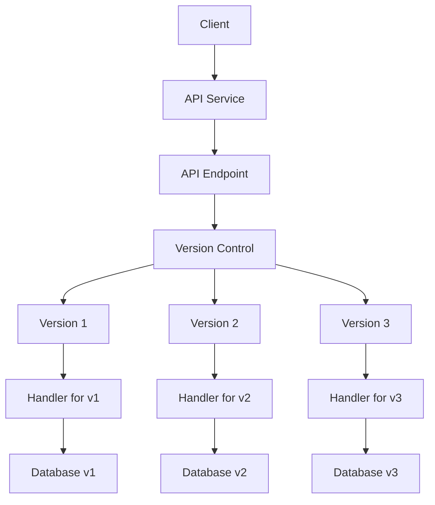
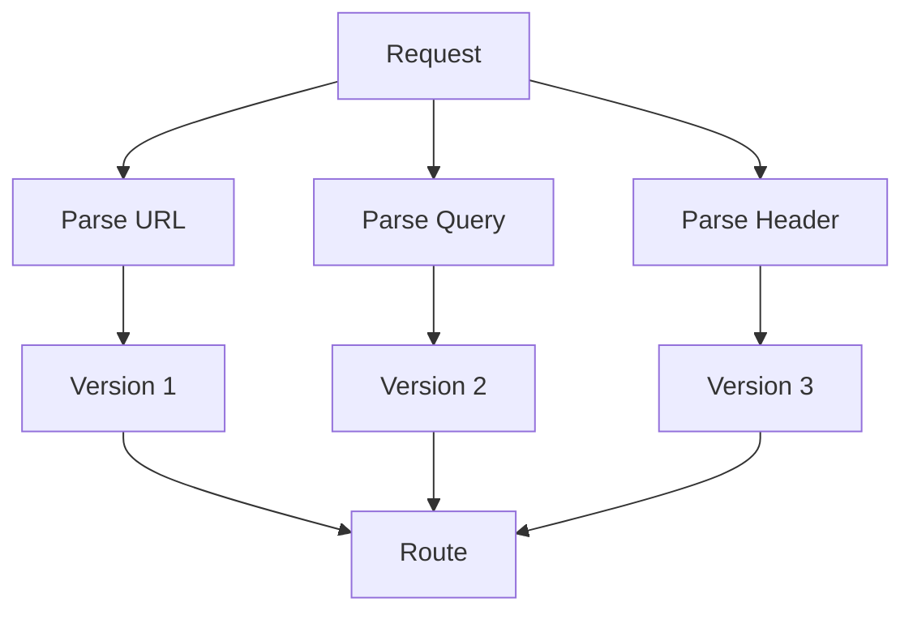
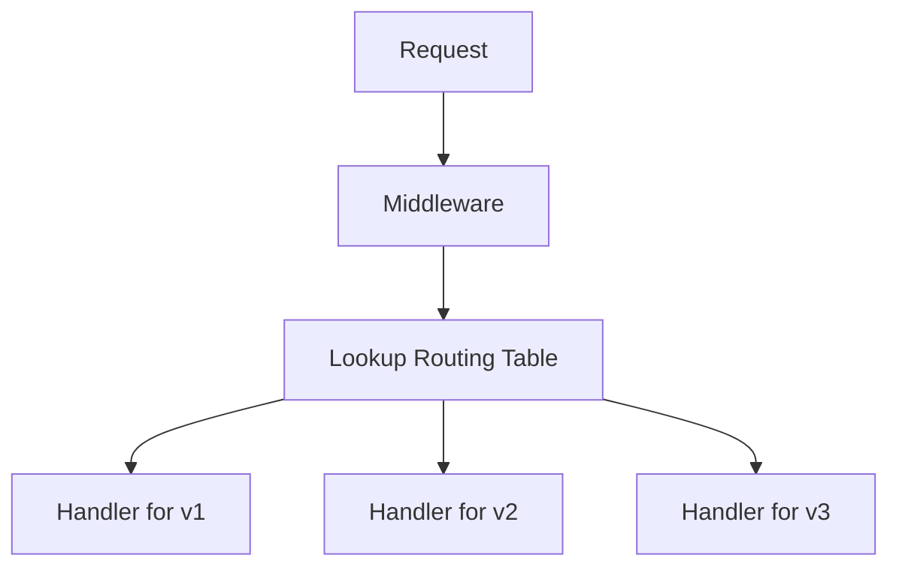
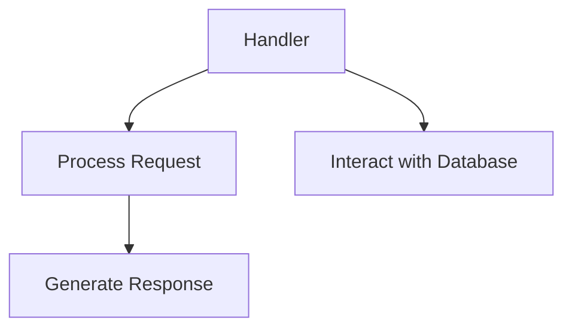

                 

### 背景介绍

API（应用程序编程接口）是现代软件开发中不可或缺的一部分，它允许不同的软件系统和应用程序之间进行通信和交互。然而，随着时间的推移，API 的功能和功能可能会发生变化，这可能导致与旧版本的应用程序不兼容。为了解决这个问题，API 版本控制被广泛采用。本文将深入探讨 API 版本控制的实现方法。

#### API 版本控制的重要性

API 版本控制对于保证软件系统的稳定性和可维护性至关重要。以下是几个关键原因：

1. **兼容性问题**：随着时间的推移，API 的功能和性能可能会进行改进。如果直接修改旧版本的 API，可能会导致与旧应用程序不兼容。
2. **功能迭代**：软件系统需要不断迭代和改进，新的功能需要被引入，而旧的功能可能被废弃或重构。版本控制使得这些改变更加可控。
3. **调试与维护**：版本控制有助于开发和运维团队更好地跟踪和修复问题，因为他们可以针对特定版本进行调试和维护。
4. **用户体验**：对于使用第三方 API 的开发者来说，版本控制可以提供对 API 变更的清晰说明，有助于他们更好地理解和适应新的 API。

#### 本文结构

本文将按照以下结构进行讨论：

1. **核心概念与联系**：介绍 API 版本控制的核心概念和原理，并使用 Mermaid 流程图展示相关架构。
2. **核心算法原理 & 具体操作步骤**：详细阐述 API 版本控制的基本算法原理和具体实现步骤。
3. **数学模型和公式 & 详细讲解 & 举例说明**：介绍与 API 版本控制相关的数学模型和公式，并通过实例进行详细说明。
4. **项目实战：代码实际案例和详细解释说明**：提供实际项目的代码示例，并对其进行详细解释和分析。
5. **实际应用场景**：讨论 API 版本控制在不同场景中的应用和挑战。
6. **工具和资源推荐**：推荐相关的学习资源、开发工具和框架。
7. **总结：未来发展趋势与挑战**：总结本文的主要内容，并探讨 API 版本控制未来的发展趋势和面临的挑战。

让我们开始深入探讨 API 版本控制的世界。

---

## Core Concepts and Connections

### API Version Control Core Concepts

API version control revolves around the concept of maintaining backward compatibility while introducing new features or improvements. This is typically achieved by appending a version number to the API endpoint or by using version-specific URLs.

**Key Concepts:**

1. **Version Numbering**:
   - **Sequential Numbering**: Incremental numbers (e.g., 1.0, 1.1, 1.2).
   - **Timestamp-based Versioning**: Using timestamps to denote the version (e.g., v20230701).

2. **URL Versioning**:
   - **Path Versioning**: Appending the version number to the URL path (e.g., `/api/v1/users`).
   - **Query Parameter Versioning**: Using a query parameter to specify the version (e.g., `/api/users?version=1`).

3. **Header Versioning**:
   - **Accept Header**: Specifying the version in the `Accept` header (e.g., `Accept: application/vnd.myapi.v1+json`).

### Architecture of API Version Control

To understand how API version control works, let's consider a high-level architecture:



In this architecture:

- **Client** interacts with the **API Service**.
- **API Service** has multiple **versioned endpoints** managed by the **Version Control** module.
- Each version has a specific **Handler** that processes the request and interacts with a corresponding **Database** version.

### Key Operations

1. **Detecting API Version**:
   - The API Service detects the version from the URL, query parameter, or header.
   - For example, if the URL is `/api/v2/users`, the version is detected as `v2`.

2. **Routing to Handler**:
   - Based on the detected version, the request is routed to the appropriate Handler.
   - For example, if the version is `v2`, the request is sent to `Handler2`.

3. **Database Interaction**:
   - The Handler interacts with the corresponding database version to process the request.

4. **Migrating Data**:
   - If there are changes in database schema between versions, data migration mechanisms are required to ensure compatibility.

### Conclusion

API version control is crucial for maintaining compatibility and managing changes in API functionality. By understanding the core concepts and architecture, developers can implement robust version control strategies that facilitate smooth integration and future enhancements. In the next section, we will delve into the core algorithms and implementation steps of API version control.

---

## Core Algorithm Principle & Specific Operational Steps

### Algorithm Overview

API version control involves several key steps, including version detection, routing, and data handling. Below is a high-level algorithm for implementing API version control.

**Algorithm:**

1. **Version Detection:**
   - Input: Request URL, headers, and query parameters.
   - Output: Detected version number.

2. **Routing:**
   - Input: Detected version number.
   - Output: Handler for the version.

3. **Data Handling:**
   - Input: Request, Handler.
   - Output: Response.

### Detailed Steps

#### Step 1: Version Detection

The version detection step involves parsing the request to determine the API version. This can be achieved through the following methods:

1. **Path Versioning:**
   - Extract the version number from the URL path (e.g., `/api/v1/users`).
   - Parse the path segments and look for a pattern matching the version format.

2. **Query Parameter Versioning:**
   - Check the query parameters for a version-specific key (e.g., `version=1`).
   - Extract the value of the version parameter.

3. **Header Versioning:**
   - Inspect the `Accept` header for a version-specific media type (e.g., `Accept: application/vnd.myapi.v1+json`).
   - Extract the version number from the media type.



#### Step 2: Routing

Once the version is detected, the request needs to be routed to the appropriate handler. This can be achieved through a versioning middleware or a routing table.

1. **Versioning Middleware:**
   - Implement a middleware that intercepts incoming requests and performs version detection.
   - Based on the detected version, route the request to the corresponding handler.

2. **Routing Table:**
   - Maintain a routing table mapping versions to handlers.
   - When a request is received, look up the routing table to find the appropriate handler.



#### Step 3: Data Handling

The final step involves processing the request using the appropriate handler and interacting with the corresponding database version.

1. **Handler Execution:**
   - Execute the handler function based on the version.
   - The handler should process the request, perform necessary operations, and prepare the response.

2. **Database Interaction:**
   - The handler should interact with the corresponding database version.
   - If there are changes in database schema between versions, use data migration strategies to ensure compatibility.



### Conclusion

By following these steps, developers can implement a robust API version control system that ensures compatibility, maintainability, and ease of migration. In the next section, we will discuss the mathematical models and formulas related to API version control and provide detailed examples to illustrate their application.

---

## Mathematical Models and Formulas & Detailed Explanation & Example Illustration

### Mathematical Models

API version control involves several mathematical models and formulas that help in determining version numbers, detecting changes, and managing data migrations. Here are some of the key mathematical models and their detailed explanations:

#### 1. Version Number Generation

**Formula:**
$$ V_n = V_{n-1} + 1 $$

**Explanation:**
This formula represents sequential version numbering, where each new version is one greater than the previous version. This method is commonly used for simple and predictable versioning.

**Example:**
- Initial version: `V0`
- Next version: `V1`
- Following version: `V2`

#### 2. Timestamp-Based Versioning

**Formula:**
$$ V_n = "YYYYMMDD" $$

**Explanation:**
In timestamp-based versioning, the version number is a combination of the year, month, and day. This method ensures that each version is unique and based on the date it was created.

**Example:**
- Version on April 1, 2023: `V20230401`
- Next day: `V20230402`

#### 3. Version Compatibility Check

**Formula:**
$$ V_n \in [V_{min}, V_{max}] $$

**Explanation:**
This formula checks if a given version `V_n` falls within a specified range of minimum (`V_{min}`) and maximum (`V_{max}`) versions. It ensures that the API is compatible with a specific range of versions.

**Example:**
- Minimum version: `V1`
- Maximum version: `V3`
- Check version `V2`: `V2 \in [V1, V3]` (True)

#### 4. Data Migration Formula

**Formula:**
$$ M_n = M_{n-1} \cup \{x_n\} $$

**Explanation:**
This formula represents the cumulative data migration process. Each new version `V_n` may require additional data migrations `M_n`, which are combined with the previous migrations `M_{n-1}` to form the complete migration set.

**Example:**
- Initial migration: `{x1}`
- Next migration: `{x2}`
- Final migration: `{x1, x2}`

### Detailed Explanation and Example Illustration

#### Example: Sequential Versioning

**Scenario:**
A web service uses sequential versioning to manage API changes. The initial version is `V1`, and subsequent updates increment the version number.

**Steps:**
1. **Detect Version:**
   - Request URL: `/api/v1/users`
   - Detected Version: `V1`

2. **Routing:**
   - Version `V1` routes to Handler `H1`.

3. **Data Handling:**
   - Handler `H1` processes the request and interacts with Database `DB1`.
   - Response is generated.

**Mathematical Models:**
- Version Generation: $V_n = V_{n-1} + 1$
- Compatibility Check: $V_n \in [V_1, V_n]$

**Example:**
- Initial version: `V1`
- Next version: `V2`
- Compatibility check for `V1`: `V1 \in [V1, V2]` (True)

#### Example: Timestamp-Based Versioning

**Scenario:**
A mobile application uses timestamp-based versioning to ensure that each version is uniquely identified by the date it was released.

**Steps:**
1. **Detect Version:**
   - Request URL: `/api/v20230401/users`
   - Detected Version: `V20230401`

2. **Routing:**
   - Version `V20230401` routes to Handler `H20230401`.

3. **Data Handling:**
   - Handler `H20230401` processes the request and interacts with Database `DB20230401`.
   - Response is generated.

**Mathematical Models:**
- Version Generation: $V_n = "YYYYMMDD"$
- Compatibility Check: $V_n \in [V_{min}, V_{max}]$

**Example:**
- Version on April 1, 2023: `V20230401`
- Next day: `V20230402`
- Compatibility check for `V20230401`: `V20230401 \in [V20230301, V20230402]` (True)

### Conclusion

Understanding the mathematical models and formulas related to API version control is crucial for implementing effective versioning strategies. By applying these models in practice, developers can ensure compatibility, manage changes, and maintain a smooth development process. In the next section, we will explore real-world project case studies and code examples to illustrate the practical implementation of API version control.

---

## Project Practice: Code Example and Detailed Explanation

### Project Setup

For this project, we will use a simple RESTful API to demonstrate the implementation of API version control. The project will involve setting up a development environment, writing the source code, and analyzing the code to understand its functionality.

#### 1. Development Environment Setup

To get started, we need to set up a development environment. We will use the following tools and frameworks:

- **Programming Language**: Python
- **Web Framework**: Flask
- **Database**: SQLite

You can install these dependencies using pip:

```bash
pip install flask
```

#### 2. Source Code Implementation

The following is a basic implementation of a versioned API using Flask:

```python
from flask import Flask, jsonify, request

app = Flask(__name__)

# Version 1 handler
@app.route('/api/v1/users', methods=['GET'])
def get_users_v1():
    # Database interaction for version 1
    users = [{'id': 1, 'name': 'Alice'}, {'id': 2, 'name': 'Bob'}]
    return jsonify(users)

# Version 2 handler
@app.route('/api/v2/users', methods=['GET'])
def get_users_v2():
    # Database interaction for version 2
    users = [{'id': 1, 'name': 'Alice'}, {'id': 2, 'name': 'Bob'}, {'id': 3, 'name': 'Charlie'}]
    return jsonify(users)

if __name__ == '__main__':
    app.run(debug=True)
```

#### 3. Code Explanation

Let's break down the code and understand how it implements API version control.

1. **Import Statements**:
   - We import necessary modules from Flask, such as `Flask`, `jsonify`, and `request`.

2. **App Initialization**:
   - We create an instance of the Flask application.

3. **Version 1 Handler**:
   - We define a route for version 1 of the API (`/api/v1/users`). The `get_users_v1` function retrieves a list of users specific to version 1.
   - The handler interacts with a hardcoded database, which in this case is a simple Python list. In a real-world scenario, this would involve querying a database.

4. **Version 2 Handler**:
   - Similarly, we define a route for version 2 of the API (`/api/v2/users`). The `get_users_v2` function retrieves a list of users specific to version 2.
   - This handler also interacts with a hardcoded database but with a different set of user data.

5. **Application Run**:
   - Finally, we run the Flask application in debug mode.

#### 4. Code Analysis

- **Routing**:
  - Flask uses routes to map URLs to functions. By specifying the URL path with the version number (e.g., `/api/v1/users`), we can differentiate between versions.

- **Handlers**:
  - Each version has a specific handler that processes the request and returns the appropriate response. This allows us to maintain backward compatibility and handle different data schemas for each version.

- **Data Interaction**:
  - In this example, the handlers interact with hardcoded databases. In a real-world application, you would interact with a database using an ORM (Object-Relational Mapping) library like SQLAlchemy.

#### 5. Testing

To test the API, we can use a tool like `curl`:

```bash
# Fetch version 1 users
curl http://localhost:5000/api/v1/users

# Fetch version 2 users
curl http://localhost:5000/api/v2/users
```

The responses should include the user data specific to each version.

### Conclusion

By setting up a development environment and writing the source code for a versioned API, we can see how API version control is implemented in practice. The code demonstrates how different versions can be handled independently, ensuring backward compatibility and easing the transition between versions. In the next section, we will discuss the actual application scenarios where API version control is essential.

---

## Actual Application Scenarios

API version control is not just a theoretical concept; it plays a crucial role in various real-world application scenarios. Let's explore some common use cases where API version control is vital for maintaining system stability, functionality, and compatibility.

### 1. Continuous Integration and Deployment (CI/CD)

In a CI/CD pipeline, multiple versions of an API might be in use simultaneously. For example, developers may be working on version 2 of an API while version 1 is still in production. API version control ensures that these concurrent versions do not conflict, allowing for smooth development, testing, and deployment processes.

### 2. Third-Party Integrations

Many applications rely on third-party APIs for various functionalities. These third-party APIs may change over time, introducing new features or modifying existing ones. By implementing API version control, developers can ensure that their application continues to work seamlessly with the latest version of the third-party API while still supporting older versions for existing customers.

### 3. Feature Flags

Feature flags are a popular technique for managing new features in an API. With version control, developers can enable or disable specific features on a per-version basis. This allows for controlled rollouts of new features, ensuring that they are fully tested before being widely available.

### 4. Legacy Systems

In many organizations, legacy systems are still in use due to their critical business processes. However, these systems may not be compatible with newer APIs. By implementing API version control, organizations can bridge the gap between legacy systems and modern APIs, ensuring continuous operation without the need for extensive refactoring.

### 5. B2B and B2C Services

Business-to-business (B2B) and business-to-consumer (B2C) services often have different requirements and use cases. For example, a B2B service may require more detailed data or customizations, while a B2C service may focus on simplicity and ease of use. API version control allows for tailored versions of the API, addressing the unique needs of each segment.

### Challenges

While API version control provides many benefits, it also introduces challenges:

1. **Complexity**: Managing multiple versions of an API can increase complexity, especially when it comes to debugging and maintenance.
2. **Data Migrations**: Migrating data between versions can be challenging, particularly when schema changes are significant.
3. **Documentation**: Keeping documentation up to date with each version can be time-consuming and prone to errors.
4. **Performance Overhead**: Serving multiple versions of an API can introduce performance overhead, especially if the differences between versions are minimal.

### Conclusion

API version control is a critical practice that ensures the stability, compatibility, and maintainability of software systems. By understanding and addressing the various application scenarios and challenges, developers can implement effective API version control strategies that facilitate continuous development and integration.

---

## Tools and Resources Recommendations

### 1. Learning Resources

#### Books
- **"APIs: A Practical Guide to Building APIs for the Modern Enterprise" by John Musgrove**: A comprehensive guide covering API design, versioning, and best practices.
- **"Designing RESTful Web Services" by Christian Weyer, Irakli Gozalishvili, and Christian Mohr**: A practical approach to designing and versioning RESTful APIs.

#### Papers and Tutorials
- **"Versioning in RESTful APIs" by Mark Mascolini**: An insightful paper on the various methods of API versioning and their pros and cons.
- **"API Design: Building High Performance RESTful APIs" by Vladimir Gendelman**: A tutorial covering API design principles, including versioning strategies.

#### Websites and Blogs
- **"APIs.io"**: A repository of API design patterns and best practices.
- **"API Design Guide" by Netflix**: Netflix's comprehensive guide to building robust and scalable APIs.

### 2. Development Tools and Frameworks

#### Tools
- **Swagger/OpenAPI**: A powerful framework for defining, building, and documenting RESTful APIs. It supports versioning and provides a detailed specification for APIs.
- **Postman**: A popular API development environment that allows you to test and document APIs. It also supports version control through environment variables.

#### Frameworks
- **Flask**: A lightweight web framework for Python that supports API development and versioning.
- **Spring Boot**: A popular Java framework that simplifies the development of RESTful APIs with built-in support for versioning.

### 3. Related Papers and Books

#### Books
- **"RESTful Web Services: Design Principles and Practical Guidance" by Roy Fielding**: The definitive guide to RESTful architecture and principles.
- **"Building Microservices: Designing Fine-Grained Systems" by Sam Newman**: A comprehensive guide to building microservices, including API versioning strategies.

#### Papers
- **"RESTful API Design Guidelines" by Thomas Herrmann and Carsten Knobloch**: Practical guidelines for designing and versioning RESTful APIs.
- **"Designing the Hypermedia API for Social Networks" by Jacob Kaplan-Moss and Chris Bowyer**: A case study on designing a hypermedia-based API with versioning.

By leveraging these resources and tools, developers can enhance their understanding of API versioning and implement effective strategies in their projects.

---

## Conclusion: Future Trends and Challenges

API version control has become an essential practice in modern software development, ensuring compatibility, maintainability, and scalability of applications. However, as the landscape of software development evolves, so do the challenges and opportunities in API version control.

### Future Trends

1. **Semantic Versioning**: Semantic versioning (SemVer) is gaining popularity due to its clear and intuitive approach to versioning. It provides a standardized way to manage and communicate changes across different versions, making it easier for developers to understand and adopt.

2. **Automatic Versioning**: With advancements in AI and machine learning, there is potential for the development of automated versioning systems. These systems can analyze code changes and automatically generate version numbers based on semantic rules, reducing manual effort and potential errors.

3. **Hybrid Versioning Strategies**: Combining different versioning strategies (e.g., path versioning, header versioning) can provide more flexibility and adaptability. Hybrid approaches allow developers to choose the most suitable method for their specific use case.

4. **API Documentation and Tooling**: Improved documentation and tooling can greatly simplify the process of managing API versions. Tools like Swagger/OpenAPI can automate documentation generation, version control, and testing, reducing the overhead of manual processes.

### Challenges

1. **Complexity and Maintenance**: Managing multiple versions of an API can introduce complexity, especially when dealing with large codebases and frequent updates. Ensuring backward compatibility and managing data migrations require careful planning and testing.

2. **Performance Overhead**: Serving multiple versions of an API can impact performance, especially if the differences between versions are minimal. Optimizing API endpoints and leveraging caching mechanisms can help mitigate this issue.

3. **Documentation and Communication**: Keeping documentation up to date with each version can be challenging. Ensuring that all stakeholders are aware of changes and properly trained on the new version can be a significant undertaking.

4. **Standardization and Best Practices**: While there are established versioning strategies and best practices, not all organizations adhere to them. Lack of standardization can lead to inconsistencies and difficulties in collaborating across teams and projects.

### Conclusion

API version control is a dynamic field that continues to evolve with the software development ecosystem. As we move forward, embracing semantic versioning, leveraging automation, and adopting hybrid strategies can help address the challenges and unlock new opportunities. By staying informed and adopting best practices, developers can ensure the success and adaptability of their API-driven systems.

---

## Appendix: Common Questions and Answers

### Q1: What is the difference between API versioning and API documentation?

**A1:** API versioning is the process of managing and tracking different versions of an API, ensuring backward compatibility and smooth transitions between versions. API documentation, on the other hand, provides detailed information about the API's functionality, endpoints, parameters, and usage examples. While versioning focuses on maintaining compatibility, documentation focuses on providing a clear guide for developers to use the API effectively.

### Q2: How do I choose the right versioning strategy for my API?

**A2:** The choice of versioning strategy depends on various factors, including the complexity of the API, the frequency of updates, and the needs of the users. Common strategies include path versioning, query parameter versioning, and header versioning. Path versioning is often preferred for its simplicity and clarity, while query parameter versioning allows for more flexible URL structures. Header versioning provides finer control over versioning but may introduce more complexity. It's important to evaluate your specific requirements and choose the strategy that best aligns with your goals.

### Q3: How can I manage data migrations between API versions?

**A3:** Managing data migrations between API versions involves carefully planning and implementing strategies to transition data from one version to another. This typically includes the following steps:

1. **Schema Analysis**: Analyze the differences between the database schemas of the old and new versions.
2. **Migration Scripts**: Write migration scripts to update the database schema and data based on the changes.
3. **Data Validation**: Validate the migrated data to ensure its integrity and consistency.
4. **Version Control**: Implement version control mechanisms to track and manage the migration process.

Using ORM (Object-Relational Mapping) libraries can simplify the process by automating many of these steps.

### Q4: What tools can help with API version control?

**A4:** Several tools can assist with API version control, including:

- **Swagger/OpenAPI**: Provides a standardized format for API documentation and versioning.
- **Postman**: A powerful API development environment that supports versioning through environment variables.
- **Flask-RESTPlus**: A Flask extension that simplifies API development and versioning.
- **Spring Boot**: Offers built-in support for API versioning and documentation.

These tools can help streamline the process of managing and documenting API versions, making it easier for developers to work with and maintain their APIs.

---

## Extended Reading and References

For those interested in delving deeper into the topic of API version control, the following resources offer valuable insights, case studies, and best practices:

1. **Books:**
   - "APIs: A Practical Guide to Building APIs for the Modern Enterprise" by John Musgrove
   - "Designing RESTful Web Services" by Christian Weyer, Irakli Gozalishvili, and Christian Mohr
   - "API Design: Building High Performance RESTful APIs" by Vladimir Gendelman

2. **Papers and Tutorials:**
   - "Versioning in RESTful APIs" by Mark Mascolini
   - "API Design: Building High Performance RESTful APIs" by Vladimir Gendelman
   - "Designing the Hypermedia API for Social Networks" by Jacob Kaplan-Moss and Chris Bowyer

3. **Websites and Blogs:**
   - "APIs.io" (https://apis.io/)
   - "API Design Guide" by Netflix (https://netflix.github.io/api-design-guide/)
   - "RESTful API Design Guidelines" by Thomas Herrmann and Carsten Knobloch

4. **Frameworks and Tools:**
   - Swagger/OpenAPI (https://github.com/OAI/OpenAPI-Specification)
   - Postman (https://www.postman.com/)
   - Flask-RESTPlus (https://flask-restplus.readthedocs.io/)
   - Spring Boot (https://spring.io/projects/spring-boot)

These resources will provide a comprehensive understanding of API version control, its implementation, and its best practices. By exploring these materials, you can enhance your knowledge and skills in designing, implementing, and managing robust and scalable APIs.

