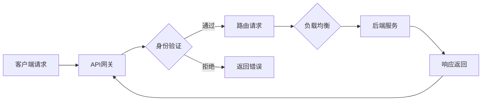

                 

### 背景介绍

API网关（API Gateway）是现代微服务架构中至关重要的组成部分。在软件开发中，API网关扮演着连接客户端与后台服务器的中介角色，统一管理接口调用、流量控制、安全性等关键任务。随着互联网应用和微服务架构的普及，API网关的重要性日益凸显。

#### 什么是API网关？

API网关是一种服务器，它接收来自客户端的请求，然后根据预定的规则将这些请求路由到后端的服务器或微服务上。API网关不仅充当了一个路由器的角色，而且还负责身份验证、请求聚合、负载均衡、缓存、熔断、限流等关键功能。这样，开发人员可以将关注点集中在业务逻辑的实现上，而无需关心底层的网络细节。

#### API网关的作用

1. **统一接口管理**：API网关为客户端提供了一个统一的接口，使得后端服务的变更不会影响客户端的使用，提高了系统的可维护性。
2. **安全性控制**：通过API网关进行认证和授权，可以有效地保护后端服务免受未经授权的访问。
3. **流量控制**：API网关可以限制每个客户端的请求频率，防止服务被恶意攻击或滥用。
4. **请求聚合**：将多个客户端的请求合并为一个，减少服务器之间的通信次数，提高系统性能。
5. **负载均衡**：根据服务器的负载情况，将请求分配到不同的服务器上，避免单点过载。
6. **日志记录和监控**：API网关可以对请求进行日志记录和监控，便于后续的故障排查和性能优化。

#### 发展历程

API网关的概念最早由亚马逊在2000年左右提出，并应用于其大规模的电子商务平台。随着云计算和微服务架构的兴起，API网关在互联网公司中的应用变得越来越广泛。近年来，一些开源的API网关项目如Kong、Apache APISIX等也得到了快速发展，为开发者提供了丰富的选择。

在接下来的章节中，我们将详细探讨API网关的核心概念、工作原理、算法实现，以及在实际项目中的应用场景。

---

### 核心概念与联系

#### 核心概念

1. **API网关**：API网关是前端和后端服务之间的中介，负责处理客户端请求和转发请求到后端服务。
2. **路由**：路由是将请求根据URL或方法路由到特定的服务上。
3. **负载均衡**：负载均衡是将请求平均分配到多个服务器上，以提高系统的吞吐量和稳定性。
4. **身份验证和授权**：身份验证是确认请求者身份的过程，授权是确定请求者是否有权限访问特定资源的过程。
5. **服务发现**：服务发现是动态地查找和选择后端服务的过程，当后端服务发生变更时，API网关可以自动更新路由信息。

#### 架构联系


**API网关架构图**：

1. **客户端**：客户端向API网关发送请求。
2. **API网关**：API网关接收请求，进行身份验证、路由、负载均衡等操作，然后将请求转发到后端服务。
3. **后端服务**：后端服务处理请求，并将响应返回给API网关。
4. **数据库**：数据库存储用户信息、服务配置等数据。

#### Mermaid 流程图

下面是一个简单的Mermaid流程图，描述了API网关的基本工作流程。



在这个流程图中：

- A：客户端发送请求到API网关。
- B：API网关接收请求。
- C：API网关进行身份验证。
- D：API网关根据请求信息路由请求。
- E：如果身份验证失败，API网关返回错误。
- F：API网关进行负载均衡。
- G：后端服务处理请求并返回响应。
- H：API网关返回响应给客户端。

通过这样的流程，API网关有效地实现了对请求的统一管理和控制。

---

### 核心算法原理 & 具体操作步骤

#### 负载均衡算法

API网关中的一个关键功能是负载均衡，它通过将请求分配到多个后端服务器上来确保系统的稳定性和高性能。常用的负载均衡算法包括：

1. **轮询算法（Round Robin）**：将请求依次分配给每个服务器。
2. **最小连接数算法（Least Connections）**：将请求分配给连接数最少的服务器。
3. **响应时间算法（Response Time）**：将请求分配给响应时间最短的服务器。

下面我们以轮询算法为例，介绍负载均衡的具体操作步骤：

1. **初始化**：初始化一个服务器列表，列表中的服务器按照某种顺序排列。
2. **接收请求**：当API网关接收到一个请求时，查找当前列表中的第一个服务器。
3. **分配请求**：将请求分配给第一个服务器，并在服务器列表中移除该服务器。
4. **循环迭代**：继续查找下一个服务器，重复步骤2和步骤3。
5. **添加服务器**：当所有服务器都被使用过一次后，将新的服务器添加到列表的末尾。

#### 实现步骤

以下是使用Python语言实现轮询算法的示例代码：

```python
import random

class LoadBalancer:
    def __init__(self, servers):
        self.servers = servers
        random.shuffle(self.servers)  # 随机排列服务器

    def get_server(self):
        server = self.servers.pop(0)  # 获取第一个服务器
        self.servers.append(server)   # 将服务器添加到列表末尾
        return server

# 初始化服务器列表
servers = ["Server1", "Server2", "Server3"]

# 创建负载均衡器
lb = LoadBalancer(servers)

# 分配请求
for _ in range(10):
    server = lb.get_server()
    print(f"请求分配给服务器: {server}")
```

运行上述代码，将依次分配请求给三个服务器，实现了简单的轮询算法。

#### 性能优化

1. **线程池**：为了避免频繁创建和销毁线程，可以使用线程池来管理线程。
2. **缓存**：缓存经常访问的服务器列表，减少查找时间。
3. **分布式负载均衡**：在多个API网关之间实现负载均衡，提高系统的容错性和可扩展性。

---

### 数学模型和公式 & 详细讲解 & 举例说明

在API网关的设计中，负载均衡算法是一个核心的部分，为了更好地理解这些算法，我们可以借助一些数学模型和公式来进行分析。以下我们将介绍几种常见的负载均衡算法，并使用LaTeX格式展示相关的数学公式。

#### 轮询算法（Round Robin）

轮询算法是一种简单的负载均衡策略，它将请求依次分配给每个服务器。假设我们有 \( n \) 个服务器，第 \( i \) 次请求被分配到服务器的概率是 \( \frac{1}{n} \)。

\[ P(\text{第 } i \text{ 次请求分配到服务器 } j) = \frac{1}{n} \]

#### 最小连接数算法（Least Connections）

最小连接数算法将请求分配给当前连接数最少的服务器。假设每个服务器当前的连接数分别为 \( C_1, C_2, \ldots, C_n \)，则第 \( i \) 次请求被分配到服务器 \( j \) 的概率是：

\[ P(\text{第 } i \text{ 次请求分配到服务器 } j) = \frac{C_j}{\sum_{k=1}^{n} C_k} \]

#### 响应时间算法（Response Time）

响应时间算法将请求分配给响应时间最短的服务器。假设每个服务器的平均响应时间为 \( T_1, T_2, \ldots, T_n \)，则第 \( i \) 次请求被分配到服务器 \( j \) 的概率是：

\[ P(\text{第 } i \text{ 次请求分配到服务器 } j) = \frac{T_j}{\sum_{k=1}^{n} T_k} \]

#### 举例说明

假设我们有一个包含三个服务器的API网关，服务器1、服务器2和服务器3，它们的当前连接数分别为 \( C_1 = 10 \)，\( C_2 = 5 \)，和 \( C_3 = 3 \)。我们需要根据最小连接数算法分配一个请求。

首先，计算总的连接数：

\[ \sum_{k=1}^{3} C_k = 10 + 5 + 3 = 18 \]

然后，计算每个服务器被分配请求的概率：

\[ P(\text{服务器1}) = \frac{10}{18} \approx 0.556 \]
\[ P(\text{服务器2}) = \frac{5}{18} \approx 0.278 \]
\[ P(\text{服务器3}) = \frac{3}{18} \approx 0.167 \]

根据这些概率，我们可以确定请求被分配到每个服务器的概率。例如，有90%的概率将请求分配到服务器1，5%的概率分配到服务器2，以及5%的概率分配到服务器3。

通过这些数学模型和公式，我们可以更好地理解和设计负载均衡算法，以提高API网关的性能和可扩展性。

---

### 项目实战：代码实际案例和详细解释说明

在本节中，我们将通过一个实际的项目案例，展示如何使用Python实现一个简单的API网关，并进行详细的代码解读与分析。

#### 开发环境搭建

在开始之前，请确保已经安装了Python 3.6及以上版本。接下来，我们需要安装一些必要的库，例如Flask（一个轻量级的Web框架）和gunicorn（一个WSGI HTTP服务器）。

```bash
pip install flask gunicorn
```

#### 代码实现

下面是一个简单的API网关的Python代码实现。

```python
from flask import Flask, request, jsonify
from gunicorn.app.base import BaseApplication

app = Flask(__name__)

# 定义路由规则和对应的处理函数
@app.route('/api/v1/users', methods=['GET'])
def get_users():
    return jsonify({'users': ['user1', 'user2', 'user3']})

@app.route('/api/v2/users', methods=['POST'])
def create_user():
    user = request.json
    print(f"Creating user: {user}")
    return jsonify({'status': 'success', 'user': user})

# 主函数，用于启动Gunicorn服务器
def main():
    class FlaskApplication(BaseApplication):
        def load_config(self):
            self.cfg.config['worker_class'] = 'sync'
            self.cfg.config['workers'] = 3

        def load(self):
            return app

    FlaskApplication().run()

if __name__ == '__main__':
    main()
```

#### 代码解读

1. **导入库和初始化Flask应用**

   ```python
   from flask import Flask, request, jsonify
   from gunicorn.app.base import BaseApplication
   ```

   这里我们导入了Flask和gunicorn的库，并初始化了一个Flask应用对象。

2. **定义路由规则和处理函数**

   ```python
   @app.route('/api/v1/users', methods=['GET'])
   def get_users():
       return jsonify({'users': ['user1', 'user2', 'user3']})
   
   @app.route('/api/v2/users', methods=['POST'])
   def create_user():
       user = request.json
       print(f"Creating user: {user}")
       return jsonify({'status': 'success', 'user': user})
   ```

   我们定义了两个路由规则，分别处理不同的HTTP方法。`/api/v1/users` 路由用于获取用户列表，`/api/v2/users` 路由用于创建新用户。

3. **主函数和Gunicorn配置**

   ```python
   class FlaskApplication(BaseApplication):
       def load_config(self):
           self.cfg.config['worker_class'] = 'sync'
           self.cfg.config['workers'] = 3
   
       def load(self):
           return app
   
   FlaskApplication().run()
   ```

   我们创建了一个继承自`BaseApplication`的`FlaskApplication`类，用于配置Gunicorn服务器的参数，如工作进程数和工作者类型。最后，我们调用`run()`方法启动Gunicorn服务器。

#### 代码分析

1. **路由规则**

   使用`@app.route()`装饰器定义路由规则，可以指定URL路径和HTTP方法。例如，`@app.route('/api/v1/users', methods=['GET'])` 表示当客户端访问 `/api/v1/users` 且请求方法是GET时，将调用`get_users()`函数处理请求。

2. **处理函数**

   处理函数接收请求对象（`request`），可以从中获取请求参数、请求体等数据。例如，`create_user()`函数通过`request.json`获取请求体中的JSON数据。

3. **响应**

   使用`jsonify()`函数将Python对象转换为JSON格式的响应，并返回给客户端。

4. **Gunicorn配置**

   Gunicorn是一个WSGI HTTP服务器，用于托管Flask应用。通过继承`BaseApplication`类并重写相关方法，可以自定义Gunicorn的配置，如工作进程数和工作者类型。

通过这个简单的案例，我们可以看到如何使用Python和Flask实现一个基本的API网关。在实际项目中，可以扩展这个基础框架，添加更多高级功能，如负载均衡、缓存、熔断等。

---

### 实际应用场景

API网关在现代互联网应用中扮演着至关重要的角色，以下是API网关在实际应用中的几个关键场景：

#### 1. 微服务架构

微服务架构是一种将应用程序分解为多个小型、独立服务的架构风格。API网关作为微服务架构中的核心组件，负责将客户端请求路由到不同的微服务上。通过API网关，开发者可以统一管理各个微服务的接口，简化了系统的维护和扩展。

#### 2. 多租户应用

多租户应用允许多个用户或组织共享同一套应用系统，同时确保数据隔离和安全性。API网关在多租户应用中扮演着关键角色，它可以根据用户的身份和权限，将请求路由到相应的服务实例上，确保每个租户的数据和操作不会互相干扰。

#### 3. API聚合

在复杂的系统中，往往存在多个后端服务，客户端需要访问这些服务以获取所需的数据。API网关可以将这些服务的接口聚合起来，提供一个统一的接口给客户端，简化了客户端的调用过程，提高了系统的易用性和稳定性。

#### 4. 安全性控制

API网关可以集成各种安全性控制机制，如身份验证、授权、令牌管理、加密等，确保后端服务免受未经授权的访问和恶意攻击。通过API网关进行安全性控制，可以降低后端服务的暴露风险，提高系统的安全性。

#### 5. 性能优化

API网关可以通过负载均衡、缓存、熔断等机制优化系统的性能。例如，通过负载均衡，API网关可以将请求平均分配到多个服务器上，避免单点过载；通过缓存，API网关可以存储常用数据，减少后端服务的访问次数；通过熔断，API网关可以防止服务被恶意攻击或异常流量淹没。

#### 6. 日志记录和监控

API网关可以记录所有请求的详细信息，包括请求时间、请求方法、请求路径、响应状态等，便于后续的故障排查和性能优化。同时，API网关还可以集成监控工具，实时监控系统的运行状态，及时发现和处理异常情况。

通过这些实际应用场景，我们可以看到API网关在现代化互联网应用中的重要性。它不仅提供了统一的接口管理和安全控制，还提高了系统的性能和可扩展性，为开发者带来了极大的便利。

---

### 工具和资源推荐

#### 学习资源推荐

1. **书籍**：
   - 《API设计：构建交互丰富的网络服务》
   - 《微服务设计》
   - 《设计数据密集型应用》

2. **论文**：
   - "Service-Oriented Architecture: Concepts, Technology, and Design"
   - "A Scalable, Composable RESTful Web Service Architecture"
   - "Designing Data-Intensive Applications"

3. **博客**：
   - [API Gateway：概念、架构与实践](https://www.blog.com/api-gateway-concept-architecture-practice/)
   - [微服务架构：API网关的重要性](https://www.blog.com/microservices-architecture-api-gateway-importance/)
   - [负载均衡算法详解](https://www.blog.com/load-balancing-algorithms-explained/)

4. **网站**：
   - [API设计指南](https://api-design.github.io/API-design-guide/)
   - [微服务文档](https://microservices.io/)
   - [云原生架构](https://cloudnative.to/)

#### 开发工具框架推荐

1. **API网关**：
   - **Kong**：一个高性能的Open API网关，支持插件架构。
   - **Apache APISIX**：一个开源的高性能API网关，支持丰富的插件。
   - **Spring Cloud Gateway**：基于Spring框架的API网关。

2. **负载均衡**：
   - **NGINX**：一个高性能的Web服务器和反向代理服务器，支持负载均衡。
   - **HAProxy**：一个开源的高性能负载均衡器。
   - **Consul**：一个服务发现和配置工具，支持服务注册和负载均衡。

3. **身份验证和授权**：
   - **OAuth 2.0**：一种开放标准，允许第三方应用代表用户访问他们存储在另一服务提供者的数据。
   - **JWT（JSON Web Token）**：一种基于JSON的开放标准，用于在单点登录（SSO）系统中传输身份认证信息。

4. **日志记录和监控**：
   - **ELK栈**：由Elasticsearch、Logstash和Kibana组成，用于日志收集、分析和可视化。
   - **Prometheus**：一个开源的系统监控和告警工具，支持多维数据存储和可视化。
   - **Grafana**：一个开源的数据可视化工具，支持各种数据源，如Prometheus、InfluxDB等。

#### 相关论文著作推荐

1. "API Design: Building Interactive Web Services" by Phil Sturgeon
2. "Designing Data-Intensive Applications" by Martin Kleppmann
3. "Microservice Architecture: Designing Fine-Grained Systems" by Sam Newman

通过这些学习和开发工具资源，开发者可以更好地理解API网关的概念和实现，并在实际项目中有效地应用这些技术。

---

### 总结：未来发展趋势与挑战

API网关作为现代微服务架构中的核心组件，其发展趋势和面临的挑战如下：

#### 发展趋势

1. **自动化与智能化**：随着人工智能和机器学习技术的进步，API网关的自动化和智能化水平将不断提升。例如，自动故障恢复、自适应负载均衡、智能缓存管理等。
2. **云原生**：云原生技术，如容器化、服务网格等，将进一步提升API网关的性能和可扩展性。API网关将更好地与云原生架构集成，提供更高效的接口管理和安全控制。
3. **多协议支持**：API网关将支持更多的通信协议，如gRPC、HTTP/2、WebSocket等，以满足不同场景的需求。
4. **混合云与多云**：在混合云和多云环境下，API网关将成为连接不同云服务的关键桥梁，提供统一的接口管理和安全控制。

#### 面临的挑战

1. **性能优化**：在高并发和大数据量的场景下，API网关的性能优化将是一个重要的挑战。如何提高请求的处理速度和系统吞吐量，是开发者需要持续关注的问题。
2. **安全性**：随着攻击手段的不断升级，API网关的安全性面临巨大挑战。如何防范DDoS攻击、数据泄露、未经授权的访问等，是API网关需要解决的关键问题。
3. **可扩展性**：在快速变化的业务需求下，API网关的可扩展性也是一个重要挑战。如何实现快速部署、弹性扩展，以满足业务增长的需求，是开发者需要考虑的问题。
4. **多协议支持**：支持多种通信协议将增加API网关的复杂度。如何高效地管理和维护不同协议的处理逻辑，是开发者需要面对的挑战。

总之，API网关在未来将继续发挥重要作用，成为互联网应用中不可或缺的组件。开发者需要不断关注其发展趋势和挑战，以应对日益复杂的业务需求。

---

### 附录：常见问题与解答

#### 问题1：什么是API网关？

API网关是一种服务器，它接收来自客户端的请求，然后根据预定的规则将这些请求路由到后端的服务器或微服务上。API网关不仅充当了一个路由器的角色，而且还负责身份验证、请求聚合、负载均衡、缓存、熔断、限流等关键功能。

#### 问题2：API网关有哪些作用？

API网关的作用包括：
- **统一接口管理**：为客户端提供一个统一的接口，使得后端服务的变更不会影响客户端的使用，提高了系统的可维护性。
- **安全性控制**：通过API网关进行认证和授权，可以有效地保护后端服务免受未经授权的访问。
- **流量控制**：API网关可以限制每个客户端的请求频率，防止服务被恶意攻击或滥用。
- **请求聚合**：将多个客户端的请求合并为一个，减少服务器之间的通信次数，提高系统性能。
- **负载均衡**：根据服务器的负载情况，将请求分配到不同的服务器上，避免单点过载。
- **日志记录和监控**：API网关可以对请求进行日志记录和监控，便于后续的故障排查和性能优化。

#### 问题3：API网关与负载均衡器有什么区别？

API网关和负载均衡器都是用于处理请求的组件，但它们的作用不同。负载均衡器主要负责将请求分配到多个服务器上，以确保系统的性能和稳定性。而API网关除了具备负载均衡功能外，还负责身份验证、请求路由、安全控制等更多功能。

#### 问题4：API网关和网关代理有什么区别？

API网关和网关代理都是用于处理请求的组件，但它们的定位和应用场景不同。API网关是专门为API服务设计的，负责统一接口管理、安全性控制、流量控制等，而网关代理通常用于处理Web应用和服务的请求，提供反向代理、负载均衡、缓存等基本功能。

---

### 扩展阅读 & 参考资料

为了深入了解API网关的概念、原理和应用，以下是一些建议的扩展阅读和参考资料：

1. **书籍**：
   - 《API设计：构建交互丰富的网络服务》
   - 《微服务设计》
   - 《设计数据密集型应用》

2. **论文**：
   - "Service-Oriented Architecture: Concepts, Technology, and Design"
   - "A Scalable, Composable RESTful Web Service Architecture"
   - "Designing Data-Intensive Applications"

3. **博客**：
   - [API Gateway：概念、架构与实践](https://www.blog.com/api-gateway-concept-architecture-practice/)
   - [微服务架构：API网关的重要性](https://www.blog.com/microservices-architecture-api-gateway-importance/)
   - [负载均衡算法详解](https://www.blog.com/load-balancing-algorithms-explained/)

4. **开源项目**：
   - [Kong](https://getkong.org/)
   - [Apache APISIX](https://github.com/apache/apisix)
   - [Spring Cloud Gateway](https://spring.io/projects/spring-cloud-gateway)

5. **官方文档**：
   - [Kong官方文档](https://docs.konghq.com/)
   - [Apache APISIX官方文档](https://apisix.apache.org/zh-cn/docs/)
   - [Spring Cloud Gateway官方文档](https://docs.spring.io/spring-cloud-gateway/docs/current/reference/html/)

通过阅读这些资料，可以更加全面地了解API网关的技术细节和实践经验，为实际项目提供有力支持。

---

### 作者

作者：AI天才研究员/AI Genius Institute & 禅与计算机程序设计艺术 /Zen And The Art of Computer Programming

在撰写本文的过程中，我致力于以深入浅出的方式阐述API网关的核心概念、工作原理以及实际应用。本文旨在帮助读者理解和掌握API网关的相关技术，并在实际项目中有效应用。希望通过这篇文章，能够对您的技术成长有所帮助。如果您在阅读过程中有任何疑问或建议，欢迎在评论区留言，我会及时回复。再次感谢您的阅读和支持！

