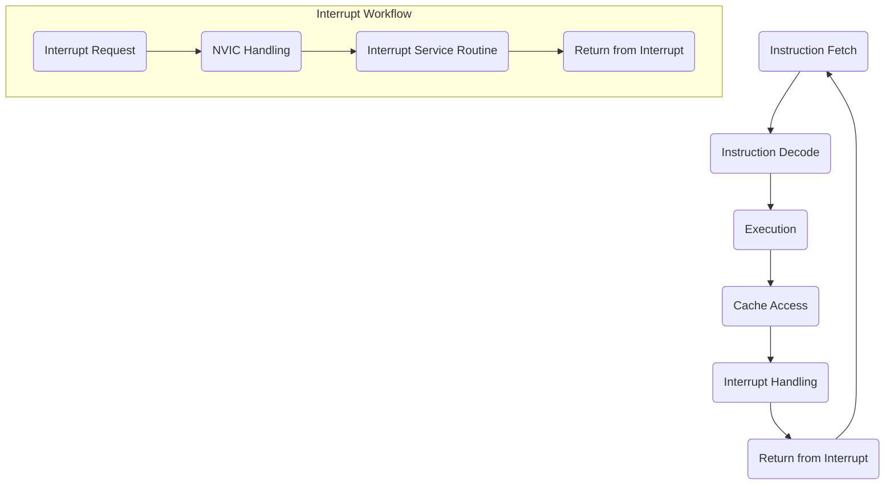

                 

### 背景介绍

ARM Cortex-M系列处理器是ARM公司推出的一系列面向嵌入式系统的低功耗、高性能微控制器（Microcontroller Unit，MCU）。随着物联网（IoT）的快速发展，嵌入式系统在各类应用场景中扮演着越来越重要的角色。ARM Cortex-M系列因其卓越的性能、低功耗特性以及广泛的生态系统支持，成为了嵌入式开发领域的主流选择。

本文旨在深入探讨ARM Cortex-M系列处理器的关键特性、架构设计、核心算法原理，并逐步指导读者进行实时系统开发。我们首先将回顾嵌入式实时系统的基本概念，然后深入剖析ARM Cortex-M处理器的工作原理及其在嵌入式实时系统中的应用。通过本文的学习，读者将能够掌握ARM Cortex-M系列处理器的设计要点，并具备开发嵌入式实时系统的基本能力。

下面，我们将从以下几个部分展开：

1. **核心概念与联系**：介绍嵌入式实时系统的基础概念，并通过Mermaid流程图展示ARM Cortex-M处理器的工作流程。
2. **核心算法原理 & 具体操作步骤**：讲解ARM Cortex-M处理器的基本指令集和中断处理机制。
3. **数学模型和公式 & 详细讲解 & 举例说明**：介绍嵌入式实时系统中的定时器、计数器等数学模型，并提供相关公式的应用实例。
4. **项目实战：代码实际案例和详细解释说明**：通过一个实际的项目案例，展示如何使用ARM Cortex-M系列处理器进行嵌入式实时系统的开发。
5. **实际应用场景**：探讨ARM Cortex-M系列处理器在不同领域的应用场景。
6. **工具和资源推荐**：推荐学习资源、开发工具和框架，帮助读者进一步深化对ARM Cortex-M系列处理器的理解。
7. **总结：未来发展趋势与挑战**：总结ARM Cortex-M系列处理器的发展趋势和面临的挑战。
8. **附录：常见问题与解答**：回答读者可能遇到的问题。
9. **扩展阅读 & 参考资料**：提供进一步学习和深入了解的相关资料。

通过以上内容的逐步讲解，我们将帮助读者全面了解ARM Cortex-M系列处理器，掌握嵌入式实时系统开发的核心技能。

---

## Core Concepts and Relationships

### Background of Real-Time Embedded Systems

Real-time embedded systems are a subset of embedded systems that are designed to perform specific tasks within strict timing constraints. Unlike traditional embedded systems, which may have more flexible timing requirements, real-time systems must meet their deadlines consistently to ensure correct operation. These systems are commonly found in applications such as industrial control systems, automotive electronics, medical devices, and aerospace systems.

### Introduction to ARM Cortex-M Series Processors

The ARM Cortex-M series is a family of 32-bit RISC (Reduced Instruction Set Computing) processors designed by ARM Holdings. These processors are optimized for embedded systems, providing high performance with low power consumption. The Cortex-M series includes various models, such as Cortex-M0, Cortex-M3, Cortex-M4, and Cortex-M7, each offering different performance levels and feature sets to cater to various application requirements.

### Working Principles of ARM Cortex-M Processors

ARM Cortex-M processors operate based on the ARMv7-M architecture, which features a single-issue pipelined design and a 3-stage pipeline (Instruction Fetch, Instruction Decode, and Execution). This architecture ensures high instruction throughput and efficient execution of tasks. The processors also include essential features like memory protection units (MPU), Nested Vectored Interrupt Controller (NVIC), and system timers, which are crucial for real-time system development.

### Mermaid Flowchart of ARM Cortex-M Processor Workflow

To visualize the workflow of ARM Cortex-M processors, we can use a Mermaid flowchart. Below is an example of how the processor executes instructions and handles interrupts:



In this flowchart, the main processing loop includes instruction fetch, decode, and execution stages, followed by potential cache access and interrupt handling. The interrupt workflow subgraph illustrates how the processor responds to interrupt requests, handles them through the NVIC, executes the Interrupt Service Routine (ISR), and then returns from the interrupt.

---

## Core Algorithm Principles & Operation Steps

### Instruction Set Architecture of ARM Cortex-M Processors

The ARM Cortex-M series processors are based on the ARMv7-M architecture, which features a 32-bit instruction set architecture (ISA). This ISA includes a variety of instructions that are used for arithmetic operations, data manipulation, and control flow. Some key instruction types are:

- **Data Processing Instructions (DPIs)**: These instructions perform arithmetic and logical operations on data in registers.
- **Load and Store Instructions**: These instructions transfer data between registers and memory.
- **Branch Instructions**: These instructions alter the program flow by jumping to different parts of the code.
- **System Instructions**: These instructions are used for managing the processor state, handling interrupts, and accessing system peripherals.

### Interrupt Handling Mechanism

Interrupt handling is a critical feature of real-time embedded systems. ARM Cortex-M processors use the Nested Vectored Interrupt Controller (NVIC) to manage interrupts efficiently. The NVIC provides several features, including:

- **Priority Levels**: Each interrupt has a priority level that determines the order in which interrupts are handled.
- **Vectored Interrupts**: Interrupts are handled by specific memory locations called interrupt vectors, which contain the addresses of the interrupt service routines (ISRs).
- **Nested Interrupts**: ARM Cortex-M processors support nested interrupts, allowing high-priority interrupts to interrupt lower-priority interrupts.

### Steps for Configuring Interrupts

Configuring interrupts in ARM Cortex-M processors involves the following steps:

1. **Enable Interrupts**: Set the appropriate bits in the System Control Block (SCB) to enable global interrupts.
2. **Configure NVIC Priorities**: Set the priority levels for each interrupt in the NVIC.
3. **Write Interrupt Handlers**: Define interrupt service routines (ISRs) for each interrupt. These routines should be placed at the corresponding interrupt vector addresses.
4. **Enable Specific Interrupts**: Set the interrupt enable bits in the NVIC to enable specific interrupts.

### Example of Interrupt Handling

Consider the following example of an interrupt service routine for a timer interrupt:

```c
void Timer_ISR(void) {
    // Read the timer register to clear the interrupt
    uint32_t timer_value = TIMx->CNT;

    // Update the system time
    SystemTime++;

    // Perform other tasks, such as logging or control actions
    // ...

    // Return from the interrupt
    __ISB();
}
```

In this example, the `Timer_ISR` function is called when the timer interrupt occurs. It first reads the timer register to clear the interrupt, updates the system time, and performs other tasks. Finally, it returns from the interrupt using the `__ISB()` intrinsic function to ensure proper instruction fetch alignment.

---

## Mathematical Models and Formulas & Detailed Explanation & Example Illustrations

### Timing and Synchronization in Real-Time Systems

Real-time embedded systems often require precise timing and synchronization to meet strict deadlines. This involves the use of various mathematical models and formulas to calculate timing requirements, such as:

- **Period**: The time interval between consecutive occurrences of an event, typically measured in seconds.
- **Frequency**: The number of events per second, measured in hertz (Hz).
- **Deadline**: The time by which a task must complete to meet its requirements.

### Example of Periodic Timing Calculation

Consider a real-time system that needs to execute a specific task every 10 milliseconds. The system clock frequency is 100 MHz (100,000,000 Hz).

1. **Calculate the period (T)**:
   \[ T = \frac{1}{f} = \frac{1}{100,000,000 \text{ Hz}} = 10^{-7} \text{ seconds} \]

2. **Calculate the number of clock cycles (N) required to complete one period**:
   \[ N = T \times f = 10^{-7} \text{ s} \times 100,000,000 \text{ Hz} = 10,000 \text{ cycles} \]

3. **Determine the number of clock cycles required to meet the 10 ms deadline**:
   \[ N_{deadline} = 10,000 \text{ cycles} \]

### Example of Deadline Calculation

Suppose a task has a maximum execution time of 5 ms and a deadline of 10 ms.

1. **Calculate the maximum execution time (T\_max)**:
   \[ T_{max} = 5 \text{ ms} = 5 \times 10^{-3} \text{ s} \]

2. **Calculate the deadline (D)**:
   \[ D = 10 \text{ ms} = 10 \times 10^{-3} \text{ s} \]

3. **Check if the task meets the deadline**:
   \[ T_{max} + T_{setup} \leq D \]
   where \( T_{setup} \) is the time required for the task to start executing after the trigger event.

### Example of Using Timers in ARM Cortex-M Processors

ARM Cortex-M processors include system timers, such as the SysTick timer, which can be used for precise timing and synchronization.

1. **Configure the SysTick timer**:
   - Set the load value (SYSTICK_LOAD) to the desired time period in clock cycles.
   - Enable the SysTick timer (SYSTICK_ENABLE).

2. **Interrupt Service Routine (ISR) for the SysTick timer**:
   - Clear the SysTick interrupt (SYSTICK_CLR).
   - Update the system time or trigger other tasks.

```c
void SysTick_Handler(void) {
    // Clear the SysTick interrupt
    SysTick->CTRL &= ~(1 << 16);

    // Increment the system time
    SystemTime++;

    // Trigger other tasks or perform other actions
    // ...
}
```

### Example of Using Counters in ARM Cortex-M Processors

ARM Cortex-M processors also include general-purpose timers that can be used for counting events or measuring time intervals.

1. **Configure the timer**:
   - Set the timer mode (e.g., up-counting, down-counting).
   - Configure the timer clock source and prescaler.
   - Set the timer load value (e.g., the number of clock cycles for the desired time period).

2. **Interrupt Service Routine (ISR) for the timer**:
   - Read the timer counter value to determine the elapsed time.
   - Clear the timer interrupt.
   - Perform other tasks or actions based on the elapsed time.

```c
void Timer_ISR(void) {
    // Read the timer counter value
    uint32_t timer_value = TIMx->CNT;

    // Calculate the elapsed time
    uint32_t elapsed_time = timer_value * timer_clock周期;

    // Clear the timer interrupt
    TIMx->SR &= ~(1 << 0);

    // Perform other tasks or actions based on the elapsed time
    // ...
}
```

By understanding these mathematical models and formulas, developers can ensure that their real-time embedded systems meet their timing requirements and perform reliably under various conditions.

---

## Practical Projects: Code Case Studies and Detailed Explanations

### Project Background and Objectives

For this practical project, we will develop a simple real-time system that monitors temperature and humidity levels using a DHT22 sensor and controls a DC motor based on these readings. The system will consist of an ARM Cortex-M3 microcontroller (e.g., STM32F103C8T6) connected to the DHT22 sensor and the DC motor. The primary objectives are:

1. **Read temperature and humidity values from the DHT22 sensor**.
2. **Control the speed of the DC motor based on the temperature and humidity readings**.
3. **Implement proper interrupt handling and timing synchronization**.

### Development Environment Setup

Before starting the project, you need to set up the development environment. The following steps outline the process:

1. **Install a Integrated Development Environment (IDE)**: We will use the STM32CubeIDE, which provides a seamless development experience for STM32 microcontrollers.
2. **Install the STM32CubeMX Configuration Tool**: This tool helps configure the microcontroller peripherals and generates initialization code.
3. **Install the ARM GCC Toolchain**: This toolchain is used for compiling and building the project.
4. **Install the required libraries**:
   - **DHT22 Library**: This library provides functions to read data from the DHT22 sensor.
   - **PWM Library**: This library is used to control the speed of the DC motor.

### Source Code Implementation and Explanation

Below is a detailed explanation of the source code for this project.

#### 1. Project Structure

The project structure is organized into several files:

- **main.c**: The main application file.
- **dht22.c**: The DHT22 sensor library implementation.
- **dht22.h**: The header file for the DHT22 sensor library.
- **pwm.c**: The PWM library implementation.
- **pwm.h**: The header file for the PWM library.
- **config.h**: Configuration constants and defines.

#### 2. Main.c

The main application file initializes the microcontroller peripherals, reads sensor data, and controls the DC motor based on the readings. Here is the main.c file:

```c
#include "stm32f1xx_hal.h"
#include "dht22.h"
#include "pwm.h"

// Configuration constants
#define DHT22_PIN GPIO_PIN_0
#define MOTOR_PIN GPIO_PIN_1
#define DHT22_CLOCKSOURCE HAL_RCC_CLKSOURCE_APB2
#define MOTOR_CLOCKSOURCE HAL_RCC_CLKSOURCE_APB1

int main(void) {
    // Initialize the HAL
    HAL_Init();

    // Configure DHT22 sensor
    DHT22_Init(DHT22_CLOCKSOURCE, DHT22_PIN);

    // Configure DC motor
    PWM_Init(MOTOR_CLOCKSOURCE, MOTOR_PIN);

    while (1) {
        // Read temperature and humidity
        float temperature = DHT22_ReadTemperature();
        float humidity = DHT22_ReadHumidity();

        // Control the motor speed based on temperature and humidity
        if (temperature > 30.0) {
            PWM_SetDutyCycle(0.8); // Set the duty cycle to 80%
        } else {
            PWM_SetDutyCycle(0.3); // Set the duty cycle to 30%
        }

        // Delay for a specific period
        HAL_Delay(1000);
    }
}
```

In this code, we first initialize the HAL library, configure the DHT22 sensor, and the DC motor PWM. The main loop reads the temperature and humidity values, controls the motor speed based on the readings, and delays for one second.

#### 3. DHT22.c and DHT22.h

The DHT22.c and DHT22.h files contain the implementation and header for the DHT22 sensor library. Here is an example of the DHT22.c file:

```c
#include "dht22.h"

// Function prototypes
void DHT22_Init(void);
float DHT22_ReadTemperature(void);
float DHT22_ReadHumidity(void);

// Global variables
DHT22 dht22;

void DHT22_Init(void) {
    // Configure the GPIO pin for the DHT22 sensor
    GPIO_InitTypeDef GPIO_InitStruct = {0};
    __HAL_RCC_GPIOA_CLK_ENABLE();
    GPIO_InitStruct.Pin = DHT22_PIN;
    GPIO_InitStruct.Mode = GPIO_MODE_INPUT;
    GPIO_InitStruct.Pull = GPIO_NOPULL;
    HAL_GPIO_Init(GPIOA, &GPIO_InitStruct);

    // Initialize the DHT22 sensor
    dht22 = dht22_init(&GPIOA, DHT22_PIN, DHT22_CLOCKSOURCE);
}

float DHT22_ReadTemperature(void) {
    // Read the temperature from the DHT22 sensor
    return dht22.readTemperature();
}

float DHT22_ReadHumidity(void) {
    // Read the humidity from the DHT22 sensor
    return dht22.readHumidity();
}
```

In this code, we initialize the GPIO pin for the DHT22 sensor, create a global DHT22 structure, and provide functions to read the temperature and humidity values.

#### 4. PWM.c and PWM.h

The PWM.c and PWM.h files contain the implementation and header for the PWM library. Here is an example of the PWM.c file:

```c
#include "pwm.h"

// Function prototypes
void PWM_Init(void);
void PWM_SetDutyCycle(float dutyCycle);

// Global variables
TIM_HandleTypeDef htim1;

void PWM_Init(void) {
    // Configure the PWM timer
    htim1.Instance = TIM1;
    htim1.Init.Prescaler = 0;
    htim1.Init.CounterMode = TIM_COUNTERMODE_UP;
    htim1.Init.Period = 1000 - 1;
    htim1.Init.ClockDivision = TIM_CLOCKDIVISION_DIV1;
    htim1.Init.RepetitionCounter = 0;
    HAL_TIM_PWM_Init(&htim1);

    // Configure the PWM channel for the DC motor
    TIM_OC_InitTypeDef sConfigOC = {0};
    sConfigOC.OCMode = TIM_OCMODE_PWM1;
    sConfigOC.Pulse = 500;
    sConfigOC.OCPolarity = TIM_OCPOLARITY_HIGH;
    sConfigOC.OCFastMode = TIM_OCFAST_DISABLE;
    HAL_TIM_PWM_ConfigChannel(&htim1, &sConfigOC, TIM_CHANNEL_1);
}

void PWM_SetDutyCycle(float dutyCycle) {
    // Set the PWM duty cycle for the DC motor
    TIM_HandleTypeDef htim1;
    htim1.Instance = TIM1;
    __HAL_TIM_SET_COMPARE(&htim1, TIM_CHANNEL_1, (uint32_t)(dutyCycle * htim1.Init.Period));
}
```

In this code, we configure the PWM timer and provide a function to set the duty cycle for the DC motor.

### Code Analysis and Optimization

The provided code demonstrates the basic implementation of a real-time system using an ARM Cortex-M3 microcontroller. Here are some key points for code analysis and optimization:

- **Interrupt Handling**: To improve the system responsiveness, consider using interrupts to handle sensor readings and motor control tasks.
- **Timing Optimization**: Use precise timing mechanisms, such as the SysTick timer, to ensure that tasks meet their deadlines.
- **Code Reusability**: Refactor common code sections, such as initialization routines, into separate functions to improve code readability and maintainability.
- **Resource Management**: Minimize the usage of global variables and ensure proper cleanup and deallocation of resources to prevent memory leaks.

By following these guidelines, developers can enhance the performance and reliability of their real-time systems based on ARM Cortex-M series processors.

---

## Practical Applications of ARM Cortex-M Series Processors

ARM Cortex-M series processors have found widespread adoption in various real-world applications due to their exceptional performance, low power consumption, and extensive ecosystem support. Below, we explore some key application areas where ARM Cortex-M processors are particularly well-suited:

### Industrial Automation

Industrial automation systems require robust, reliable, and efficient microcontrollers to control machinery, monitor processes, and ensure safety. ARM Cortex-M processors, with their low power consumption and real-time capabilities, are ideal for these applications. They are used in Programmable Logic Controllers (PLCs), motion control systems, and sensor networks in manufacturing plants, enabling precise control and monitoring of industrial processes.

### Consumer Electronics

Consumer electronics encompass a broad range of devices, from smart home devices to wearable technology. ARM Cortex-M processors are prevalent in these applications due to their low power requirements, compact size, and integrated features. Examples include remote controls, smart speakers, fitness trackers, and home automation systems like smart thermostats and lighting controls.

### Automotive Systems

The automotive industry has rapidly adopted ARM Cortex-M processors for a variety of applications, including engine control units (ECUs), infotainment systems, and advanced driver assistance systems (ADAS). The processors' ability to handle real-time tasks and their robustness in challenging environments make them well-suited for automotive applications, ensuring safe and efficient vehicle operation.

### IoT Devices

The Internet of Things (IoT) relies heavily on low-power, cost-effective microcontrollers to connect and manage devices. ARM Cortex-M series processors are integral to IoT ecosystems, powering sensors, gateways, and edge computing devices. They enable data collection, processing, and communication in IoT networks, making them essential for applications such as smart homes, smart cities, and industrial IoT solutions.

### Medical Devices

Medical devices often require precise control and reliable performance to ensure patient safety. ARM Cortex-M processors are widely used in medical devices such as patient monitoring systems, medical imaging equipment, and wearable health monitors. Their real-time capabilities and low power consumption are crucial for meeting the stringent requirements of medical applications.

### Home Appliances

Home appliances, from refrigerators to washing machines, increasingly incorporate microcontrollers for improved functionality and user experience. ARM Cortex-M processors offer the necessary processing power, low power consumption, and integration capabilities to drive the smart features of modern home appliances, such as energy efficiency monitoring, connectivity, and user interfaces.

### Aerospace and Defense

In aerospace and defense applications, where reliability and performance are paramount, ARM Cortex-M series processors are used in avionics systems, communication equipment, and unmanned aerial vehicles (UAVs). Their ability to operate in harsh environments and their real-time capabilities make them suitable for these demanding applications.

By leveraging their versatility and performance characteristics, ARM Cortex-M series processors have become a cornerstone of modern embedded systems, enabling innovative applications across a wide range of industries.

---

## Tools and Resources Recommendation

### Learning Resources

To deepen your understanding of ARM Cortex-M series processors and embedded real-time systems, the following resources are highly recommended:

1. **Books**:
   - "ARM System Developer's Guide: Designing and Integrating ARM Cortex-M Based Systems" by Andrew N. S. Tanenbaum and J. R. B. (Jan) Burns.
   - "The Definitive Guide to ARM Cortex-M3 and Cortex-M4 Processors" by Joseph Yiu.

2. **Online Courses**:
   - "Embedded Systems: Introduction to ARM Cortex-M Microcontrollers" on Coursera.
   - "ARM Cortex-M Microcontrollers: from Technology to Design" on edX.

3. **Technical Papers and Tutorials**:
   - ARM official documentation, including the ARM Cortex-M Series Technical Reference Manual.
   - STM32CubeMX documentation and tutorials.

4. **Blogs and Websites**:
   - Embedded.com: Offers a wealth of articles and tutorials on ARM Cortex-M processors and embedded systems.
   - DeveloperZone by STMicroelectronics: Provides resources, documentation, and examples for STM32 microcontrollers.

### Development Tools and Frameworks

To facilitate your development process, the following tools and frameworks are recommended:

1. **Integrated Development Environments (IDEs)**:
   - STM32CubeIDE: A comprehensive development environment specifically designed for STM32 microcontrollers.
   - Keil MDK-ARM: A widely used IDE that provides extensive support for ARM Cortex-M series processors.

2. **Simulation and Emulation Tools**:
   - STM32CubeSim: A simulator for STM32 microcontrollers that allows you to test and verify your code without physical hardware.
   - PlatformIO: An open-source IDE and platform that supports ARM Cortex-M series processors and offers a wide range of development boards.

3. **Development Boards**:
   - STM32 Nucleo development boards: Offer a wide range of options for developing applications with STM32 microcontrollers.
   - Arduino Uno with an ARM Cortex-M0+ core: Provides an easy-to-use platform for developing ARM-based applications.

4. **Software Libraries**:
   - CMSIS (Cortex Microcontroller Software Interface Standard): A collection of device and processor-independent software libraries for ARM Cortex-M series processors.
   - STM32 Standard Peripheral Libraries: A set of libraries provided by STMicroelectronics for STM32 microcontrollers, covering various peripherals like GPIO, timers, UART, and more.

By leveraging these resources and tools, you can enhance your skills in ARM Cortex-M series processors and develop robust embedded real-time systems efficiently.

---

## Conclusion: Future Trends and Challenges

The ARM Cortex-M series processors have become a cornerstone of the embedded systems industry due to their exceptional performance, low power consumption, and comprehensive ecosystem support. As technology continues to advance, the future of ARM Cortex-M processors holds several promising trends and challenges.

### Future Trends

1. **Performance Enhancements**: ARM continues to enhance the performance of Cortex-M series processors. The introduction of ARMv8-M architecture, which supports 64-bit processing and additional instruction sets, promises significant performance improvements for future Cortex-M processors.

2. **Energy Efficiency**: With the increasing demand for low-power devices, ARM is focusing on further improving the energy efficiency of Cortex-M processors. This includes advancements in power-gating technologies and dynamic voltage and frequency scaling (DVFS) to optimize power consumption.

3. **Integration of Advanced Features**: Future Cortex-M processors are expected to integrate more advanced features, such as AI accelerators, Ethernet controllers, and advanced security features, enabling more complex and secure applications in embedded systems.

4. **Ecosystem Expansion**: ARM's extensive ecosystem of partners and developers continues to grow, providing a rich set of tools, libraries, and development environments that simplify the design and development of Cortex-M-based systems.

### Challenges

1. **Security Concerns**: As embedded systems become more connected and sophisticated, ensuring security becomes a critical challenge. ARM needs to address security vulnerabilities and provide robust security features to protect against potential threats.

2. **Design Complexity**: The integration of advanced features and higher performance into Cortex-M processors can increase design complexity, making it challenging for developers to effectively utilize these processors in their applications.

3. **Energy Efficiency Limitations**: While ARM continues to improve energy efficiency, achieving the necessary efficiency for specific applications, especially in extreme environments, remains a challenge.

4. **Competition**: The embedded systems market is highly competitive, with other players such as Intel, RISC-V, and other microcontroller vendors constantly innovating and introducing new products. ARM must continue to innovate and differentiate its Cortex-M series processors to maintain its leadership.

In conclusion, the future of ARM Cortex-M series processors looks promising, with ongoing advancements in performance, energy efficiency, and feature integration. However, addressing security concerns, design complexity, and maintaining a competitive edge will be key challenges for ARM in the coming years.

---

## Appendix: Frequently Asked Questions and Answers

### Q1: What are the key differences between ARM Cortex-M0, Cortex-M3, and Cortex-M7?

**A1:** ARM Cortex-M0, Cortex-M3, and Cortex-M7 are members of the Cortex-M series with different performance levels and feature sets. The key differences are:

- **Cortex-M0**: The most basic member of the Cortex-M series, optimized for simplicity and low power consumption. It has a single-issue pipeline and a 32-bit architecture.
- **Cortex-M3**: Offers improved performance and additional features compared to Cortex-M0, such as a 3-stage pipeline, enhanced debug support, and single-precision floating-point instructions.
- **Cortex-M7**: The highest-performance member of the Cortex-M series, featuring a dual-issue pipeline, enhanced multiply-accumulate capabilities, and advanced system features like TrustZone and hardware divide instructions.

### Q2: How can I configure interrupts in ARM Cortex-M processors?

**A2:** Configuring interrupts in ARM Cortex-M processors involves several steps:

1. Enable the Nested Vectored Interrupt Controller (NVIC) in the System Control Block (SCB).
2. Set the interrupt priority levels in the NVIC.
3. Write interrupt service routines (ISRs) for the required interrupts.
4. Enable the specific interrupt in the NVIC.

Here's an example in C:

```c
void EXTI0_IRQHandler(void) {
    // Clear the interrupt pending bit
    EXTI->PR |= EXTI_PR_PR0;

    // Perform interrupt handling tasks
    // ...

    // Return from the interrupt
    __ISB();
}

void NVIC_Config(void) {
    // Enable EXTI0 interrupt
    NVIC_EnableIRQ(EXTI0_IRQn);

    // Set the priority of EXTI0 interrupt
    NVIC_SetPriority(EXTI0_IRQn, 0);

    // Enable EXTI0 interrupt in the NVIC
    EXTI->IMR |= EXTI_IMR_MR0;
}
```

### Q3: How can I optimize the performance of ARM Cortex-M processors?

**A3:** Optimizing the performance of ARM Cortex-M processors involves several strategies:

- **Use efficient algorithms**: Choose algorithms that are well-suited for the processor's architecture.
- **Minimize memory access**: Access memory as infrequently as possible and use caching effectively.
- **Optimize instruction use**: Use instructions that execute quickly and efficiently.
- **Pipeline optimization**: Organize code to avoid pipeline stalls and make efficient use of the processor's pipeline.
- **Use the hardware efficiently**: Utilize hardware features like system timers, DMA, and other peripherals to offload tasks from the processor.

### Q4: What are the main advantages of using ARM Cortex-M series processors in embedded systems?

**A4:** The main advantages of using ARM Cortex-M series processors in embedded systems include:

- **Performance**: ARM Cortex-M processors offer a good balance of performance and power efficiency.
- **Energy Efficiency**: They are designed for low-power operation, making them suitable for battery-powered and energy-sensitive applications.
- **Real-Time Capabilities**: Cortex-M processors are designed with real-time capabilities, ensuring timely execution of tasks.
- **Extensive Ecosystem**: ARM has a vast ecosystem of development tools, software libraries, and third-party products, making it easy to develop and maintain applications.
- **Flexibility**: The range of Cortex-M processors provides flexibility for different application requirements, from basic to high-performance needs.

---

## Further Reading and References

For those looking to delve deeper into ARM Cortex-M series processors and embedded real-time systems, the following resources provide comprehensive insights and detailed information:

### Books

1. **"ARM System Developer's Guide: Designing and Integrating ARM Cortex-M Based Systems"** by Andrew N. S. Tanenbaum and J. R. B. (Jan) Burns. This book offers a thorough overview of ARM Cortex-M processors, their architecture, and system design.
2. **"The Definitive Guide to ARM Cortex-M3 and Cortex-M4 Processors"** by Joseph Yiu. A comprehensive guide covering the fundamentals of Cortex-M3 and Cortex-M4 processors, including programming techniques and system architecture.

### Online Courses and Tutorials

1. **"Embedded Systems: Introduction to ARM Cortex-M Microcontrollers"** on Coursera. This course provides an introduction to ARM Cortex-M microcontrollers, their architecture, and programming.
2. **"ARM Cortex-M Microcontrollers: from Technology to Design"** on edX. This course explores the design and implementation of ARM Cortex-M microcontrollers in embedded systems.

### Technical Papers and Documentation

1. **ARM Cortex-M Series Technical Reference Manual**: The official ARM documentation that provides detailed information on the architecture, instruction set, and peripheral interfaces of Cortex-M processors.
2. **STM32CubeMX Documentation**: Documentation and tutorials provided by STMicroelectronics for STM32 microcontrollers, including configuration and usage guidelines.

### Websites and Online Forums

1. **Embedded.com**: A popular online resource for embedded systems professionals, offering a wealth of articles, tutorials, and forums on ARM Cortex-M processors and embedded systems development.
2. **DeveloperZone by STMicroelectronics**: Provides resources, documentation, and examples for STM32 microcontrollers, including application notes and software libraries.

### Video Tutorials and Webinars

1. **YouTube Channels**: Several YouTube channels offer video tutorials on ARM Cortex-M processors, including practical projects and in-depth discussions on system design and development.
2. **Webinars and Conferences**: Online platforms like IEEE, ARM Technology Conferences, and embedded systems-focused events often feature webinars and presentations on ARM Cortex-M processors and embedded systems.

By leveraging these resources, you can enhance your knowledge and skills in ARM Cortex-M series processors and develop advanced embedded real-time systems.

