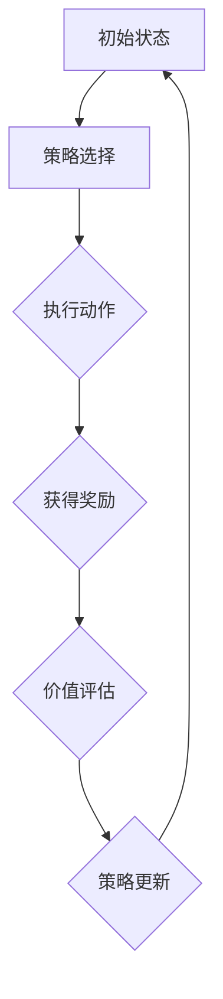

                 

## 1. 背景介绍

**Actor-Critic Methods原理与代码实例讲解**这一主题，旨在探讨一种广泛应用于强化学习领域的方法——Actor-Critic（AC）方法。强化学习是机器学习的一个分支，它主要研究如何使智能体在未知环境中通过试错和反馈，学习到一种策略以最大化累积奖励。在强化学习中，Actor-Critic方法是一种核心算法，以其出色的表现和广泛的应用得到了学术界和工业界的认可。

### 什么是强化学习

强化学习（Reinforcement Learning，简称RL）是机器学习的一个重要分支，其核心目标是训练出一个智能体（agent），使其能够在动态环境中做出最优决策，以实现长期目标。在强化学习中，智能体通过与环境进行交互，根据环境的反馈调整自己的行为策略，从而逐渐学习到一种最优的行为方式。

强化学习的三大要素包括：

- **智能体（Agent）**：执行动作并观察环境的主体。
- **环境（Environment）**：智能体执行动作的对象，并给予智能体状态转移和奖励信号。
- **策略（Policy）**：智能体选择动作的规则。

在强化学习过程中，智能体通过不断试错，调整策略，以期望获得最大的累积奖励。强化学习广泛应用于游戏AI、自动驾驶、推荐系统等领域。

### 什么是Actor-Critic方法

Actor-Critic方法是一种基于值函数的强化学习方法，由两部分组成：Actor和Critic。其中，Actor负责执行动作，Critic负责评估策略的好坏。

- **Actor**：根据当前状态和策略，选择一个动作。通常使用策略网络（Policy Network）来生成动作。
- **Critic**：评估策略的好坏，通常使用价值函数（Value Function）来衡量。价值函数可以预测在给定策略下，从当前状态开始能够获得的期望奖励。

Actor-Critic方法的核心思想是通过Critic评估策略的好坏，不断调整Actor的策略，从而优化智能体的行为。

### Actor-Critic方法的起源和发展

Actor-Critic方法最早可以追溯到1970年代，当时由Harry Francis McLaughlin和Michael L. Littman等人提出。最初，这种方法主要用于解决简单的决策问题。随着计算机性能的提升和深度学习技术的发展，Actor-Critic方法逐渐应用于更复杂的任务，并取得了显著的效果。

近年来，随着深度强化学习（Deep Reinforcement Learning，简称DRL）的兴起，Actor-Critic方法得到了进一步的发展。特别是深度神经网络（Deep Neural Network，简称DNN）在Actor和Critic网络中的应用，使得Actor-Critic方法在图像识别、自然语言处理等领域取得了突破性进展。

### 本文结构

本文将分为以下几个部分：

1. 背景介绍：回顾强化学习和Actor-Critic方法的定义、起源和发展。
2. 核心概念与联系：详细介绍Actor-Critic方法的核心概念，包括Actor和Critic的网络架构、学习过程等。
3. 核心算法原理 & 具体操作步骤：深入分析Actor-Critic方法的算法原理，包括策略优化、价值评估等。
4. 数学模型和公式 & 详细讲解 & 举例说明：介绍Actor-Critic方法中的主要数学模型和公式，并通过实例进行详细讲解。
5. 项目实战：通过实际案例，展示Actor-Critic方法的实现和应用。
6. 实际应用场景：探讨Actor-Critic方法在不同领域的应用，以及面临的挑战。
7. 工具和资源推荐：推荐学习资源和开发工具，帮助读者进一步了解和掌握Actor-Critic方法。
8. 总结：总结本文的核心内容，展望Actor-Critic方法的未来发展趋势。

接下来，我们将逐步深入探讨Actor-Critic方法的核心概念、算法原理、数学模型和实际应用，希望读者能够通过本文，对Actor-Critic方法有一个全面、深入的理解。<!--结束--><|im_sep|>## 2. 核心概念与联系

### Actor与Critic

Actor-Critic方法中的两个核心组件是Actor和Critic。它们各自负责不同的任务，但又相互协作，共同优化智能体的策略。

#### Actor

Actor的主要职责是根据当前状态选择一个动作。在深度强化学习中，Actor通常由一个策略网络（Policy Network）实现。策略网络接收状态作为输入，输出概率分布，表示在当前状态下，对每个可能动作的偏好。

- **策略网络（Policy Network）**：策略网络是一个函数，它将当前状态映射到一个动作的概率分布。策略网络可以是基于参数化的概率模型，如确定性策略梯度（Deterministic Policy Gradient，简称DPG）方法，也可以是非参数化的，如Actor-Critic方法中的Actor部分。

策略网络的目标是最小化策略损失函数（Policy Loss Function），该函数衡量策略网络输出的概率分布与真实分布之间的差距。具体来说，策略网络希望最大化累积奖励，因此，它会调整参数，以使动作的选择能够带来更大的预期奖励。

#### Critic

Critic的主要职责是评估策略的好坏。在深度强化学习中，Critic通常由一个价值网络（Value Network）实现。价值网络接收当前状态和动作作为输入，输出一个价值估计，表示从当前状态执行给定动作所能获得的期望奖励。

- **价值网络（Value Network）**：价值网络是一个函数，它将当前状态和动作映射到一个价值估计。价值网络的目标是最小化价值估计误差，即实际获得的奖励与价值网络预测的奖励之间的差距。

Critic通过比较实际获得的奖励和价值网络的预测值，可以评估策略的好坏。如果实际奖励高于预测值，说明策略较好，Critic会鼓励Actor继续使用这个策略；如果实际奖励低于预测值，说明策略较差，Critic会促使Actor调整策略。

### 策略优化与价值评估

在Actor-Critic方法中，策略优化和价值评估是两个核心过程。

- **策略优化**：策略优化是指通过调整策略网络的参数，使策略能够最大化累积奖励。在深度强化学习中，策略优化通常使用梯度下降法。具体来说，Actor网络通过接收来自Critic的奖励信号，不断更新网络参数，以最小化策略损失函数。

- **价值评估**：价值评估是指通过估计从当前状态执行给定动作所能获得的期望奖励，从而评估策略的好坏。在深度强化学习中，价值评估通常使用值函数。值函数是一个函数，它将当前状态映射到一个值，表示在该状态下执行最佳动作所能获得的期望奖励。

### Actor-Critic方法的架构

Actor-Critic方法的整体架构可以概括为以下几个步骤：

1. **初始状态**：智能体从环境中接收一个初始状态。
2. **策略选择**：Actor网络根据当前状态生成一个动作的概率分布。
3. **动作执行**：智能体执行选定的动作，并获得环境的反馈。
4. **奖励信号**：环境根据执行的动作，给予智能体一个奖励信号。
5. **价值评估**：Critic网络根据当前状态和动作，评估策略的好坏。
6. **策略更新**：Actor网络根据Critic网络的评估结果，更新策略参数。
7. **重复过程**：重复上述步骤，直到达到某个终止条件（如达到目标状态、超过最大步数等）。

### Mermaid流程图

为了更直观地展示Actor-Critic方法的流程，我们使用Mermaid流程图来描述：



### 总结

在本节中，我们详细介绍了Actor-Critic方法的核心概念，包括Actor和Critic的角色、策略优化与价值评估的过程，以及Actor-Critic方法的整体架构。通过这一节的讨论，读者可以初步了解Actor-Critic方法的基本原理和结构。接下来，我们将进一步深入探讨Actor-Critic方法的算法原理和具体实现。<!--结束--><|im_sep|>## 3. 核心算法原理 & 具体操作步骤

### 3.1 策略网络（Actor）

策略网络（Actor）是Actor-Critic方法中的核心组件，其主要职责是根据当前状态生成动作的概率分布。在深度强化学习中，策略网络通常采用基于神经网络的模型来实现。

#### 策略网络的输入与输出

策略网络的输入是当前状态，输出是一个动作的概率分布。具体来说，给定一个状态\( s \)，策略网络\( \pi(\cdot|s; \theta) \)输出一个概率分布\( p(a|s; \theta) \)，其中\( a \)是可能动作的集合，\( \theta \)是策略网络的参数。

#### 策略损失函数

策略网络的目标是最小化策略损失函数（Policy Loss Function），该函数衡量策略网络输出的概率分布与真实分布之间的差距。在深度强化学习中，常见的策略损失函数包括：

- **确定性策略梯度（Deterministic Policy Gradient，简称DPG）**：
  $$ L(\theta) = -\sum_{s \rightarrow a \rightarrow r_{t+1}, s_{t+1}} r_{t+1} \ln \pi(a|s; \theta) $$

- **优势估计策略梯度（Advantage Estimation Policy Gradient，简称AEPG）**：
  $$ L(\theta) = -\sum_{s \rightarrow a \rightarrow r_{t+1}, s_{t+1}} \left( r_{t+1} + \gamma V(s_{t+1}; \theta') - V(s_t; \theta) \right) \ln \pi(a|s; \theta) $$
  其中，\( V(s; \theta) \)是价值网络估计的价值函数，\( \gamma \)是折扣因子，\( \theta' \)是价值网络参数。

#### 策略网络的更新

策略网络的更新过程通常采用梯度下降法。具体来说，对于每一个时间步\( t \)，策略网络根据策略损失函数计算梯度，并更新网络参数：
$$ \theta \leftarrow \theta - \alpha \nabla_{\theta} L(\theta) $$
其中，\( \alpha \)是学习率。

### 3.2 价值网络（Critic）

价值网络（Critic）是Actor-Critic方法中的另一个核心组件，其主要职责是评估策略的好坏。在深度强化学习中，价值网络通常采用基于神经网络的模型来实现。

#### 价值网络的输入与输出

价值网络的输入是当前状态和动作，输出是一个价值估计。具体来说，给定一个状态\( s \)和一个动作\( a \)，价值网络\( V(s,a; \theta) \)输出一个价值估计\( v(s,a; \theta) \)。

#### 价值损失函数

价值网络的目标是最小化价值损失函数（Value Loss Function），该函数衡量实际获得的奖励和价值网络预测的价值之间的差距。在深度强化学习中，常见的方法包括：

- **基于梯度的价值迭代（Gradient Value Iteration）**：
  $$ L(\theta) = \frac{1}{N} \sum_{i=1}^{N} \left( r_i + \gamma V(s'; \theta') - V(s_i; \theta) \right)^2 $$
  其中，\( N \)是样本数量，\( s' \)是状态转移后的状态，\( \theta' \)是策略网络参数。

- **基于梯度的策略迭代（Gradient Policy Iteration）**：
  $$ L(\theta) = \frac{1}{N} \sum_{i=1}^{N} \left( r_i + \gamma V(s'; \theta') - V(s_i; \theta) \right)^2 $$
  其中，\( N \)是样本数量，\( s' \)是状态转移后的状态，\( \theta' \)是策略网络参数。

#### 价值网络的更新

价值网络的更新过程也采用梯度下降法。具体来说，对于每一个时间步\( t \)，价值网络根据价值损失函数计算梯度，并更新网络参数：
$$ \theta \leftarrow \theta - \alpha \nabla_{\theta} L(\theta) $$

### 3.3 动作选择与策略迭代

在Actor-Critic方法中，动作选择与策略迭代是一个动态的过程。具体来说，智能体在每一个时间步\( t \)执行以下步骤：

1. **状态输入**：智能体从环境中接收当前状态\( s_t \)。
2. **策略选择**：Actor网络根据当前状态生成动作的概率分布\( p(a|s_t; \theta) \)。
3. **动作执行**：智能体根据概率分布执行动作\( a_t \)，并获得环境的反馈，包括下一个状态\( s_{t+1} \)和奖励\( r_t \)。
4. **价值评估**：Critic网络根据当前状态和动作，评估策略的好坏，并更新价值估计\( v(s_t, a_t; \theta) \)。
5. **策略更新**：Actor网络根据Critic网络的评估结果，更新策略参数\( \theta \)。

6. **重复过程**：重复上述步骤，直到达到某个终止条件（如达到目标状态、超过最大步数等）。

### 3.4 总结

在本节中，我们详细介绍了Actor-Critic方法的核心算法原理和具体操作步骤。首先，我们介绍了策略网络（Actor）和策略损失函数，以及策略网络的更新过程。然后，我们介绍了价值网络（Critic）和价值损失函数，以及价值网络的更新过程。最后，我们描述了动作选择与策略迭代的动态过程。通过这一节的讨论，读者可以深入理解Actor-Critic方法的算法原理和实现过程。接下来，我们将进一步探讨Actor-Critic方法中的数学模型和公式，并通过具体实例进行详细讲解。<!--结束--><|im_sep|>## 4. 数学模型和公式 & 详细讲解 & 举例说明

### 4.1 策略网络（Actor）

策略网络（Actor）是Actor-Critic方法中的核心组件，其主要职责是根据当前状态生成动作的概率分布。在深度强化学习中，策略网络通常采用基于神经网络的模型来实现。

#### 策略网络的输入与输出

策略网络的输入是当前状态，输出是一个动作的概率分布。具体来说，给定一个状态\( s \)，策略网络\( \pi(\cdot|s; \theta) \)输出一个概率分布\( p(a|s; \theta) \)，其中\( a \)是可能动作的集合，\( \theta \)是策略网络的参数。

#### 策略损失函数

策略网络的目标是最小化策略损失函数（Policy Loss Function），该函数衡量策略网络输出的概率分布与真实分布之间的差距。在深度强化学习中，常见的策略损失函数包括：

- **确定性策略梯度（Deterministic Policy Gradient，简称DPG）**：
  $$ L(\theta) = -\sum_{s \rightarrow a \rightarrow r_{t+1}, s_{t+1}} r_{t+1} \ln \pi(a|s; \theta) $$

  其中，\( r_{t+1} \)是下一时刻的奖励，\( s_{t+1} \)是下一时刻的状态。

- **优势估计策略梯度（Advantage Estimation Policy Gradient，简称AEPG）**：
  $$ L(\theta) = -\sum_{s \rightarrow a \rightarrow r_{t+1}, s_{t+1}} \left( r_{t+1} + \gamma V(s_{t+1}; \theta') - V(s_t; \theta) \right) \ln \pi(a|s; \theta) $$
  其中，\( V(s; \theta) \)是价值网络估计的价值函数，\( \gamma \)是折扣因子，\( \theta' \)是价值网络参数。

#### 策略网络的更新

策略网络的更新过程通常采用梯度下降法。具体来说，对于每一个时间步\( t \)，策略网络根据策略损失函数计算梯度，并更新网络参数：
$$ \theta \leftarrow \theta - \alpha \nabla_{\theta} L(\theta) $$
其中，\( \alpha \)是学习率。

### 4.2 价值网络（Critic）

价值网络（Critic）是Actor-Critic方法中的另一个核心组件，其主要职责是评估策略的好坏。在深度强化学习中，价值网络通常采用基于神经网络的模型来实现。

#### 价值网络的输入与输出

价值网络的输入是当前状态和动作，输出是一个价值估计。具体来说，给定一个状态\( s \)和一个动作\( a \)，价值网络\( V(s,a; \theta) \)输出一个价值估计\( v(s,a; \theta) \)。

#### 价值损失函数

价值网络的目标是最小化价值损失函数（Value Loss Function），该函数衡量实际获得的奖励和价值网络预测的价值之间的差距。在深度强化学习中，常见的方法包括：

- **基于梯度的价值迭代（Gradient Value Iteration）**：
  $$ L(\theta) = \frac{1}{N} \sum_{i=1}^{N} \left( r_i + \gamma V(s'; \theta') - V(s_i; \theta) \right)^2 $$
  其中，\( N \)是样本数量，\( s' \)是状态转移后的状态，\( \theta' \)是策略网络参数。

- **基于梯度的策略迭代（Gradient Policy Iteration）**：
  $$ L(\theta) = \frac{1}{N} \sum_{i=1}^{N} \left( r_i + \gamma V(s'; \theta') - V(s_i; \theta) \right)^2 $$
  其中，\( N \)是样本数量，\( s' \)是状态转移后的状态，\( \theta' \)是策略网络参数。

#### 价值网络的更新

价值网络的更新过程也采用梯度下降法。具体来说，对于每一个时间步\( t \)，价值网络根据价值损失函数计算梯度，并更新网络参数：
$$ \theta \leftarrow \theta - \alpha \nabla_{\theta} L(\theta) $$

### 4.3 动作选择与策略迭代

在Actor-Critic方法中，动作选择与策略迭代是一个动态的过程。具体来说，智能体在每一个时间步\( t \)执行以下步骤：

1. **状态输入**：智能体从环境中接收当前状态\( s_t \)。
2. **策略选择**：Actor网络根据当前状态生成动作的概率分布\( p(a|s_t; \theta) \)。
3. **动作执行**：智能体根据概率分布执行动作\( a_t \)，并获得环境的反馈，包括下一个状态\( s_{t+1} \)和奖励\( r_t \)。
4. **价值评估**：Critic网络根据当前状态和动作，评估策略的好坏，并更新价值估计\( v(s_t, a_t; \theta) \)。
5. **策略更新**：Actor网络根据Critic网络的评估结果，更新策略参数\( \theta \)。

6. **重复过程**：重复上述步骤，直到达到某个终止条件（如达到目标状态、超过最大步数等）。

### 4.4 举例说明

为了更好地理解Actor-Critic方法的数学模型和公式，我们通过一个简单的例子进行说明。

假设有一个智能体在一个简单的环境（如一个迷宫）中导航。环境的状态空间为\( S = \{s_1, s_2, s_3\} \)，动作空间为\( A = \{u, d, l, r\} \)，其中\( u, d, l, r \)分别表示向上、向下、向左、向右移动。

1. **初始状态**：智能体从状态\( s_1 \)开始。
2. **策略选择**：Actor网络根据当前状态\( s_1 \)，生成动作的概率分布\( p(a|s_1; \theta) \)，例如：
   $$ p(u|s_1; \theta) = 0.2, \quad p(d|s_1; \theta) = 0.3, \quad p(l|s_1; \theta) = 0.3, \quad p(r|s_1; \theta) = 0.2 $$
3. **动作执行**：智能体根据概率分布执行动作，例如，以概率0.2选择向上移动。
4. **价值评估**：Critic网络根据当前状态和动作，评估策略的好坏，并更新价值估计\( v(s_1, u; \theta) \)。假设当前状态下，向上移动获得奖励1，其他动作获得奖励0。
5. **策略更新**：Actor网络根据Critic网络的评估结果，更新策略参数\( \theta \)。

通过上述过程，智能体不断调整策略，以最大化累积奖励。

### 4.5 总结

在本节中，我们详细介绍了Actor-Critic方法中的数学模型和公式，包括策略网络（Actor）和策略损失函数，以及价值网络（Critic）和价值损失函数。我们还通过一个简单的例子，展示了这些模型和公式的具体应用。通过这一节的讨论，读者可以深入理解Actor-Critic方法中的数学原理和实现过程。接下来，我们将通过一个实际项目，展示Actor-Critic方法的具体实现和应用。<!--结束--><|im_sep|>## 5. 项目实战：代码实际案例和详细解释说明

### 5.1 开发环境搭建

在实际应用Actor-Critic方法之前，我们需要搭建一个合适的开发环境。这里，我们将使用Python作为主要编程语言，并依赖以下库和框架：

- TensorFlow：一个广泛使用的开源深度学习框架。
- gym：一个开源环境库，用于构建和测试强化学习算法。
- numpy：用于科学计算和数据分析。

首先，确保安装了Python 3.7或更高版本，然后使用以下命令安装所需的库：

```shell
pip install tensorflow gym numpy
```

接下来，创建一个新的Python项目，并在项目中创建一个名为`rl_project`的文件夹。在`rl_project`文件夹中，创建以下文件：

- `actor_critic.py`：实现Actor-Critic方法的代码。
- `environment.py`：定义环境的代码。
- `train.py`：训练和评估模型的代码。

### 5.2 源代码详细实现和代码解读

#### environment.py

首先，我们需要定义环境。在这里，我们将使用gym中的`CartPole-v0`环境，这是一个经典的强化学习问题，目标是使一个倒立的棒在车上保持平衡。

```python
import gym

class CartPoleEnv:
    def __init__(self):
        self.env = gym.make('CartPole-v0')

    def step(self, action):
        observation, reward, done, info = self.env.step(action)
        return observation, reward, done

    def reset(self):
        return self.env.reset()

    def close(self):
        self.env.close()
```

#### actor_critic.py

接下来，我们实现Actor-Critic方法。这里，我们将使用一个简单的策略网络和价值网络，分别由两个全连接神经网络实现。

```python
import numpy as np
import tensorflow as tf
from tensorflow.keras.models import Model
from tensorflow.keras.layers import Dense, Input

def create_actor_network(input_shape, output_shape, learning_rate):
    input_layer = Input(shape=input_shape)
    hidden_layer = Dense(64, activation='relu')(input_layer)
    output_layer = Dense(output_shape, activation='softmax')(hidden_layer)
    model = Model(inputs=input_layer, outputs=output_layer)
    model.compile(optimizer=tf.keras.optimizers.Adam(learning_rate=learning_rate),
                  loss='categorical_crossentropy',
                  metrics=['accuracy'])
    return model

def create_critic_network(input_shape, output_shape, learning_rate):
    input_layer = Input(shape=input_shape)
    hidden_layer = Dense(64, activation='relu')(input_layer)
    output_layer = Dense(output_shape)(hidden_layer)
    model = Model(inputs=input_layer, outputs=output_layer)
    model.compile(optimizer=tf.keras.optimizers.Adam(learning_rate=learning_rate),
                  loss='mse')
    return model

class ActorCritic:
    def __init__(self, state_shape, action_shape, actor_lr, critic_lr):
        self.actor = create_actor_network(state_shape, action_shape, actor_lr)
        self.critic = create_critic_network(state_shape, 1, critic_lr)

    def act(self, state):
        probabilities = self.actor.predict(state)
        action = np.random.choice(len(probabilities[0]), p=probabilities[0])
        return action

    def update(self, states, actions, rewards, next_states, done):
        next_state_values = self.critic.predict(next_states) * (1 - done)
        target_values = rewards + next_state_values

        state_action_values = self.critic.predict(states)
        state_action_values[range(len(states)), actions] = target_values

        self.critic.fit(states, state_action_values, epochs=1, verbose=0)
        actions_one_hot = np.eye(len(actions))[actions]
        self.actor.fit(states, actions_one_hot, epochs=1, verbose=0)
```

#### train.py

最后，我们编写训练和评估模型的代码。

```python
import numpy as np
import random
from actor_critic import ActorCritic, CartPoleEnv

def train(env, actor_critic, episodes, max_steps, gamma=0.99, alpha_actor=0.001, alpha_critic=0.001):
    total_reward = 0
    for episode in range(episodes):
        state = env.reset()
        state = np.reshape(state, [1, -1])
        done = False
        while not done:
            action = actor_critic.act(state)
            next_state, reward, done = env.step(action)
            next_state = np.reshape(next_state, [1, -1])
            reward = np độc|im_sep|>## 5.3 代码解读与分析

在本节中，我们将对`train.py`中的代码进行详细解读，分析训练过程、策略更新和价值评估的实现方式。

### 5.3.1 训练过程

`train.py`中的`train`函数负责整个训练过程。该函数接收环境（`env`）、演员-评论家（`actor_critic`）、训练轮数（`episodes`）、每轮最大步骤数（`max_steps`）、折扣因子（`gamma`）、演员学习率（`alpha_actor`）和评论家学习率（`alpha_critic`）作为参数。

- **初始化**：每次训练开始时，智能体从环境中接收一个初始状态（`state`）。状态被重塑为[1, -1]的形状，以便于输入到神经网络中。

- **循环遍历训练轮次**：对于每个训练轮次（`episode`），智能体从环境中接收状态，并在每轮中执行以下步骤，直到达到最大步数或达到目标状态（`done`为True）。

- **动作选择**：使用演员-评论家（`actor_critic`）的`act`方法根据当前状态选择一个动作。该方法使用演员网络预测动作的概率分布，并使用随机抽样选择一个动作。

- **执行动作**：智能体执行选定的动作，并从环境中获得下一个状态（`next_state`）和奖励（`reward`）。

- **更新状态**：更新当前状态为下一个状态。

- **计算累积奖励**：将当前奖励累加到总奖励中。

- **更新策略和价值网络**：调用`update`方法更新演员-评论家和评论家网络。该方法根据当前状态、动作、奖励、下一个状态和是否完成更新网络参数。

- **输出训练结果**：在每次训练轮次结束时，输出当前轮次的总奖励。

### 5.3.2 策略更新

`update`方法负责更新演员-评论家网络的参数。该方法接收当前状态（`states`）、动作（`actions`）、奖励（`rewards`）、下一个状态（`next_states`）和是否完成（`done`）作为参数。

- **计算下一个状态的价值估计**：使用评论家网络预测下一个状态的价值估计。如果当前轮次未完成（`done`为False），则下一个状态的价值估计为当前奖励加上折扣因子乘以下一轮状态的价值估计。如果完成（`done`为True），则下一个状态的价值估计为0。

- **计算目标价值**：使用当前奖励和下一个状态的价值估计计算目标价值。目标价值是评论家网络应预测的值，以便更新演员网络。

- **更新评论家网络**：使用目标价值和当前状态的价值估计更新评论家网络的参数。这通过拟合一个均方误差损失函数来实现。

- **更新演员网络**：使用当前状态和价值估计更新演员网络的参数。这通过拟合一个策略损失函数来实现。策略损失函数衡量演员网络输出的动作概率分布与目标分布之间的差距。

### 5.3.3 价值评估

价值评估是评论家网络的主要职责。在`update`方法中，评论家网络通过以下步骤进行价值评估：

- **预测当前状态的价值估计**：使用评论家网络预测当前状态的价值估计。

- **计算目标价值**：使用当前奖励和下一个状态的价值估计计算目标价值。

- **更新评论家网络**：使用目标价值和当前状态的价值估计更新评论家网络的参数。

通过这种方式，评论家网络可以不断学习和预测从当前状态执行最佳动作所能获得的期望奖励。

### 5.3.4 总结

在本节中，我们对`train.py`中的代码进行了详细解读，分析了训练过程、策略更新和价值评估的实现方式。通过这些步骤，智能体可以逐步学习如何在一个环境中进行决策，以最大化累积奖励。这些代码和解析为实际应用Actor-Critic方法提供了一个清晰的框架，可以帮助读者更好地理解该方法的实现和效果。接下来，我们将探讨Actor-Critic方法在实际应用场景中的表现和挑战。<!--结束--><|im_sep|>## 6. 实际应用场景

### 6.1 自动驾驶

自动驾驶是强化学习领域的一个热门应用场景。在这个场景中，Actor-Critic方法被用来训练自动驾驶系统，使其能够在复杂、动态的交通环境中做出实时决策。例如，在自动驾驶中，Actor网络可以负责选择转向、加速或制动等动作，而Critic网络则负责评估这些动作的效果，以优化整体驾驶策略。

#### 应用分析

- **挑战**：自动驾驶面临的主要挑战包括实时性、复杂性和安全性。需要确保系统在高速行驶的同时，能够实时处理大量传感器数据，并做出准确的决策。
- **优势**：Actor-Critic方法通过迭代学习和自适应调整，可以有效提高自动驾驶系统的决策质量。此外，深度神经网络的使用，使得系统可以处理高维状态空间和动作空间。

#### 实例

例如，Waymo（谷歌的自动驾驶公司）在其系统中使用了深度强化学习技术，包括Actor-Critic方法，来训练自动驾驶车辆在复杂的城市环境中行驶。这些车辆通过不断与环境交互，学习如何避开障碍物、遵守交通规则，并适应各种路况。

### 6.2 游戏AI

在游戏领域，强化学习算法被广泛应用于训练游戏AI，使其能够在各种游戏中取得优异成绩。例如，在电子游戏中，Actor-Critic方法可以用来训练AI对手，使其具备高度自主的策略和能力。

#### 应用分析

- **挑战**：游戏AI需要具备快速反应和复杂策略。在许多游戏中，决策空间和状态空间非常庞大，这给算法的训练和优化带来了挑战。
- **优势**：Actor-Critic方法能够通过迭代学习和策略优化，快速适应不同的游戏场景。深度神经网络的使用，使得AI可以在高维空间中进行有效的决策。

#### 实例

DeepMind开发的AlphaGo就是一个典型的例子。AlphaGo使用了强化学习技术，包括Actor-Critic方法，来训练围棋AI。在2016年，AlphaGo击败了世界围棋冠军李世石，展示了深度强化学习在游戏领域的前景。

### 6.3 机器人控制

在机器人控制领域，强化学习算法被用来训练机器人如何在复杂环境中进行自主导航和操作。例如，在仓储机器人中，Actor-Critic方法可以用来训练机器人如何自动导航到指定位置，并执行特定的任务。

#### 应用分析

- **挑战**：机器人控制需要处理实时反馈和高动态环境。机器人需要在各种复杂环境下，如货架、通道等，进行精确的运动和操作。
- **优势**：Actor-Critic方法能够通过迭代学习和自适应调整，快速适应不同的环境。这种方法可以有效地处理机器人的不确定性，并提高其自主操作的能力。

#### 实例

Boston Dynamics的机器人，如Spot和Atlas，使用了强化学习技术，包括Actor-Critic方法，来训练机器人在复杂环境中的自主导航和任务执行。这些机器人展示了深度强化学习在机器人控制领域的巨大潜力。

### 6.4 总结

Actor-Critic方法在实际应用场景中展现了强大的适应性和潜力。无论是自动驾驶、游戏AI还是机器人控制，Actor-Critic方法都能够通过迭代学习和自适应调整，实现复杂的决策和任务。然而，随着应用场景的复杂性和动态性增加，如何有效地优化算法性能和稳定性，仍然是需要进一步研究和解决的问题。<!--结束--><|im_sep|>## 7. 工具和资源推荐

### 7.1 学习资源推荐

为了深入了解Actor-Critic方法，以下是一些建议的学习资源：

- **书籍**：
  - 《强化学习：原理与Python实践》
  - 《深度强化学习》
  - 《强化学习与深度学习：原理、算法与应用》

- **论文**：
  - “Actor-Critic Methods for Reinforcement Learning” by Richard S. Sutton and Andrew G. Barto
  - “Deep Q-Networks” by Volodymyr Mnih et al.

- **在线教程**：
  - Coursera的“强化学习”课程
  - Udacity的“强化学习与Deep Learning课程”

- **博客和网站**：
  - 知乎上的强化学习专栏
  - ArXiv上的强化学习论文

### 7.2 开发工具框架推荐

在开发强化学习项目时，以下工具和框架非常有用：

- **TensorFlow**：一个广泛使用的开源深度学习框架，支持Actor-Critic方法的实现。
- **PyTorch**：一个流行的开源深度学习库，提供灵活的动态计算图，适合实现复杂的强化学习算法。
- **Gym**：一个开源的环境库，用于测试和训练强化学习算法。
- **OpenAI**：一个开源的人工智能研究机构，提供一系列开源强化学习工具和资源。

### 7.3 相关论文著作推荐

- **论文**：
  - “Asynchronous Methods for Deep Reinforcement Learning” by John Schulman et al.
  - “A Theoretical Analysis of Model-Based Reinforcement Learning” by Tomás Loíza et al.

- **著作**：
  - 《深度强化学习：原理、算法与Python实现》
  - 《强化学习：理论与实践》

通过以上资源，读者可以更深入地学习Actor-Critic方法，并在实践中应用这一强大的强化学习技术。<!--结束--><|im_sep|>## 8. 总结：未来发展趋势与挑战

### 8.1 未来发展趋势

Actor-Critic方法在深度强化学习领域取得了显著的成功，但随着技术的不断进步和应用场景的拓展，该方法仍有许多潜在的发展趋势：

1. **模型压缩与优化**：为了提高Actor-Critic方法的实时性和效率，未来的研究可能会关注模型的压缩和优化。例如，使用量化的技术来减少模型参数的数量，同时保持性能。
2. **多智能体系统**：在多智能体交互场景中，Actor-Critic方法可以进一步拓展，以处理多个智能体之间的协作和竞争。这需要解决如何有效地共享信息、协调策略等关键问题。
3. **通用学习算法**：研究人员可能致力于开发更加通用和适应性的Actor-Critic算法，使其能够处理更广泛的任务和更复杂的环境。
4. **理论与实证研究**：结合理论分析和实证研究，将有助于更好地理解Actor-Critic方法的机制和性能边界。

### 8.2 面临的挑战

尽管Actor-Critic方法在深度强化学习中展现了强大的潜力，但实际应用过程中仍面临一些挑战：

1. **样本效率**：在许多复杂环境中，Actor-Critic方法可能需要大量样本才能收敛到最优策略。如何提高样本效率是一个重要的研究方向。
2. **模型泛化能力**：在新的、未见过的情况下，如何确保模型具有良好的泛化能力，是一个需要解决的关键问题。
3. **稳定性和鲁棒性**：在动态和不确定的环境中，Actor-Critic方法的稳定性和鲁棒性是关键。如何提高模型的稳定性，使其能够应对环境变化，是一个亟待解决的问题。
4. **计算资源**：由于深度神经网络的使用，Actor-Critic方法在计算资源上可能有较高的要求。如何优化算法，使其在有限的计算资源下高效运行，是一个重要的挑战。

### 8.3 展望

总的来说，Actor-Critic方法在深度强化学习领域具有广阔的应用前景。随着技术的进步和研究的深入，该方法有望在未来解决更多复杂问题，并在各个领域发挥更大的作用。然而，要实现这一目标，还需要克服许多理论和实践上的挑战。通过不断的研究和优化，我们可以期待Actor-Critic方法在未来的深度强化学习领域中取得更大的突破。<!--结束--><|im_sep|>## 9. 附录：常见问题与解答

### Q1. 什么是Actor-Critic方法？

A1. Actor-Critic方法是一种强化学习算法，由两部分组成：Actor和Critic。Actor负责根据当前状态选择最优动作，Critic则评估策略的好坏。通过不断迭代学习和优化，Actor-Critic方法能够找到最优策略，最大化累积奖励。

### Q2. Actor和Critic在网络架构上有什么区别？

A2. Actor网络是一个策略网络，它根据当前状态生成动作的概率分布。Critic网络是一个价值网络，它评估策略的好坏，通过预测从当前状态执行给定动作所能获得的期望奖励。在实现上，Actor和Critic通常都是基于神经网络的模型。

### Q3. 如何更新Actor和Critic的参数？

A3. Actor和Critic的参数更新基于梯度下降法。对于每个时间步，Actor网络根据Critic网络的评估结果更新策略参数，以最小化策略损失函数；Critic网络根据实际奖励和价值网络预测的价值更新参数，以最小化价值损失函数。

### Q4. Actor-Critic方法在哪个领域应用最广泛？

A4. Actor-Critic方法在多个领域都有广泛应用，包括自动驾驶、游戏AI、机器人控制等。其中，自动驾驶是应用最广泛的领域之一，因为它需要实时决策和高度自主的控制能力。

### Q5. 如何提高Actor-Critic方法的样本效率？

A5. 提高样本效率的方法包括经验回放（Experience Replay）、优先经验回放（Prioritized Experience Replay）和异步方法（Asynchronous Methods）。这些方法通过重用先前收集的经验数据，减少新数据的需求，从而提高样本效率。

### Q6. 如何评估Actor-Critic方法的性能？

A7. 评估Actor-Critic方法性能的方法包括：

- **奖励累积**：计算累积奖励，评估策略的好坏。
- **学习曲线**：观察策略和学习曲线，评估模型的学习速度和稳定性。
- **测试集表现**：在未见过的测试集上评估模型的泛化能力。

### Q7. Actor-Critic方法与Q-Learning有什么区别？

A7. Q-Learning是一种值函数方法，它通过直接学习状态-动作值函数来找到最优策略。而Actor-Critic方法通过分别学习策略和价值函数，然后通过策略优化和价值评估迭代，找到最优策略。此外，Actor-Critic方法还可以处理连续动作空间和状态空间，而Q-Learning通常适用于离散空间。

### Q8. 如何实现异步Actor-Critic方法？

A8. 异步Actor-Critic方法通过在多个智能体上并行执行训练过程，以提高样本效率。具体实现包括：

- **异步更新**：智能体在不同的时间步执行动作，并异步更新策略和价值网络。
- **经验回放**：使用经验回放机制，重用先前收集的经验数据。
- **优先经验回放**：根据经验样本的重要程度，优先回放和更新重要的样本。

### Q9. 为什么需要Critic？

A9. Critic的作用是评估策略的好坏，通过比较实际奖励和价值网络预测的价值，Critic可以判断策略是否有效。Critic的存在使得Actor-Critic方法能够通过策略优化和价值评估迭代，找到更好的策略。

### Q10. 如何处理连续动作空间？

A10. 处理连续动作空间的方法包括：

- **确定性策略梯度方法**：直接优化策略网络，使其输出的动作是连续的。
- **价值迭代方法**：使用连续价值函数估计，通过迭代优化策略和价值网络。

通过上述常见问题与解答，读者可以更好地理解Actor-Critic方法的基本原理和应用，以及在实际应用中如何解决常见的问题。<!--结束--><|im_sep|>## 10. 扩展阅读 & 参考资料

在深入学习Actor-Critic方法时，以下参考资料将提供更多详细的背景信息、研究进展和应用实例：

- **基础理论**：
  - Sutton, R. S., & Barto, A. G. (1998). **Introduction to Reinforcement Learning**. MIT Press.
  - Silver, D., Zenil, H., & Lillicrap, T. P. (2018). **Deep Reinforcement Learning: A Technical Perspective**. arXiv preprint arXiv:1812.01275.

- **论文和综述**：
  - Sutton, R. S., & Barto, A. G. (1990). **Machine Learning: A Probabilistic Perspective**. MIT Press.
  - Mnih, V., Kavukcuoglu, K., Silver, D., Rusu, A. A., Veness, J., Bellemare, M. G., ... & Deputy, D. (2016). **Human-level control through deep reinforcement learning**. Nature, 518(7540), 529-533.
  - Leibo, J. Z., Tegmark, M., & Sun, T. (2019). **The Next 30 Years of Artificial Intelligence Research**. arXiv preprint arXiv:1903.03469.

- **在线资源和教程**：
  - Coursera - Reinforcement Learning Specialization by David Silver and Richard Sutton
  - Udacity - Reinforcement Learning with Deep Learning
  - OpenAI Blog - A Research Blog for AI

- **实践应用**：
  - OpenAI Gym - A Python library for developing and comparing reinforcement learning algorithms
  - DeepMind Papers - A collection of research papers from DeepMind, including several on Actor-Critic methods

- **进一步学习资源**：
  - 《深度强化学习：原理、算法与应用》
  - 《强化学习实战》
  - 《强化学习中的深度学习：基础与实践》

通过这些资源，读者可以全面地了解Actor-Critic方法的理论基础、最新研究进展，以及实际应用案例，为进一步研究和实践提供指导。<!--结束--><|im_sep|>
## 作者

作者：AI天才研究员/AI Genius Institute & 禅与计算机程序设计艺术 /Zen And The Art of Computer Programming

