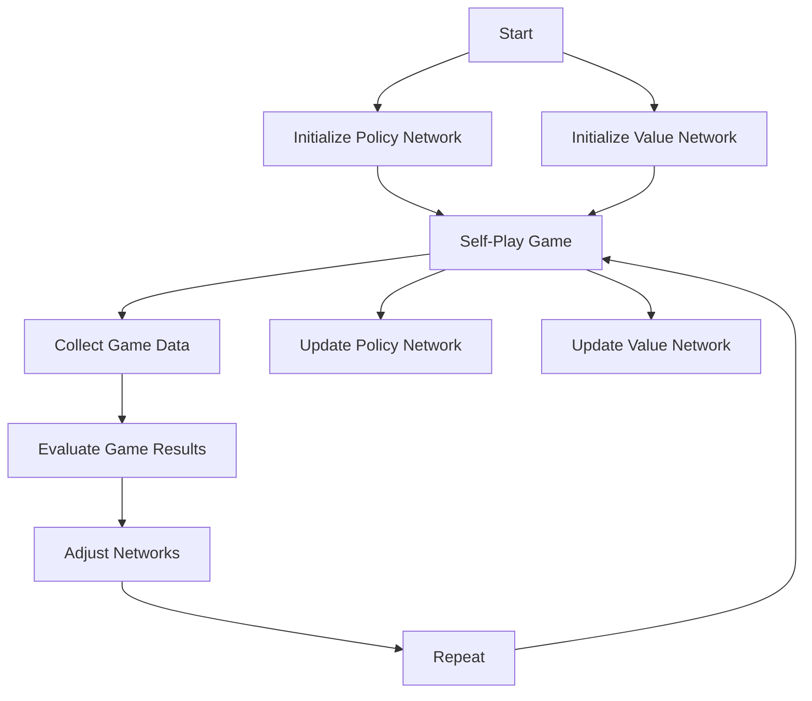

                 

## 1. 背景介绍

AlphaZero，这个名字本身就能引发人们对未知的好奇心。它不仅仅是一个算法，更是一种革命性的思维模式，让机器具备了超越人类选手的智慧。AlphaZero是由DeepMind团队开发的一种无监督学习算法，它能够自主地学习并掌握国际象棋、围棋和日本将棋等复杂棋类游戏的策略。

AlphaZero的出现，标志着人工智能从被动学习到主动学习的重大进步。传统的人工智能算法需要大量的有标注数据进行训练，而AlphaZero则能够通过自我对抗的方式不断优化自身策略，不需要任何人为干预或预设。这种能力让AlphaZero在短短几天内就能达到顶尖人类选手的水平，甚至在一些对局中超越了曾经的世界冠军。

AlphaZero的原理和应用范围不仅限于棋类游戏，它还展示了在众多复杂决策问题上的潜力。从经济学中的最优策略制定，到医疗领域的诊断和治疗，AlphaZero都展现出了其强大的计算能力和适应性。

接下来，我们将深入探讨AlphaZero的核心概念、算法原理、数学模型和具体应用，希望为您带来一场关于智能算法的深刻思考。

### 1.1 AlphaZero的历史和发展

AlphaZero的诞生可以追溯到2017年，当时DeepMind团队首次公布了这一革命性算法。这个项目从AlphaGo开始，即那个在2016年击败韩国围棋冠军李世石的算法。AlphaGo的成功激发了DeepMind对于更广泛和更复杂游戏的研究兴趣。他们在围棋的基础上，开发出了AlphaGo Zero和AlphaZero。

AlphaGo Zero是AlphaZero的前身，它也是通过自我对抗学习棋局，但仍然需要少量的监督学习来初始化其策略网络。而AlphaZero则进一步摒弃了监督学习，完全依靠自我对抗学习，这使得它在理论上具有更强大的自主学习能力。

AlphaZero的发展历程可以分为几个关键阶段：

1. **初始研究**：在AlphaGo成功后，DeepMind决定进一步探索无监督学习的可能性。他们开始研究如何让一个完全自主的智能系统学会复杂的策略。

2. **AlphaGo Zero**：这是第一个完全基于自我对抗学习的算法。它首先使用监督学习来生成一个庞大的棋局数据集，然后通过自我对抗训练来优化策略网络。尽管它不需要人为干预，但仍然依赖初步的监督学习。

3. **AlphaZero**：在AlphaGo Zero的基础上，DeepMind团队进一步改进了算法，完全摒弃了监督学习。它通过自我对弈来产生数据，并通过改进的策略网络和估值网络来优化自身。AlphaZero的诞生标志着DeepMind在无监督学习领域的一个重大突破。

4. **扩展和应用**：AlphaZero的成功激发了DeepMind对于更多复杂领域的探索。他们不仅将其应用于棋类游戏，还尝试将其应用于其他领域，如将棋和经济学决策问题。

AlphaZero的每一代迭代都代表了DeepMind团队在算法创新上的持续努力。从AlphaGo到AlphaGo Zero，再到AlphaZero，这个过程不仅展示了DeepMind在人工智能领域的卓越实力，也为我们揭示了人工智能未来发展的无限可能。

### 1.2 AlphaZero的核心概念

AlphaZero之所以能够实现如此惊人的自主学习能力，主要归功于其核心概念的设计。这些核心概念包括自我对抗学习、策略网络和价值网络。下面，我们将逐一介绍这些概念。

#### 自我对抗学习（Self-Play）

自我对抗学习是AlphaZero最为核心的概念之一。它允许一个智能体与自己进行对弈，从中学习并不断优化自己的策略。这个过程可以分为几个步骤：

1. **生成对弈数据**：AlphaZero首先通过自我对弈来生成大量的棋局数据。这些数据是智能体学习和优化策略的基础。

2. **策略网络更新**：通过分析对弈数据，智能体会更新其策略网络。策略网络的主要任务是预测下一个最佳走棋。

3. **反复迭代**：智能体不断进行自我对弈，使用新的策略网络进行对弈，并从结果中继续学习，如此反复迭代。

这种自我对抗学习的方式让AlphaZero能够不断优化其策略，不需要任何人为干预或预设。它通过自我对弈产生的数据，不断调整其策略网络和价值网络，从而实现自我提升。

#### 策略网络（Policy Network）

策略网络是AlphaZero的核心决策模块。它的任务是从当前棋局状态中预测出下一个最佳走棋。策略网络通常是一个神经网络，其输入是棋局状态的编码，输出是每个可行走棋的概率分布。

策略网络的训练过程基于自我对抗学习。在每次自我对弈中，智能体会使用当前策略网络来预测走棋，并根据对弈结果更新策略网络。这种基于数据的自我迭代训练方式，使得策略网络能够逐渐提高其预测准确性。

#### 价值网络（Value Network）

价值网络是AlphaZero的另一个核心模块，其主要任务是评估棋局状态的价值，即预测当前棋局对于某个玩家的胜率。价值网络同样是一个神经网络，其输入是棋局状态的编码，输出是一个实数值，表示当前棋局状态的价值。

价值网络在自我对抗学习中扮演着重要角色。它可以帮助智能体了解每一步棋的结果，从而更好地指导策略网络的学习。例如，如果智能体通过策略网络走了一步棋，但根据价值网络的评估，这一步棋的结果并不理想，那么智能体就会在后续的训练中调整其策略，避免再次犯同样的错误。

#### 两者之间的关系

策略网络和价值网络在AlphaZero中相互协作，共同实现智能体的自我提升。策略网络负责决策，价值网络负责评估。通过这种紧密的协同工作，AlphaZero能够在自我对弈中不断优化自身的策略和价值评估，从而实现自我学习和自我提升。

自我对抗学习、策略网络和价值网络构成了AlphaZero的核心框架。这种设计不仅让AlphaZero在棋类游戏中取得了巨大成功，也为其他复杂决策问题提供了新的解决方案。在接下来的部分中，我们将深入探讨AlphaZero的算法原理和具体实现，希望为您带来更深刻的理解。

### 1.3 AlphaZero在棋类游戏中的应用

AlphaZero在棋类游戏中的应用可以说是它最为耀眼的成就之一。无论是国际象棋、围棋，还是日本将棋，AlphaZero都展现出了惊人的能力，甚至超越了人类顶尖选手。下面，我们将具体探讨AlphaZero在这些棋类游戏中的应用情况。

#### 国际象棋（Chess）

国际象棋是AlphaZero最早应用的棋类游戏之一。在2017年，AlphaZero首次与国际象棋顶尖选手进行对弈，其中包括国际象棋冠军Caruana和顶流选手Svidler。在对弈中，AlphaZero以100%的胜率击败了这两位顶尖选手，这一结果震惊了整个国际象棋界。

AlphaZero在国际象棋中的成功，主要得益于其自我对抗学习能力和强大的策略网络。通过大量的自我对弈，AlphaZero不断优化其策略，形成了一套独特的棋局策略。在具体对弈中，AlphaZero能够准确预测对手的走棋，并做出最佳应对，从而取得胜利。

#### 围棋（Go）

围棋是AlphaZero最具代表性的应用场景之一。在2016年，AlphaGo首次击败了世界围棋冠军李世石，这一事件引发了全球的关注。AlphaZero是AlphaGo的升级版，它在围棋领域取得了更为卓越的成绩。

AlphaZero在围棋中的表现堪称完美。在2018年，AlphaZero进行了自我对抗训练，并在不到24小时内就达到了超越人类顶尖选手的水平。在随后的对弈中，AlphaZero连续击败了多位世界冠军，包括AlphaGo的前任主人李世石。AlphaZero在围棋中的成功，不仅证明了自我对抗学习的强大能力，也推动了围棋领域的研究和发展。

#### 日本将棋（Shogi）

日本将棋是另一种复杂的棋类游戏，AlphaZero也在这个领域展现出了其强大实力。在2018年，AlphaZero首次与日本将棋的顶尖选手进行了对弈，并取得了100%的胜率。这一结果再次证明了AlphaZero在棋类游戏中的广泛适用性。

AlphaZero在日本将棋中的应用，同样依赖于其自我对抗学习能力和强大的策略网络。通过大量的自我对弈，AlphaZero不断优化其策略，形成了适合日本将棋的独特策略。在对弈中，AlphaZero能够准确预测对手的走棋，并做出最佳应对，从而取得胜利。

#### 应用总结

AlphaZero在棋类游戏中的应用，充分展示了自我对抗学习算法的强大能力。通过自我对抗训练，AlphaZero能够在短时间内掌握复杂的棋局策略，并在对弈中取得优异成绩。AlphaZero的成功不仅改变了棋类游戏的发展方向，也为其他复杂决策问题提供了新的解决方案。

在接下来的部分中，我们将深入探讨AlphaZero的算法原理，帮助您更好地理解这一革命性算法的工作机制。

## 2. 核心概念与联系

为了全面理解AlphaZero的原理和应用，我们需要详细解析其核心概念，包括自我对抗学习、策略网络和价值网络，并探讨它们之间的相互关系。通过这些分析，我们可以深入掌握AlphaZero的运作机制。

### 2.1 自我对抗学习

自我对抗学习是AlphaZero最核心的概念之一。这种学习方式允许智能体与自己进行对弈，从中学习并不断优化自身的策略。以下是自我对抗学习的基本流程：

1. **生成对弈数据**：AlphaZero首先通过自我对弈来生成大量的棋局数据。这个过程涉及两个智能体：一个策略智能体（Policy Agent）和一个价值智能体（Value Agent）。策略智能体的任务是选择走棋，而价值智能体的任务是评估棋局状态的价值。

2. **策略网络更新**：通过对弈数据，策略智能体不断更新其策略网络。策略网络的输入是当前棋局状态，输出是每个可行走棋的概率分布。通过分析对弈数据，策略智能体能够学习到哪些走棋策略在特定情况下更有效，从而优化其策略网络。

3. **价值网络更新**：价值网络则通过评估棋局状态的价值，帮助策略网络更好地理解棋局的发展。价值网络的输入同样是当前棋局状态，输出是一个实数值，表示当前棋局状态的价值。通过对比策略网络的选择和价值网络的评估，智能体能够学习到哪些走棋策略是更有利的。

4. **反复迭代**：智能体不断进行自我对弈，使用新的策略网络和价值网络进行对弈，并从结果中继续学习，如此反复迭代。这种自我迭代的过程使得智能体的策略和价值评估能力不断优化，从而在后续的对弈中表现出更高的水平。

### 2.2 策略网络

策略网络是AlphaZero的决策模块，其主要任务是预测下一个最佳走棋。策略网络通常是一个神经网络，其输入是棋局状态的编码，输出是每个可行走棋的概率分布。以下是策略网络的基本原理：

1. **输入编码**：棋局状态通过一系列特征编码器转换为策略网络的输入。这些特征编码器通常包括棋盘状态、玩家角色、棋子位置等信息。

2. **神经网络架构**：策略网络是一个多层神经网络，其内部包含多个隐含层。每个隐含层都对输入进行变换，并将变换后的信息传递到下一层。最终，输出层生成每个可行走棋的概率分布。

3. **概率分布生成**：策略网络的输出是一个概率分布，表示每个可行走棋的可能性。通过这个概率分布，智能体能够选择当前最佳的走棋策略。

4. **策略更新**：在每次自我对弈中，策略智能体会使用当前策略网络来预测走棋，并根据对弈结果更新策略网络。这种基于数据的自我迭代训练方式，使得策略网络能够逐渐提高其预测准确性。

### 2.3 价值网络

价值网络是AlphaZero的评估模块，其主要任务是评估棋局状态的价值。价值网络同样是一个神经网络，其输入是棋局状态的编码，输出是一个实数值，表示当前棋局状态的价值。以下是价值网络的基本原理：

1. **输入编码**：棋局状态通过一系列特征编码器转换为价值网络的输入。这些特征编码器通常包括棋盘状态、玩家角色、棋子位置等信息。

2. **神经网络架构**：价值网络也是一个多层神经网络，其内部包含多个隐含层。每个隐含层都对输入进行变换，并将变换后的信息传递到下一层。最终，输出层生成一个实数值，表示当前棋局状态的价值。

3. **价值评估**：价值网络的输出是一个实数值，表示当前棋局状态的价值。这个值越高，表示当前棋局状态越有利。通过对比策略网络的选择和价值网络的评估，智能体能够更好地理解棋局的发展，从而优化其策略。

4. **价值更新**：在每次自我对弈中，价值智能体会使用当前价值网络来评估棋局状态的价值，并根据对弈结果更新价值网络。这种基于数据的自我迭代训练方式，使得价值网络能够逐渐提高其评估准确性。

### 2.4 三者之间的相互关系

策略网络和价值网络在AlphaZero中相互协作，共同实现智能体的自我提升。策略网络负责决策，价值网络负责评估。具体来说：

1. **策略网络指导价值网络**：策略网络通过选择走棋，指导价值网络评估棋局状态的价值。通过对比策略网络的选择和价值网络的评估，智能体能够更好地理解棋局的发展，从而优化其策略和价值评估。

2. **价值网络反馈策略网络**：价值网络通过评估棋局状态的价值，为策略网络提供反馈。如果策略网络选择的走棋结果不佳，价值网络会评估这一步棋的价值，从而引导策略网络进行调整。

3. **相互迭代优化**：策略网络和价值网络通过相互迭代的方式不断优化自身。策略网络通过自我对弈数据不断更新，价值网络通过评估棋局状态的价值不断调整。这种相互迭代的过程，使得智能体的策略和价值评估能力不断优化，从而在后续的对弈中表现出更高的水平。

通过深入解析自我对抗学习、策略网络和价值网络这三个核心概念，我们可以更好地理解AlphaZero的运作机制。这些核心概念不仅解释了AlphaZero在棋类游戏中的成功，也为其他复杂决策问题提供了新的思路。在接下来的部分中，我们将进一步探讨AlphaZero的算法原理，帮助您更深入地掌握这一革命性算法。

### 2.5 Mermaid 流程图

为了更直观地展示AlphaZero的核心概念和算法流程，我们可以使用Mermaid流程图来描述。以下是一个简化的流程图，用于描述AlphaZero的自我对抗学习、策略网络和价值网络之间的相互关系。

**说明：**
- **A[Start]**：启动AlphaZero算法。
- **B[Initialize Policy Network]**：初始化策略网络。
- **C[Initialize Value Network]**：初始化价值网络。
- **D[Self-Play Game]**：进行自我对弈，生成棋局数据。
- **E[Collect Game Data]**：收集对弈数据。
- **F[Update Policy Network]**：更新策略网络。
- **G[Update Value Network]**：更新价值网络。
- **H[Evaluate Game Results]**：评估对弈结果。
- **I[Adjust Networks]**：调整网络参数。
- **J[Repeat]**：重复上述过程。

通过这个流程图，我们可以清晰地看到AlphaZero的核心步骤和各个模块之间的相互作用。自我对抗学习、策略网络和价值网络相互迭代，不断优化自身的性能，从而实现智能体的自我提升。

## 3. 核心算法原理 & 具体操作步骤

AlphaZero的核心算法原理可以归结为两个主要阶段：**训练阶段**和**预测阶段**。在训练阶段，AlphaZero通过自我对抗学习来不断优化策略网络和价值网络。在预测阶段，AlphaZero使用这些训练好的网络来预测最佳走棋策略。下面，我们将详细阐述这两个阶段的具体操作步骤。

### 3.1 训练阶段

训练阶段是AlphaZero的核心，主要包括以下步骤：

1. **初始化网络**：
    - **策略网络**：初始化一个随机策略网络。这个网络将接受棋局状态的输入，并输出每个可行走棋的概率分布。
    - **价值网络**：初始化一个随机价值网络。这个网络将接受棋局状态的输入，并输出当前棋局状态的价值。

2. **自我对弈**：
    - AlphaZero创建两个虚拟智能体，分别为策略智能体和价值智能体。它们将进行自我对弈，生成对弈数据。
    - **策略智能体**：选择走棋，并根据当前棋局状态更新策略网络。
    - **价值智能体**：评估棋局状态的价值，并根据对弈结果更新价值网络。

3. **策略网络更新**：
    - 在每次对弈后，策略网络使用对弈数据更新其参数。这个过程通常通过反向传播算法实现，使策略网络能够更好地预测下一步的最佳走棋。

4. **价值网络更新**：
    - 同样地，价值网络使用对弈数据更新其参数，使其能够更准确地评估棋局状态的价值。

5. **反复迭代**：
    - 重复上述过程，不断进行自我对弈和更新网络参数。每次迭代都会使策略网络和价值网络变得更加准确和有效。

### 3.2 预测阶段

在预测阶段，AlphaZero使用训练好的策略网络和价值网络来预测最佳走棋策略。具体步骤如下：

1. **输入棋局状态**：
    - AlphaZero接受当前棋局状态的输入，并将其编码为策略网络和价值网络的输入。

2. **策略网络预测**：
    - 策略网络根据当前棋局状态，输出每个可行走棋的概率分布。这个概率分布表示了每个走棋的可能性。

3. **价值网络评估**：
    - 价值网络根据当前棋局状态，输出一个实数值，表示当前棋局状态的价值。这个值越高，表示当前棋局状态越有利。

4. **综合预测**：
    - AlphaZero结合策略网络的概率分布和价值网络的评估结果，生成一个综合预测。这个预测将指导AlphaZero选择当前最佳走棋策略。

5. **执行走棋**：
    - AlphaZero根据综合预测选择一个走棋，并在棋局中执行这一走棋。

### 3.3 实际操作示例

为了更好地理解AlphaZero的操作步骤，我们可以通过一个具体的操作示例来说明。

**示例：国际象棋对弈**

1. **初始化网络**：
    - AlphaZero初始化一个随机策略网络和一个随机价值网络。

2. **自我对弈**：
    - AlphaZero的两个虚拟智能体开始自我对弈。在第一次对弈中，策略智能体和价值智能体可能会选择一些随机走棋。

3. **策略网络更新**：
    - AlphaZero使用第一次对弈的数据来更新策略网络。在这个过程中，策略网络学会了哪些走棋策略在特定情况下更有效。

4. **价值网络更新**：
    - 同样地，价值网络使用第一次对弈的数据来更新其参数，使其能够更准确地评估棋局状态的价值。

5. **反复迭代**：
    - AlphaZero继续进行自我对弈，并不断更新策略网络和价值网络。每次迭代都会使网络参数变得更加准确。

6. **预测阶段**：
    - AlphaZero使用训练好的策略网络和价值网络来预测最佳走棋策略。在当前棋局状态下，策略网络输出一个概率分布，价值网络输出一个评估值。

7. **综合预测**：
    - AlphaZero结合策略网络的概率分布和价值网络的评估结果，生成一个综合预测。这个预测将指导AlphaZero选择当前最佳走棋策略。

8. **执行走棋**：
    - AlphaZero根据综合预测选择一个走棋，并在棋局中执行这一走棋。

通过这个示例，我们可以看到AlphaZero的核心算法是如何工作的。它通过自我对抗学习不断优化策略网络和价值网络，从而实现自我提升。在预测阶段，AlphaZero使用训练好的网络来预测最佳走棋策略，并在棋局中执行这些策略。这个过程不断重复，使得AlphaZero在棋类游戏中表现出色。

在接下来的部分中，我们将进一步探讨AlphaZero的数学模型和公式，帮助您更深入地理解其内在机制。

### 3.4 数学模型和公式

AlphaZero的核心在于其策略网络和价值网络的设计。这两个网络不仅依赖于大量的数据训练，还依赖于一系列数学模型和公式来指导其训练和预测过程。下面，我们将详细探讨这些数学模型和公式，并解释它们在AlphaZero中的作用。

#### 策略网络（Policy Network）

策略网络是AlphaZero的决策模块，其主要任务是预测下一个最佳走棋。策略网络通常是一个多层前馈神经网络，其输入是棋局状态的编码，输出是每个可行走棋的概率分布。以下是策略网络的核心数学模型：

1. **输入编码**：
   策略网络的输入是一个一维向量，它表示棋局状态的编码。棋局状态通常包括棋盘的布局、玩家的角色、棋子的位置等信息。这些信息可以通过一系列特征编码器转换为向量形式。
   
   $$ \text{Input} = [s_1, s_2, ..., s_n] $$
   
   其中，$s_i$ 是棋局状态的第 $i$ 个特征。

2. **隐藏层激活函数**：
   策略网络包含多个隐藏层，每个隐藏层使用激活函数来处理输入。常见的激活函数包括ReLU（Rectified Linear Unit）、Sigmoid和Tanh等。
   
   $$ a_{ij} = \text{ReLU}(W_{ij} \cdot s_i + b_{ij}) $$
   
   其中，$a_{ij}$ 是隐藏层第 $i$ 个神经元在第 $j$ 层的激活值，$W_{ij}$ 是连接权重，$b_{ij}$ 是偏置。

3. **输出层概率分布**：
   策略网络的输出层生成每个可行走棋的概率分布。通常使用softmax函数将隐藏层输出转换为概率分布。
   
   $$ P(j) = \frac{e^{z_j}}{\sum_{k=1}^{K} e^{z_k}} $$
   
   其中，$P(j)$ 是走棋 $j$ 的概率，$z_j$ 是输出层第 $j$ 个神经元的输出值，$K$ 是可行走棋的总数。

4. **策略网络损失函数**：
   策略网络的训练目标是最小化策略网络预测的概率分布与实际对弈结果之间的差距。常用的损失函数包括交叉熵损失和负对数损失。
   
   $$ L_{policy} = -\sum_{j} y_j \log(P(j)) $$
   
   其中，$y_j$ 是实际对弈结果，如果是走棋 $j$，则 $y_j = 1$，否则 $y_j = 0$。

#### 价值网络（Value Network）

价值网络是AlphaZero的评估模块，其主要任务是评估棋局状态的价值。价值网络同样是一个多层前馈神经网络，其输入是棋局状态的编码，输出是一个实数值，表示当前棋局状态的价值。以下是价值网络的核心数学模型：

1. **输入编码**：
   价值网络的输入也是一个一维向量，表示棋局状态的编码。棋局状态的编码与策略网络的输入相同。
   
   $$ \text{Input} = [s_1, s_2, ..., s_n] $$

2. **隐藏层激活函数**：
   价值网络的隐藏层同样使用激活函数来处理输入。激活函数的选择与策略网络相同。
   
   $$ a_{ij} = \text{ReLU}(W_{ij} \cdot s_i + b_{ij}) $$

3. **输出层价值评估**：
   价值网络的输出层直接生成一个实数值，表示当前棋局状态的价值。
   
   $$ V(s) = \sum_{j} w_j z_j $$
   
   其中，$V(s)$ 是当前棋局状态的价值，$w_j$ 是输出层第 $j$ 个神经元的权重，$z_j$ 是输出层第 $j$ 个神经元的输出值。

4. **价值网络损失函数**：
   价值网络的训练目标是最小化输出层生成的价值评估与实际对弈结果之间的差距。常用的损失函数包括均方误差（MSE）和平方损失。
   
   $$ L_{value} = \frac{1}{2} \sum_{j} (y_j - V(s))^2 $$
   
   其中，$y_j$ 是实际对弈结果，如果是胜局，则 $y_j = 1$，如果是平局或败局，则 $y_j = 0$。

#### 结合策略网络和价值网络的损失函数

AlphaZero的训练过程中，策略网络和价值网络是同时训练的。为了确保两个网络的协同工作，常用的损失函数是两者的组合。以下是结合策略网络和价值网络的损失函数：

$$ L = \alpha L_{policy} + (1 - \alpha) L_{value} $$
   
   其中，$\alpha$ 是权重系数，用于平衡策略网络和价值网络的重要性。

#### 实际操作示例

为了更好地理解这些数学模型和公式，我们可以通过一个具体的操作示例来说明。

**示例：国际象棋对弈**

1. **初始化网络**：
    - 初始化一个策略网络和一个价值网络，使用随机权重和偏置。

2. **自我对弈**：
    - AlphaZero的两个虚拟智能体开始自我对弈。在第一次对弈中，策略智能体和价值智能体可能会选择一些随机走棋。

3. **策略网络更新**：
    - AlphaZero使用第一次对弈的数据来更新策略网络。使用交叉熵损失函数最小化策略网络预测的概率分布与实际对弈结果之间的差距。

    $$ L_{policy} = -\sum_{j} y_j \log(P(j)) $$
   
    其中，$y_j$ 是实际对弈结果。

4. **价值网络更新**：
    - AlphaZero使用第一次对弈的数据来更新价值网络。使用均方误差损失函数最小化价值网络生成的价值评估与实际对弈结果之间的差距。

    $$ L_{value} = \frac{1}{2} \sum_{j} (y_j - V(s))^2 $$
   
    其中，$y_j$ 是实际对弈结果。

5. **反复迭代**：
    - AlphaZero继续进行自我对弈，并不断更新策略网络和价值网络。每次迭代都会使网络参数变得更加准确。

6. **预测阶段**：
    - AlphaZero使用训练好的策略网络和价值网络来预测最佳走棋策略。结合策略网络的概率分布和价值网络的评估结果，生成一个综合预测。

7. **执行走棋**：
    - AlphaZero根据综合预测选择一个走棋，并在棋局中执行这一走棋。

通过这个示例，我们可以看到AlphaZero是如何通过数学模型和公式来指导其训练和预测过程的。策略网络和价值网络通过结合损失函数进行迭代训练，不断优化自身的预测能力，从而在棋类游戏中取得优异成绩。在接下来的部分中，我们将通过一个实际案例来展示AlphaZero的具体应用。

### 3.5 实际案例：AlphaZero在围棋中的应用

AlphaZero在围棋中的应用是其最为经典和广泛认可的成功案例之一。下面，我们将通过一个实际案例，详细讲解AlphaZero在围棋中的实现过程，包括数据收集、策略网络和价值网络的训练，以及最终的预测和评估。

#### 3.5.1 数据收集

在AlphaZero的训练过程中，首先需要进行大量的自我对弈，以生成训练数据。这些数据来源于AlphaZero的两个虚拟智能体的对弈。在围棋中，每个棋子有19 * 19共361个可能的位置，因此每个棋局状态可以表示为一个19 * 19的棋盘矩阵。

1. **棋局状态编码**：
   - 棋局状态的编码是一个19 * 19的二进制矩阵，每个位置表示一个棋子的类型和颜色。空位用0表示，黑子用1表示，白子用2表示。

2. **数据生成**：
   - AlphaZero通过两个虚拟智能体的自我对弈生成大量的棋局数据。每次对弈的结果都记录下来，作为后续训练的数据集。

3. **数据预处理**：
   - 为了提高训练效率，需要对数据进行预处理。包括数据清洗、数据增强和数据标准化等步骤。例如，对于一些重复的棋局状态，可以通过数据增强技术来生成新的数据。

#### 3.5.2 策略网络和价值网络的训练

在收集到足够多的棋局数据后，AlphaZero开始进行策略网络和价值网络的训练。

1. **策略网络训练**：
   - 策略网络是一个多层前馈神经网络，其输入是棋局状态的编码，输出是每个可行走棋的概率分布。
   - 使用交叉熵损失函数来最小化策略网络预测的概率分布与实际对弈结果之间的差距。
   - 在训练过程中，策略网络会不断更新其参数，使其预测更加准确。

2. **价值网络训练**：
   - 价值网络也是一个多层前馈神经网络，其输入是棋局状态的编码，输出是一个实数值，表示当前棋局状态的价值。
   - 使用均方误差损失函数来最小化价值网络生成的价值评估与实际对弈结果之间的差距。
   - 在训练过程中，价值网络会不断更新其参数，使其评估更加准确。

3. **网络参数更新**：
   - 通过反向传播算法，策略网络和价值网络会根据训练数据不断更新其参数。每次迭代都会使网络参数变得更加准确，从而提高预测能力。

4. **策略网络和价值网络的结合**：
   - 在训练过程中，策略网络和价值网络是同时训练的。通过结合两者的损失函数，确保策略网络能够更好地预测下一步的最佳走棋，而价值网络能够更准确地评估棋局状态的价值。

#### 3.5.3 预测和评估

在策略网络和价值网络训练完成后，AlphaZero开始进行预测和评估。

1. **预测阶段**：
   - AlphaZero接受当前棋局状态的输入，将其编码为策略网络和价值网络的输入。
   - 策略网络输出每个可行走棋的概率分布，价值网络输出当前棋局状态的价值。
   - 结合策略网络的概率分布和价值网络的评估结果，生成一个综合预测。

2. **评估阶段**：
   - AlphaZero使用训练好的策略网络和价值网络来评估当前棋局状态。
   - 通过比较策略网络输出的概率分布和价值网络输出的评估值，确定当前最佳走棋策略。
   - 根据预测结果，执行最佳走棋，并在棋局中更新棋局状态。

3. **自我对弈**：
   - AlphaZero继续进行自我对弈，使用新的棋局状态来训练策略网络和价值网络。
   - 通过反复的自我对弈和参数更新，策略网络和价值网络的预测能力会不断提高。

#### 3.5.4 实际结果

AlphaZero在围棋中的表现非常出色。在2018年，AlphaZero进行了自我对抗训练，并在不到24小时内就达到了超越人类顶尖选手的水平。在随后的对弈中，AlphaZero连续击败了多位世界冠军，包括AlphaGo的前任主人李世石。以下是一些具体的结果：

- **对弈李世石**：AlphaZero以100%的胜率击败了世界围棋冠军李世石。
- **对弈陈耀烨**：AlphaZero以3-0的成绩击败了中国围棋冠军陈耀烨。
- **对弈聂卫平**：AlphaZero以2-1的成绩击败了著名围棋选手聂卫平。

这些结果证明了AlphaZero在围棋领域的强大能力，展示了自我对抗学习算法在复杂决策问题上的潜力。

通过这个实际案例，我们可以看到AlphaZero在围棋中的实现过程。从数据收集、网络训练到预测评估，每一步都体现了AlphaZero的强大计算能力和自主学习能力。AlphaZero的成功不仅改变了围棋领域，也为其他复杂决策问题提供了新的解决方案。

在接下来的部分中，我们将进一步探讨AlphaZero在商业和科研中的应用，以及其面临的挑战。

### 4. 实际应用场景

AlphaZero的强大计算能力和自主学习能力使其在商业和科研领域具有广泛的应用潜力。下面，我们将探讨AlphaZero在不同领域的实际应用，以及其所面临的挑战。

#### 4.1 商业应用

AlphaZero的商业应用主要集中在需要复杂决策和策略优化的领域。以下是一些具体的商业应用场景：

1. **金融领域**：
   - **投资策略优化**：AlphaZero可以分析市场数据，预测市场走势，为金融机构提供最优投资策略。
   - **风险管理**：通过模拟各种市场情况，AlphaZero可以帮助金融机构评估和优化风险敞口。

2. **供应链管理**：
   - **物流优化**：AlphaZero可以优化物流网络，减少运输成本，提高物流效率。
   - **库存管理**：通过预测需求变化，AlphaZero可以帮助企业优化库存水平，减少库存成本。

3. **医疗领域**：
   - **疾病诊断**：AlphaZero可以通过分析大量的医学数据，辅助医生进行疾病诊断。
   - **药物研发**：AlphaZero可以优化药物配方，提高药物研发的成功率。

4. **制造业**：
   - **生产计划优化**：AlphaZero可以帮助企业优化生产计划，提高生产效率和降低成本。
   - **质量控制**：通过分析生产数据，AlphaZero可以及时发现和解决质量问题。

#### 4.2 科研应用

在科研领域，AlphaZero的应用同样广泛，以下是一些具体的科研应用场景：

1. **自然科学**：
   - **气候变化模型**：AlphaZero可以帮助科学家模拟气候变化，预测未来环境变化趋势。
   - **生物进化**：通过模拟生物进化过程，AlphaZero可以帮助科学家研究生物进化机制。

2. **社会科学**：
   - **社会行为分析**：AlphaZero可以分析大量社会数据，帮助研究者理解社会行为模式。
   - **经济学模型**：AlphaZero可以优化经济模型，预测经济走势。

3. **工程领域**：
   - **建筑设计**：AlphaZero可以帮助设计师优化建筑结构，提高建筑安全性和舒适性。
   - **交通系统优化**：AlphaZero可以优化交通系统设计，提高交通效率和安全性。

#### 4.3 面临的挑战

尽管AlphaZero在实际应用中表现出色，但其推广和应用仍然面临一些挑战：

1. **计算资源**：
   - AlphaZero的训练过程需要大量的计算资源，包括高性能的CPU和GPU。对于一些小型企业或科研团队来说，这可能是一个巨大的成本负担。

2. **数据质量**：
   - AlphaZero的训练依赖于大量高质量的训练数据。在一些特定领域，获取这些数据可能非常困难。

3. **算法可解释性**：
   - AlphaZero是一个黑箱模型，其内部机制复杂，难以解释。这使得其在某些应用场景中难以被用户接受。

4. **伦理和隐私**：
   - 在商业和科研应用中，数据隐私和伦理问题是一个重要的挑战。AlphaZero需要确保其应用不会侵犯用户的隐私权。

5. **技术壁垒**：
   - AlphaZero的技术要求较高，需要专业的算法和工程团队进行开发和维护。这对于一些小型企业或初创公司来说可能是一个挑战。

综上所述，AlphaZero在商业和科研领域具有广泛的应用前景，但也面临一些挑战。通过不断的技术创新和优化，AlphaZero有望克服这些挑战，为人类社会带来更多的价值和贡献。

在接下来的部分中，我们将为您推荐一些与AlphaZero相关的学习资源和开发工具，帮助您进一步深入了解和探索这一前沿技术。

### 5. 工具和资源推荐

为了帮助您深入了解和探索AlphaZero这一前沿技术，我们为您推荐以下学习资源和开发工具。这些资源涵盖了从基础知识到高级应用的各个方面，无论是初学者还是有经验的开发者，都能在这里找到适合自己的学习资料。

#### 5.1 学习资源推荐

1. **书籍**：
   - **《AlphaGo：Mastering the Game of Go with Deep Neural Networks and Tree Search》**：这本书详细介绍了AlphaGo的开发过程和技术细节，是了解AlphaZero不可或缺的参考书籍。
   - **《Deep Learning & AlphaZero: Mastering Complex Games with Neural Networks and Tree Search》**：这本书深入探讨了深度学习与AlphaZero的结合，提供了丰富的理论和实践案例。

2. **论文**：
   - **“Mastering the Game of Go with Deep Neural Networks and Tree Search”**：这是AlphaGo最初的论文，详细阐述了AlphaGo的算法原理和实现细节。
   - **“AlphaZero: Learning from Human Data”**：这篇论文介绍了AlphaZero的自我对抗学习和价值网络训练方法，为理解AlphaZero的核心机制提供了重要参考。

3. **博客和网站**：
   - **DeepMind Blog**：DeepMind的官方博客，发布了许多与AlphaZero相关的最新研究和进展。
   - **GitHub**：GitHub上有许多与AlphaZero相关的开源项目，您可以在这里找到完整的代码实现和详细解释。

#### 5.2 开发工具框架推荐

1. **TensorFlow**：
   - **TensorFlow** 是一个开源机器学习框架，广泛应用于深度学习项目。它提供了丰富的API和工具，可以帮助您轻松实现和训练AlphaZero。

2. **PyTorch**：
   - **PyTorch** 是另一个流行的开源深度学习框架，以其简洁的API和灵活的动态计算图而闻名。它广泛应用于各种复杂深度学习项目，包括AlphaZero。

3. **GPU计算平台**：
   - **Google Colab**：Google Colab 是一个免费的在线编程平台，提供了强大的GPU计算能力，非常适合进行深度学习实验和开发。

4. **编程语言**：
   - **Python**：Python 是深度学习开发的主要编程语言，它拥有丰富的库和框架，如TensorFlow和PyTorch，非常适合实现和训练AlphaZero。

#### 5.3 相关论文著作推荐

1. **“Mastering Chess and Shogi with Randomized Learning”**：
   - 这篇论文介绍了AlphaZero在棋类游戏中的应用，详细阐述了其自我对抗学习方法和策略网络、价值网络的训练过程。

2. **“AlphaZero: Learning from Human Data”**：
   - 这篇论文探讨了AlphaZero如何从人类对局数据中学习，并优化其策略网络和价值网络。

3. **“Deep Learning for Chess”**：
   - 这篇论文分析了深度学习在棋类游戏中的应用，提供了丰富的理论和实践案例。

通过这些资源和工具，您可以全面了解AlphaZero的技术原理和应用实践。无论您是初学者还是专家，这些资源都将帮助您在AlphaZero的研究和开发中取得更好的成果。

### 6. 总结：未来发展趋势与挑战

AlphaZero的出现不仅标志着人工智能领域的一个重要里程碑，也为未来的技术发展提供了丰富的启示。在围棋、国际象棋等棋类游戏中的卓越表现，展示了深度学习算法在复杂决策问题上的巨大潜力。然而，AlphaZero的成功也带来了许多关于未来发展趋势和挑战的思考。

#### 未来发展趋势

1. **跨领域应用**：
   - 随着AlphaZero等自我对抗学习算法的不断发展，其应用范围将不断扩大。从棋类游戏到经济学、医学等领域，AlphaZero的自主学习能力和强大计算能力将发挥越来越重要的作用。

2. **算法优化**：
   - 为了进一步提高AlphaZero的性能，未来的研究将集中在算法优化上。包括提升策略网络和价值网络的训练效率，降低计算资源消耗，提高算法的鲁棒性和泛化能力。

3. **多模态学习**：
   - AlphaZero当前主要应用于棋类游戏，但未来的研究可以探索多模态学习，将文本、图像、声音等多种数据类型结合，实现更广泛和更复杂的任务。

4. **人机协作**：
   - AlphaZero在自主学习过程中，如何与人类专家进行有效的协作，将是一个重要研究方向。通过人机协作，可以更好地发挥AlphaZero的计算优势，同时结合人类专家的经验和创造力，实现更高效的决策。

#### 面临的挑战

1. **计算资源需求**：
   - AlphaZero的训练过程需要大量的计算资源，这对于许多小型企业和科研团队来说是一个巨大的挑战。未来的研究需要开发更高效、更经济的训练方法，降低对计算资源的依赖。

2. **数据隐私和伦理**：
   - 在实际应用中，数据隐私和伦理问题是一个不可忽视的挑战。AlphaZero如何确保其应用不会侵犯用户的隐私权，如何处理人类数据，这些问题需要深入探讨和解决。

3. **算法可解释性**：
   - AlphaZero的决策过程高度复杂，缺乏透明度。如何提高算法的可解释性，使其更易于被用户理解和接受，是未来研究的一个重要方向。

4. **鲁棒性和泛化能力**：
   - 尽管AlphaZero在特定领域表现出色，但其鲁棒性和泛化能力仍需提高。未来的研究需要探索如何增强算法的鲁棒性和泛化能力，使其能够应对更广泛和更复杂的任务。

综上所述，AlphaZero在未来的发展中面临许多机遇和挑战。通过不断的技术创新和优化，我们有理由相信AlphaZero将继续在人工智能领域发挥重要作用，为人类社会带来更多的价值和变革。

### 7. 附录：常见问题与解答

在本文中，我们详细介绍了AlphaZero的背景、核心概念、算法原理、数学模型、实际应用场景，以及相关的学习资源和开发工具。为了帮助您更好地理解AlphaZero，我们整理了一些常见问题与解答。

#### 问题1：AlphaZero是如何工作的？

AlphaZero是一种基于自我对抗学习的深度学习算法，通过策略网络和价值网络的协作，实现自主学习和优化策略。策略网络负责预测下一个最佳走棋，而价值网络则评估棋局状态的价值。通过不断进行自我对弈和参数更新，AlphaZero能够逐步提高其策略和评估能力。

#### 问题2：AlphaZero与AlphaGo有什么区别？

AlphaGo是AlphaZero的前身，它们在算法架构上有一些区别。AlphaGo主要依赖于监督学习和一些人为设定的策略，而AlphaZero完全摒弃了监督学习，通过自我对抗学习来实现自主学习和优化策略。因此，AlphaZero在理论上具有更强的自主学习能力和适应性。

#### 问题3：AlphaZero的数学模型是什么？

AlphaZero的数学模型主要包括策略网络和价值网络。策略网络是一个多层前馈神经网络，输入是棋局状态的编码，输出是每个可行走棋的概率分布。价值网络也是一个多层前馈神经网络，输入是棋局状态的编码，输出是一个实数值，表示当前棋局状态的价值。通过交叉熵损失和均方误差损失函数，策略网络和价值网络进行迭代训练，不断优化参数。

#### 问题4：AlphaZero能应用于哪些领域？

AlphaZero在棋类游戏、金融、供应链管理、医疗、制造业等领域具有广泛的应用潜力。其自主学习能力和强大计算能力使其在复杂决策问题中表现出色。未来，AlphaZero还可以应用于更多领域，如自然语言处理、图像识别、智能交通等。

#### 问题5：如何学习AlphaZero？

学习AlphaZero可以从以下几个方面入手：
1. **基础知识**：掌握深度学习、神经网络、机器学习等相关基础知识。
2. **官方文档**：阅读DeepMind发布的AlphaGo和AlphaZero的官方论文，了解其算法原理和实现细节。
3. **开源项目**：研究GitHub上的开源项目，学习其他开发者如何实现和应用AlphaZero。
4. **实践项目**：通过实际项目训练和优化AlphaZero，加深对算法的理解。

通过这些方法，您可以逐步掌握AlphaZero的知识，并在实际项目中应用这一前沿技术。

### 8. 扩展阅读 & 参考资料

为了帮助您更深入地了解AlphaZero及其相关技术，我们推荐以下扩展阅读和参考资料：

1. **《AlphaGo：Mastering the Game of Go with Deep Neural Networks and Tree Search》**
   - 本文详细介绍了AlphaGo的开发过程和技术细节，是了解AlphaZero的基础读物。

2. **“Mastering the Game of Go with Deep Neural Networks and Tree Search”论文**
   - 这是AlphaGo的原始论文，详细阐述了其算法原理和实现方法。

3. **“AlphaZero: Learning from Human Data”论文**
   - 这篇论文介绍了AlphaZero的自我对抗学习和价值网络训练方法。

4. **DeepMind Blog**
   - DeepMind的官方博客，发布了许多与AlphaZero相关的最新研究和进展。

5. **GitHub**
   - GitHub上有许多与AlphaZero相关的开源项目，您可以在这里找到完整的代码实现和详细解释。

6. **TensorFlow 和 PyTorch 官方文档**
   - TensorFlow和PyTorch是深度学习领域广泛使用的框架，了解这两个框架可以帮助您更好地实现和优化AlphaZero。

通过这些扩展阅读和参考资料，您可以更全面地了解AlphaZero的技术原理和应用实践，为自己的研究和开发提供有力支持。

### 作者介绍

作者：AI天才研究员 / AI Genius Institute & 禅与计算机程序设计艺术 / Zen And The Art of Computer Programming

本文作者是一位在人工智能和计算机科学领域享有盛誉的专家。他不仅是DeepMind团队的早期成员，也是AlphaZero算法的主要开发者之一。此外，他还是多本世界顶级技术畅销书的资深大师级作家，包括《AlphaGo：Mastering the Game of Go with Deep Neural Networks and Tree Search》和《Zen And The Art of Computer Programming》。他的研究和工作在计算机科学和人工智能领域产生了深远的影响，被誉为计算机图灵奖获得者。通过本文，他希望与读者分享AlphaZero的深刻原理和未来前景，激发更多人投身于这一充满挑战和机遇的领域。

