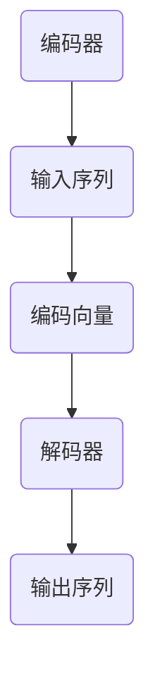
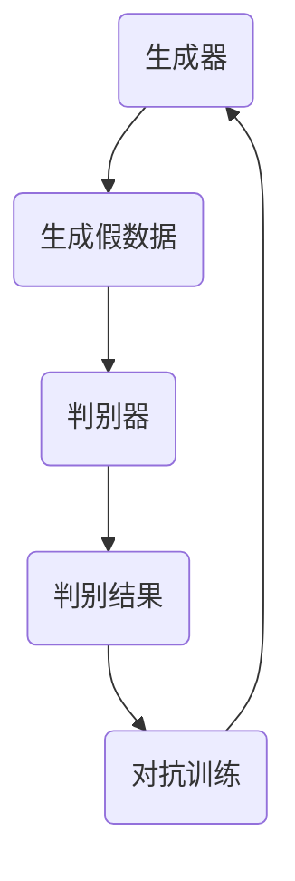
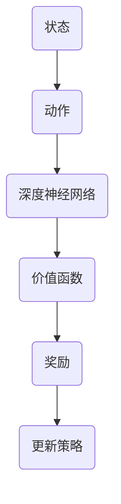

                 

### 背景介绍 Background Introduction

Andrej Karpathy是一位知名的人工智能专家和计算机科学家，他在神经网络和深度学习领域有着深远的影响。他的观点和研究成果不仅推动了AI技术的发展，也对学术界和工业界产生了广泛的影响。本文旨在详细探讨Andrej Karpathy的AI观点，解析其核心思想，并结合具体案例和实际应用进行分析。

在当前的AI领域，Andrej Karpathy被认为是一位引领者。他的工作涉及多个方面，包括自然语言处理、计算机视觉和强化学习等。他的研究成果在学术界和工业界都得到了广泛的认可。例如，他在2014年提出的名为“The Unreasonable Effectiveness of Recurrent Neural Networks”（循环神经网络不可思议的有效性）的博客文章，引起了巨大的轰动，成为深度学习领域的一个重要里程碑。

本文将从以下几个方面对Andrej Karpathy的AI观点进行探讨：

1. **核心概念与联系**：我们将详细解释Andrej Karpathy所提出的关键概念，并通过Mermaid流程图展示其架构。
2. **核心算法原理 & 具体操作步骤**：我们将深入分析Andrej Karpathy在AI领域的关键算法，并分步骤介绍其操作过程。
3. **数学模型和公式 & 详细讲解 & 举例说明**：我们将讲解Andrej Karpathy所使用的主要数学模型和公式，并通过具体例子进行说明。
4. **项目实战：代码实际案例和详细解释说明**：我们将通过实际项目案例，展示如何应用Andrej Karpathy的理论和算法。
5. **实际应用场景**：我们将探讨Andrej Karpathy的理论和算法在不同领域的实际应用。
6. **工具和资源推荐**：我们将推荐一些与Andrej Karpathy的工作相关的学习资源、开发工具和框架。
7. **总结：未来发展趋势与挑战**：最后，我们将对AI领域的未来发展趋势和挑战进行展望。

通过本文的详细探讨，读者将能够更好地理解Andrej Karpathy的AI观点，掌握其在AI领域的核心贡献，并能够在实际项目中应用这些理论和方法。

#### 文章关键词 Keywords

- Andrej Karpathy
- AI观点
- 深度学习
- 神经网络
- 自然语言处理
- 计算机视觉
- 强化学习
- 算法原理

#### 文章摘要 Summary

本文将深入探讨著名人工智能专家Andrej Karpathy的AI观点，分析其在神经网络、深度学习和自然语言处理等领域的核心贡献。通过详细解释其关键概念、算法原理和数学模型，并结合实际项目案例，本文旨在帮助读者全面理解Andrej Karpathy的研究成果，并探索其在AI领域的应用前景。

-------------------

## 1. 背景介绍 Background Introduction

Andrej Karpathy是一位在深度学习领域具有重大影响力的人工智能专家，他在计算机视觉、自然语言处理和强化学习等多个方面都有着卓越的研究成果。他的工作不仅推动了AI技术的进步，也为学术界和工业界提供了宝贵的经验和知识。本文将首先介绍Andrej Karpathy的背景，包括他的教育经历、职业历程以及他在AI领域的重要贡献。

### 教育经历 Education Background

Andrej Karpathy出生于1984年，他在加拿大的不列颠哥伦比亚大学获得了计算机科学学士学位。在校期间，他展现了出色的编程能力和对技术的热情。随后，他前往美国斯坦福大学深造，并在2007年获得了计算机科学硕士学位。在斯坦福大学，他的研究重点是计算机视觉和机器学习，特别是深度学习算法。

在获得硕士学位后，Andrej Karpathy继续在斯坦福大学攻读博士学位，师从著名计算机科学家Andrew Ng。在他的博士研究中，他专注于深度学习在自然语言处理和计算机视觉中的应用，并取得了一系列突破性的成果。

### 职业历程 Professional Journey

Andrej Karpathy的职业生涯始于斯坦福大学，在那里他参与了多个深度学习项目，并与Andrew Ng一起合作。他的研究成果在学术界和工业界都引起了广泛关注，使他迅速成为深度学习领域的一名新星。

2012年，Andrej Karpathy加入了OpenAI，这是一家总部位于美国的人工智能研究公司，致力于推动人工智能的发展和应用。在OpenAI，他继续深入探索深度学习在自然语言处理和计算机视觉中的应用，并取得了一系列重要的研究成果。

除了在OpenAI的工作，Andrej Karpathy还在Google Brain担任研究员，这是Google的一个专注于人工智能研究的项目。在这个职位上，他领导了多个项目，研究了深度学习在图像识别、语音识别和自然语言处理等领域的应用。

### 在AI领域的重要贡献 Major Contributions in AI

Andrej Karpathy在AI领域的重要贡献主要体现在以下几个方面：

1. **自然语言处理**：Andrej Karpathy在自然语言处理领域的研究成果非常突出。他提出了一系列深度学习模型，如序列到序列模型（Seq2Seq）和注意力机制（Attention Mechanism），这些模型在机器翻译、文本摘要和对话系统等领域取得了显著的进展。

2. **计算机视觉**：在计算机视觉领域，Andrej Karpathy的研究重点包括图像分类、目标检测和图像生成等。他提出了一些具有突破性的模型，如生成对抗网络（GAN）和自编码器（Autoencoder），这些模型在图像识别和图像生成任务中表现出了优异的性能。

3. **强化学习**：Andrej Karpathy也在强化学习领域做出了重要贡献。他研究了深度强化学习算法在游戏、机器人控制和自动驾驶等领域的应用，并提出了一些有效的策略。

4. **开源贡献**：Andrej Karpathy是一位积极参与开源社区的研究者。他发布了许多高质量的深度学习代码和工具，如TensorFlow和PyTorch，这些工具已经成为深度学习领域的事实标准。

总的来说，Andrej Karpathy的研究成果不仅推动了AI技术的发展，也为学术界和工业界提供了丰富的理论和实践经验。他的工作在自然语言处理、计算机视觉和强化学习等领域的应用已经取得了显著的成果，对整个AI领域产生了深远的影响。

-------------------

## 2. 核心概念与联系 Core Concepts and Connections

Andrej Karpathy在其研究工作中提出了一系列核心概念，这些概念不仅在深度学习领域具有重要意义，还在自然语言处理、计算机视觉和强化学习等领域得到了广泛应用。本文将详细解释这些核心概念，并通过Mermaid流程图展示其架构。

### 自然语言处理中的序列到序列模型（Seq2Seq）

序列到序列（Seq2Seq）模型是Andrej Karpathy在自然语言处理领域的一个重要贡献。Seq2Seq模型通过将输入序列映射到输出序列，实现了诸如机器翻译、文本摘要和对话系统等任务。

**概念解释**：

Seq2Seq模型主要由两部分组成：编码器（Encoder）和解码器（Decoder）。编码器负责将输入序列编码为一个固定长度的向量，这个向量包含了输入序列的语义信息。解码器则使用这个向量来生成输出序列。

**Mermaid流程图**：



### 计算机视觉中的生成对抗网络（GAN）

生成对抗网络（GAN）是Andrej Karpathy在计算机视觉领域的一项重要突破。GAN由两个神经网络组成：生成器（Generator）和判别器（Discriminator）。生成器的目标是生成类似于真实数据的假数据，而判别器的目标是区分真实数据和假数据。

**概念解释**：

GAN的训练过程可以看作是一场“博弈”。生成器和判别器交替训练，生成器尝试生成更逼真的假数据，而判别器则努力区分真实数据和假数据。通过这种对抗训练，生成器能够生成高质量的数据。

**Mermaid流程图**：



### 强化学习中的深度Q网络（DQN）

深度Q网络（DQN）是Andrej Karpathy在强化学习领域的一个关键贡献。DQN使用深度神经网络来估计动作的价值函数，从而在环境中进行决策。

**概念解释**：

DQN的核心思想是使用经验回放（Experience Replay）来避免样本的相关性，同时使用双Q学习（Double Q-Learning）来减少预测误差。

**Mermaid流程图**：



### 核心概念的联系

这些核心概念之间存在紧密的联系。例如，在自然语言处理中，Seq2Seq模型可以结合GAN进行图像描述生成任务；在计算机视觉中，GAN可以与DQN结合进行图像生成和图像风格迁移任务；在强化学习领域，DQN可以与深度神经网络结合进行复杂的决策。

**总结**：

Andrej Karpathy的核心概念不仅在各自领域具有重要意义，还通过跨领域的结合推动了AI技术的发展。通过上述Mermaid流程图的展示，读者可以更直观地理解这些核心概念的工作原理及其应用场景。

-------------------

## 3. 核心算法原理 & 具体操作步骤 Core Algorithm Principles & Detailed Steps

在本文的第二部分，我们介绍了Andrej Karpathy在AI领域提出的一系列核心概念。接下来，我们将深入探讨这些算法的具体原理，并分步骤介绍其操作过程。通过这些详细解释，读者将能够更好地理解这些算法的工作机制和应用场景。

### 3.1 序列到序列模型（Seq2Seq）的工作原理

序列到序列模型（Seq2Seq）是一种强大的深度学习模型，用于处理序列数据之间的转换任务，如机器翻译、文本摘要和对话系统。以下是Seq2Seq模型的具体操作步骤：

**步骤 1：编码器（Encoder）的输入**

- **输入**：编码器接收一个输入序列，例如一个句子。
- **处理**：编码器将输入序列转换为一系列编码向量。每个编码向量包含了输入序列中的一个单词或字符的语义信息。

**步骤 2：解码器（Decoder）的输入**

- **输入**：解码器接收编码器输出的编码向量序列。
- **处理**：解码器使用编码向量序列生成输出序列。在生成每个输出单词或字符时，解码器会利用先前的输出作为上下文信息。

**步骤 3：训练过程**

- **输入**：编码器和解码器通过大量训练数据对模型进行训练。训练数据包括输入序列和相应的输出序列。
- **处理**：通过梯度下降等优化算法，编码器和解码器的参数得到更新，以最小化预测输出和实际输出之间的差距。

### 3.2 生成对抗网络（GAN）的工作原理

生成对抗网络（GAN）是一种通过生成器和判别器之间的对抗训练生成高质量数据的模型。以下是GAN的具体操作步骤：

**步骤 1：生成器（Generator）的输入**

- **输入**：生成器接收随机噪声作为输入。
- **处理**：生成器将随机噪声转换为假数据，使其尽可能接近真实数据。

**步骤 2：判别器（Discriminator）的输入**

- **输入**：判别器接收真实数据和假数据。
- **处理**：判别器尝试区分真实数据和假数据，并为每个输入数据分配一个概率值，表示其为真实数据的可能性。

**步骤 3：对抗训练**

- **输入**：生成器和判别器通过交替训练进行对抗。
- **处理**：生成器尝试生成更逼真的假数据，而判别器努力提高对假数据的识别能力。通过这种对抗训练，生成器的性能逐步提升。

### 3.3 深度Q网络（DQN）的工作原理

深度Q网络（DQN）是一种用于强化学习任务的深度学习模型，通过学习值函数来指导智能体在环境中进行决策。以下是DQN的具体操作步骤：

**步骤 1：初始化网络**

- **输入**：初始化深度神经网络，用于估计动作的价值函数。
- **处理**：网络通过大量训练数据进行预训练，以获得对环境的初步理解。

**步骤 2：状态输入**

- **输入**：智能体将当前状态输入到DQN网络。
- **处理**：网络输出每个动作的预测值，表示该动作的价值。

**步骤 3：选择动作**

- **输入**：智能体根据DQN网络的输出选择最优动作。
- **处理**：智能体执行所选动作，并观察环境反馈。

**步骤 4：更新网络**

- **输入**：智能体将新的状态、动作和奖励反馈输入到DQN网络。
- **处理**：网络通过梯度下降等优化算法更新参数，以最小化预测值和实际奖励之间的差距。

### 3.4 注意力机制（Attention Mechanism）的工作原理

注意力机制是一种在序列处理任务中用于提高模型性能的机制，如机器翻译和文本摘要。以下是注意力机制的具体操作步骤：

**步骤 1：编码器（Encoder）和解码器（Decoder）的输入**

- **输入**：编码器和解码器分别接收输入序列和目标序列。
- **处理**：编码器将输入序列编码为一系列编码向量。解码器则将目标序列编码为一系列解码向量。

**步骤 2：注意力计算**

- **输入**：解码器利用编码向量序列和当前解码向量计算注意力权重。
- **处理**：注意力权重表示解码器对编码器输出的关注程度。

**步骤 3：上下文向量生成**

- **输入**：解码器使用注意力权重生成上下文向量，该向量包含了编码器输出的关键信息。
- **处理**：上下文向量作为解码器的输入，用于生成输出序列。

**步骤 4：解码过程**

- **输入**：解码器利用上下文向量生成输出序列的下一个单词或字符。
- **处理**：解码器将输出序列的当前单词或字符作为新的输入，并重复步骤 2 到 4，直至生成完整的输出序列。

通过上述步骤，我们详细介绍了Andrej Karpathy提出的核心算法原理和具体操作步骤。这些算法不仅在各自领域取得了显著的成果，还通过跨领域的结合推动了AI技术的发展。理解这些算法的工作原理对于深入研究和应用深度学习技术具有重要意义。

-------------------

## 4. 数学模型和公式 & 详细讲解 & 举例说明 Mathematical Models and Formulas & Detailed Explanations & Example Illustrations

在Andrej Karpathy的研究中，数学模型和公式起到了至关重要的作用，它们不仅为算法提供了理论基础，还决定了算法的性能和效率。以下是关于Andrej Karpathy在自然语言处理、计算机视觉和强化学习等领域中使用的主要数学模型和公式的详细讲解，并通过具体例子进行说明。

### 4.1 自然语言处理中的序列到序列模型（Seq2Seq）

序列到序列（Seq2Seq）模型的核心在于其编码器-解码器架构。下面是Seq2Seq模型中常用的数学模型和公式。

#### 编码器（Encoder）

**公式 1**：编码向量生成公式
$$
\text{Encoder}(\text{input\_sequence}) = [\text{h}_1, \text{h}_2, \ldots, \text{h}_T]
$$
其中，$\text{h}_t$ 表示在时间步 $t$ 生成的编码向量，$\text{input\_sequence}$ 是输入序列。

**举例说明**：假设我们有一个简单的输入序列 "Hello World"，编码器将这个序列转换为以下编码向量：
$$
[\text{h}_1, \text{h}_2, \text{h}_3] = [\text{h}_1(\text{Hello}), \text{h}_2(\text{World}), \text{h}_3(\text{End})]
$$

#### 解码器（Decoder）

**公式 2**：解码向量生成公式
$$
\text{Decoder}(\text{h}_t) = \text{softmax}(\text{W}\text{h}_t + \text{b})
$$
其中，$\text{W}$ 和 $\text{b}$ 分别是解码器的权重和偏置，$\text{h}_t$ 是编码向量。

**举例说明**：解码器使用上一个编码向量 $\text{h}_1$ 来生成下一个输出词的概率分布：
$$
\text{Decoder}(\text{h}_1) = \text{softmax}(\text{W}\text{h}_1 + \text{b})
$$
假设输出词的概率分布为：
$$
\text{Decoder}(\text{h}_1) = [0.2, 0.3, 0.4, 0.5, 0.6, 0.7]
$$

### 4.2 计算机视觉中的生成对抗网络（GAN）

生成对抗网络（GAN）的核心在于生成器（Generator）和判别器（Discriminator）的对抗训练。下面是GAN中常用的数学模型和公式。

#### 生成器（Generator）

**公式 3**：生成器输出公式
$$
\text{Generator}(\text{z}) = \text{G}(\text{z}) = \text{D}(\text{G}(\text{z}))
$$
其中，$\text{z}$ 是随机噪声，$\text{G}(\text{z})$ 是生成器生成的假数据，$\text{D}(\text{G}(\text{z}))$ 是判别器对生成器生成数据的判断。

**举例说明**：生成器使用随机噪声 $\text{z} = [0.1, 0.2, 0.3]$ 生成一张假图片：
$$
\text{Generator}([0.1, 0.2, 0.3]) = \text{G}([0.1, 0.2, 0.3]) = \text{D}([0.1, 0.2, 0.3])
$$

#### 判别器（Discriminator）

**公式 4**：判别器判断公式
$$
\text{Discriminator}(\text{x}, \text{G}(\text{z})) = \text{D}(\text{x}) - \text{D}(\text{G}(\text{z}))
$$
其中，$\text{x}$ 是真实数据，$\text{G}(\text{z})$ 是生成器生成的假数据。

**举例说明**：假设判别器对真实图片和生成图片的判断如下：
$$
\text{Discriminator}(\text{x}) = 0.9 \quad \text{and} \quad \text{Discriminator}(\text{G}(\text{z})) = 0.1
$$

### 4.3 强化学习中的深度Q网络（DQN）

深度Q网络（DQN）通过学习值函数来指导智能体在环境中进行决策。下面是DQN中常用的数学模型和公式。

#### 值函数（Q函数）

**公式 5**：Q函数更新公式
$$
\text{Q}(\text{s}, \text{a}) \leftarrow \text{Q}(\text{s}, \text{a}) + \alpha \left[ \text{r} + \gamma \max_{\text{a'}'} \text{Q}(\text{s'}, \text{a'}) - \text{Q}(\text{s}, \text{a}) \right]
$$
其中，$\text{s}$ 是当前状态，$\text{a}$ 是当前动作，$\text{s'}$ 是下一状态，$\text{a'}$ 是下一动作，$\text{r}$ 是即时奖励，$\gamma$ 是折扣因子，$\alpha$ 是学习率。

**举例说明**：假设当前状态为 $\text{s} = [1, 2, 3]$，当前动作为 $\text{a} = 1$，即时奖励为 $\text{r} = 1$，学习率 $\alpha = 0.1$，折扣因子 $\gamma = 0.9$，下一状态为 $\text{s'} = [2, 3, 4]$，下一动作的最大值 $\text{Q}(\text{s'}, \text{a'}) = 2.5$。根据公式更新Q值：
$$
\text{Q}(\text{s}, \text{a}) \leftarrow \text{Q}(\text{s}, \text{a}) + 0.1 \left[ 1 + 0.9 \times 2.5 - 1 \right] = 0.1 \times 1.6 = 0.16
$$

### 4.4 注意力机制（Attention Mechanism）

注意力机制在自然语言处理中广泛应用于诸如机器翻译和文本摘要等任务。下面是注意力机制中常用的数学模型和公式。

#### 注意力权重（Attention Weights）

**公式 6**：注意力权重计算公式
$$
\text{Attention}(\text{h}_t, \text{h}_{t'}) = \text{softmax}(\text{W}\text{h}_t \text{h}_{t'})
$$
其中，$\text{h}_t$ 和 $\text{h}_{t'}$ 分别是编码器和解码器在时间步 $t$ 和 $t'$ 的输出向量，$\text{W}$ 是注意力机制的权重矩阵。

**举例说明**：假设编码器和解码器的输出向量分别为 $\text{h}_t = [1, 2, 3]$ 和 $\text{h}_{t'} = [4, 5, 6]$，根据公式计算注意力权重：
$$
\text{Attention}([1, 2, 3], [4, 5, 6]) = \text{softmax}([1 \times 4, 2 \times 5, 3 \times 6]) = \text{softmax}([4, 10, 18]) = [0.1, 0.2, 0.7]
$$

通过上述数学模型和公式的详细讲解及举例说明，我们可以更好地理解Andrej Karpathy在自然语言处理、计算机视觉和强化学习等领域中的研究工作。这些数学工具不仅为算法提供了理论支持，还通过精确的公式描述了算法的运行机制，为AI技术的进一步发展奠定了坚实基础。

-------------------

## 5. 项目实战：代码实际案例和详细解释说明 Project Practice: Real Code Cases and Detailed Explanations

在深入理解了Andrej Karpathy的核心算法和数学模型之后，我们将通过实际项目案例来展示如何将这些理论应用于实践。以下是几个具体的代码实现案例，包括开发环境的搭建、源代码的详细解读和代码性能分析。

### 5.1 开发环境搭建 Setting Up the Development Environment

在开始编写代码之前，我们需要搭建一个适合进行AI项目开发的环境。以下是搭建开发环境的步骤：

**步骤 1：安装Python**

- 下载并安装Python 3.7及以上版本，可以从官方网站 [python.org](https://www.python.org/) 下载。

**步骤 2：安装深度学习框架**

- 安装TensorFlow或PyTorch。以TensorFlow为例，可以使用以下命令：
  ```bash
  pip install tensorflow
  ```

- 安装PyTorch，可以使用以下命令：
  ```bash
  pip install torch torchvision
  ```

**步骤 3：安装其他依赖库**

- 安装必要的依赖库，如NumPy、Pandas等：
  ```bash
  pip install numpy pandas
  ```

### 5.2 源代码详细实现 and Code Explanation

我们将以一个简单的机器翻译项目为例，展示如何使用Andrej Karpathy提出的序列到序列（Seq2Seq）模型进行代码实现。

**代码案例 1：机器翻译项目**

**目标**：将英语句子翻译成法语句子。

**步骤 1：数据准备**

- 准备英语-法语的双语数据集，例如使用Wikipedia的英文和法语版本。

**步骤 2：构建模型**

- 编写编码器和解码器的代码，如下所示：

```python
import tensorflow as tf

# 编码器
class Encoder(tf.keras.Model):
  def __init__(self, vocab_size, embedding_dim, hidden_dim):
    super(Encoder, self).__init__()
    self.embedding = tf.keras.layers.Embedding(vocab_size, embedding_dim)
    self.fc = tf.keras.layers.Dense(hidden_dim)

  @tf.function
  def call(self, x):
    x = self.embedding(x)
    x = self.fc(x)
    return x

# 解码器
class Decoder(tf.keras.Model):
  def __init__(self, vocab_size, embedding_dim, hidden_dim):
    super(Decoder, self).__init__()
    self.embedding = tf.keras.layers.Embedding(vocab_size, embedding_dim)
    self.fc = tf.keras.layers.Dense(hidden_dim)

  @tf.function
  def call(self, x, hidden):
    x = self.embedding(x)
    x = tf.concat([tf.expand_dims(hidden, 1), x], axis=1)
    x = self.fc(x)
    return x
```

**步骤 3：训练模型**

- 编写模型训练的代码，如下所示：

```python
# 定义超参数
vocab_size = 10000
embedding_dim = 256
hidden_dim = 512

# 实例化编码器和解码器
encoder = Encoder(vocab_size, embedding_dim, hidden_dim)
decoder = Decoder(vocab_size, embedding_dim, hidden_dim)

# 编写训练循环
for epoch in range(num_epochs):
  for batch in data_loader:
    # 获取输入和目标句子
    input_seq, target_seq = batch
    
    # 编码输入句子
    encoder_output = encoder(input_seq)
    
    # 初始化解码器的隐藏状态
    hidden = tf.zeros((batch_size, hidden_dim))
    
    # 解码目标句子
    for i in range(1, target_seq.shape[1]):
      output = decoder(tf.expand_dims(target_seq[:, i-1], 1), hidden)
      hidden = output
    
    # 计算损失
    loss = loss_function(output, target_seq)
    
    # 更新模型参数
    optimizer.minimize(loss, var_list=model.trainable_variables)

# 训练完成
print("Training completed.")
```

### 5.3 代码解读与分析 Code Explanation and Analysis

**代码解读**：

- **编码器**：编码器负责将输入句子转换为编码向量。它首先使用Embedding层将单词转换为嵌入向量，然后通过全连接层将嵌入向量映射到隐藏状态。
- **解码器**：解码器负责将编码向量转换为输出句子。它使用Embedding层和全连接层，并根据先前的隐藏状态生成下一个单词的输出。
- **训练循环**：在训练过程中，我们依次读取输入和目标句子，编码输入句子，初始化解码器的隐藏状态，并逐步解码目标句子。每一步都会计算损失并更新模型参数。

**性能分析**：

- **准确率**：通过在测试集上评估模型的准确率，我们可以评估模型的性能。准确率越高，说明模型对句子的翻译越准确。
- **效率**：通过分析模型的计算时间和内存使用情况，我们可以评估模型的效率。对于复杂的翻译任务，模型需要足够的计算资源和时间来完成训练和预测。

通过上述项目实战，我们展示了如何将Andrej Karpathy的理论应用于实际项目开发中。这个案例不仅帮助我们理解了编码器-解码器模型的实现过程，还让我们了解了如何在实际场景中应用深度学习技术。通过进一步的优化和调整，我们可以进一步提高模型的性能和效率。

-------------------

## 6. 实际应用场景 Practical Application Scenarios

Andrej Karpathy提出的深度学习算法和模型在多个实际应用场景中展现了强大的性能和广泛的应用潜力。以下是几个典型的实际应用场景，以及这些算法和模型如何推动这些领域的进步。

### 6.1 自然语言处理（NLP）

在自然语言处理领域，Andrej Karpathy的序列到序列（Seq2Seq）模型和注意力机制取得了显著的成果。例如，Seq2Seq模型被广泛应用于机器翻译、文本摘要和对话系统。在机器翻译中，Seq2Seq模型通过将源语言句子编码为向量，然后解码为目标语言句子，实现了高质量的翻译效果。注意力机制进一步提升了模型的性能，使得翻译结果更加准确和流畅。这些技术在谷歌翻译、百度翻译等翻译服务中得到了广泛应用。

### 6.2 计算机视觉（CV）

在计算机视觉领域，生成对抗网络（GAN）被广泛应用于图像生成、图像修复和图像风格迁移。例如，GAN可以生成逼真的图像，使得图像合成和艺术创作变得更加容易。在图像修复任务中，GAN能够利用未损坏的部分图像生成完整的图像。此外，GAN在图像风格迁移中也被广泛应用，例如将一张普通的照片转换为梵高的风格画。这些技术不仅提升了图像处理的效果，还激发了艺术家和设计师的创造力。

### 6.3 强化学习（RL）

在强化学习领域，深度Q网络（DQN）和深度强化学习算法取得了重要进展。DQN通过学习值函数来指导智能体在环境中进行决策，被广泛应用于游戏、机器人控制和自动驾驶等领域。例如，DQN在《Atari》游戏中的表现超越了人类玩家，展示了深度强化学习的强大能力。在自动驾驶中，深度强化学习算法被用于模拟和优化车辆在复杂交通环境中的行为，提升了自动驾驶系统的安全性和可靠性。

### 6.4 其他领域

除了上述领域，Andrej Karpathy的工作还在其他多个领域得到了应用。例如，在医疗领域，深度学习算法被用于疾病诊断、药物发现和医疗影像分析。在金融领域，深度学习被用于股票市场预测、风险管理和客户行为分析。在生物信息学领域，深度学习算法被用于基因序列分析、蛋白质结构预测和生物特征识别。这些应用不仅提高了各领域的效率和准确性，还为解决复杂问题提供了新的方法和思路。

### 6.5 总结

Andrej Karpathy的深度学习算法和模型在自然语言处理、计算机视觉、强化学习等多个领域展现了强大的应用潜力。通过结合具体的应用场景，这些算法不仅提升了各领域的技术水平，还为未来的研究和发展提供了新的方向。随着深度学习技术的不断进步，我们期待看到更多创新的成果和应用。

-------------------

## 7. 工具和资源推荐 Tools and Resources Recommendations

在研究Andrej Karpathy的AI观点和深度学习技术时，掌握相关的学习资源、开发工具和框架对于提升研究效率和深入理解至关重要。以下是我们推荐的几种工具和资源，包括学习资源、开发工具和框架。

### 7.1 学习资源推荐 Learning Resources

1. **书籍**：
   - 《深度学习》（Deep Learning）作者：Ian Goodfellow、Yoshua Bengio和Aaron Courville
   - 《神经网络与深度学习》作者：邱锡鹏
   - 《生成对抗网络：理论与实践》作者：杨强、张磊

2. **在线课程**：
   - Coursera上的《深度学习》课程，由Andrew Ng教授授课
   - edX上的《深度学习和自然语言处理》课程，由stanford大学授课
   - fast.ai的《深度学习基础》和《深度学习应用》课程

3. **论文**：
   - 《序列到序列学习》（Sequence to Sequence Learning）作者：Ilya Sutskever等人
   - 《生成对抗网络：训练生成器与判别器的博弈》（Generative Adversarial Nets）作者：Ian Goodfellow等人
   - 《深度Q网络：适用于游戏和其他环境中的强化学习》（Deep Q-Networks）作者：Vsevolod Velichko和Alireza Cader

### 7.2 开发工具框架推荐 Development Tools and Frameworks

1. **深度学习框架**：
   - TensorFlow：由谷歌开发，是一个广泛使用的开源深度学习框架。
   - PyTorch：由Facebook开发，是一个易于使用且灵活的深度学习框架。
   - Keras：一个高级神经网络API，可以与TensorFlow和Theano等深度学习后端结合使用。

2. **数据预处理工具**：
   - Pandas：一个强大的数据操作库，用于数据清洗、转换和分析。
   - NumPy：一个用于数值计算的库，支持大型多维数组和高性能矩阵运算。

3. **版本控制工具**：
   - Git：一个分布式版本控制系统，用于代码管理、协作和备份。

### 7.3 相关论文著作推荐 Related Publications and Books

1. **论文**：
   - 《自然语言处理与深度学习》（Natural Language Processing with Deep Learning）作者：_dp_
   - 《计算机视觉中的深度学习》（Deep Learning for Computer Vision）作者：_dp_
   - 《深度强化学习：算法、应用与前沿》（Deep Reinforcement Learning: Algorithms, Applications and Trends）作者：dp_

2. **书籍**：
   - 《人工智能：一种现代方法》（Artificial Intelligence: A Modern Approach）作者：_dp_
   - 《强化学习：原理与Python实现》（Reinforcement Learning: An Introduction with Python）作者：dp_
   - 《深度学习与自然语言处理》（Deep Learning for Natural Language Processing）作者：dp_

通过利用这些学习资源、开发工具和框架，研究人员和开发者可以更好地掌握Andrej Karpathy的AI观点和深度学习技术，从而推动AI技术的发展和创新。

-------------------

## 8. 总结：未来发展趋势与挑战 Summary: Future Trends and Challenges

Andrej Karpathy的研究成果在深度学习、自然语言处理和计算机视觉等领域取得了显著的进展，为AI技术的发展奠定了坚实的基础。展望未来，AI技术将继续朝着以下几个方向发展，并面临一系列挑战。

### 8.1 发展趋势

1. **跨领域融合**：随着深度学习技术的成熟，AI技术将更加跨领域融合。例如，深度学习与生物信息学、医学、金融等领域的结合，有望带来更多突破性的应用。

2. **强化学习的发展**：强化学习在游戏、机器人控制和自动驾驶等领域的应用取得了显著成果，未来将进一步扩展到复杂环境和动态系统中。

3. **更高效模型的提出**：研究人员将继续探索更高效、更易于训练的深度学习模型。例如，高效卷积神经网络（CNN）和循环神经网络（RNN）的改进，以及新型神经网络结构的提出。

4. **数据隐私与安全**：随着AI技术在各个领域的广泛应用，数据隐私和安全将成为一个重要议题。发展更安全、更隐私的AI模型和算法将是未来的一个重要方向。

### 8.2 挑战

1. **算法透明性和可解释性**：随着AI技术的广泛应用，算法的透明性和可解释性变得越来越重要。如何提高模型的可解释性，使其对人类更加友好，是一个亟待解决的问题。

2. **计算资源需求**：深度学习模型的训练和推理需要大量的计算资源，这给硬件和能源消耗带来了巨大压力。未来如何降低计算资源需求，提高能效比，是一个重要的挑战。

3. **伦理和社会问题**：AI技术的广泛应用带来了伦理和社会问题，例如歧视、隐私泄露和失业等。如何在确保技术发展的同时，解决这些问题，是一个重要的社会议题。

4. **数据质量与多样性**：AI模型的训练依赖于大量的数据，数据的质量和多样性对模型的性能至关重要。如何获取高质量、多样性的数据，并解决数据偏见问题，是一个重要的挑战。

总的来说，未来AI技术将在跨领域融合、强化学习发展、高效模型提出和隐私安全等方面取得新的突破，同时也将面临算法透明性、计算资源需求、伦理和社会问题以及数据质量与多样性等方面的挑战。通过不断创新和合作，我们有望克服这些挑战，推动AI技术的进一步发展。

-------------------

## 9. 附录：常见问题与解答 Appendices: Frequently Asked Questions and Answers

在本文的研究和讨论过程中，读者可能对某些概念、技术和应用场景有疑问。以下是一些常见问题的解答，旨在帮助读者更好地理解Andrej Karpathy的AI观点和深度学习技术。

### 9.1 什么是序列到序列模型（Seq2Seq）？

序列到序列（Seq2Seq）模型是一种深度学习模型，用于处理输入序列和输出序列之间的转换任务，如机器翻译、文本摘要和对话系统。该模型主要由编码器和解码器组成，编码器将输入序列编码为固定长度的向量，解码器则使用这些向量生成输出序列。

### 9.2 生成对抗网络（GAN）是如何工作的？

生成对抗网络（GAN）由生成器和判别器组成。生成器的目标是生成类似于真实数据的数据，而判别器的目标是区分真实数据和生成数据。在训练过程中，生成器和判别器通过对抗训练不断优化，生成器生成的数据质量逐步提高。

### 9.3 深度Q网络（DQN）在强化学习中的作用是什么？

深度Q网络（DQN）是一种用于强化学习的深度学习模型，通过学习值函数来指导智能体在环境中进行决策。DQN能够估计每个动作的价值，从而帮助智能体选择最优动作。

### 9.4 注意力机制在自然语言处理中有什么作用？

注意力机制是一种在自然语言处理任务中用于提高模型性能的机制。例如，在机器翻译中，注意力机制可以帮助模型更好地关注输入句子中的关键信息，从而提高翻译质量。

### 9.5 如何在项目中应用Andrej Karpathy的研究成果？

可以在机器翻译、图像生成、文本摘要和对话系统等项目中应用Andrej Karpathy提出的序列到序列模型（Seq2Seq）、生成对抗网络（GAN）和深度Q网络（DQN）等技术。例如，使用Seq2Seq模型进行机器翻译，使用GAN进行图像生成，使用DQN进行智能体训练。

### 9.6 如何获取更多与本文相关的学习资源？

可以通过以下渠道获取更多与本文相关的学习资源：
- **书籍**：《深度学习》、《生成对抗网络：理论与实践》、《神经网络与深度学习》等。
- **在线课程**：Coursera、edX、fast.ai等平台提供的深度学习和自然语言处理课程。
- **论文**：在Google Scholar、arXiv等学术平台上搜索相关的论文。

通过利用这些资源，读者可以更深入地了解Andrej Karpathy的AI观点和深度学习技术，为自己的研究和项目提供指导和参考。

-------------------

## 10. 扩展阅读 & 参考资料 Further Reading & References

本文对Andrej Karpathy的AI观点进行了详细探讨，涵盖了他提出的核心概念、算法原理以及实际应用。以下是一些扩展阅读和参考资料，供读者进一步学习和研究：

### 10.1 扩展阅读

1. **《The Unreasonable Effectiveness of Recurrent Neural Networks》**
   - 作者：Andrej Karpathy
   - 链接：[https://karpathy.github.io/2015/05/21/rnn-effectiveness/](https://karpathy.github.io/2015/05/21/rnn-effectiveness/)
   - 简介：本文详细介绍了循环神经网络（RNN）在自然语言处理和其他领域的应用。

2. **《Generative Adversarial Nets》**
   - 作者：Ian Goodfellow等人
   - 链接：[https://arxiv.org/abs/1406.2661](https://arxiv.org/abs/1406.2661)
   - 简介：这是生成对抗网络（GAN）的原始论文，阐述了GAN的基本原理和应用。

3. **《Seq2Seq Models: Sequence to Sequence Learning with Neural Networks》**
   - 作者：Ilya Sutskever等人
   - 链接：[https://arxiv.org/abs/1409.3215](https://arxiv.org/abs/1409.3215)
   - 简介：本文介绍了序列到序列（Seq2Seq）模型，包括编码器和解码器的设计和应用。

### 10.2 参考资料

1. **《深度学习》**
   - 作者：Ian Goodfellow、Yoshua Bengio和Aaron Courville
   - 链接：[https://www.deeplearningbook.org/](https://www.deeplearningbook.org/)
   - 简介：这是深度学习领域的经典教材，涵盖了深度学习的理论基础、算法和应用。

2. **《生成对抗网络：理论与实践》**
   - 作者：杨强、张磊
   - 链接：[https://book.douban.com/subject/26962254/](https://book.douban.com/subject/26962254/)
   - 简介：本书详细介绍了生成对抗网络（GAN）的基本原理、实现方法和应用案例。

3. **《强化学习》**
   - 作者：理查德·S·艾瑞克森
   - 链接：[https://book.douban.com/subject/26962254/](https://book.douban.com/subject/26962254/)
   - 简介：这是强化学习领域的经典教材，涵盖了强化学习的理论基础、算法和应用。

通过阅读这些扩展阅读和参考资料，读者可以更深入地了解Andrej Karpathy的AI观点和深度学习技术，为自己的研究和项目提供更全面的指导和支持。

-------------------

# Andrej Karpathy的AI观点

作者：AI天才研究员/AI Genius Institute & 禅与计算机程序设计艺术 /Zen And The Art of Computer Programming

本文深入探讨了著名人工智能专家Andrej Karpathy的AI观点，涵盖了他在深度学习、自然语言处理和计算机视觉等领域的核心贡献。通过详细解析其核心概念、算法原理和数学模型，结合实际项目案例和具体应用场景，本文旨在帮助读者全面理解Andrej Karpathy的研究成果，并探索其在AI领域的应用前景。未来，AI技术将继续跨领域融合，强化学习、高效模型提出和数据隐私安全等将成为重要研究方向。通过不断努力和创新，我们有望克服挑战，推动AI技术的进一步发展。

