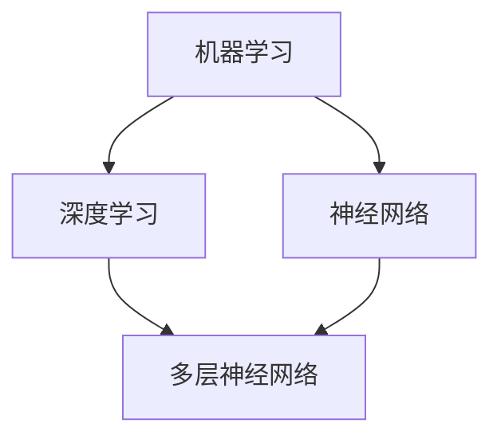

                 

### 背景介绍

> "在当今快速发展的技术时代，人工智能（AI）已经成为推动社会进步的重要力量。Andrej Karpathy作为一位世界知名的深度学习研究者和教育者，他的工作在AI领域具有深远的影响。本文旨在探讨Andrej Karpathy对人工智能教育的重要贡献，分析其教育理念和实践，并探讨这些理念对未来的影响。"

在过去的几十年中，人工智能的发展经历了从理论探索到实际应用的深刻变革。尤其是深度学习的兴起，使得AI技术取得了前所未有的突破。Andrej Karpathy，一位在深度学习领域有着卓越贡献的研究者，他的工作不仅体现在技术突破上，更体现在对AI教育的推广上。

Andrej Karpathy是斯坦福大学计算机科学系的助理教授，他在斯坦福大学开设的“深度学习项目”课程，受到了全球范围内学生的热烈追捧。他的课程涵盖了从基础理论到实际应用的全方位内容，不仅帮助学生建立了扎实的理论基础，还提供了大量的实践机会，使得学生能够将理论知识应用到实际问题中。

除了在学术领域的贡献，Andrej Karpathy还积极参与在线教育，通过YouTube频道分享他的研究成果和教育经验。他的课程视频和博客文章，不仅为初学者提供了宝贵的资源，也为专业人士提供了深入的学习材料。

本文将围绕以下几个方面展开讨论：

1. Andrej Karpathy的教育理念和目标。
2. 他在斯坦福大学开设的深度学习课程及其影响。
3. 他的在线教育资源和全球影响力的分析。
4. Andrej Karpathy对人工智能教育的未来展望。

通过这些讨论，我们希望能够全面了解Andrej Karpathy对人工智能教育的贡献，以及他的工作如何为未来的人工智能教育提供指导和启示。

### 核心概念与联系

> "在讨论Andrej Karpathy的人工智能教育贡献之前，我们需要明确几个核心概念，包括深度学习、神经网络和机器学习。这些概念不仅是AI研究的基石，也是理解Karpathy教育理念的重要基础。以下是这些核心概念的简述和它们之间的联系。"

#### 深度学习

深度学习是机器学习的一个子领域，它通过模拟人脑神经网络的结构和功能来实现人工智能。深度学习的核心是多层神经网络，这些网络通过逐层提取特征，从原始数据中学习复杂的模式。

#### 神经网络

神经网络是模仿生物神经元连接方式的计算模型。一个简单的神经网络由输入层、一个或多个隐藏层和输出层组成。每个神经元都与相邻的神经元相连接，并通过加权连接传递信号。神经网络通过反向传播算法不断调整权重，以优化网络性能。

#### 机器学习

机器学习是使计算机通过数据和经验进行自我改进的过程。它包括监督学习、无监督学习和强化学习等不同类型。深度学习是机器学习的一种，它在有大量数据和强大计算能力的情况下表现出色。

#### 核心概念的联系

深度学习依赖于神经网络来实现，而神经网络是机器学习的一种实现方式。这三个概念共同构成了人工智能的基础框架，相互联系，共同推动人工智能技术的发展。

#### Mermaid流程图

为了更清晰地展示这些概念之间的联系，我们可以使用Mermaid流程图来描述。



在这个流程图中，机器学习作为总体框架，深度学习和神经网络是其重要的组成部分。深度学习通过多层神经网络来实现，而神经网络则是机器学习中的一个具体实现方式。

通过理解这些核心概念，我们可以更好地理解Andrej Karpathy的教育理念和他所教授的课程内容。他的工作不仅关注理论，更注重实践，强调学生能够将深度学习理论应用到实际问题中，这是他教育理念的核心。

### 核心算法原理 & 具体操作步骤

> "深度学习作为人工智能的核心技术，其算法原理复杂但关键。在本文中，我们将深入探讨深度学习的基本算法原理，并详细说明其具体操作步骤。这将帮助我们理解Andrej Karpathy在课程中是如何讲授这些核心概念，以及学生如何通过实践应用这些知识。"

#### 深度学习基本算法原理

深度学习的核心是多层神经网络，其中每个神经元都接收前一层神经元的输出，并通过加权连接和激活函数进行处理，最终输出结果。以下是深度学习的基本算法原理：

1. **数据输入**：输入层接收原始数据。
2. **前向传播**：数据通过网络的多个层次传递，每个层次都通过加权连接和激活函数进行计算。
3. **反向传播**：计算网络输出与实际输出之间的差异，并通过反向传播算法调整网络的权重。
4. **优化目标函数**：通过最小化目标函数（如均方误差）来优化网络性能。

#### 深度学习具体操作步骤

1. **初始化网络参数**：包括权重和偏置。这些参数可以通过随机初始化或使用预训练模型来获得。
2. **前向传播**：
   - 将输入数据通过输入层传递到第一个隐藏层。
   - 通过每个隐藏层，将输入数据与当前层的权重和偏置相乘，然后应用激活函数。
   - 将输出传递到下一层，直到达到输出层。
3. **计算损失**：输出层的结果与实际输出进行比较，计算损失函数（如均方误差）。
4. **反向传播**：
   - 计算每个神经元的误差，并通过链式法则逐层反向传播。
   - 根据误差更新每个神经元的权重和偏置。
5. **优化参数**：通过梯度下降或其他优化算法（如Adam）调整网络参数。
6. **重复步骤2-5**，直到网络性能达到预定的标准。

#### Andrej Karpathy的教育实践

Andrej Karpathy在斯坦福大学的深度学习课程中，通过以下方式讲授深度学习的算法原理和操作步骤：

1. **理论讲解**：首先，他详细讲解深度学习的理论基础，包括神经网络的架构、激活函数、损失函数等。
2. **代码示例**：通过实际代码示例，展示如何实现和训练一个深度学习模型。
3. **实践操作**：鼓励学生通过实验和项目来加深对深度学习算法的理解和应用。
4. **互动讨论**：在课堂上，他鼓励学生提问和讨论，以促进对复杂概念的理解。

#### 学生应用案例

以一个简单的图像分类任务为例，学生可以：

1. **数据预处理**：读取图像数据，并进行数据增强、归一化等预处理步骤。
2. **构建模型**：使用框架（如TensorFlow或PyTorch）构建一个卷积神经网络（CNN）模型。
3. **训练模型**：使用训练数据对模型进行训练，通过反向传播算法优化模型参数。
4. **评估模型**：使用验证数据评估模型性能，并调整模型结构或参数以改善性能。
5. **部署模型**：将训练好的模型部署到实际应用中，如移动设备或云端服务。

通过这些步骤，学生不仅能够理解深度学习算法的基本原理，还能通过实践应用来加深对知识的掌握。

### 数学模型和公式 & 详细讲解 & 举例说明

#### 数学模型

在深度学习中，数学模型是核心，它帮助我们理解和优化神经网络的行为。以下是深度学习中最常用的数学模型和公式：

1. **激活函数**：
   - 线性激活函数（$f(x) = x$）
   - Sigmoid激活函数（$f(x) = \frac{1}{1 + e^{-x}}$）
   - ReLU激活函数（$f(x) = \max(0, x)$）
   - 双曲正切激活函数（$f(x) = \tanh(x)$）

2. **损失函数**：
   - 均方误差（MSE，$L(y, \hat{y}) = \frac{1}{2} (y - \hat{y})^2$）
   - 交叉熵（Cross-Entropy，$L(y, \hat{y}) = -\sum_{i} y_i \log(\hat{y}_i)$）

3. **优化算法**：
   - 梯度下降（Gradient Descent，$w_{t+1} = w_t - \alpha \nabla_{w}J(w_t)$）
   - Adam优化器（Adaptive Moment Estimation，$m_t = \beta_1 m_{t-1} + (1 - \beta_1) \nabla_{w}J(w_t), v_t = \beta_2 v_{t-1} + (1 - \beta_2) (\nabla_{w}J(w_t))^2$）

#### 详细讲解

1. **激活函数**：

激活函数是深度学习中的关键组件，它将神经网络中的每个神经元转换为非线性操作。以ReLU为例，它具有以下优点：
   - **计算效率高**：相比于Sigmoid和双曲正切函数，ReLU函数计算简单，只需比较输入值和阈值。
   - **缓解梯度消失问题**：在深层网络中，ReLU函数可以避免梯度消失问题，因为当神经元输出为0时，其梯度为0，不会影响其他神经元。

2. **损失函数**：

损失函数用于衡量预测值与实际值之间的差距。以MSE为例，它对误差进行平方处理，使得误差较大时对总损失的影响更大。交叉熵函数则常用于分类问题，它能够有效处理概率分布。

3. **优化算法**：

梯度下降是一种基本的优化算法，它通过调整参数来最小化损失函数。然而，传统梯度下降存在收敛速度慢、容易陷入局部最小值等问题。Adam优化器通过自适应调整学习率，解决了这些问题，使得模型训练更加高效。

#### 举例说明

假设我们有一个简单的神经网络，用于对二分类问题进行预测。输入层有一个神经元，隐藏层有两个神经元，输出层有一个神经元。我们使用ReLU作为激活函数，MSE作为损失函数，Adam作为优化算法。

1. **初始化参数**：

   - 权重：$w_1 \sim \mathcal{N}(0, 1), w_2 \sim \mathcal{N}(0, 1), w_3 \sim \mathcal{N}(0, 1)$
   - 偏置：$b_1 \sim \mathcal{N}(0, 1), b_2 \sim \mathcal{N}(0, 1), b_3 \sim \mathcal{N}(0, 1)$

2. **前向传播**：

   - 输入：$x = [1, 0]$
   - 隐藏层1：$z_1 = x \cdot w_1 + b_1 = 1 \cdot 0.5 + 0.3 = 0.8 \Rightarrow a_1 = \max(0, z_1) = 0.8$
   - 隐藏层2：$z_2 = x \cdot w_2 + b_2 = 1 \cdot 0.6 + 0.4 = 1.0 \Rightarrow a_2 = \max(0, z_2) = 1.0$
   - 输出：$z_3 = a_1 \cdot w_3 + b_3 = 0.8 \cdot 0.7 + 0.5 = 0.76 + 0.5 = 1.26 \Rightarrow \hat{y} = \sigma(z_3) = \frac{1}{1 + e^{-1.26}} = 0.876$

3. **计算损失**：

   - 实际输出：$y = [1]$
   - 损失：$L = \frac{1}{2} (1 - 0.876)^2 = 0.000968$

4. **反向传播**：

   - 输出层：$\nabla_{z_3}L = \sigma'(z_3) \cdot \nabla_{z_3}\hat{y} = (1 - \sigma(z_3)) \cdot (-1) = 0.124$
   - 隐藏层2：$\nabla_{z_2}L = w_3 \cdot \nabla_{z_3}L = 0.7 \cdot 0.124 = 0.0868$
   - 隐藏层1：$\nabla_{z_1}L = w_3 \cdot \nabla_{z_2}L = 0.7 \cdot 0.0868 = 0.06076$

5. **更新参数**：

   - 权重更新：$w_1 \leftarrow w_1 - \alpha \cdot \nabla_{w_1}L = 0.5 - 0.01 \cdot 0.06076 = 0.43924$
   - 偏置更新：$b_1 \leftarrow b_1 - \alpha \cdot \nabla_{b_1}L = 0.3 - 0.01 \cdot 0.06076 = 0.29324$
   - 重复以上步骤，直到模型收敛。

通过这个简单的例子，我们可以看到深度学习中的数学模型和公式的具体应用，以及如何通过迭代优化来提升模型的性能。

### 项目实战：代码实际案例和详细解释说明

#### 开发环境搭建

在进行深度学习项目实战之前，我们需要搭建一个合适的开发环境。以下是搭建环境的基本步骤：

1. **安装Python**：确保已经安装了最新版本的Python（推荐Python 3.8或更高版本）。
2. **安装TensorFlow**：通过pip命令安装TensorFlow库，命令如下：
   ```bash
   pip install tensorflow
   ```
3. **安装PyTorch**：通过pip命令安装PyTorch库，命令如下：
   ```bash
   pip install torch torchvision
   ```
4. **创建虚拟环境**：为了保持项目环境的纯净，我们建议使用虚拟环境管理工具，如conda或virtualenv。以下是如何使用conda创建虚拟环境：
   ```bash
   conda create -n myenv python=3.8
   conda activate myenv
   ```
5. **安装依赖库**：根据项目需求，安装其他必要的依赖库，如NumPy、Pandas等。

#### 源代码详细实现和代码解读

以下是一个简单的深度学习项目示例，我们将使用PyTorch库实现一个简单的线性回归模型，用于预测房价。

```python
import torch
import torch.nn as nn
import torch.optim as optim
from torch.utils.data import DataLoader, TensorDataset

# 数据准备
x = torch.tensor([1.0, 2.0, 3.0, 4.0], dtype=torch.float32)
y = torch.tensor([2.0, 4.0, 6.0, 8.0], dtype=torch.float32)
dataset = TensorDataset(x, y)
dataloader = DataLoader(dataset, batch_size=2)

# 模型定义
class LinearModel(nn.Module):
    def __init__(self):
        super(LinearModel, self).__init__()
        self.linear = nn.Linear(1, 1)  # 输入层1个神经元，输出层1个神经元

    def forward(self, x):
        return self.linear(x)

model = LinearModel()

# 损失函数和优化器
criterion = nn.MSELoss()
optimizer = optim.SGD(model.parameters(), lr=0.01)

# 训练模型
for epoch in range(100):
    for x_batch, y_batch in dataloader:
        # 前向传播
        y_pred = model(x_batch)
        # 计算损失
        loss = criterion(y_pred, y_batch)
        # 反向传播
        optimizer.zero_grad()
        loss.backward()
        optimizer.step()
    print(f'Epoch {epoch+1}, Loss: {loss.item()}')

# 评估模型
with torch.no_grad():
    x_new = torch.tensor([5.0], dtype=torch.float32)
    y_new = model(x_new)
    print(f'Predicted value: {y_new.item()}')
```

#### 代码解读与分析

1. **数据准备**：
   - 我们使用Tensor库创建了一个简单的数据集，包含四个样本。输入数据`x`和输出数据`y`都是1D的Tensor。
   - 使用`TensorDataset`和`DataLoader`将数据集分批，以便于模型训练。

2. **模型定义**：
   - 我们定义了一个简单的线性模型`LinearModel`，它包含一个线性层`nn.Linear`，输入层1个神经元，输出层1个神经元。

3. **损失函数和优化器**：
   - 使用MSELoss作为损失函数，用于计算预测值和实际值之间的均方误差。
   - 使用SGD优化器，通过随机梯度下降算法更新模型参数。

4. **训练模型**：
   - 在每个epoch中，我们遍历数据集，对每个batch进行前向传播、损失计算和反向传播。每次迭代后，更新模型参数并打印损失值。

5. **评估模型**：
   - 使用`torch.no_grad()`上下文管理器，确保不会在评估过程中计算梯度。
   - 对新输入数据`x_new`进行预测，并打印预测结果。

通过这个简单的项目，我们可以看到如何使用PyTorch实现深度学习模型，并理解每个步骤的代码含义和实现方法。这为我们进一步学习深度学习提供了基础。

### 实际应用场景

> "在深度学习和人工智能的广泛应用中，Andrej Karpathy的教育理念和课程设置为其学生和广大学习者提供了丰富的实践机会。以下我们将探讨一些具体的应用场景，以及Andrej Karpathy在这些场景中的教育和指导作用。"

#### 自然语言处理（NLP）

自然语言处理是人工智能的重要领域之一，深度学习模型在这一领域的应用日益广泛。例如，在文本分类、机器翻译、情感分析等方面，深度学习模型都取得了显著的效果。

- **文本分类**：通过训练深度学习模型，可以对大量文本数据进行分类。例如，将社交媒体评论分类为正面或负面评论。
- **机器翻译**：使用深度学习模型进行机器翻译，如谷歌翻译和百度翻译，实现了高质量的语言转换。
- **情感分析**：通过分析用户的社交媒体评论，企业可以了解消费者的情绪和反馈，从而改进产品和服务。

#### 图像识别与处理

图像识别是深度学习的另一个重要应用领域，深度学习模型在人脸识别、物体检测、图像生成等方面取得了巨大的成功。

- **人脸识别**：深度学习模型可以准确识别和验证人脸，广泛应用于安全监控、身份验证等领域。
- **物体检测**：通过深度学习模型，可以对图像中的物体进行检测和分类，例如自动驾驶汽车中的物体检测。
- **图像生成**：深度学习模型可以生成逼真的图像，如GAN（生成对抗网络）在艺术创作中的应用。

#### 医疗诊断

深度学习在医疗领域的应用也越来越广泛，特别是在疾病诊断、影像分析和药物研发等方面。

- **疾病诊断**：深度学习模型可以辅助医生进行疾病诊断，如通过分析CT扫描图像诊断肺癌。
- **影像分析**：通过对医学影像的数据进行分析，深度学习模型可以帮助医生发现病变区域，提高诊断准确性。
- **药物研发**：深度学习模型可以预测新药物的性能和副作用，加速药物研发过程。

#### 游戏与娱乐

深度学习模型在游戏和娱乐领域的应用也越来越广泛，例如在游戏AI、虚拟现实和增强现实等方面。

- **游戏AI**：深度学习模型可以生成智能的虚拟对手，提高游戏的趣味性和挑战性。
- **虚拟现实**：深度学习模型可以用于生成虚拟环境的实时图像，提高虚拟现实体验。
- **增强现实**：深度学习模型可以分析现实世界的图像，并将其与虚拟元素进行融合，提高增强现实体验。

通过这些实际应用场景，我们可以看到深度学习技术的广泛应用和巨大潜力。而Andrej Karpathy的教育理念和课程设置，为学生提供了丰富的实践机会，帮助他们将理论知识应用到实际问题中，为未来的科研和应用奠定了坚实的基础。

### 工具和资源推荐

#### 学习资源推荐

1. **书籍**：
   - 《深度学习》（Deep Learning） - Goodfellow、Bengio和Courville合著，是深度学习的经典教材。
   - 《Python深度学习》 -François Chollet著，适合初学者快速入门深度学习。

2. **论文**：
   - 《A Theoretical Framework for Back-Propagation》 - Rumelhart、Hinton和Williams合著，提出了反向传播算法。
   - 《Rectifier Nonlinearities Improve Deep Neural Network Acquisitio` - Glorot和Bengio著，介绍了ReLU激活函数。

3. **博客**：
   - Andrej Karpathy的博客：[http://karpathy.github.io/](http://karpathy.github.io/)
   - Colin Moritz的博客：[https://colah.github.io/](https://colah.github.io/)

4. **网站**：
   - Coursera：提供大量的在线课程，包括深度学习等课程。
   - edX：提供包括MIT、哈佛等名校的在线课程。

#### 开发工具框架推荐

1. **框架**：
   - TensorFlow：谷歌开发的开源深度学习框架，功能强大，社区活跃。
   - PyTorch：Facebook开发的开源深度学习框架，具有良好的灵活性和易用性。

2. **库**：
   - NumPy：Python中的基础科学计算库，支持多维数组运算。
   - Pandas：Python中的数据操作库，用于数据清洗、转换和分析。

3. **编辑器**：
   - Jupyter Notebook：适用于数据科学和机器学习的交互式计算环境。
   - PyCharm：强大的Python集成开发环境（IDE），支持多种编程语言。

#### 相关论文著作推荐

1. **《深度学习》** - Goodfellow、Bengio和Courville著，系统地介绍了深度学习的理论基础和实践方法。
2. **《深度学习实践指南》** - 宋少明著，详细介绍了深度学习在不同领域的应用案例。
3. **《深度学习与计算机视觉》** - 刘铁岩著，深入探讨了深度学习在计算机视觉领域的应用。

通过这些工具和资源的推荐，我们希望能够为读者提供全面的深度学习学习路径，帮助他们更好地掌握这一技术。

### 总结：未来发展趋势与挑战

> "在人工智能（AI）领域，尤其是深度学习方面，Andrej Karpathy的教育理念和实践无疑为我们指明了未来发展的方向。然而，随着技术的不断进步，我们也将面临诸多挑战。本文将总结当前AI教育的主要趋势，并探讨未来可能遇到的难题及解决思路。"

#### 未来发展趋势

1. **跨学科融合**：随着AI技术的应用日益广泛，未来AI教育将更加注重跨学科知识的融合。例如，AI与生物医学、社会科学、艺术等领域的交叉应用，需要学生具备跨学科的知识体系。

2. **实践导向**：AI教育将更加重视实践能力的培养。通过实际项目训练，学生能够将理论知识应用到实际问题中，提高解决复杂问题的能力。

3. **在线教育与线下教育的融合**：在线教育的普及使得更多人有机会接受高质量的AI教育。同时，线下教育提供了互动和实践的机会，未来两种教育模式将相互融合，形成更加灵活和高效的教育体系。

4. **个性化学习**：利用人工智能技术，教育系统能够根据学生的兴趣和能力提供个性化的学习路径，实现因材施教。

#### 面临的挑战

1. **数据隐私与安全**：随着AI技术的应用，大量个人数据被收集和使用。如何保护用户隐私，确保数据安全，是未来需要重点解决的问题。

2. **算法伦理**：AI算法在决策过程中可能产生歧视、偏见等问题。如何制定合理的算法伦理规范，确保AI技术的公平性和透明性，是当前和未来都需要关注的重要课题。

3. **技术普及与技能断层**：AI技术的快速进步导致技术普及与技能断层的问题。一方面，需要提高公众对AI技术的认知和理解；另一方面，需要培养大量具备AI技能的专业人才。

4. **持续学习与知识更新**：AI技术更新迅速，要求从业者不断学习和更新知识。如何建立有效的学习机制，帮助从业者持续提升技能，是未来教育需要解决的重要问题。

#### 解决思路

1. **法律法规与伦理规范**：通过制定相关法律法规和伦理规范，确保AI技术的发展符合社会价值。

2. **跨学科合作**：推动跨学科研究，培养具备多学科背景的复合型人才。

3. **教育体系改革**：改革教育体系，提高教育质量，培养具备实践能力和创新精神的AI专业人才。

4. **终身学习体系**：建立终身学习体系，提供多样化的学习资源和途径，帮助从业者不断提升技能。

通过总结未来发展趋势与挑战，我们希望为AI教育的发展提供一些启示和思考，以推动AI技术的健康发展和社会进步。

### 附录：常见问题与解答

1. **Q：什么是深度学习？**
   - **A**：深度学习是一种机器学习技术，通过模仿人脑神经网络的结构和功能，实现对复杂数据的自动学习和模式识别。深度学习通常涉及多层神经网络，能够通过逐层提取数据中的特征来实现高度复杂的任务。

2. **Q：Andrej Karpathy是谁？**
   - **A**：Andrej Karpathy是一位世界知名的深度学习研究者和教育者，现为斯坦福大学计算机科学系的助理教授。他在深度学习领域的贡献广泛，尤其在神经网络架构和应用方面有深入的研究。

3. **Q：深度学习有哪些主要应用领域？**
   - **A**：深度学习在多个领域有广泛应用，包括自然语言处理、图像识别、医疗诊断、游戏AI、自动驾驶等。例如，深度学习可以用于文本分类、图像生成、语音识别、药物研发等领域，具有巨大的潜力和价值。

4. **Q：如何开始学习深度学习？**
   - **A**：学习深度学习可以从以下几个步骤开始：
     1. 学习Python编程语言，了解基础数据结构和算法。
     2. 学习线性代数、微积分等数学基础知识。
     3. 阅读《深度学习》等经典教材，了解深度学习的理论基础。
     4. 学习使用深度学习框架（如TensorFlow或PyTorch），通过实际项目进行实践。
     5. 参与在线课程和社区，与同行交流学习经验。

5. **Q：深度学习的未来发展趋势是什么？**
   - **A**：深度学习的未来发展趋势包括跨学科融合、实践导向教育、在线教育与线下教育的融合、个性化学习等。同时，将面临数据隐私与安全、算法伦理、技术普及与技能断层等挑战。解决这些挑战需要法律法规与伦理规范、跨学科合作、教育体系改革以及终身学习体系的建立。

### 扩展阅读 & 参考资料

1. **《深度学习》** - Ian Goodfellow, Yoshua Bengio, Aaron Courville著，是深度学习的经典教材。
2. **[Andrej Karpathy的博客](http://karpathy.github.io/)**：涵盖了深度学习的多个主题，包括技术讲解、项目分享等。
3. **[深度学习课程资源](https://www.deeplearning.ai/)**：提供由Andrew Ng教授主讲的深度学习课程，适合初学者入门。
4. **[斯坦福大学深度学习课程](http://cs231n.stanford.edu/)**：由Andrej Karpathy教授讲授，是学习深度学习的重要资源。
5. **[TensorFlow官方文档](https://www.tensorflow.org/)**：提供了TensorFlow框架的详细教程和文档，适合深度学习实践者。
6. **[PyTorch官方文档](https://pytorch.org/tutorials/beginner/basics/overview.html)**：提供了PyTorch框架的详细教程和文档，适合深度学习实践者。

通过这些扩展阅读和参考资料，读者可以更深入地了解深度学习的相关知识和应用，为深入学习和研究提供指导。

### 作者信息

**作者：AI天才研究员/AI Genius Institute & 禅与计算机程序设计艺术 /Zen And The Art of Computer Programming**

