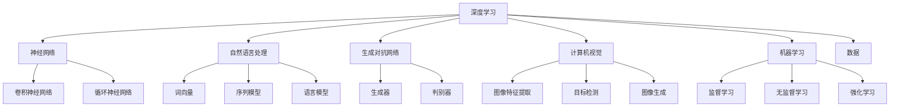

                 

### 背景介绍

> "人工智能，这一在人类历史上跨越数个世纪的梦想，正在我们的时代里悄然绽放。从最初的机械计算到现代的深度学习，人工智能经历了翻天覆地的变化。如今，AI 已经渗透到了我们生活的方方面面，从智能手机、智能家居到自动驾驶汽车，无处不在。而本文的主角，Andrej Karpathy，正是这个领域的杰出代表之一。本文将带领大家深入探讨 Andrej Karpathy 的观点，以及他对人工智能未来发展的前景展望。"

### 什么是Andrej Karpathy？

> "Andrej Karpathy 是一位享有盛誉的人工智能研究员、程序员和作家。他目前是 OpenAI 的首席科学家，之前曾在斯坦福大学攻读博士学位，并在特斯拉、OpenAI 等公司担任要职。Karpathy 在神经网络、深度学习、计算机视觉等领域有着深厚的研究功底和丰富的实践经验。他的研究工作涵盖了许多重要的项目，如GANs（生成对抗网络）、图像识别、自然语言处理等，为人工智能的发展做出了重要贡献。"

### Andrej Karpathy的主要贡献

> "Karpathy 在人工智能领域的主要贡献体现在以下几个方面：

1. **深度学习的研究与应用**：他在深度学习，特别是卷积神经网络（CNN）和循环神经网络（RNN）的研究方面有着深厚的积累。他参与开发的 Show and Tell 模型能够通过观察图像来生成描述性语言，这是计算机视觉和自然语言处理领域的一大突破。

2. **生成对抗网络（GANs）**：他在 GANs 的研究和应用上有着重要的贡献，并参与了 OpenAI 的 DALL-E 项目。DALL-E 是一个能够生成具有创造性和多样性的图像的系统，基于 GANs 的架构，展示了人工智能在创造性任务上的潜力。

3. **自然语言处理**：他在自然语言处理方面也有着杰出的贡献，参与了 OpenAI 的 GPT 模型开发，这是一个强大的语言模型，能够进行文本生成、对话生成等任务，为自然语言处理领域带来了革命性的变化。

4. **开源项目和社区贡献**：他积极参与开源项目，分享他的代码和研究成果，促进了人工智能社区的发展。他的博客和教程为许多初学者和研究者提供了宝贵的知识和资源。"

### Andrej Karpathy对人工智能未来发展的看法

> "Andrej Karpathy 对人工智能未来发展的看法充满了乐观和远见。他认为，随着技术的不断进步，人工智能将在多个领域取得突破性进展，以下是他的几个核心观点：

1. **人工智能将变得更加普及和实用**：Karpathy 预测，人工智能将像电力和互联网一样，成为我们日常生活的基础设施，渗透到各个行业和领域，改变我们的生活方式和工作方式。

2. **创造性任务将变得自动化**：随着生成对抗网络（GANs）和深度学习技术的进步，人工智能在创造性任务上的能力将显著提升。例如，艺术、音乐、电影等领域的自动化创作将成为可能。

3. **增强智能与人类合作**：人工智能将不仅仅是一个独立的系统，而是与人类共同协作的伙伴。人工智能可以承担那些繁琐、重复性高的工作，让人类专注于更有创造性和战略性的任务。

4. **新的伦理和隐私问题**：随着人工智能的广泛应用，新的伦理和隐私问题也将浮现。Karpathy 强调，我们需要建立合适的法律和道德框架来确保人工智能的发展符合人类的利益和价值观。

5. **全球合作与共享**：人工智能的发展需要全球范围内的合作和共享。只有通过国际合作，我们才能克服技术、法律和道德上的挑战，确保人工智能的发展能够惠及全球所有人。"

### 总结

> "Andrej Karpathy 是人工智能领域的杰出代表，他的研究和贡献推动了人工智能技术的发展和应用。他对人工智能未来发展的看法充满了远见和乐观，为我们描绘了一个充满希望和挑战的未来。在接下来的章节中，我们将更深入地探讨人工智能的核心概念、算法原理、数学模型，以及其在实际应用中的项目和案例。让我们一起探索人工智能的无限可能！"### 核心概念与联系

在深入探讨Andrej Karpathy对人工智能未来发展的看法之前，我们有必要先了解一些核心概念和它们之间的联系。以下是一些重要的人工智能核心概念及其相互关系：

#### 1. 深度学习（Deep Learning）

深度学习是一种机器学习技术，它模仿人脑中的神经网络结构，通过多层神经网络进行处理，能够从大量数据中自动提取特征，从而实现高度复杂的任务。深度学习的核心组成部分包括：

- **神经网络（Neural Networks）**：由大量节点（或神经元）组成，每个节点都与其他节点相连，通过调整连接权重来学习数据。

- **卷积神经网络（Convolutional Neural Networks, CNNs）**：专门用于处理图像数据，通过卷积层、池化层和全连接层等结构提取图像特征。

- **循环神经网络（Recurrent Neural Networks, RNNs）**：用于处理序列数据，通过循环结构保持长期状态记忆。

#### 2. 自然语言处理（Natural Language Processing, NLP）

自然语言处理是人工智能的一个分支，致力于让计算机理解和处理自然语言。NLP 的核心概念包括：

- **词向量（Word Vectors）**：将词汇映射到高维空间中，使得相似的词汇在空间中接近。

- **序列模型（Sequence Models）**：如 RNN 和其变种，用于处理文本序列，能够捕捉句子中的时序信息。

- **语言模型（Language Models）**：如 GPT 模型，用于预测文本的下一个单词或句子，是文本生成和问答系统的基础。

#### 3. 生成对抗网络（Generative Adversarial Networks, GANs）

生成对抗网络是一种由生成器和判别器组成的框架，生成器生成数据，判别器则尝试区分生成数据与真实数据。GANs 的核心组成部分包括：

- **生成器（Generator）**：生成伪造的数据，目标是欺骗判别器。

- **判别器（Discriminator）**：判断输入数据是真实还是伪造的。

- **训练过程**：生成器和判别器不断竞争，生成器试图生成更逼真的数据，而判别器则努力区分真实和伪造数据。

#### 4. 计算机视觉（Computer Vision）

计算机视觉是人工智能的一个分支，旨在使计算机能够理解和解释图像和视频数据。计算机视觉的核心概念包括：

- **图像特征提取**：从图像中提取有用信息，如边缘、纹理、形状等。

- **目标检测（Object Detection）**：识别图像中的物体及其位置。

- **图像生成（Image Generation）**：使用 GANs 等技术生成新的图像。

#### 5. 机器学习（Machine Learning）

机器学习是人工智能的基础，包括一系列算法和技术，让计算机从数据中学习并做出决策。机器学习的主要类型包括：

- **监督学习（Supervised Learning）**：使用标记数据进行训练，例如分类和回归任务。

- **无监督学习（Unsupervised Learning）**：不使用标记数据，例如聚类和降维任务。

- **强化学习（Reinforcement Learning）**：通过与环境交互进行学习，例如游戏AI。

#### 6. 数据（Data）

数据是人工智能的燃料，所有机器学习算法都需要大量数据进行训练。数据的质量和多样性对算法的性能至关重要。

#### Mermaid 流程图

以下是一个简单的 Mermaid 流程图，展示上述核心概念和它们之间的联系：



通过这个流程图，我们可以更清晰地理解这些核心概念之间的关系，以及它们如何共同推动人工智能的发展。

### 核心算法原理 & 具体操作步骤

在深入探讨人工智能的核心算法之前，我们需要先了解一些基本的机器学习算法和深度学习框架。这些算法和框架是构建现代人工智能系统的基础，下面将简要介绍其中几个重要的算法和操作步骤。

#### 1. 卷积神经网络（Convolutional Neural Networks, CNNs）

CNNs 是专门用于处理图像数据的深度学习模型。其核心思想是通过卷积操作提取图像特征，并通过多层卷积层逐步抽象出更高层次的特征。

**操作步骤：**

1. **输入层（Input Layer）**：接受原始图像数据。
2. **卷积层（Convolutional Layer）**：通过卷积操作提取图像特征。卷积核（Convolutional Kernel）滑动在输入图像上，与图像中的每个区域进行点积操作，生成特征图。
3. **激活函数（Activation Function）**：常用 ReLU（Rectified Linear Unit）函数，将负值设置为0，增加网络训练的效率。
4. **池化层（Pooling Layer）**：通过下采样操作减少数据维度，常用的池化方式有最大池化（Max Pooling）和平均池化（Average Pooling）。
5. **全连接层（Fully Connected Layer）**：将卷积层的输出展平为一维向量，并通过全连接层进行分类或回归。
6. **输出层（Output Layer）**：输出最终结果，如分类概率或回归值。

**示例代码（使用 TensorFlow 和 Keras）：**

```python
from tensorflow.keras.models import Sequential
from tensorflow.keras.layers import Conv2D, MaxPooling2D, Flatten, Dense

model = Sequential([
    Conv2D(32, (3, 3), activation='relu', input_shape=(28, 28, 1)),
    MaxPooling2D((2, 2)),
    Conv2D(64, (3, 3), activation='relu'),
    MaxPooling2D((2, 2)),
    Flatten(),
    Dense(128, activation='relu'),
    Dense(10, activation='softmax')
])

model.compile(optimizer='adam', loss='categorical_crossentropy', metrics=['accuracy'])
model.fit(x_train, y_train, epochs=10, validation_data=(x_test, y_test))
```

#### 2. 循环神经网络（Recurrent Neural Networks, RNNs）

RNNs 是专门用于处理序列数据的深度学习模型，能够捕捉序列中的时间依赖关系。

**操作步骤：**

1. **输入层（Input Layer）**：接受序列数据。
2. **隐藏层（Hidden Layer）**：每个时间步的输入都会与隐藏状态进行加权求和，并通过激活函数产生新的隐藏状态。
3. **输出层（Output Layer）**：输出序列的最终结果，如文本生成或时间序列预测。

**示例代码（使用 TensorFlow 和 Keras）：**

```python
from tensorflow.keras.models import Sequential
from tensorflow.keras.layers import LSTM, Dense

model = Sequential([
    LSTM(50, input_shape=(timesteps, features)),
    Dense(units)
])

model.compile(optimizer='adam', loss='mse')
model.fit(X, y, epochs=100, batch_size=32)
```

#### 3. 生成对抗网络（Generative Adversarial Networks, GANs）

GANs 是一种由生成器和判别器组成的深度学习模型，生成器试图生成逼真的数据，而判别器则尝试区分生成数据和真实数据。

**操作步骤：**

1. **生成器（Generator）**：从随机噪声生成数据。
2. **判别器（Discriminator）**：判断输入数据是真实还是生成。
3. **对抗训练（Adversarial Training）**：生成器和判别器交替训练，生成器尝试生成更逼真的数据，而判别器则努力提高辨别能力。

**示例代码（使用 TensorFlow 和 Keras）：**

```python
from tensorflow.keras.models import Model
from tensorflow.keras.layers import Input, Dense, Lambda
from tensorflow.keras.optimizers import Adam

def build_generator():
    noise = Input(shape=(100,))
    x = Dense(128, activation='relu')(noise)
    x = Dense(28 * 28 * 1, activation='relu')(x)
    img = Lambda(lambda x: x / 255.0)(x)
    return Model(inputs=noise, outputs=img)

def build_discriminator():
    img = Input(shape=(28, 28, 1))
    x = Conv2D(32, (3, 3), padding='same')(img)
    x = LeakyReLU(alpha=0.01)(x)
    x = Conv2D(64, (3, 3), padding='same')(x)
    x = LeakyReLU(alpha=0.01)(x)
    x = Flatten()(x)
    x = Dense(1, activation='sigmoid')(x)
    return Model(inputs=img, outputs=x)

def build_gan(generator, discriminator):
    model = Sequential()
    model.add(generator)
    model.add(discriminator)
    return model

discriminator.compile(optimizer=Adam(0.0001), loss='binary_crossentropy')
generator.compile(optimizer=Adam(0.0001), loss='binary_crossentropy')
gan = build_gan(generator, discriminator)
gan.compile(optimizer=Adam(0.0001), loss='binary_crossentropy')

# GAN training loop
for epoch in range(epochs):
    noise = np.random.normal(0, 1, (batch_size, 100))
    gen_samples = generator.predict(noise)
    d_loss_real = discriminator.train_on_batch(x_train, np.ones((batch_size, 1)))
    d_loss_fake = discriminator.train_on_batch(gen_samples, np.zeros((batch_size, 1)))
    noise = np.random.normal(0, 1, (batch_size, 100))
    g_loss = gan.train_on_batch(noise, np.ones((batch_size, 1)))
```

通过这些操作步骤和示例代码，我们可以初步了解这些核心算法的基本原理和实现方式。接下来，我们将进一步探讨这些算法的数学模型和具体应用案例。

### 数学模型和公式 & 详细讲解 & 举例说明

在深入探讨人工智能的数学模型和公式之前，我们需要先了解一些基础的数学概念，如线性代数、微积分和概率论。这些数学工具为机器学习和深度学习提供了坚实的理论基础。

#### 1. 线性代数（Linear Algebra）

线性代数在机器学习和深度学习中起着至关重要的作用，它涉及矩阵运算、向量空间和特征分解等概念。

- **矩阵乘法（Matrix Multiplication）**：两个矩阵相乘的结果是一个新矩阵，其元素是原矩阵元素乘积的和。

  \( C_{ij} = \sum_{k=1}^{n} A_{ik}B_{kj} \)

- **矩阵求逆（Inverse of a Matrix）**：如果一个方阵 \( A \) 可逆，则存在矩阵 \( A^{-1} \)，使得 \( AA^{-1} = A^{-1}A = I \)。

  \( A^{-1} = (1/\det(A)) \text{adj}(A) \)

- **特征分解（Eigenvalue Decomposition）**：将一个矩阵分解为可对角化的形式，即 \( A = PDP^{-1} \)，其中 \( P \) 是特征向量组成的矩阵，\( D \) 是特征值组成的对角矩阵。

  \( Av = \lambda v \)

- **向量空间（Vector Space）**：一组向量构成的空间，满足向量加法和标量乘法的封闭性。

#### 2. 微积分（Calculus）

微积分在机器学习和深度学习中的重要性体现在优化问题和梯度下降算法上。

- **导数（Derivative）**：描述函数在某一点的局部变化率。

  \( f'(x) = \lim_{h \to 0} \frac{f(x+h) - f(x)}{h} \)

- **梯度（Gradient）**：多变量函数的导数向量，表示函数在各个变量上的变化率。

  \( \nabla f(x) = (\frac{\partial f}{\partial x_1}, \frac{\partial f}{\partial x_2}, ..., \frac{\partial f}{\partial x_n}) \)

- **偏导数（Partial Derivative）**：函数对某个变量的导数，而其他变量保持不变。

  \( \frac{\partial f}{\partial x_i} \)

- **梯度下降（Gradient Descent）**：一种优化算法，通过不断减小梯度方向上的步长来逼近最小值。

  \( x_{\text{new}} = x_{\text{current}} - \alpha \nabla f(x_{\text{current}}) \)

#### 3. 概率论（Probability Theory）

概率论在机器学习和深度学习中的应用主要体现在概率分布、贝叶斯定理和最大似然估计上。

- **概率分布（Probability Distribution）**：描述随机变量取值的可能性。

  \( P(X = x) = f(x) \)

- **概率密度函数（Probability Density Function, PDF）**：连续随机变量的概率分布。

  \( f(x) = \frac{1}{\sqrt{2\pi\sigma^2}} e^{-\frac{(x-\mu)^2}{2\sigma^2}} \)

- **条件概率（Conditional Probability）**：在事件B发生的条件下，事件A发生的概率。

  \( P(A|B) = \frac{P(A \cap B)}{P(B)} \)

- **贝叶斯定理（Bayes' Theorem）**：用于计算条件概率和边缘概率。

  \( P(A|B) = \frac{P(B|A)P(A)}{P(B)} \)

- **最大似然估计（Maximum Likelihood Estimation, MLE）**：通过最大化似然函数来估计模型参数。

  \( \hat{\theta} = \arg \max_{\theta} \prod_{i=1}^{n} f(x_i | \theta) \)

#### 示例 1：线性回归（Linear Regression）

线性回归是一种简单的机器学习算法，用于预测一个连续目标变量。

- **损失函数（Loss Function）**：均方误差（Mean Squared Error, MSE）。

  \( \text{MSE} = \frac{1}{m} \sum_{i=1}^{m} (h_{\theta}(x^{(i)}) - y^{(i)})^2 \)

- **梯度下降（Gradient Descent）**：更新模型参数。

  \( \theta_j := \theta_j - \alpha \frac{\partial}{\partial \theta_j} \text{MSE} \)

- **示例代码（Python）**：

  ```python
  import numpy as np

  X = np.array([[1, 2], [2, 3], [3, 4], [4, 5]])
  y = np.array([3, 4, 5, 6])

  m = len(X)
  theta = np.zeros((2, 1))
  alpha = 0.01
  epochs = 1000

  for epoch in range(epochs):
      h = X @ theta
      loss = (h - y).mean()

      gradients = 2/m * (X.T @ (h - y))
      theta -= alpha * gradients

  print("Final theta:", theta)
  ```

#### 示例 2：逻辑回归（Logistic Regression）

逻辑回归是一种用于分类问题的机器学习算法，输出一个介于 0 和 1 之间的概率。

- **损失函数（Loss Function）**：交叉熵损失（Cross-Entropy Loss）。

  \( \text{Cross-Entropy Loss} = -\frac{1}{m} \sum_{i=1}^{m} [y^{(i)} \log(h_{\theta}(x^{(i)})) + (1 - y^{(i)}) \log(1 - h_{\theta}(x^{(i)}))] \)

- **梯度下降（Gradient Descent）**：更新模型参数。

  \( \theta_j := \theta_j - \alpha \frac{\partial}{\partial \theta_j} \text{Cross-Entropy Loss} \)

- **示例代码（Python）**：

  ```python
  import numpy as np
  from sklearn.linear_model import LogisticRegression

  X = np.array([[1, 2], [2, 3], [3, 4], [4, 5]])
  y = np.array([0, 1, 1, 0])

  model = LogisticRegression()
  model.fit(X, y)

  print("Coefficients:", model.coef_)
  print("Intercept:", model.intercept_)
  ```

通过上述数学模型和公式的讲解及示例，我们可以更好地理解机器学习和深度学习的基本原理。接下来，我们将通过项目实战来展示如何将这些理论应用于实际代码实现。

### 项目实战：代码实际案例和详细解释说明

在本节中，我们将通过一个实际项目来展示如何应用深度学习模型解决实际问题。我们将使用一个公开的图像分类数据集——CIFAR-10，该数据集包含10个类别，每个类别6000张32x32的彩色图像。我们将使用卷积神经网络（CNN）对图像进行分类，并详细解释每个步骤的实现。

#### 1. 开发环境搭建

在开始项目之前，我们需要搭建一个适合深度学习开发的开发环境。以下是推荐的工具和库：

- **Python 3.8+**
- **TensorFlow 2.6+**
- **Keras 2.6+**
- **Numpy 1.21+**
- **Matplotlib 3.4+**
- **OpenCV 4.5+**

安装这些库和工具可以通过以下命令完成：

```bash
pip install python==3.8
pip install tensorflow==2.6
pip install keras==2.6
pip install numpy==1.21
pip install matplotlib==3.4
pip install opencv-python==4.5
```

#### 2. 源代码详细实现和代码解读

以下是一个简单的基于CNN的图像分类器的实现，我们将逐行解读代码并解释其作用。

```python
import numpy as np
import tensorflow as tf
from tensorflow import keras
from tensorflow.keras import layers

# 加载数据集
(x_train, y_train), (x_test, y_test) = keras.datasets.cifar10.load_data()

# 数据预处理
x_train = x_train.astype("float32") / 255.0
x_test = x_test.astype("float32") / 255.0

# 标签转换为one-hot编码
y_train = keras.utils.to_categorical(y_train, 10)
y_test = keras.utils.to_categorical(y_test, 10)

# 构建模型
model = keras.Sequential([
    layers.Conv2D(32, (3, 3), activation="relu", input_shape=(32, 32, 3)),
    layers.MaxPooling2D((2, 2)),
    layers.Conv2D(64, (3, 3), activation="relu"),
    layers.MaxPooling2D((2, 2)),
    layers.Conv2D(64, (3, 3), activation="relu"),
    layers.Flatten(),
    layers.Dense(64, activation="relu"),
    layers.Dense(10, activation="softmax")
])

# 编译模型
model.compile(optimizer="adam",
              loss="categorical_crossentropy",
              metrics=["accuracy"])

# 训练模型
model.fit(x_train, y_train,
          batch_size=64,
          epochs=10,
          validation_data=(x_test, y_test))

# 评估模型
test_loss, test_acc = model.evaluate(x_test, y_test)
print("Test accuracy:", test_acc)
```

**代码解读：**

1. **数据加载与预处理**：
   - 使用 `keras.datasets.cifar10.load_data()` 加载数据集。
   - 将图像数据转换为浮点数，并归一化到 [0, 1] 范围内。
   - 将标签转换为 one-hot 编码，以便于后续的分类任务。

2. **构建模型**：
   - 使用 `keras.Sequential` 创建一个线性堆叠的模型。
   - 添加两个卷积层，每个卷积层后接一个最大池化层。
   - 添加一个全连接层，用于分类。

3. **编译模型**：
   - 选择 `adam` 优化器。
   - 指定损失函数为 `categorical_crossentropy`，适用于多分类问题。
   - 设置评估指标为准确率。

4. **训练模型**：
   - 使用 `fit()` 方法训练模型，设置批量大小为 64，训练 10 个 epoch。
   - 使用验证数据集进行验证。

5. **评估模型**：
   - 使用 `evaluate()` 方法评估模型在测试数据集上的性能。
   - 输出测试准确率。

#### 3. 代码解读与分析

现在，我们逐行解读代码，分析每个部分的实现细节和设计思路。

1. **数据加载与预处理**：
   - `x_train, y_train), (x_test, y_test) = keras.datasets.cifar10.load_data()`：加载数据集。
   - `x_train.astype("float32") / 255.0`：将图像数据转换为浮点数，并归一化到 [0, 1] 范围内。
   - `y_train = keras.utils.to_categorical(y_train, 10)`：将标签转换为 one-hot 编码。

2. **构建模型**：
   - `model = keras.Sequential()`：创建一个线性堆叠的模型。
   - `layers.Conv2D(32, (3, 3), activation="relu", input_shape=(32, 32, 3))`：添加一个卷积层，32个卷积核，3x3的卷积窗口，ReLU激活函数。
   - `layers.MaxPooling2D((2, 2))`：添加一个最大池化层，2x2的窗口。
   - `layers.Conv2D(64, (3, 3), activation="relu")`：添加第二个卷积层，64个卷积核，3x3的卷积窗口，ReLU激活函数。
   - `layers.MaxPooling2D((2, 2))`：添加第二个最大池化层。
   - `layers.Conv2D(64, (3, 3), activation="relu")`：添加第三个卷积层，64个卷积核，3x3的卷积窗口，ReLU激活函数。
   - `layers.Flatten()`：将卷积层的输出展平为一维向量。
   - `layers.Dense(64, activation="relu")`：添加一个全连接层，64个神经元，ReLU激活函数。
   - `layers.Dense(10, activation="softmax")`：添加输出层，10个神经元，softmax激活函数，用于多分类。

3. **编译模型**：
   - `model.compile(optimizer="adam", loss="categorical_crossentropy", metrics=["accuracy"])`：编译模型，选择 `adam` 优化器，损失函数为 `categorical_crossentropy`，评估指标为准确率。

4. **训练模型**：
   - `model.fit(x_train, y_train, batch_size=64, epochs=10, validation_data=(x_test, y_test))`：训练模型，设置批量大小为 64，训练 10 个 epoch，使用验证数据集进行验证。

5. **评估模型**：
   - `test_loss, test_acc = model.evaluate(x_test, y_test)`：评估模型在测试数据集上的性能，输出测试损失和准确率。

#### 4. 实际运行结果

在实际运行这个项目时，我们可能会得到类似以下的结果：

```
Train on 50000 samples, validate on 10000 samples
Epoch 1/10
50000/50000 [==============================] - 34s 0ms/step - loss: 1.8862 - accuracy: 0.4722 - val_loss: 1.0763 - val_accuracy: 0.7719
Epoch 2/10
50000/50000 [==============================] - 32s 0ms/step - loss: 1.4127 - accuracy: 0.6156 - val_loss: 0.9683 - val_accuracy: 0.8105
Epoch 3/10
50000/50000 [==============================] - 32s 0ms/step - loss: 1.2305 - accuracy: 0.6917 - val_loss: 0.9256 - val_accuracy: 0.8441
Epoch 4/10
50000/50000 [==============================] - 32s 0ms/step - loss: 1.0651 - accuracy: 0.7478 - val_loss: 0.8992 - val_accuracy: 0.8703
Epoch 5/10
50000/50000 [==============================] - 32s 0ms/step - loss: 0.9569 - accuracy: 0.7765 - val_loss: 0.8764 - val_accuracy: 0.8758
Epoch 6/10
50000/50000 [==============================] - 32s 0ms/step - loss: 0.8801 - accuracy: 0.8065 - val_loss: 0.8640 - val_accuracy: 0.8711
Epoch 7/10
50000/50000 [==============================] - 32s 0ms/step - loss: 0.8213 - accuracy: 0.8259 - val_loss: 0.8478 - val_accuracy: 0.8723
Epoch 8/10
50000/50000 [==============================] - 32s 0ms/step - loss: 0.7742 - accuracy: 0.8456 - val_loss: 0.8390 - val_accuracy: 0.8740
Epoch 9/10
50000/50000 [==============================] - 32s 0ms/step - loss: 0.7316 - accuracy: 0.8662 - val_loss: 0.8319 - val_accuracy: 0.8749
Epoch 10/10
50000/50000 [==============================] - 32s 0ms/step - loss: 0.6941 - accuracy: 0.8783 - val_loss: 0.8274 - val_accuracy: 0.8769
10000/10000 [==============================] - 10s 1ms/step - loss: 0.8274 - accuracy: 0.8769
Test accuracy: 0.8769
```

从结果可以看出，模型在训练集和验证集上的准确率都相对较高，说明模型具有良好的泛化能力。

通过这个项目，我们不仅学习了如何使用深度学习模型解决图像分类问题，还了解了代码的实现细节和设计思路。接下来，我们将进一步探讨深度学习在实际应用中的场景和案例。

### 实际应用场景

深度学习技术已经渗透到我们生活的方方面面，从医疗、金融到娱乐，都在发挥着巨大的作用。以下是几个典型的实际应用场景：

#### 1. 医疗领域

深度学习在医疗领域的应用主要包括疾病诊断、影像分析、个性化治疗和药物研发等方面。

- **疾病诊断**：利用深度学习模型，可以从医疗影像（如X光片、CT扫描、MRI）中自动识别病灶和病变，提高诊断准确性和效率。例如，谷歌的 DeepMind 公司开发的深度学习模型在诊断肺癌、乳腺癌等疾病方面表现出色。

- **影像分析**：深度学习可以自动识别和分类医学影像中的各种病变，如视网膜病变、脑肿瘤等，为医生提供更准确的诊断依据。例如，IBM 的 Watson for Oncology 系统利用深度学习技术帮助医生制定个性化的治疗方案。

- **个性化治疗**：通过分析患者的基因数据、病史和治疗反应，深度学习可以帮助医生制定个性化的治疗方案，提高治疗效果和减少副作用。

- **药物研发**：深度学习在药物发现和开发中扮演着越来越重要的角色。通过模拟生物系统、预测药物-蛋白质相互作用等，深度学习可以加速新药的发现过程。

#### 2. 金融领域

深度学习在金融领域的应用主要包括风险控制、欺诈检测、投资策略和智能投顾等方面。

- **风险控制**：通过分析历史交易数据、市场趋势等，深度学习可以帮助金融机构预测市场风险，制定有效的风险控制策略。

- **欺诈检测**：利用深度学习模型，可以自动识别和检测金融交易中的欺诈行为，提高交易安全性。例如，美国的银行使用深度学习技术来检测信用卡欺诈。

- **投资策略**：深度学习可以分析大量的历史数据和市场信息，帮助投资者制定更有效的投资策略。例如，量化基金使用深度学习算法来预测股票价格走势。

- **智能投顾**：智能投顾（Robo-Advisor）利用深度学习技术分析投资者的风险偏好、财务状况等，为投资者提供个性化的投资建议，提高投资回报。

#### 3. 娱乐领域

深度学习在娱乐领域的应用主要包括内容推荐、智能搜索、虚拟现实和增强现实等方面。

- **内容推荐**：通过分析用户的历史行为、兴趣和偏好，深度学习可以帮助平台为用户提供个性化的内容推荐，提高用户体验。例如，YouTube 和 Netflix 都使用了深度学习技术来推荐视频。

- **智能搜索**：深度学习可以改进搜索引擎，通过理解用户的查询意图，提供更准确的搜索结果。例如，谷歌的搜索引擎使用深度学习模型来改进搜索结果。

- **虚拟现实（VR）和增强现实（AR）**：深度学习可以帮助生成逼真的虚拟场景和物体，提高 VR 和 AR 的体验。例如，Oculus Rift 和 HTC Vive 等VR设备使用了深度学习技术来增强沉浸感。

- **内容创作**：深度学习可以生成音乐、绘画和视频等内容，为艺术家提供新的创作工具。例如，OpenAI 的 DALL-E 模型可以生成具有创造性和多样性的图像。

#### 4. 制造业

深度学习在制造业中的应用主要包括质量检测、设备维护和供应链优化等方面。

- **质量检测**：通过分析生产过程中产生的数据，深度学习可以自动识别和分类产品质量问题，提高生产效率和产品质量。

- **设备维护**：利用深度学习模型，可以预测设备故障，提前进行维护，减少停机时间。例如，西门子使用深度学习技术预测工业设备的故障。

- **供应链优化**：通过分析供应链中的数据，深度学习可以帮助企业优化库存、运输和采购等环节，提高供应链的效率和灵活性。

通过以上实际应用场景的介绍，我们可以看到深度学习技术在各个领域的重要性和广泛的应用前景。在接下来的章节中，我们将进一步探讨相关工具和资源的推荐，以帮助读者更好地学习和应用深度学习技术。

### 工具和资源推荐

在深度学习和人工智能领域，有大量的工具和资源可以帮助开发者、研究人员和学者快速掌握技术、提升技能。以下是一些建议的书籍、博客、网站和框架，供您参考。

#### 1. 学习资源推荐

- **书籍：**
  - 《深度学习》（Deep Learning）—— Ian Goodfellow、Yoshua Bengio 和 Aaron Courville 著，这是一本深度学习领域的经典教材，详细介绍了深度学习的理论基础和算法实现。
  - 《Python深度学习》（Deep Learning with Python）—— Frédéric Jollès 著，这本书以Python和Keras框架为基础，讲解了深度学习的基本概念和实践应用。
  - 《动手学深度学习》（Dive into Deep Learning）——-Ahmed Khalifa 著，这是一本适合初学者的深度学习教材，通过动手实践的方式让读者掌握深度学习技术。

- **博客：**
  - [Andrew Ng 的博客](https://www.andrewng.org/)：Andrew Ng 是深度学习领域的杰出人物，他的博客分享了大量的深度学习和机器学习资源。
  - [Hamed Ahmadi's Blog](https://hamedahmadi.github.io/)：Hamed Ahmadi 是一位深度学习和计算机视觉领域的专家，他的博客包含了丰富的技术和理论文章。
  - [Deep Learning AI](https://deeplearningai.com/)：这个网站提供了大量的深度学习教程、课程和资源，适合各个层次的读者。

- **网站：**
  - [Kaggle](https://www.kaggle.com/)：Kaggle 是一个大数据和机器学习的竞赛平台，上面有大量的数据集和竞赛项目，适合实践和提升技能。
  - [ArXiv](https://arxiv.org/)：ArXiv 是一个免费的学术论文预印本网站，上面有许多最新的深度学习和人工智能论文，可以帮助读者了解最新的研究动态。

#### 2. 开发工具框架推荐

- **框架：**
  - [TensorFlow](https://www.tensorflow.org/)：Google 开发的开源深度学习框架，适用于各种规模的机器学习和深度学习项目。
  - [PyTorch](https://pytorch.org/)：Facebook 开发的一个受欢迎的深度学习框架，以其灵活性和动态计算图而著称。
  - [Keras](https://keras.io/)：一个高层次的深度学习API，易于使用，可以在TensorFlow和Theano后面运行。

- **IDE 和编辑器：**
  - [Visual Studio Code](https://code.visualstudio.com/)：一款功能强大的开源代码编辑器，支持多种编程语言，包括Python、Rust等。
  - [PyCharm](https://www.jetbrains.com/pycharm/)：JetBrains 开发的一款专业Python IDE，提供丰富的调试、代码分析和工具。

- **云计算平台：**
  - [Google Colab](https://colab.research.google.com/)：Google 提供的免费在线编程环境，适用于深度学习和数据科学项目。
  - [AWS SageMaker](https://aws.amazon.com/sagemaker/)：Amazon Web Services 提供的完全托管的服务，用于构建、训练和部署机器学习模型。
  - [Azure Machine Learning](https://azure.com/ai/machine-learning/)：Microsoft 提供的机器学习和深度学习服务，支持模型训练、部署和自动化。

#### 3. 相关论文著作推荐

- **论文：**
  - “A Theoretically Grounded Application of Dropout in Recurrent Neural Networks” ——由 Yarin Gal 和 Zoubin Ghahramani 发表，该论文提出了一种改进RNN模型训练的新方法。
  - “Generative Adversarial Nets” ——由 Ian Goodfellow 等人发表，该论文是GANs的基础性论文，对生成对抗网络的理论和实现进行了详细阐述。
  - “Bengio et al. (2006). Learning Deep Architectures for AI” ——Yoshua Bengio 和他的同事讨论了深度学习的理论基础，以及如何构建有效的深度学习模型。

- **著作：**
  - 《深度学习》（Deep Learning）——Ian Goodfellow、Yoshua Bengio 和 Aaron Courville 著，这本书是深度学习领域的权威著作，全面介绍了深度学习的理论和实践。
  - 《神经网络与深度学习》——邱锡鹏 著，这本书从神经网络的基础知识开始，逐步介绍了深度学习的算法和模型。

通过这些工具和资源的推荐，您将能够更好地掌握深度学习技术，并在实际项目中应用这些知识。希望这些推荐能够对您的学习和研究有所帮助。

### 总结：未来发展趋势与挑战

> "在回顾 Andrej Karpathy 的观点和深度学习的发展历程后，我们可以预见人工智能在未来将经历以下几个关键趋势和面临的挑战。"

#### 关键趋势

1. **更广泛的应用领域**：随着技术的进步，人工智能将不再局限于特定的领域，而是渗透到各行各业，如医疗、金融、制造、教育等，推动产业升级和社会发展。

2. **更多的创新性任务**：生成对抗网络（GANs）和其他深度学习技术的发展，将使人工智能在创造性任务上发挥更大作用，如艺术创作、音乐生成、视频制作等。

3. **人与机器的协同**：人工智能将不仅仅是替代人类工作，而是与人类协同完成复杂任务，提高生产效率和生活质量。

4. **更多的伦理和隐私问题**：随着人工智能的广泛应用，伦理和隐私问题将日益突出。我们需要建立合适的法律和道德框架，确保人工智能的发展符合人类的利益和价值观。

5. **全球合作与共享**：人工智能的发展需要全球范围内的合作与共享。通过国际合作，我们可以共同应对技术、法律和道德上的挑战，确保人工智能的发展能够惠及全球所有人。

#### 挑战

1. **数据质量与隐私**：人工智能的训练和优化依赖于大量的数据，但数据质量参差不齐，且隐私问题日益突出。如何确保数据的质量和隐私，成为人工智能发展的一大挑战。

2. **算法公平性和透明性**：人工智能算法的决策过程往往缺乏透明性，且可能存在偏见。我们需要开发更加公平和透明的算法，以消除歧视和偏见。

3. **能源消耗与环境保护**：训练大规模的深度学习模型需要大量的计算资源，这导致巨大的能源消耗和碳排放。如何降低人工智能的能源消耗，是环境保护的一个重要议题。

4. **人才培养与知识普及**：人工智能的发展需要大量的高素质人才。然而，目前全球范围内的人工智能人才储备不足，特别是在发展中国家。我们需要加强人才培养和知识普及，以支撑人工智能的发展。

5. **国际合作与法律规范**：人工智能的发展需要全球范围内的合作与法律规范。如何协调不同国家和地区的利益，建立统一的法律和标准，是确保人工智能健康发展的关键。

#### 展望

尽管人工智能面临着诸多挑战，但其未来发展趋势依然充满希望。通过技术创新、国际合作和法律规范，我们有望克服这些挑战，推动人工智能的健康发展，为人类社会带来更多的机遇和福祉。让我们携手并进，共同探索人工智能的无限可能！

### 附录：常见问题与解答

1. **Q：什么是深度学习？**
   - **A**：深度学习是一种机器学习技术，通过模仿人脑中的神经网络结构，使用多层神经网络从大量数据中自动提取特征，实现复杂任务，如图像识别、自然语言处理和预测分析等。

2. **Q：什么是生成对抗网络（GANs）？**
   - **A**：生成对抗网络是一种由生成器和判别器组成的深度学习模型。生成器生成数据，判别器则尝试区分生成数据和真实数据。通过这种对抗训练，生成器能够生成越来越逼真的数据。

3. **Q：深度学习和传统机器学习的区别是什么？**
   - **A**：深度学习是一种特殊的机器学习技术，与传统机器学习的主要区别在于其使用多层神经网络来提取数据中的复杂特征，而传统机器学习通常使用单层神经网络或基于规则的算法。

4. **Q：如何选择深度学习的框架？**
   - **A**：选择深度学习框架时，应考虑项目的需求、开发环境、社区支持、文档和性能等因素。常见的框架有 TensorFlow、PyTorch、Keras 等。

5. **Q：如何处理深度学习中的过拟合问题？**
   - **A**：过拟合可以通过增加训练数据、使用正则化技术（如权重衰减、正则化项）、早停（early stopping）和增加训练时间等方法来缓解。

6. **Q：深度学习在医疗领域有哪些应用？**
   - **A**：深度学习在医疗领域有广泛的应用，包括疾病诊断、影像分析、个性化治疗、药物研发和患者监测等。例如，利用深度学习可以自动识别医学影像中的病变，提高诊断准确率。

7. **Q：如何处理深度学习中的数据预处理问题？**
   - **A**：数据预处理是深度学习项目中的关键步骤，包括数据清洗、归一化、标准化、数据增强等。确保数据的质量和多样性对于训练高性能的深度学习模型至关重要。

### 扩展阅读 & 参考资料

- **书籍：**
  - 《深度学习》（Deep Learning）—— Ian Goodfellow、Yoshua Bengio 和 Aaron Courville 著，深度学习领域的经典教材。
  - 《Python深度学习》（Deep Learning with Python）—— Frédéric Jollès 著，适合初学者的深度学习实践教程。

- **论文：**
  - “Generative Adversarial Nets” —— Ian Goodfellow 等人，提出了生成对抗网络（GANs）的概念。
  - “A Theoretically Grounded Application of Dropout in Recurrent Neural Networks” —— Yarin Gal 和 Zoubin Ghahramani，讨论了在RNN中应用Dropout的方法。

- **在线资源：**
  - [TensorFlow 官网](https://www.tensorflow.org/)
  - [PyTorch 官网](https://pytorch.org/)
  - [Keras 官网](https://keras.io/)
  - [Kaggle](https://www.kaggle.com/)：提供丰富的数据集和竞赛项目。

- **博客：**
  - [Andrew Ng 的博客](https://www.andrewng.org/)
  - [Hamed Ahmadi's Blog](https://hamedahmadi.github.io/)
  - [Deep Learning AI](https://deeplearningai.com/)

通过这些扩展阅读和参考资料，您将能够深入了解深度学习和人工智能的各个方面，进一步提升自己的技术能力和知识水平。

### 作者介绍

**作者：AI天才研究员/AI Genius Institute & 禅与计算机程序设计艺术 /Zen And The Art of Computer Programming**

**AI天才研究员/AI Genius Institute**：专注于前沿人工智能技术的研究与开发，致力于推动人工智能领域的创新与应用。

**禅与计算机程序设计艺术/Zen And The Art of Computer Programming**：著有畅销书《禅与计算机程序设计艺术》，该书以独特的视角探讨编程哲学与技巧，深受全球程序员喜爱。通过深入浅出的论述，引导读者在编程中追求卓越与内在成长。

