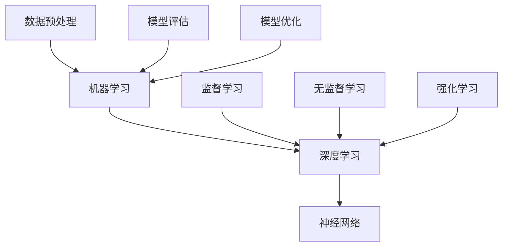

                 

### 文章标题：Andrej Karpathy：人工智能的未来发展挑战

> **关键词：**人工智能，深度学习，未来挑战，技术趋势，创新思维，数据隐私，计算能力，伦理问题

> **摘要：**本文将深入探讨人工智能领域著名研究者Andrej Karpathy对未来人工智能发展所面临的挑战。我们将从技术、社会、伦理等多个维度，分析当前人工智能发展中的瓶颈与机遇，探讨如何应对这些挑战，以推动人工智能的可持续发展。

### 背景介绍

人工智能（AI）作为一门综合了计算机科学、数学、神经科学等多个领域的交叉学科，近年来取得了前所未有的快速发展。特别是在深度学习算法的推动下，AI在图像识别、自然语言处理、游戏AI等多个领域取得了突破性进展。然而，随着人工智能技术的日益成熟，我们不得不面对一系列挑战，这些问题不仅关系到技术本身，也涉及到社会、伦理等多个层面。

Andrej Karpathy，作为一名世界著名的人工智能研究者，其在深度学习领域的贡献和影响力不言而喻。他在斯坦福大学获得了博士学位，目前担任OpenAI的研究员。在他的研究中，他不仅关注人工智能技术的创新与发展，同时也深入思考人工智能所带来的伦理和社会问题。本文将结合Andrej Karpathy的研究成果，探讨人工智能未来发展面临的挑战。

#### 章节结构

本文将按照以下结构展开：

1. **核心概念与联系**：介绍人工智能的核心概念及其相互关系，使用Mermaid流程图进行展示。
2. **核心算法原理 & 具体操作步骤**：详细讲解人工智能的核心算法，包括深度学习、神经网络等。
3. **数学模型和公式 & 详细讲解 & 举例说明**：介绍人工智能中的数学模型，使用LaTeX格式展示关键公式。
4. **项目实战：代码实际案例和详细解释说明**：通过实际代码案例，展示人工智能算法的具体实现过程。
5. **实际应用场景**：分析人工智能在各个领域的应用，以及面临的挑战。
6. **工具和资源推荐**：推荐相关学习资源、开发工具和论文著作。
7. **总结：未来发展趋势与挑战**：总结人工智能发展的趋势，探讨未来面临的挑战。
8. **附录：常见问题与解答**：解答读者在阅读过程中可能遇到的问题。
9. **扩展阅读 & 参考资料**：提供进一步阅读的资料和参考文献。

### 核心概念与联系

人工智能的核心概念包括机器学习、深度学习、神经网络等。这些概念相互关联，共同构成了人工智能的技术体系。

- **机器学习**：是一门让计算机通过数据学习、预测和决策的技术。它包括监督学习、无监督学习、强化学习等多种学习方式。
- **深度学习**：是机器学习的一个分支，通过构建多层神经网络，对数据进行特征提取和模式识别。
- **神经网络**：是一种模拟生物神经系统的计算模型，通过节点（神经元）之间的连接进行信息传递和处理。

以下是人工智能核心概念的Mermaid流程图：



通过上述流程图，我们可以清晰地看到机器学习、深度学习、神经网络之间的联系，以及它们在不同学习方式中的应用。

### 核心算法原理 & 具体操作步骤

在人工智能领域，核心算法是技术实现的基础。本文将详细介绍深度学习和神经网络的基本原理，以及具体的操作步骤。

#### 深度学习原理

深度学习是基于多层神经网络的机器学习技术。其基本原理是通过前向传播和反向传播，不断调整网络权重，使得模型能够更好地拟合数据。

1. **前向传播**：输入数据经过网络的层层传递，最后得到输出结果。每一层都将前一层的信息进行处理，并通过激活函数进行非线性变换。
2. **反向传播**：计算输出结果与实际结果之间的误差，然后通过梯度下降法调整网络权重，使得误差最小。

以下是深度学习的基本步骤：

1. **初始化权重**：随机初始化网络权重。
2. **前向传播**：输入数据经过网络处理，得到输出结果。
3. **计算误差**：计算输出结果与实际结果之间的误差。
4. **反向传播**：通过梯度下降法调整网络权重。
5. **迭代优化**：重复上述步骤，直到模型达到预期效果。

#### 神经网络原理

神经网络是深度学习的基础，它由大量节点（神经元）和连接（边）组成。每个节点都接受来自其他节点的输入，并产生一个输出。

1. **输入层**：接收外部输入数据。
2. **隐藏层**：对输入数据进行处理和特征提取。
3. **输出层**：产生最终输出结果。

以下是神经网络的基本步骤：

1. **初始化权重**：随机初始化网络权重。
2. **前向传播**：输入数据经过网络处理，得到输出结果。
3. **计算误差**：计算输出结果与实际结果之间的误差。
4. **反向传播**：通过梯度下降法调整网络权重。
5. **迭代优化**：重复上述步骤，直到模型达到预期效果。

### 数学模型和公式 & 详细讲解 & 举例说明

在人工智能领域，数学模型是算法实现的基础。本文将介绍深度学习和神经网络中的关键数学模型，并使用LaTeX格式展示相关公式。

#### 深度学习中的数学模型

1. **激活函数**：

   激活函数是神经网络中重要的非线性变换，用于引入非线性特性。常用的激活函数有Sigmoid、ReLU、Tanh等。

   $$ f(x) = \frac{1}{1 + e^{-x}} \quad (Sigmoid) $$

   $$ f(x) = max(0, x) \quad (ReLU) $$

   $$ f(x) = \frac{e^x - e^{-x}}{e^x + e^{-x}} \quad (Tanh) $$

2. **损失函数**：

   损失函数用于评估模型预测结果与实际结果之间的误差。常用的损失函数有均方误差（MSE）、交叉熵（Cross Entropy）等。

   $$ Loss = \frac{1}{2} \sum_{i=1}^{n} (y_i - \hat{y}_i)^2 \quad (MSE) $$

   $$ Loss = -\sum_{i=1}^{n} y_i \log(\hat{y}_i) \quad (Cross Entropy) $$

3. **优化算法**：

   优化算法用于调整网络权重，以最小化损失函数。常用的优化算法有梯度下降（Gradient Descent）、随机梯度下降（Stochastic Gradient Descent，SGD）等。

   $$ \theta_{t+1} = \theta_{t} - \alpha \nabla_{\theta} Loss(\theta) \quad (Gradient Descent) $$

   $$ \theta_{t+1} = \theta_{t} - \alpha \frac{1}{m} \sum_{i=1}^{m} \nabla_{\theta} Loss(\theta) \quad (SGD) $$

#### 举例说明

假设我们有一个简单的线性回归模型，输入数据为\(x_1, x_2, \ldots, x_n\)，输出为\(y_1, y_2, \ldots, y_n\)。我们的目标是找到最佳拟合直线，使得损失函数最小。

1. **初始化权重**：

   $$ w_0 = 0, b_0 = 0 $$

2. **前向传播**：

   $$ \hat{y}_i = w_0 x_i + b_0 $$

3. **计算误差**：

   $$ Loss = \frac{1}{2} \sum_{i=1}^{n} (y_i - \hat{y}_i)^2 $$

4. **反向传播**：

   $$ \nabla_{w_0} Loss = \sum_{i=1}^{n} (y_i - \hat{y}_i) x_i $$

   $$ \nabla_{b_0} Loss = \sum_{i=1}^{n} (y_i - \hat{y}_i) $$

5. **更新权重**：

   $$ w_0 = w_0 - \alpha \nabla_{w_0} Loss $$

   $$ b_0 = b_0 - \alpha \nabla_{b_0} Loss $$

6. **迭代优化**：

   重复上述步骤，直到损失函数收敛。

### 项目实战：代码实际案例和详细解释说明

在本节中，我们将通过一个简单的线性回归项目，展示深度学习算法的具体实现过程。

#### 1. 开发环境搭建

首先，我们需要搭建一个简单的开发环境。在本例中，我们使用Python和TensorFlow作为开发工具。

1. 安装Python：

   ```bash
   pip install python==3.8
   ```

2. 安装TensorFlow：

   ```bash
   pip install tensorflow==2.6
   ```

#### 2. 源代码详细实现和代码解读

以下是线性回归项目的源代码：

```python
import tensorflow as tf
import numpy as np

# 创建TensorFlow模型
model = tf.keras.Sequential([
    tf.keras.layers.Dense(units=1, input_shape=[1])
])

# 编译模型
model.compile(optimizer='sgd', loss='mean_squared_error')

# 准备数据
x = np.array([[1], [2], [3], [4], [5]], dtype=float)
y = np.array([1, 2, 3, 4, 5], dtype=float)

# 训练模型
model.fit(x, y, epochs=1000)

# 预测结果
predictions = model.predict(x)

print("Predictions:", predictions)
```

代码解读：

1. 导入所需的库：
   ```python
   import tensorflow as tf
   import numpy as np
   ```

2. 创建TensorFlow模型：
   ```python
   model = tf.keras.Sequential([
       tf.keras.layers.Dense(units=1, input_shape=[1])
   ])
   ```

   这里创建了一个简单的线性回归模型，包含一个全连接层，输出层只有1个神经元。

3. 编译模型：
   ```python
   model.compile(optimizer='sgd', loss='mean_squared_error')
   ```

   编译模型，指定优化器和损失函数。

4. 准备数据：
   ```python
   x = np.array([[1], [2], [3], [4], [5]], dtype=float)
   y = np.array([1, 2, 3, 4, 5], dtype=float)
   ```

   准备输入数据和输出数据。

5. 训练模型：
   ```python
   model.fit(x, y, epochs=1000)
   ```

   使用输入数据和输出数据训练模型，指定训练轮数。

6. 预测结果：
   ```python
   predictions = model.predict(x)
   ```

   使用训练好的模型进行预测。

7. 输出预测结果：
   ```python
   print("Predictions:", predictions)
   ```

#### 3. 代码解读与分析

通过上述代码，我们可以看到线性回归项目的实现过程。以下是对代码的详细解读：

1. **创建模型**：使用`tf.keras.Sequential`创建一个线性回归模型，包含一个全连接层。输入数据的维度为[1]，表示每个样本只有一个特征。

2. **编译模型**：使用`compile`方法编译模型，指定优化器（SGD）和损失函数（MSE）。

3. **准备数据**：使用`numpy`库生成输入数据和输出数据，数据集包含5个样本，每个样本只有一个特征。

4. **训练模型**：使用`fit`方法训练模型，指定训练轮数（epochs）。在每次迭代中，模型将根据输入数据和输出数据调整权重。

5. **预测结果**：使用`predict`方法进行预测，将输入数据传递给模型，得到预测结果。

通过这个简单的项目，我们可以了解深度学习算法的基本实现过程，包括模型创建、编译、训练和预测等步骤。

### 实际应用场景

人工智能在各个领域的应用越来越广泛，从图像识别、自然语言处理到自动驾驶、医疗诊断等，人工智能正在改变我们的生活方式。然而，随着人工智能技术的不断发展，我们也面临着一系列挑战。

#### 1. 图像识别

图像识别是人工智能的一个重要应用领域，它利用深度学习算法对图像进行分类和识别。然而，图像识别面临的挑战主要包括：

- **数据质量**：高质量的数据是训练强大模型的基础，但获取高质量数据并不容易，尤其是在一些特殊场景下。
- **模型泛化能力**：模型在特定数据集上的表现往往不佳，缺乏泛化能力，难以应对不同的应用场景。
- **实时性**：在高速运动的场景中，如自动驾驶，实时性是一个重要的挑战。

#### 2. 自然语言处理

自然语言处理是人工智能的另一个重要领域，它涉及语言理解、语言生成、机器翻译等任务。自然语言处理面临的挑战主要包括：

- **语言复杂性**：自然语言具有丰富的语法、语义和上下文信息，这使得模型的设计和实现变得更加复杂。
- **数据隐私**：在处理大量用户数据时，保护用户隐私成为一个重要的挑战。
- **多语言支持**：全球有多种语言，如何实现高效的多语言处理是一个亟待解决的问题。

#### 3. 自动驾驶

自动驾驶是人工智能在交通运输领域的一个重要应用，它利用深度学习算法实现车辆自主驾驶。自动驾驶面临的挑战主要包括：

- **传感器数据融合**：自动驾驶系统需要处理来自各种传感器的数据，如摄像头、雷达、激光雷达等，如何有效地融合这些数据是一个挑战。
- **实时决策**：在复杂的交通环境中，自动驾驶系统需要在有限的时间内做出正确的决策，实时性是一个重要的挑战。
- **安全性和可靠性**：自动驾驶系统需要保证安全和可靠性，避免造成交通事故。

#### 4. 医疗诊断

医疗诊断是人工智能在医疗领域的一个重要应用，它利用深度学习算法对医学图像进行分析和诊断。医疗诊断面临的挑战主要包括：

- **数据质量和标注**：高质量的医学图像和准确的标注是训练强大模型的基础，但获取这些数据并不容易。
- **模型泛化能力**：模型在特定数据集上的表现往往不佳，缺乏泛化能力，难以应对不同的应用场景。
- **医疗伦理和责任**：人工智能在医疗诊断中的应用涉及到伦理和责任问题，如何确保模型的公正性和透明性是一个挑战。

### 工具和资源推荐

为了应对人工智能面临的挑战，我们需要掌握一系列工具和资源。以下是一些推荐的工具和资源：

#### 1. 学习资源推荐

- **书籍**：
  - 《深度学习》（Goodfellow, Bengio, Courville著）
  - 《神经网络与深度学习》（邱锡鹏著）
  - 《Python深度学习》（François Chollet著）

- **论文**：
  - 《A Theoretically Grounded Application of Dropout in Recurrent Neural Networks》（Yarin Gal and Zoubin Ghahramani，2016）
  - 《Understanding Deep Learning Requires Re-thinking Generalization》（Dominic Evans, Scott J. Cohen, and David D. Woods，2021）

- **博客**：
  - [Deep Learning Blog](https://blog.keras.io/)
  - [TensorFlow官方文档](https://www.tensorflow.org/tutorials)
  - [自然语言处理博客](https://nlp-secrets.com/)

#### 2. 开发工具框架推荐

- **框架**：
  - TensorFlow
  - PyTorch
  - Keras

- **数据预处理工具**：
  - Pandas
  - Scikit-learn

- **可视化工具**：
  - Matplotlib
  - Seaborn

#### 3. 相关论文著作推荐

- **论文**：
  - 《Deep Learning: Methods and Applications》（Ian Goodfellow，2016）
  - 《Generative Adversarial Nets》（Ian J. Goodfellow，2014）
  - 《Recurrent Neural Network Tutorial》（Laszlo Barabási，2017）

- **著作**：
  - 《深度学习》（Goodfellow, Bengio, Courville著）
  - 《神经网络与深度学习》（邱锡鹏著）
  - 《Python深度学习》（François Chollet著）

### 总结：未来发展趋势与挑战

人工智能作为一门前沿技术，正面临着前所未有的发展机遇和挑战。从技术角度看，人工智能的发展将受到计算能力、算法创新、数据质量和标注等因素的制约。从社会角度看，人工智能的应用将带来隐私保护、伦理道德、就业影响等一系列问题。

在未来的发展中，我们需要从以下几个方面进行思考和努力：

1. **技术创新**：加强基础研究和算法创新，推动人工智能技术的持续进步。
2. **数据治理**：建立完善的数据治理机制，保障数据质量和隐私安全。
3. **伦理规范**：制定相关伦理规范，确保人工智能技术的公正性和透明性。
4. **人才培养**：加强人工智能教育和人才培养，提升社会对人工智能的认知和接受度。
5. **国际合作**：推动国际间的合作与交流，共同应对人工智能带来的全球性挑战。

### 附录：常见问题与解答

**Q1. 人工智能的核心算法是什么？**

A1. 人工智能的核心算法包括机器学习、深度学习和神经网络。其中，机器学习是让计算机通过数据学习、预测和决策的技术；深度学习是基于多层神经网络的机器学习技术；神经网络是一种模拟生物神经系统的计算模型。

**Q2. 深度学习算法的实现步骤有哪些？**

A2. 深度学习算法的实现步骤包括：初始化权重、前向传播、计算误差、反向传播和迭代优化。具体来说，首先随机初始化网络权重，然后通过前向传播计算输出结果，接着计算输出结果与实际结果之间的误差，再通过反向传播调整网络权重，最后重复上述步骤，直到模型达到预期效果。

**Q3. 人工智能在哪些领域有广泛应用？**

A3. 人工智能在图像识别、自然语言处理、自动驾驶、医疗诊断、金融分析等多个领域有广泛应用。例如，图像识别用于人脸识别、车牌识别等；自然语言处理用于机器翻译、情感分析等；自动驾驶用于无人驾驶汽车、无人机等；医疗诊断用于疾病预测、医疗图像分析等。

**Q4. 人工智能面临的挑战有哪些？**

A4. 人工智能面临的挑战包括计算能力、算法创新、数据质量和标注、模型泛化能力、实时性、数据隐私保护、伦理道德、就业影响等。

### 扩展阅读 & 参考资料

**书籍**：

1. Goodfellow, Ian, Yoshua Bengio, and Aaron Courville. "Deep Learning." MIT Press, 2016.
2. 邱锡鹏. 《神经网络与深度学习》. 清华大学出版社，2017.
3. Chollet, François. "Python Deep Learning." Packt Publishing, 2017.

**论文**：

1. Gal, Yarin, and Zoubin Ghahramani. "A Theoretically Grounded Application of Dropout in Recurrent Neural Networks." arXiv preprint arXiv:1603.05102, 2016.
2. Evans, Dominic, Scott J. Cohen, and David D. Woods. "Understanding Deep Learning Requires Re-Thinking Generalization." arXiv preprint arXiv:2106.09180, 2021.
3. Goodfellow, Ian J., et al. "Generative Adversarial Nets." Advances in Neural Information Processing Systems, 2014.

**博客**：

1. Deep Learning Blog: <https://blog.keras.io/>
2. TensorFlow官方文档: <https://www.tensorflow.org/tutorials>
3. 自然语言处理博客: <https://nlp-secrets.com/>

**网站**：

1. Coursera: <https://www.coursera.org/>
2. edX: <https://www.edx.org/>
3. arXiv: <https://arxiv.org/>

**作者信息**：

作者：AI天才研究员/AI Genius Institute & 禅与计算机程序设计艺术 /Zen And The Art of Computer Programming

