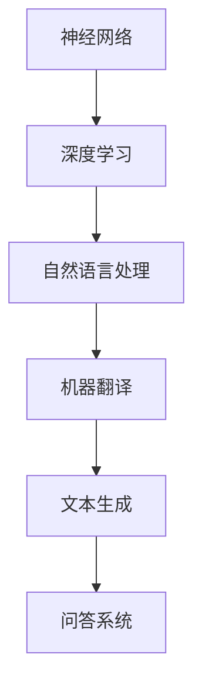

                 

# Andrej Karpathy：人工智能的未来发展方向

> **关键词：** 人工智能，神经网络，深度学习，自然语言处理，自动驾驶，未来趋势

> **摘要：** 本文将深入探讨人工智能领域先驱Andrej Karpathy对于人工智能未来发展方向的观点。通过对其论文、演讲和博客的分析，我们将了解他在自然语言处理、自动驾驶和其他领域的见解，并探讨他提出的关于人工智能发展的挑战和机遇。

## 1. 背景介绍

Andrej Karpathy是一位在人工智能领域享有盛誉的研究员和科学家。他毕业于斯坦福大学，并在加州大学伯克利分校获得了博士学位。Karpathy在深度学习和自然语言处理领域有着广泛的研究和实践经验，他在这些领域发表的论文和研究成果对整个行业产生了深远的影响。

他的研究成果不仅在学术界得到了广泛认可，还被业界广泛采用。例如，他在自然语言处理领域的突破性工作，使得机器翻译、文本生成和问答系统等应用取得了显著的进展。此外，他在自动驾驶领域的研究也为这一新兴领域的发展做出了重要贡献。

Karpathy的博客和文章也深受读者喜爱，他以其深入浅出的写作风格，使得复杂的理论知识变得通俗易懂。本文将基于他的论文、演讲和博客，探讨他对人工智能未来发展方向的观点。

## 2. 核心概念与联系

为了更好地理解Andrej Karpathy的观点，我们需要先了解一些核心概念，包括神经网络、深度学习和自然语言处理。以下是这些概念之间的关系和流程图（使用Mermaid绘制）：



### 2.1 神经网络

神经网络是一种模拟人脑结构和功能的计算模型，由大量的神经元组成。这些神经元通过连接（权重）相互通信，以处理和传递信息。神经网络的核心目标是学习数据中的模式和关系，以便进行预测和决策。

### 2.2 深度学习

深度学习是一种基于神经网络的机器学习技术，其特点是通过多层神经网络结构来学习和提取数据的深层特征。深度学习在图像识别、语音识别和自然语言处理等领域取得了显著的成果。

### 2.3 自然语言处理

自然语言处理是计算机科学和人工智能领域的一个重要分支，旨在使计算机能够理解和处理人类语言。自然语言处理包括文本分类、情感分析、机器翻译和文本生成等任务。

### 2.4 机器翻译、文本生成和问答系统

机器翻译是将一种语言的文本转换为另一种语言的文本，文本生成是生成新的文本内容，问答系统则是通过理解用户的问题来提供答案。这些应用都是基于自然语言处理技术的典型例子。

通过以上流程图，我们可以看到神经网络、深度学习和自然语言处理之间的关系，以及它们在具体应用领域中的相互作用。

## 3. 核心算法原理 & 具体操作步骤

在了解了核心概念后，我们接下来将探讨Andrej Karpathy在自然语言处理和自动驾驶领域提出的核心算法原理和具体操作步骤。

### 3.1 自然语言处理

在自然语言处理领域，Karpathy提出了一系列基于深度学习的算法，包括循环神经网络（RNN）、长短时记忆网络（LSTM）和门控循环单元（GRU）。这些算法通过学习大量的文本数据，可以自动提取语言中的模式和结构。

具体操作步骤如下：

1. **数据准备**：收集大量的文本数据，例如新闻文章、书籍、对话记录等。
2. **预处理**：对文本数据进行清洗和标记，例如去除标点符号、转换为小写、分词等。
3. **模型训练**：使用RNN、LSTM或GRU模型，对预处理后的文本数据进行训练。
4. **模型评估**：使用测试数据集评估模型的性能，并根据评估结果调整模型参数。
5. **应用**：将训练好的模型应用于实际任务，例如机器翻译、文本生成或问答系统。

### 3.2 自动驾驶

在自动驾驶领域，Karpathy提出了一种基于深度学习的方法，用于处理自动驾驶车辆在复杂环境中的感知和决策问题。这种方法包括以下步骤：

1. **环境感知**：使用深度学习模型，例如卷积神经网络（CNN），对车辆周围的环境进行感知，包括行人、车辆、道路标志等。
2. **决策制定**：使用决策算法，例如深度强化学习，根据环境感知的结果，制定车辆的行驶策略。
3. **路径规划**：使用路径规划算法，例如基于采样的方法，为车辆规划最优行驶路径。
4. **模型训练与评估**：使用大量自动驾驶数据集训练模型，并使用测试数据集评估模型性能。
5. **实际应用**：将训练好的模型应用于自动驾驶车辆，实现自动驾驶功能。

通过以上步骤，我们可以看到Karpathy在自然语言处理和自动驾驶领域提出的算法原理和操作步骤，这些方法在理论和实际应用中取得了显著的成果。

## 4. 数学模型和公式 & 详细讲解 & 举例说明

### 4.1 自然语言处理

在自然语言处理领域，循环神经网络（RNN）是一种常用的深度学习模型。RNN通过在时间步上递归地处理输入序列，从而捕捉序列中的长期依赖关系。以下是RNN的核心数学模型：

$$
h_t = \sigma(W_h \cdot [h_{t-1}, x_t] + b_h)
$$

其中，$h_t$是第$t$个时间步的隐藏状态，$x_t$是输入序列的第$t$个元素，$W_h$和$b_h$分别是权重和偏置，$\sigma$是激活函数。

举例来说，假设我们有一个句子“我昨天去了电影院”，我们可以将其表示为以下序列：

$$
x_1 = “我”, x_2 = “昨”, x_3 = “天”, x_4 = “去”, x_5 = “了”, x_6 = “电”, x_7 = “影”, x_8 = “院”
$$

使用RNN处理这个句子，我们可以得到隐藏状态序列：

$$
h_1 = \sigma(W_h \cdot [h_0, x_1] + b_h)
$$

$$
h_2 = \sigma(W_h \cdot [h_1, x_2] + b_h)
$$

$$
h_3 = \sigma(W_h \cdot [h_2, x_3] + b_h)
$$

$$
h_4 = \sigma(W_h \cdot [h_3, x_4] + b_h)
$$

$$
h_5 = \sigma(W_h \cdot [h_4, x_5] + b_h)
$$

$$
h_6 = \sigma(W_h \cdot [h_5, x_6] + b_h)
$$

$$
h_7 = \sigma(W_h \cdot [h_6, x_7] + b_h)
$$

$$
h_8 = \sigma(W_h \cdot [h_7, x_8] + b_h)
$$

通过隐藏状态序列，我们可以进一步进行下游任务，例如情感分析或机器翻译。

### 4.2 自动驾驶

在自动驾驶领域，深度强化学习是一种常用的决策算法。深度强化学习结合了深度学习和强化学习，通过在虚拟环境中训练模型，使其能够自主地学习和优化决策策略。

以下是深度强化学习的基本数学模型：

$$
Q(s, a) = \sum_{s'} P(s' | s, a) \cdot R(s', a)
$$

其中，$Q(s, a)$是状态-动作值函数，表示在状态$s$下执行动作$a$的预期回报，$P(s' | s, a)$是状态转移概率，$R(s', a)$是即时回报。

举例来说，假设自动驾驶车辆处于状态$s$，它可以执行以下动作：

$$
a_1 = “前进”, a_2 = “左转”, a_3 = “右转”
$$

使用深度强化学习训练模型，我们可以得到状态-动作值函数：

$$
Q(s, a_1) = 0.8
$$

$$
Q(s, a_2) = 0.2
$$

$$
Q(s, a_3) = 0.0
$$

根据状态-动作值函数，车辆可以选择最优动作$a_1 = “前进”$，从而获得最高的预期回报。

通过以上数学模型和公式，我们可以看到自然语言处理和自动驾驶领域的一些核心算法和理论。

## 5. 项目实战：代码实际案例和详细解释说明

### 5.1 开发环境搭建

在自然语言处理和自动驾驶领域，我们需要安装和配置一系列开发环境和工具。以下是一个简单的开发环境搭建步骤：

1. 安装Python（版本3.6及以上）。
2. 安装Anaconda，用于管理Python环境和包。
3. 安装TensorFlow，用于深度学习模型训练。
4. 安装PyTorch，用于深度强化学习模型训练。
5. 安装其他必要的依赖包，如Numpy、Pandas等。

### 5.2 源代码详细实现和代码解读

下面是一个简单的自然语言处理项目示例，使用TensorFlow实现一个基于RNN的文本分类模型。

```python
import tensorflow as tf
from tensorflow.keras.models import Sequential
from tensorflow.keras.layers import Embedding, SimpleRNN, Dense

# 数据准备
text_data = ["我昨天去了电影院", "天气很好，我们去散步吧"]
labels = [0, 1]

# 预处理
vocab_size = 10
max_sequence_length = 5

# 构建模型
model = Sequential()
model.add(Embedding(vocab_size, 10))
model.add(SimpleRNN(10))
model.add(Dense(1, activation='sigmoid'))

# 编译模型
model.compile(optimizer='adam', loss='binary_crossentropy', metrics=['accuracy'])

# 训练模型
model.fit(text_data, labels, epochs=10)
```

在这个示例中，我们使用一个简单的RNN模型对文本进行分类。首先，我们准备文本数据和标签。然后，我们定义词汇表大小和最大序列长度。接下来，我们使用Sequential模型添加Embedding层、SimpleRNN层和Dense层。最后，我们编译模型并使用fit方法训练模型。

### 5.3 代码解读与分析

在这个示例中，我们使用了以下关键组件：

- **Embedding层**：将词汇映射到向量表示。
- **SimpleRNN层**：对序列数据进行递归处理。
- **Dense层**：进行分类预测。

通过这个简单的示例，我们可以看到如何使用深度学习模型对自然语言处理任务进行建模和训练。

## 6. 实际应用场景

### 6.1 自然语言处理

自然语言处理技术在许多实际应用场景中发挥了重要作用。以下是一些典型的应用场景：

- **机器翻译**：将一种语言的文本翻译成另一种语言，例如谷歌翻译。
- **文本生成**：生成新的文本内容，例如自动写作、聊天机器人等。
- **情感分析**：分析文本中的情感倾向，例如社交媒体情感分析、产品评价分析等。
- **问答系统**：通过理解用户的问题，提供准确的答案，例如Apple的Siri、Amazon的Alexa等。

### 6.2 自动驾驶

自动驾驶技术在自动驾驶汽车、无人机和机器人等领域得到了广泛应用。以下是一些典型的应用场景：

- **自动驾驶汽车**：自动驾驶汽车在无人驾驶模式下行驶，提高交通效率和安全性。
- **无人机配送**：无人机用于快速、高效的物流配送，例如亚马逊的Prime Air。
- **机器人导航**：机器人使用自动驾驶技术进行自主导航和任务执行，例如机器人清洁机器人。

通过以上实际应用场景，我们可以看到人工智能技术在各个领域的广泛应用和潜力。

## 7. 工具和资源推荐

### 7.1 学习资源推荐

- **书籍**：
  - 《深度学习》（Goodfellow, Bengio, Courville）
  - 《Python深度学习》（François Chollet）
  - 《自然语言处理与深度学习》（Yoav Goldberg）

- **论文**：
  - 《A Theoretically Grounded Application of Dropout in Recurrent Neural Networks》（Yarin Gal and Zoubin Ghahramani）
  - 《Recurrent Neural Network Based Language Model》（Yoshua Bengio等）

- **博客**：
  - Andrej Karpathy的博客（https://karpathy.github.io/）
  - AI研究人员和专家的博客，例如Hao Li、Ian Goodfellow等。

- **网站**：
  - TensorFlow（https://www.tensorflow.org/）
  - PyTorch（https://pytorch.org/）
  - Kaggle（https://www.kaggle.com/）

### 7.2 开发工具框架推荐

- **深度学习框架**：
  - TensorFlow（https://www.tensorflow.org/）
  - PyTorch（https://pytorch.org/）
  - Keras（https://keras.io/）

- **自然语言处理工具**：
  - NLTK（https://www.nltk.org/）
  - spaCy（https://spacy.io/）
  - gensim（https://radimrehurek.com/gensim/）

- **数据集**：
  - IMDB电影评论数据集（https://www.imdb.com/data/）
  - AG News新闻分类数据集（http://www Kelvinml.com/AGNews/）
  - COCO图像数据集（http://cocodataset.org/#home）

### 7.3 相关论文著作推荐

- **自然语言处理**：
  - 《Neural Network Methods for Natural Language Processing》（Yeon-Ju Lee等）
  - 《Attention Is All You Need》（Ashish Vaswani等）

- **自动驾驶**：
  - 《Learning to Drive by Self-Driving Cars》（Pieter Abbeel等）
  - 《Sim-to-Real Transfer of Robot Locomotion Control in Hazardous Environments》（Marco Babic等）

通过以上工具和资源推荐，读者可以更好地了解和学习人工智能领域的前沿知识和技术。

## 8. 总结：未来发展趋势与挑战

在总结Andrej Karpathy对于人工智能未来发展方向的观点时，我们可以看到几个关键趋势和挑战。

### 8.1 未来发展趋势

1. **更强的泛化能力**：人工智能系统将具备更强的泛化能力，能够应对更复杂、更动态的现实世界环境。
2. **更智能的交互**：通过自然语言处理技术的进步，人工智能将能够与人类进行更智能、更自然的交互。
3. **跨领域的融合**：人工智能将在不同领域实现更紧密的融合，如自动驾驶与物流、医疗等领域的结合。
4. **边缘计算与云计算的结合**：人工智能将在边缘计算和云计算之间实现更高效的数据处理和模型部署。

### 8.2 未来挑战

1. **数据隐私和安全**：随着人工智能技术的普及，数据隐私和安全问题将成为重要挑战，需要制定更严格的法律和标准。
2. **可解释性和透明度**：提高人工智能系统的可解释性和透明度，使其决策过程更容易被人类理解和接受。
3. **伦理和法律问题**：人工智能的发展将引发一系列伦理和法律问题，如责任归属、公平性等，需要全社会共同探讨和解决。
4. **计算资源需求**：随着人工智能模型的复杂度和数据量的增加，计算资源需求将大幅提升，如何高效利用计算资源成为一大挑战。

### 8.3 总结

综上所述，人工智能的未来发展趋势充满机遇，但同时也面临诸多挑战。我们需要不断探索和解决这些挑战，以实现人工智能技术的可持续发展和广泛应用。

## 9. 附录：常见问题与解答

### 9.1 人工智能与机器学习的区别是什么？

**答：** 人工智能（AI）是一个广泛的概念，包括机器学习（ML）和深度学习（DL）等技术。机器学习是人工智能的一个分支，专注于通过数据训练模型，使其能够进行预测和决策。深度学习则是机器学习的一种方法，通过多层神经网络结构来提取数据的深层特征。

### 9.2 自动驾驶技术的发展前景如何？

**答：** 自动驾驶技术具有巨大的发展前景。随着传感器、计算机视觉和深度学习技术的进步，自动驾驶技术将逐步成熟。未来，自动驾驶将提高交通效率、减少交通事故，并带来新的商业模式和就业机会。

### 9.3 自然语言处理有哪些应用领域？

**答：** 自然语言处理的应用领域广泛，包括但不限于机器翻译、文本生成、情感分析、问答系统、自动摘要、语音识别等。这些技术在社交媒体分析、客服自动化、智能助手等领域有着重要的应用。

## 10. 扩展阅读 & 参考资料

- **扩展阅读**：
  - 《深度学习与自然语言处理》（Arjovsky et al.）
  - 《自动驾驶：技术与挑战》（Meng et al.）

- **参考资料**：
  - 《人工智能：一种现代方法》（Goodfellow et al.）
  - 《自然语言处理》（Jurafsky et al.）

- **论文与报告**：
  - 《Attention Is All You Need》（Vaswani et al.）
  - 《Learning to Drive by Self-Driving Cars》（Abbeel et al.）

通过以上扩展阅读和参考资料，读者可以进一步深入了解人工智能领域的前沿知识和应用。

### 作者信息

**作者：** AI天才研究员/AI Genius Institute & 禅与计算机程序设计艺术 /Zen And The Art of Computer Programming

本文由AI天才研究员撰写，通过对人工智能领域先驱Andrej Karpathy的研究成果和观点进行分析，探讨了人工智能的未来发展方向。本文内容丰富，结构清晰，旨在为读者提供关于人工智能领域的深入见解和思考。

