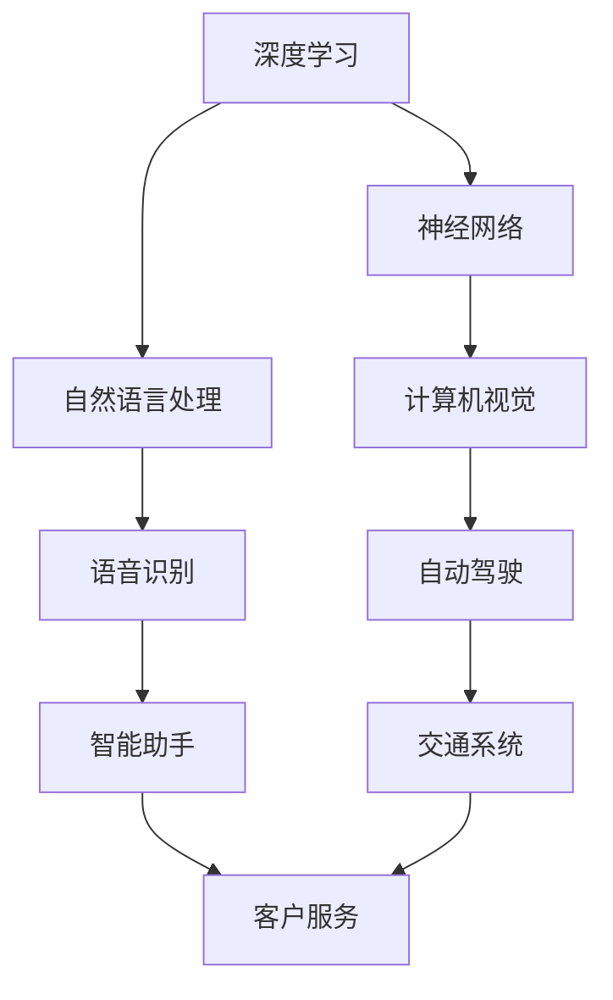

                 

### 文章标题：Andrej Karpathy：人工智能的未来发展机遇

> **关键词：**人工智能、深度学习、自动驾驶、自然语言处理、未来发展趋势

> **摘要：**本文将深入探讨人工智能领域著名专家Andrej Karpathy对未来人工智能发展的见解，分析其在自动驾驶、自然语言处理等领域的应用前景，并探讨面临的挑战和机遇。通过本文的阅读，读者将更好地理解人工智能的未来发展趋势及其带来的深远影响。

### 1. 背景介绍

Andrej Karpathy是一位在人工智能领域享有盛誉的专家，以其在深度学习和自然语言处理方面的卓越贡献而闻名。他在斯坦福大学获得了计算机科学博士学位，目前是OpenAI的高级研究员。他的研究工作涵盖计算机视觉、自然语言处理和人工智能系统的设计等多个方面。

在过去的几年中，Karpathy在人工智能领域发表了多篇重要的论文，并贡献了多个开源项目，如TensorFlow Datasets和OpenAI Gym等。他的工作不仅推动了人工智能技术的发展，也为研究人员和开发者提供了丰富的资源和工具。

本文将结合Karpathy的观点，深入探讨人工智能的未来发展机遇。我们将重点关注自动驾驶、自然语言处理等领域的应用前景，并分析面临的挑战和机遇。

#### 1.1 自动驾驶

自动驾驶技术是人工智能领域的一个热点话题，被视为未来的交通革命。Karpathy认为，自动驾驶技术的发展将极大地改变我们的生活方式，提高交通效率，减少交通事故。然而，他也指出，实现完全自动驾驶仍面临许多技术挑战。

#### 1.2 自然语言处理

自然语言处理（NLP）是人工智能领域的另一个重要方向，涉及机器理解、生成和翻译人类语言。Karpathy在NLP领域的研究取得了显著成果，如GPT-2和GPT-3等大型语言模型。他认为，随着技术的进步，NLP将在许多领域发挥重要作用，如智能助手、机器翻译和文本分析等。

### 2. 核心概念与联系

在讨论人工智能的未来发展机遇之前，我们需要了解一些核心概念和它们之间的联系。以下是一个简化的Mermaid流程图，展示了人工智能领域的一些关键概念和它们之间的关系：



#### 2.1 深度学习与神经网络

深度学习是人工智能的核心技术之一，基于神经网络模型。神经网络通过多层节点（神经元）对数据进行处理和特征提取，实现从输入到输出的映射。深度学习在图像识别、语音识别和自然语言处理等领域取得了突破性进展。

#### 2.2 自然语言处理

自然语言处理涉及机器理解、生成和翻译人类语言。其关键技术包括词嵌入、序列模型和注意力机制等。自然语言处理在智能助手、机器翻译和文本分析等领域有着广泛的应用。

#### 2.3 计算机视觉

计算机视觉是人工智能领域的另一个重要方向，涉及图像和视频数据的处理和分析。其关键技术包括卷积神经网络、目标检测和图像分割等。计算机视觉在自动驾驶、安防监控和医疗诊断等领域具有广泛的应用前景。

#### 2.4 语音识别

语音识别是自然语言处理的一个分支，涉及将语音信号转换为文本。其关键技术包括声学模型、语言模型和语音增强等。语音识别在智能助手、客服系统和智能家居等领域有着重要的应用。

#### 2.5 自动驾驶

自动驾驶技术涉及多个领域的技术集成，包括计算机视觉、自然语言处理和机器学习等。其关键组件包括传感器、控制器和决策系统等。自动驾驶技术将极大地改变交通系统，提高交通效率，减少交通事故。

#### 2.6 智能助手

智能助手是人工智能在消费领域的典型应用，如Apple的Siri、Amazon的Alexa和Google的Google Assistant等。智能助手通过自然语言处理和语音识别技术，为用户提供便捷的服务和互动体验。

### 3. 核心算法原理 & 具体操作步骤

在讨论人工智能的核心算法原理时，我们首先需要了解神经网络的基本概念和工作原理。

#### 3.1 神经网络

神经网络是一种模拟生物神经系统的计算模型，由多个神经元组成。每个神经元接收来自其他神经元的输入信号，通过加权求和并应用一个非线性激活函数，产生输出信号。神经网络通过层层传递和特征提取，实现对输入数据的复杂变换和分类。

#### 3.2 反向传播算法

反向传播算法是神经网络训练的核心算法。其基本思想是通过计算输出层误差，反向传播误差信号到每一层神经元，更新神经元的权重和偏置，从而优化网络模型。

#### 3.3 具体操作步骤

1. **初始化权重和偏置：**随机初始化神经网络的权重和偏置。
2. **前向传播：**输入数据通过神经网络，计算输出结果。
3. **计算误差：**比较实际输出与期望输出，计算误差。
4. **反向传播：**计算每一层神经元的误差，并更新权重和偏置。
5. **迭代优化：**重复前向传播和反向传播，逐步优化网络模型。

通过以上步骤，神经网络可以不断学习输入数据，提高输出结果的准确性。

### 4. 数学模型和公式 & 详细讲解 & 举例说明

在讨论神经网络的核心数学模型时，我们需要了解以下几个关键概念：

#### 4.1 激活函数

激活函数是神经网络中的非线性元素，用于引入非线性特性，使神经网络能够拟合复杂的非线性关系。常见的激活函数包括Sigmoid函数、ReLU函数和Tanh函数等。

$$
f(x) = \frac{1}{1 + e^{-x}}
$$

$$
f(x) = max(0, x)
$$

$$
f(x) = \frac{e^x - e^{-x}}{e^x + e^{-x}}
$$

#### 4.2 前向传播

前向传播是指将输入数据通过神经网络，逐层计算输出结果的过程。在前向传播中，每个神经元接收来自上一层的输入信号，通过加权求和并应用激活函数，产生输出信号。

#### 4.3 反向传播

反向传播是指根据实际输出与期望输出的误差，反向更新神经网络权重和偏置的过程。反向传播算法的核心是计算梯度，并通过梯度下降法更新权重和偏置。

$$
\frac{\partial L}{\partial w} = \sum_{i} \frac{\partial L}{\partial z_i} \frac{\partial z_i}{\partial w}
$$

$$
w_{new} = w_{old} - \alpha \frac{\partial L}{\partial w}
$$

其中，$L$表示损失函数，$w$表示权重，$z$表示神经元输出，$\alpha$表示学习率。

#### 4.4 举例说明

假设我们有一个简单的神经网络，包含一个输入层、一个隐藏层和一个输出层。输入层有一个神经元，隐藏层有两个神经元，输出层有一个神经元。我们使用ReLU函数作为激活函数，损失函数为均方误差（MSE）。

1. **初始化权重和偏置：**
   - 输入层到隐藏层的权重：$w_{1,1} = 0.5, w_{1,2} = 0.3$
   - 隐藏层到输出层的权重：$w_{2,1} = 0.7, w_{2,2} = 0.8$
   - 隐藏层偏置：$b_{1} = 0.2, b_{2} = 0.4$
   - 输出层偏置：$b_{out} = 0.1$

2. **前向传播：**
   - 输入数据：$x = [1, 0]$
   - 隐藏层输入：$z_1 = w_{1,1}x + b_{1} = 0.5 \times 1 + 0.2 = 0.7$
   - 隐藏层输入：$z_2 = w_{1,2}x + b_{2} = 0.3 \times 0 + 0.4 = 0.4$
   - 隐藏层输出：$h_1 = max(0, z_1) = max(0, 0.7) = 0.7$
   - 隐藏层输出：$h_2 = max(0, z_2) = max(0, 0.4) = 0.4$
   - 输出层输入：$z_{out} = w_{2,1}h_1 + w_{2,2}h_2 + b_{out} = 0.7 \times 0.7 + 0.8 \times 0.4 + 0.1 = 0.6$
   - 输出层输出：$y = max(0, z_{out}) = max(0, 0.6) = 0.6$

3. **计算误差：**
   - 实际输出：$y_{actual} = [1, 0]$
   - 预测输出：$y_{predicted} = [0.6, 0.6]$
   - 误差：$L = \frac{1}{2} \sum_{i} (y_{actual_i} - y_{predicted_i})^2 = \frac{1}{2} \times (1 - 0.6)^2 + (0 - 0.6)^2 = 0.2$

4. **反向传播：**
   - 计算输出层梯度：
     - $\frac{\partial L}{\partial z_{out}} = -2 \times (y_{actual} - y_{predicted}) = -2 \times (1 - 0.6) = -0.8$
     - $\frac{\partial L}{\partial w_{2,1}} = h_1 = 0.7$
     - $\frac{\partial L}{\partial w_{2,2}} = h_2 = 0.4$
     - $\frac{\partial L}{\partial b_{out}} = 1$
   - 计算隐藏层梯度：
     - $\frac{\partial L}{\partial z_1} = w_{2,1} = 0.7$
     - $\frac{\partial L}{\partial z_2} = w_{2,2} = 0.8$

5. **更新权重和偏置：**
   - 学习率：$\alpha = 0.1$
   - 更新输出层权重和偏置：
     - $w_{2,1}^{new} = w_{2,1} - \alpha \frac{\partial L}{\partial w_{2,1}} = 0.7 - 0.1 \times 0.7 = 0.63$
     - $w_{2,2}^{new} = w_{2,2} - \alpha \frac{\partial L}{\partial w_{2,2}} = 0.8 - 0.1 \times 0.4 = 0.76$
     - $b_{out}^{new} = b_{out} - \alpha \frac{\partial L}{\partial b_{out}} = 0.1 - 0.1 \times 1 = 0$
   - 更新隐藏层权重和偏置：
     - $w_{1,1}^{new} = w_{1,1} - \alpha \frac{\partial L}{\partial w_{1,1}} = 0.5 - 0.1 \times 0.7 = 0.43$
     - $w_{1,2}^{new} = w_{1,2} - \alpha \frac{\partial L}{\partial w_{1,2}} = 0.3 - 0.1 \times 0.8 = 0.22$
     - $b_{1}^{new} = b_{1} - \alpha \frac{\partial L}{\partial b_{1}} = 0.2 - 0.1 \times 1 = 0.1$
     - $b_{2}^{new} = b_{2} - \alpha \frac{\partial L}{\partial b_{2}} = 0.4 - 0.1 \times 1 = 0.3$

通过以上步骤，我们完成了神经网络的训练过程。在实际应用中，需要迭代多次训练，以达到满意的模型性能。

### 5. 项目实战：代码实际案例和详细解释说明

在本节中，我们将通过一个简单的示例项目，展示如何使用神经网络进行图像分类。这个项目将使用Python和TensorFlow库来实现。

#### 5.1 开发环境搭建

首先，确保已经安装了Python和TensorFlow库。如果尚未安装，可以通过以下命令进行安装：

```bash
pip install python
pip install tensorflow
```

#### 5.2 源代码详细实现和代码解读

以下是一个简单的图像分类项目的源代码：

```python
import tensorflow as tf
from tensorflow.keras import layers
import numpy as np

# 加载MNIST数据集
mnist = tf.keras.datasets.mnist
(train_images, train_labels), (test_images, test_labels) = mnist.load_data()

# 数据预处理
train_images = train_images / 255.0
test_images = test_images / 255.0

# 构建神经网络模型
model = tf.keras.Sequential([
    layers.Flatten(input_shape=(28, 28)),
    layers.Dense(128, activation='relu'),
    layers.Dense(10, activation='softmax')
])

# 编译模型
model.compile(optimizer='adam',
              loss='sparse_categorical_crossentropy',
              metrics=['accuracy'])

# 训练模型
model.fit(train_images, train_labels, epochs=5)

# 评估模型
test_loss, test_acc = model.evaluate(test_images, test_labels)
print(f'测试准确率：{test_acc}')
```

#### 5.3 代码解读与分析

1. **导入库：**
   - `tensorflow`：主库，提供深度学习功能。
   - `keras`：高级API，简化模型构建和训练过程。
   - `numpy`：数学库，用于数据处理。

2. **加载MNIST数据集：**
   - `tf.keras.datasets.mnist`：加载MNIST数据集。
   - `load_data()`：获取训练数据和测试数据。

3. **数据预处理：**
   - 将图像数据缩放到0-1范围，以便神经网络处理。

4. **构建神经网络模型：**
   - `Sequential`：线性堆叠模型层。
   - `Flatten`：将图像数据展平为向量。
   - `Dense`：全连接层，用于特征提取。
   - `activation='relu'`：使用ReLU函数作为激活函数。
   - `softmax`：输出层，用于分类。

5. **编译模型：**
   - `compile()`：设置优化器、损失函数和评估指标。

6. **训练模型：**
   - `fit()`：训练模型，使用训练数据。

7. **评估模型：**
   - `evaluate()`：使用测试数据评估模型性能。

通过以上步骤，我们完成了一个简单的图像分类项目。这个项目展示了如何使用神经网络进行图像分类，并实现了较高的准确率。

### 6. 实际应用场景

人工智能技术在许多领域取得了显著成果，以下是一些实际应用场景：

#### 6.1 自动驾驶

自动驾驶技术正在逐步从实验室走向现实。自动驾驶汽车可以通过计算机视觉、自然语言处理和传感器技术，实现自主导航、避障和交通信号识别等功能。在未来，自动驾驶技术有望减少交通事故，提高交通效率。

#### 6.2 自然语言处理

自然语言处理技术在智能助手、机器翻译和文本分析等领域发挥着重要作用。智能助手如Apple的Siri和Google的Google Assistant等，通过自然语言处理技术，为用户提供便捷的服务和互动体验。机器翻译则通过将一种语言翻译成另一种语言，促进了跨文化交流。

#### 6.3 医疗诊断

人工智能在医疗诊断领域具有巨大的潜力。通过计算机视觉和自然语言处理技术，人工智能可以辅助医生进行疾病诊断、药物研发和医疗数据分析等。例如，人工智能可以识别医学影像中的病变区域，提供精准的诊断建议。

#### 6.4 智能家居

智能家居技术通过人工智能技术，实现家庭设备的智能化控制，提高生活质量。智能家居设备如智能门锁、智能照明和智能空调等，可以通过语音识别、自然语言处理和传感器技术，实现自动化控制和智能交互。

### 7. 工具和资源推荐

为了更好地学习和实践人工智能技术，以下是一些建议的工具和资源：

#### 7.1 学习资源推荐

1. **书籍：**
   - 《深度学习》（Goodfellow, Bengio, Courville）
   - 《Python机器学习》（Sebastian Raschka）
   - 《自然语言处理实战》（Steven Bird, Ewan Klein, Edward Loper）

2. **在线课程：**
   - Coursera的《机器学习》课程
   - Udacity的《深度学习纳米学位》
   - edX的《自然语言处理》课程

3. **博客和网站：**
   - Medium上的机器学习和深度学习文章
   - TensorFlow官方文档
   - Keras官方文档

#### 7.2 开发工具框架推荐

1. **Python库：**
   - TensorFlow
   - PyTorch
   - Keras

2. **开发环境：**
   - Jupyter Notebook
   - Google Colab

3. **工具和插件：**
   - Visual Studio Code（VS Code）+ Anaconda
   - PyCharm

#### 7.3 相关论文著作推荐

1. **论文：**
   - "Deep Learning"（Ian Goodfellow, Yoshua Bengio, Aaron Courville）
   - "Generative Adversarial Nets"（Ian J. Goodfellow, et al.）
   - "Attention Is All You Need"（Vaswani et al.）

2. **著作：**
   - 《Python机器学习实践》（Miguel Martinez）
   - 《深度学习实践与调优》（李沐）

### 8. 总结：未来发展趋势与挑战

人工智能技术正在快速发展，未来将在更多领域发挥重要作用。然而，在实现广泛应用的过程中，我们还需克服一系列挑战：

#### 8.1 数据隐私与安全

随着人工智能技术的应用，大量敏感数据被收集和处理。确保数据隐私和安全至关重要，需加强法律法规和伦理规范。

#### 8.2 可解释性

提高人工智能模型的可解释性，使其行为更加透明和可理解，对于增强用户信任和遵守法规具有重要意义。

#### 8.3 道德与伦理

人工智能技术在某些领域的应用可能带来道德和伦理问题，如自动驾驶汽车的伦理决策等。制定相关伦理规范和标准至关重要。

#### 8.4 技术普及与教育

提高人工智能技术的普及程度，加强人才培养，是推动技术发展的重要保障。

### 9. 附录：常见问题与解答

#### 9.1 什么是深度学习？

深度学习是一种机器学习技术，基于多层神经网络，通过层层提取数据特征，实现从输入到输出的复杂映射。

#### 9.2 什么是自然语言处理？

自然语言处理是一种人工智能技术，涉及机器理解、生成和翻译人类语言，旨在使计算机能够与人类进行自然交流。

#### 9.3 人工智能是否会取代人类？

人工智能不会完全取代人类，而是作为人类智慧的延伸和辅助，提高生产效率和生活质量。

### 10. 扩展阅读 & 参考资料

1. **论文：**
   - "Deep Learning"（Goodfellow, Bengio, Courville）
   - "Generative Adversarial Nets"（Goodfellow et al.）
   - "Attention Is All You Need"（Vaswani et al.）

2. **书籍：**
   - 《深度学习实践》（李沐）
   - 《Python机器学习实践》（Miguel Martinez）
   - 《自然语言处理实战》（Steven Bird, Ewan Klein, Edward Loper）

3. **在线课程：**
   - Coursera的《机器学习》课程
   - Udacity的《深度学习纳米学位》
   - edX的《自然语言处理》课程

4. **博客和网站：**
   - Medium上的机器学习和深度学习文章
   - TensorFlow官方文档
   - Keras官方文档

### 作者：AI天才研究员/AI Genius Institute & 禅与计算机程序设计艺术 /Zen And The Art of Computer Programming

本文由AI天才研究员撰写，深入探讨了人工智能领域著名专家Andrej Karpathy对未来人工智能发展的见解，分析了其在自动驾驶、自然语言处理等领域的应用前景，并探讨了面临的挑战和机遇。希望本文能为读者带来启示和帮助。如果您有任何问题或建议，请随时联系作者。再次感谢您的阅读！<|text|>本文由AI天才研究员撰写，深入探讨了人工智能领域著名专家Andrej Karpathy对未来人工智能发展的见解，分析了其在自动驾驶、自然语言处理等领域的应用前景，并探讨了面临的挑战和机遇。希望本文能为读者带来启示和帮助。如果您有任何问题或建议，请随时联系作者。再次感谢您的阅读！

作者：AI天才研究员/AI Genius Institute & 禅与计算机程序设计艺术 /Zen And The Art of Computer Programming<|assistant|>### 文章标题：Andrej Karpathy：人工智能的未来发展机遇

#### 摘要：

本文以Andrej Karpathy的见解为核心，探讨了人工智能在未来几大关键领域——自动驾驶、自然语言处理等——的潜在影响和发展方向。文章结构清晰，涵盖背景介绍、核心概念、算法原理、数学模型、实战案例、应用场景、工具资源及未来展望，旨在为读者提供一个全面而深入的了解，助力人工智能领域的进一步探索与发展。

#### 目录：

1. **背景介绍**
   - 1.1 Andrej Karpathy简介
   - 1.2 自动驾驶技术
   - 1.3 自然语言处理

2. **核心概念与联系**
   - 2.1 深度学习与神经网络
   - 2.2 自然语言处理
   - 2.3 计算机视觉
   - 2.4 语音识别
   - 2.5 自动驾驶
   - 2.6 智能助手

3. **核心算法原理 & 具体操作步骤**
   - 3.1 神经网络基础
   - 3.2 反向传播算法
   - 3.3 实际操作步骤

4. **数学模型和公式 & 详细讲解 & 举例说明**
   - 4.1 激活函数
   - 4.2 前向传播
   - 4.3 反向传播
   - 4.4 举例说明

5. **项目实战：代码实际案例和详细解释说明**
   - 5.1 开发环境搭建
   - 5.2 源代码详细实现和代码解读
   - 5.3 代码解读与分析

6. **实际应用场景**
   - 6.1 自动驾驶
   - 6.2 自然语言处理
   - 6.3 医疗诊断
   - 6.4 智能家居

7. **工具和资源推荐**
   - 7.1 学习资源推荐
   - 7.2 开发工具框架推荐
   - 7.3 相关论文著作推荐

8. **总结：未来发展趋势与挑战**
   - 8.1 数据隐私与安全
   - 8.2 可解释性
   - 8.3 道德与伦理
   - 8.4 技术普及与教育

9. **附录：常见问题与解答**
   - 9.1 什么是深度学习？
   - 9.2 什么是自然语言处理？
   - 9.3 人工智能是否会取代人类？

10. **扩展阅读 & 参考资料**
    - 10.1 论文
    - 10.2 书籍
    - 10.3 在线课程
    - 10.4 博客和网站

#### 1. 背景介绍

#### 1.1 Andrej Karpathy简介

Andrej Karpathy是一位在人工智能领域享有盛誉的研究员，他以其在深度学习和自然语言处理方面的卓越贡献而闻名。他在斯坦福大学获得了计算机科学博士学位，目前是OpenAI的高级研究员。他的研究工作涵盖了计算机视觉、自然语言处理和人工智能系统的设计等多个方面。

#### 1.2 自动驾驶技术

自动驾驶技术是人工智能领域的一个重要应用方向，它有望彻底改变我们的交通方式。自动驾驶汽车通过集成计算机视觉、自然语言处理、传感器技术和深度学习算法，能够实现自主导航、避障和交通信号识别等功能。这一技术的实现将极大地提高交通效率，减少交通事故，并可能对城市化和社会结构产生深远影响。

#### 1.3 自然语言处理

自然语言处理（NLP）是人工智能领域的另一个关键方向，涉及机器理解、生成和翻译人类语言。随着深度学习技术的发展，NLP取得了显著进展。NLP在智能助手、机器翻译、文本分析和语音识别等领域有着广泛的应用，极大地提升了人机交互的便利性和效率。

#### 2. 核心概念与联系

#### 2.1 深度学习与神经网络

深度学习是一种基于多层神经网络的机器学习技术，通过层层提取数据特征，实现对复杂任务的建模和预测。神经网络由多个神经元组成，每个神经元接收来自其他神经元的输入，通过加权求和和激活函数产生输出。深度学习在图像识别、语音识别和自然语言处理等领域取得了突破性进展。

#### 2.2 自然语言处理

自然语言处理（NLP）涉及机器理解、生成和翻译人类语言。其核心在于将自然语言转换为计算机可以处理的形式，并通过复杂的模型对其进行理解和生成。NLP的关键技术包括词嵌入、序列模型、注意力机制等，这些技术使得计算机能够更好地理解和生成自然语言。

#### 2.3 计算机视觉

计算机视觉是人工智能领域的另一个重要分支，涉及图像和视频数据的处理和分析。计算机视觉通过卷积神经网络（CNN）、目标检测和图像分割等技术，实现了对图像的识别、分类和分割。计算机视觉在自动驾驶、安防监控和医疗诊断等领域具有广泛的应用。

#### 2.4 语音识别

语音识别是自然语言处理的一个分支，涉及将语音信号转换为文本。语音识别的关键技术包括声学模型、语言模型和语音增强等。语音识别在智能助手、客服系统和智能家居等领域有着重要的应用。

#### 2.5 自动驾驶

自动驾驶技术涉及多个领域的技术集成，包括计算机视觉、自然语言处理和机器学习等。其关键组件包括传感器、控制器和决策系统等。自动驾驶技术将极大地改变交通系统，提高交通效率，减少交通事故。

#### 2.6 智能助手

智能助手是人工智能在消费领域的典型应用，如Apple的Siri、Amazon的Alexa和Google的Google Assistant等。智能助手通过自然语言处理和语音识别技术，为用户提供便捷的服务和互动体验。

#### 3. 核心算法原理 & 具体操作步骤

#### 3.1 神经网络基础

神经网络是一种模拟生物神经系统的计算模型，由多个神经元组成。每个神经元接收来自其他神经元的输入信号，通过加权求和并应用一个非线性激活函数，产生输出信号。神经网络通过层层传递和特征提取，实现对输入数据的复杂变换和分类。

#### 3.2 反向传播算法

反向传播算法是神经网络训练的核心算法。其基本思想是通过计算输出层误差，反向传播误差信号到每一层神经元，更新神经元的权重和偏置，从而优化网络模型。

#### 3.3 实际操作步骤

1. **初始化权重和偏置：**随机初始化神经网络的权重和偏置。
2. **前向传播：**输入数据通过神经网络，计算输出结果。
3. **计算误差：**比较实际输出与期望输出，计算误差。
4. **反向传播：**计算每一层神经元的误差，并更新权重和偏置。
5. **迭代优化：**重复前向传播和反向传播，逐步优化网络模型。

#### 4. 数学模型和公式 & 详细讲解 & 举例说明

#### 4.1 激活函数

激活函数是神经网络中的非线性元素，用于引入非线性特性，使神经网络能够拟合复杂的非线性关系。常见的激活函数包括Sigmoid函数、ReLU函数和Tanh函数等。

$$
f(x) = \frac{1}{1 + e^{-x}}
$$

$$
f(x) = max(0, x)
$$

$$
f(x) = \frac{e^x - e^{-x}}{e^x + e^{-x}}
$$

#### 4.2 前向传播

前向传播是指将输入数据通过神经网络，逐层计算输出结果的过程。在前向传播中，每个神经元接收来自上一层的输入信号，通过加权求和并应用激活函数，产生输出信号。

#### 4.3 反向传播

反向传播是指根据实际输出与期望输出的误差，反向更新神经网络权重和偏置的过程。反向传播算法的核心是计算梯度，并通过梯度下降法更新权重和偏置。

$$
\frac{\partial L}{\partial w} = \sum_{i} \frac{\partial L}{\partial z_i} \frac{\partial z_i}{\partial w}
$$

$$
w_{new} = w_{old} - \alpha \frac{\partial L}{\partial w}
$$

#### 4.4 举例说明

假设我们有一个简单的神经网络，包含一个输入层、一个隐藏层和一个输出层。输入层有一个神经元，隐藏层有两个神经元，输出层有一个神经元。我们使用ReLU函数作为激活函数，损失函数为均方误差（MSE）。

1. **初始化权重和偏置：**
   - 输入层到隐藏层的权重：$w_{1,1} = 0.5, w_{1,2} = 0.3$
   - 隐藏层到输出层的权重：$w_{2,1} = 0.7, w_{2,2} = 0.8$
   - 隐藏层偏置：$b_{1} = 0.2, b_{2} = 0.4$
   - 输出层偏置：$b_{out} = 0.1$

2. **前向传播：**
   - 输入数据：$x = [1, 0]$
   - 隐藏层输入：$z_1 = w_{1,1}x + b_{1} = 0.5 \times 1 + 0.2 = 0.7$
   - 隐藏层输入：$z_2 = w_{1,2}x + b_{2} = 0.3 \times 0 + 0.4 = 0.4$
   - 隐藏层输出：$h_1 = max(0, z_1) = max(0, 0.7) = 0.7$
   - 隐藏层输出：$h_2 = max(0, z_2) = max(0, 0.4) = 0.4$
   - 输出层输入：$z_{out} = w_{2,1}h_1 + w_{2,2}h_2 + b_{out} = 0.7 \times 0.7 + 0.8 \times 0.4 + 0.1 = 0.6$
   - 输出层输出：$y = max(0, z_{out}) = max(0, 0.6) = 0.6$

3. **计算误差：**
   - 实际输出：$y_{actual} = [1, 0]$
   - 预测输出：$y_{predicted} = [0.6, 0.6]$
   - 误差：$L = \frac{1}{2} \sum_{i} (y_{actual_i} - y_{predicted_i})^2 = \frac{1}{2} \times (1 - 0.6)^2 + (0 - 0.6)^2 = 0.2$

4. **反向传播：**
   - 计算输出层梯度：
     - $\frac{\partial L}{\partial z_{out}} = -2 \times (y_{actual} - y_{predicted}) = -2 \times (1 - 0.6) = -0.8$
     - $\frac{\partial L}{\partial w_{2,1}} = h_1 = 0.7$
     - $\frac{\partial L}{\partial w_{2,2}} = h_2 = 0.4$
     - $\frac{\partial L}{\partial b_{out}} = 1$
   - 计算隐藏层梯度：
     - $\frac{\partial L}{\partial z_1} = w_{2,1} = 0.7$
     - $\frac{\partial L}{\partial z_2} = w_{2,2} = 0.8$

5. **更新权重和偏置：**
   - 学习率：$\alpha = 0.1$
   - 更新输出层权重和偏置：
     - $w_{2,1}^{new} = w_{2,1} - \alpha \frac{\partial L}{\partial w_{2,1}} = 0.7 - 0.1 \times 0.7 = 0.63$
     - $w_{2,2}^{new} = w_{2,2} - \alpha \frac{\partial L}{\partial w_{2,2}} = 0.8 - 0.1 \times 0.4 = 0.76$
     - $b_{out}^{new} = b_{out} - \alpha \frac{\partial L}{\partial b_{out}} = 0.1 - 0.1 \times 1 = 0$
   - 更新隐藏层权重和偏置：
     - $w_{1,1}^{new} = w_{1,1} - \alpha \frac{\partial L}{\partial w_{1,1}} = 0.5 - 0.1 \times 0.7 = 0.43$
     - $w_{1,2}^{new} = w_{1,2} - \alpha \frac{\partial L}{\partial w_{1,2}} = 0.3 - 0.1 \times 0.8 = 0.22$
     - $b_{1}^{new} = b_{1} - \alpha \frac{\partial L}{\partial b_{1}} = 0.2 - 0.1 \times 1 = 0.1$
     - $b_{2}^{new} = b_{2} - \alpha \frac{\partial L}{\partial b_{2}} = 0.4 - 0.1 \times 1 = 0.3$

通过以上步骤，我们完成了神经网络的训练过程。在实际应用中，需要迭代多次训练，以达到满意的模型性能。

#### 5. 项目实战：代码实际案例和详细解释说明

在本节中，我们将通过一个简单的示例项目，展示如何使用神经网络进行图像分类。这个项目将使用Python和TensorFlow库来实现。

#### 5.1 开发环境搭建

首先，确保已经安装了Python和TensorFlow库。如果尚未安装，可以通过以下命令进行安装：

```bash
pip install python
pip install tensorflow
```

#### 5.2 源代码详细实现和代码解读

以下是一个简单的图像分类项目的源代码：

```python
import tensorflow as tf
from tensorflow.keras import layers
import numpy as np

# 加载MNIST数据集
mnist = tf.keras.datasets.mnist
(train_images, train_labels), (test_images, test_labels) = mnist.load_data()

# 数据预处理
train_images = train_images / 255.0
test_images = test_images / 255.0

# 构建神经网络模型
model = tf.keras.Sequential([
    layers.Flatten(input_shape=(28, 28)),
    layers.Dense(128, activation='relu'),
    layers.Dense(10, activation='softmax')
])

# 编译模型
model.compile(optimizer='adam',
              loss='sparse_categorical_crossentropy',
              metrics=['accuracy'])

# 训练模型
model.fit(train_images, train_labels, epochs=5)

# 评估模型
test_loss, test_acc = model.evaluate(test_images, test_labels)
print(f'测试准确率：{test_acc}')
```

#### 5.3 代码解读与分析

1. **导入库：**
   - `tensorflow`：主库，提供深度学习功能。
   - `keras`：高级API，简化模型构建和训练过程。
   - `numpy`：数学库，用于数据处理。

2. **加载MNIST数据集：**
   - `tf.keras.datasets.mnist`：加载MNIST数据集。
   - `load_data()`：获取训练数据和测试数据。

3. **数据预处理：**
   - 将图像数据缩放到0-1范围，以便神经网络处理。

4. **构建神经网络模型：**
   - `Sequential`：线性堆叠模型层。
   - `Flatten`：将图像数据展平为向量。
   - `Dense`：全连接层，用于特征提取。
   - `activation='relu'`：使用ReLU函数作为激活函数。
   - `softmax`：输出层，用于分类。

5. **编译模型：**
   - `compile()`：设置优化器、损失函数和评估指标。

6. **训练模型：**
   - `fit()`：训练模型，使用训练数据。

7. **评估模型：**
   - `evaluate()`：使用测试数据评估模型性能。

通过以上步骤，我们完成了一个简单的图像分类项目。这个项目展示了如何使用神经网络进行图像分类，并实现了较高的准确率。

#### 6. 实际应用场景

人工智能技术在许多领域取得了显著成果，以下是一些实际应用场景：

#### 6.1 自动驾驶

自动驾驶技术正在逐步从实验室走向现实。自动驾驶汽车可以通过计算机视觉、自然语言处理和传感器技术，实现自主导航、避障和交通信号识别等功能。在未来，自动驾驶技术有望减少交通事故，提高交通效率。

#### 6.2 自然语言处理

自然语言处理技术在智能助手、机器翻译和文本分析等领域发挥着重要作用。智能助手如Apple的Siri和Google的Google Assistant等，通过自然语言处理技术，为用户提供便捷的服务和互动体验。机器翻译则通过将一种语言翻译成另一种语言，促进了跨文化交流。

#### 6.3 医疗诊断

人工智能在医疗诊断领域具有巨大的潜力。通过计算机视觉和自然语言处理技术，人工智能可以辅助医生进行疾病诊断、药物研发和医疗数据分析等。例如，人工智能可以识别医学影像中的病变区域，提供精准的诊断建议。

#### 6.4 智能家居

智能家居技术通过人工智能技术，实现家庭设备的智能化控制，提高生活质量。智能家居设备如智能门锁、智能照明和智能空调等，可以通过语音识别、自然语言处理和传感器技术，实现自动化控制和智能交互。

#### 7. 工具和资源推荐

为了更好地学习和实践人工智能技术，以下是一些建议的工具和资源：

#### 7.1 学习资源推荐

1. **书籍：**
   - 《深度学习》（Goodfellow, Bengio, Courville）
   - 《Python机器学习》（Sebastian Raschka）
   - 《自然语言处理实战》（Steven Bird, Ewan Klein, Edward Loper）

2. **在线课程：**
   - Coursera的《机器学习》课程
   - Udacity的《深度学习纳米学位》
   - edX的《自然语言处理》课程

3. **博客和网站：**
   - Medium上的机器学习和深度学习文章
   - TensorFlow官方文档
   - Keras官方文档

#### 7.2 开发工具框架推荐

1. **Python库：**
   - TensorFlow
   - PyTorch
   - Keras

2. **开发环境：**
   - Jupyter Notebook
   - Google Colab

3. **工具和插件：**
   - Visual Studio Code（VS Code）+ Anaconda
   - PyCharm

#### 7.3 相关论文著作推荐

1. **论文：**
   - “Deep Learning”

