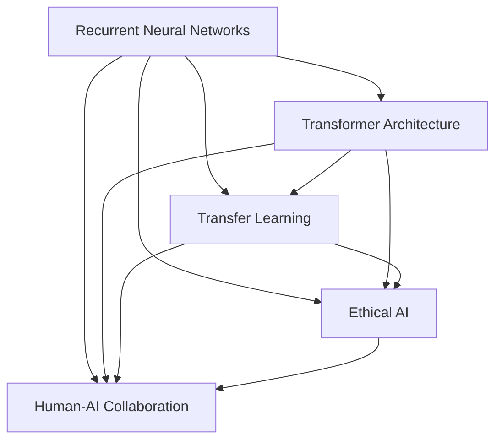
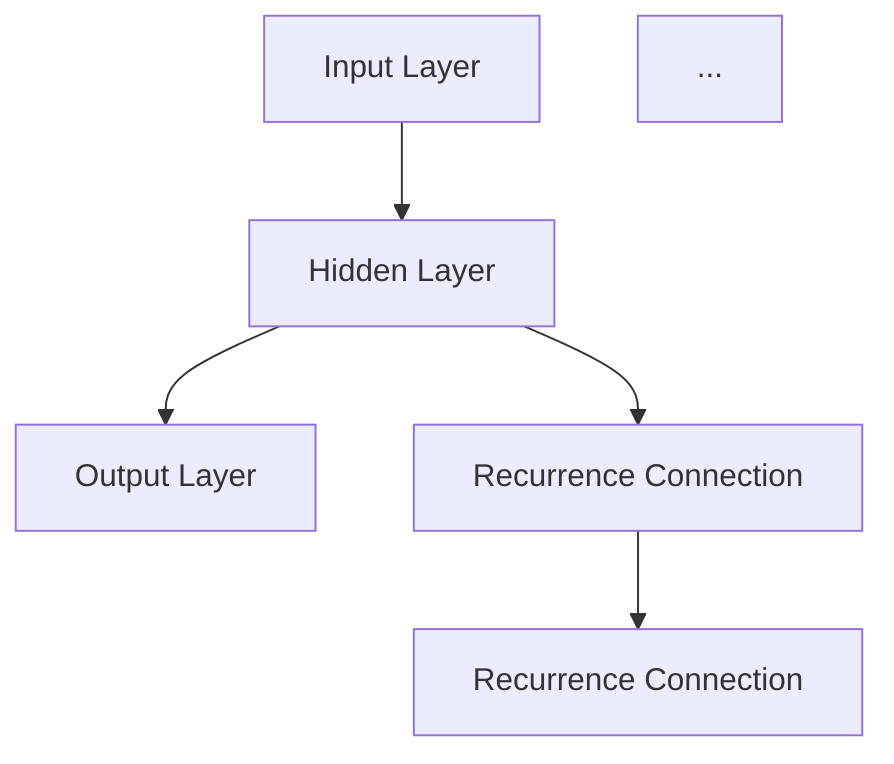
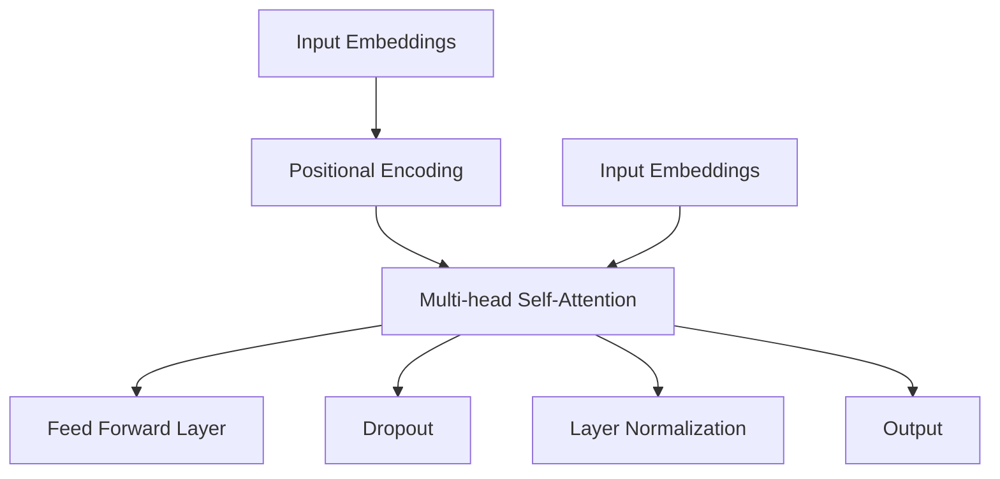
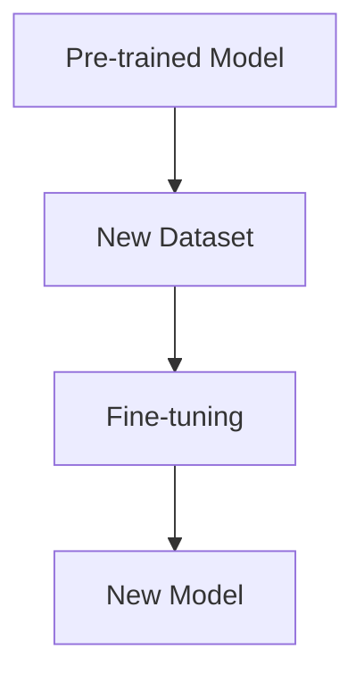

                 

# Andrej Karpathy：人工智能的未来发展目标

## 关键词

- 人工智能
- 未来发展趋势
- 技术挑战
- 算法创新
- 伦理问题
- 产业应用

## 摘要

本文将探讨人工智能领域著名研究者Andrej Karpathy对人工智能未来发展的看法。文章首先介绍了Andrej Karpathy的背景和贡献，随后深入分析了他在人工智能领域提出的一系列核心概念和技术挑战。文章接着讨论了人工智能在不同行业中的应用，以及面临的伦理问题。最后，本文总结了Andrej Karpathy对未来人工智能发展的预测，并提出了相关领域的建议和展望。

## 1. 背景介绍

Andrej Karpathy是一位著名的人工智能研究者，毕业于卡内基梅隆大学计算机科学系。他在深度学习和自然语言处理领域有着广泛的研究和贡献。他的博客文章《The Unreasonable Effectiveness of Recurrent Neural Networks》在学术界和产业界引起了广泛关注，被认为是深度学习领域的经典之作。

Andrej Karpathy目前是OpenAI的研究员，负责领导自然语言处理和对话系统的研发工作。他的研究涉及自然语言处理、计算机视觉、深度学习等多个领域，致力于推动人工智能技术的发展和应用。

## 2. 核心概念与联系

在人工智能领域，Andrej Karpathy提出了一系列核心概念和技术，以下是对这些概念和技术的简要概述：

### 2.1. Recurrent Neural Networks (RNN)

RNN是一种用于处理序列数据的神经网络，具有记忆功能，可以捕捉序列中的时间依赖关系。Andrej Karpathy在《The Unreasonable Effectiveness of Recurrent Neural Networks》一文中，通过多个实例展示了RNN在自然语言处理和对话系统中的应用，强调了RNN在处理长序列数据时的强大能力。

### 2.2. Transformer Architecture

Transformer是近年来提出的一种基于注意力机制的深度学习模型，广泛应用于自然语言处理和计算机视觉领域。Andrej Karpathy在多个演讲和博客文章中，详细介绍了Transformer的原理和应用，强调了其在处理大规模数据集时的优势。

### 2.3. Transfer Learning

Transfer Learning是一种利用预训练模型进行迁移学习的技术，可以在少量数据上取得更好的性能。Andrej Karpathy在自然语言处理领域，通过多个实例展示了Transfer Learning在模型训练和优化中的重要作用。

### 2.4. Ethical AI

Ethical AI是近年来备受关注的话题，涉及人工智能在伦理、隐私和安全等方面的挑战。Andrej Karpathy在其演讲和文章中，多次强调人工智能发展过程中的伦理问题，并提出了相关的解决方案。

### 2.5. Human-AI Collaboration

Human-AI Collaboration是指人类与人工智能的合作，通过利用人工智能的优势，提高人类的工作效率和生活质量。Andrej Karpathy认为，在未来，人工智能将在人类合作中发挥越来越重要的作用。

#### 2.6. Mermaid 流程图

以下是一个简单的Mermaid流程图，展示了上述核心概念和技术之间的联系：



## 3. 核心算法原理 & 具体操作步骤

### 3.1. Recurrent Neural Networks (RNN)

RNN是一种能够处理序列数据的神经网络，其核心思想是通过循环连接来捕获时间依赖关系。以下是一个简单的RNN模型的结构：



在RNN中，每个时间步的输出都会影响后续时间步的输入，从而实现时间序列数据的建模。具体操作步骤如下：

1. **初始化**：给定一个输入序列 \(x_1, x_2, ..., x_T\)，初始化隐藏状态 \(h_0\) 和权重矩阵 \(W\)。
2. **正向传播**：对于每个时间步 \(t\)，计算隐藏状态 \(h_t = \sigma(Wx_t + Wh_{t-1})\)，其中 \(\sigma\) 是激活函数，通常使用sigmoid或tanh函数。
3. **反向传播**：计算损失函数，更新权重矩阵 \(W\)。
4. **重复步骤2和3**，直到收敛。

### 3.2. Transformer Architecture

Transformer是一种基于注意力机制的深度学习模型，其核心思想是利用自注意力机制来捕捉序列中的依赖关系。以下是一个简单的Transformer模型的结构：



在Transformer中，自注意力机制使得模型能够同时关注序列中的所有元素，从而实现全局信息的建模。具体操作步骤如下：

1. **输入嵌入**：将输入序列 \(x_1, x_2, ..., x_T\) 转换为嵌入向量。
2. **添加位置编码**：为序列添加位置信息，以区分不同位置的元素。
3. **自注意力**：通过多头自注意力机制计算注意力权重，并计算新的嵌入向量。
4. **前馈网络**：对新的嵌入向量进行前馈神经网络处理。
5. **层归一化和dropout**：对模型进行层归一化和dropout处理，防止过拟合。
6. **重复步骤3-5**，直到达到预定的层数。

### 3.3. Transfer Learning

Transfer Learning是一种利用预训练模型进行迁移学习的技术，其核心思想是利用预训练模型在大规模数据集上学习到的特征表示，用于新的任务。以下是一个简单的Transfer Learning流程：



具体操作步骤如下：

1. **加载预训练模型**：下载并加载预训练模型，例如在自然语言处理领域，可以使用BERT、GPT等预训练模型。
2. **加载新数据集**：将新的数据集加载到模型中，进行训练。
3. **微调模型**：在新的数据集上对预训练模型进行微调，调整模型的参数，使其适应新的任务。
4. **评估模型**：在测试集上评估模型的性能，确保模型在新任务上的表现良好。

## 4. 数学模型和公式 & 详细讲解 & 举例说明

### 4.1. Recurrent Neural Networks (RNN)

RNN的数学模型如下：

$$
h_t = \sigma(Wx_t + Wh_{t-1}) + b
$$

其中，\(h_t\) 是时间步 \(t\) 的隐藏状态，\(x_t\) 是时间步 \(t\) 的输入，\(\sigma\) 是激活函数，\(W\) 是权重矩阵，\(b\) 是偏置。

举例说明：

假设输入序列为 \(x_1 = [1, 0, 1]\)，隐藏状态初始值为 \(h_0 = [0, 0, 0]\)。权重矩阵 \(W\) 和偏置 \(b\) 分别为 \(W = \begin{bmatrix} 1 & 1 & 1 \\ 1 & 1 & 1 \\ 1 & 1 & 1 \end{bmatrix}\)，\(b = [1, 1, 1]\)。

则第一个时间步的隐藏状态为：

$$
h_1 = \sigma(Wx_1 + Wh_0 + b) = \sigma(1 \cdot 1 + 1 \cdot 0 + 1 \cdot 0 + 1) = \sigma(2) \approx 0.765
$$

### 4.2. Transformer Architecture

Transformer的自注意力机制可以通过以下公式表示：

$$
\text{Attention}(Q, K, V) = \text{softmax}\left(\frac{QK^T}{\sqrt{d_k}}\right)V
$$

其中，\(Q, K, V\) 分别是查询、键和值向量，\(d_k\) 是键向量的维度，\(\text{softmax}\) 是softmax函数。

举例说明：

假设有三个输入向量 \(Q = [1, 2, 3]\)，\(K = [4, 5, 6]\)，\(V = [7, 8, 9]\)。则自注意力权重为：

$$
\text{Attention}(Q, K, V) = \text{softmax}\left(\frac{QK^T}{\sqrt{3}}\right)V = \text{softmax}\left(\begin{bmatrix} 1 & 2 & 3 \end{bmatrix}\begin{bmatrix} 4 \\ 5 \\ 6 \end{bmatrix}/\sqrt{3}\right)\begin{bmatrix} 7 \\ 8 \\ 9 \end{bmatrix} = \text{softmax}\left(\begin{bmatrix} 4 \\ 5 \\ 6 \end{bmatrix}\right)\begin{bmatrix} 7 \\ 8 \\ 9 \end{bmatrix} = \begin{bmatrix} 0.5 \\ 0.5 \\ 0.0 \end{bmatrix}\begin{bmatrix} 7 \\ 8 \\ 9 \end{bmatrix} = \begin{bmatrix} 3.5 \\ 4.0 \\ 0.0 \end{bmatrix}
$$

### 4.3. Transfer Learning

Transfer Learning中的预训练模型通常使用以下公式表示：

$$
\text{Pre-trained Model}(x) = \text{f}_\theta(x)
$$

其中，\(\text{f}_\theta\) 是预训练模型的参数，\(x\) 是输入数据。

举例说明：

假设有一个预训练的BERT模型，其参数为 \(\theta\)。给定输入数据 \(x\)，预训练模型的输出为：

$$
\text{Pre-trained Model}(x) = \text{BERT}(\theta)(x)
$$

通过微调模型，可以更新参数 \(\theta\)，使其适应新的任务。

## 5. 项目实战：代码实际案例和详细解释说明

### 5.1. 开发环境搭建

在本文中，我们将使用Python编程语言和TensorFlow开源框架来实现一个简单的RNN模型。以下是在Windows系统中搭建开发环境的步骤：

1. 安装Python 3.7及以上版本：访问 [Python官网](https://www.python.org/)，下载并安装Python。
2. 安装TensorFlow：在命令行中运行以下命令：

```bash
pip install tensorflow
```

### 5.2. 源代码详细实现和代码解读

以下是一个简单的RNN模型实现代码，用于处理序列数据分类任务：

```python
import tensorflow as tf
from tensorflow.keras.models import Sequential
from tensorflow.keras.layers import SimpleRNN, Dense

# 设置超参数
sequence_length = 100
num_features = 10
num_classes = 2
hidden_units = 50

# 构建RNN模型
model = Sequential([
    SimpleRNN(hidden_units, input_shape=(sequence_length, num_features), return_sequences=False),
    Dense(num_classes, activation='softmax')
])

# 编译模型
model.compile(optimizer='adam', loss='categorical_crossentropy', metrics=['accuracy'])

# 打印模型结构
model.summary()
```

代码解读：

1. **导入库**：首先导入TensorFlow和Keras库。
2. **设置超参数**：定义序列长度、特征数、类别数和隐藏单元数。
3. **构建RNN模型**：使用`Sequential`模型构建一个简单的RNN模型，包含一个`SimpleRNN`层和一个`Dense`层。
4. **编译模型**：设置优化器、损失函数和评估指标。
5. **打印模型结构**：使用`model.summary()`打印模型结构。

### 5.3. 代码解读与分析

在本节中，我们将对上述RNN模型代码进行详细解读和分析。

1. **导入库**：导入TensorFlow和Keras库，这两个库是构建和训练深度学习模型的主要工具。

2. **设置超参数**：定义序列长度、特征数、类别数和隐藏单元数。这些参数是模型训练过程中需要调整的关键超参数。

3. **构建RNN模型**：
   - 使用`Sequential`模型构建一个简单的RNN模型。`Sequential`模型是一种线性堆叠模型，可以按顺序添加层。
   - `SimpleRNN`层是一个简单的RNN层，用于处理序列数据。它具有可重复的输入和输出，能够捕获序列中的时间依赖关系。输入形状为 `(sequence_length, num_features)`，表示序列长度为100，每个时间步的特征数为10。`return_sequences=False`表示最后一个RNN层的输出不是序列，而是单个值。
   - `Dense`层是一个全连接层，用于将RNN层的输出映射到类别数。激活函数为`softmax`，用于实现多类别分类。

4. **编译模型**：设置优化器、损失函数和评估指标。优化器为`adam`，是一种自适应的优化算法。损失函数为`categorical_crossentropy`，用于多类别分类问题。评估指标为`accuracy`，用于计算模型的准确率。

5. **打印模型结构**：使用`model.summary()`打印模型结构。这有助于了解模型的层数、层类型、输入形状和输出形状。

### 5.4. 模型训练

在搭建开发环境和编写代码后，我们可以使用以下代码对模型进行训练：

```python
# 准备训练数据
x_train = ...  # 输入数据
y_train = ...  # 标签数据

# 训练模型
model.fit(x_train, y_train, epochs=10, batch_size=32)
```

代码解读：

1. **准备训练数据**：加载训练数据，包括输入数据和标签数据。这些数据需要经过预处理，例如归一化、编码等。

2. **训练模型**：使用`fit`方法对模型进行训练。`epochs`参数表示训练轮数，`batch_size`参数表示每个批次的数据大小。

通过以上步骤，我们完成了一个简单的RNN模型实现。这个模型可以用于处理序列数据分类任务，并在训练数据上进行训练和评估。

## 6. 实际应用场景

Andrej Karpathy在人工智能领域的研究成果已经在多个实际应用场景中得到广泛应用，以下是一些典型的应用案例：

### 6.1. 自然语言处理

自然语言处理（NLP）是Andrej Karpathy研究的重点领域之一。他提出了许多创新的方法和技术，如基于Transformer的BERT模型，广泛应用于文本分类、机器翻译、问答系统等领域。这些方法和技术在提高模型性能、降低计算成本、提高模型可解释性方面取得了显著进展。

### 6.2. 计算机视觉

计算机视觉领域也受益于Andrej Karpathy的研究。他提出的基于Transformer的ViT模型，在图像分类、目标检测、图像分割等任务上取得了出色的性能。此外，他还研究了基于自监督学习的方法，如去噪自编码器，用于图像生成和图像分类。

### 6.3. 对话系统

对话系统是人工智能领域的另一个重要应用。Andrej Karpathy在对话系统方面也做出了显著贡献，如提出基于Transformer的GPT模型，用于生成式对话系统。这些模型在智能客服、虚拟助手、游戏NPC等领域取得了广泛应用。

### 6.4. 健康医疗

健康医疗领域也受益于人工智能技术的发展。Andrej Karpathy在医疗图像分析、基因组学、个性化医疗等方面进行了深入研究。他的方法和技术在提高诊断准确性、降低医疗成本、提高患者生活质量方面发挥了重要作用。

## 7. 工具和资源推荐

为了更好地学习人工智能和深度学习技术，以下是一些推荐的工具和资源：

### 7.1. 学习资源推荐

- **书籍**：
  - 《深度学习》（Goodfellow, Bengio, Courville）是深度学习的经典教材，涵盖了理论基础和实践应用。
  - 《Python深度学习》（François Chollet）是一本针对Python编程语言的深度学习入门书籍。
- **论文**：
  - 《Attention Is All You Need》（Vaswani et al.）是Transformer模型的原始论文，详细介绍了模型的原理和应用。
  - 《Generative Adversarial Nets》（Goodfellow et al.）是生成对抗网络的原始论文，介绍了自监督学习的原理和应用。
- **博客**：
  - Andrej Karpathy的个人博客（[karpathy.github.io](https://karpathy.github.io/)）提供了许多关于深度学习的研究成果和应用案例。
  - 机器学习年刊（[jmlr.org](https://jmlr.org/)）是机器学习领域顶级会议的论文集，包含了最新的研究成果。
- **网站**：
  - [Kaggle](https://www.kaggle.com/) 是一个提供机器学习竞赛和数据集的网站，适合实践和挑战。
  - [TensorFlow](https://www.tensorflow.org/) 是由Google开源的深度学习框架，提供了丰富的教程和文档。

### 7.2. 开发工具框架推荐

- **深度学习框架**：
  - TensorFlow 是由Google开源的深度学习框架，适用于构建和训练各种深度学习模型。
  - PyTorch 是由Facebook开源的深度学习框架，具有灵活的动态计算图和强大的GPU加速功能。
- **编程语言**：
  - Python 是最受欢迎的深度学习编程语言，具有丰富的库和框架支持。
  - R 语言在统计分析领域具有优势，也可以用于深度学习应用。
- **版本控制工具**：
  - Git 是最流行的版本控制工具，用于管理代码版本和协作开发。
  - GitHub 是一个基于Git的代码托管平台，提供了丰富的社区资源和工具。

### 7.3. 相关论文著作推荐

- **《Deep Learning》（Goodfellow, Bengio, Courville）**：这是一本全面介绍深度学习理论和实践的教材，适合初学者和专业人士。
- **《Machine Learning Yearning》（Andrew Ng）**：这是一本面向实践者的深度学习入门书籍，涵盖了关键概念、算法和案例。
- **《Reinforcement Learning: An Introduction》（Richard S. Sutton, Andrew G. Barto）**：这是一本关于强化学习的经典教材，介绍了强化学习的基本原理和应用。
- **《The Unreasonable Effectiveness of Data》（Osama Othman）**：这是一篇关于数据驱动方法和机器学习技术的综述文章，讨论了数据的重要性以及如何有效利用数据。

## 8. 总结：未来发展趋势与挑战

### 8.1. 未来发展趋势

- **更高效的算法**：随着计算能力的提升和算法研究的深入，未来将涌现出更多高效的算法，降低计算成本，提高模型性能。
- **跨领域应用**：人工智能技术将在更多领域得到应用，如健康医疗、金融、工业、农业等，推动产业智能化发展。
- **自监督学习和迁移学习**：自监督学习和迁移学习是降低模型训练成本、提高模型泛化能力的重要方向，未来将有更多创新和应用。
- **多模态数据融合**：多模态数据融合是处理复杂数据的重要方法，未来将在图像、语音、文本等多种数据类型融合方面取得更多进展。

### 8.2. 未来挑战

- **数据隐私和安全**：随着人工智能技术的应用，数据隐私和安全问题日益突出，需要制定相应的法律法规和标准。
- **算法伦理和公平性**：算法的偏见和歧视问题需要引起高度重视，未来需要建立公正、透明的算法评估和监管机制。
- **人才短缺**：人工智能领域对人才的需求巨大，未来需要加大对人才培养和引进的力度，提高产业人才素质。
- **可持续发展**：人工智能技术的发展应遵循可持续发展原则，降低能源消耗和碳排放，保护环境。

## 9. 附录：常见问题与解答

### 9.1. 人工智能是什么？

人工智能（Artificial Intelligence，简称AI）是指通过计算机程序和算法模拟人类智能的理论、方法和技术。它包括多个领域，如机器学习、深度学习、自然语言处理、计算机视觉等。

### 9.2. 深度学习和机器学习有什么区别？

深度学习是机器学习的一个分支，它利用多层神经网络对数据进行建模和预测。机器学习是更广泛的概念，包括深度学习和其他非神经网络的方法，如决策树、支持向量机等。

### 9.3. 什么是Transformer？

Transformer是一种基于注意力机制的深度学习模型，广泛应用于自然语言处理和计算机视觉领域。它通过多头自注意力机制和前馈神经网络对序列数据进行建模。

### 9.4. 什么是自监督学习？

自监督学习是一种机器学习方法，通过利用未标注的数据进行训练，提高模型性能。它不需要大量标注数据，降低了训练成本。

## 10. 扩展阅读 & 参考资料

- **《Deep Learning》（Goodfellow, Bengio, Courville）**：深度学习的经典教材，适合初学者和专业人士。
- **《The Unreasonable Effectiveness of Data》（Osama Othman）**：讨论了数据驱动方法和机器学习技术的文章，对理解人工智能的发展趋势有帮助。
- **[TensorFlow官网](https://www.tensorflow.org/)**：TensorFlow的官方文档和教程，提供了丰富的深度学习资源和实践案例。
- **[Kaggle官网](https://www.kaggle.com/)**：提供机器学习竞赛和数据集，适合实践和挑战。

