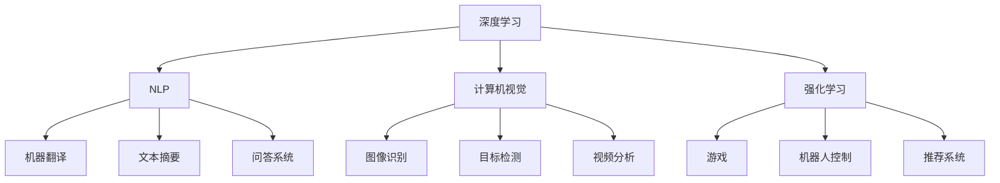
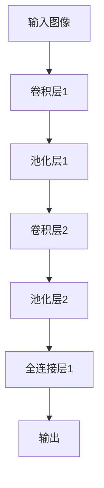
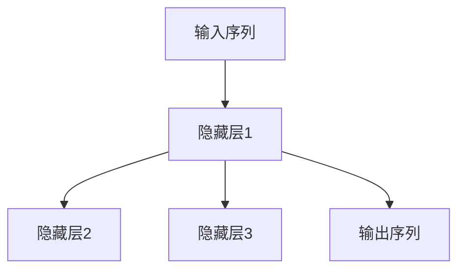
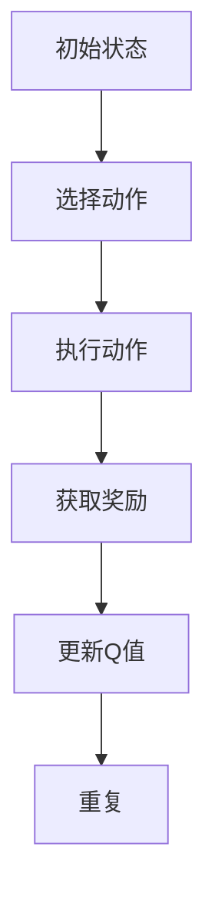
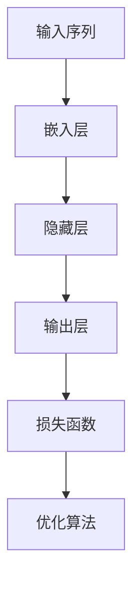

                 

# Andrej Karpathy：人工智能的未来发展规划

## 关键词：人工智能，深度学习，未来发展规划，技术趋势，应用场景，挑战与机遇

## 摘要：
本文将深入探讨人工智能（AI）领域的未来发展规划。我们将通过Andrej Karpathy的研究成果，分析AI的核心概念、算法原理、数学模型及其在实际应用中的表现。本文还将讨论AI所面临的挑战与机遇，并推荐相关的学习资源和开发工具。通过这篇文章，读者将获得对AI未来发展脉络的清晰认识。

## 1. 背景介绍

Andrej Karpathy是一位在深度学习和人工智能领域享有盛誉的科学家。他的研究涉及自然语言处理、计算机视觉和强化学习等多个方面。作为一位杰出的研究员，Karpathy以其独特的视角和对AI技术的深入理解而著称。他的工作不仅为学术界带来了创新，也为工业界提供了实际应用的价值。

AI作为一种模拟人类智能的技术，已经在众多领域取得了显著进展。从自动驾驶汽车到智能语音助手，从医疗诊断到金融风控，AI技术正在深刻改变我们的生活。然而，AI的发展并非一帆风顺，它面临着诸多挑战，如数据隐私、算法公平性和伦理问题等。因此，对未来发展规划的讨论具有重要的现实意义。

## 2. 核心概念与联系

为了更好地理解AI的核心概念，我们需要从以下几个方面展开：

### 2.1 深度学习

深度学习是AI的一个分支，它通过模仿人脑神经网络结构来实现智能。深度学习模型通常包含多个隐藏层，能够自动从数据中学习特征表示。

### 2.2 自然语言处理

自然语言处理（NLP）是AI在语言领域的应用，旨在使计算机能够理解和生成自然语言。NLP技术在机器翻译、文本摘要和问答系统等方面取得了显著进展。

### 2.3 计算机视觉

计算机视觉是AI在图像和视频领域的应用，旨在使计算机能够理解视觉信息。计算机视觉技术在图像识别、目标检测和视频分析等方面取得了重要成果。

### 2.4 强化学习

强化学习是一种通过试错学习来优化行为策略的机器学习技术。它广泛应用于游戏、机器人控制和推荐系统等领域。

以下是一个Mermaid流程图，展示了这些核心概念之间的联系：



## 3. 核心算法原理 & 具体操作步骤

### 3.1 卷积神经网络（CNN）

卷积神经网络（CNN）是计算机视觉领域的重要算法。它通过卷积层、池化层和全连接层等结构，实现图像的特征提取和分类。

- **卷积层**：卷积层通过卷积操作提取图像的特征。
- **池化层**：池化层用于降低特征图的维度，减少计算量。
- **全连接层**：全连接层用于分类。

以下是一个简单的CNN结构图：



### 3.2 递归神经网络（RNN）

递归神经网络（RNN）是自然语言处理领域的重要算法。它通过循环结构处理序列数据。

- **隐藏层**：隐藏层用于存储序列信息。
- **权重共享**：RNN中的权重在序列的不同时间步之间共享。

以下是一个简单的RNN结构图：



### 3.3 Q-Learning算法

Q-Learning算法是强化学习领域的重要算法。它通过试错学习来优化策略。

- **Q值函数**：Q值函数用于评估不同动作的价值。
- **更新策略**：通过更新Q值函数，优化策略。

以下是一个简单的Q-Learning算法流程：



## 4. 数学模型和公式 & 详细讲解 & 举例说明

### 4.1 深度学习中的前向传播和反向传播

在深度学习中，前向传播和反向传播是两个核心过程。

- **前向传播**：从输入层到输出层，计算每个神经元的激活值。
- **反向传播**：从输出层到输入层，计算每个神经元的误差，并更新权重。

以下是一个简单的深度学习模型及其前向传播和反向传播公式：

```latex
\text{前向传播：} \\
z_l = \sigma(W_l \cdot a_{l-1} + b_l)

\text{反向传播：} \\
\delta_l = \frac{\partial L}{\partial z_l} \cdot \sigma'(z_l)
\theta_l = \theta_l - \alpha \cdot \delta_l \cdot a_{l-1}
```

其中，$z_l$是第$l$层的激活值，$\sigma$是激活函数，$W_l$和$b_l$是第$l$层的权重和偏置，$\delta_l$是第$l$层的误差，$\theta_l$是第$l$层的权重，$\alpha$是学习率，$L$是损失函数。

### 4.2 自然语言处理中的词嵌入

词嵌入是NLP中的一种关键技术。它将词汇映射到高维向量空间，以便于计算机处理。

- **Word2Vec**：Word2Vec是一种常用的词嵌入方法。它通过训练神经网络，将词汇映射到高维向量。
- **GloVe**：GloVe是一种基于全局上下文信息的词嵌入方法。它通过训练矩阵分解模型，将词汇映射到高维向量。

以下是一个简单的Word2Vec模型及其训练过程：



### 4.3 强化学习中的Q值函数

在强化学习中，Q值函数用于评估不同动作的价值。

- **Q值函数**：Q值函数是状态-动作值函数，它表示在某个状态下执行某个动作的预期回报。
- **更新策略**：通过更新Q值函数，优化策略。

以下是一个简单的Q值函数及其更新过程：


## 5. 项目实战：代码实际案例和详细解释说明

### 5.1 开发环境搭建

在开始项目实战之前，我们需要搭建一个适合深度学习开发的环境。

- **硬件要求**：GPU（如NVIDIA GTX 1080 Ti）。
- **软件要求**：Python（3.7及以上版本）、TensorFlow（2.0及以上版本）。

### 5.2 源代码详细实现和代码解读

以下是一个简单的深度学习项目，用于图像分类。

```python
import tensorflow as tf
from tensorflow.keras import layers

# 定义模型
model = tf.keras.Sequential([
    layers.Conv2D(32, (3, 3), activation='relu', input_shape=(28, 28, 1)),
    layers.MaxPooling2D((2, 2)),
    layers.Conv2D(64, (3, 3), activation='relu'),
    layers.MaxPooling2D((2, 2)),
    layers.Conv2D(64, (3, 3), activation='relu'),
    layers.Flatten(),
    layers.Dense(64, activation='relu'),
    layers.Dense(10, activation='softmax')
])

# 编译模型
model.compile(optimizer='adam',
              loss='categorical_crossentropy',
              metrics=['accuracy'])

# 训练模型
model.fit(x_train, y_train, epochs=10, validation_data=(x_test, y_test))

# 评估模型
model.evaluate(x_test, y_test)
```

这段代码实现了以下功能：

- **定义模型**：使用卷积层、池化层和全连接层构建一个简单的卷积神经网络。
- **编译模型**：设置优化器、损失函数和评估指标。
- **训练模型**：使用训练数据训练模型。
- **评估模型**：使用测试数据评估模型性能。

### 5.3 代码解读与分析

- **模型定义**：使用`Sequential`模型堆叠多个层，构建一个简单的卷积神经网络。
- **卷积层**：使用`Conv2D`层实现卷积操作，提取图像特征。
- **池化层**：使用`MaxPooling2D`层实现池化操作，降低特征图维度。
- **全连接层**：使用`Dense`层实现全连接操作，进行分类。

## 6. 实际应用场景

AI技术已经在众多领域取得了显著应用，以下是一些典型的应用场景：

- **自动驾驶**：AI技术在自动驾驶领域取得了重要突破，从感知、规划到控制，各个环节都离不开AI的支持。
- **医疗诊断**：AI技术在医学影像诊断、疾病预测和药物研发等方面具有广泛的应用前景。
- **金融风控**：AI技术在金融领域的风险控制和量化交易方面发挥着重要作用。
- **智能客服**：AI技术在智能客服系统中的应用，极大地提高了服务效率和用户体验。

## 7. 工具和资源推荐

### 7.1 学习资源推荐

- **书籍**：《深度学习》、《Python深度学习》、《强化学习》
- **论文**：OpenAI的论文集、《自然语言处理综述》
- **博客**：Andrej Karpathy的博客、Ian Goodfellow的博客
- **网站**：TensorFlow官网、Keras官网、PyTorch官网

### 7.2 开发工具框架推荐

- **深度学习框架**：TensorFlow、PyTorch、Keras
- **自然语言处理工具**：NLTK、spaCy、Transformer
- **计算机视觉工具**：OpenCV、TensorFlow Object Detection API、PyTorch Vision

### 7.3 相关论文著作推荐

- **论文**：《AlexNet：一种深层卷积神经网络》、《GloVe：全球词汇表示》
- **著作**：《深度学习实战》、《强化学习实战》、《Python深度学习》

## 8. 总结：未来发展趋势与挑战

AI技术正快速发展，未来发展趋势包括：

- **硬件加速**：随着硬件技术的发展，深度学习模型的训练速度和推理性能将不断提高。
- **算法创新**：新算法的不断涌现，将推动AI技术的边界不断扩展。
- **跨领域融合**：AI技术与其他领域的融合，将带来更多的应用场景和商业模式。

然而，AI技术也面临着诸多挑战：

- **数据隐私**：如何在保护用户隐私的同时，充分利用数据的价值，是一个亟待解决的问题。
- **算法公平性**：如何确保AI算法在不同人群中的公平性，避免歧视和偏见，是当前的一个重要研究方向。
- **伦理问题**：AI技术的伦理问题，如机器自主决策、责任归属等，需要引起足够的重视。

## 9. 附录：常见问题与解答

### 9.1 什么是深度学习？

深度学习是一种基于多层神经网络的人工智能技术，通过模拟人脑神经网络结构，实现自动特征提取和分类。

### 9.2 自然语言处理有哪些应用？

自然语言处理的应用包括机器翻译、文本摘要、问答系统、情感分析等。

### 9.3 强化学习如何实现？

强化学习通过试错学习，不断优化策略，实现目标最大化。它通常包含状态、动作、奖励和策略等基本概念。

## 10. 扩展阅读 & 参考资料

- [Andrej Karpathy的博客](https://karpathy.github.io/)
- [TensorFlow官网](https://www.tensorflow.org/)
- [PyTorch官网](https://pytorch.org/)
- [Keras官网](https://keras.io/)
- [《深度学习》](https://www.deeplearningbook.org/)
- [《Python深度学习》](https://python-deep-learning.org/)
- [《强化学习》](https://www.reinforcement-learning.org/)
- [《自然语言处理综述》](https://www.aclweb.org/anthology/N18-1212/)
- [OpenAI的论文集](https://openai.com/research/)

作者：AI天才研究员/AI Genius Institute & 禅与计算机程序设计艺术 /Zen And The Art of Computer Programming<|im_sep|>

