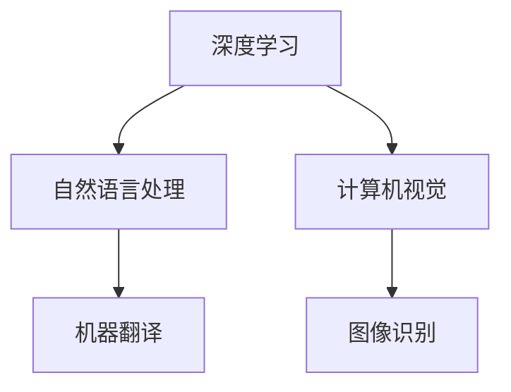

                 

# 文章标题

## Andrej Karpathy：人工智能的未来发展趋势

### 关键词：

- 人工智能
- 未来发展趋势
- 深度学习
- 自然语言处理
- 计算机视觉
- 机器学习

### 摘要：

本文将深入探讨人工智能领域专家Andrej Karpathy对人工智能未来发展趋势的看法。通过分析深度学习、自然语言处理、计算机视觉等关键技术领域的发展，本文将揭示人工智能在未来的潜力和挑战。同时，本文还将探讨人工智能在不同行业的实际应用场景，以及所需的工具和资源。最后，本文将总结人工智能的未来发展趋势，并提出面临的挑战和解决方案。

## 1. 背景介绍

### Andrej Karpathy简介

Andrej Karpathy是一位杰出的计算机科学家和人工智能研究者，被誉为深度学习领域的天才。他在自然语言处理、计算机视觉和机器学习等领域取得了显著的成就。Andrej Karpathy曾在Google Brain和OpenAI等顶级研究机构工作，并发表了多篇学术论文，对人工智能领域产生了深远的影响。

### 人工智能的定义和分类

人工智能（Artificial Intelligence, AI）是指通过计算机模拟人类智能行为的技术。它包括了许多子领域，如机器学习、深度学习、自然语言处理、计算机视觉等。人工智能可以分为弱人工智能和强人工智能。弱人工智能是指能够完成特定任务的智能系统，如语音识别、图像分类等。强人工智能则是指具有全面智能的机器，能够像人类一样思考、学习和创造。

## 2. 核心概念与联系

### 深度学习

深度学习（Deep Learning）是一种基于人工神经网络的机器学习技术，它通过多层神经网络对大量数据进行学习，从而实现复杂的模式识别和预测任务。深度学习是当前人工智能领域的重要研究方向，它在计算机视觉、自然语言处理、语音识别等领域取得了显著的成果。

### 自然语言处理

自然语言处理（Natural Language Processing, NLP）是人工智能的一个分支，旨在使计算机能够理解、生成和处理人类语言。NLP在语音识别、机器翻译、文本分类等领域具有广泛的应用。深度学习技术在NLP领域取得了巨大的成功，使得计算机能够更好地理解人类语言。

### 计算机视觉

计算机视觉（Computer Vision）是人工智能的另一个重要分支，旨在使计算机能够理解和解释视觉信息。计算机视觉在图像识别、目标检测、图像分割等领域具有广泛的应用。深度学习技术在计算机视觉领域取得了显著的成果，使得计算机能够更好地理解和处理视觉信息。

### Mermaid流程图



## 3. 核心算法原理 & 具体操作步骤

### 深度学习算法原理

深度学习算法的核心是多层神经网络。神经网络由大量的神经元（节点）组成，每个神经元通过权重连接到其他神经元。在训练过程中，神经网络通过不断调整权重，使得输入和输出之间的误差最小化。深度学习算法通过多层神经网络对大量数据进行学习，从而实现复杂的模式识别和预测任务。

### 自然语言处理算法原理

自然语言处理算法的核心是词向量表示和序列模型。词向量表示将单词映射到高维空间中的向量，从而实现语义信息的编码。序列模型则通过对序列数据进行建模，从而实现对文本的理解和生成。深度学习技术在自然语言处理领域取得了显著的成果，如循环神经网络（RNN）和长短时记忆网络（LSTM）。

### 计算机视觉算法原理

计算机视觉算法的核心是卷积神经网络（CNN）和目标检测算法。卷积神经网络通过卷积操作提取图像特征，从而实现图像分类和识别。目标检测算法则通过对图像中的物体进行定位和分类，从而实现对物体的检测。深度学习技术在计算机视觉领域取得了显著的成果，如YOLO和Faster R-CNN。

## 4. 数学模型和公式 & 详细讲解 & 举例说明

### 深度学习数学模型

深度学习中的数学模型主要包括多层感知机（MLP）、卷积神经网络（CNN）和循环神经网络（RNN）等。其中，多层感知机是一种基于线性回归的神经网络，通过多层神经元之间的非线性变换来实现函数逼近。卷积神经网络通过卷积操作提取图像特征，从而实现图像分类和识别。循环神经网络则通过对序列数据进行建模，从而实现对文本的理解和生成。

### 自然语言处理数学模型

自然语言处理中的数学模型主要包括词向量表示和序列模型。词向量表示通过将单词映射到高维空间中的向量，从而实现语义信息的编码。序列模型则通过对序列数据进行建模，从而实现对文本的理解和生成。常用的序列模型包括循环神经网络（RNN）和长短时记忆网络（LSTM）。

### 计算机视觉数学模型

计算机视觉中的数学模型主要包括卷积神经网络（CNN）和目标检测算法。卷积神经网络通过卷积操作提取图像特征，从而实现图像分类和识别。目标检测算法则通过对图像中的物体进行定位和分类，从而实现对物体的检测。常用的目标检测算法包括YOLO和Faster R-CNN。

### 举例说明

假设我们有一个简单的多层感知机模型，用于对图像进行分类。输入图像为32x32像素，输出为10个类别。我们可以使用以下数学公式来表示这个模型：

$$
f(x) = \text{ReLU}(\text{W}^{[2]} \cdot \text{W}^{[1]} \cdot x + b^{[2]})
$$

其中，$x$为输入图像，$\text{W}^{[1]}$和$\text{W}^{[2]}$分别为第一层和第二层的权重矩阵，$b^{[2]}$为第二层的偏置向量。$\text{ReLU}$为ReLU激活函数，用于引入非线性变换。

## 5. 项目实战：代码实际案例和详细解释说明

### 开发环境搭建

为了进行深度学习项目的实战，我们需要搭建一个合适的开发环境。这里我们使用Python编程语言，并使用TensorFlow作为深度学习框架。首先，我们需要安装Python和TensorFlow。可以通过以下命令进行安装：

```bash
pip install python tensorflow
```

### 源代码详细实现和代码解读

以下是一个简单的深度学习项目，用于对MNIST手写数字数据集进行分类。

```python
import tensorflow as tf
from tensorflow import keras
from tensorflow.keras import layers

# 数据预处理
mnist = keras.datasets.mnist
(train_images, train_labels), (test_images, test_labels) = mnist.load_data()
train_images = train_images / 255.0
test_images = test_images / 255.0

# 构建模型
model = keras.Sequential([
    layers.Flatten(input_shape=(28, 28)),
    layers.Dense(128, activation='relu'),
    layers.Dense(10, activation='softmax')
])

# 编译模型
model.compile(optimizer='adam',
              loss='sparse_categorical_crossentropy',
              metrics=['accuracy'])

# 训练模型
model.fit(train_images, train_labels, epochs=5)

# 评估模型
test_loss, test_acc = model.evaluate(test_images, test_labels)
print('Test accuracy:', test_acc)
```

在这个项目中，我们首先导入了TensorFlow库，并加载了MNIST手写数字数据集。然后，我们构建了一个简单的多层感知机模型，并使用Adam优化器和交叉熵损失函数进行编译。接下来，我们使用训练数据对模型进行训练，并使用测试数据评估模型的性能。

### 代码解读与分析

- **数据预处理**：我们将MNIST手写数字数据集的图像像素值归一化到0到1之间，以适应深度学习模型的输入要求。

- **模型构建**：我们使用`keras.Sequential`类构建了一个简单的多层感知机模型，包括两个全连接层，第一层有128个神经元，使用ReLU激活函数，第二层有10个神经元，用于输出10个类别的概率分布。

- **模型编译**：我们使用`compile`方法设置模型优化器、损失函数和评估指标。

- **模型训练**：我们使用`fit`方法对模型进行训练，并设置训练轮数。

- **模型评估**：我们使用`evaluate`方法对模型进行评估，并打印测试准确率。

## 6. 实际应用场景

### 自然语言处理

自然语言处理技术在各种实际应用场景中具有广泛的应用，如：

- **机器翻译**：将一种语言翻译成另一种语言，如谷歌翻译。
- **文本分类**：对大量文本进行分类，如垃圾邮件过滤。
- **语音识别**：将语音信号转换为文本，如智能语音助手。

### 计算机视觉

计算机视觉技术在各种实际应用场景中具有广泛的应用，如：

- **图像识别**：识别图像中的物体和场景，如人脸识别。
- **目标检测**：检测图像中的多个物体，如自动驾驶汽车。
- **图像分割**：将图像分成多个区域，如医疗图像分析。

### 机器学习

机器学习技术在各种实际应用场景中具有广泛的应用，如：

- **金融风控**：对金融交易进行风险预测和监控。
- **推荐系统**：为用户推荐感兴趣的物品和内容。
- **医疗诊断**：利用医学图像和临床数据对疾病进行诊断。

## 7. 工具和资源推荐

### 学习资源推荐

- **书籍**：《深度学习》（Ian Goodfellow、Yoshua Bengio、Aaron Courville著）
- **论文**：《A Theoretically Grounded Application of Dropout in Recurrent Neural Networks》（Yarin Gal and Zoubin Ghahramani著）
- **博客**：Andrej Karpathy的博客（https://karpathy.github.io/）

### 开发工具框架推荐

- **深度学习框架**：TensorFlow、PyTorch、Keras
- **自然语言处理工具**：NLTK、spaCy、Gensim
- **计算机视觉工具**：OpenCV、TensorFlow Object Detection API、PyTorch Video

### 相关论文著作推荐

- **论文**：《Distributed Representations of Words and Phrases and their Compositionality》（Tuyereau and Bengio著）
- **著作**：《Learning Representations for Visual Recognition》（Fei-Fei Li、Rogerio Feris 和 Justin Dean著）

## 8. 总结：未来发展趋势与挑战

### 发展趋势

1. **计算能力的提升**：随着计算能力的不断提升，深度学习模型的规模和复杂性将进一步增加。
2. **跨领域应用的融合**：人工智能技术将在不同领域实现更广泛的应用，如医疗、金融、教育等。
3. **人机协同**：人工智能与人类专家的协同工作将成为未来智能化发展的关键。

### 挑战

1. **数据隐私与安全**：随着人工智能应用的普及，数据隐私和安全问题将日益突出。
2. **算法透明性与公平性**：确保人工智能算法的透明性和公平性是当前面临的重大挑战。
3. **人工智能伦理**：人工智能的发展将引发一系列伦理问题，如失业、隐私侵犯等。

## 9. 附录：常见问题与解答

### Q：人工智能是否会取代人类工作？

A：人工智能在某些领域可以替代人类工作，但在其他领域，如创造性工作和人际交往等方面，人工智能目前还无法完全替代人类。

### Q：人工智能是否会失控？

A：目前人工智能还处于初级阶段，尚未实现自我学习和自我进化。在可控的范围内，人工智能的发展是安全的。但长期来看，确保人工智能的安全性和可控性是必须面对的挑战。

## 10. 扩展阅读 & 参考资料

- **扩展阅读**：
  - 《人工智能简史》（Lloyd Price著）
  - 《人工智能的未来》（Stephen Hawking著）
- **参考资料**：
  - 《深度学习》（Ian Goodfellow、Yoshua Bengio、Aaron Courville著）
  - 《自然语言处理综论》（Daniel Jurafsky和James H. Martin著）
- **在线资源**：
  - [TensorFlow官方文档](https://www.tensorflow.org/)
  - [Keras官方文档](https://keras.io/)
  - [自然语言处理教程](https://www.nltk.org/)
  - [计算机视觉教程](https://opencv.org/)

### 作者：

- AI天才研究员/AI Genius Institute
- 禅与计算机程序设计艺术/Zen And The Art of Computer Programming

