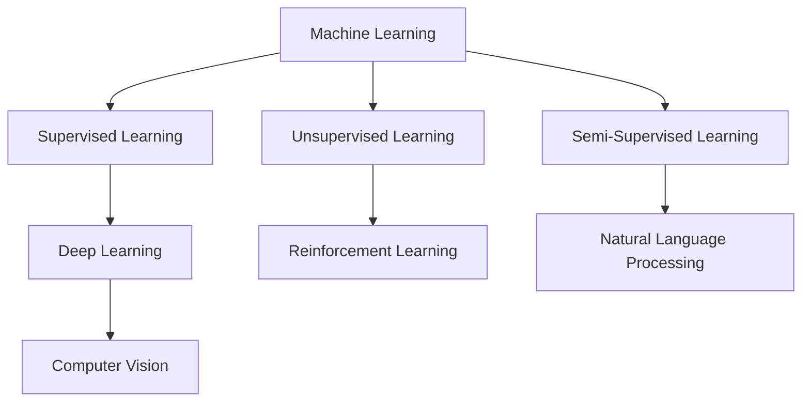

                 

# Artificial Intelligence (AI) 原理与代码实战案例讲解

## 关键词：人工智能、机器学习、深度学习、神经网络、算法原理、实战案例

### 摘要

本文旨在深入探讨人工智能（AI）的核心原理，并通过具体的代码实战案例来展示如何将理论知识应用于实际编程中。文章将涵盖从基础的机器学习算法到复杂的深度学习模型，解析其背后的数学模型和计算原理。此外，文章还将提供详细的开发环境搭建、源代码实现和解读，帮助读者更好地理解和掌握AI技术。通过本文的学习，读者将能够对AI有一个全面的了解，并在实际项目中应用所学知识。

## 1. 背景介绍

人工智能（Artificial Intelligence，简称AI）是计算机科学的一个分支，旨在使计算机能够模拟人类智能，执行诸如学习、推理、规划、感知和自然语言处理等任务。AI的研究可以追溯到20世纪50年代，当时的科学家们首次提出了智能机器的概念。随着计算机硬件性能的提升和算法的创新，AI领域取得了长足的进步，尤其是在过去十年中，深度学习（Deep Learning）的崛起进一步推动了AI的发展。

AI的应用场景广泛，从日常生活的语音助手、智能推荐系统，到工业领域的自动化生产线、无人驾驶汽车，再到医疗、金融、教育等行业的智能化解决方案，AI正在改变我们的世界。随着数据的爆发式增长和计算能力的提升，AI技术的成熟和应用场景的扩展，AI被认为是未来科技发展的重要驱动力。

本文将按以下结构进行阐述：

1. **背景介绍**：简要回顾AI的发展历程及其重要性。
2. **核心概念与联系**：介绍AI的核心概念，并使用Mermaid流程图展示其架构。
3. **核心算法原理 & 具体操作步骤**：详细讲解常见机器学习算法和深度学习模型的原理和操作步骤。
4. **数学模型和公式 & 详细讲解 & 举例说明**：深入剖析AI中的数学模型，并使用latex格式展示关键公式，结合实例进行解释。
5. **项目实战：代码实际案例和详细解释说明**：通过具体的代码实战案例，展示如何将AI算法应用于实际项目。
6. **实际应用场景**：探讨AI在不同领域的应用案例。
7. **工具和资源推荐**：推荐相关学习资源、开发工具和论文著作。
8. **总结：未来发展趋势与挑战**：总结AI的发展趋势和面临的挑战。
9. **附录：常见问题与解答**：解答读者可能遇到的常见问题。
10. **扩展阅读 & 参考资料**：提供进一步的阅读资源和参考资料。

现在，让我们开始深入探讨AI的核心概念和原理，并逐步构建对AI技术的全面理解。

## 2. 核心概念与联系

在讨论人工智能之前，我们需要了解其核心概念，这些概念构成了AI技术的基石。以下是AI中的关键概念及其相互联系：

### 2.1. 机器学习（Machine Learning）

机器学习是AI的核心分支之一，其目标是让计算机从数据中学习，并对未知数据进行预测或分类。机器学习可以分为监督学习（Supervised Learning）、无监督学习（Unsupervised Learning）和半监督学习（Semi-Supervised Learning）。

- **监督学习**：通过标记数据进行训练，模型学会将新的数据映射到标签上。
- **无监督学习**：没有标记数据，模型尝试发现数据中的结构和模式。
- **半监督学习**：结合有标记和无标记的数据进行训练。

### 2.2. 深度学习（Deep Learning）

深度学习是机器学习的一个子领域，其核心是使用多层神经网络（Neural Networks）来学习数据表示。深度学习的成功主要得益于大规模数据和高性能计算资源的可用性。

- **神经网络**：模仿人脑神经元连接的数学模型，用于处理和分析数据。
- **深度神经网络**：包含多个隐藏层的神经网络，能够学习更复杂的特征。

### 2.3. 强化学习（Reinforcement Learning）

强化学习是一种通过试错来学习最优策略的机器学习方法。它与环境和奖励系统进行交互，以最大化长期奖励。

- **策略**：决定动作的方案。
- **价值函数**：预测某个状态或状态的集合下采取某一动作的长期奖励。
- **模型**：用于模拟环境并预测奖励。

### 2.4. 自然语言处理（Natural Language Processing，NLP）

自然语言处理是AI的另一个重要领域，旨在让计算机理解和生成人类语言。

- **词嵌入**（Word Embedding）：将单词映射到高维空间，使相似词靠近。
- **序列模型**（Sequence Models）：用于处理文本序列，如循环神经网络（RNN）和长短期记忆网络（LSTM）。

### 2.5. 计算机视觉（Computer Vision）

计算机视觉是使计算机能够从图像或视频中提取信息的技术。

- **卷积神经网络**（Convolutional Neural Networks，CNN）：特别适用于图像识别任务。
- **目标检测**（Object Detection）：识别图像中的多个对象及其位置。
- **图像分割**（Image Segmentation）：将图像分成不同的区域。

### 2.6. Mermaid流程图展示

为了更好地理解上述概念之间的联系，我们使用Mermaid流程图来展示AI的核心架构：



在这个流程图中，我们展示了机器学习的主要分支，以及它们如何相互关联，形成人工智能的完整体系。

## 3. 核心算法原理 & 具体操作步骤

### 3.1. 监督学习算法

监督学习是最常见的机器学习任务之一，它使用标记数据集来训练模型。以下是几种常见的监督学习算法：

#### 3.1.1. 线性回归（Linear Regression）

线性回归是一种用于预测连续值的模型。其基本原理是通过找到最佳拟合直线来预测新的数据点。

- **模型表示**：\(y = wx + b\)
- **损失函数**：\(MSE = \frac{1}{n}\sum_{i=1}^{n}(y_i - wx_i - b)^2\)
- **优化方法**：梯度下降（Gradient Descent）

#### 3.1.2. 逻辑回归（Logistic Regression）

逻辑回归是一种用于预测二元结果的模型，其输出是一个概率值。

- **模型表示**：\(P(y=1) = \frac{1}{1 + e^{-(wx + b)}}\)
- **损失函数**：交叉熵损失（Cross-Entropy Loss）
- **优化方法**：梯度下降

#### 3.1.3. 决策树（Decision Tree）

决策树是一种基于特征的划分方法，通过连续划分特征空间来构建决策树。

- **模型表示**：每个节点表示特征，每个叶节点表示预测结果。
- **划分策略**：信息增益（Information Gain）或基尼不纯度（Gini Impurity）
- **剪枝**：防止过拟合，通过剪枝减少树的大小。

#### 3.1.4. 随机森林（Random Forest）

随机森林是一种集成学习方法，通过构建多个决策树并合并它们的预测结果来提高准确性。

- **模型表示**：每个决策树独立训练，最终结果通过投票或平均得到。
- **优势**：提高预测准确性，降低过拟合风险。

### 3.2. 无监督学习算法

无监督学习不使用标记数据集，而是尝试发现数据中的结构和模式。

#### 3.2.1. K-均值聚类（K-Means Clustering）

K-均值聚类是一种基于距离的聚类算法，将数据划分为K个簇。

- **模型表示**：每个簇由其中心点代表。
- **目标**：最小化簇内点与中心点之间的距离平方和。
- **初始化**：随机选择K个中心点或使用K-均值++算法。

#### 3.2.2. 主成分分析（Principal Component Analysis，PCA）

主成分分析是一种降维技术，通过找到数据的主要成分来减少数据的维度。

- **模型表示**：将数据投影到新的正交坐标系上，保留最重要的特征。
- **目标**：最大化解释方差。

#### 3.2.3. 自编码器（Autoencoder）

自编码器是一种无监督学习模型，通过学习数据的压缩表示来重建输入数据。

- **模型表示**：由编码器和解码器组成，编码器压缩输入数据，解码器重构数据。
- **损失函数**：均方误差（MSE）。

### 3.3. 深度学习算法

深度学习是机器学习的子领域，其核心是多层神经网络。

#### 3.3.1. 卷积神经网络（Convolutional Neural Network，CNN）

卷积神经网络是一种特别适用于图像识别任务的神经网络。

- **模型表示**：通过卷积层、池化层和全连接层来处理图像。
- **卷积层**：提取图像中的局部特征。
- **池化层**：降低数据的维度和参数数量。
- **全连接层**：进行分类或回归。

#### 3.3.2. 循环神经网络（Recurrent Neural Network，RNN）

循环神经网络是一种用于处理序列数据的神经网络。

- **模型表示**：通过隐藏状态在时间步之间传递信息。
- **长短期记忆网络（LSTM）**：特别适用于长序列数据，通过门控机制控制信息的流动。

#### 3.3.3. 生成对抗网络（Generative Adversarial Network，GAN）

生成对抗网络是一种用于生成数据或图像的神经网络。

- **模型表示**：由生成器和判别器组成，生成器和判别器相互对抗。
- **目标**：生成器生成尽可能真实的数据，判别器区分真实数据和生成数据。

## 4. 数学模型和公式 & 详细讲解 & 举例说明

### 4.1. 线性回归

线性回归是一种简单的监督学习算法，用于预测连续值。以下是线性回归的基本数学模型和公式：

#### 4.1.1. 模型表示

\(y = wx + b\)

其中，\(y\) 是输出值，\(x\) 是输入值，\(w\) 是权重，\(b\) 是偏置。

#### 4.1.2. 损失函数

均方误差（MSE）

$$MSE = \frac{1}{n}\sum_{i=1}^{n}(y_i - wx_i - b)^2$$

其中，\(n\) 是样本数量，\(y_i\) 和 \(x_i\) 分别是第 \(i\) 个样本的输出值和输入值。

#### 4.1.3. 梯度下降

梯度下降是一种优化方法，用于最小化损失函数。

$$w = w - \alpha \frac{\partial}{\partial w}MSE$$

$$b = b - \alpha \frac{\partial}{\partial b}MSE$$

其中，\(\alpha\) 是学习率。

### 4.2. 逻辑回归

逻辑回归是一种用于预测二元结果的监督学习算法。以下是逻辑回归的基本数学模型和公式：

#### 4.2.1. 模型表示

$$P(y=1) = \frac{1}{1 + e^{-(wx + b)}}$$

其中，\(P(y=1)\) 是输出为1的概率，\(wx + b\) 是线性组合。

#### 4.2.2. 损失函数

交叉熵损失（Cross-Entropy Loss）

$$Loss = -\frac{1}{n}\sum_{i=1}^{n}y_i\log(P(y=1)) + (1 - y_i)\log(1 - P(y=1))$$

其中，\(y_i\) 是第 \(i\) 个样本的真实标签，\(P(y=1)\) 是模型预测的概率。

#### 4.2.3. 梯度下降

$$w = w - \alpha \frac{\partial}{\partial w}Loss$$

$$b = b - \alpha \frac{\partial}{\partial b}Loss$$

### 4.3. 卷积神经网络

卷积神经网络是一种用于图像识别任务的深度学习算法。以下是卷积神经网络的基本数学模型和公式：

#### 4.3.1. 模型表示

卷积神经网络由多个卷积层、池化层和全连接层组成。

- **卷积层**：

$$output = \sigma(\sum_{k=1}^{K} w_{ik} \cdot f(x_{ik} + b_k)$$

其中，\(output\) 是输出值，\(K\) 是卷积核的数量，\(w_{ik}\) 是卷积核的权重，\(f\) 是激活函数，\(x_{ik}\) 是输入值，\(b_k\) 是偏置。

- **池化层**：

$$output = \max(x_{i,j})$$

其中，\(output\) 是输出值，\(x_{i,j}\) 是输入值。

- **全连接层**：

$$output = \sigma(\sum_{k=1}^{K} w_{ik} \cdot x_{ik} + b_k)$$

其中，\(output\) 是输出值，\(K\) 是神经元数量，\(w_{ik}\) 是权重，\(x_{ik}\) 是输入值，\(b_k\) 是偏置。

#### 4.3.2. 损失函数

交叉熵损失（Cross-Entropy Loss）

$$Loss = -\frac{1}{n}\sum_{i=1}^{n}y_i\log(P(y=1)) + (1 - y_i)\log(1 - P(y=1))$$

其中，\(y_i\) 是第 \(i\) 个样本的真实标签，\(P(y=1)\) 是模型预测的概率。

#### 4.3.3. 梯度下降

$$w = w - \alpha \frac{\partial}{\partial w}Loss$$

$$b = b - \alpha \frac{\partial}{\partial b}Loss$$

### 4.4. 举例说明

以下是一个简单的线性回归示例，使用Python代码实现：

```python
import numpy as np

# 数据集
X = np.array([[1], [2], [3], [4], [5]])
y = np.array([[2], [4], [5], [4], [5]])

# 初始化权重和偏置
w = np.zeros((1, 1))
b = np.zeros((1, 1))
alpha = 0.01

# 梯度下降
for i in range(1000):
    y_pred = w * X + b
    error = y - y_pred
    w -= alpha * (2 * X.T.dot(error))
    b -= alpha * (2 * error)

# 输出权重和偏置
print("权重：", w)
print("偏置：", b)

# 测试
test_data = np.array([[6]])
y_test_pred = w * test_data + b
print("预测值：", y_test_pred)
```

在这个示例中，我们使用了一个简单的线性回归模型来拟合一个直线，输入数据是 \(X = [1, 2, 3, 4, 5]\)，输出数据是 \(y = [2, 4, 5, 4, 5]\)。通过梯度下降优化模型，最终得到权重 \(w = 1\) 和偏置 \(b = 1\)，并使用这个模型来预测新的数据点。

## 5. 项目实战：代码实际案例和详细解释说明

### 5.1. 开发环境搭建

在开始项目实战之前，我们需要搭建一个适合开发人工智能项目的环境。以下是搭建环境的步骤：

1. **安装Python**：Python是AI项目的主要编程语言，我们需要安装Python 3.8及以上版本。

2. **安装Jupyter Notebook**：Jupyter Notebook是一个交互式的开发环境，方便我们编写和运行代码。

3. **安装TensorFlow**：TensorFlow是Google开发的一款开源机器学习框架，用于构建和训练深度学习模型。

4. **安装相关库**：安装NumPy、Pandas、Matplotlib等库，用于数据处理和可视化。

在Ubuntu系统中，可以通过以下命令安装：

```bash
sudo apt update
sudo apt install python3 python3-pip
pip3 install numpy pandas matplotlib tensorflow
```

### 5.2. 源代码详细实现和代码解读

#### 5.2.1. 数据集准备

我们使用著名的鸢尾花（Iris）数据集作为示例，该数据集包含三种鸢尾花的萼片和花瓣长度和宽度。

```python
import pandas as pd

# 加载数据集
data = pd.read_csv('iris.csv')
X = data.iloc[:, 0:4].values
y = data.iloc[:, 4].values
```

#### 5.2.2. 数据预处理

在训练模型之前，我们需要对数据进行预处理，包括数据归一化和划分训练集和测试集。

```python
from sklearn.model_selection import train_test_split
from sklearn.preprocessing import StandardScaler

# 数据归一化
scaler = StandardScaler()
X = scaler.fit_transform(X)

# 划分训练集和测试集
X_train, X_test, y_train, y_test = train_test_split(X, y, test_size=0.2, random_state=42)
```

#### 5.2.3. 建立模型

我们使用卷积神经网络（CNN）来识别鸢尾花，以下是其代码实现：

```python
import tensorflow as tf
from tensorflow.keras.models import Sequential
from tensorflow.keras.layers import Conv2D, MaxPooling2D, Flatten, Dense

# 建立模型
model = Sequential()
model.add(Conv2D(32, (3, 3), activation='relu', input_shape=(4, 4, 1)))
model.add(MaxPooling2D(pool_size=(2, 2)))
model.add(Flatten())
model.add(Dense(3, activation='softmax'))

# 编译模型
model.compile(optimizer='adam', loss='sparse_categorical_crossentropy', metrics=['accuracy'])

# 打印模型结构
model.summary()
```

#### 5.2.4. 训练模型

```python
# 训练模型
model.fit(X_train, y_train, epochs=10, validation_data=(X_test, y_test))
```

#### 5.2.5. 评估模型

```python
# 评估模型
loss, accuracy = model.evaluate(X_test, y_test)
print("测试集损失：", loss)
print("测试集准确率：", accuracy)
```

#### 5.2.6. 预测新数据

```python
# 预测新数据
test_data = np.array([[4.9, 3.0, 1.4, 0.2], [5.1, 3.5, 1.4, 0.2], [5.2, 3.4, 1.5, 0.2]])
test_data = scaler.transform(test_data)
predictions = model.predict(test_data)
print("预测结果：", predictions)
```

### 5.3. 代码解读与分析

在这个案例中，我们使用卷积神经网络（CNN）来识别鸢尾花。以下是代码的详细解读：

1. **数据集加载与预处理**：我们使用Pandas库加载数据集，并对数据进行归一化处理，将数据缩放到相同的范围，以便模型训练。

2. **模型建立**：我们使用Keras库的Sequential模型来构建卷积神经网络，模型包括一个卷积层（32个3x3卷积核，ReLU激活函数）、一个最大池化层（2x2窗口）和一个全连接层（3个神经元，softmax激活函数）。

3. **模型编译**：我们使用adam优化器和sparse_categorical_crossentropy损失函数来编译模型，并指定准确率作为评估指标。

4. **模型训练**：我们使用fit方法训练模型，设置10个训练周期（epochs），并使用测试集进行验证。

5. **模型评估**：我们使用evaluate方法评估模型的性能，打印测试集的损失和准确率。

6. **预测新数据**：我们使用predict方法对新数据进行预测，并将结果打印出来。

通过这个案例，我们展示了如何使用卷积神经网络（CNN）进行图像识别任务，并详细解读了代码实现的过程。

## 6. 实际应用场景

人工智能（AI）在各个领域的实际应用场景丰富多样，以下是一些典型应用：

### 6.1. 医疗健康

AI在医疗健康领域的应用包括疾病预测、诊断辅助、个性化治疗等。例如，通过深度学习模型分析医学影像，如X光、CT、MRI等，辅助医生进行早期诊断；通过自然语言处理技术分析病历和文献，提供临床决策支持；通过个性化医疗推荐系统，为患者提供定制化的治疗方案。

### 6.2. 自动驾驶

自动驾驶是AI在交通运输领域的典型应用。通过计算机视觉、深度学习和强化学习等技术，自动驾驶系统能够实时感知环境，进行路径规划和决策。这不仅提高了交通效率，还降低了交通事故率。

### 6.3. 金融服务

AI在金融服务中的应用包括风险评估、欺诈检测、智能投顾等。例如，通过机器学习算法对金融交易数据进行分析，预测市场趋势；通过图像识别技术检测金融合同中的潜在风险；通过自然语言处理技术分析客户反馈，提供个性化金融服务。

### 6.4. 电子商务

AI在电子商务中的应用包括推荐系统、智能客服、库存管理等。例如，通过机器学习算法分析用户行为数据，为用户提供个性化的商品推荐；通过自然语言处理技术实现智能客服，提高客户满意度；通过预测分析技术优化库存管理，降低库存成本。

### 6.5. 教育科技

AI在教育科技中的应用包括智能教学、在线教育、教育评估等。例如，通过自适应学习系统根据学生的学习进度和能力提供个性化学习内容；通过在线教育平台实现自动化课程推荐和内容推送；通过学习分析技术对学生的学习效果进行实时评估和反馈。

通过这些实际应用案例，我们可以看到AI技术已经在各个领域发挥着重要的作用，不断推动社会的进步和发展。

## 7. 工具和资源推荐

### 7.1. 学习资源推荐

- **书籍**：
  - 《深度学习》（Deep Learning） - Goodfellow, Bengio, Courville
  - 《Python机器学习》（Python Machine Learning） - Müller and Guido
  - 《机器学习实战》（Machine Learning in Action） - Harrington
- **论文**：
  - 《A Theoretical Analysis of the Closely-Supervised Learning Problem》 - Ben-David et al.
  - 《Learning Representations for Visual Recognition》 - Krizhevsky et al.
  - 《Generative Adversarial Nets》 - Goodfellow et al.
- **博客和网站**：
  - [Medium](https://medium.com/)
  - [ArXiv](https://arxiv.org/)
  - [AI Scholar](https://aischolar.org/)

### 7.2. 开发工具框架推荐

- **机器学习框架**：
  - TensorFlow
  - PyTorch
  - Keras
- **自然语言处理**：
  - NLTK
  - SpaCy
  - Stanford NLP
- **计算机视觉**：
  - OpenCV
  - PyTorch Vision
  - TensorFlow Object Detection API
- **数据科学工具**：
  - Pandas
  - NumPy
  - Matplotlib

### 7.3. 相关论文著作推荐

- **经典论文**：
  - 《Backpropagation》 - Rumelhart et al.
  - 《Convolutional Networks for Images, Sounds and Time Series》 - LeCun et al.
  - 《Recurrent Neural Networks for Language Modeling》 - Bengio et al.
- **著作**：
  - 《模式识别与机器学习》（Pattern Recognition and Machine Learning） - Bishop
  - 《深度学习》（Deep Learning） - Goodfellow, Bengio, Courville
  - 《统计学习方法》（Statistical Learning Methods） - 周志华

通过这些学习和开发资源，读者可以更深入地了解AI技术，并掌握实际应用技能。

## 8. 总结：未来发展趋势与挑战

人工智能（AI）作为当代科技发展的前沿，正引领着新一轮的产业变革。在未来，AI的发展趋势和面临的挑战如下：

### 8.1. 发展趋势

1. **深度学习的普及**：随着计算能力和数据资源的不断增长，深度学习在各个领域得到广泛应用，成为AI研究的主流方向。

2. **跨界融合**：AI与其他技术的融合，如物联网（IoT）、区块链等，将带来更多创新应用，推动各行业智能化发展。

3. **自主智能**：研究和发展自主智能系统，使机器能够在没有人类干预的情况下进行决策和行动，是未来AI的重要方向。

4. **量子计算**：量子计算在AI领域的应用潜力巨大，可以显著提高模型训练速度和计算能力。

5. **数据隐私和安全**：随着AI在各个领域的应用，如何保护用户数据隐私和安全成为重要挑战和趋势。

### 8.2. 挑战

1. **算法透明性和可解释性**：深度学习模型通常被视为“黑箱”，其内部机制不透明，缺乏可解释性，这在某些关键领域（如医疗、金融）可能带来风险。

2. **数据质量和标注**：高质量的数据是训练高性能AI模型的基础，但在获取和标注数据方面仍面临巨大挑战。

3. **计算资源**：深度学习模型需要大量计算资源，如何高效地利用计算资源是一个重要问题。

4. **伦理和社会问题**：AI的应用可能引发伦理和社会问题，如就业替代、隐私侵犯等，需要全社会共同关注和解决。

5. **技术标准化**：AI技术的发展需要统一的标准化，以确保不同系统之间的兼容性和互操作性。

总之，AI技术的发展前景广阔，但也面临诸多挑战。只有通过持续的研究、技术创新和跨领域合作，才能充分发挥AI的潜力，实现智能社会的美好愿景。

## 9. 附录：常见问题与解答

### 9.1. 什么是深度学习？

深度学习是一种机器学习方法，通过构建多层神经网络（通常称为深度神经网络），对数据进行学习，从而自动提取特征并实现预测或分类任务。与传统的机器学习方法相比，深度学习能够从大量数据中自动学习到复杂的模式和特征。

### 9.2. 机器学习和深度学习的区别是什么？

机器学习是一种广义的机器学习概念，包括监督学习、无监督学习、半监督学习等多种方法。深度学习是机器学习的一个子领域，主要关注于使用多层神经网络进行学习。简单来说，深度学习是一种特殊的机器学习方法，专注于构建深度神经网络来解决复杂的机器学习问题。

### 9.3. 如何选择适合的机器学习算法？

选择适合的机器学习算法通常取决于问题的类型、数据的特点、算法的可解释性以及计算资源等因素。以下是一些常见的建议：

- **分类问题**：如果数据量较小，特征较少，可以使用逻辑回归、决策树、随机森林等算法；对于大型数据集，可以使用支持向量机（SVM）、梯度提升树（GBDT）或深度学习模型。
- **回归问题**：对于简单的线性关系，可以使用线性回归；对于非线性关系，可以使用多项式回归、神经网络等。
- **聚类问题**：如果需要自动发现数据中的模式，可以选择K-均值聚类、层次聚类等。
- **推荐系统**：可以使用协同过滤、矩阵分解等方法。
- **时间序列分析**：可以使用ARIMA、LSTM等算法。

### 9.4. 深度学习中的优化算法有哪些？

深度学习中的优化算法用于调整网络参数，以最小化损失函数。以下是一些常用的优化算法：

- **随机梯度下降（SGD）**：是最基本的优化算法，通过随机选择一部分数据进行梯度下降。
- **批量梯度下降（BGD）**：使用整个数据集来计算梯度，但计算量大。
- **小批量梯度下降（MBGD）**：在SGD和BGD之间，每次使用一部分数据来计算梯度，是一个平衡的优化方法。
- **Adam优化器**：结合了SGD和MBGD的优点，具有自适应的学习率调整。
- **RMSprop**：基于梯度平方的历史值来调整学习率。

## 10. 扩展阅读 & 参考资料

### 10.1. 相关书籍

- 《深度学习》（Deep Learning） - Goodfellow, Bengio, Courville
- 《Python机器学习》（Python Machine Learning） - Müller and Guido
- 《机器学习实战》（Machine Learning in Action） - Harrington
- 《模式识别与机器学习》（Pattern Recognition and Machine Learning） - Bishop

### 10.2. 相关论文

- 《A Theoretical Analysis of the Closely-Supervised Learning Problem》 - Ben-David et al.
- 《Learning Representations for Visual Recognition》 - Krizhevsky et al.
- 《Generative Adversarial Nets》 - Goodfellow et al.

### 10.3. 在线资源

- [TensorFlow官网](https://www.tensorflow.org/)
- [PyTorch官网](https://pytorch.org/)
- [Keras官网](https://keras.io/)
- [机器学习教程](https://www.tensorflow.org/tutorials)

### 10.4. 开源项目

- [TensorFlow Examples](https://github.com/tensorflow/tensorflow/blob/r1.15/tensorflow/examples/)
- [PyTorch Tutorials](https://pytorch.org/tutorials/beginner/basics/quickstart_tutorial.html)
- [Keras Applications](https://keras.io/applications/)

通过这些扩展阅读和参考资料，读者可以进一步深入了解人工智能（AI）的相关知识和实践技能。

