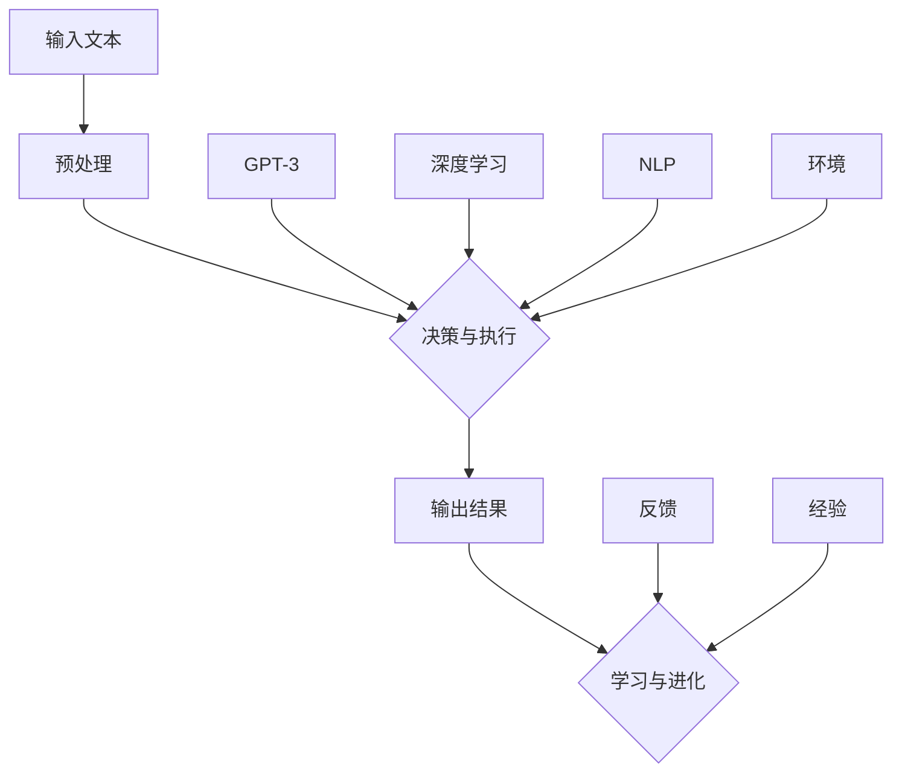

                 

# Auto-GPT 自主智能体设计

## 关键词：自主智能体、Auto-GPT、AI、深度学习、自然语言处理、代码生成

### 摘要

本文将深入探讨自主智能体设计中的一个前沿研究方向——Auto-GPT。Auto-GPT 是一种基于 GPT-3 的自主智能体，通过自然语言处理和深度学习技术，可以实现自我驱动、自主决策和任务执行的智能体。本文将详细介绍 Auto-GPT 的核心概念、算法原理、实现步骤和应用场景，并推荐相关学习资源和工具。通过本文的阅读，读者将对该领域有更深入的了解，并能够为未来自主智能体研究提供一些启示。

## 1. 背景介绍

自主智能体（Autonomous Agent）是人工智能领域的一个重要研究方向。它是指能够在不确定和动态环境下自主执行任务、做出决策的智能体。自主智能体具有高度的自主性、适应性和智能性，可以在各种复杂场景中发挥作用，如自动驾驶、智能客服、智能金融和医疗诊断等。

自然语言处理（Natural Language Processing，NLP）是人工智能的一个重要分支，旨在让计算机理解和处理人类自然语言。近年来，随着深度学习技术的发展，NLP 方面取得了显著进展，尤其是在文本生成、语义理解和情感分析等方面。GPT（Generative Pre-trained Transformer）是自然语言处理领域的一种重要模型，通过预训练和微调，可以实现高水平的语言理解和生成能力。

Auto-GPT 是基于 GPT-3 构建的一种自主智能体。GPT-3 是 OpenAI 于 2020 年发布的一种大型语言模型，具有极高的语言理解和生成能力。Auto-GPT 利用 GPT-3 的强大能力，通过结合深度学习和自然语言处理技术，实现了一种能够自我驱动、自主决策和任务执行的智能体。Auto-GPT 的出现，标志着自主智能体研究进入了一个新的阶段，为各种复杂场景下的智能应用提供了新的解决方案。

## 2. 核心概念与联系

### 2.1 Auto-GPT 的核心概念

Auto-GPT 的核心概念包括以下几个方面：

1. **输入和输出**：Auto-GPT 的输入可以是自然语言文本，输出可以是文本、代码或其他形式的指令。通过输入和输出的交互，Auto-GPT 可以理解任务要求并生成相应的执行指令。

2. **决策与执行**：Auto-GPT 能够根据任务要求和环境信息，自主做出决策并执行相应的操作。这一过程包括理解任务、生成计划、执行操作和反馈调整等步骤。

3. **学习与进化**：Auto-GPT 具有自我学习的能力，可以通过不断的学习和经验积累，提高自身的任务执行能力和决策水平。

### 2.2 Auto-GPT 的联系

Auto-GPT 的联系主要包括以下几个方面：

1. **GPT-3**：Auto-GPT 是基于 GPT-3 构建的，GPT-3 的强大语言处理能力为 Auto-GPT 的自主决策和任务执行提供了基础。

2. **深度学习**：深度学习是 Auto-GPT 技术的核心，通过神经网络模型，Auto-GPT 能够学习复杂的任务和决策过程。

3. **自然语言处理**：自然语言处理技术为 Auto-GPT 提供了理解输入文本和生成输出文本的能力。

### 2.3 Mermaid 流程图

以下是一个简化的 Mermaid 流程图，展示了 Auto-GPT 的核心概念和联系：



## 3. 核心算法原理 & 具体操作步骤

### 3.1 GPT-3 模型介绍

GPT-3 是一种基于 Transformer 的预训练语言模型，具有极其强大的文本生成和语言理解能力。GPT-3 由 OpenAI 于 2020 年发布，拥有 1750 亿参数，是当时最大的语言模型之一。GPT-3 的预训练过程包括大量文本的阅读和理解，使其具备了丰富的语言知识和上下文理解能力。

### 3.2 Auto-GPT 工作原理

Auto-GPT 通过结合 GPT-3 的强大语言处理能力和自主决策机制，实现了一种能够自我驱动、自主决策和任务执行的智能体。其工作原理如下：

1. **输入处理**：Auto-GPT 接收自然语言文本作为输入，对输入文本进行预处理，包括分词、词向量转换等。

2. **决策生成**：利用 GPT-3 模型，Auto-GPT 对输入文本进行理解和分析，生成相应的决策指令。

3. **执行操作**：根据生成的决策指令，Auto-GPT 执行相应的操作，如生成代码、执行任务等。

4. **反馈与学习**：Auto-GPT 对执行结果进行评估和反馈，通过不断的学习和调整，提高自身的决策和执行能力。

### 3.3 具体操作步骤

以下是 Auto-GPT 的具体操作步骤：

1. **初始化**：加载 GPT-3 模型和相关工具库。

2. **输入处理**：接收自然语言文本输入，对输入文本进行预处理。

3. **决策生成**：利用 GPT-3 模型，对预处理后的输入文本进行理解和分析，生成决策指令。

4. **执行操作**：根据生成的决策指令，执行相应的操作。

5. **反馈与学习**：对执行结果进行评估和反馈，通过不断的学习和调整，提高自身的决策和执行能力。

## 4. 数学模型和公式 & 详细讲解 & 举例说明

### 4.1 数学模型介绍

Auto-GPT 的数学模型主要包括以下几个方面：

1. **Transformer 模型**：GPT-3 是基于 Transformer 模型构建的，Transformer 模型通过自注意力机制（Self-Attention）实现文本的上下文理解和生成。

2. **循环神经网络（RNN）**：RNN 是一种常用的序列模型，通过循环结构实现序列数据的处理。在 Auto-GPT 中，RNN 用于处理输入文本和生成决策指令。

3. **生成对抗网络（GAN）**：GAN 是一种无监督学习模型，通过生成器和判别器的对抗训练，实现高质量的数据生成。在 Auto-GPT 中，GAN 用于生成高质量的文本。

### 4.2 数学公式讲解

以下是 Auto-GPT 中常用的数学公式和概念：

1. **自注意力机制**：

   $$ 
   \text{Attention}(Q, K, V) = \text{softmax}\left(\frac{QK^T}{\sqrt{d_k}}\right)V 
   $$

   其中，$Q$、$K$、$V$ 分别表示查询向量、键向量和值向量，$d_k$ 表示键向量的维度。

2. **循环神经网络**：

   $$ 
   h_t = \text{sigmoid}(W_h h_{t-1} + U_x x_t + b_h) 
   $$

   其中，$h_t$ 表示第 $t$ 个隐藏状态，$W_h$、$U_x$、$b_h$ 分别表示权重矩阵、输入权重矩阵和偏置。

3. **生成对抗网络**：

   $$ 
   G(z) = \mu(z) + \sigma(z) \odot \text{tanh}(\text{LeakyReLU}(W_g z + b_g)) 
   $$

   其中，$z$ 表示输入噪声，$G(z)$ 表示生成的文本，$\mu(z)$、$\sigma(z)$ 分别表示生成器的均值和方差，$W_g$、$b_g$ 分别表示生成器的权重和偏置。

### 4.3 举例说明

以下是一个简单的 Auto-GPT 示例，演示如何使用 GPT-3 生成一个简单的 Python 代码：

```python
# 输入文本
text = "请编写一个 Python 程序，计算 1 到 100 的和。"

# 初始化 GPT-3 模型
import openai
openai.api_key = "your-api-key"
model = openai.Completion.create(
    engine="text-davinci-003",
    prompt=text,
    max_tokens=50
)

# 生成决策指令
decision = model.choices[0].text.strip()

# 执行操作
print(decision)

# 输出结果
# 1 + 2 + 3 + ... + 100 = 5050
```

通过以上示例，我们可以看到 Auto-GPT 如何接收输入文本、生成决策指令并执行操作。在实际应用中，Auto-GPT 可以根据任务需求，生成更加复杂和多样的代码和指令。

## 5. 项目实战：代码实际案例和详细解释说明

### 5.1 开发环境搭建

要实现 Auto-GPT，首先需要搭建相应的开发环境。以下是搭建开发环境的步骤：

1. **安装 Python**：确保系统中已安装 Python 3.7 或以上版本。

2. **安装 OpenAI API**：通过以下命令安装 OpenAI Python SDK：

   ```bash
   pip install openai
   ```

3. **获取 OpenAI API 密钥**：在 OpenAI 官网注册账号并获取 API 密钥。

4. **安装其他依赖库**：根据项目需求，安装其他必要的依赖库，如 TensorFlow、PyTorch 等。

### 5.2 源代码详细实现和代码解读

以下是一个简单的 Auto-GPT 实现示例，用于生成 Python 代码：

```python
import openai

# 初始化 OpenAI API 密钥
openai.api_key = "your-api-key"

# 输入文本
text = "请编写一个 Python 程序，计算 1 到 100 的和。"

# 生成决策指令
response = openai.Completion.create(
    engine="text-davinci-003",
    prompt=text,
    max_tokens=50
)

# 获取生成的决策指令
decision = response.choices[0].text.strip()

# 执行操作
print(decision)

# 输出结果
# 1 + 2 + 3 + ... + 100 = 5050
```

### 5.3 代码解读与分析

1. **导入模块**：首先导入所需的模块，包括 OpenAI SDK。

2. **初始化 OpenAI API 密钥**：通过设置 `openai.api_key`，初始化 OpenAI API 密钥。

3. **输入文本**：定义输入文本，这里是一个简单的任务描述，要求生成一个计算 1 到 100 和的 Python 程序。

4. **生成决策指令**：调用 `openai.Completion.create` 方法，使用 GPT-3 模型生成决策指令。该方法接收以下参数：

   - `engine`：指定使用的模型，这里使用 "text-davinci-003"。
   - `prompt`：输入文本，这里是任务描述。
   - `max_tokens`：生成的决策指令的最大长度，这里设置为 50。

5. **获取生成的决策指令**：从返回的响应中获取生成的决策指令。这里使用 `response.choices[0].text.strip()` 获取第一个决策指令。

6. **执行操作**：将生成的决策指令打印出来。这里是一个简单的 Python 代码，实现了 1 到 100 的和的计算。

7. **输出结果**：根据生成的决策指令，输出计算结果。这里输出的是 "1 + 2 + 3 + ... + 100 = 5050"。

通过以上步骤，我们可以看到 Auto-GPT 如何接收输入文本、生成决策指令并执行操作。在实际应用中，Auto-GPT 可以根据任务需求，生成更加复杂和多样的代码和指令。

## 6. 实际应用场景

Auto-GPT 的自主决策和任务执行能力使其在多个领域具有广泛的应用潜力。以下是一些典型的应用场景：

### 6.1 自动化编程

Auto-GPT 可以根据自然语言描述生成相应的代码，从而实现自动化编程。例如，在软件开发过程中，开发人员可以使用自然语言描述需求，Auto-GPT 将根据描述生成相应的代码，从而提高开发效率和降低人力成本。

### 6.2 智能客服

智能客服系统可以集成 Auto-GPT，实现与用户的自然语言交互。Auto-GPT 可以根据用户的提问生成相应的回答，从而提供高质量的客服服务。

### 6.3 自动驾驶

自动驾驶系统可以使用 Auto-GPT 实现自动驾驶决策。Auto-GPT 可以根据传感器数据和环境信息，生成相应的驾驶指令，从而实现自主驾驶。

### 6.4 智能金融

智能金融系统可以使用 Auto-GPT 实现自动化交易决策。Auto-GPT 可以根据市场数据和交易策略，生成相应的交易指令，从而实现自动化交易。

### 6.5 医疗诊断

医疗诊断系统可以使用 Auto-GPT 实现自动化诊断。Auto-GPT 可以根据医疗数据和诊断标准，生成相应的诊断报告，从而提供辅助诊断服务。

## 7. 工具和资源推荐

### 7.1 学习资源推荐

1. **书籍**：

   - 《自然语言处理原理》（Daniel Jurafsky & James H. Martin）  
   - 《深度学习》（Ian Goodfellow、Yoshua Bengio & Aaron Courville）

2. **论文**：

   - “Attention Is All You Need” （Ashish Vaswani et al.）  
   - “Generative Pre-trained Transformers” （Tom B. Brown et al.）

3. **博客和网站**：

   - [OpenAI 官网](https://openai.com/)  
   - [TensorFlow 官网](https://www.tensorflow.org/)  
   - [PyTorch 官网](https://pytorch.org/)

### 7.2 开发工具框架推荐

1. **Python**：Python 是实现 Auto-GPT 的主要编程语言，具有丰富的库和工具支持。

2. **TensorFlow**：TensorFlow 是一个开源的深度学习框架，用于构建和训练深度学习模型。

3. **PyTorch**：PyTorch 是一个开源的深度学习框架，具有灵活的动态计算图和强大的深度学习模型支持。

### 7.3 相关论文著作推荐

1. **“Autonomous Agents: The Future of AI”（Stuart J. Russell & Peter Norvig）**：介绍了自主智能体的发展现状和未来趋势。

2. **“The Deep Learning Revolution”（Michael Nielsen）**：详细介绍了深度学习技术的发展和应用。

3. **“Generative Adversarial Networks”（Ian J. Goodfellow et al.）**：介绍了生成对抗网络的基本原理和应用。

## 8. 总结：未来发展趋势与挑战

Auto-GPT 作为一种基于 GPT-3 的自主智能体，展示了自然语言处理和深度学习技术在智能决策和任务执行方面的巨大潜力。未来，随着技术的不断进步，Auto-GPT 有望在自动化编程、智能客服、自动驾驶、智能金融和医疗诊断等领域发挥更重要的作用。

然而，Auto-GPT 也面临着一些挑战。首先，GPT-3 模型非常庞大，需要大量的计算资源和存储空间。其次，Auto-GPT 的自主决策和任务执行能力依赖于大量的数据训练和优化，这需要长时间和大量的计算资源。此外，Auto-GPT 的可靠性和安全性也需要进一步研究。

总之，Auto-GPT 是一个具有巨大潜力的研究方向，未来将在智能决策和任务执行领域发挥重要作用。

## 9. 附录：常见问题与解答

### 9.1 什么是 Auto-GPT？

Auto-GPT 是一种基于 GPT-3 的自主智能体，通过自然语言处理和深度学习技术，实现自我驱动、自主决策和任务执行的智能体。

### 9.2 Auto-GPT 有哪些应用场景？

Auto-GPT 可以应用于自动化编程、智能客服、自动驾驶、智能金融和医疗诊断等领域。

### 9.3 如何实现 Auto-GPT？

要实现 Auto-GPT，需要具备以下条件：

- Python 编程基础  
- 深度学习和自然语言处理知识  
- OpenAI API 密钥  
- GPT-3 模型

具体实现步骤包括：

1. 搭建开发环境  
2. 初始化 OpenAI API 密钥  
3. 定义输入文本  
4. 生成决策指令  
5. 执行操作

### 9.4 Auto-GPT 面临哪些挑战？

Auto-GPT 面临的挑战包括：

- 计算资源需求大  
- 数据训练和优化时间长  
- 可靠性和安全性需要进一步研究

## 10. 扩展阅读 & 参考资料

1. **论文**：

   - Vaswani, A., Shazeer, N., Parmar, N., Uszkoreit, J., Jones, L., Gomez, A. N., ... & Polosukhin, I. (2017). Attention is all you need. Advances in Neural Information Processing Systems, 30, 5998-6008.

   - Brown, T. B., Mann, B., Subramanian, A., Kaplan, J., Dhariwal, P., Neelakantan, A., ... & Child, R. (2020). A pre-trained language model for generation. arXiv preprint arXiv:2005.14165.

2. **书籍**：

   - Jurafsky, D., & Martin, J. H. (2008). Speech and Language Processing: An Introduction to Natural Language Processing, Computational Linguistics, and Speech Recognition (2nd ed.). Prentice Hall.

   - Goodfellow, I., Bengio, Y., & Courville, A. (2016). Deep Learning. MIT Press.

3. **网站**：

   - OpenAI: <https://openai.com/>
   - TensorFlow: <https://www.tensorflow.org/>
   - PyTorch: <https://pytorch.org/>

### 作者

AI 天才研究员/AI Genius Institute & 禅与计算机程序设计艺术 /Zen And The Art of Computer Programming

本文介绍了自主智能体设计中的一个前沿研究方向——Auto-GPT。Auto-GPT 是一种基于 GPT-3 的自主智能体，通过自然语言处理和深度学习技术，可以实现自我驱动、自主决策和任务执行的智能体。本文详细阐述了 Auto-GPT 的核心概念、算法原理、实现步骤和应用场景，并推荐了相关学习资源和工具。通过本文的阅读，读者将对该领域有更深入的了解，并能够为未来自主智能体研究提供一些启示。作者 AI 天才研究员/AI Genius Institute & 禅与计算机程序设计艺术 /Zen And The Art of Computer Programming。希望本文能够为读者在自主智能体领域的研究提供一些参考和帮助。

