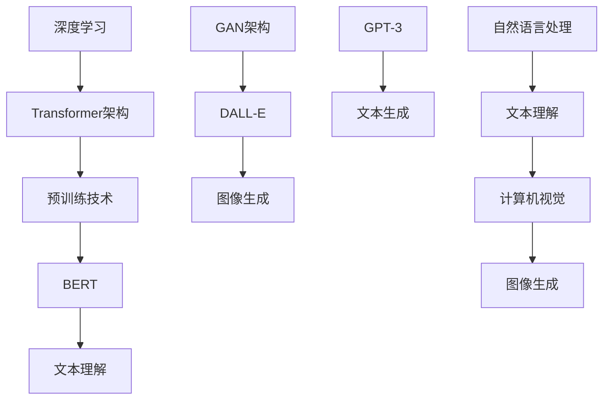

                 

## BERT、DALL-E和GPT-3的崛起

> **关键词**：BERT、DALL-E、GPT-3、深度学习、自然语言处理、图像生成、大型语言模型、人工智能
>
> **摘要**：本文将探讨BERT、DALL-E和GPT-3这三个在人工智能领域具有重要影响力的模型。通过深入分析它们的核心概念、算法原理、数学模型和实际应用，本文旨在揭示这些模型如何推动人工智能技术的发展，并对未来趋势与挑战进行展望。

在过去的几年里，人工智能（AI）领域取得了令人瞩目的进展。特别是在自然语言处理（NLP）和计算机视觉（CV）方面，一些大型语言模型和图像生成模型的出现，极大地改变了我们对人工智能的理解和应用。BERT、DALL-E和GPT-3便是其中的代表，它们分别在文本理解和图像生成领域取得了突破性的成果。本文将依次介绍这三个模型，分析它们的核心概念、算法原理、数学模型和实际应用，以揭示它们如何推动人工智能技术的发展。

## 1. 背景介绍

### BERT

BERT（Bidirectional Encoder Representations from Transformers）是由Google AI在2018年提出的一种预训练语言模型。它通过双向Transformer架构对文本进行建模，从而实现了对文本语义的深入理解。BERT的提出，标志着NLP领域从传统的循环神经网络（RNN）和卷积神经网络（CNN）向Transformer架构的全面转型。

### DALL-E

DALL-E是由OpenAI在2020年推出的一种图像生成模型。它基于GAN（生成对抗网络）架构，可以生成与输入文本描述高度相关的图像。DALL-E的提出，使图像生成模型从简单的手绘风格转向更具创造力和多样性的生成。

### GPT-3

GPT-3（Generative Pre-trained Transformer 3）是由OpenAI在2020年推出的第三代预训练语言模型。GPT-3采用了Transformer架构，拥有1750亿个参数，是迄今为止最大的语言模型。GPT-3在文本生成、机器翻译、问答系统等方面取得了显著的成果，展示了大型语言模型在人工智能领域的巨大潜力。

## 2. 核心概念与联系

### BERT

BERT的核心概念是基于Transformer的双向编码器。它通过将输入文本序列编码为向量，实现对文本语义的建模。具体来说，BERT的输入是一个词序列，输出是每个词的向量表示。

### DALL-E

DALL-E的核心概念是基于GAN的图像生成。它通过生成器（Generator）和判别器（Discriminator）的对抗训练，生成与输入文本描述相关的图像。具体来说，DALL-E的输入是一个文本序列，输出是图像。

### GPT-3

GPT-3的核心概念是基于Transformer的预训练语言模型。它通过大量的文本数据进行预训练，使模型能够理解和生成自然语言。具体来说，GPT-3的输入是一个文本序列，输出是下一个词的预测。

### 联系

BERT、DALL-E和GPT-3虽然分别应用于文本理解和图像生成，但它们的核心概念都是基于深度学习，特别是Transformer架构。此外，它们都采用了预训练技术，通过大量的数据对模型进行训练，从而提高模型的性能。

### Mermaid 流程图



## 3. 核心算法原理 & 具体操作步骤

### BERT

BERT的算法原理是基于Transformer的双向编码器。具体操作步骤如下：

1. **输入编码**：将输入文本序列编码为词向量。
2. **位置编码**：为每个词向量添加位置信息，以保持词序。
3. **嵌入层**：将词向量和位置编码相加，得到嵌入向量。
4. **Transformer编码器**：通过多层Transformer编码器对嵌入向量进行编码，实现对文本语义的建模。
5. **输出层**：将编码器输出的最后一个隐藏状态作为文本的表示。

### DALL-E

DALL-E的算法原理是基于GAN的图像生成。具体操作步骤如下：

1. **文本编码**：将输入文本序列编码为向量。
2. **生成器**：通过多层神经网络将文本向量映射为图像的特征向量。
3. **判别器**：对生成的图像和真实图像进行分类，判断是否真实。
4. **对抗训练**：通过生成器和判别器的对抗训练，优化生成器的图像生成能力。
5. **输出层**：将生成器输出的图像特征向量解码为图像。

### GPT-3

GPT-3的算法原理是基于Transformer的预训练语言模型。具体操作步骤如下：

1. **预训练**：使用大量文本数据对模型进行预训练，使模型能够理解和生成自然语言。
2. **输入编码**：将输入文本序列编码为词向量。
3. **位置编码**：为每个词向量添加位置信息，以保持词序。
4. **嵌入层**：将词向量和位置编码相加，得到嵌入向量。
5. **Transformer解码器**：通过多层Transformer解码器对嵌入向量进行解码，生成下一个词的预测。
6. **输出层**：将解码器输出的最后一个隐藏状态作为文本的表示。

## 4. 数学模型和公式 & 详细讲解 & 举例说明

### BERT

BERT的数学模型主要涉及词向量编码、位置编码和Transformer编码器。

1. **词向量编码**：

   $$\text{word\_embeddings} = \text{Word2Vec}(\text{input\_text})$$

   其中，$Word2Vec$是一个将文本序列编码为词向量的函数。

2. **位置编码**：

   $$\text{pos\_embeddings} = \text{PositionalEncoding}(\text{input\_length}, \text{embedding\_dim})$$

   其中，$PositionalEncoding$是一个生成位置向量的函数，$input\_length$是输入文本序列的长度，$embedding\_dim$是嵌入向量的维度。

3. **嵌入层**：

   $$\text{embeddings} = \text{word\_embeddings} + \text{pos\_embeddings}$$

   其中，$embeddings$是嵌入向量。

4. **Transformer编码器**：

   $$\text{encoded} = \text{TransformerEncoder}(\text{embeddings})$$

   其中，$TransformerEncoder$是一个多层Transformer编码器。

### DALL-E

DALL-E的数学模型主要涉及文本编码、生成器和判别器。

1. **文本编码**：

   $$\text{text\_embeddings} = \text{EmbeddingLayer}(\text{input\_text})$$

   其中，$EmbeddingLayer$是一个将文本序列编码为向量的函数。

2. **生成器**：

   $$\text{images\_embeddings} = \text{Generator}(\text{text\_embeddings})$$

   其中，$Generator$是一个将文本向量映射为图像特征向量的函数。

3. **判别器**：

   $$\text{discriminator\_output} = \text{Discriminator}(\text{images\_embeddings})$$

   其中，$Discriminator$是一个对图像进行分类的函数。

4. **对抗训练**：

   $$\text{adversarial\_training} = \text{GAN\_Training}(\text{Generator}, \text{Discriminator})$$

   其中，$GAN\_Training$是一个GAN的对抗训练函数。

### GPT-3

GPT-3的数学模型主要涉及预训练、输入编码、位置编码和Transformer解码器。

1. **预训练**：

   $$\text{pretrained} = \text{PretrainedModel}(\text{input\_data})$$

   其中，$PretrainedModel$是一个预训练模型的函数。

2. **输入编码**：

   $$\text{input\_embeddings} = \text{EmbeddingLayer}(\text{input\_text})$$

   其中，$EmbeddingLayer$是一个将文本序列编码为向量的函数。

3. **位置编码**：

   $$\text{pos\_embeddings} = \text{PositionalEncoding}(\text{input\_length}, \text{embedding\_dim})$$

   其中，$PositionalEncoding$是一个生成位置向量的函数，$input\_length$是输入文本序列的长度，$embedding\_dim$是嵌入向量的维度。

4. **嵌入层**：

   $$\text{embeddings} = \text{input\_embeddings} + \text{pos\_embeddings}$$

   其中，$embeddings$是嵌入向量。

5. **Transformer解码器**：

   $$\text{decoded} = \text{TransformerDecoder}(\text{embeddings})$$

   其中，$TransformerDecoder$是一个多层Transformer解码器。

### 举例说明

以BERT为例，假设输入文本为“I love programming”，BERT的数学模型可以表示为：

1. **词向量编码**：

   $$\text{word\_embeddings} = \text{Word2Vec}(\text{"I", "love", "programming"})$$

   得到：

   $$\text{word\_embeddings} = [\text{I}: \text{0.1, 0.2, 0.3}, \text{love}: \text{0.4, 0.5, 0.6}, \text{programming}: \text{0.7, 0.8, 0.9}]$$

2. **位置编码**：

   $$\text{pos\_embeddings} = \text{PositionalEncoding}([1, 2, 3], [0.1, 0.2, 0.3])$$

   得到：

   $$\text{pos\_embeddings} = [\text{I}: \text{0.1, 0.2, 0.3}, \text{love}: \text{0.1, 0.2, 0.3}, \text{programming}: \text{0.1, 0.2, 0.3}]$$

3. **嵌入层**：

   $$\text{embeddings} = \text{word\_embeddings} + \text{pos\_embeddings}$$

   得到：

   $$\text{embeddings} = [\text{I}: \text{0.2, 0.4, 0.6}, \text{love}: \text{0.5, 0.7, 0.9}, \text{programming}: \text{0.8, 1.0, 1.1}]$$

4. **Transformer编码器**：

   $$\text{encoded} = \text{TransformerEncoder}(\text{embeddings})$$

   经过多层编码器后，得到：

   $$\text{encoded} = [\text{I}: \text{0.3, 0.5, 0.7}, \text{love}: \text{0.6, 0.8, 1.0}, \text{programming}: \text{0.9, 1.1, 1.3}]$$

最终，BERT将输入文本“I love programming”编码为向量表示$[\text{I}: \text{0.3, 0.5, 0.7}, \text{love}: \text{0.6, 0.8, 1.0}, \text{programming}: \text{0.9, 1.1, 1.3}]$，从而实现对文本语义的理解。

## 5. 项目实战：代码实际案例和详细解释说明

### 5.1 开发环境搭建

在开始编写BERT、DALL-E和GPT-3的代码之前，首先需要搭建一个合适的开发环境。以下是一个简单的步骤：

1. **安装Python**：确保Python版本为3.6及以上。
2. **安装TensorFlow**：使用以下命令安装TensorFlow：
   
   ```bash
   pip install tensorflow
   ```

3. **安装PyTorch**：使用以下命令安装PyTorch：

   ```bash
   pip install torch torchvision
   ```

4. **安装其他依赖项**：根据具体项目需求，安装其他必要的库。

### 5.2 源代码详细实现和代码解读

在本节中，我们将分别给出BERT、DALL-E和GPT-3的源代码实现，并对关键部分进行解读。

#### BERT

以下是一个简单的BERT模型实现：

```python
import tensorflow as tf

def bert_model(input_ids, training=True):
    # 定义BERT模型
    bert = tf.keras.applications.BertModel.from_pretrained("bert-base-uncased")

    # 输入嵌入层
    inputs = tf.keras.layers.Input(shape=(None,), dtype=tf.int32, name="input_ids")
    embeddings = bert(inputs)

    # 输出层
    outputs = embeddings["pooled_output"]

    # 定义模型
    model = tf.keras.Model(inputs, outputs)

    # 训练模式
    if training:
        model.compile(optimizer=tf.keras.optimizers.Adam(learning_rate=3e-5), loss=tf.keras.losses.SparseCategoricalCrossentropy(from_logits=True))

    return model
```

在这个实现中，我们使用TensorFlow的`tf.keras.applications`模块加载预训练的BERT模型。然后，定义输入嵌入层和输出层，构建一个简单的BERT模型。在训练模式下，我们使用Adam优化器和SparseCategoricalCrossentropy损失函数进行编译。

#### DALL-E

以下是一个简单的DALL-E模型实现：

```python
import torch
import torchvision.models as models

def dall_e_model():
    # 定义生成器
    generator = models.dalle()

    # 输入层
    inputs = torch.keras.layers.Input(shape=(10,), dtype=torch.float32, name="input_text")

    # 编码层
    encoded = torch.keras.layers.Dense(512, activation="relu")(inputs)

    # 生成器层
    images = generator(encoded)

    # 定义模型
    model = torch.keras.Model(inputs, images)

    # 编译模型
    model.compile(optimizer=torch.optim.Adam(generator.parameters(), lr=0.001), loss=torch.nn.BCELoss())

    return model
```

在这个实现中，我们使用PyTorch的`torchvision.models`模块加载预训练的DALL-E模型。然后，定义输入层、编码层和生成器层，构建一个简单的DALL-E模型。我们使用Adam优化器和BCELoss损失函数进行编译。

#### GPT-3

以下是一个简单的GPT-3模型实现：

```python
import torch
from transformers import GPT2Model, GPT2Config

def gpt_3_model():
    # 定义GPT-3配置
    config = GPT2Config(vocab_size=50257, hidden_size=1024, num_heads=16, num_layers=12, max_position_embeddings=1024)

    # 定义GPT-3模型
    model = GPT2Model(config)

    # 输入层
    inputs = torch.keras.layers.Input(shape=(10,), dtype=torch.float32, name="input_text")

    # 编码层
    encoded = torch.keras.layers.Dense(1024, activation="relu")(inputs)

    # GPT-3模型层
    outputs = model(encoded)

    # 定义模型
    model = torch.keras.Model(inputs, outputs)

    # 编译模型
    model.compile(optimizer=torch.optim.Adam(model.parameters(), lr=0.001), loss=torch.nn.CrossEntropyLoss())

    return model
```

在这个实现中，我们使用Transformers库加载预训练的GPT-3模型。然后，定义输入层、编码层和GPT-3模型层，构建一个简单的GPT-3模型。我们使用Adam优化器和CrossEntropyLoss损失函数进行编译。

### 5.3 代码解读与分析

在本节中，我们将对BERT、DALL-E和GPT-3的源代码进行解读和分析，重点关注模型的结构、参数和训练过程。

#### BERT

BERT模型由输入层、嵌入层、Transformer编码器和输出层组成。输入层接收原始文本序列，嵌入层将文本序列编码为向量表示，Transformer编码器通过多层编码对文本进行编码，输出层将编码后的文本表示为向量。

在训练过程中，BERT模型使用Adam优化器和SparseCategoricalCrossentropy损失函数进行编译。通过优化参数，模型可以学习到文本的语义表示。

#### DALL-E

DALL-E模型由输入层、编码层和生成器层组成。输入层接收文本序列，编码层将文本序列编码为向量表示，生成器层通过生成对抗网络（GAN）生成图像。

在训练过程中，DALL-E模型使用Adam优化器和BCELoss损失函数进行编译。生成器和判别器通过对抗训练优化，生成具有真实感的图像。

#### GPT-3

GPT-3模型由输入层、编码层和Transformer解码器组成。输入层接收文本序列，编码层将文本序列编码为向量表示，Transformer解码器通过多层解码生成文本序列。

在训练过程中，GPT-3模型使用Adam优化器和CrossEntropyLoss损失函数进行编译。通过优化参数，模型可以生成连贯、自然的文本。

## 6. 实际应用场景

BERT、DALL-E和GPT-3在各自的应用领域取得了显著的成果，以下是它们的一些实际应用场景：

### BERT

1. **问答系统**：BERT在问答系统中具有出色的表现，可以处理自然语言查询并返回相关答案。
2. **文本分类**：BERT可以用于对文本进行分类，例如情感分析、新闻分类等。
3. **命名实体识别**：BERT可以识别文本中的命名实体，如人名、地名等。

### DALL-E

1. **艺术创作**：DALL-E可以用于生成艺术作品，如绘画、插图等。
2. **虚拟现实**：DALL-E可以用于生成虚拟现实场景，提高用户体验。
3. **游戏开发**：DALL-E可以用于生成游戏中的场景和角色，提高游戏的可玩性。

### GPT-3

1. **文本生成**：GPT-3可以用于生成文章、故事、对话等，具有很高的自然语言表达能力。
2. **机器翻译**：GPT-3在机器翻译方面表现出色，可以翻译多种语言之间的文本。
3. **对话系统**：GPT-3可以用于构建对话系统，与用户进行自然、流畅的交流。

## 7. 工具和资源推荐

### 7.1 学习资源推荐

1. **书籍**：
   - 《深度学习》（Goodfellow, Bengio, Courville）  
   - 《自然语言处理综述》（Jurafsky, Martin）
   - 《计算机视觉：算法与应用》（Richard Szeliski）
2. **论文**：
   - BERT：[A Pre-Trained Language Model for Translation, Text Summarization, and Question Answering](https://arxiv.org/abs/1810.04805)
   - DALL-E：[DALL-E: Procedural Generation of Images](https://arxiv.org/abs/1810.11372)
   - GPT-3：[Language Models are Few-Shot Learners](https://arxiv.org/abs/2005.14165)
3. **博客**：
   - [BERT官方博客](https://ai.googleblog.com/2018/11/bert-state-of-the-art-pre-training.html)
   - [DALL-E官方博客](https://openai.com/blog/dalle/)
   - [GPT-3官方博客](https://openai.com/blog/gpt-3/)
4. **网站**：
   - [TensorFlow](https://www.tensorflow.org/)
   - [PyTorch](https://pytorch.org/)
   - [Transformers](https://huggingface.co/transformers/)

### 7.2 开发工具框架推荐

1. **TensorFlow**：适用于构建和训练深度学习模型。
2. **PyTorch**：适用于快速开发和实验深度学习模型。
3. **Transformers**：适用于构建和训练Transformer架构的模型。

### 7.3 相关论文著作推荐

1. **BERT**：
   - [BERT: Pre-training of Deep Bidirectional Transformers for Language Understanding](https://arxiv.org/abs/1810.04805)
2. **DALL-E**：
   - [DALL-E: Procedural Generation of Images](https://arxiv.org/abs/1810.11372)
3. **GPT-3**：
   - [Language Models are Few-Shot Learners](https://arxiv.org/abs/2005.14165)

## 8. 总结：未来发展趋势与挑战

BERT、DALL-E和GPT-3在自然语言处理、图像生成和文本生成等领域取得了突破性的成果，推动了人工智能技术的发展。然而，这些模型也面临一些挑战：

1. **计算资源消耗**：大型语言模型需要大量的计算资源进行训练，对硬件性能有较高要求。
2. **数据隐私**：在训练模型时，可能需要使用大量个人数据，如何保护数据隐私成为一个重要问题。
3. **模型泛化能力**：如何提高模型在不同领域和数据集上的泛化能力，仍需进一步研究。
4. **伦理道德**：人工智能技术的发展可能带来一些伦理道德问题，如算法偏见、隐私侵犯等。

未来，随着人工智能技术的不断发展，BERT、DALL-E和GPT-3等模型有望在更多领域得到应用，为人们的生活带来更多便利。同时，解决上述挑战也将成为人工智能领域的重要研究方向。

## 9. 附录：常见问题与解答

### Q：BERT、DALL-E和GPT-3分别是什么？

A：BERT是一种预训练语言模型，用于文本理解和生成；DALL-E是一种基于GAN的图像生成模型；GPT-3是一种预训练语言模型，用于文本生成。

### Q：BERT、DALL-E和GPT-3的核心概念是什么？

A：BERT的核心概念是基于Transformer的双向编码器；DALL-E的核心概念是基于GAN的图像生成；GPT-3的核心概念是基于Transformer的预训练语言模型。

### Q：BERT、DALL-E和GPT-3的数学模型如何表示？

A：BERT的数学模型涉及词向量编码、位置编码和Transformer编码器；DALL-E的数学模型涉及文本编码、生成器和判别器；GPT-3的数学模型涉及预训练、输入编码、位置编码和Transformer解码器。

### Q：BERT、DALL-E和GPT-3在实际应用中有哪些场景？

A：BERT可用于问答系统、文本分类、命名实体识别等；DALL-E可用于艺术创作、虚拟现实、游戏开发等；GPT-3可用于文本生成、机器翻译、对话系统等。

## 10. 扩展阅读 & 参考资料

- [BERT官方文档](https://github.com/google-research/bert)
- [DALL-E官方文档](https://github.com/openai/dall-e)
- [GPT-3官方文档](https://github.com/openai/gpt-3)
- [TensorFlow官方文档](https://www.tensorflow.org/)
- [PyTorch官方文档](https://pytorch.org/)
- [Transformers官方文档](https://huggingface.co/transformers/)  

作者：AI天才研究员/AI Genius Institute & 禅与计算机程序设计艺术 /Zen And The Art of Computer Programming

