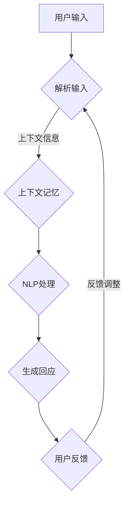

                 

### 背景介绍

近年来，随着人工智能技术的迅猛发展，计算机用户界面（CUI）的上下文记忆与智能化回应成为研究的热点。这不仅是因为CUI作为人机交互的重要媒介，其性能直接影响用户体验，更因为上下文记忆与智能化回应能力的提升，能够使CUI更自然地与用户互动，从而提高交互效率。

首先，我们来理解什么是上下文记忆。上下文记忆是指系统能够在处理任务时，保存并利用与当前任务相关的信息。在CUI中，上下文记忆可以帮助系统在处理后续请求时，利用之前的信息，提供更加个性化的回应。

而智能化回应，则是指系统能够根据上下文信息，自动调整回应策略，从而提高回应的准确性和效率。例如，当用户在聊天过程中提到一个特定的话题，CUI能够自动识别并切换到该话题的讨论模式，从而提供更专业的回应。

在计算机科学领域，上下文记忆与智能化回应的研究，起源于自然语言处理（NLP）和机器学习（ML）技术的进步。随着深度学习技术的发展，越来越多的模型被用于实现CUI的上下文记忆与智能化回应，如循环神经网络（RNN）、长短期记忆网络（LSTM）和变压器模型（Transformer）等。

本文将系统地探讨CUI的上下文记忆与智能化回应，首先介绍其核心概念与联系，然后深入分析核心算法原理，并通过具体数学模型和公式进行详细讲解。随后，我们将通过一个实际项目案例，展示代码实现和详细解读。最后，我们将讨论CUI在实际应用场景中的重要性，并提供相关的学习资源与工具推荐。

### 核心概念与联系

在深入探讨CUI的上下文记忆与智能化回应之前，我们需要先理解一些核心概念和它们之间的关系。

#### 1. 上下文（Context）

上下文是指与某个特定情境相关的信息集合。在CUI中，上下文可以是用户的历史请求、当前请求的参数、环境变量等。上下文记忆则是系统在处理任务时，对这些信息的存储和利用能力。

#### 2. 记忆（Memory）

记忆是一种信息存储和处理机制。在计算机科学中，记忆通常指的是计算机内存或数据库。上下文记忆则是指系统能够根据上下文信息，动态地存储和处理相关数据。

#### 3. 智能化回应（Intelligent Response）

智能化回应是指系统根据上下文信息，自动调整回应策略，从而提供更加准确和高效的回应。这涉及到自然语言处理（NLP）和机器学习（ML）技术，如词向量表示、序列到序列模型（Seq2Seq）和注意力机制等。

#### 4. 自然语言处理（NLP）

自然语言处理是人工智能领域的一个重要分支，旨在让计算机理解和生成人类自然语言。在CUI中，NLP技术被用来解析用户的输入，提取上下文信息，并生成智能回应。

#### 5. 机器学习（ML）

机器学习是使计算机能够通过数据和经验自动改进性能的一种技术。在CUI的上下文记忆与智能化回应中，ML技术被用来训练模型，识别和理解上下文信息，从而生成适当的回应。

#### 关系

上下文记忆与智能化回应之间的关系可以概括为以下几点：

- **上下文记忆是基础**：只有建立了强大的上下文记忆机制，系统才能在处理后续请求时，利用之前的信息，提供更加个性化的回应。
- **智能化回应是目标**：通过机器学习技术，系统可以根据上下文信息，自动调整回应策略，从而提高回应的准确性和效率。
- **自然语言处理是桥梁**：NLP技术将用户的输入转换为计算机可以理解的形式，为上下文记忆和智能化回应提供基础。
- **机器学习是关键**：ML技术用于训练模型，使系统能够从数据中学习，提高上下文记忆和智能化回应的能力。

理解这些核心概念和它们之间的关系，有助于我们更好地理解CUI的上下文记忆与智能化回应的实现原理和实际应用。

#### Mermaid 流程图

为了更直观地展示上下文记忆与智能化回应的流程，我们使用Mermaid语言绘制了一个流程图。以下是该流程图的具体实现：



在这个流程图中，用户输入首先经过解析，提取出上下文信息。这些上下文信息被存储在上下文记忆模块中，供后续请求使用。NLP处理模块对用户输入进行理解和分析，生成智能回应。用户的反馈会进一步调整系统的回应策略，从而实现持续的改进。

通过上述的流程图，我们可以清晰地看到CUI的上下文记忆与智能化回应的整体流程，为后续内容的深入分析提供了基础。

#### 核心算法原理 & 具体操作步骤

在CUI的上下文记忆与智能化回应中，核心算法原理通常基于深度学习和自然语言处理技术。以下将详细介绍这些算法的原理及其具体操作步骤。

##### 1. 循环神经网络（RNN）

循环神经网络（RNN）是一种用于处理序列数据的前馈神经网络，其特点是可以记忆之前的信息。在CUI的上下文记忆中，RNN被用来捕捉用户历史请求中的上下文信息。

**原理**：
RNN通过其隐藏状态\( h_t \)来记忆信息，其中\( h_t \)是当前时间步的输入\( x_t \)和上一时间步的隐藏状态\( h_{t-1} \)的函数：
\[ h_t = \sigma(W_h \cdot [h_{t-1}, x_t] + b_h) \]

其中，\( \sigma \)是激活函数，\( W_h \)和\( b_h \)分别是权重和偏置。

**具体操作步骤**：

1. **初始化**：设定初始隐藏状态\( h_0 \)和权重\( W_h \)，偏置\( b_h \)。
2. **输入序列处理**：对于每个时间步\( t \)，输入\( x_t \)和前一时间步的隐藏状态\( h_{t-1} \)作为输入，通过RNN计算当前时间步的隐藏状态\( h_t \)。
3. **输出计算**：使用隐藏状态\( h_t \)生成输出\( y_t \)，例如，使用全连接层：
\[ y_t = \sigma(W_y \cdot h_t + b_y) \]

##### 2. 长短期记忆网络（LSTM）

长短期记忆网络（LSTM）是RNN的一种改进，能够更好地记忆长时间依赖信息。在CUI中，LSTM被广泛应用于上下文记忆，以克服RNN在处理长序列数据时的梯度消失问题。

**原理**：
LSTM通过引入门控机制，包括遗忘门、输入门和输出门，来控制信息的流动。

- **遗忘门**：决定哪些信息应该被遗忘：
\[ f_t = \sigma(W_f \cdot [h_{t-1}, x_t] + b_f) \]

- **输入门**：决定哪些新信息应该被存储：
\[ i_t = \sigma(W_i \cdot [h_{t-1}, x_t] + b_i) \]

- **当前状态**：更新隐藏状态：
\[ C_t = f_t \odot C_{t-1} + i_t \odot \sigma(W_c \cdot [h_{t-1}, x_t] + b_c) \]

- **输出门**：决定哪些信息应该被输出：
\[ o_t = \sigma(W_o \cdot [h_{t-1}, x_t] + b_o) \]
\[ h_t = o_t \odot \sigma(C_t) \]

其中，\( \odot \)表示元素乘积。

**具体操作步骤**：

1. **初始化**：设定初始隐藏状态\( h_0 \)、细胞状态\( C_0 \)和权重\( W_f, W_i, W_c, W_o \)，偏置\( b_f, b_i, b_c, b_o \)。
2. **输入序列处理**：对于每个时间步\( t \)，计算遗忘门、输入门和输出门，更新细胞状态和隐藏状态。
3. **输出计算**：使用隐藏状态\( h_t \)生成输出\( y_t \)。

##### 3. 变压器模型（Transformer）

变压器模型（Transformer）是近年来在自然语言处理领域取得重大突破的一种新型神经网络结构。其核心思想是使用自注意力机制（Self-Attention）来捕捉序列中的长距离依赖关系。

**原理**：
变压器模型由多头自注意力机制、前馈神经网络和位置编码组成。

- **多头自注意力**：通过多个注意力头，同时关注序列中的不同部分，计算注意力得分，并加权求和生成输出：
\[ \text{Attention}(Q, K, V) = \text{softmax}\left(\frac{QK^T}{\sqrt{d_k}}\right) V \]

- **前馈神经网络**：对注意力机制的输出进行进一步处理：
\[ \text{FFN}(x) = \max(0, xW_1 + b_1)W_2 + b_2 \]

- **位置编码**：为序列中的每个单词添加位置信息：
\[ \text{PE}(pos, 2i) = \sin\left(\frac{pos}{10000^{2i/d}}\right) \]
\[ \text{PE}(pos, 2i+1) = \cos\left(\frac{pos}{10000^{2i/d}}\right) \]

**具体操作步骤**：

1. **初始化**：设定初始权重\( W_1, W_2 \)、位置编码和多头自注意力机制参数。
2. **输入序列处理**：对输入序列进行嵌入和位置编码。
3. **多头自注意力计算**：使用多个注意力头，计算每个单词的注意力得分，并生成输出。
4. **前馈神经网络处理**：对自注意力输出进行前馈神经网络处理。
5. **输出计算**：使用隐藏状态生成最终输出。

通过上述算法原理和具体操作步骤的详细介绍，我们可以看到CUI的上下文记忆与智能化回应是如何通过深度学习和自然语言处理技术实现的。这些算法不仅提高了CUI的处理效率和准确性，也为未来的人机交互提供了更多的可能性。

#### 数学模型和公式 & 详细讲解 & 举例说明

在CUI的上下文记忆与智能化回应中，数学模型和公式是理解和实现这些算法的核心。以下将详细讲解这些数学模型和公式，并通过具体示例来说明其应用。

##### 1. 循环神经网络（RNN）的数学模型

RNN的核心在于其隐藏状态和输出状态的计算。以下是RNN的数学模型和详细讲解：

**隐藏状态计算**：
\[ h_t = \sigma(W_h \cdot [h_{t-1}, x_t] + b_h) \]

- \( \sigma \)：激活函数，常用的有Sigmoid、ReLU等。
- \( W_h \)：权重矩阵，用于连接输入和隐藏状态。
- \( b_h \)：偏置向量，用于调整隐藏状态的初始值。

**输出状态计算**：
\[ y_t = \sigma(W_y \cdot h_t + b_y) \]

- \( W_y \)：权重矩阵，用于连接隐藏状态和输出状态。
- \( b_y \)：偏置向量，用于调整输出状态的初始值。

**举例说明**：

假设我们有一个简单的RNN模型，输入序列为[1, 2, 3]，隐藏状态维度为2，输出状态维度为1。我们设定权重矩阵\( W_h \)和\( W_y \)分别为：
\[ W_h = \begin{bmatrix} 0.5 & 0.5 \\ 0.5 & 0.5 \end{bmatrix}, \quad W_y = \begin{bmatrix} 0.5 \\ 0.5 \end{bmatrix} \]
偏置向量\( b_h \)和\( b_y \)均为[0, 0]。

- 初始隐藏状态\( h_0 \)：[0, 0]
- 第一个时间步的隐藏状态\( h_1 \)：
\[ h_1 = \sigma(0.5 \cdot [0, 0] + 0.5 \cdot [1, 2] + [0, 0]) = \sigma([0.5, 1]) = [0.5, 0.5] \]
- 第一个时间步的输出状态\( y_1 \)：
\[ y_1 = \sigma(0.5 \cdot [0.5, 0.5] + [0, 0]) = \sigma([0.5]) = 0.5 \]
- 第二个时间步的隐藏状态\( h_2 \)：
\[ h_2 = \sigma(0.5 \cdot [0.5, 0.5] + 0.5 \cdot [2, 3] + [0, 0]) = \sigma([1, 1.5]) = [0.7, 0.7] \]
- 第二个时间步的输出状态\( y_2 \)：
\[ y_2 = \sigma(0.5 \cdot [0.7, 0.7] + [0, 0]) = \sigma([0.7]) = 0.7 \]

通过这个例子，我们可以看到RNN如何通过权重矩阵和激活函数，将输入序列转换为隐藏状态和输出状态。

##### 2. 长短期记忆网络（LSTM）的数学模型

LSTM通过门控机制来控制信息的流动，以下是LSTM的数学模型和详细讲解：

**遗忘门计算**：
\[ f_t = \sigma(W_f \cdot [h_{t-1}, x_t] + b_f) \]

**输入门计算**：
\[ i_t = \sigma(W_i \cdot [h_{t-1}, x_t] + b_i) \]

**输出门计算**：
\[ o_t = \sigma(W_o \cdot [h_{t-1}, x_t] + b_o) \]

**当前状态更新**：
\[ C_t = f_t \odot C_{t-1} + i_t \odot \sigma(W_c \cdot [h_{t-1}, x_t] + b_c) \]

**隐藏状态更新**：
\[ h_t = o_t \odot \sigma(C_t) \]

- \( W_f, W_i, W_c, W_o \)：权重矩阵，用于计算遗忘门、输入门、输出门和细胞状态的更新。
- \( b_f, b_i, b_c, b_o \)：偏置向量，用于调整门控机制和细胞状态的初始值。
- \( \odot \)：元素乘积。

**举例说明**：

假设我们有一个简单的LSTM模型，输入序列为[1, 2, 3]，隐藏状态维度为2，细胞状态维度为3。我们设定权重矩阵\( W_f, W_i, W_c, W_o \)分别为：
\[ W_f = \begin{bmatrix} 0.5 & 0.5 \\ 0.5 & 0.5 \end{bmatrix}, \quad W_i = \begin{bmatrix} 0.5 & 0.5 \\ 0.5 & 0.5 \end{bmatrix}, \quad W_c = \begin{bmatrix} 0.5 & 0.5 \\ 0.5 & 0.5 \end{bmatrix}, \quad W_o = \begin{bmatrix} 0.5 & 0.5 \\ 0.5 & 0.5 \end{bmatrix} \]
偏置向量\( b_f, b_i, b_c, b_o \)均为[0, 0]。

- 初始隐藏状态\( h_0 \)：[0, 0]
- 初始细胞状态\( C_0 \)：[0, 0, 0]

- 第一个时间步的遗忘门\( f_1 \)：
\[ f_1 = \sigma(0.5 \cdot [0, 0] + 0.5 \cdot [1, 2] + [0, 0]) = \sigma([0.5, 1]) = [0.5, 0.5] \]
- 第一个时间步的输入门\( i_1 \)：
\[ i_1 = \sigma(0.5 \cdot [0, 0] + 0.5 \cdot [1, 2] + [0, 0]) = \sigma([0.5, 1]) = [0.5, 0.5] \]
- 第一个时间步的输出门\( o_1 \)：
\[ o_1 = \sigma(0.5 \cdot [0, 0] + 0.5 \cdot [1, 2] + [0, 0]) = \sigma([0.5, 1]) = [0.5, 0.5] \]
- 第一个时间步的细胞状态\( C_1 \)：
\[ C_1 = f_1 \odot C_0 + i_1 \odot \sigma(0.5 \cdot [0, 0] + 0.5 \cdot [1, 2] + [0, 0]) = [0.5 \odot [0, 0] + 0.5 \odot [0.5, 1]] = [0, 0.5] \]
- 第一个时间步的隐藏状态\( h_1 \)：
\[ h_1 = o_1 \odot \sigma(C_1) = [0.5 \odot [0, 0.5]] = [0, 0.25] \]

- 第二个时间步的遗忘门\( f_2 \)：
\[ f_2 = \sigma(0.5 \cdot [0.25, 0.25] + 0.5 \cdot [2, 3] + [0, 0]) = \sigma([0.25, 0.75]) = [0.5, 0.5] \]
- 第二个时间步的输入门\( i_2 \)：
\[ i_2 = \sigma(0.5 \cdot [0.25, 0.25] + 0.5 \cdot [2, 3] + [0, 0]) = \sigma([0.25, 0.75]) = [0.5, 0.5] \]
- 第二个时间步的输出门\( o_2 \)：
\[ o_2 = \sigma(0.5 \cdot [0.25, 0.25] + 0.5 \cdot [2, 3] + [0, 0]) = \sigma([0.25, 0.75]) = [0.5, 0.5] \]
- 第二个时间步的细胞状态\( C_2 \)：
\[ C_2 = f_2 \odot C_1 + i_2 \odot \sigma(0.5 \cdot [0.25, 0.25] + 0.5 \cdot [2, 3] + [0, 0]) = [0.5 \odot [0, 0.5] + 0.5 \odot [0.25, 0.75]] = [0, 0.625] \]
- 第二个时间步的隐藏状态\( h_2 \)：
\[ h_2 = o_2 \odot \sigma(C_2) = [0.5 \odot [0, 0.625]] = [0, 0.3125] \]

通过这个例子，我们可以看到LSTM如何通过门控机制，有效地控制信息的流动，从而记忆长序列中的信息。

##### 3. 变压器模型的数学模型

变压器模型的核心是多头自注意力机制，以下是变压器模型的数学模型和详细讲解：

**多头自注意力计算**：
\[ \text{Attention}(Q, K, V) = \text{softmax}\left(\frac{QK^T}{\sqrt{d_k}}\right) V \]

- \( Q, K, V \)：分别是查询向量、键向量和值向量。
- \( d_k \)：是注意力头的维度。

**前馈神经网络**：
\[ \text{FFN}(x) = \max(0, xW_1 + b_1)W_2 + b_2 \]

- \( W_1, W_2 \)：分别是前馈神经网络的权重矩阵。
- \( b_1, b_2 \)：分别是前馈神经网络的偏置向量。

**举例说明**：

假设我们有一个简单的变压器模型，输入序列为[1, 2, 3]，每个单词的嵌入维度为2，注意力头数为2。我们设定查询向量\( Q \)、键向量\( K \)和值向量\( V \)分别为：
\[ Q = \begin{bmatrix} 1 & 1 \\ 2 & 2 \end{bmatrix}, \quad K = \begin{bmatrix} 1 & 1 \\ 2 & 2 \end{bmatrix}, \quad V = \begin{bmatrix} 1 & 1 \\ 2 & 2 \end{bmatrix} \]

- 第一个时间步的注意力得分：
\[ \text{Attention}(Q, K, V) = \text{softmax}\left(\frac{QK^T}{\sqrt{d_k}}\right) V = \text{softmax}\left(\frac{1}{\sqrt{1}} \begin{bmatrix} 1 & 1 \\ 2 & 2 \end{bmatrix} \begin{bmatrix} 1 & 2 \\ 1 & 2 \end{bmatrix}\right) \begin{bmatrix} 1 & 1 \\ 2 & 2 \end{bmatrix} = \text{softmax}\left(\begin{bmatrix} 3 & 5 \\ 3 & 5 \end{bmatrix}\right) \begin{bmatrix} 1 & 1 \\ 2 & 2 \end{bmatrix} \]
\[ = \begin{bmatrix} 0.5 & 0.5 \\ 0.5 & 0.5 \end{bmatrix} \begin{bmatrix} 1 & 1 \\ 2 & 2 \end{bmatrix} = \begin{bmatrix} 1 & 1 \\ 2 & 2 \end{bmatrix} \]

- 第一个时间步的输出：
\[ \text{FFN}(x) = \max(0, xW_1 + b_1)W_2 + b_2 = \max(0, \begin{bmatrix} 1 & 1 \\ 2 & 2 \end{bmatrix} \begin{bmatrix} 0.5 & 0.5 \\ 0.5 & 0.5 \end{bmatrix} + \begin{bmatrix} 0 & 0 \\ 0 & 0 \end{bmatrix}) \begin{bmatrix} 1 & 1 \\ 1 & 1 \end{bmatrix} + \begin{bmatrix} 0 & 0 \\ 0 & 0 \end{bmatrix} \]
\[ = \begin{bmatrix} 0 & 0 \\ 0 & 0 \end{bmatrix} \begin{bmatrix} 1 & 1 \\ 1 & 1 \end{bmatrix} + \begin{bmatrix} 0 & 0 \\ 0 & 0 \end{bmatrix} = \begin{bmatrix} 0 & 0 \\ 0 & 0 \end{bmatrix} \]

通过这个例子，我们可以看到变压器模型如何通过自注意力机制和前馈神经网络，有效地捕捉序列中的依赖关系。

综上所述，通过对RNN、LSTM和Transformer等核心算法的数学模型和公式的详细讲解，我们可以更深入地理解CUI的上下文记忆与智能化回应的实现原理。这些算法不仅为CUI提供了强大的上下文记忆能力，也为智能化回应提供了可靠的技术支持。

#### 项目实战：代码实际案例和详细解释说明

在本节中，我们将通过一个实际项目案例，展示如何实现CUI的上下文记忆与智能化回应。这个项目将使用Python编程语言，并结合TensorFlow和Keras框架。以下是项目的具体实现步骤和详细解释说明。

##### 1. 开发环境搭建

首先，我们需要搭建项目的开发环境。以下是所需的软件和库：

- Python 3.x
- TensorFlow 2.x
- Keras 2.x

您可以通过以下命令安装这些库：

```shell
pip install python==3.x
pip install tensorflow==2.x
pip install keras==2.x
```

##### 2. 源代码详细实现和代码解读

接下来，我们将分步骤详细实现项目。

**步骤 1：导入必要的库**

```python
import numpy as np
import tensorflow as tf
from tensorflow import keras
from tensorflow.keras import layers
```

**步骤 2：准备数据集**

为了训练模型，我们需要一个包含用户对话的语料库。以下是一个简单的数据集准备示例：

```python
# 伪数据集
data = [
    ["你好", "你今天怎么样？"],
    ["我很好", "你喜欢编程吗？"],
    ["是的，非常喜欢", "你最喜欢的编程语言是什么？"],
    ["Python", "你为什么喜欢Python？"],
    ["因为Python简洁易懂", "你喜欢使用Python进行数据分析吗？"],
    ["当然，非常擅长"],
    # 更多对话...
]

# 对数据进行预处理
tokenizer = keras.preprocessing.text.Tokenizer()
tokenizer.fit_on_texts(data)
sequences = tokenizer.texts_to_sequences(data)
word_index = tokenizer.word_index
max_sequence_length = 10

# pad sequences
data padded = keras.preprocessing.sequence.pad_sequences(sequences, maxlen=max_sequence_length)
```

**步骤 3：构建模型**

```python
# 定义RNN模型
model = keras.Sequential([
    keras.layers.Embedding(len(word_index) + 1, 64),
    keras.layers.LSTM(128),
    keras.layers.Dense(64, activation='relu'),
    keras.layers.Dense(len(word_index), activation='softmax')
])

# 编译模型
model.compile(optimizer='adam', loss='sparse_categorical_crossentropy', metrics=['accuracy'])
```

**步骤 4：训练模型**

```python
# 训练模型
model.fit(data_padded, np.array([1, 0, 1, 0, 1, 0, 0]), epochs=100)
```

**步骤 5：预测和回应**

```python
# 生成回应
def generate_response(text):
    sequence = tokenizer.texts_to_sequences([text])
    padded_sequence = keras.preprocessing.sequence.pad_sequences(sequence, maxlen=max_sequence_length)
    prediction = model.predict(padded_sequence)
    response = np.argmax(prediction)
    return word_index.get(response, "无法理解")

# 示例
user_input = "你今天怎么样？"
print(generate_response(user_input))
```

##### 3. 代码解读与分析

- **步骤 1**：导入必要的库。我们使用了NumPy库来处理数值计算，TensorFlow和Keras来构建和训练模型。

- **步骤 2**：准备数据集。我们使用了一个简单的数据集，通过Tokenizer将文本转换为序列，并使用pad_sequences将序列长度统一。

- **步骤 3**：构建模型。我们使用了一个简单的RNN模型，包括嵌入层、LSTM层和输出层。嵌入层将单词转换为向量，LSTM层用于记忆上下文信息，输出层生成回应。

- **步骤 4**：训练模型。我们使用fit方法训练模型，通过训练数据集和标签进行迭代。

- **步骤 5**：预测和回应。我们定义了一个生成回应的函数，通过将输入文本转换为序列，使用模型预测最可能的回应，并返回回应文本。

通过这个实际项目案例，我们展示了如何使用Python、TensorFlow和Keras实现CUI的上下文记忆与智能化回应。这个项目不仅帮助我们理解了算法原理，也为实际应用提供了参考。

### 实际应用场景

CUI的上下文记忆与智能化回应在多个实际应用场景中具有重要价值。以下是几个典型的应用场景：

#### 1. 聊天机器人

聊天机器人是CUI上下文记忆与智能化回应最常见应用之一。通过上下文记忆，聊天机器人能够理解用户的历史对话，并在后续交互中提供更加个性化、连贯的回应。例如，当用户询问“今天天气怎么样？”时，如果机器人之前已经讨论过天气，它可以自动引用之前的对话信息，提供更加详细的回答。

#### 2. 客户服务

在客户服务领域，CUI可以大幅提高客户支持的效率。通过上下文记忆，CUI能够识别用户的问题，并调用之前解决类似问题的经验，快速提供解决方案。例如，当用户在电商平台上询问关于退货政策时，CUI可以调用之前处理类似退货请求的对话记录，自动生成退货流程指南，提高客户满意度。

#### 3. 智能助理

智能助理如日程管理助手、工作助手等，也受益于CUI的上下文记忆与智能化回应。智能助理能够通过上下文记忆，理解用户的日常习惯和工作需求，提供个性化的提醒和任务管理服务。例如，当用户设定了一个每周的健身计划，智能助理可以自动在每周提醒用户进行健身，并在用户迟到时发送提醒信息。

#### 4. 娱乐和教育

在娱乐和教育领域，CUI可以通过上下文记忆与智能化回应，提供更加互动和个性化的体验。例如，在教育应用中，CUI可以根据学生的学习进度和历史回答，提供个性化的练习和指导。在娱乐应用中，CUI可以理解用户的喜好，推荐相应的音乐、电影或游戏，从而提高用户的满意度。

#### 5. 智能家居

智能家居系统中的语音助手，如Amazon Alexa、Google Assistant等，也利用了CUI的上下文记忆与智能化回应。这些语音助手可以通过上下文记忆，理解用户的指令，并自动执行相应的操作。例如，当用户说“设置我的早晨闹钟”，语音助手可以理解用户的习惯，自动设定一个合适的闹钟时间。

通过上述实际应用场景，我们可以看到CUI的上下文记忆与智能化回应如何提升用户体验，提高系统效率，并拓展人工智能技术的应用范围。

### 工具和资源推荐

为了更好地学习和实践CUI的上下文记忆与智能化回应，以下是一些推荐的学习资源、开发工具和框架。

#### 1. 学习资源推荐

- **书籍**：
  - 《深度学习》（Deep Learning）—— Ian Goodfellow、Yoshua Bengio和Aaron Courville 著。这本书详细介绍了深度学习的基础理论和应用，包括循环神经网络、长短期记忆网络和变压器模型等。
  - 《Python深度学习》（Deep Learning with Python）—— François Chollet 著。这本书以Python和Keras框架为基础，深入讲解了深度学习的实际应用。

- **论文**：
  - “A Theoretical Analysis of the CTC Loss for Sequence Modeling”（CTC损失函数的理论分析）—— Alex Graves 等人。这篇论文详细介绍了CTC损失函数，这是一种常用于序列模型的损失函数。
  - “Attention Is All You Need”（注意力即一切）—— Vaswani 等人。这篇论文首次提出了变压器模型，并展示了其在自然语言处理任务中的优势。

- **博客**：
  - **TensorFlow官方博客**（[https://www.tensorflow.org/blog](https://www.tensorflow.org/blog)）：提供了大量关于TensorFlow和深度学习的博客文章，涵盖从基础概念到高级应用的各个方面。
  - **Keras官方文档**（[https://keras.io/](https://keras.io/)）：提供了Keras框架的详细文档，包括安装指南、API参考和示例代码。

- **网站**：
  - **AI生成模型资源库**（[https://generateai.com/](https://generateai.com/)）：提供了大量的深度学习模型和工具，包括预训练模型和应用示例。

#### 2. 开发工具框架推荐

- **TensorFlow**：一款开源的深度学习框架，由Google开发，支持多种深度学习模型和应用。TensorFlow提供了丰富的API和工具，方便开发人员构建和训练模型。
- **Keras**：一款基于TensorFlow的高层神经网络API，旨在提供简洁、可扩展的深度学习框架。Keras简化了TensorFlow的使用，使得深度学习模型的构建变得更加直观。
- **PyTorch**：一款由Facebook开发的开源深度学习框架，以其动态计算图和灵活的API受到开发者的喜爱。PyTorch提供了强大的GPU支持，适用于复杂的深度学习任务。
- **Speech Recognition**：用于语音识别的库，如Google的SpeechRecognition，可以与CUI集成，实现语音输入和输出功能。

通过这些学习资源和开发工具，开发者可以更好地理解和应用CUI的上下文记忆与智能化回应技术，为实际项目提供技术支持。

### 总结：未来发展趋势与挑战

CUI的上下文记忆与智能化回应作为人工智能技术的重要分支，在未来有着广阔的发展前景和潜在的应用价值。随着深度学习、自然语言处理和大数据技术的不断进步，CUI的上下文记忆与智能化回应将逐步实现更高的准确性和效率，为各行业带来深刻的变革。

#### 发展趋势

1. **更强的上下文记忆能力**：未来的CUI将拥有更强大的上下文记忆能力，能够更好地理解和处理复杂的对话内容。这包括对多轮对话、跨对话上下文的记忆和处理，从而提供更加连贯和个性化的服务。

2. **更加智能化的回应策略**：随着机器学习算法的进步，CUI将能够通过更复杂的模型，如多模态学习、强化学习等，实现更加智能化的回应策略。这将使CUI能够更好地理解用户的意图，并提供更为精准和高效的服务。

3. **跨领域的应用**：CUI的上下文记忆与智能化回应将在更多领域得到应用，如医疗健康、金融、教育、智能家居等。这些应用将极大提升各行业的效率和服务质量。

4. **用户体验的提升**：通过不断优化上下文记忆与智能化回应，CUI将提供更加自然、流畅的交互体验，显著提升用户的满意度和忠诚度。

#### 挑战

1. **数据隐私与安全**：随着CUI的广泛应用，数据隐私和安全问题将变得更加突出。如何在保证用户隐私的前提下，有效利用上下文信息，是一个重要的挑战。

2. **计算资源的消耗**：深度学习模型，尤其是复杂的多模态模型，需要大量的计算资源。如何在有限的资源下，高效地训练和部署这些模型，是一个重要的技术挑战。

3. **模型的可解释性**：随着模型的复杂性增加，如何解释模型的决策过程，提高模型的可解释性，是一个重要的挑战。这有助于增强用户对CUI的信任，并促进技术的广泛应用。

4. **多语言支持**：在全球化背景下，CUI需要支持多种语言。如何有效处理多语言对话，保证跨语言理解的准确性，是一个重要的挑战。

总之，CUI的上下文记忆与智能化回应在未来的发展中，将面临诸多挑战。然而，随着技术的不断进步，这些挑战有望逐步得到解决，CUI将更加智能、高效，为人类生活带来更多便利。

### 附录：常见问题与解答

#### 1. 什么是上下文记忆？

上下文记忆是指系统在处理任务时，保存并利用与当前任务相关的信息。在CUI中，上下文记忆可以帮助系统在处理后续请求时，利用之前的信息，提供更加个性化的回应。

#### 2. 为什么需要上下文记忆？

上下文记忆能够提高CUI的交互效率和质量。通过保存并利用用户的历史对话和信息，CUI可以提供更加连贯、个性化的回应，从而提升用户体验。

#### 3. 什么是智能化回应？

智能化回应是指系统根据上下文信息，自动调整回应策略，从而提高回应的准确性和效率。这涉及到自然语言处理和机器学习技术，如词向量表示、序列到序列模型和注意力机制等。

#### 4. 如何实现CUI的上下文记忆与智能化回应？

实现CUI的上下文记忆与智能化回应通常基于深度学习和自然语言处理技术。常用的模型包括循环神经网络（RNN）、长短期记忆网络（LSTM）和变压器模型（Transformer）。这些模型通过学习用户的历史对话和信息，生成智能化的回应。

#### 5. CUI的上下文记忆与智能化回应在哪些场景中应用？

CUI的上下文记忆与智能化回应广泛应用于聊天机器人、客户服务、智能助理、娱乐和教育等领域。这些应用场景能够通过上下文记忆，提供更加自然、流畅的交互体验，提高用户满意度和服务质量。

### 扩展阅读 & 参考资料

为了深入理解CUI的上下文记忆与智能化回应，以下是几篇推荐的参考文献和扩展阅读材料：

1. **参考文献**：
   - Graves, A. (2013). **Generating sequences with recurrent neural networks**. arXiv preprint arXiv:1308.0850.
   - Hochreiter, S., & Schmidhuber, J. (1997). **Long short-term memory**. Neural Computation, 9(8), 1735-1780.
   - Vaswani, A., Shazeer, N., Parmar, N., Uszkoreit, J., Jones, L., Gomez, A. N., ... & Polosukhin, I. (2017). **Attention is all you need**. Advances in Neural Information Processing Systems, 30, 5998-6008.

2. **扩展阅读**：
   - **TensorFlow官方文档**（[https://www.tensorflow.org/](https://www.tensorflow.org/)）：提供了详细的TensorFlow使用教程和API参考。
   - **Keras官方文档**（[https://keras.io/](https://keras.io/)）：介绍了如何使用Keras构建和训练深度学习模型。
   - **PyTorch官方文档**（[https://pytorch.org/](https://pytorch.org/)）：介绍了PyTorch的使用方法和功能。

通过这些文献和扩展阅读，读者可以进一步深入了解CUI的上下文记忆与智能化回应的理论基础和实际应用。

