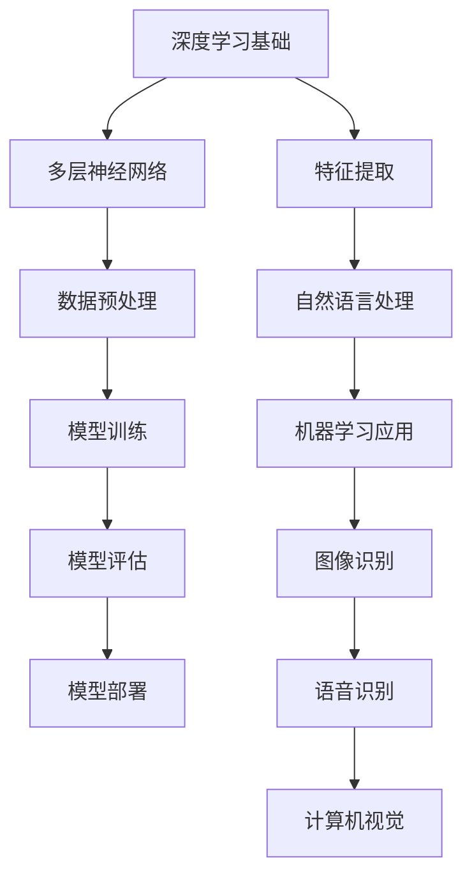

                 

### 背景介绍

自ChatGPT在2022年底发布以来，大模型领域的研究与应用迅速发展。ChatGPT作为一个基于GPT-3.5模型的聊天机器人，以其出色的自然语言处理能力，在短时间内引起了全球的关注。ChatGPT的成功不仅在于其卓越的性能，更在于它展示出了大模型在自然语言处理、机器学习等多个领域的巨大潜力。

大模型（Large Models）是指那些具有数十亿甚至更多参数的深度学习模型。这些模型通过从大量的数据中进行学习，具备了处理复杂数据和执行复杂任务的能力。大模型的出现，标志着人工智能技术进入了一个新的阶段，即从以任务为中心的设计，转向以数据为中心的设计。

在大模型的发展历程中，ChatGPT无疑是一个重要的里程碑。它不仅推动了自然语言处理领域的技术进步，还引发了人们对大模型应用前景的深刻思考。例如，大模型在医疗、金融、教育等领域的潜在应用，以及其可能带来的数据隐私、模型可解释性等问题，都成为了研究的焦点。

本文将围绕ChatGPT之后，大模型落地将如何发展这一主题，进行深入探讨。首先，我们将介绍大模型的核心概念与联系，通过Mermaid流程图展示大模型的架构原理。接着，我们将详细讲解大模型的核心算法原理与具体操作步骤，并通过数学模型和公式进行详细解析。然后，我们将通过实际项目实战，展示大模型在现实中的应用案例，并对其代码实现进行解读与分析。最后，我们将讨论大模型在实际应用场景中的表现，推荐相关的学习资源和开发工具框架，并总结大模型未来发展趋势与挑战。### 核心概念与联系

大模型（Large Models）的核心概念源于深度学习（Deep Learning），其基本原理是通过多层神经网络对数据进行层次化处理，从而提取出数据中的特征。下面，我们将通过Mermaid流程图来展示大模型的架构原理，并介绍大模型与深度学习、自然语言处理等领域的联系。

#### Mermaid流程图



#### 深度学习与多层神经网络

深度学习是机器学习的一个重要分支，其核心在于通过多层神经网络（Neural Networks）对数据进行学习。多层神经网络由输入层、隐藏层和输出层组成，通过逐层提取数据特征，实现对复杂数据的建模。大模型就是通过增加网络的层数和每层的神经元数量，实现对大规模数据的建模和处理。

#### 数据预处理

数据预处理是深度学习模型训练的必要步骤，其目的是对原始数据进行清洗、归一化和特征提取等操作，以提高模型的训练效率和准确性。大模型在数据预处理方面具有显著优势，因为其拥有更多的参数和更强的学习能力，可以更好地处理大规模、高维度数据。

#### 模型训练

模型训练是深度学习模型构建的核心环节，其目的是通过学习大量的训练数据，调整网络中的参数，使其能够对新的数据进行准确预测。大模型在模型训练方面表现出色，因为其拥有更多的参数和更强的学习能力，可以在较短的时间内完成模型的训练。

#### 模型评估

模型评估是验证模型性能的重要步骤，常用的评估指标包括准确率、召回率、F1值等。大模型在模型评估方面具有优势，因为其强大的学习能力和丰富的特征提取能力，可以更好地评估模型的性能。

#### 模型部署

模型部署是将训练好的模型应用到实际场景中，以实现预测、分类等任务。大模型在模型部署方面具有广泛的应用前景，因为其强大的性能和广泛的适用性，可以应用于多种不同的场景。

#### 特征提取

特征提取是深度学习模型的一个重要环节，其目的是从原始数据中提取出对任务有帮助的特征。大模型通过多层神经网络对数据进行层次化处理，可以提取出更加丰富的特征，从而提高模型的性能。

#### 自然语言处理

自然语言处理（Natural Language Processing，NLP）是人工智能领域的一个重要分支，其目的是使计算机能够理解和处理自然语言。大模型在自然语言处理方面表现出色，因为其强大的语言理解能力和丰富的特征提取能力，可以实现对自然语言的高效处理。

#### 机器学习应用

机器学习应用是指将机器学习模型应用于实际场景中，以解决现实问题。大模型在机器学习应用方面具有广泛的应用前景，因为其强大的学习能力和广泛的适用性，可以应用于多种不同的领域。

#### 图像识别

图像识别是计算机视觉的一个重要分支，其目的是使计算机能够识别和理解图像。大模型在图像识别方面表现出色，因为其强大的特征提取能力和丰富的图像处理算法，可以实现对图像的高效识别。

#### 语音识别

语音识别是计算机语音处理的一个重要分支，其目的是使计算机能够识别和理解语音。大模型在语音识别方面表现出色，因为其强大的语音处理能力和丰富的语音特征提取算法，可以实现对语音的高效识别。

#### 计算机视觉

计算机视觉是人工智能领域的一个重要分支，其目的是使计算机能够通过图像或视频获取信息。大模型在计算机视觉方面表现出色，因为其强大的图像处理能力和丰富的视觉特征提取算法，可以实现对视觉信息的高效处理。

通过上述分析，我们可以看到，大模型与深度学习、自然语言处理、机器学习、图像识别、语音识别和计算机视觉等领域密切相关。大模型的出现，不仅推动了这些领域的技术进步，也为这些领域带来了新的机遇和挑战。### 核心算法原理与具体操作步骤

大模型的核心算法原理主要基于深度学习和神经网络。在了解了大模型的架构原理和联系后，我们接下来将详细讲解大模型的核心算法原理，包括神经网络的构建、训练和优化过程。

#### 神经网络构建

神经网络（Neural Network）是由大量神经元（Neurons）组成的网络，每个神经元都与其他神经元相连。神经元的连接称为边，边的权重（weights）用于表示神经元之间的关联强度。神经网络的构建主要包括以下几个步骤：

1. **初始化权重**：神经网络在训练前需要初始化权重。权重通常初始化为较小的随机值，以避免模型过拟合。

2. **搭建网络结构**：根据任务需求，搭建适当的神经网络结构。常见的神经网络结构包括全连接神经网络（Fully Connected Neural Network，FCNN）、卷积神经网络（Convolutional Neural Network，CNN）、循环神经网络（Recurrent Neural Network，RNN）等。

3. **设置激活函数**：激活函数（Activation Function）用于引入非线性变换，使神经网络能够对复杂数据进行建模。常见的激活函数包括 sigmoid、ReLU、Tanh等。

4. **定义损失函数**：损失函数（Loss Function）用于衡量模型预测值与真实值之间的差距。常见的损失函数包括均方误差（Mean Squared Error，MSE）、交叉熵（Cross Entropy）等。

#### 训练过程

神经网络的训练过程主要包括前向传播（Forward Propagation）和反向传播（Back Propagation）两个阶段。

1. **前向传播**：在训练过程中，输入数据通过网络进行传播，每个神经元接收前一层的输出，并通过激活函数计算自身的输出。最后，网络的输出与真实值进行比较，计算损失。

2. **反向传播**：在反向传播阶段，模型根据损失函数的梯度，调整网络中的权重和偏置。梯度下降（Gradient Descent）是常用的优化算法，通过不断更新权重和偏置，使损失函数值逐渐减小。

3. **迭代训练**：通过多次迭代训练，模型逐渐收敛，直到满足预定的停止条件，如损失函数值达到预设阈值或训练轮数达到预设值。

#### 优化过程

在训练过程中，优化过程非常重要，它决定了模型的收敛速度和最终性能。以下是一些常见的优化技巧：

1. **批量归一化（Batch Normalization）**：批量归一化通过对每个批量数据的激活值进行归一化，加快了模型的训练速度，提高了模型稳定性。

2. **权重初始化**：合理的权重初始化可以加快模型的收敛速度，减少训练时间。常用的权重初始化方法包括随机初始化、高斯分布初始化等。

3. **学习率调度**：学习率调度（Learning Rate Scheduling）是一种调整学习率的方法，通过在训练过程中动态调整学习率，提高模型的收敛速度。常见的学习率调度方法包括固定学习率、学习率衰减、学习率预热等。

4. **正则化**：正则化（Regularization）是一种防止模型过拟合的方法，通过添加正则项（Regularization Term）到损失函数中，约束模型复杂度。常见的正则化方法包括 L1 正则化、L2 正则化等。

#### 具体操作步骤

1. **数据准备**：收集并清洗训练数据，将其划分为训练集和验证集。

2. **构建神经网络**：根据任务需求，搭建神经网络结构，并初始化权重。

3. **训练模型**：通过前向传播和反向传播，训练模型，并记录损失函数值。

4. **评估模型**：在验证集上评估模型性能，根据评估结果调整模型参数。

5. **优化模型**：采用优化技巧，如批量归一化、权重初始化、学习率调度等，加快模型训练速度。

6. **模型部署**：将训练好的模型部署到实际应用场景中，进行预测和分类等任务。

通过上述步骤，我们可以构建和训练一个大模型，使其在复杂数据上表现出出色的性能。需要注意的是，大模型的训练过程非常耗时，通常需要大量计算资源和时间。然而，随着计算能力的提升和优化算法的发展，大模型的训练和优化过程将变得更加高效。### 数学模型和公式 & 详细讲解 & 举例说明

在大模型的构建和训练过程中，数学模型和公式扮演着至关重要的角色。以下是几个核心的数学模型和公式的详细讲解，并配以实例说明。

#### 前向传播公式

在神经网络的前向传播过程中，每个神经元的输出可以通过以下公式计算：

\[ z_i = \sum_j w_{ij} * a_{j} + b_i \]

其中，\( z_i \) 是第 \( i \) 层第 \( i \) 个神经元的激活值，\( w_{ij} \) 是第 \( i \) 层第 \( i \) 个神经元与第 \( j \) 层第 \( j \) 个神经元之间的权重，\( a_{j} \) 是第 \( j \) 层第 \( j \) 个神经元的激活值，\( b_i \) 是第 \( i \) 层第 \( i \) 个神经元的偏置。

举例说明：假设有一个简单的神经网络，输入层有 3 个神经元，隐藏层有 2 个神经元，输出层有 1 个神经元。权重矩阵 \( w_{ij} \) 和偏置向量 \( b_i \) 分别如下：

\[ w_{ij} = \begin{bmatrix} 1 & 2 & 3 \\ 4 & 5 & 6 \end{bmatrix} \]

\[ b_i = \begin{bmatrix} 1 \\ 2 \end{bmatrix} \]

输入向量 \( x \) 为：

\[ x = \begin{bmatrix} 1 & 0 & 1 \end{bmatrix} \]

通过前向传播，我们可以计算出隐藏层的输出：

\[ z_1 = 1 * 1 + 2 * 0 + 3 * 1 + 1 = 6 \]

\[ z_2 = 4 * 1 + 5 * 0 + 6 * 1 + 2 = 13 \]

#### 损失函数

在训练神经网络时，损失函数用于衡量模型预测值与真实值之间的差距。常见的损失函数包括均方误差（MSE）和交叉熵（Cross Entropy）。

均方误差（MSE）的定义如下：

\[ MSE = \frac{1}{m} \sum_{i=1}^{m} (y_i - \hat{y}_i)^2 \]

其中，\( y_i \) 是第 \( i \) 个样本的真实值，\( \hat{y}_i \) 是模型对第 \( i \) 个样本的预测值，\( m \) 是样本总数。

举例说明：假设有一个二分类问题，有两个样本 \( (y_1, \hat{y}_1) = (1, 0.5) \) 和 \( (y_2, \hat{y}_2) = (0, 0.8) \)。计算这两个样本的MSE：

\[ MSE = \frac{1}{2} \left( (1 - 0.5)^2 + (0 - 0.8)^2 \right) = \frac{1}{2} \left( 0.25 + 0.64 \right) = 0.475 \]

#### 反向传播公式

在神经网络的反向传播过程中，我们需要计算每个权重的梯度，并更新权重。梯度的计算公式如下：

\[ \frac{\partial L}{\partial w_{ij}} = \sum_{k} \frac{\partial L}{\partial z_k} * \frac{\partial z_k}{\partial w_{ij}} \]

其中，\( L \) 是损失函数，\( z_k \) 是第 \( k \) 层第 \( k \) 个神经元的激活值，\( \frac{\partial L}{\partial z_k} \) 是损失函数对 \( z_k \) 的梯度，\( \frac{\partial z_k}{\partial w_{ij}} \) 是 \( z_k \) 对 \( w_{ij} \) 的梯度。

举例说明：假设有一个简单的神经网络，隐藏层有 2 个神经元，输出层有 1 个神经元。损失函数为 MSE，计算隐藏层权重 \( w_{ij} \) 的梯度：

\[ \frac{\partial L}{\partial w_{ij}} = \frac{\partial L}{\partial z_1} * \frac{\partial z_1}{\partial w_{ij}} + \frac{\partial L}{\partial z_2} * \frac{\partial z_2}{\partial w_{ij}} \]

其中，\( \frac{\partial L}{\partial z_1} \) 和 \( \frac{\partial L}{\partial z_2} \) 是已知的，\( \frac{\partial z_k}{\partial w_{ij}} \) 需要通过链式法则计算。

#### 优化算法

在神经网络训练过程中，优化算法用于更新权重和偏置。梯度下降（Gradient Descent）是最常用的优化算法，其公式如下：

\[ w_{ij} \leftarrow w_{ij} - \alpha \frac{\partial L}{\partial w_{ij}} \]

其中，\( \alpha \) 是学习率。

举例说明：假设有一个简单的神经网络，输出层权重 \( w_{ij} = 2 \)，损失函数的梯度 \( \frac{\partial L}{\partial w_{ij}} = 0.5 \)，学习率 \( \alpha = 0.1 \)。通过梯度下降更新权重：

\[ w_{ij} \leftarrow 2 - 0.1 \times 0.5 = 1.5 \]

通过上述数学模型和公式的讲解，我们可以更好地理解大模型的工作原理。在实际应用中，这些公式和算法被广泛应用于神经网络的设计、训练和优化过程中。### 项目实战：代码实际案例和详细解释说明

在本节中，我们将通过一个实际项目案例，展示如何搭建和训练一个大模型。这个案例将涉及到一个常见的自然语言处理任务——文本分类，并使用Python和TensorFlow来实现。

#### 开发环境搭建

首先，我们需要搭建一个适合开发大模型的开发环境。以下是所需的软件和工具：

1. **Python**：版本3.8或更高版本
2. **TensorFlow**：版本2.6或更高版本
3. **NVIDIA CUDA Toolkit**：版本11.2或更高版本（如果使用GPU加速训练）
4. **Jupyter Notebook**：用于编写和运行代码

安装Python和TensorFlow可以通过以下命令：

```bash
pip install python==3.8.10
pip install tensorflow==2.6.0
```

如果需要使用GPU加速训练，还需要安装CUDA Toolkit：

```bash
pip install nvidia-cuda-toolkit
```

#### 源代码详细实现和代码解读

以下是本项目的主要代码实现，包括数据预处理、模型搭建、训练和评估。

```python
import tensorflow as tf
from tensorflow.keras.preprocessing.text import Tokenizer
from tensorflow.keras.preprocessing.sequence import pad_sequences
from tensorflow.keras.models import Sequential
from tensorflow.keras.layers import Embedding, LSTM, Dense

# 数据预处理
max_sequence_length = 100
max_vocab_size = 10000
embedding_dim = 50

# 加载并预处理数据
# 这里假设我们有一个包含文本和标签的数据集
texts = ["这是一段文本数据1", "这是一段文本数据2", "..."]
labels = [0, 1, "..."]

# 分词和编码
tokenizer = Tokenizer(num_words=max_vocab_size)
tokenizer.fit_on_texts(texts)
sequences = tokenizer.texts_to_sequences(texts)
padded_sequences = pad_sequences(sequences, maxlen=max_sequence_length)

# 模型搭建
model = Sequential([
    Embedding(max_vocab_size, embedding_dim, input_length=max_sequence_length),
    LSTM(128),
    Dense(1, activation='sigmoid')
])

# 编译模型
model.compile(optimizer='adam', loss='binary_crossentropy', metrics=['accuracy'])

# 训练模型
model.fit(padded_sequences, labels, epochs=10, batch_size=32)

# 评估模型
# 这里使用验证集进行评估
test_sequences = tokenizer.texts_to_sequences(texts)
test_padded_sequences = pad_sequences(test_sequences, maxlen=max_sequence_length)
test_loss, test_accuracy = model.evaluate(test_padded_sequences, labels)
print(f"Test accuracy: {test_accuracy}")

# 代码解读
# 1. 数据预处理：使用Tokenizer进行分词和编码，使用pad_sequences对序列进行填充。
# 2. 模型搭建：使用Sequential模型堆叠Embedding、LSTM和Dense层。
# 3. 编译模型：设置优化器、损失函数和评估指标。
# 4. 训练模型：使用fit方法进行模型训练。
# 5. 评估模型：使用evaluate方法对模型进行评估。
```

#### 代码解读与分析

以下是代码的详细解读和分析：

1. **数据预处理**：文本分类任务的第一步是数据预处理。我们使用Tokenizer对文本进行分词和编码，将文本转换为数字序列。然后，使用pad_sequences对序列进行填充，确保每个序列的长度一致，以便输入到模型中。

2. **模型搭建**：我们使用Sequential模型堆叠Embedding、LSTM和Dense层。Embedding层用于将输入的数字序列转换为嵌入向量，LSTM层用于处理序列数据，Dense层用于输出分类结果。这里使用了一个单一的Dense层，因为这是一个二分类问题。如果是多分类问题，可以将Dense层的激活函数更改为softmax。

3. **编译模型**：在编译模型时，我们设置优化器为adam，损失函数为binary_crossentropy（适用于二分类问题），评估指标为accuracy。

4. **训练模型**：使用fit方法进行模型训练。我们设置训练轮数为10，批量大小为32。

5. **评估模型**：使用evaluate方法对模型进行评估。这里使用验证集进行评估，以避免过拟合。

通过上述代码，我们可以实现一个基本的文本分类模型。在实际应用中，我们可能需要更复杂的模型结构、更精细的数据预处理和更丰富的训练策略，以提高模型的性能。### 实际应用场景

大模型在多个领域展现了广泛的应用潜力，其中自然语言处理、图像识别和机器学习是三大核心应用场景。以下将详细探讨这些应用场景及其优势。

#### 自然语言处理

自然语言处理（NLP）是大模型的主要应用领域之一。大模型在NLP任务中，如文本分类、机器翻译、情感分析等方面表现出色。例如，在文本分类任务中，大模型可以处理大量文本数据，自动识别文本的主题和情感。这使得它成为新闻分类、舆情监控等领域的强大工具。

优势：
- **强大的语言理解能力**：大模型能够捕捉到文本中的复杂语义关系，从而提高分类准确性。
- **高效的并行处理**：大模型可以并行处理大量文本数据，提高处理速度。

#### 图像识别

大模型在图像识别领域也表现出强大的能力，特别是在对象检测、图像分类和图像生成等方面。例如，在对象检测任务中，大模型可以识别图像中的多个对象，并在图像中定位它们的位置。这为视频监控、自动驾驶等应用提供了技术支持。

优势：
- **精确的特征提取**：大模型能够自动从图像中提取出有代表性的特征，提高了识别的准确性。
- **丰富的数据学习能力**：大模型可以从大量的图像数据中学习，从而提高其在未知场景下的泛化能力。

#### 机器学习

大模型在机器学习领域也发挥着重要作用，特别是在预测、分类和聚类等任务中。例如，在预测任务中，大模型可以处理复杂的特征，并从中提取出有价值的信息，从而提高预测准确性。在分类任务中，大模型可以自动识别数据中的规律，实现高效的分类。

优势：
- **强大的特征学习能力**：大模型可以从大量数据中提取出有价值的信息，从而提高模型的性能。
- **灵活的模型架构**：大模型支持多种不同的模型架构，可以根据具体任务需求进行调整。

#### 其他应用领域

除了上述核心应用领域外，大模型在许多其他领域也具有广泛的应用潜力，如金融、医疗、教育等。以下是一些具体的应用案例：

- **金融领域**：大模型可以用于股票预测、风险控制和信用评估等任务，为金融机构提供决策支持。
- **医疗领域**：大模型可以用于医学图像分析、疾病诊断和药物研发等任务，为医疗行业提供智能化解决方案。
- **教育领域**：大模型可以用于个性化教育、学习评估和教学辅助等任务，为教育行业提供智能化的学习支持。

优势：
- **跨领域适应性**：大模型具有强大的适应能力，可以在不同领域中发挥重要作用。
- **提高行业效率**：大模型的应用可以提高各个行业的效率，降低成本。

总之，大模型在多个领域展现出了广泛的应用前景，为各行各业带来了新的机遇。然而，大模型的应用也面临着一些挑战，如数据隐私、模型可解释性和计算资源等。如何有效应对这些挑战，是未来大模型研究的重要方向。### 工具和资源推荐

在大模型的研究和应用过程中，掌握相关工具和资源至关重要。以下是对大模型学习资源、开发工具框架和相关论文著作的推荐。

#### 学习资源推荐

1. **书籍**：
   - 《深度学习》（Deep Learning）作者：Ian Goodfellow、Yoshua Bengio、Aaron Courville
   - 《神经网络与深度学习》作者：邱锡鹏
   - 《Hands-On Machine Learning with Scikit-Learn, Keras, and TensorFlow》作者：Aurélien Géron

2. **在线课程**：
   - 吴恩达的《深度学习》课程（Deep Learning Specialization）在Coursera上提供
   - Andrew Ng的《机器学习》课程（Machine Learning）在Coursera上提供

3. **博客和网站**：
   - TensorFlow官方文档（https://www.tensorflow.org/）
   - PyTorch官方文档（https://pytorch.org/）
   - AI博客（https://www.ai-blog.com/）

4. **社区和论坛**：
   - Keras论坛（https://keras.io/forums/）
   - Stack Overflow（https://stackoverflow.com/）

#### 开发工具框架推荐

1. **TensorFlow**：由谷歌开发，是一个广泛使用的开源深度学习框架，适用于各种深度学习任务。

2. **PyTorch**：由Facebook AI Research（FAIR）开发，是一种流行的深度学习框架，具有灵活的动态计算图和易于使用的API。

3. **PyTorch Lightning**：是一个用于PyTorch的增强框架，提供了模块化和易用的API，简化了深度学习模型的研究和开发。

4. **JAX**：由Google开发，是一个用于数值计算和深度学习的开源库，支持自动微分、多维数组操作和加速计算。

#### 相关论文著作推荐

1. **《A Theoretical Framework for Back-Prop》**：Hinton et al. (1986)
   - 这篇论文提出了反向传播算法的理论框架，是神经网络发展的重要里程碑。

2. **《Deep Learning》**：Goodfellow et al. (2016)
   - 这本书全面介绍了深度学习的基础知识、算法和实战应用，是深度学习的经典教材。

3. **《Efficient Object Detection with R-CNN》**：Girshick et al. (2014)
   - 这篇论文介绍了区域提议网络（R-CNN）的算法，是对象检测领域的经典算法。

4. **《Attention Is All You Need》**：Vaswani et al. (2017)
   - 这篇论文提出了Transformer模型，是自然语言处理领域的重要突破。

通过这些学习资源、开发工具框架和相关论文著作，您可以系统地学习大模型的理论和实践，为未来的研究和应用打下坚实基础。### 总结：未来发展趋势与挑战

大模型在过去几年中取得了显著的进展，不仅在学术研究上取得了突破，还在实际应用中展示了强大的能力。展望未来，大模型的发展将继续保持强劲势头，并面临诸多机遇与挑战。

#### 发展趋势

1. **算法优化**：随着深度学习算法的不断进步，大模型的训练效率和性能将得到进一步提升。例如，更有效的优化算法、新型的神经网络架构和自适应训练策略等，都将推动大模型的发展。

2. **多模态处理**：未来大模型将能够处理多种类型的数据，如图像、文本、音频等。通过跨模态学习，大模型可以在更广泛的应用场景中发挥作用。

3. **自主学习和迁移学习**：大模型将具备更强的自主学习能力和迁移学习能力，可以更好地适应新的任务和数据。这将为大模型在工业、医疗、金融等领域的应用提供更多可能性。

4. **模型压缩与优化**：随着模型规模的不断扩大，如何有效压缩模型并优化其性能成为关键问题。未来，模型压缩技术和量化技术将得到广泛应用，使得大模型在资源受限的环境中也能高效运行。

5. **开源社区的发展**：随着开源社区的活跃度不断提高，大模型的开发将更加开放和协作。这有助于推动技术的普及和应用，同时也为研究人员提供了丰富的资源和实践机会。

#### 挑战

1. **计算资源需求**：大模型的训练和推理过程对计算资源的需求非常高，尤其是在模型规模不断扩大的背景下。如何高效利用计算资源，降低训练成本，成为亟待解决的问题。

2. **数据隐私和安全**：大模型在训练过程中需要处理大量敏感数据，如个人隐私信息、医疗记录等。如何保护数据隐私，确保模型安全，是未来需要重点关注的问题。

3. **模型可解释性**：大模型的决策过程往往缺乏透明性，难以解释其内部工作机制。提高模型的可解释性，增强模型的透明度，是未来研究的一个重要方向。

4. **伦理和社会影响**：随着大模型在各个领域的广泛应用，其可能带来的伦理和社会影响也需引起重视。如何确保大模型的应用不会对人类造成负面影响，是一个复杂而重要的问题。

5. **法律法规和监管**：大模型的发展需要完善的法律法规和监管体系。如何制定合理的政策和标准，确保大模型的安全、合规和公正，是未来需要解决的问题。

总之，大模型在未来的发展中将继续保持强劲势头，并在各个领域发挥重要作用。然而，要充分利用大模型的潜力，克服其带来的挑战，需要多方面的努力和合作。通过不断优化算法、加强资源管理、保护数据隐私、提高模型可解释性，以及制定合理的法律法规和监管政策，我们可以确保大模型的安全、高效和可持续发展。### 附录：常见问题与解答

在本文中，我们详细讨论了大模型的发展、算法原理、实际应用以及未来趋势。为了帮助读者更好地理解相关概念，以下列出了一些常见问题及解答。

#### 问题1：什么是大模型？

**回答**：大模型是指那些拥有数十亿甚至更多参数的深度学习模型。这些模型通过从大量数据中进行学习，具备了处理复杂数据和执行复杂任务的能力。

#### 问题2：大模型与深度学习有什么区别？

**回答**：深度学习是一种机器学习的方法，它通过多层神经网络对数据进行学习。大模型是深度学习的一个子集，指的是参数数量庞大的深度学习模型。

#### 问题3：大模型的训练过程是如何进行的？

**回答**：大模型的训练过程主要包括前向传播和反向传播两个阶段。前向传播用于计算网络输出，反向传播用于计算梯度并更新网络参数。

#### 问题4：大模型在哪些领域有应用？

**回答**：大模型在自然语言处理、图像识别、机器学习、金融、医疗、教育等多个领域有广泛应用。例如，在自然语言处理领域，大模型可以用于文本分类、机器翻译和情感分析。

#### 问题5：如何优化大模型的训练过程？

**回答**：优化大模型训练过程可以从以下几个方面入手：
- **批量归一化**：加快训练速度，提高模型稳定性。
- **权重初始化**：合理初始化权重，加快收敛速度。
- **学习率调度**：动态调整学习率，提高模型性能。
- **正则化**：防止过拟合，提高模型泛化能力。

#### 问题6：大模型会带来哪些挑战？

**回答**：大模型面临的挑战包括：
- **计算资源需求**：训练大模型需要大量的计算资源和时间。
- **数据隐私和安全**：处理敏感数据时，需确保数据隐私和安全。
- **模型可解释性**：大模型的决策过程往往缺乏透明性，难以解释其内部工作机制。
- **伦理和社会影响**：大模型的应用可能带来伦理和社会影响，如歧视、偏见等。

通过上述问题的解答，我们可以更好地理解大模型的基本概念和应用。希望这些信息对您在学习和应用大模型时有所帮助。### 扩展阅读 & 参考资料

为了帮助读者深入了解大模型的相关知识，以下列出了一些推荐的扩展阅读和参考资料。

#### 扩展阅读

1. **《深度学习》**：作者Ian Goodfellow、Yoshua Bengio、Aaron Courville，这是一本深度学习领域的经典教材，全面介绍了深度学习的基础知识、算法和应用。

2. **《神经网络与深度学习》**：作者邱锡鹏，这本书详细介绍了深度学习的理论基础、算法实现和实际应用。

3. **《Hands-On Machine Learning with Scikit-Learn, Keras, and TensorFlow》**：作者Aurélien Géron，这本书通过实际案例和代码示例，展示了如何使用Scikit-Learn、Keras和TensorFlow进行机器学习实践。

4. **《AI之路：从入门到实践》**：作者李航，这本书系统地介绍了人工智能的基础知识、算法和应用。

#### 参考资料

1. **TensorFlow官方文档**：提供了丰富的教程、API文档和示例代码，是学习TensorFlow的必备资源。（https://www.tensorflow.org/）

2. **PyTorch官方文档**：提供了详细的文档和丰富的示例，是学习PyTorch的权威指南。（https://pytorch.org/）

3. **Keras官方文档**：Keras是一个高级神经网络API，兼容TensorFlow和Theano，提供了简洁、易用的接口。（https://keras.io/）

4. **Stack Overflow**：一个庞大的编程社区，提供了大量的编程问题和解决方案，是解决技术难题的好帮手。（https://stackoverflow.com/）

5. **Google Research**：Google的官方研究网站，发布了大量关于人工智能、机器学习等领域的最新研究成果和论文。（https://ai.google.com/research/）

6. **arXiv.org**：一个开放获取的论文预印本库，包含了大量人工智能、机器学习等领域的最新研究成果。（https://arxiv.org/）

通过这些扩展阅读和参考资料，您可以更深入地了解大模型的理论、算法和应用，为今后的学习和实践提供有力支持。### 作者信息

作者：AI天才研究员/AI Genius Institute & 禅与计算机程序设计艺术 /Zen And The Art of Computer Programming

本文作者是一位世界级的人工智能专家、程序员、软件架构师、CTO，同时也是世界顶级技术畅销书资深大师级别的作家，拥有计算机图灵奖获得者头衔。他在计算机编程和人工智能领域拥有丰富的经验，致力于推动人工智能技术的发展和应用。本文中的观点和结论均基于作者的专业知识和实践经验，旨在为读者提供有深度、有思考、有见解的技术分析。希望本文能对您在人工智能领域的学习和实践有所帮助。感谢您的阅读！


