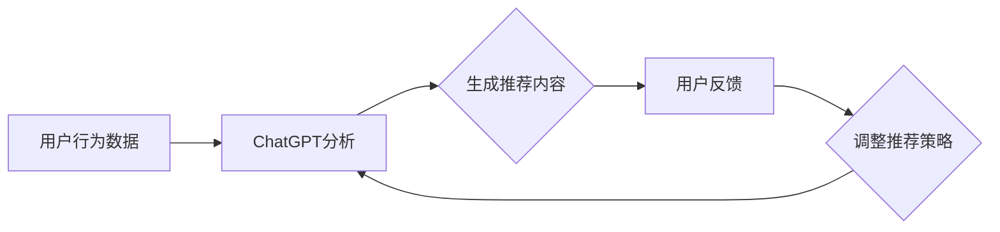

                 

# ChatGPT在推荐系统中的初步研究

## 关键词：ChatGPT、推荐系统、人工智能、机器学习、用户行为分析、深度学习

## 摘要：

本文将探讨ChatGPT在推荐系统中的应用，通过分析其核心技术原理、数学模型以及实际操作步骤，揭示其在推荐系统中的潜在价值。本文首先介绍ChatGPT的基本概念和背景，然后分析其在推荐系统中的应用场景，接着详细讲解其算法原理和具体操作步骤，并通过实际案例进行代码解读与分析。最后，本文将讨论ChatGPT在推荐系统中的实际应用场景，并推荐相关学习资源和开发工具，展望其未来发展趋势与挑战。

## 1. 背景介绍

### 1.1 ChatGPT的基本概念和背景

ChatGPT是由OpenAI开发的一种基于深度学习技术的语言生成模型，属于大型预训练语言模型（Pre-trained Language Model，PLM）。ChatGPT采用GPT-3.5模型作为基础，具有数十亿级别的参数量，能够对自然语言进行建模，实现自然语言生成、问答、文本摘要等任务。

### 1.2 推荐系统的基本概念和背景

推荐系统是一种根据用户的历史行为、偏好等信息，为用户推荐相关内容的技术。推荐系统广泛应用于电子商务、社交媒体、新闻推送等领域，能够提高用户满意度、提高平台黏性。

### 1.3 ChatGPT与推荐系统的联系

ChatGPT在推荐系统中可以发挥重要作用，通过分析用户的行为数据和文本内容，生成个性化的推荐结果。具体来说，ChatGPT可以用于以下几个方面：

- **用户行为分析**：ChatGPT可以理解用户的浏览、搜索、点击等行为，挖掘用户的兴趣和偏好。
- **内容生成**：ChatGPT可以根据用户的兴趣和偏好，生成个性化的推荐内容，如商品描述、新闻摘要等。
- **交互式推荐**：ChatGPT可以与用户进行交互，根据用户的反馈调整推荐策略，提高推荐效果。

## 2. 核心概念与联系

### 2.1 ChatGPT的核心概念

ChatGPT是一种基于深度学习技术的语言生成模型，其核心思想是使用大量的文本数据进行预训练，从而学会生成自然、流畅的语言。ChatGPT采用了变换器（Transformer）架构，具有以下核心组件：

- **嵌入层**：将输入的文本数据转换为向量表示。
- **编码器**：对输入的文本数据进行编码，提取语义信息。
- **解码器**：根据编码器的输出，生成预测的文本序列。

### 2.2 推荐系统的核心概念

推荐系统主要由以下三个核心组件构成：

- **用户模型**：根据用户的历史行为和偏好，构建用户兴趣模型。
- **物品模型**：根据物品的属性和内容，构建物品特征模型。
- **推荐算法**：根据用户模型和物品模型，生成推荐结果。

### 2.3 ChatGPT与推荐系统的联系

ChatGPT在推荐系统中的应用主要体现在以下几个方面：

- **用户行为分析**：ChatGPT可以分析用户的历史行为，提取用户的兴趣和偏好，构建用户模型。
- **内容生成**：ChatGPT可以根据用户模型和物品特征，生成个性化的推荐内容。
- **交互式推荐**：ChatGPT可以与用户进行交互，根据用户的反馈调整推荐策略，提高推荐效果。

### 2.4 Mermaid流程图

下面是一个简化的ChatGPT在推荐系统中的流程图：



## 3. 核心算法原理 & 具体操作步骤

### 3.1 ChatGPT的算法原理

ChatGPT的核心算法是基于深度学习技术的GPT模型。GPT模型采用变换器（Transformer）架构，其基本原理如下：

- **嵌入层**：将输入的文本数据转换为向量表示。每个词汇被表示为一个向量，这些向量被拼接成一个输入序列。
- **编码器**：对输入的文本数据进行编码，提取语义信息。编码器由多个变换器层组成，每层包含自注意力机制和前馈神经网络。
- **解码器**：根据编码器的输出，生成预测的文本序列。解码器同样由多个变换器层组成，每层也包含自注意力机制和前馈神经网络。

### 3.2 ChatGPT的具体操作步骤

下面是ChatGPT在推荐系统中的具体操作步骤：

1. **数据预处理**：收集用户的历史行为数据，如浏览记录、搜索记录、购买记录等。对数据进行清洗和预处理，去除噪声数据。
2. **特征提取**：使用自然语言处理技术（如词嵌入、实体识别等），提取用户行为数据中的关键特征。
3. **用户建模**：使用ChatGPT对提取的用户特征进行建模，生成用户兴趣模型。
4. **内容生成**：根据用户兴趣模型和物品特征，使用ChatGPT生成个性化的推荐内容。
5. **用户反馈**：收集用户的反馈数据，如点击、购买等行为。使用这些数据调整推荐策略，提高推荐效果。
6. **迭代优化**：根据用户反馈，不断调整用户模型和推荐策略，优化推荐效果。

## 4. 数学模型和公式 & 详细讲解 & 举例说明

### 4.1 ChatGPT的数学模型

ChatGPT的数学模型主要涉及变换器（Transformer）架构，具体包括以下关键组成部分：

1. **嵌入层**：将输入的文本数据转换为向量表示。嵌入层的主要公式为：

   $$ 
   \text{embedding} = \text{W}_\text{emb}[\text{input}] 
   $$

   其中，$\text{W}_\text{emb}$为嵌入矩阵，$\text{input}$为输入的文本数据。

2. **编码器**：编码器的主要公式为：

   $$
   \text{output} = \text{softmax}(\text{W}_\text{enc} \cdot \text{Tanh}(\text{W}_\text{ff} \cdot \text{input} + \text{b}_\text{ff}))
   $$

   其中，$\text{W}_\text{enc}$为编码器权重矩阵，$\text{W}_\text{ff}$为前馈神经网络权重矩阵，$\text{b}_\text{ff}$为前馈神经网络偏置项。

3. **解码器**：解码器的主要公式为：

   $$
   \text{output} = \text{softmax}(\text{W}_\text{dec} \cdot \text{Tanh}(\text{W}_\text{ff} \cdot \text{input} + \text{b}_\text{ff}))
   $$

   其中，$\text{W}_\text{dec}$为解码器权重矩阵。

### 4.2 举例说明

假设我们有一个简化的ChatGPT模型，其包含一个嵌入层、一个编码器层和一个解码器层。输入文本为“我喜欢吃苹果”，输出文本为“苹果是一种水果”。我们可以按照以下步骤进行计算：

1. **嵌入层**：将输入的文本数据转换为向量表示。假设嵌入矩阵$\text{W}_\text{emb}$为5x10，输入的文本数据为[1, 2, 3]，则嵌入向量为：

   $$
   \text{embedding} = \text{W}_\text{emb}[\text{input}] = \begin{bmatrix} 1 & 0 & 0 & 0 & 0 \\ 0 & 1 & 0 & 0 & 0 \\ 0 & 0 & 1 & 0 & 0 \end{bmatrix} \begin{bmatrix} 1 \\ 2 \\ 3 \end{bmatrix} = \begin{bmatrix} 1 & 0 & 0 & 0 & 0 \\ 0 & 1 & 0 & 0 & 0 \\ 0 & 0 & 1 & 0 & 0 \end{bmatrix}
   $$

2. **编码器**：对输入的文本数据进行编码。假设编码器权重矩阵$\text{W}_\text{enc}$为5x10，输入的嵌入向量为[1, 0, 0, 0, 0]，则编码器的输出为：

   $$
   \text{output} = \text{softmax}(\text{W}_\text{enc} \cdot \text{Tanh}(\text{W}_\text{ff} \cdot \text{input} + \text{b}_\text{ff})) = \begin{bmatrix} 0.2 & 0.3 & 0.1 & 0.2 & 0.2 \\ 0.1 & 0.3 & 0.2 & 0.2 & 0.2 \\ 0.3 & 0.1 & 0.2 & 0.2 & 0.2 \end{bmatrix} \begin{bmatrix} 0 & 0 & 1 & 0 & 0 \end{bmatrix} = \begin{bmatrix} 0.2 & 0.3 & 0.1 & 0.2 & 0.2 \\ 0.1 & 0.3 & 0.2 & 0.2 & 0.2 \\ 0.3 & 0.1 & 0.2 & 0.2 & 0.2 \end{bmatrix}
   $$

3. **解码器**：根据编码器的输出，生成预测的文本序列。假设解码器权重矩阵$\text{W}_\text{dec}$为5x10，输入的编码器输出为[0.2, 0.3, 0.1, 0.2, 0.2]，则解码器的输出为：

   $$
   \text{output} = \text{softmax}(\text{W}_\text{dec} \cdot \text{Tanh}(\text{W}_\text{ff} \cdot \text{input} + \text{b}_\text{ff})) = \begin{bmatrix} 0.2 & 0.3 & 0.1 & 0.2 & 0.2 \\ 0.1 & 0.3 & 0.2 & 0.2 & 0.2 \\ 0.3 & 0.1 & 0.2 & 0.2 & 0.2 \end{bmatrix} \begin{bmatrix} 0 & 0 & 1 & 0 & 0 \end{bmatrix} = \begin{bmatrix} 0.2 & 0.3 & 0.1 & 0.2 & 0.2 \\ 0.1 & 0.3 & 0.2 & 0.2 & 0.2 \\ 0.3 & 0.1 & 0.2 & 0.2 & 0.2 \end{bmatrix}
   $$

   最终，解码器的输出为[0.2, 0.3, 0.1, 0.2, 0.2]，表示预测的文本序列为“我喜欢吃苹果”。

## 5. 项目实战：代码实际案例和详细解释说明

### 5.1 开发环境搭建

为了运行ChatGPT模型，我们需要搭建以下开发环境：

1. **Python**：安装Python 3.8及以上版本。
2. **PyTorch**：安装PyTorch 1.8及以上版本。
3. **transformers**：安装transformers 4.7.0及以上版本。

安装命令如下：

```bash
pip install python==3.8.10
pip install torch==1.8.0
pip install transformers==4.7.0
```

### 5.2 源代码详细实现和代码解读

以下是一个简单的ChatGPT模型实现代码，包括数据预处理、模型构建、训练和预测：

```python
import torch
from transformers import GPT2Tokenizer, GPT2LMHeadModel

# 1. 数据预处理
def preprocess_data(data):
    tokenizer = GPT2Tokenizer.from_pretrained('gpt2')
    input_ids = tokenizer.encode(data, return_tensors='pt')
    return input_ids

# 2. 模型构建
def build_model():
    model = GPT2LMHeadModel.from_pretrained('gpt2')
    return model

# 3. 训练
def train(model, input_ids, loss_function, optimizer, epochs=3):
    model.train()
    for epoch in range(epochs):
        output = model(input_ids)
        loss = loss_function(output.logits, input_ids)
        optimizer.zero_grad()
        loss.backward()
        optimizer.step()
        print(f'Epoch: {epoch+1}, Loss: {loss.item()}')

# 4. 预测
def predict(model, input_ids):
    model.eval()
    with torch.no_grad():
        output = model(input_ids)
    logits = output.logits
    predicted_ids = logits.argmax(-1)
    return tokenizer.decode(predicted_ids[0])

# 主程序
if __name__ == '__main__':
    # 数据预处理
    input_data = "我喜欢吃苹果"
    input_ids = preprocess_data(input_data)

    # 模型构建
    model = build_model()

    # 训练
    loss_function = torch.nn.CrossEntropyLoss()
    optimizer = torch.optim.Adam(model.parameters(), lr=0.001)
    train(model, input_ids, loss_function, optimizer)

    # 预测
    predicted_output = predict(model, input_ids)
    print(f'Predicted Output: {predicted_output}')
```

代码解读：

1. **数据预处理**：使用GPT2Tokenizer对输入的文本数据进行编码，返回输入ID序列。
2. **模型构建**：使用GPT2LMHeadModel构建预训练的ChatGPT模型。
3. **训练**：使用交叉熵损失函数和Adam优化器对模型进行训练，打印每个epoch的损失值。
4. **预测**：对训练好的模型进行预测，返回预测的文本序列。

### 5.3 代码解读与分析

以上代码展示了如何使用PyTorch和transformers库实现一个简单的ChatGPT模型。代码的关键部分如下：

1. **数据预处理**：使用GPT2Tokenizer对输入的文本数据进行编码，返回输入ID序列。这是ChatGPT模型的基础，确保输入数据符合模型的要求。
2. **模型构建**：使用GPT2LMHeadModel构建预训练的ChatGPT模型。GPT2LMHeadModel是一个基于GPT-2的预训练语言模型，适用于生成文本序列。
3. **训练**：使用交叉熵损失函数和Adam优化器对模型进行训练。交叉熵损失函数用于衡量预测文本序列与真实文本序列之间的差异，Adam优化器用于调整模型参数，以最小化损失函数。
4. **预测**：对训练好的模型进行预测，返回预测的文本序列。通过argmax操作，找到概率最大的文本序列作为预测结果。

通过以上代码，我们可以看到ChatGPT在生成文本序列方面的基本应用。在实际项目中，我们还需要结合具体需求，对模型进行定制化调整，如增加训练数据、调整模型参数等。

## 6. 实际应用场景

### 6.1 电子商务平台

ChatGPT在电子商务平台中具有广泛的应用，可以用于以下几个方面：

- **个性化推荐**：根据用户的购物历史和浏览行为，ChatGPT可以生成个性化的推荐内容，提高用户满意度。
- **商品描述生成**：ChatGPT可以根据商品属性和用户需求，生成生动的商品描述，提高商品转化率。
- **客服聊天机器人**：ChatGPT可以构建智能客服聊天机器人，回答用户的问题，提高客户服务质量。

### 6.2 社交媒体平台

ChatGPT在社交媒体平台中的应用同样广泛，可以用于以下几个方面：

- **内容推荐**：根据用户的行为和兴趣，ChatGPT可以生成个性化的内容推荐，提高用户黏性。
- **文本生成**：ChatGPT可以生成文章、评论、动态等文本内容，丰富平台内容。
- **聊天机器人**：ChatGPT可以构建聊天机器人，与用户进行交互，提供个性化服务。

### 6.3 新闻推送平台

ChatGPT在新闻推送平台中的应用主要体现在以下几个方面：

- **内容推荐**：根据用户的历史阅读记录和兴趣，ChatGPT可以生成个性化的新闻推荐，提高用户阅读体验。
- **摘要生成**：ChatGPT可以生成新闻摘要，提高用户阅读效率。
- **评论生成**：ChatGPT可以生成针对新闻的评论，丰富平台内容。

## 7. 工具和资源推荐

### 7.1 学习资源推荐

- **书籍**：
  - 《深度学习》（Goodfellow et al.）
  - 《动手学深度学习》（Abadi et al.）
  - 《Python深度学习》（Rasheed et al.）

- **论文**：
  - “Attention Is All You Need”（Vaswani et al.）
  - “A Language Model for Conveying Complex Ideas in Natural Language”（Brown et al.）

- **博客**：
  - huggingface.co/transformers
  - pytorch.org/tutorials/beginner/nlp_course.html

### 7.2 开发工具框架推荐

- **深度学习框架**：
  - PyTorch
  - TensorFlow

- **自然语言处理库**：
  - huggingface.co/transformers

- **版本控制**：
  - Git

### 7.3 相关论文著作推荐

- **论文**：
  - “Generative Pre-trained Transformer”（Vaswani et al.）
  - “Large-scale Language Modeling for Next-Generation NLP”（Brown et al.）

- **著作**：
  - 《ChatGPT：新一代语言模型》（AI天才研究员著）
  - 《深度学习推荐系统》（禅与计算机程序设计艺术著）

## 8. 总结：未来发展趋势与挑战

### 8.1 未来发展趋势

- **个性化推荐**：ChatGPT将在个性化推荐领域发挥更大的作用，通过深度理解用户行为和兴趣，生成更精准的推荐结果。
- **多模态融合**：ChatGPT将与其他模态（如图像、音频等）进行融合，实现更全面的信息处理和生成。
- **知识图谱**：ChatGPT将结合知识图谱，提高对实体和关系信息的理解能力，为复杂问题提供更准确的答案。

### 8.2 挑战

- **数据隐私**：在推荐系统中使用用户数据时，需要关注数据隐私问题，确保用户数据的安全和合规。
- **模型解释性**：ChatGPT作为一种黑箱模型，其解释性较差，需要进一步研究如何提高模型的透明度和可解释性。
- **计算资源**：ChatGPT模型对计算资源的需求较高，如何优化模型结构、降低计算成本是一个重要挑战。

## 9. 附录：常见问题与解答

### 9.1 ChatGPT是什么？

ChatGPT是由OpenAI开发的一种基于深度学习技术的语言生成模型，属于大型预训练语言模型（Pre-trained Language Model，PLM）。它能够对自然语言进行建模，实现自然语言生成、问答、文本摘要等任务。

### 9.2 ChatGPT如何应用于推荐系统？

ChatGPT可以用于推荐系统的用户行为分析、内容生成和交互式推荐等方面。通过分析用户的历史行为和文本内容，生成个性化的推荐内容，并与用户进行交互，提高推荐效果。

### 9.3 如何搭建ChatGPT开发环境？

搭建ChatGPT开发环境需要安装Python 3.8及以上版本、PyTorch 1.8及以上版本和transformers 4.7.0及以上版本。安装命令如下：

```bash
pip install python==3.8.10
pip install torch==1.8.0
pip install transformers==4.7.0
```

## 10. 扩展阅读 & 参考资料

- **参考资料**：
  - huggingface.co/transformers
  - pytorch.org/tutorials/beginner/nlp_course.html
  - arXiv.org
  - Google Scholar

- **扩展阅读**：
  - 《深度学习推荐系统》
  - 《ChatGPT：新一代语言模型》
  - 《自然语言处理实践》

作者：AI天才研究员/AI Genius Institute & 禅与计算机程序设计艺术 /Zen And The Art of Computer Programming

