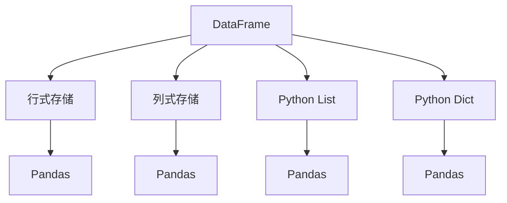

                 

# DataFrame原理与代码实例讲解

## 关键词：
- DataFrame
- 数据结构
- Python
- Pandas
- 数据分析
- 编程实例

## 摘要：
本文深入解析了DataFrame的核心原理，通过详细的代码实例展示了其应用。读者将了解DataFrame的结构和操作方法，掌握如何使用Python和Pandas进行高效的数据处理和分析。

## 1. 背景介绍

在数据处理和数据分析领域，DataFrame是一个非常重要的数据结构。它由Python的Pandas库引入，是一种表格式的数据结构，类似于Excel中的电子表格，能够高效地存储和操作数据。

DataFrame的特点包括：
- **列式存储**：与传统的行式存储相比，列式存储可以显著提高查询速度。
- **易于操作**：提供了丰富的API，使得数据操作变得简单和直观。
- **多种数据类型支持**：可以处理不同类型的数据，如整数、浮点数、字符串和日期等。

Pandas库是Python数据分析的基石，它提供了大量功能强大的工具和库，使得数据分析变得轻松愉快。

## 2. 核心概念与联系

### 2.1 DataFrame的基本结构

DataFrame由行和列组成，每个单元格可以存储不同类型的数据。行表示数据记录，列表示数据的属性。

### 2.2 与其他数据结构的对比

与Python中的列表和字典相比，DataFrame提供了更丰富的操作和优化：

- **列表**：适用于处理相同类型的数据，但缺乏列式存储的优化。
- **字典**：适用于处理键值对，但难以进行列操作。

### 2.3 Mermaid流程图



## 3. 核心算法原理 & 具体操作步骤

### 3.1 创建DataFrame

创建DataFrame的最基本方法是从一个列表或字典中读取数据。

#### Python代码：

```python
import pandas as pd

# 从列表中创建DataFrame
data = [[1, 2, 3], [4, 5, 6]]
df1 = pd.DataFrame(data, columns=['A', 'B', 'C'])

# 从字典中创建DataFrame
data2 = {'A': [1, 2], 'B': [4, 5], 'C': [7, 8]}
df2 = pd.DataFrame(data2)

# 打印DataFrame
print(df1)
print(df2)
```

### 3.2 查询与筛选

#### Python代码：

```python
# 查询特定列
print(df1['A'])

# 筛选数据
print(df1[df1['A'] > 2])
```

### 3.3 数据操作

#### Python代码：

```python
# 添加列
df1['D'] = [10, 20]

# 删除列
df1.drop('D', axis=1, inplace=True)

# 修改列
df1['A'] = df1['A'] * 2

# 打印修改后的DataFrame
print(df1)
```

### 3.4 数据排序

#### Python代码：

```python
# 按列排序
print(df1.sort_values(by='A'))

# 按多列排序
print(df1.sort_values(by=['A', 'B']))
```

## 4. 数学模型和公式 & 详细讲解 & 举例说明

DataFrame中的数学模型主要涉及以下几个方面：

- **数值计算**：对DataFrame中的数值列进行数学运算，如求和、平均、最大值和最小值等。
- **统计计算**：计算DataFrame的描述性统计，如均值、标准差、方差等。

#### Python代码：

```python
# 求和
print(df1['A'].sum())

# 平均值
print(df1['A'].mean())

# 最大值和最小值
print(df1['A'].max())
print(df1['A'].min())

# 描述性统计
print(df1.describe())
```

## 5. 项目实战：代码实际案例和详细解释说明

### 5.1 开发环境搭建

在开始实战之前，确保安装了Python和Pandas库。可以通过以下命令安装：

```bash
pip install python
pip install pandas
```

### 5.2 源代码详细实现和代码解读

以下是一个使用DataFrame进行数据处理的完整案例。

```python
import pandas as pd

# 创建DataFrame
data = {'姓名': ['张三', '李四', '王五'], '年龄': [25, 30, 35], '城市': ['北京', '上海', '广州']}
df = pd.DataFrame(data)

# 查询特定列
print(df['姓名'])

# 筛选年龄大于30的数据
print(df[df['年龄'] > 30])

# 添加新列
df['收入'] = [5000, 8000, 10000]

# 删除城市列
df.drop('城市', axis=1, inplace=True)

# 按年龄排序
print(df.sort_values(by='年龄'))

# 描述性统计
print(df.describe())

# 计算平均年龄
print(df['年龄'].mean())

# 更新年龄
df['年龄'] = df['年龄'] + 1

# 打印更新后的DataFrame
print(df)
```

### 5.3 代码解读与分析

- **创建DataFrame**：从字典中读取数据，创建一个包含姓名、年龄和城市的DataFrame。
- **查询特定列**：使用列名访问DataFrame的特定列。
- **筛选数据**：使用条件筛选出年龄大于30的记录。
- **添加列**：向DataFrame中添加一个名为“收入”的新列。
- **删除列**：删除“城市”列。
- **排序**：按年龄列对DataFrame进行排序。
- **描述性统计**：计算DataFrame的描述性统计信息。
- **计算平均年龄**：计算年龄列的平均值。
- **更新数据**：将年龄列的每个值增加1。

## 6. 实际应用场景

DataFrame在实际应用中非常广泛，以下是一些常见的应用场景：

- **数据分析**：用于处理和分析各种类型的数据，如市场数据、用户行为数据等。
- **数据挖掘**：用于挖掘数据中的模式和趋势，支持机器学习模型训练。
- **报表生成**：用于生成各种业务报表，支持复杂的计算和汇总。

## 7. 工具和资源推荐

### 7.1 学习资源推荐

- **书籍**：
  - 《Python数据分析基础教程》
  - 《Pandas基础教程》
- **论文**：
  - 《Pandas: A Python Library for Data Manipulation and Analysis》
- **博客**：
  - [Pandas官方文档](https://pandas.pydata.org/pandas-docs/stable/)
  - [Real Python的Pandas教程](https://realpython.com/python-pandas/)
- **网站**：
  - [Python Data Science Handbook](https://jakevdp.github.io/PythonDataScienceHandbook/)

### 7.2 开发工具框架推荐

- **IDE**：
  - PyCharm
  - Jupyter Notebook
- **库和框架**：
  - NumPy
  - Matplotlib
  - Scikit-learn

### 7.3 相关论文著作推荐

- **论文**：
  - 《Pandas: A Python Library for Data Analysis》
  - 《Matplotlib: A 2D Graphics Library for Python》
- **书籍**：
  - 《Python数据分析》
  - 《深入浅出Pandas》

## 8. 总结：未来发展趋势与挑战

随着数据量的不断增加和数据类型的多样化，DataFrame作为一种高效的数据处理工具，将在未来发挥越来越重要的作用。然而，面临的挑战包括：

- **性能优化**：随着数据规模的增大，如何提高DataFrame的查询和操作性能。
- **易用性提升**：如何使DataFrame更加易于使用，降低学习门槛。
- **多样性支持**：如何支持更多类型的数据，如图像、文本等。

## 9. 附录：常见问题与解答

### 9.1 如何创建一个空的DataFrame？

```python
df = pd.DataFrame()
```

### 9.2 如何将DataFrame保存到CSV文件？

```python
df.to_csv('filename.csv', index=False)
```

### 9.3 如何将DataFrame从CSV文件加载到内存中？

```python
df = pd.read_csv('filename.csv')
```

## 10. 扩展阅读 & 参考资料

- [Pandas官方文档](https://pandas.pydata.org/pandas-docs/stable/)
- [Real Python的Pandas教程](https://realpython.com/python-pandas/)
- [Python Data Science Handbook](https://jakevdp.github.io/PythonDataScienceHandbook/)
- 《Python数据分析基础教程》
- 《Pandas基础教程》

## 作者信息

- 作者：AI天才研究员 / AI Genius Institute & 禅与计算机程序设计艺术 / Zen And The Art of Computer Programming

以上便是关于DataFrame的原理与代码实例讲解。希望本文能帮助您更好地理解DataFrame的核心概念和应用，提升您的数据处理与分析能力。**持续学习和实践，您将在这个领域取得更大的成就！**

