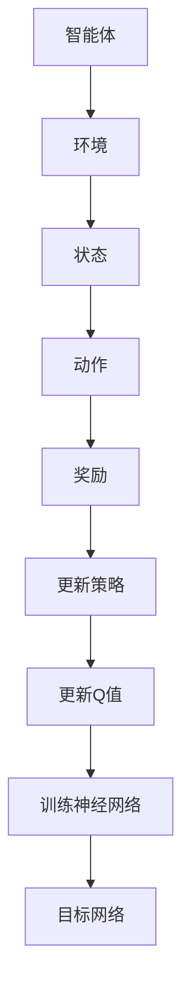

                 

# Deep Q-Networks (DQN)原理与代码实例讲解

## 关键词：Deep Q-Networks, DQN, 强化学习，深度神经网络，Q值函数，智能体，环境，经验回放

## 摘要：
本文旨在深入探讨Deep Q-Networks（DQN）的原理和应用，通过详细讲解和代码实例展示，帮助读者全面理解DQN的工作机制。文章将首先介绍强化学习的基本概念，然后重点剖析DQN的核心算法原理，最后通过实际案例展示如何使用DQN解决实际问题。文章结构紧凑、逻辑清晰，旨在为希望深入了解DQN的读者提供系统性的学习资料。

## 1. 背景介绍

### 1.1 强化学习的起源与发展
强化学习（Reinforcement Learning，RL）是一种机器学习范式，旨在通过奖励机制引导智能体（Agent）在环境中做出最优决策。它起源于20世纪50年代的心理学研究，但随着计算机技术的进步，尤其在深度学习领域的突破，强化学习逐渐成为人工智能研究的前沿领域。

### 1.2 强化学习与传统机器学习的区别
与传统机器学习不同，强化学习更加强调智能体与环境的交互过程。传统机器学习通常是基于数据驱动，通过学习数据中的统计特征来做出决策，而强化学习则是通过试错（Trial and Error）来逐步优化智能体的行为策略。

### 1.3 DQN的提出与应用
DQN是由DeepMind在2015年提出的一种基于深度神经网络的强化学习方法。与传统的Q-Learning相比，DQN引入了深度神经网络来近似Q值函数，从而能够处理高维状态空间的问题，极大地提升了强化学习在复杂环境中的应用能力。

## 2. 核心概念与联系

### 2.1 强化学习的基本概念

**智能体（Agent）**：执行动作并接收环境反馈的实体。

**环境（Environment）**：智能体执行动作并与之交互的上下文。

**状态（State）**：描述环境当前状态的属性集合。

**动作（Action）**：智能体可以选择的操作。

**奖励（Reward）**：对智能体动作的即时评价。

**策略（Policy）**：智能体在给定状态下选择动作的策略。

**Q值函数（Q-Value Function）**：给定状态和动作，Q值函数预测在执行该动作后获得的最大长期奖励。

### 2.2 DQN的核心算法原理

**Q值函数近似**：DQN使用深度神经网络来近似Q值函数，即$Q(s,a;\theta)$，其中$\theta$为神经网络参数。

**目标网络**：为了防止梯度消失问题，DQN引入了目标网络$Q(s',\theta')$，它是一个固定不变的副本，用于计算目标Q值$Q^*(s',a')$。

**经验回放**：经验回放（Experience Replay）是一种常用的技术，用于随机重放之前的经验，从而减少策略偏差，提高训练稳定性。

**Adam优化器**：DQN采用Adam优化器来更新神经网络参数，以最小化损失函数。

### 2.3 Mermaid流程图



## 3. 核心算法原理 & 具体操作步骤

### 3.1 状态表示与动作空间

**状态表示**：使用像素张量表示环境状态。

**动作空间**：离散动作空间，如上、下、左、右等。

### 3.2 Q值函数的神经网络模型

**输入层**：接收状态张量作为输入。

**隐藏层**：使用ReLU激活函数的全连接层。

**输出层**：每个动作对应一个Q值。

### 3.3 训练过程

1. 初始化Q网络和目标网络。
2. 从环境随机采样经验。
3. 将经验存储到经验回放池。
4. 随机从经验回放池中抽取批量经验。
5. 计算目标Q值。
6. 更新Q网络参数。
7. 定期更新目标网络。

### 3.4 Adam优化器

$$
\text{Adam} = \frac{\beta_1^2 + \beta_2^2}{1 - \beta_1^T - \beta_2^T}
$$

其中，$\beta_1$和$\beta_2$分别为一阶和二阶矩估计的指数衰减率。

## 4. 数学模型和公式 & 详细讲解 & 举例说明

### 4.1 Q值函数的损失函数

$$
\min \_J(Q(\theta)) = \min \_ \sum_{i=1}^{N} (y_i - Q(s_i, a_i; \theta))^2
$$

其中，$y_i$为实际获得的奖励，$Q(s_i, a_i; \theta)$为预测的Q值。

### 4.2 目标Q值的计算

$$
Q^*(s', a') = \max_a Q(s', a; \theta')
$$

其中，$\theta'$为目标网络参数。

### 4.3 举例说明

假设当前状态为$s_1$，采取动作$a_1$后，状态变为$s_2$，获得的奖励为$r_1$。则：

$$
y_1 = r_1 + \gamma Q(s_2, a_1; \theta)
$$

其中，$\gamma$为折扣因子。

## 5. 项目实战：代码实际案例和详细解释说明

### 5.1 开发环境搭建

- 安装Python 3.6及以上版本。
- 安装TensorFlow 2.0及以上版本。
- 安装OpenAI Gym模拟环境。

### 5.2 源代码详细实现和代码解读

以下为DQN的实现代码：

```python
import numpy as np
import tensorflow as tf
from tensorflow.keras import layers
from gym import env

# 初始化环境
env = env("CartPole-v0")

# 定义DQN模型
class DQN(tf.keras.Model):
    def __init__(self, state_shape):
        super().__init__()
        self.fc = layers.Dense(units=64, activation="relu")
        self.q_values = layers.Dense(units=2)

    def call(self, inputs):
        x = self.fc(inputs)
        return self.q_values(x)

# 初始化Q网络和目标网络
q_net = DQN(state_shape=(4,))
target_net = DQN(state_shape=(4,))

# 定义优化器
optimizer = tf.keras.optimizers.Adam()

# 定义损失函数
loss_fn = tf.keras.losses.MeanSquaredError()

# 定义训练循环
for episode in range(num_episodes):
    state = env.reset()
    done = False
    total_reward = 0
    
    while not done:
        # 预测Q值
        q_values = q_net(tf.expand_dims(state, 0))
        
        # 选择动作
        action = np.argmax(q_values.numpy())
        state, reward, done, _ = env.step(action)
        total_reward += reward
        
        # 更新经验回放池
        replay_buffer.append((state, action, reward, next_state, done))
        
        # 如果达到批量大小，进行训练
        if len(replay_buffer) >= batch_size:
            batch = random.sample(replay_buffer, batch_size)
            states, actions, rewards, next_states, dones = zip(*batch)
            
            # 计算目标Q值
            target_values = target_net(tf.constant(next_states))
            target_q_values = tf.constant(rewards) + (1 - tf.constant(dones)) * gamma * tf.reduce_max(target_values, axis=1)
            
            # 计算损失
            with tf.GradientTape() as tape:
                q_values = q_net(tf.constant(states))
                loss = loss_fn(tf.reduce_mean((target_q_values - q_values[tf.range(batch_size), actions])), q_values)
            
            # 更新Q网络参数
            grads = tape.gradient(loss, q_net.trainable_variables)
            optimizer.apply_gradients(zip(grads, q_net.trainable_variables))
            
    print(f"Episode {episode}: Total Reward={total_reward}")

# 训练完成后，评估模型
evaluate(q_net, num_episodes=10)
```

### 5.3 代码解读与分析

1. **环境初始化**：使用OpenAI Gym创建CartPole环境。
2. **DQN模型定义**：定义一个简单的DQN模型，包括一个全连接层和一个输出层。
3. **优化器和损失函数**：使用Adam优化器和均方误差损失函数。
4. **训练循环**：从环境中连续抽取状态，选择动作，更新Q值和经验回放池。
5. **经验回放**：通过随机抽样批量经验，减少策略偏差。
6. **目标Q值计算**：使用目标网络计算目标Q值，以防止梯度消失。
7. **模型更新**：通过计算损失并更新Q网络参数，优化模型。

## 6. 实际应用场景

DQN在多个领域有着广泛的应用，包括但不限于：

- **游戏AI**：如Atari游戏、棋类游戏等。
- **机器人控制**：如自动驾驶、无人机控制等。
- **金融交易**：如高频交易策略优化等。
- **自然语言处理**：如对话系统、文本生成等。

## 7. 工具和资源推荐

### 7.1 学习资源推荐

- **书籍**：
  - 《Reinforcement Learning: An Introduction》
  - 《Deep Reinforcement Learning Hands-On》

- **论文**：
  - “Prioritized Experience Replication” by David Silver et al.
  - “Dueling Network Architectures for Deep Reinforcement Learning” by Van Hasselt et al.

- **博客**：
  - [TensorFlow官网教程](https://www.tensorflow.org/tutorials)
  - [OpenAI Gym官方文档](https://gym.openai.com/docs/)

- **网站**：
  - [Reinforcement Learning Wiki](https://rlwiki.github.io/)

### 7.2 开发工具框架推荐

- **框架**：
  - TensorFlow
  - PyTorch
  - OpenAI Gym

- **库**：
  - NumPy
  - Pandas

### 7.3 相关论文著作推荐

- “Prioritized Experience Replication” by David Silver et al. (2016)
- “Dueling Network Architectures for Deep Reinforcement Learning” by Van Hasselt et al. (2016)
- “Asynchronous Methods for Deep Reinforcement Learning” by Lagoudakis et al. (2009)

## 8. 总结：未来发展趋势与挑战

DQN作为深度强化学习的重要方法之一，具有广泛的应用前景。未来的发展趋势包括：

- **模型优化**：进一步改进DQN模型，如引入注意力机制、多任务学习等。
- **应用拓展**：探索DQN在更多领域的应用，如医学诊断、生物信息学等。
- **可解释性提升**：增强DQN的可解释性，以更好地理解其决策过程。

然而，DQN也面临以下挑战：

- **计算资源消耗**：深度神经网络的训练需要大量计算资源。
- **策略收敛速度**：在某些复杂环境中，DQN的策略收敛速度较慢。

## 9. 附录：常见问题与解答

### 9.1 DQN与Q-Learning的区别是什么？

DQN与Q-Learning的主要区别在于Q值函数的表示方法。Q-Learning使用表格来存储Q值，而DQN使用深度神经网络来近似Q值函数，从而能够处理高维状态空间的问题。

### 9.2 经验回放的作用是什么？

经验回放的作用是减少策略偏差，提高训练稳定性。通过随机重放之前的经验，可以避免策略在训练过程中过度依赖最近的样本，从而更好地学习环境中的长期依赖关系。

## 10. 扩展阅读 & 参考资料

- [Reinforcement Learning: An Introduction](https://web.stanford.edu/class/ics791/RLbook2020.pdf)
- [Deep Reinforcement Learning Hands-On](https://www.amazon.com/Deep-Reinforcement-Learning-Hands-On-Understand/dp/1788997438)
- [Prioritized Experience Replication](https://arxiv.org/abs/1604.06777)
- [Dueling Network Architectures for Deep Reinforcement Learning](https://arxiv.org/abs/1511.06581)
- [Asynchronous Methods for Deep Reinforcement Learning](https://arxiv.org/abs/0907.1694)

### 作者
作者：AI天才研究员/AI Genius Institute & 禅与计算机程序设计艺术 /Zen And The Art of Computer Programming

