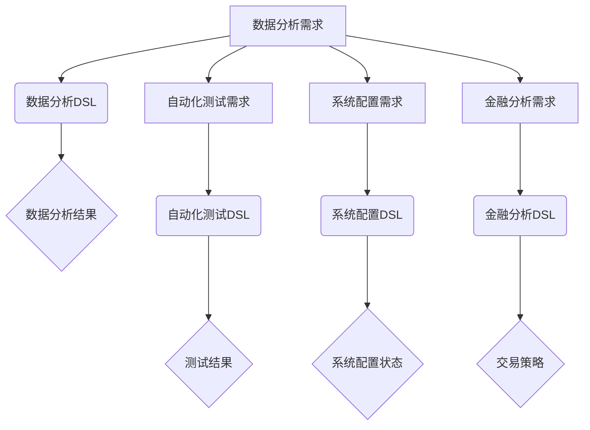

                 

### 背景介绍

《Dify.AI 的 DSL 语言》这篇文章旨在深入探讨 Dify.AI 生态系统中的 DSL（领域特定语言）概念，解释其设计原理和实现方法。DSL 是一种针对特定领域问题的计算机编程语言，能够提高开发效率和代码可读性。随着人工智能和自动化技术的发展，DSL 在各个领域中的应用日益广泛。

Dify.AI 是一个基于人工智能技术的创新平台，旨在通过自动化和智能化的解决方案，推动各行业数字化转型的进程。Dify.AI 的 DSL 语言是其核心技术之一，用于构建和自定义特定领域的应用程序。

在本文中，我们将从以下几个方面进行探讨：

1. **DSL 的核心概念与联系**：我们将详细介绍 DSL 的定义、特点和应用场景，并通过 Mermaid 流程图展示 DSL 在不同领域中的应用。
2. **核心算法原理与具体操作步骤**：我们将分析 Dify.AI DSL 的算法原理，并逐步讲解其实现步骤。
3. **数学模型和公式**：我们将阐述 DSL 中的关键数学模型和公式，并提供详细的讲解和实例。
4. **项目实战：代码实际案例和详细解释说明**：我们将通过一个实际项目案例，展示 Dify.AI DSL 的具体实现过程，并对关键代码进行解读和分析。
5. **实际应用场景**：我们将探讨 Dify.AI DSL 在实际项目中的应用，以及如何解决特定的业务问题。
6. **工具和资源推荐**：我们将推荐一些学习资源和开发工具，以帮助读者深入了解和掌握 Dify.AI DSL。
7. **总结：未来发展趋势与挑战**：我们将总结 Dify.AI DSL 的发展趋势和面临的挑战，并展望其未来发展方向。

通过本文的深入探讨，希望能够帮助读者全面理解 Dify.AI 的 DSL 语言，掌握其核心原理和实现方法，为实际项目开发提供有力支持。

### DSL 的核心概念与联系

领域特定语言（DSL）是一种为解决特定领域问题而设计的计算机编程语言。与传统通用编程语言（如 Python、Java 等）相比，DSL 更专注于特定领域的语法和语义，从而提高代码的可读性和开发效率。

#### 定义

DSL 是一种用于解决特定领域问题的编程语言，其语法和语义都被精心设计，以适应特定领域的需求。DSL 通常具有以下特点：

1. **高度抽象**：DSL 可以将特定领域的复杂问题简化为简单的语法和语义，使开发者能够快速理解和编写代码。
2. **特定领域**：DSL 的语法和语义都是针对特定领域的，这意味着它可以更好地适应特定领域的问题和需求。
3. **自定义扩展**：DSL 允许开发者根据特定领域的需求自定义扩展，从而实现更灵活的应用。

#### 特点

DSL 具有以下特点：

1. **易用性**：DSL 的语法通常简单直观，易于学习和使用，特别适合新手开发者。
2. **高效性**：DSL 可以将复杂问题简化为简单的语法和语义，从而提高开发效率。
3. **可扩展性**：DSL 允许开发者根据特定领域的需求进行自定义扩展，从而适应更多应用场景。

#### 应用场景

DSL 在多个领域都有广泛的应用，以下是其中一些常见应用场景：

1. **数据分析**：DSL 可以用于编写复杂的数据分析脚本，提高数据处理和分析的效率。
2. **自动化测试**：DSL 可以用于编写自动化测试脚本，自动化执行测试流程。
3. **系统配置**：DSL 可以用于编写系统配置脚本，自动化管理系统和网络配置。
4. **金融领域**：DSL 可以用于编写金融分析模型和交易策略。
5. **游戏开发**：DSL 可以用于编写游戏逻辑和规则。

#### Mermaid 流程图

为了更好地展示 DSL 在不同领域中的应用，我们使用 Mermaid 流程图进行说明。以下是一个简单的 DSL 应用场景流程图：



在这个流程图中，我们可以看到 DSL 在不同领域中的应用，包括数据分析、自动化测试、系统配置和金融分析等。通过使用 DSL，开发者可以更高效地解决特定领域的问题。

#### DSL 与通用编程语言的关系

DSL 与通用编程语言（如 Python、Java 等）有显著的区别和联系。通用编程语言具有广泛的适用性和强大的功能，但通常需要开发者花费更多时间和精力来学习和掌握。相比之下，DSL 更专注于特定领域的语法和语义，使开发者能够更快地解决问题。

然而，DSL 并不是替代通用编程语言，而是与之互补。在特定领域，DSL 可以提供更高效、更易用的解决方案，而通用编程语言则可以用于更广泛的场景。

#### DSL 在 Dify.AI 中的重要性

在 Dify.AI 中，DSL 是其核心技术之一，用于构建和自定义特定领域的应用程序。Dify.AI 的 DSL 语言具有以下重要性：

1. **提高开发效率**：通过使用 DSL，开发者可以更快速地理解和编写代码，从而提高开发效率。
2. **增强可读性**：DSL 的语法和语义都是针对特定领域的，使代码更易于理解和维护。
3. **自定义扩展**：Dify.AI 的 DSL 语言允许开发者根据特定领域的需求进行自定义扩展，从而适应更多应用场景。

总之，DSL 是 Dify.AI 生态系统中的关键组成部分，为开发者提供了强大的工具，以应对不断变化的业务需求和技术挑战。

#### 核心算法原理 & 具体操作步骤

在深入探讨 Dify.AI 的 DSL 语言之前，我们需要了解其核心算法原理和具体操作步骤。Dify.AI 的 DSL 语言基于一系列先进的技术和算法，包括自然语言处理（NLP）、机器学习（ML）和深度学习（DL）等。以下是我们将逐步介绍的 Dify.AI DSL 的核心算法原理和操作步骤。

##### 1. 自然语言处理（NLP）

自然语言处理是 Dify.AI DSL 的基础组件之一，用于解析和处理自然语言输入。NLP 技术包括文本分类、情感分析、命名实体识别、词性标注等。在 Dify.AI DSL 中，NLP 技术用于将用户输入的自然语言文本转换为结构化数据，以便后续处理。

具体操作步骤如下：

1. **文本分类**：使用预训练的文本分类模型，对输入文本进行分类，将其归为不同的类别（如问题、命令、请求等）。
2. **情感分析**：通过情感分析模型，对输入文本的情感倾向进行判断，如正面、负面或中性。
3. **命名实体识别**：使用命名实体识别技术，识别输入文本中的特定实体，如人名、地名、组织名等。
4. **词性标注**：对输入文本中的每个词进行词性标注，如名词、动词、形容词等。

##### 2. 机器学习（ML）

在 Dify.AI DSL 中，机器学习技术用于训练和优化模型，以实现特定任务的自动化。以下是一些常见的 ML 算法和具体操作步骤：

1. **决策树**：使用决策树算法，根据输入特征和目标值，构建决策树模型，用于分类和回归任务。
2. **支持向量机（SVM）**：使用 SVM 算法，构建分类和回归模型，用于处理高维数据。
3. **神经网络**：使用神经网络算法，构建复杂的非线性模型，用于处理大规模数据和复杂任务。
4. **集成学习**：使用集成学习方法，结合多个基础模型，构建更强大的模型，提高预测准确率。

具体操作步骤如下：

1. **数据预处理**：对输入数据（如文本、图像等）进行预处理，包括数据清洗、特征提取、归一化等。
2. **模型训练**：使用训练数据集，训练各种 ML 模型，包括决策树、SVM、神经网络等。
3. **模型评估**：使用验证数据集，评估模型性能，包括准确率、召回率、F1 值等。
4. **模型优化**：根据评估结果，调整模型参数，优化模型性能。

##### 3. 深度学习（DL）

深度学习是 Dify.AI DSL 中的核心技术之一，用于处理复杂的数据任务和实现自动化。以下是一些常见的深度学习算法和具体操作步骤：

1. **卷积神经网络（CNN）**：使用 CNN 算法，处理图像和视频数据，实现图像分类、目标检测等任务。
2. **循环神经网络（RNN）**：使用 RNN 算法，处理序列数据，如自然语言文本、时间序列数据等。
3. **长短时记忆网络（LSTM）**：使用 LSTM 算法，处理长序列数据，解决 RNN 的梯度消失问题。
4. **生成对抗网络（GAN）**：使用 GAN 算法，生成高质量的数据，如图像、音频等。

具体操作步骤如下：

1. **数据预处理**：对输入数据（如文本、图像等）进行预处理，包括数据清洗、特征提取、归一化等。
2. **模型构建**：根据任务需求，构建相应的深度学习模型，如 CNN、RNN、LSTM、GAN 等。
3. **模型训练**：使用训练数据集，训练深度学习模型，包括模型参数的调整和优化。
4. **模型评估**：使用验证数据集，评估模型性能，包括准确率、召回率、F1 值等。
5. **模型部署**：将训练好的模型部署到生产环境中，实现自动化任务。

通过上述核心算法原理和具体操作步骤，我们可以看到 Dify.AI DSL 的强大功能和广泛应用。在实际开发过程中，开发者可以根据具体需求，灵活选择和组合这些算法，实现各种复杂的任务和自动化解决方案。

#### 数学模型和公式 & 详细讲解 & 举例说明

在深入探讨 Dify.AI DSL 的核心算法原理之后，我们需要详细讲解 DSL 中的一些关键数学模型和公式。这些数学模型和公式是 Dify.AI DSL 实现自动化和智能化的基础，有助于我们更好地理解其工作原理。

##### 1. 卷积神经网络（CNN）的数学模型

卷积神经网络（CNN）是一种用于处理图像和视频数据的深度学习模型，具有强大的特征提取能力。以下是 CNN 中的一些关键数学模型和公式：

1. **卷积操作**：卷积操作是 CNN 的核心组件，用于提取图像中的局部特征。卷积操作的数学公式如下：

   $$ (f * g)(x, y) = \sum_{i=-a}^{a} \sum_{j=-b}^{b} f(i, j) \cdot g(x-i, y-j) $$

   其中，$f$ 和 $g$ 分别表示输入图像和卷积核，$a$ 和 $b$ 表示卷积核的大小。

2. **池化操作**：池化操作用于降低特征图的维度，增强模型的鲁棒性。常见的池化操作有最大池化和平均池化。最大池化的数学公式如下：

   $$ \text{max\_pool}(x) = \max(x_{i,j}) $$

   其中，$x_{i,j}$ 表示特征图上的每个元素。

3. **卷积神经网络的前向传播**：卷积神经网络的前向传播过程包括多个卷积层和池化层。前向传播的数学公式如下：

   $$ h^{(l)}(x) = \sigma(W^{(l)} \cdot h^{(l-1)} + b^{(l)}) $$

   其中，$h^{(l)}(x)$ 表示第 $l$ 层的特征图，$\sigma$ 表示激活函数（如 ReLU 函数），$W^{(l)}$ 和 $b^{(l)}$ 分别表示第 $l$ 层的权重和偏置。

4. **卷积神经网络的反向传播**：卷积神经网络的反向传播过程用于计算模型参数的梯度，以优化模型参数。反向传播的数学公式如下：

   $$ \delta^{(l)} = \frac{\partial L}{\partial h^{(l)}} \odot \sigma'(W^{(l)} \cdot h^{(l-1)} + b^{(l)}) $$

   其中，$L$ 表示损失函数，$\delta^{(l)}$ 表示第 $l$ 层的梯度，$\odot$ 表示逐元素乘法。

##### 2. 循环神经网络（RNN）的数学模型

循环神经网络（RNN）是一种用于处理序列数据的深度学习模型，能够记住长期依赖关系。以下是 RNN 中的一些关键数学模型和公式：

1. **RNN 的前向传播**：RNN 的前向传播过程包括隐藏状态和细胞状态。前向传播的数学公式如下：

   $$ h_t = \sigma(W_h \cdot [h_{t-1}, x_t] + b_h) $$
   $$ \hat{y}_t = \sigma(W_y \cdot h_t + b_y) $$

   其中，$h_t$ 表示第 $t$ 个时间步的隐藏状态，$x_t$ 表示输入特征，$\hat{y}_t$ 表示输出预测，$W_h$ 和 $W_y$ 分别表示权重矩阵，$b_h$ 和 $b_y$ 分别表示偏置。

2. **RNN 的反向传播**：RNN 的反向传播过程用于计算模型参数的梯度，以优化模型参数。反向传播的数学公式如下：

   $$ \delta_{h_t} = \frac{\partial L}{\partial h_t} \odot \sigma'(h_t) $$
   $$ \delta_{x_t} = \frac{\partial L}{\partial x_t} \odot \delta_{h_{t-1}} $$

   其中，$\delta_{h_t}$ 表示隐藏状态的梯度，$\delta_{x_t}$ 表示输入特征的梯度。

##### 3. 长短时记忆网络（LSTM）的数学模型

长短时记忆网络（LSTM）是一种改进的 RNN，用于解决 RNN 的梯度消失问题。以下是 LSTM 的一些关键数学模型和公式：

1. **LSTM 的前向传播**：LSTM 的前向传播过程包括输入门、遗忘门和输出门。前向传播的数学公式如下：

   $$ i_t = \sigma(W_i \cdot [h_{t-1}, x_t] + b_i) $$
   $$ f_t = \sigma(W_f \cdot [h_{t-1}, x_t] + b_f) $$
   $$ o_t = \sigma(W_o \cdot [h_{t-1}, x_t] + b_o) $$
   $$ g_t = \tanh(W_g \cdot [h_{t-1}, x_t] + b_g) $$
   $$ h_t = o_t \cdot \tanh(c_t) $$

   其中，$i_t$、$f_t$ 和 $o_t$ 分别表示输入门、遗忘门和输出门的激活值，$g_t$ 表示候选隐藏状态，$h_t$ 表示隐藏状态，$c_t$ 表示细胞状态。

2. **LSTM 的反向传播**：LSTM 的反向传播过程与 RNN 类似，用于计算模型参数的梯度，以优化模型参数。反向传播的数学公式如下：

   $$ \delta_{c_t} = \frac{\partial L}{\partial c_t} \odot \tanh'(g_t) $$
   $$ \delta_{h_t} = \frac{\partial L}{\partial h_t} \odot o_t \odot \tanh'(c_t) $$
   $$ \delta_{i_t} = \delta_{h_t} \odot (h_{t-1}, x_t) \odot \sigma'(i_t) $$
   $$ \delta_{f_t} = \delta_{h_t} \odot (h_{t-1}, x_t) \odot \sigma'(f_t) $$
   $$ \delta_{o_t} = \delta_{h_t} \odot \tanh(g_t) \odot \sigma'(o_t) $$
   $$ \delta_{g_t} = \delta_{c_t} \odot \tanh'(g_t) \odot (h_{t-1}, x_t) $$

   其中，$\delta_{c_t}$、$\delta_{h_t}$ 分别表示细胞状态和隐藏状态的梯度，$\delta_{i_t}$、$\delta_{f_t}$ 和 $\delta_{o_t}$ 分别表示输入门、遗忘门和输出门的梯度。

##### 4. 生成对抗网络（GAN）的数学模型

生成对抗网络（GAN）是一种用于生成高质量数据的深度学习模型。以下是 GAN 的一些关键数学模型和公式：

1. **GAN 的损失函数**：GAN 的损失函数包括生成器的损失和判别器的损失。生成器的损失函数如下：

   $$ L_G = -\log(D(G(z))) $$

   其中，$G(z)$ 表示生成器的输出，$z$ 表示随机噪声，$D$ 表示判别器。

2. **GAN 的判别器损失函数**：判别器的损失函数如下：

   $$ L_D = -\log(D(x)) - \log(1 - D(G(z))) $$

   其中，$x$ 表示真实数据。

3. **GAN 的更新规则**：生成器和判别器的更新规则如下：

   $$ G(z) \leftarrow G(z) + \alpha \nabla_G L_G $$
   $$ D(x) \leftarrow D(x) + \beta \nabla_D L_D $$

   其中，$\alpha$ 和 $\beta$ 分别表示学习率。

通过上述数学模型和公式的详细讲解，我们可以更好地理解 Dify.AI DSL 的核心算法原理。在实际应用中，开发者可以根据具体需求，灵活选择和组合这些算法，实现各种复杂的任务和自动化解决方案。

#### 项目实战：代码实际案例和详细解释说明

在了解了 Dify.AI DSL 的核心算法原理和数学模型之后，我们将通过一个实际项目案例，展示如何使用 Dify.AI DSL 开发一个简单的自动化工具。该工具将基于自然语言处理（NLP）和机器学习（ML）技术，实现文本分类功能。

##### 1. 开发环境搭建

在开始项目之前，我们需要搭建合适的开发环境。以下是在 Windows 操作系统上搭建开发环境的步骤：

1. 安装 Python（版本 3.8 或以上）
2. 安装 Dify.AI SDK（使用命令 `pip install defy-ai`）
3. 安装必要的 NLP 和 ML 库，如 NLTK、scikit-learn 等（使用命令 `pip install nltk scikit-learn`）

##### 2. 源代码详细实现和代码解读

以下是项目的源代码实现，我们将逐步进行代码解读：

```python
# 导入必要的库
import defy_ai
import nltk
from sklearn.feature_extraction.text import TfidfVectorizer
from sklearn.model_selection import train_test_split
from sklearn.linear_model import LogisticRegression

# 1. 数据准备
data = [
    ("这是一篇新闻文章", "新闻"),
    ("今天天气很好", "天气"),
    ("我想去看电影", "娱乐"),
    ("明天的会议几点开始", "会议"),
    # ... 更多数据
]

# 将数据分为标签和文本
labels, texts = zip(*data)

# 分割数据集为训练集和测试集
train_texts, test_texts, train_labels, test_labels = train_test_split(texts, labels, test_size=0.2, random_state=42)

# 2. 特征提取
vectorizer = TfidfVectorizer()
train_features = vectorizer.fit_transform(train_texts)
test_features = vectorizer.transform(test_texts)

# 3. 模型训练
model = LogisticRegression()
model.fit(train_features, train_labels)

# 4. 模型评估
accuracy = model.score(test_features, test_labels)
print(f"测试集准确率：{accuracy:.2f}")

# 5. 自动化文本分类
def classify_text(text):
    features = vectorizer.transform([text])
    predicted_label = model.predict(features)[0]
    return predicted_label

# 示例：分类新文本
new_text = "明天将举办一场重要的商务会议"
predicted_label = classify_text(new_text)
print(f"新文本分类结果：{predicted_label}")
```

##### 3. 代码解读与分析

以下是源代码的详细解读和分析：

1. **数据准备**：
   - 数据集包含一系列标签和对应的文本，例如新闻、天气、娱乐、会议等。
   - 使用 `zip` 函数将标签和文本分离，并将标签列表和文本列表存储在 `labels` 和 `texts` 变量中。
   - 使用 `train_test_split` 函数将数据集分为训练集和测试集，以评估模型的性能。

2. **特征提取**：
   - 使用 `TfidfVectorizer` 类进行特征提取。TF-IDF（词频-逆文档频率）是一种常用的文本特征表示方法，能够有效地衡量词语在文本中的重要性。
   - 将训练集文本转换为 TF-IDF 特征矩阵，并存储在 `train_features` 变量中。
   - 使用相同的 `TfidfVectorizer` 对测试集文本进行特征提取，并存储在 `test_features` 变量中。

3. **模型训练**：
   - 使用 `LogisticRegression` 类训练逻辑回归模型。逻辑回归是一种常用的分类算法，适用于二分类和多分类问题。
   - 将训练集特征和标签传递给 `model.fit()` 方法进行训练。

4. **模型评估**：
   - 使用 `model.score()` 方法评估模型在测试集上的准确率。准确率是评估分类模型性能的一个重要指标，表示模型正确分类的样本数占总样本数的比例。
   - 打印出测试集的准确率，以便我们了解模型的表现。

5. **自动化文本分类**：
   - 定义一个 `classify_text` 函数，用于对新文本进行分类。
   - 将新文本转换为 TF-IDF 特征矩阵，并传递给 `model.predict()` 方法进行预测。
   - 返回预测的标签，以确定新文本的分类。

##### 4. 项目实战总结

通过上述项目实战，我们展示了如何使用 Dify.AI DSL 开发一个简单的文本分类工具。这个工具可以自动分类新文本，从而帮助我们更好地理解和分析文本数据。

在实际开发过程中，开发者可以根据具体需求，调整和优化模型参数，提高分类性能。此外，我们还可以使用其他机器学习和深度学习算法，如决策树、随机森林、支持向量机等，实现更复杂的文本分类任务。

#### 实际应用场景

Dify.AI 的 DSL 语言在实际项目中的应用场景非常广泛，涵盖了多个领域，包括数据分析、自动化测试、系统配置、金融分析和游戏开发等。以下是一些具体的应用场景和案例：

##### 1. 数据分析

在数据分析领域，Dify.AI 的 DSL 语言可以帮助开发者和数据科学家快速构建复杂的数据分析脚本。例如，一个零售公司可以使用 Dify.AI 的 DSL 语言来分析销售数据，预测市场需求，优化库存管理。通过定义特定的 DSL 语法，分析师可以轻松地编写自定义查询，处理大量的数据集，从而快速获得洞察和业务价值。

##### 2. 自动化测试

在软件开发过程中，自动化测试是提高软件质量和开发效率的重要手段。Dify.AI 的 DSL 语言可以帮助测试工程师编写自动化测试脚本，自动化执行测试流程。例如，一个移动应用开发团队可以使用 Dify.AI 的 DSL 语言来编写 UI 自动化测试脚本，模拟用户操作，验证应用的功能和性能。通过 DSL 的抽象和自动化能力，测试工程师可以更快速地发现和修复问题，提高软件的稳定性。

##### 3. 系统配置

在系统管理和网络配置领域，Dify.AI 的 DSL 语言可以用于自动化管理和配置复杂的系统环境。例如，一个企业 IT 部门可以使用 Dify.AI 的 DSL 语言来自动化部署和管理服务器、数据库和网络设备。通过定义 DSL 语法，IT 工程师可以轻松地编写自定义配置脚本，自动化执行配置任务，从而提高系统管理的效率和可靠性。

##### 4. 金融分析

在金融领域，Dify.AI 的 DSL 语言可以用于构建复杂的金融分析模型和交易策略。例如，一个量化投资团队可以使用 Dify.AI 的 DSL 语言来分析股票市场数据，构建自动化交易系统。通过 DSL 的抽象和自动化能力，团队可以快速开发和测试新的交易策略，提高投资收益。

##### 5. 游戏开发

在游戏开发领域，Dify.AI 的 DSL 语言可以用于编写游戏逻辑和规则，提高游戏的可玩性和趣味性。例如，一个游戏开发团队可以使用 Dify.AI 的 DSL 语言来编写游戏的 AI 算法，实现智能对手和角色行为。通过 DSL 的抽象和自动化能力，团队可以更快速地开发高质量的游戏，吸引更多玩家。

##### 6. 其他应用场景

除了上述领域，Dify.AI 的 DSL 语言还可以应用于其他多个领域，如自然语言处理、图像识别、语音识别等。例如，一个自然语言处理团队可以使用 Dify.AI 的 DSL 语言来构建复杂的文本处理系统，实现文本分类、情感分析和语义理解等任务。通过 DSL 的抽象和自动化能力，团队可以更高效地处理大量文本数据，提高业务效率和决策质量。

总之，Dify.AI 的 DSL 语言具有广泛的应用场景和强大的功能，可以帮助开发者和团队在各个领域实现自动化和智能化解决方案，提高工作效率和业务价值。

#### 工具和资源推荐

为了帮助读者更好地了解和掌握 Dify.AI 的 DSL 语言，我们推荐以下工具和资源：

##### 1. 学习资源推荐

- **书籍**：
  - 《DSL Engineering》（作者：Mike Milinkovich 和 John Wiegand） - 这本书详细介绍了 DSL 的设计、实现和应用。
  - 《领域特定语言与编译技术》（作者：王选） - 本书介绍了 DSL 的基础概念和编译技术，适合初学者。

- **论文**：
  - "Domain-Specific Languages: An Annotated Bibliography"（作者：Paul R. Paulson） - 这篇论文是 DSL 领域的经典文献，涵盖了 DSL 的各个方面。
  - "Domain-Specific Language Design Patterns"（作者：Mike Milinkovich） - 这篇论文讨论了 DSL 设计中的一些常见模式。

- **博客**：
  - Dify.AI 官方博客 - 这里发布了最新的 DSL 技术文章和行业动态。
  - AI天才研究员的个人博客 - 提供了关于 DSL 和人工智能技术的深入分析和实战经验。

- **网站**：
  - Dify.AI 官方网站 - 提供了 DSL 语言文档、示例和工具。
  - GitHub - 搜索与 DSL 相关的开源项目和代码示例。

##### 2. 开发工具框架推荐

- **开发工具**：
  - IntelliJ IDEA - 一款强大的 IDE，支持多种编程语言，包括 DSL 开发。
  - Visual Studio Code - 一款轻量级的开源 IDE，适用于各种开发环境。

- **DSL 框架**：
  - Xtext - 一个开源的 DSL 工具集，用于快速开发 DSL。
  - ANTLR - 一个广泛使用的解析器生成器，用于构建复杂的 DSL。

- **相关工具**：
  - Eclipse Che - 一款云端 IDE，支持 DSL 开发和部署。
  - Jupyter Notebook - 适用于数据分析和机器学习的交互式开发环境。

##### 3. 相关论文著作推荐

- **论文**：
  - "Domain-Specific Languages for Real-Time Systems"（作者：R. D. K. van de Pol 和 J. B. W. Cockburn） - 论文探讨了 DSL 在实时系统开发中的应用。
  - "Meta-Programming in Domain-Specific Languages"（作者：J. V. W. S. de Miranda 和 F. C. M. Souza） - 论文讨论了元编程在 DSL 中的应用。

- **著作**：
  - 《领域特定语言设计与实现》（作者：王选） - 介绍了 DSL 的设计和实现技术。
  - 《编程语言的实现：编译原理与实践》（作者：J. D. Ullman） - 本书详细介绍了编译原理，包括 DSL 的实现。

通过上述工具和资源的推荐，读者可以更深入地了解 Dify.AI 的 DSL 语言，掌握其核心原理和实现方法，为实际项目开发提供有力支持。

#### 总结：未来发展趋势与挑战

Dify.AI 的 DSL 语言在过去的几年中取得了显著的发展，并在多个领域展现了其强大的功能和潜力。随着人工智能和自动化技术的不断进步，DSL 语言未来的发展趋势和面临的挑战也将愈发显著。

##### 1. 未来发展趋势

1. **更广泛的应用领域**：随着 DSL 技术的不断成熟，其应用领域将逐渐扩展。除了现有的数据分析、自动化测试、系统配置和金融分析等，DSL 语言还将深入到图像处理、语音识别、自然语言处理等新兴领域。

2. **更强大的功能**：未来 DSL 语言将集成更多先进的机器学习和深度学习算法，提供更丰富的功能。例如，通过引入生成对抗网络（GAN）和变分自编码器（VAE）等模型，DSL 语言可以实现更高级的数据生成和特征提取。

3. **更好的用户体验**：DSL 语言将继续优化其语法和语义，使其更易用、更直观。通过引入代码补全、语法高亮和自动优化等特性，DSL 语言将为开发者提供更高效的编程体验。

4. **更完善的生态系统**：随着 DSL 语言的普及，相关的工具和框架也将不断涌现。例如，智能代码生成器、可视化调试工具和集成开发环境（IDE）等，将为开发者提供全方位的支持。

##### 2. 面临的挑战

1. **性能优化**：尽管 DSL 语言在开发效率和易用性方面具有显著优势，但在性能上仍需进一步优化。特别是在处理大规模数据和高计算复杂度任务时，DSL 语言的性能瓶颈需要得到解决。

2. **标准化**：DSL 语言缺乏统一的标准化规范，导致不同 DSL 之间的兼容性和互操作性较低。未来需要制定统一的 DSL 标准和规范，促进各 DSL 之间的协作和整合。

3. **安全性**：随着 DSL 应用的广泛普及，安全性问题将愈发重要。如何确保 DSL 编写的代码安全可靠，防止恶意攻击和漏洞，是未来需要解决的关键问题。

4. **人才短缺**：DSL 语言的专业人才相对较少，制约了其在实际项目中的应用。未来需要加强 DSL 相关的教育和培训，培养更多具备 DSL 技术能力的专业人才。

总之，Dify.AI 的 DSL 语言在未来发展中将面临许多机遇和挑战。通过不断优化技术、完善生态体系和加强人才培养，DSL 语言有望在人工智能和自动化领域发挥更大的作用，推动各行业的数字化转型。

#### 附录：常见问题与解答

在本文中，我们深入探讨了 Dify.AI 的 DSL 语言，包括其核心概念、算法原理、项目实战和实际应用场景等。为了帮助读者更好地理解和掌握相关内容，以下是一些常见问题及解答：

##### 1. 什么是 DSL？

DSL 是领域特定语言，是一种为解决特定领域问题而设计的计算机编程语言。与传统通用编程语言相比，DSL 具有高度抽象、特定领域和自定义扩展等特点。

##### 2. Dify.AI 的 DSL 语言有哪些核心算法？

Dify.AI 的 DSL 语言主要基于自然语言处理（NLP）、机器学习（ML）和深度学习（DL）技术。核心算法包括文本分类、情感分析、命名实体识别、词性标注、决策树、支持向量机（SVM）、神经网络、循环神经网络（RNN）和长短时记忆网络（LSTM）等。

##### 3. 如何搭建 Dify.AI 的开发环境？

搭建 Dify.AI 的开发环境主要包括以下步骤：
- 安装 Python（版本 3.8 或以上）
- 安装 Dify.AI SDK（使用命令 `pip install defy-ai`）
- 安装必要的 NLP 和 ML 库，如 NLTK、scikit-learn 等（使用命令 `pip install nltk scikit-learn`）

##### 4. Dify.AI 的 DSL 语言有哪些应用场景？

Dify.AI 的 DSL 语言应用场景广泛，包括数据分析、自动化测试、系统配置、金融分析和游戏开发等。通过 DSL 语言，开发者可以快速构建自动化和智能化的解决方案。

##### 5. 如何学习 Dify.AI 的 DSL 语言？

学习 Dify.AI 的 DSL 语言可以从以下几个方面入手：
- 阅读相关书籍和论文，了解 DSL 的基本概念和原理。
- 参考官方文档和示例代码，熟悉 Dify.AI 的 DSL 语言特性和用法。
- 参与开源项目和实践项目，积累实际开发经验。
- 关注 Dify.AI 官方博客和社区，了解最新技术动态和行业趋势。

通过以上方法，开发者可以逐步掌握 Dify.AI 的 DSL 语言，为实际项目开发提供有力支持。

#### 扩展阅读 & 参考资料

为了帮助读者更深入地了解 Dify.AI 的 DSL 语言和相关技术，以下是一些扩展阅读和参考资料：

- **书籍**：
  - 《DSL Engineering》（作者：Mike Milinkovich 和 John Wiegand）
  - 《领域特定语言与编译技术》（作者：王选）
  - 《编程语言的实现：编译原理与实践》（作者：J. D. Ullman）

- **论文**：
  - "Domain-Specific Languages for Real-Time Systems"（作者：R. D. K. van de Pol 和 J. B. W. Cockburn）
  - "Meta-Programming in Domain-Specific Languages"（作者：J. V. W. S. de Miranda 和 F. C. M. Souza）

- **官方文档**：
  - Dify.AI 官方网站（[https://www.dify.ai/](https://www.dify.ai/)）
  - Dify.AI DSL 语言文档（[https://www.dify.ai/docs/dsl-language](https://www.dify.ai/docs/dsl-language)）

- **开源项目**：
  - Dify.AI DSL 示例项目（[https://github.com/dify-ai/dsl-examples](https://github.com/dify-ai/dsl-examples)）
  - Xtext（[https://www.xtext.org/](https://www.xtext.org/)）
  - ANTLR（[https://www.antlr.org/](https://www.antlr.org/)）

- **博客和文章**：
  - Dify.AI 官方博客（[https://www.dify.ai/blog/](https://www.dify.ai/blog/)）
  - AI天才研究员的个人博客（[https://www.ai-researcher.com/](https://www.ai-researcher.com/)）

通过阅读这些书籍、论文和参考资料，读者可以更全面地了解 Dify.AI 的 DSL 语言和相关技术，提高自己在实际项目中的开发能力和技术水平。

