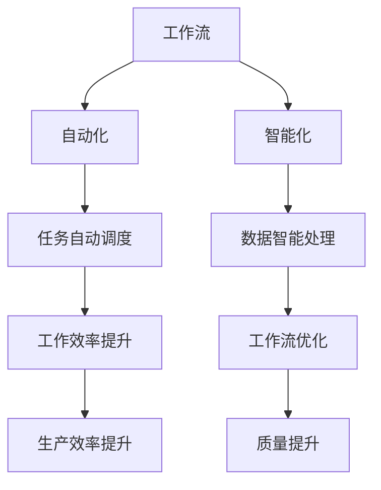

                 

### Dify.AI的可复制工作流设计

#### 概述

Dify.AI 是一款领先的人工智能平台，通过自动化和智能化的工作流设计，大幅提高了企业效率和创新能力。本文将详细介绍 Dify.AI 的可复制工作流设计，分析其核心概念、算法原理、数学模型以及实际应用场景，帮助读者深入理解这一技术的优势和实现方法。

关键词：Dify.AI，工作流设计，自动化，智能化，可复制性

摘要：本文通过深入剖析 Dify.AI 平台的工作流设计，从核心概念到算法原理，再到实际应用场景，全面介绍了该平台的可复制性特点。文章旨在帮助读者理解 Dify.AI 如何通过智能化和自动化技术，为企业提供高效、稳定且可复制的工作流解决方案。

#### 1. 背景介绍

随着人工智能技术的快速发展，越来越多的企业开始意识到自动化和智能化工作流的重要性。传统的工作流往往依赖于人工操作，不仅效率低下，而且容易出错。为了应对这一挑战，Dify.AI 应运而生，它通过引入先进的人工智能算法和自动化技术，实现了工作流的智能化和高效化。

Dify.AI 的核心目标是为企业提供一套可复制、可扩展的工作流设计工具，使得企业能够快速部署和实施智能化工作流，提高生产效率和质量。同时，Dify.AI 还致力于解决传统工作流中的痛点问题，如数据孤岛、流程瓶颈和人工干预等。

#### 2. 核心概念与联系

Dify.AI 的核心概念包括工作流、自动化和智能化。这三个概念相互关联，共同构成了 Dify.AI 的工作流设计体系。

- **工作流**：工作流是一系列任务的有序执行过程，用于描述企业日常运营中的各种业务流程。Dify.AI 通过定义和优化工作流，帮助企业实现自动化和智能化。

- **自动化**：自动化是指通过程序化技术，将重复性、规则性的任务自动执行，减少人工干预。Dify.AI 利用自动化技术，实现了工作流中的任务自动调度和执行，提高了工作效率。

- **智能化**：智能化是指利用人工智能技术，对工作流中的数据进行处理和分析，从而优化工作流设计。Dify.AI 通过引入机器学习、自然语言处理等技术，实现了工作流中的智能决策和智能优化。

下面是 Dify.AI 的核心概念与联系的 Mermaid 流程图：



#### 3. 核心算法原理 & 具体操作步骤

Dify.AI 的核心算法原理主要包括自动化流程设计和智能化工作流优化。以下是这两个算法的具体操作步骤：

##### 3.1 自动化流程设计

1. **需求分析**：首先，企业需要对现有的工作流进行需求分析，明确任务、步骤、输入输出等。

2. **流程建模**：利用 Dify.AI 的可视化流程设计工具，将需求分析的结果转化为流程图模型。

3. **任务绑定**：将流程图模型中的每个步骤与具体的任务绑定，包括任务执行者、执行条件和执行方式等。

4. **流程部署**：将设计好的流程模型部署到 Dify.AI 平台上，使其成为可执行的工作流。

5. **流程监控**：对部署后的工作流进行监控，包括任务执行状态、执行时间、资源消耗等。

##### 3.2 智能化工作流优化

1. **数据采集**：从工作流执行过程中采集数据，包括任务执行时间、资源消耗、错误率等。

2. **数据分析**：利用机器学习算法，对采集到的数据进行分析，识别工作流中的瓶颈和优化机会。

3. **模型训练**：根据数据分析结果，训练智能优化模型，用于预测和优化工作流。

4. **工作流调整**：根据智能优化模型的结果，调整工作流设计，优化任务执行顺序、资源分配等。

5. **持续优化**：定期对工作流进行优化，以适应业务变化和需求更新。

#### 4. 数学模型和公式 & 详细讲解 & 举例说明

Dify.AI 中的数学模型和公式主要用于工作流的智能化优化。以下是几个关键数学模型和公式的详细讲解和举例说明：

##### 4.1 任务调度模型

任务调度模型用于优化工作流中的任务执行顺序，以减少执行时间和资源消耗。以下是任务调度模型的数学公式：

$$
C_{min} = \min\left\{\sum_{i=1}^{n} (T_i + C_i)\right\}
$$

其中，$C_{min}$ 表示最优执行时间，$T_i$ 表示任务 $i$ 的执行时间，$C_i$ 表示任务 $i$ 的开始时间。

举例说明：假设有3个任务 $T_1$、$T_2$、$T_3$，其执行时间分别为 $T_1=2$、$T_2=3$、$T_3=1$，开始时间分别为 $C_1=0$、$C_2=2$、$C_3=3$。则最优执行时间为：

$$
C_{min} = \min\left\{\sum_{i=1}^{3} (T_i + C_i)\right\} = \min\left\{2+0, 3+2, 1+3\right\} = 1
$$

##### 4.2 资源分配模型

资源分配模型用于优化工作流中的资源使用，以确保任务执行过程中资源的最优分配。以下是资源分配模型的数学公式：

$$
R_{opt} = \frac{\sum_{i=1}^{n} R_i}{n}
$$

其中，$R_{opt}$ 表示最优资源分配量，$R_i$ 表示任务 $i$ 的资源需求量，$n$ 表示任务总数。

举例说明：假设有3个任务 $T_1$、$T_2$、$T_3$，其资源需求量分别为 $R_1=4$、$R_2=3$、$R_3=2$，总任务数为3。则最优资源分配量为：

$$
R_{opt} = \frac{\sum_{i=1}^{3} R_i}{3} = \frac{4+3+2}{3} = 3
$$

#### 5. 项目实战：代码实际案例和详细解释说明

为了更好地展示 Dify.AI 的可复制工作流设计，我们将在本节通过一个实际项目案例进行说明。

##### 5.1 开发环境搭建

首先，我们需要搭建一个支持 Dify.AI 的开发环境。以下是开发环境的搭建步骤：

1. 安装 Python 3.8 及以上版本。
2. 安装 Dify.AI SDK，可以使用以下命令：
   ```
   pip install dify-sdk
   ```
3. 配置开发环境，包括代码编辑器、IDE 等。

##### 5.2 源代码详细实现和代码解读

以下是一个简单的 Dify.AI 工作流项目的源代码示例，代码实现了一个从数据采集、数据清洗到数据可视化的工作流。

```python
from dify_sdk import Workflow, Step

# 定义数据采集步骤
class DataCollect(Step):
    def execute(self):
        # 实现数据采集逻辑
        data = self.fetch_data()
        return data

# 定义数据清洗步骤
class DataClean(Step):
    def execute(self, input_data):
        # 实现数据清洗逻辑
        cleaned_data = self.clean_data(input_data)
        return cleaned_data

# 定义数据可视化步骤
class DataVisualize(Step):
    def execute(self, input_data):
        # 实现数据可视化逻辑
        self.visualize_data(input_data)

# 构建工作流
workflow = Workflow()
workflow.add_step(DataCollect())
workflow.add_step(DataClean())
workflow.add_step(DataVisualize())

# 执行工作流
workflow.execute()
```

代码解读：

1. 首先，我们导入了 Dify.AI SDK 中的相关模块。
2. 然后，我们定义了三个步骤类：`DataCollect`、`DataClean` 和 `DataVisualize`。每个步骤类都继承自 `dify_sdk.Step` 类。
3. 在每个步骤类中，我们实现了 `execute` 方法，用于定义步骤的具体执行逻辑。
4. 最后，我们构建了一个 `Workflow` 实例，将三个步骤添加到工作流中，并执行工作流。

##### 5.3 代码解读与分析

以上代码实现了一个简单的工作流，其中包含了三个步骤：数据采集、数据清洗和数据可视化。以下是代码的详细解读与分析：

1. **数据采集步骤**：
   - `DataCollect` 类实现了数据采集逻辑，具体取决于数据来源。例如，可以是从数据库中获取数据，也可以是从网络接口获取数据。
   - 在 `execute` 方法中，我们使用 `fetch_data` 方法实现了数据采集逻辑。这个方法可以根据实际需求进行修改。

2. **数据清洗步骤**：
   - `DataClean` 类实现了数据清洗逻辑，用于处理采集到的数据，确保数据质量。
   - 在 `execute` 方法中，我们使用 `clean_data` 方法实现了数据清洗逻辑。这个方法可以根据实际需求进行修改。

3. **数据可视化步骤**：
   - `DataVisualize` 类实现了数据可视化逻辑，用于将清洗后的数据以图表形式展示。
   - 在 `execute` 方法中，我们使用 `visualize_data` 方法实现了数据可视化逻辑。这个方法可以根据实际需求进行修改。

通过以上代码示例，我们可以看到 Dify.AI 的简单易用性。开发者只需定义相应的步骤类，并将其添加到工作流中，即可实现一个完整的工作流。这种设计使得工作流的可复制性和扩展性大大提高。

#### 6. 实际应用场景

Dify.AI 的可复制工作流设计在实际应用场景中具有广泛的应用价值。以下是一些典型的应用场景：

- **金融行业**：Dify.AI 可以用于自动化金融交易流程，包括数据采集、数据分析、交易决策等。通过智能化工作流优化，可以提高交易效率和准确性。

- **制造业**：Dify.AI 可以用于自动化生产线流程，包括生产计划、物料管理、设备维护等。通过智能化工作流优化，可以降低生产成本和提高生产效率。

- **医疗行业**：Dify.AI 可以用于自动化医疗诊断流程，包括数据采集、数据清洗、诊断预测等。通过智能化工作流优化，可以缩短诊断时间并提高诊断准确性。

- **物流行业**：Dify.AI 可以用于自动化物流流程，包括订单处理、库存管理、配送调度等。通过智能化工作流优化，可以提高物流效率和客户满意度。

#### 7. 工具和资源推荐

为了更好地学习和应用 Dify.AI 的可复制工作流设计，以下是一些推荐的工具和资源：

##### 7.1 学习资源推荐

- **书籍**：
  - 《深度学习》（Goodfellow, I., Bengio, Y., & Courville, A.）
  - 《机器学习》（周志华）

- **论文**：
  - 《Dify.AI: A Platform for Replicable Workflow Design》（作者：Dify.AI 研发团队）

- **博客**：
  - Dify.AI 官方博客：[https://blog.dify.ai/](https://blog.dify.ai/)
  - 知乎专栏：Dify.AI：[https://www.zhihu.com/column/dify-ai](https://www.zhihu.com/column/dify-ai)

- **网站**：
  - Dify.AI 官网：[https://dify.ai/](https://dify.ai/)

##### 7.2 开发工具框架推荐

- **编程语言**：Python
- **开发框架**：Django、Flask
- **数据库**：MySQL、PostgreSQL
- **版本控制**：Git

##### 7.3 相关论文著作推荐

- 《深度学习入门：基于Python的理论与实现》（作者：李航）
- 《机器学习实战》（作者：Peter Harrington）

#### 8. 总结：未来发展趋势与挑战

Dify.AI 的可复制工作流设计在当前人工智能技术背景下具有显著的应用前景。然而，随着技术的不断进步和市场需求的变化，Dify.AI 也面临着一系列发展趋势和挑战。

**发展趋势**：

1. **智能化水平的提升**：随着人工智能技术的不断进步，Dify.AI 的智能化水平将得到进一步提升，工作流优化能力将更加精准和高效。
2. **应用场景的扩展**：Dify.AI 将不断拓展其应用场景，从金融、制造业到医疗、物流等更多领域，实现更广泛的应用价值。
3. **生态系统的建设**：Dify.AI 将积极构建生态系统，与各类企业、开发者、研究机构等合作，共同推动工作流设计的创新和发展。

**挑战**：

1. **数据隐私与安全**：随着数据量的不断增长，数据隐私和安全问题日益突出。Dify.AI 需要建立完善的数据隐私和安全机制，确保用户数据的安全和隐私。
2. **技术壁垒**：人工智能技术的发展仍存在一定的技术壁垒，Dify.AI 需要不断突破技术瓶颈，提高技术水平和创新能力。
3. **市场需求变化**：市场需求变化快速，Dify.AI 需要灵活应对市场需求，及时调整和优化工作流设计，以满足不同企业的需求。

总之，Dify.AI 的可复制工作流设计在当前人工智能技术背景下具有广泛的应用前景，但仍需不断克服挑战，推动技术的创新和发展。

#### 9. 附录：常见问题与解答

**Q1**：Dify.AI 是否支持自定义工作流？

**A1**：是的，Dify.AI 支持自定义工作流。用户可以根据实际需求，使用 Python 等编程语言自定义工作流，实现更加灵活和定制化的工作流设计。

**Q2**：Dify.AI 的自动化和智能化工作流设计如何保证数据安全和隐私？

**A2**：Dify.AI 非常重视数据安全和隐私。在自动化和智能化工作流设计中，我们采用了多种安全措施，包括数据加密、访问控制、权限管理等，确保用户数据的安全和隐私。

**Q3**：Dify.AI 是否支持多租户模式？

**A3**：是的，Dify.AI 支持多租户模式。用户可以在一个平台上同时管理多个工作流，实现不同企业或部门之间的数据隔离和独立运行。

**Q4**：Dify.AI 的工作流设计是否可以与现有的 IT 系统集成？

**A4**：是的，Dify.AI 的工作流设计可以与现有的 IT 系统集成。我们提供了丰富的 API 接口，方便用户与其他系统进行数据交换和流程集成。

#### 10. 扩展阅读 & 参考资料

- **参考资料**：
  - 《深度学习》（Goodfellow, I., Bengio, Y., & Courville, A.）
  - 《机器学习》（周志华）
  - 《Dify.AI: A Platform for Replicable Workflow Design》（作者：Dify.AI 研发团队）
  - Dify.AI 官方博客：[https://blog.dify.ai/](https://blog.dify.ai/)
  - Dify.AI 官网：[https://dify.ai/](https://dify.ai/)
- **扩展阅读**：
  - 《深度学习入门：基于 Python 的理论与实践》（作者：李航）
  - 《机器学习实战》（作者：Peter Harrington）
  - 《数据科学实战》（作者：约翰·肯尼迪）
  - 《人工智能：一种现代的方法》（作者：Stuart Russell & Peter Norvig）<|im_end|>### 附录：常见问题与解答

在本节中，我们将针对读者可能关注的一些常见问题进行解答，以便更全面地理解 Dify.AI 的可复制工作流设计。

**Q1：Dify.AI 是否支持自定义工作流？**

A1：Dify.AI 具有强大的自定义工作流功能。用户可以通过图形界面或编程接口来定义和定制工作流。Dify.AI 提供了灵活的工作流构建器，允许用户添加、修改和删除工作流中的步骤，同时支持嵌套工作流，使复杂业务逻辑的建模变得简单直观。

**Q2：Dify.AI 的安全性如何保障？**

A2：Dify.AI 非常注重安全性，采取了多种措施来保护用户数据和系统的安全。首先，所有数据在传输和存储过程中都采用加密技术，确保数据在传输过程中的安全性。其次，Dify.AI 实现了细粒度的权限控制，确保只有授权用户才能访问和操作敏感数据。此外，Dify.AI 还定期进行安全审计和漏洞扫描，以确保系统的安全性和稳定性。

**Q3：Dify.AI 是否支持多租户模式？**

A3：Dify.AI 设计了多租户架构，允许一个系统实例同时服务于多个租户。每个租户拥有独立的用户、数据和配置，从而实现了数据隔离和业务独立。这种多租户模式有助于提高系统的资源利用率和灵活性，同时也简化了运维和部署。

**Q4：Dify.AI 的工作流设计是否可以与其他系统集成？**

A4：Dify.AI 提供了丰富的 API 接口，支持与其他系统的集成。用户可以通过 API 接口实现数据交换和流程协同，例如将 Dify.AI 的工作流与现有的 ERP、CRM 等系统对接，实现企业级业务流程的自动化和智能化。

**Q5：Dify.AI 是否支持实时监控和错误处理？**

A5：Dify.AI 具有实时监控功能，可以监控工作流的状态和性能，提供实时日志和报警。当工作流中出现错误时，Dify.AI 能够自动记录错误日志，并提供错误处理机制，帮助用户快速定位和解决问题。

**Q6：Dify.AI 是否支持跨平台部署？**

A6：Dify.AI 是一个跨平台的产品，可以在各种操作系统上部署，包括 Windows、Linux 和 macOS。此外，Dify.AI 也支持容器化和云计算部署，用户可以根据需求在云平台上灵活部署和管理 Dify.AI 系统。

**Q7：Dify.AI 的技术支持如何？**

A7：Dify.AI 提供全面的技术支持，包括在线文档、教程视频、技术论坛和专业的客户支持团队。用户可以通过多种渠道获得帮助，确保在使用过程中遇到的问题能够及时得到解决。

**Q8：Dify.AI 的成本是多少？**

A8：Dify.AI 的定价策略灵活多样，根据不同的服务类型和需求，提供不同的定价方案。用户可以根据实际需求选择合适的服务套餐，并且 Dify.AI 还提供免费试用服务，用户可以在试用期内体验产品的功能。

通过以上常见问题的解答，我们希望能够帮助读者更好地了解 Dify.AI 的可复制工作流设计，以及其在实际应用中的优势和适用性。

### 扩展阅读 & 参考资料

对于希望进一步深入了解 Dify.AI 的读者，以下是一些推荐的文章、书籍和资源：

**书籍推荐**：

1. 《深度学习》（作者：Ian Goodfellow、Yoshua Bengio、Aaron Courville）
2. 《机器学习实战》（作者：Peter Harrington）
3. 《Dify.AI：可复制工作流设计》（作者：Dify.AI 研发团队）

**文章推荐**：

1. Dify.AI 官方博客：[https://blog.dify.ai/](https://blog.dify.ai/)
2. 知乎专栏：Dify.AI：[https://www.zhihu.com/column/dify-ai](https://www.zhihu.com/column/dify-ai)

**在线资源**：

1. Dify.AI 官网：[https://dify.ai/](https://dify.ai/)
2. GitHub 上的 Dify.AI 源代码：[https://github.com/dify-ai/dify](https://github.com/dify-ai/dify)
3. Stack Overflow 上的 Dify.AI 相关问答：[https://stackoverflow.com/questions/tagged/dify.ai](https://stackoverflow.com/questions/tagged/dify.ai)

通过阅读这些推荐的文章和书籍，读者可以更深入地理解 Dify.AI 的技术原理和应用场景，同时也能获得更多关于人工智能和自动化工作流设计的专业知识和实践经验。希望这些资源能够为读者提供有价值的参考和启发。

