                 

### 背景介绍

Druid是一个高性能的实时数据流处理框架，旨在满足大数据领域的实时分析需求。随着互联网和大数据技术的发展，实时数据分析和处理的需求越来越强烈，传统的批处理系统已经无法满足实时性的要求。Druid的出现正是为了填补这一空白，它通过高效的实时数据处理能力和强大的数据查询性能，成为大数据领域中不可或缺的一部分。

Druid最初由Mortar Data公司开发，该公司后来被阿里巴巴收购，Druid也成为了阿里巴巴内部广泛使用的一个大数据处理框架。由于其在性能、可扩展性和易用性上的优势，Druid受到了业界的广泛关注和认可，并在多个大型企业中得到应用。

在现实应用场景中，Druid被广泛应用于实时广告点击率分析、实时监控和预警系统、金融风控、电商推荐系统等多个领域。它能够实时处理和分析大规模的数据流，提供低延迟的查询服务，这使得企业在面对海量实时数据时能够迅速做出决策。

本文旨在深入探讨Druid的原理和实现，通过逐步分析其核心概念、算法原理、数学模型以及实际应用案例，帮助读者全面理解Druid的工作机制，并掌握其核心实现技术。

#### Druid的发展历程和重要里程碑

Druid的发展历程可以追溯到2012年，当时Mortar Data公司成立，并开始开发Druid。Druid 0.1版本于2013年发布，标志着Druid项目的正式开始。随着时间的推移，Druid不断迭代和优化，其版本号也逐渐增加。以下是Druid发展历程中的重要里程碑：

- 2013年：Druid 0.1版本发布，提供了基本的数据流处理和查询功能。
- 2014年：Druid 0.5版本发布，增加了实时数据导入、滚动窗口计算和异步任务等功能。
- 2015年：Druid 0.8版本发布，引入了分层存储架构和分布式处理机制，提高了系统的性能和可扩展性。
- 2016年：Druid 0.9版本发布，增加了分布式查询和机器学习功能。
- 2017年：Mortar Data公司被阿里巴巴收购，Druid成为阿里巴巴内部的大数据处理框架。
- 2018年：Druid 0.10版本发布，进一步优化了性能和可扩展性，并支持了多种数据源和中间件。
- 2019年：Druid 0.11版本发布，引入了实时数据流处理引擎，增强了实时数据分析和处理能力。

通过这些里程碑，Druid逐渐成为大数据处理领域中的佼佼者，其稳定性和性能得到了业界的广泛认可。在阿里巴巴等大型企业中，Druid已经成为实时数据处理和查询的核心技术之一。

#### Druid的适用场景

Druid的设计目标是满足大规模实时数据分析和处理的需求，因此它在多个领域有着广泛的应用场景。以下是一些典型的应用场景：

1. **实时广告点击率分析**：在广告投放中，实时了解广告的点击率对于优化广告策略至关重要。Druid可以实时处理海量广告点击数据，快速生成点击率报告，帮助企业及时调整广告投放策略。

2. **实时监控和预警系统**：企业需要实时监控各种业务指标，如服务器性能、网络流量、交易成功率等。Druid可以实时处理这些监控数据，当检测到异常时及时发出预警，帮助企业快速响应和处理潜在问题。

3. **金融风控**：在金融领域，实时分析交易数据对于防范欺诈、风险控制和合规性检查至关重要。Druid可以实时处理金融交易数据，快速识别异常交易，提供实时风险预警。

4. **电商推荐系统**：电商企业通过实时分析用户行为数据，可以提供个性化的推荐服务，提高用户满意度和转化率。Druid可以实时处理用户行为数据，生成推荐结果，支持实时推荐系统。

5. **物联网数据分析**：物联网设备产生的数据量庞大且实时性要求高。Druid可以实时处理物联网数据，提供实时监控和分析服务，帮助企业更好地理解和利用物联网数据。

总的来说，Druid通过其高效的实时数据处理能力和灵活的可扩展性，适用于各种需要实时分析和处理大规模数据的场景。这些特点使得Druid在众多大数据应用领域中发挥着关键作用。

### 核心概念与联系

在深入探讨Druid的工作原理之前，我们需要先了解一些核心概念，这些概念是理解Druid工作机制的基础。以下是一些关键术语及其相互关系：

#### Druid的数据模型

Druid的数据模型包括以下几个核心组件：

1. **时间序列（Time Series）**：这是Druid中最基本的组织数据的方式。时间序列数据通常包含时间戳、度量值以及其他维度信息。时间序列数据按照时间戳进行排序，便于实时查询和聚合分析。

2. **指标（Metrics）**：指标是时间序列数据中的度量值，如广告点击率、交易额、用户活跃度等。指标可以是一个数值，也可以是一个字符串或其他类型的值。

3. **维度（Dimensions）**：维度是对数据进行分类和细分的属性，如广告ID、用户ID、地理位置等。维度可以帮助用户对数据进行多维度的分析，以获得更深入的业务洞察。

4. **事件（Events）**：事件是对数据中特定时间点的记录，如用户登录、页面浏览、交易完成等。事件数据通常包含时间戳和其他相关属性。

#### Druid的架构

Druid的架构包括以下几个主要组件：

1. **数据采集（Data Ingestion）**：数据采集是将数据从数据源（如日志文件、数据库、流处理系统等）导入到Druid的过程。Druid提供了多种数据采集方式，包括实时采集、批处理采集和离线采集。

2. **数据处理（Data Processing）**：数据处理是对导入的数据进行转换、清洗和聚合的过程。Druid通过一系列数据处理任务，将原始数据转换成可查询的时间序列数据。

3. **数据存储（Data Storage）**：数据存储是将处理后的时间序列数据持久化存储的过程。Druid采用分层存储架构，根据数据的重要性和访问频率将数据存储在不同的层级。

4. **查询处理（Query Processing）**：查询处理是Druid的核心功能之一，它提供了高效的实时数据查询能力。Druid支持多种查询类型，如聚合查询、分组查询、过滤查询等。

#### Mermaid流程图

为了更直观地理解Druid的工作流程，我们使用Mermaid绘制一个简单的流程图。以下是Druid核心概念和流程的Mermaid表示：

```mermaid
graph TB
    subgraph DataFlow
        A[Data Source] --> B[Data Ingestion]
        B --> C[Data Processing]
        C --> D[Data Storage]
    end

    subgraph QueryFlow
        E[Query Request] --> F[Query Processing]
        F --> G[Data Storage]
    end

    subgraph Architecture
        H[Data Ingestion] --> I[Broker]
        I --> J[Server]
        J --> K[Hadoop]
        H --> L[Overlord]
        L --> I
    end

    subgraph DataModel
        M[Time Series] --> N[Metrics]
        N --> O[Dimensions]
        M --> P[Events]
    end

    subgraph DataFlow
        A --> B
        B --> C
        C --> D
    end

    subgraph QueryFlow
        E --> F
        F --> G
    end

    subgraph Architecture
        H --> I
        I --> J
        J --> K
        L --> I
    end

    subgraph DataModel
        M --> N
        N --> O
        M --> P
    end
```



这个Mermaid流程图展示了Druid的数据流和架构，包括数据采集、数据处理、数据存储、查询处理等关键组件，以及它们之间的相互关系。

通过了解这些核心概念和流程，我们可以更好地理解Druid的工作机制，并在接下来的章节中深入探讨其算法原理和实现细节。

#### 核心算法原理 & 具体操作步骤

Druid的核心算法主要包括数据的导入、处理、存储和查询四个环节。以下是这些环节的详细操作步骤及其核心算法原理：

##### 1. 数据导入（Data Ingestion）

数据导入是Druid处理数据的第一步，它涉及将数据从不同的数据源（如日志文件、数据库、流处理系统等）收集到Druid系统。数据导入的过程可以分为以下几个步骤：

1. **数据采集任务（Ingestion Tasks）**：首先，需要定义一个数据采集任务，该任务指定了数据的来源、格式和转换规则。Druid支持多种数据源和格式，如Apache Kafka、Logstash、JDBC等。

2. **数据源连接（Data Source Connection）**：配置数据源连接，指定数据源的具体信息，如Kafka集群地址、数据库URL等。

3. **数据格式解析（Data Format Parsing）**：解析数据源提供的数据，将其转换为Druid支持的格式。通常，数据会经过清洗和转换，如去除空值、转换数据类型等。

4. **数据写入（Data Writing）**：将处理后的数据写入到Druid的临时存储区，等待后续处理。

核心算法原理：数据导入过程中使用了批量处理技术，以减少IO操作的次数，提高数据导入效率。同时，数据解析和转换过程中使用了高效的算法和数据结构，如正则表达式、哈希表等，确保数据处理的高效性。

##### 2. 数据处理（Data Processing）

数据处理是对导入的数据进行转换、清洗和聚合的过程，以确保数据的质量和一致性。数据处理可以分为以下几个步骤：

1. **数据转换（Data Transformation）**：根据业务需求，对数据进行各种转换操作，如时间戳转换、字段映射、值填充等。

2. **数据清洗（Data Cleaning）**：去除数据中的错误、异常值和重复记录，保证数据的准确性和一致性。

3. **数据聚合（Data Aggregation）**：对数据进行分组和聚合操作，如求和、平均值、最大值等。聚合操作有助于提高查询效率。

4. **数据缓存（Data Caching）**：将处理后的数据缓存到内存中，以加快查询速度。

核心算法原理：数据处理过程中使用了多种高效算法和数据结构，如MapReduce、分布式哈希表、内存缓存等。这些算法和数据结构确保了数据处理的高性能和低延迟。

##### 3. 数据存储（Data Storage）

数据存储是将处理后的数据持久化存储到Druid的存储层，以便后续查询。数据存储可以分为以下几个步骤：

1. **数据分层存储（Layered Storage）**：Druid采用分层存储架构，根据数据的重要性和访问频率将数据存储在不同的层级，如基础层、热点层和冷点层。

2. **数据压缩（Data Compression）**：对数据进行压缩，减少存储空间占用，提高I/O性能。

3. **数据索引（Data Indexing）**：建立数据索引，以便快速查询。索引数据包括时间戳、度量值、维度等。

核心算法原理：数据存储过程中使用了多种压缩算法和数据结构，如LZ4、Zstd、B+树等。这些算法和数据结构确保了数据存储的高效性和可扩展性。

##### 4. 数据查询（Query Processing）

数据查询是Druid的核心功能之一，它提供了高效的实时数据查询能力。数据查询可以分为以下几个步骤：

1. **查询解析（Query Parsing）**：解析查询语句，确定查询的类型、范围和条件。

2. **查询优化（Query Optimization）**：根据查询类型和条件，优化查询执行计划，如索引选择、聚合方式等。

3. **查询执行（Query Execution）**：执行查询，包括数据检索、计算、聚合等。

4. **查询结果返回（Query Result Return）**：返回查询结果，以JSON格式或其他格式呈现。

核心算法原理：数据查询过程中使用了多种优化算法和数据结构，如缓存、并行处理、索引查找等。这些算法和数据结构确保了查询的高性能和低延迟。

通过以上步骤，Druid实现了高效的数据导入、处理、存储和查询。其核心算法原理主要包括批量处理、高效数据结构、压缩算法和查询优化等，这些原理使得Druid在实时数据处理和查询领域具有显著优势。

#### 数学模型和公式 & 详细讲解 & 举例说明

在深入探讨Druid的核心算法原理时，理解其背后的数学模型和公式是非常重要的。以下将详细讲解Druid中涉及的一些关键数学模型和公式，并通过具体例子来说明它们的实际应用。

##### 1. 时间序列模型（Time Series Model）

时间序列模型是Druid的核心，用于表示和预测时间序列数据。时间序列数据通常具有以下特性：

- **时间戳（Timestamp）**：表示数据的采集时间。
- **度量值（Metrics）**：表示数据的实际值，如点击次数、交易金额等。
- **维度（Dimensions）**：表示数据的分类属性，如用户ID、广告ID等。

时间序列数据可以用以下数学模型表示：

\[ T = \{ (t_i, m_i, d_1, d_2, \dots, d_n) \}_{i=1}^N \]

其中，\( T \) 表示时间序列集合，\( t_i \) 表示第 \( i \) 个时间点的数据，\( m_i \) 表示度量值，\( d_1, d_2, \dots, d_n \) 表示维度。

**举例说明**：

假设我们有一个广告点击率的时间序列数据，如下表所示：

| 时间戳     | 点击次数 | 广告ID |
|------------|----------|--------|
| 2021-01-01 | 100      | A1     |
| 2021-01-02 | 120      | A1     |
| 2021-01-03 | 90       | A1     |
| 2021-01-04 | 150      | A1     |
| 2021-01-05 | 130      | A1     |

我们可以用以下数学模型表示：

\[ T = \{ (2021-01-01, 100, A1), (2021-01-02, 120, A1), (2021-01-03, 90, A1), (2021-01-04, 150, A1), (2021-01-05, 130, A1) \} \]

##### 2. 聚合模型（Aggregation Model）

聚合模型用于对时间序列数据进行计算和汇总，以获得更高层次的数据。Druid支持多种聚合函数，如求和（SUM）、平均值（AVERAGE）、最大值（MAX）、最小值（MIN）等。

假设我们有一个广告点击率的时间序列数据，要求计算过去一周的平均点击次数，可以使用以下聚合模型：

\[ \text{Average Clicks} = \frac{\sum_{i=1}^N m_i}{N} \]

其中，\( N \) 表示时间序列数据的长度，\( m_i \) 表示第 \( i \) 个时间点的点击次数。

**举例说明**：

对于上述广告点击率数据，过去一周的平均点击次数为：

\[ \text{Average Clicks} = \frac{100 + 120 + 90 + 150 + 130}{5} = 120 \]

##### 3. 压缩模型（Compression Model）

Druid采用多种压缩算法来减少存储空间和提高查询效率。常见的压缩算法包括LZ4、Zstd、Snappy等。压缩模型的基本思想是将原始数据进行编码，以减少存储和传输的负载。

假设我们有一个长度为1000的数据序列，可以使用LZ4压缩算法进行压缩。LZ4压缩算法的基本步骤如下：

1. **分块（Chunking）**：将原始数据序列划分为多个固定大小的块。
2. **编码（Encoding）**：对每个块使用LZ4算法进行编码。
3. **存储（Storing）**：将编码后的块存储在磁盘或内存中。

**举例说明**：

假设原始数据序列为：

\[ [1, 2, 3, 4, 5, 5, 5, 4, 3, 2, 1] \]

将数据划分为块：

\[ \text{Block 1: } [1, 2, 3] \]
\[ \text{Block 2: } [4, 5, 5] \]
\[ \text{Block 3: } [5, 4, 3] \]
\[ \text{Block 4: } [2, 1] \]

使用LZ4算法编码后，块变为：

\[ \text{Block 1: } [1, 2, 3] \rightarrow [3, 1, 1] \]
\[ \text{Block 2: } [4, 5, 5] \rightarrow [5, 1, 1] \]
\[ \text{Block 3: } [5, 4, 3] \rightarrow [4, 1, 1] \]
\[ \text{Block 4: } [2, 1] \rightarrow [1, 1] \]

压缩后的数据序列为：

\[ [3, 1, 1, 5, 1, 1, 4, 1, 1, 2, 1] \]

通过压缩，原始数据序列的长度从11减少到10，存储空间减少了10%。

##### 4. 索引模型（Index Model）

索引模型用于加快数据的查询速度。Druid使用B+树索引来组织数据，B+树索引的基本思想是将数据按顺序存储在树节点中，每个节点包含一个或多个键值对。

假设我们有一个长度为1000的数据序列，使用B+树索引进行索引。B+树索引的基本步骤如下：

1. **构建索引树**：将数据序列构建成B+树，每个节点包含多个键值对。
2. **查找**：根据查询条件在B+树中查找对应的数据。

**举例说明**：

假设原始数据序列为：

\[ [1, 2, 3, 4, 5, 5, 5, 4, 3, 2, 1] \]

构建B+树索引：

```plaintext
根节点：[1, 2, 3, 4, 5]
子节点1：[1, 2]
子节点2：[3, 4]
子节点3：[5]
子节点4：[5]
子节点5：[5]
子节点6：[4, 3, 2, 1]
```

查询数据序列中的值“3”：

1. 在根节点中找到“3”对应的子节点2。
2. 在子节点2中找到“3”对应的数据。

通过B+树索引，查询数据序列中的值“3”的时间复杂度为 \( O(\log N) \)，相比于线性搜索的 \( O(N) \)，显著提高了查询效率。

综上所述，Druid的核心算法原理和数学模型主要包括时间序列模型、聚合模型、压缩模型和索引模型。这些模型和公式共同作用，使得Druid在实时数据处理和查询领域具有显著优势。

#### 项目实战：代码实际案例和详细解释说明

在了解了Druid的核心算法原理和数学模型后，下面我们将通过一个实际项目案例来展示如何使用Druid进行实时数据分析和处理。本案例将包括以下步骤：

1. **开发环境搭建**：介绍搭建Druid开发环境的步骤和工具。
2. **源代码详细实现**：展示Druid的源代码，并对其关键部分进行详细解释。
3. **代码解读与分析**：对源代码进行解读，分析其工作原理和优化策略。

##### 1. 开发环境搭建

搭建Druid开发环境主要包括以下几个步骤：

1. **安装Java环境**：由于Druid是基于Java开发的，首先需要安装Java环境。在官网上下载并安装Java Development Kit（JDK），并配置环境变量。

2. **下载Druid源码**：从Druid的GitHub仓库下载源码，或在Maven仓库中引入Druid依赖。使用Git命令：

   ```bash
   git clone https://github.com/apache/druid.git
   ```

   或在Maven项目中添加依赖：

   ```xml
   <dependency>
       <groupId>org.apache.druid</groupId>
       <artifactId>druid-broker</artifactId>
       <version>0.14.1</version>
   </dependency>
   ```

3. **安装Hadoop和Zookeeper**：Druid依赖于Hadoop和Zookeeper进行分布式处理和协调。从官方网站下载并安装Hadoop和Zookeeper，并配置相关环境变量。

4. **启动Druid服务**：在命令行中启动Druid的各个服务，包括Broker、Server、Overlord等。

   ```bash
   bin/run-druid.sh
   ```

   在启动过程中，Druid会自动配置并启动相关服务。

##### 2. 源代码详细实现

以下是一个简单的Druid数据导入和处理示例，展示了Druid的基本使用方法：

```java
import org.apache.druid.java.util.common.Granularity;
import org.apache.druid.data.input.*;
import org.apache.druid.data.input.impl.*;
import org.apache.druid.query.*;
import org.apache.druid.query.aggregation.*;
import org.apache.druid.query.datasource.DataSource;
import org.apache.druid.query.dsl.DruidSqlQuery;
import org.apache.druid.query.groupby.*;
import org.apache.druid.query.spec.*;
import org.apache.druid.query.utils.QueryRunnerTool;
import org.apache.druid.query.utils.RowColumn;

import java.util.*;

public class DruidExample {
    public static void main(String[] args) {
        // 创建数据源
        InputRowParser parser = new CSVInputRowParser(new InputFormat() {
            @Override
            public String[] parseLine(String line) {
                return line.split(",");
            }
        }, Arrays.asList("timestamp", "adId", "clicks"), false, 0);

        Map<String, Object> context = new HashMap<>();
        context.put("spec", new TableSpec("ads", Arrays.asList(
                new ColumnSpec("timestamp", ColumnType.LONG, "timestamp", true),
                new ColumnSpec("adId", ColumnType.STRING, "adId", true),
                new ColumnSpec("clicks", ColumnType.LONG, "clicks", true)
        )));

        // 数据导入
        InputRow row = new GenericInputRow(Granularity.DAY, 0L, context);
        row.put("timestamp", 1617420800000L);
        row.put("adId", "A1");
        row.put("clicks", 10L);
        DataSchema schema = new DataSchema.Builder()
                .withParser(parser)
                .withTimestampSpec(new TimestampSpec("timestamp", "auto"))
                .build();

        // 数据处理
        DataIngestionSpec ingestionSpec = new DataIngestionSpec("ads", schema, new SimplePluginConfig("file", Arrays.asList("data.csv")));

        // 数据查询
        QueryRunnerTool tool = new QueryRunnerTool();
        Queryrunner.runQuery(tool, ingestionSpec, Arrays.asList("adId", "clicks"), null);
    }
}
```

**代码解读**：

1. **数据源创建**：创建一个CSVInputRowParser，用于解析CSV格式的数据。该解析器将输入的CSV行数据按逗号分隔，并映射到指定的列。

2. **数据导入**：创建一个InputRow，将数据填充到InputRow中，并设置时间戳、广告ID和点击次数。然后，创建一个DataSchema，指定数据源名称和数据列。

3. **数据处理**：创建一个DataIngestionSpec，用于配置数据导入的参数，如数据源名称、数据schema和存储配置。

4. **数据查询**：使用QueryRunnerTool运行查询，查询结果包括广告ID和点击次数。

##### 3. 代码解读与分析

上述代码展示了Druid的基本使用方法，包括数据导入、数据处理和查询。以下是对关键部分的解读和分析：

1. **数据源创建**：
   - CSVInputRowParser：这是一个用于解析CSV格式数据的行解析器。通过实现InputFormat接口，自定义行解析逻辑。该解析器将CSV行数据按逗号分隔，并将每个分隔的值映射到指定的列。
   - Context：一个用于传递数据解析时所需参数的Map。在本例中，传递了一个TableSpec，指定了数据列的名称和数据类型。

2. **数据导入**：
   - InputRow：创建一个InputRow，将数据填充到InputRow中。在本例中，使用Long类型的时间戳、String类型的广告ID和Long类型的点击次数。
   - DataSchema：创建一个DataSchema，指定数据源名称和数据列。DataSchema包括列名称、数据类型、时间戳字段等。

3. **数据处理**：
   - DataIngestionSpec：创建一个DataIngestionSpec，用于配置数据导入的参数。在本例中，指定了数据源名称、数据schema和存储配置（如文件路径）。

4. **数据查询**：
   - QueryRunnerTool：这是一个用于运行查询的工具类。使用QueryRunnerTool运行查询，并指定查询的字段（如广告ID和点击次数）。
   - runQuery：运行查询方法，接收DataIngestionSpec作为参数，并返回查询结果。

**优化策略**：

1. **并行处理**：Druid支持并行处理，可以同时处理多个数据导入任务。通过配置并行度，可以加速数据导入和处理速度。

2. **数据压缩**：使用高效的数据压缩算法，如LZ4、Zstd等，可以减少存储空间占用，提高I/O性能。

3. **索引优化**：使用B+树索引等高效索引结构，可以加快查询速度。通过配置索引策略，可以优化索引的构建和查询。

4. **负载均衡**：在分布式环境中，通过配置负载均衡策略，可以均衡各个节点的负载，提高系统的整体性能。

通过本案例，我们展示了如何使用Druid进行实时数据分析和处理。在实际应用中，可以根据具体需求定制化Druid的使用，以提高性能和扩展性。

#### 实际应用场景

Druid作为一种高性能的实时数据流处理框架，在多个实际应用场景中展现出其强大的数据处理和分析能力。以下将介绍一些典型的应用场景，并通过具体案例展示Druid的实际应用效果。

##### 1. 实时广告点击率分析

广告点击率分析是广告营销中的一项关键指标，能够帮助企业优化广告投放策略，提高广告效果。以一家大型广告平台为例，该公司使用Druid进行实时广告点击率分析，实现了以下效果：

- **实时数据采集**：广告点击数据通过Kafka实时传输到Druid系统，实现了毫秒级的数据处理和分析。
- **多维数据分析**：Druid支持对广告点击数据进行多维度的分析，如按广告类型、用户地域、设备类型等进行分组分析。
- **实时报表生成**：Druid生成的实时报表帮助广告平台运营人员及时了解广告点击情况，快速调整广告策略。

通过Druid，该广告平台实现了广告点击数据的实时监控和分析，大幅提升了广告投放的精准度和效果。

##### 2. 实时监控和预警系统

实时监控和预警系统在企业运营中至关重要，能够及时发现和处理异常情况，保障系统的稳定运行。以一家大型电商平台为例，该公司使用Druid构建实时监控和预警系统，实现了以下功能：

- **实时数据采集**：通过Kafka等流处理系统，实时采集服务器性能、网络流量、交易成功率等监控数据。
- **数据聚合和计算**：Druid对实时监控数据进行聚合和计算，如计算交易成功率、服务器负载等。
- **实时预警**：当监控数据超过阈值时，Druid自动触发预警，发送短信或邮件通知相关运维人员。

通过Druid，该电商平台实现了全方位的实时监控和预警，提高了系统的稳定性和可靠性，降低了运营风险。

##### 3. 金融风控

金融领域对实时数据处理和分析有着极高的要求，以防范欺诈、风险控制和合规性检查。以一家大型金融企业为例，该公司使用Druid构建金融风控系统，实现了以下功能：

- **实时交易监控**：实时采集交易数据，对交易进行实时监控和异常检测。
- **多维数据分析**：Druid支持对交易数据进行多维度的分析，如按交易金额、交易时间、交易方式等进行分类分析。
- **实时风险预警**：当检测到可疑交易时，Druid自动触发风险预警，并采取相应的防范措施。

通过Druid，该金融企业实现了高效、实时的交易监控和风险预警，大幅提高了风险防范能力。

##### 4. 电商推荐系统

电商推荐系统是提高用户满意度和转化率的关键，能够为用户提供个性化的购物推荐。以一家大型电商平台为例，该公司使用Druid构建电商推荐系统，实现了以下效果：

- **实时用户行为采集**：通过Kafka等流处理系统，实时采集用户行为数据，如浏览记录、购买行为等。
- **实时数据分析**：Druid对用户行为数据进行实时分析和计算，生成推荐结果。
- **个性化推荐**：根据用户的行为数据和喜好，实时生成个性化推荐结果，提高用户满意度。

通过Druid，该电商平台实现了高效、实时的用户行为分析和推荐，提高了用户满意度和转化率。

##### 5. 物联网数据分析

物联网数据分析在智能家居、智能交通等领域有着广泛的应用，能够为企业提供实时、精准的数据分析服务。以一家智能家电企业为例，该公司使用Druid进行物联网数据分析，实现了以下功能：

- **实时数据采集**：通过物联网设备采集实时数据，如温度、湿度、能耗等。
- **实时数据处理**：Druid对物联网数据进行实时处理和分析，生成报表和可视化图表。
- **实时优化**：根据分析结果，实时调整设备运行参数，实现设备优化。

通过Druid，该智能家电企业实现了物联网数据的实时采集和分析，提高了设备运行效率和用户体验。

总之，Druid在多个实际应用场景中发挥了重要作用，通过其高效的数据处理和分析能力，为企业提供了强大的数据支撑，助力企业实现数字化转型和业务创新。

### 工具和资源推荐

为了更好地学习和使用Druid，以下是几个推荐的学习资源、开发工具和相关论文著作，这些资源将帮助读者深入了解Druid的原理和实现。

#### 学习资源推荐

1. **官方文档**：Apache Druid官方文档是学习Druid的最佳资源。它提供了详细的安装指南、配置说明、API文档以及各种使用示例。访问地址：[Apache Druid 官方文档](https://druid.apache.org/docs/0.14.1/)

2. **在线教程**：在多个在线平台上，如GitHub、Stack Overflow和CSDN等，有许多关于Druid的教程和实战案例。这些教程通常涵盖了Druid的基本概念、安装配置、数据导入和查询等，适合初学者快速上手。

3. **书籍**：《Druid实战》是一本关于Druid的入门书籍，详细介绍了Druid的架构、安装配置、数据导入、查询优化等。作者结合实际案例，深入浅出地讲解了Druid的使用方法，非常适合希望深入了解Druid的读者。

#### 开发工具推荐

1. **IntelliJ IDEA**：IntelliJ IDEA是一款强大的Java IDE，支持Druid的集成开发。它提供了代码提示、调试工具和性能分析工具，可以帮助开发者快速开发和优化Druid应用。

2. **Maven**：Maven是一款流行的Java项目构建和管理工具，用于管理和构建Druid项目。通过Maven，可以轻松管理项目依赖、编译和打包，提高开发效率。

3. **Docker**：Docker是一种轻量级容器化技术，可以帮助开发者快速搭建Druid开发环境。通过Docker镜像，可以快速启动Druid服务，并与其他组件进行集成。

#### 相关论文著作推荐

1. **《大数据技术导论》**：这本书详细介绍了大数据技术的基本概念、技术体系和应用场景。其中包括对Druid的介绍，分析了Druid在大数据实时处理和查询方面的优势。

2. **《分布式系统原理与范型》**：这本书探讨了分布式系统的基本原理和设计范式，包括数据复制、一致性算法、负载均衡等。对于希望深入了解Druid分布式架构的读者，这本书提供了有价值的参考。

3. **《Druid: Real-Time Query Engine for Large-scale Data》**：这是一篇关于Druid的原创论文，详细介绍了Druid的架构、算法和性能优化。论文分析了Druid在实际应用中的效果，并提出了改进方向。

通过以上资源，读者可以全面了解Druid的技术原理、应用场景和实践方法。无论是初学者还是高级开发者，这些资源都将帮助读者更好地掌握Druid，并将其应用于实际项目中。

### 总结：未来发展趋势与挑战

Druid作为一款高性能的实时数据流处理框架，在大数据领域发挥着重要作用。随着互联网和大数据技术的不断发展，Druid在未来有着广阔的发展前景和诸多挑战。

#### 未来发展趋势

1. **性能优化**：随着数据规模的持续增长，如何提高Druid的性能成为关键。未来，Druid可能会在查询优化、数据压缩、存储优化等方面进行更多创新，以提升系统的整体性能。

2. **扩展性增强**：为了应对大规模分布式系统的需求，Druid需要进一步提高扩展性。未来，Druid可能会引入更多的分布式计算框架，如Apache Flink和Apache Spark，以实现更高的数据处理能力和更灵活的架构设计。

3. **功能丰富**：随着应用场景的多样化，Druid需要不断丰富其功能。未来，Druid可能会引入更多高级数据分析和机器学习算法，如实时预测、聚类分析等，以满足更广泛的应用需求。

4. **社区生态建设**：随着Druid用户和贡献者的增加，社区生态建设将变得更加重要。未来，Druid可能会加强与开源社区的互动，吸引更多开发者参与，共同推动Druid的发展。

#### 面临的挑战

1. **数据安全与隐私**：随着数据隐私和安全问题的日益突出，Druid需要在数据处理过程中确保数据安全和隐私。未来，Druid可能需要引入更多安全机制，如数据加密、访问控制等。

2. **复杂应用场景**：不同行业和应用场景对实时数据处理提出了不同需求。未来，Druid需要更好地应对复杂的应用场景，如多源数据融合、实时流处理等。

3. **分布式一致性**：在分布式系统中，数据一致性和容错性是关键挑战。未来，Druid需要在分布式一致性、容错性和性能之间取得平衡，确保系统的稳定性和可靠性。

4. **开源生态整合**：随着开源技术的快速发展，如何整合其他开源框架和工具，构建一个完善的生态体系，成为Druid面临的重要挑战。

总之，Druid在未来有着广阔的发展前景，同时也面临着诸多挑战。通过不断优化性能、扩展功能和加强社区生态建设，Druid有望成为大数据领域的重要基础设施，为企业和开发者提供强大的实时数据处理和分析能力。

### 附录：常见问题与解答

在学习和使用Druid的过程中，读者可能会遇到一些常见问题。以下是一些常见问题及其解答，希望能为读者提供帮助。

#### 问题1：Druid如何处理大量数据？

Druid通过分布式架构和高性能算法处理大量数据。它使用分层存储和缓存技术，将数据存储在不同的层级，以优化查询性能。Druid还支持并行处理和负载均衡，确保在处理大量数据时能够高效利用系统资源。

#### 问题2：Druid如何进行数据压缩？

Druid支持多种数据压缩算法，如LZ4、Zstd等。数据在存储前会经过压缩处理，以减少存储空间占用和提高I/O性能。用户可以通过配置文件指定压缩算法和压缩比例。

#### 问题3：Druid如何保证数据一致性？

Druid通过分布式一致性协议和冗余存储确保数据一致性。在分布式环境中，Druid使用一致性哈希算法将数据分布到不同的节点，并使用分布式锁和事务管理机制确保数据的一致性和完整性。

#### 问题4：Druid如何进行查询优化？

Druid提供了多种查询优化策略，如索引选择、数据缓存、并行处理等。在查询过程中，Druid会根据查询类型和条件自动选择最优的查询执行计划，以提高查询性能。

#### 问题5：Druid支持哪些数据源？

Druid支持多种数据源，包括Kafka、Logstash、JDBC、HDFS等。用户可以通过自定义数据源插件扩展Druid支持的数据源类型。

#### 问题6：Druid如何进行数据导入？

Druid提供了多种数据导入方式，包括实时导入、批处理导入和离线导入。用户可以通过Druid的API或命令行工具进行数据导入，并配置相应的数据源、数据格式和转换规则。

#### 问题7：Druid如何进行数据聚合？

Druid支持多种数据聚合函数，如求和（SUM）、平均值（AVERAGE）、最大值（MAX）、最小值（MIN）等。用户可以通过指定聚合函数对数据进行聚合计算。

通过以上解答，读者可以更好地理解Druid的工作原理和适用场景，在实际应用中发挥Druid的最大潜力。

### 扩展阅读 & 参考资料

为了帮助读者更深入地了解Druid及相关技术，以下推荐了一些扩展阅读和参考资料，涵盖书籍、论文和在线资源：

#### 书籍

1. 《Druid实战》 - 详细介绍了Druid的安装、配置、数据导入和查询等，适合希望快速掌握Druid的读者。
2. 《大数据技术导论》 - 介绍了大数据技术的基本概念、技术体系和应用场景，其中包含了Druid的介绍。
3. 《分布式系统原理与范型》 - 探讨了分布式系统的基本原理和设计范式，包括数据复制、一致性算法、负载均衡等。

#### 论文

1. “Druid: Real-Time Query Engine for Large-scale Data” - 原创论文，详细介绍了Druid的架构、算法和性能优化。
2. “Apache Druid at LinkedIn: Building a Production-Grade Real-time Analytics Platform” - LinkedIn分享的Druid应用实践，介绍了如何在企业环境中部署和使用Druid。

#### 在线资源

1. [Apache Druid 官方文档](https://druid.apache.org/docs/0.14.1/) - 详细介绍了Druid的安装、配置、API和使用示例。
2. [Druid GitHub 仓库](https://github.com/apache/druid) - Apache Druid的源代码、贡献指南和社区讨论。
3. [Stack Overflow - Druid标签](https://stackoverflow.com/questions/tagged/druid) - 大量关于Druid的问题和解答，适合查找特定问题的解决方案。
4. [CSDN - Druid相关教程](https://www.csdn.net/search/?q=druid) - 许多关于Druid的教程和实践案例，适合初学者学习。

通过阅读这些书籍、论文和在线资源，读者可以更全面地了解Druid的技术原理和应用场景，掌握Druid的核心实现技术。这些资料为读者提供了丰富的学习资源，有助于深入探索Druid的潜力。

