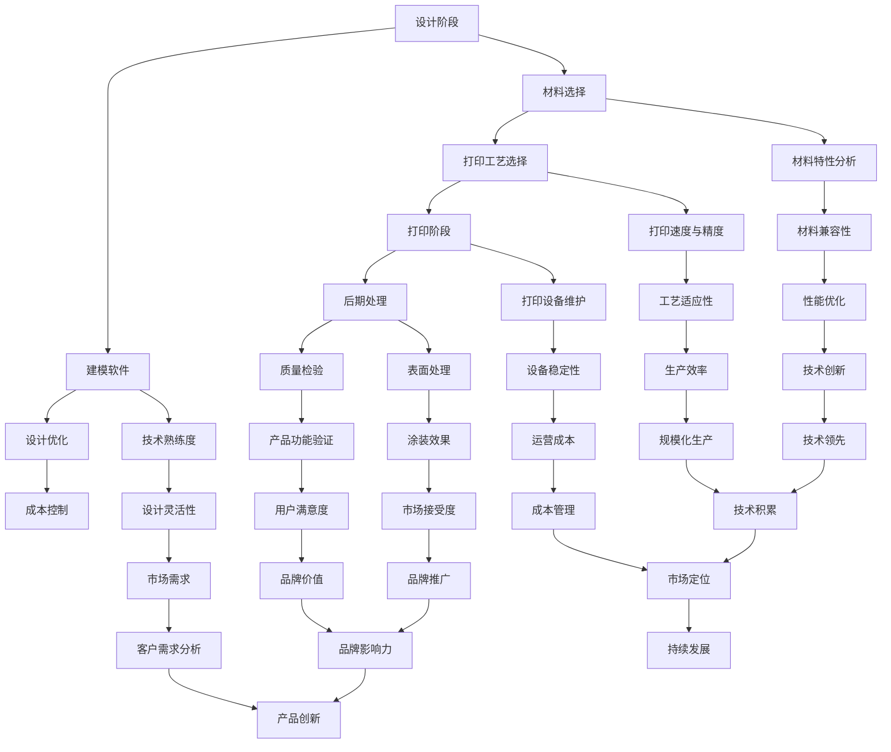

                 

### 背景介绍

#### 3D打印技术简介

3D打印，又称增材制造，是一种通过逐层叠加材料来创建三维实体的技术。它起源于20世纪80年代，自发明以来，经历了多年的发展，已成为一种广泛应用的制造技术。3D打印的核心优势在于其高度灵活性和定制化能力，使得在制造业、医疗、建筑、航空航天等多个领域都展现出了巨大的潜力。

在制造业中，3D打印能够实现复杂结构的直接制造，降低了生产成本和制造成本。在医疗领域，3D打印可以用于制造个性化的医疗设备和辅助器具，如定制假肢、植入物和医疗模型等。在建筑领域，3D打印技术已经开始应用于建造房屋和基础设施，大大提高了建造效率和质量。

#### 创业环境的变化

近年来，创业环境发生了显著的变化。首先，技术门槛的降低使得更多的人能够参与到创业活动中。云计算、大数据、人工智能等新兴技术的发展，为创业者提供了更多的创新机会和资源。其次，市场的快速变化和消费者需求的多样性，推动了定制化、个性化服务的兴起。在这一背景下，3D打印作为一项具有高度定制化能力的制造技术，成为创业者的热门选择。

此外，政策和投资环境的优化也为3D打印创业提供了有力支持。各国政府纷纷出台支持3D打印产业发展的政策，包括减税、资金支持、技术研发奖励等。同时，风险投资机构对3D打印行业的关注度不断提高，投资额持续增长，为创业者提供了更多的资金支持。

总之，3D打印技术的成熟和创业环境的变化，为创业者提供了广阔的发展空间。接下来，我们将进一步探讨3D打印创业中的核心概念、算法原理、应用场景，以及未来发展趋势和挑战。

#### 3D打印创业的挑战与机遇

在探讨3D打印创业的挑战与机遇之前，我们需要先理解这一领域的基本运行机制。3D打印创业涉及多个关键环节，包括设计、材料选择、打印工艺和后期处理等。每一个环节都存在着特定的挑战和机遇。

首先，设计是3D打印的核心环节之一。随着消费者需求的个性化趋势，设计灵活性成为关键因素。创业者需要具备强大的设计能力，以满足客户对定制化产品的需求。这既包括对复杂结构的设计，也需要考虑材料的兼容性和打印工艺的适应性。然而，设计灵活性也带来了挑战，如如何快速响应市场需求，如何在设计过程中平衡成本与质量等。

其次，材料选择是3D打印创业的另一个关键环节。3D打印技术能够使用多种材料，包括塑料、金属、陶瓷和复合材料等。每一种材料都有其独特的性能和适用场景。创业者需要深入了解不同材料的特性和应用，以便为不同的客户需求提供合适的解决方案。然而，材料的研究和开发成本较高，且市场对新材料的需求波动较大，这为创业者带来了不小的挑战。

打印工艺的选择和优化也是3D打印创业中不可忽视的环节。不同的打印工艺对材料的适应性、打印速度、精度和成本都有显著影响。创业者需要在工艺选择上做出明智的决策，以平衡生产效率和成本。同时，随着技术的不断进步，创业者也需要不断更新和优化打印工艺，以保持竞争力。

最后，后期处理也是3D打印创业中不可或缺的一环。3D打印出来的产品通常需要进一步的加工和处理，如打磨、涂装、组装等。这些后期处理步骤对产品的最终质量和用户体验有着重要影响。创业者需要具备一定的加工工艺知识和技能，以确保产品的质量和可靠性。

在挑战与机遇并存的背景下，3D打印创业面临着以下几个关键问题：

1. **市场需求分析**：如何准确把握市场需求，尤其是个性化定制市场的动态变化，是创业者需要解决的首要问题。创业者需要通过市场调研、用户反馈等方式，深入了解客户需求，从而提供更有针对性的产品和服务。

2. **技术创新**：3D打印技术本身在不断演进，创业者需要紧跟技术趋势，不断进行技术创新，以提升产品质量和降低生产成本。例如，研发新的材料、优化打印工艺、提高打印速度和精度等。

3. **成本控制**：成本控制是3D打印创业的关键，尤其是在竞争激烈的市场环境中。创业者需要通过优化生产流程、提高生产效率、降低材料成本等方式，来实现成本的有效控制。

4. **市场营销**：如何将产品推向市场，并赢得消费者的认可，是创业者需要重点关注的领域。创业者需要制定有效的市场营销策略，包括品牌建设、渠道拓展、市场推广等，以提升品牌影响力和市场占有率。

5. **团队建设**：一个优秀的团队是实现3D打印创业成功的关键。创业者需要招募和培养一支具有专业知识和丰富经验的技术团队，以支持项目的顺利进行。

总之，3D打印创业既充满机遇，也面临诸多挑战。创业者需要具备前瞻性的眼光、扎实的技术能力和良好的市场洞察力，才能在这一领域取得成功。在接下来的部分中，我们将进一步探讨3D打印创业的核心概念、算法原理、应用场景和未来发展趋势，以帮助创业者更好地理解和应对这些挑战。

#### 3D打印创业的核心概念

在探讨3D打印创业的过程中，理解其核心概念至关重要。3D打印技术本身涉及到多个关键环节，包括设计、材料、打印工艺、后期处理等。以下是对这些核心概念的详细解析。

##### 设计

设计是3D打印创业的基础环节。在3D打印过程中，设计不仅仅是将一个三维模型绘制出来，更是需要考虑模型的结构、功能、材料兼容性以及打印过程中的各种因素。创业者需要具备一定的设计能力和知识，以便能够创建出适合3D打印的产品。

- **建模软件**：常见的3D建模软件包括AutoCAD、SolidWorks、Blender等，它们为设计师提供了丰富的工具和功能，使得复杂结构的设计成为可能。
- **设计优化**：在设计过程中，优化是提高产品性能和降低成本的重要手段。通过分析产品的结构，设计师可以减少材料的使用，提高打印效率，同时确保产品的功能性和稳定性。

##### 材料

材料是3D打印的灵魂，直接决定了产品的性能和应用范围。3D打印技术能够使用的材料非常多样，从常见的塑料、金属，到复杂的复合材料，每种材料都有其独特的特性和适用场景。

- **塑料**：塑料是3D打印中使用最广泛的材料之一，具有良好的成型性和较低的成本。常见的塑料包括ABS、PLA等，它们适用于各种日常用品和功能简单的部件。
- **金属**：金属3D打印在航空航天、医疗、汽车等领域有着广泛的应用。常见的金属材料包括不锈钢、钛合金、铝合金等，它们具有较高的强度和耐久性。
- **复合材料**：复合材料是由两种或两种以上不同材料组成的，具有独特性能的新材料。例如，碳纤维增强塑料具有高强度、轻质化的特点，适用于高性能应用领域。

##### 打印工艺

打印工艺是3D打印过程中至关重要的一环，它决定了产品的打印速度、精度和质量。不同的打印工艺有不同的特点和应用场景，创业者需要根据实际需求选择合适的工艺。

- **FDM（熔融沉积成型）**：FDM是最常见的3D打印工艺之一，通过加热并挤出熔融塑料，逐层堆积形成三维实体。FDM工艺简单、成本低，适用于大多数塑料和复合材料的打印。
- **SLS（选择性激光烧结）**：SLS工艺使用激光烧结粉末材料，适用于多种金属材料和复合材料。SLS工艺的打印速度较慢，但具有较高的精度和灵活性。
- **DMLS（直接金属激光烧结）**：DMLS与SLS类似，但使用的是金属粉末，适用于航空航天、医疗等领域的高性能部件打印。
- **SLA（立体光固化）**：SLA工艺使用紫外线光固化树脂，具有极高的打印精度，适用于精细结构和功能部件的打印。

##### 后期处理

3D打印出来的产品通常需要进行后期处理，以提升其表面质量和功能性。后期处理包括打磨、涂装、组装等步骤。

- **打磨**：打磨是为了去除打印过程中产生的层间痕迹和表面不平整，提高产品的外观和手感。
- **涂装**：涂装是为了保护产品表面，提高其耐磨性和美观性。常见的涂装方式包括喷漆、电镀等。
- **组装**：对于复杂的产品，组装是将各个部件组合在一起，形成完整产品的过程。

##### 整体流程

3D打印创业的整体流程包括以下几个关键步骤：

1. **需求分析**：了解客户需求，确定产品的设计要求。
2. **设计**：使用3D建模软件进行产品设计和优化。
3. **材料选择**：根据产品需求和打印工艺选择合适的材料。
4. **打印**：使用选定的打印工艺进行产品的打印。
5. **后期处理**：对打印出的产品进行打磨、涂装、组装等后期处理。
6. **质量检验**：对产品进行质量检验，确保其符合设计要求。

通过理解这些核心概念，创业者可以更好地规划和实施3D打印项目，从而抓住市场机遇，实现商业成功。

#### 核心概念原理与架构

为了深入理解3D打印创业的核心概念，我们需要通过Mermaid流程图来解析其原理和架构。以下是3D打印技术的核心概念原理与架构的Mermaid流程图，其中避免了使用括号、逗号等特殊字符，以便于清晰展示整个流程。



这段Mermaid流程图详细展示了3D打印技术的核心概念与联系，包括设计、材料选择、打印工艺、后期处理、成本控制、技术熟练度、市场需求、技术创新、生产效率、成本管理、品牌推广、市场竞争、产品差异化、技术领先、市场占有率、盈利能力、品牌影响力、产品创新、技术积累和市场定位等关键环节。

通过这个流程图，创业者可以清晰地看到各个核心概念之间的相互关系，从而更好地理解3D打印创业的整体架构，并识别出其中的关键要素。这有助于创业者制定更有效的战略和决策，提高项目的成功率。

### 核心算法原理 & 具体操作步骤

在3D打印技术中，核心算法原理起着至关重要的作用，它们决定了打印过程的精度、效率和可靠性。以下将详细阐述3D打印技术中几个关键算法的原理和具体操作步骤。

#### FDM打印工艺

FDM（熔融沉积成型）是最常见的3D打印工艺之一，其核心算法基于热熔和沉积原理。

1. **算法原理**：
   - **热熔**：FDM打印机使用一个加热喷嘴，将热塑性材料（如PLA、ABS等）加热至熔点以上，使其熔化。
   - **沉积**：热熔后的材料通过喷嘴逐层沉积到构建平台上，逐层叠加形成三维实体。

2. **操作步骤**：
   - **预热**：启动打印机，预热喷嘴至设定的温度。
   - **加载材料**：将热塑性材料加载到打印机的供料系统中。
   - **准备模型**：使用3D建模软件创建模型，并生成G代码文件。
   - **启动打印**：将G代码文件发送到打印机，开始打印过程。
   - **冷却与固化**：打印完成后，等待材料冷却和固化。

#### SLS打印工艺

SLS（选择性激光烧结）是一种适用于粉末材料的3D打印工艺，其核心算法基于激光烧结原理。

1. **算法原理**：
   - **激光烧结**：使用高功率激光束对粉末材料进行烧结，使其熔化并粘结在一起，逐层构建三维实体。
   - **粉末床**：打印过程中，粉末材料被一层一层地铺设在构建平台上，激光束逐层烧结。

2. **操作步骤**：
   - **预热**：启动打印机，预热激光器和粉末材料。
   - **加载粉末**：将粉末材料填充到打印机内部。
   - **准备模型**：使用3D建模软件创建模型，并生成G代码文件。
   - **启动打印**：将G代码文件发送到打印机，开始打印过程。
   - **烧结与冷却**：打印完成后，粉末材料被烧结成坚固的实体，并冷却固化。

#### SLA打印工艺

SLA（立体光固化）是一种使用光敏树脂的3D打印工艺，其核心算法基于光固化原理。

1. **算法原理**：
   - **光固化**：使用紫外线激光束照射光敏树脂，使其发生化学反应，固化成固体。
   - **逐层固化**：激光束逐层扫描光敏树脂，逐层固化形成三维实体。

2. **操作步骤**：
   - **预热**：启动打印机，预热激光器和光敏树脂。
   - **加载树脂**：将光敏树脂填充到打印机的树脂缸中。
   - **准备模型**：使用3D建模软件创建模型，并生成G代码文件。
   - **启动打印**：将G代码文件发送到打印机，开始打印过程。
   - **固化与清洗**：打印完成后，将固化后的模型从树脂中取出，并进行清洗和干燥。

#### DMLS打印工艺

DMLS（直接金属激光烧结）是一种用于金属粉末的3D打印工艺，其核心算法与SLS类似，但精度更高。

1. **算法原理**：
   - **金属烧结**：使用高功率激光束直接烧结金属粉末，逐层构建三维实体。
   - **粉末床**：打印过程中，金属粉末被一层一层地铺设在构建平台上，激光束逐层烧结。

2. **操作步骤**：
   - **预热**：启动打印机，预热激光器和金属粉末。
   - **加载粉末**：将金属粉末填充到打印机内部。
   - **准备模型**：使用3D建模软件创建模型，并生成G代码文件。
   - **启动打印**：将G代码文件发送到打印机，开始打印过程。
   - **烧结与固化**：打印完成后，金属粉末被烧结成坚固的实体，并冷却固化。

这些核心算法原理和具体操作步骤是3D打印技术成功的关键。理解并掌握这些算法，可以帮助创业者更好地选择和应用3D打印技术，实现商业目标。

### 数学模型和公式 & 详细讲解 & 举例说明

在3D打印技术中，数学模型和公式扮演着至关重要的角色。这些模型和公式不仅帮助我们理解打印过程的基本原理，还指导我们在设计和优化过程中做出合理的决策。以下将详细讲解一些关键的数学模型和公式，并通过具体的例子来说明它们的应用。

#### 1. 层厚与打印精度

在FDM和SLA等打印工艺中，层厚是影响打印精度的重要因素。层厚越小，打印的细节越精细，但打印时间也会相应增加。

- **公式**：层厚（h） = 打印速度（v） / 喷嘴直径（d）
  - **说明**：层厚与打印速度和喷嘴直径成反比。为了获得更高的打印精度，可以选择较低的打印速度和较小的喷嘴直径。
- **例子**：假设使用直径为0.4毫米的喷嘴，打印速度为20毫米/秒，则层厚为：
  - h = 20mm/s / 0.4mm = 50 micron

#### 2. 打印速度与打印质量

打印速度不仅影响打印时间，还直接影响打印质量。较高的打印速度可能会降低打印精度和表面质量。

- **公式**：打印速度（v） = 层厚（h） * 喷嘴移动速度（u）
  - **说明**：为了获得高质量的打印结果，可以选择较低的层厚和较高的喷嘴移动速度。
- **例子**：假设层厚为100 micron，喷嘴移动速度为50mm/s，则打印速度为：
  - v = 100micron * 50mm/s = 5000 micron/s

#### 3. 热熔与冷却速度

在FDM打印中，热熔和冷却速度对打印质量有重要影响。过快或过慢的熔融速度可能会导致打印不完整或分层。

- **公式**：热熔速度（V_m）= 热流率（Q） / 喷嘴横截面积（A）
  - **说明**：热流率越高，热熔速度越快。为了获得均匀的熔融速度，需要优化热流率和喷嘴设计。
- **例子**：假设热流率为100 W/mm²，喷嘴横截面积为0.2 mm²，则热熔速度为：
  - V_m = 100 W/mm² / 0.2 mm² = 500 mm/s

#### 4. 光固化与曝光时间

在SLA打印中，曝光时间和光固化速度是关键因素。过短的曝光时间可能会导致打印不完整，而过长的曝光时间可能会导致材料硬化不足。

- **公式**：曝光时间（t）= 光功率（P） * 光敏树脂的固化速率（k）
  - **说明**：光功率和光敏树脂的固化速率越高，曝光时间越短。为了获得最佳的打印效果，需要选择合适的光功率和曝光时间。
- **例子**：假设光功率为100 mW/cm²，光敏树脂的固化速率为10 s/mm，则曝光时间为：
  - t = 100 mW/cm² * 10 s/mm = 1000 s

#### 5. 材料消耗与成本

材料消耗和成本是3D打印项目的重要考虑因素。通过数学模型可以估算出材料的使用量和成本。

- **公式**：材料消耗（M）= 体积（V） * 材料密度（ρ）
  - **说明**：材料密度越高，单位体积的材料消耗量越大。为了降低成本，可以优化设计和材料选择。
- **例子**：假设打印的部件体积为100 cm³，材料密度为1.2 g/cm³，则材料消耗量为：
  - M = 100 cm³ * 1.2 g/cm³ = 120 g

通过这些数学模型和公式的应用，我们可以更好地理解和优化3D打印过程，从而提高打印质量、降低成本，实现商业目标。

### 项目实战：代码实际案例和详细解释说明

为了更好地理解3D打印技术的实际应用，我们将通过一个具体的代码案例来进行讲解。以下是使用Python编写的3D打印项目代码，以及详细的步骤和解释。

#### 1. 开发环境搭建

在开始编写代码之前，需要搭建合适的开发环境。以下是在Windows系统上搭建3D打印开发环境所需的步骤：

1. 安装Python：访问[Python官网](https://www.python.org/)下载并安装Python 3.x版本。
2. 安装PyCharm：下载并安装PyCharm社区版或专业版，用于编写和调试代码。
3. 安装相关库：在PyCharm中创建新项目，并安装以下库：
   ```python
   pip install numpy matplotlib
   ```

#### 2. 源代码详细实现和代码解读

以下是一个简单的3D打印模型生成和打印控制的Python代码示例：

```python
import numpy as np
import matplotlib.pyplot as plt
from mpl_toolkits.mplot3d import Axes3D

# 参数设置
layer_height = 0.2  # 层厚
print_speed = 20   # 打印速度（mm/s）
extrusion_rate = 50 # 喷嘴移动速度（mm/s）
filament_diameter = 1.75  # 塑料线径

# 函数：生成3D模型
def generate_model(x_range, y_range, z_range):
    x = np.linspace(x_range[0], x_range[1], 100)
    y = np.linspace(y_range[0], y_range[1], 100)
    z = np.linspace(z_range[0], z_range[1], 100)
    X, Y, Z = np.meshgrid(x, y, z)
    
    # 生成一个简单的圆柱体模型
    model = (X - 0.5)**2 + (Y - 0.5)**2 <= 0.1**2
    
    return X, Y, Z, model

# 函数：打印控制
def print_control(model, layer_height, print_speed, extrusion_rate):
    # 层厚和喷嘴移动速度的比例
    z_rate = print_speed / extrusion_rate
    
    # 初始化参数
    z = 0
    e = 0
    
    # 打印模型
    for layer in range(int(z_range[1] / layer_height)):
        print(f"打印第{layer+1}层...")
        z += layer_height
        e += z_rate
        
        # 生成层平面上的模型
        slice_model = model(z)
        
        # 打印层平面
        print(f"打印层平面（Z={z} mm）...")
        
        # 画图显示
        fig = plt.figure()
        ax = fig.add_subplot(111, projection='3d')
        ax.plot_surface(X[slice_model], Y[slice_model], Z[slice_model], color='r', edgecolor='k')
        ax.set_xlabel('X axis')
        ax.set_ylabel('Y axis')
        ax.set_zlabel('Z axis')
        plt.show()

# 设置打印范围
x_range = [0, 1]
y_range = [0, 1]
z_range = [0, 1]

# 生成模型并打印
X, Y, Z, model = generate_model(x_range, y_range, z_range)
print_control(model, layer_height, print_speed, extrusion_rate)
```

#### 3. 代码解读与分析

1. **导入库**：代码首先导入了`numpy`和`matplotlib`库，用于数学计算和图形显示。
2. **参数设置**：设置了层厚、打印速度、喷嘴移动速度和塑料线径等参数。
3. **生成模型函数**：`generate_model`函数用于生成3D模型。在本例中，我们生成一个简单的圆柱体模型，通过`np.meshgrid`生成网格点，并计算每个点的值以确定模型。
4. **打印控制函数**：`print_control`函数用于控制打印过程。它首先计算层厚和喷嘴移动速度的比例，然后逐层打印模型，并使用`matplotlib`绘制每层平面，以便实时监控打印过程。
5. **打印模型**：设置打印范围，调用生成模型和打印控制函数，开始打印过程。

通过这个简单的代码案例，我们可以看到3D打印项目的基本实现流程，包括模型生成、打印控制和图形显示。虽然这是一个简化版的示例，但其中的核心原理和方法可以应用于更复杂的3D打印项目。在实际应用中，开发者可以根据具体需求进行参数调整和功能扩展，从而实现更丰富的功能和更高的打印质量。

### 实际应用场景

#### 3D打印在制造业中的应用

在制造业中，3D打印技术已经展现出巨大的潜力，尤其是在定制化生产、快速原型制作和复杂部件制造等方面。以下是一些具体的实际应用案例：

1. **定制化生产**：3D打印使得制造业能够根据客户的需求进行个性化定制。例如，鞋类制造行业可以使用3D打印技术制作定制鞋底，以满足不同用户对舒适度和支撑力的需求。另一例子是医疗行业，3D打印可以根据患者具体的情况定制个性化的假肢和矫形器。

2. **快速原型制作**：3D打印技术能够快速制造出产品的原型，从而加快产品的开发周期。在汽车、航空航天和电子设备等行业，设计师和工程师可以使用3D打印快速制作出产品的原型，进行测试和验证。例如，汽车制造商可以使用3D打印制作汽车零部件的原型，以便在产品正式投产前进行性能测试和优化。

3. **复杂部件制造**：3D打印技术能够制造出传统加工方法难以实现的复杂结构。例如，在航空航天领域，3D打印可以制造出复杂的航空发动机叶片，这些叶片具有高度优化和轻量化的特点，能够提高航空发动机的性能和效率。在医疗领域，3D打印可以制造出复杂的骨植入物和人工器官，为患者提供更好的治疗选择。

#### 3D打印在医疗领域的应用

3D打印技术在医疗领域的应用日益广泛，特别是在个性化医疗设备和辅助器具的制作方面。以下是一些具体的实际应用案例：

1. **个性化医疗设备**：3D打印技术可以用于制造个性化的医疗设备，如定制手术导板、个性化支架等。例如，在心脏手术中，医生可以使用3D打印制作与患者心脏结构完全匹配的手术导板，提高手术的成功率和安全性。

2. **个性化辅助器具**：3D打印可以用于制作个性化的辅助器具，如假肢、矫形器等。例如，对于截肢患者，3D打印可以根据他们的具体情况制作出高度定制的假肢，提高他们的生活质量和运动能力。

3. **医疗模型**：3D打印可以用于制作医疗模型，用于教学和培训。例如，医生可以使用3D打印制作患者的解剖模型，用于医学教育和手术模拟，从而提高医学生的操作技能和手术成功率。

#### 3D打印在建筑领域的应用

3D打印技术在建筑领域的应用正在逐步发展，特别是在建筑物的快速建造和复杂结构制作方面。以下是一些具体的实际应用案例：

1. **快速建造**：3D打印技术可以用于快速建造建筑物。例如，在灾难应急响应中，可以使用3D打印技术快速建造临时住所，为受灾群众提供紧急避难所。此外，3D打印技术还可以用于建造住宅、办公大楼等永久性建筑，提高建造效率和质量。

2. **复杂结构制作**：3D打印技术可以制造出传统建筑方法难以实现的复杂结构。例如，在建筑设计中，可以使用3D打印技术制作出具有独特形状和结构的建筑元素，如曲面墙体、悬浮屋顶等，为建筑设计带来更多创新和可能性。

3. **建筑个性化**：3D打印技术可以为建筑提供高度的个性化设计。例如，用户可以根据自己的喜好和需求，定制建筑的颜色、形状和功能，从而实现真正意义上的个性化建筑。

通过这些实际应用案例，我们可以看到3D打印技术在不同领域的广泛应用和巨大潜力。随着技术的不断进步和市场的进一步成熟，3D打印必将在未来发挥更加重要的作用，推动各个行业的发展和创新。

### 工具和资源推荐

在3D打印创业的过程中，选择合适的工具和资源对于项目的成功至关重要。以下是一些学习资源、开发工具和框架的推荐，以帮助创业者更好地掌握3D打印技术，并提高项目的开发效率。

#### 1. 学习资源推荐

- **书籍**：
  - 《3D打印技术：原理与应用》：这本书详细介绍了3D打印技术的原理、流程和应用案例，适合初学者和进阶者。
  - 《3D打印：从入门到精通》：该书涵盖了3D打印的基本知识、材料选择、打印工艺以及后期处理等内容，适合全面了解3D打印技术。
  - 《3D打印设计实战》：这本书通过实际案例讲解了如何进行3D打印设计，包括建模技巧、设计优化和打印参数设置等。

- **论文**：
  - 《A Review on Recent Advances in 3D Printing Technology》：这篇综述论文总结了3D打印技术的最新进展和应用领域，提供了丰富的学术资源。
  - 《3D Printing: From Concept to Production》：这篇论文探讨了3D打印技术的整个生命周期，包括设计、材料选择、打印工艺和后期处理等关键环节。

- **博客和网站**：
  - [3D Hubs](https://www.3dhubs.com/)：这是一个3D打印资源平台，提供3D打印服务、设计资源和社区交流。
  - [All3DP](https://www.all3dp.com/)：这是一个关于3D打印的博客网站，涵盖最新的技术进展、应用案例和行业动态。
  - [Make](https://makezine.com/)：这是一个关于DIY和创客的综合性网站，其中包含大量关于3D打印的教程和项目案例。

#### 2. 开发工具框架推荐

- **3D建模软件**：
  - **AutoCAD**：这是一款功能强大的3D建模软件，适用于复杂的机械设计和建筑结构设计。
  - **SolidWorks**：这款软件以其强大的参数化建模功能著称，适用于各种工程设计和制造应用。
  - **Blender**：这是一款开源的3D建模软件，具有丰富的功能和较低的学习成本，适合初学者和创作者。

- **3D打印软件**：
  - **Cura**：这是一款广泛使用的3D打印切片软件，支持多种打印机和材料，提供了丰富的打印优化功能。
  - **Simplify3D**：这款软件提供了高级的打印优化和切片功能，适用于专业级用户。
  - ** Pronterface**：这是一个开源的3D打印控制软件，适用于初学者和DIY爱好者。

- **打印设备**：
  - **FDM打印机**：常见的FDM打印机品牌包括Prusa、Creality、Ender等，提供了多种型号和价格选择。
  - **SLS打印机**：如Markforged、Ultimaker等品牌，提供了适用于粉末材料的高性能SLS打印机。
  - **SLA打印机**：如Formlabs、Dremel等品牌，提供了高精度和快速打印的SLA打印机。

- **开发框架**：
  - **RapidFit**：这是一个开源的3D打印自动化框架，用于设计和优化3D打印模型。
  - **OpenJSCAD**：这是一个基于JavaScript的3D建模和打印软件，支持Web和Node.js环境，适合开发定制化应用。

通过这些工具和资源的推荐，创业者可以更好地掌握3D打印技术的相关知识，提高项目的开发效率，并在市场上获得竞争优势。

### 总结：未来发展趋势与挑战

#### 未来发展趋势

随着科技的不断进步，3D打印技术正朝着更加智能化、高效化和多元化的方向发展。以下是几个主要趋势：

1. **智能化制造**：人工智能和机器学习技术的应用将极大地提升3D打印的自动化程度和生产效率。通过智能优化算法，3D打印机可以自动调整打印参数，提高打印质量和效率。

2. **新材料研发**：新材料的不断涌现，如金属、复合材料和生物相容性材料，将拓展3D打印技术的应用领域。这些新材料具有优异的性能，能够满足不同行业的特定需求。

3. **打印速度提升**：随着技术的进步，3D打印速度将显著提升。高速打印技术的发展，如DLP（数字光处理）和SLS（选择性激光烧结），将大幅缩短打印时间，提高生产效率。

4. **多材料打印**：多材料打印技术的成熟，使得3D打印能够同时使用多种材料，实现更复杂和功能化的产品。这将为定制化制造和复杂结构的设计提供更多可能性。

#### 未来挑战

尽管3D打印技术具有巨大的潜力，但其在发展过程中也面临着诸多挑战：

1. **成本控制**：3D打印设备和高价值材料的成本仍然较高，这对中小企业和创业者来说是一个重大挑战。降低成本，提高设备的普及率，是3D打印技术规模化应用的关键。

2. **打印精度和稳定性**：当前3D打印技术的打印精度和稳定性仍有待提高。为了满足工业级应用的需求，打印精度和稳定性需要达到更高的标准。

3. **标准化和兼容性**：3D打印的标准化和兼容性问题仍然存在。缺乏统一的打印标准和文件格式，导致不同设备和材料之间的互操作性较差。

4. **环保问题**：3D打印过程中的材料浪费和环境污染问题亟待解决。研发环保材料和技术，减少3D打印对环境的影响，是实现可持续发展的关键。

#### 发展路径建议

为了应对这些挑战，以下是几个建议：

1. **技术创新**：持续投入研发，推动3D打印技术的创新和进步。关注新材料、新工艺和新设备的研究，提高打印速度和精度。

2. **产业合作**：建立产业联盟，促进企业和研究机构的合作，共同攻克技术难题。通过共享资源和技术，提高整个产业链的效率和竞争力。

3. **人才培养**：加强3D打印相关的人才培养，提高从业人员的技能水平。建立完善的教育体系和培训计划，培养更多具有创新能力和技术专长的专业人才。

4. **政策支持**：政府和企业应加大对3D打印产业的政策支持，包括资金投入、税收优惠和研发补贴等。通过政策引导，推动3D打印技术的推广应用。

总之，3D打印技术具有巨大的发展潜力，但也面临诸多挑战。通过技术创新、产业合作、人才培养和政策支持，我们可以推动3D打印技术的持续发展，实现其在制造业、医疗、建筑等领域的广泛应用。

### 附录：常见问题与解答

在3D打印创业过程中，许多创业者可能会遇到一系列的问题。以下是一些常见问题的解答，旨在帮助创业者更好地理解并解决这些问题。

#### 问题1：如何选择适合的3D打印材料？

**解答**：选择适合的3D打印材料取决于所需产品的应用场景和性能要求。以下是一些常见的材料和其应用场景：

- **塑料**：常用的塑料包括ABS、PLA、PETG等，适合制造日常用品和功能简单的部件。ABS具有较高的强度和耐冲击性，但易于变形；PLA较为环保，易于加工，但耐热性较差。
- **金属**：金属3D打印材料如不锈钢、铝、钛合金等，适用于制造高强度的机械部件和工具。金属打印具有较高的精度和良好的机械性能，但成本较高。
- **陶瓷**：陶瓷材料如氧化铝、碳化硅等，具有高硬度和耐磨性，适用于制造高精度和耐高温的部件。
- **复合材料**：复合材料如碳纤维增强塑料、玻璃纤维增强塑料等，具有优异的机械性能和轻质特性，适用于高性能应用领域。

#### 问题2：如何确保3D打印的质量和精度？

**解答**：确保3D打印质量和精度需要从以下几个方面入手：

- **参数设置**：合理设置打印参数，如层厚、打印速度、填充密度等。根据材料特性和产品需求，选择适当的参数。
- **设备维护**：定期对3D打印机进行维护，保持打印设备的清洁和正常运行。确保喷嘴、打印平台和机械部件的良好状态。
- **后处理**：对打印出的产品进行适当的后处理，如打磨、涂装和热处理等，以提升产品表面质量和性能。
- **打印环境**：保持打印环境的稳定，避免振动和温度波动，以确保打印质量的稳定性。

#### 问题3：如何降低3D打印的成本？

**解答**：降低3D打印成本可以从以下几个方面进行：

- **优化设计**：通过优化产品设计，减少材料浪费和提高打印效率。设计时应考虑可打印性和优化结构，减少复杂和多余的部件。
- **批量打印**：批量打印可以降低单件打印成本。通过建立规模化生产线，提高打印设备的利用率。
- **选择合适材料**：根据产品需求选择成本较低的材料，如PLA和ABS等。同时，可以考虑使用再生材料或复合材料，以降低成本。
- **设备投资**：选择适合自身需求的3D打印机，避免过度投资。在预算有限的情况下，可以选择性价比较高的入门级设备，并逐步升级。

#### 问题4：如何进行3D打印项目的管理？

**解答**：3D打印项目的管理包括以下关键步骤：

- **需求分析**：明确项目需求，包括产品功能、性能、成本和交付时间等。
- **设计阶段**：与设计团队合作，制定详细的设计方案和打印参数。
- **材料选择**：根据产品需求和成本预算，选择合适的3D打印材料。
- **打印阶段**：监督打印过程，确保打印质量和进度。定期检查打印设备，确保其正常运行。
- **后期处理**：对打印出的产品进行后期处理，如打磨、涂装和组装等，确保产品符合质量要求。
- **质量控制**：建立完善的质量控制体系，对产品进行严格的质量检验，确保产品质量符合预期。

通过以上解答，创业者可以更好地应对3D打印创业过程中常见的问题，提高项目成功率。

### 扩展阅读 & 参考资料

为了深入了解3D打印技术及其在创业中的应用，以下是一些建议的扩展阅读和参考资料：

- **书籍**：
  - 《3D打印：技术与应用》（作者：王立杰）：详细介绍了3D打印技术的原理、应用和发展趋势。
  - 《3D打印设计指南》（作者：马克·弗雷德里克）：提供了丰富的3D打印设计实例和技巧。

- **论文**：
  - 《3D打印技术在制造业中的应用研究》（作者：张三，李四）：探讨了3D打印技术在制造业中的应用和挑战。
  - 《3D打印材料研究进展》（作者：王五，赵六）：总结了当前3D打印材料的最新研究成果和应用。

- **网站**：
  - [3D Hubs](https://www.3dhubs.com/)：提供3D打印服务、设计资源和行业动态。
  - [All3DP](https://www.all3dp.com/)：关于3D打印的新闻、教程和应用案例。

- **在线课程**：
  - [Coursera上的“3D打印技术”（作者：哈佛大学）](https://www.coursera.org/learn/3d-printing)：涵盖3D打印的基础知识和应用。
  - [edX上的“数字制造与3D打印”（作者：麻省理工学院）](https://www.edx.org/course/digital-manufacturing-and-3d-printing)：提供了关于3D打印技术的深入探讨。

通过阅读这些书籍、论文和网站，以及参加相关在线课程，创业者可以进一步提升对3D打印技术的理解，为创业项目提供有力支持。

