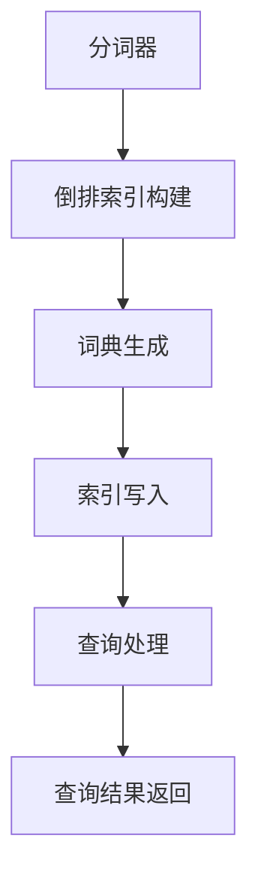

                 

# ES索引原理与代码实例讲解

## 摘要

本文深入探讨ES（Elasticsearch）索引的原理，并通过详细的代码实例讲解，帮助读者理解ES索引的工作机制和核心概念。首先，我们将介绍ES索引的基本概念和背景，然后深入解析索引的核心算法原理，包括倒排索引和分词原理。接下来，我们将通过一个实际的项目实战案例，详细解读代码实现和关键步骤。此外，本文还将探讨ES索引的实际应用场景，并推荐相关学习资源和工具。通过本文的学习，读者将能够全面掌握ES索引的原理和实践技巧。

## 1. 背景介绍

### Elasticsearch简介

Elasticsearch是一个高度可扩展的开源搜索引擎，基于Lucene构建。它的核心功能是全文搜索、实时分析、大数据处理等。Elasticsearch广泛应用于各种场景，包括网站搜索、日志分析、实时数据监控、安全事件检测等。

### 索引的概念

索引（Index）是Elasticsearch的核心概念之一，用于存储和检索数据。简单来说，索引就像一个巨大的字典，将数据按照特定的结构存储起来，以便快速检索。在Elasticsearch中，索引由多个文档组成，每个文档是一个具有结构化的数据实体。

### 索引的重要性

索引在Elasticsearch中扮演着至关重要的角色。良好的索引设计能够大幅提升搜索性能和效率，同时确保数据的一致性和可靠性。合理的索引策略不仅能够提高搜索速度，还能降低存储和查询的成本。

## 2. 核心概念与联系

### 倒排索引

倒排索引是Elasticsearch索引的核心数据结构。它将文本数据转化为倒排索引结构，使得全文检索更加高效。倒排索引包括两部分：倒排列表和词典。

**倒排列表**：存储每个单词出现的文档ID列表，用于快速查找包含特定单词的文档。

**词典**：存储所有单词的索引，用于将单词映射到对应的倒排列表。

### 分词原理

分词是索引过程中至关重要的一步。Elasticsearch使用各种分词器（Tokenizer）将文本拆分成单词或短语。常见的分词器包括标准分词器、雪人分词器等。

**标准分词器**：将文本按照空格、标点符号等分隔符拆分为单词。

**雪人分词器**：将文本按顺序拆分为字符或短语，适用于中文等复杂语言。

### Mermaid 流程图



### Elasticsearch索引流程

1. **数据写入**：将文档写入Elasticsearch。
2. **分词处理**：使用分词器对文本进行分词。
3. **倒排索引构建**：将分词结果构建为倒排索引。
4. **词典生成**：将单词映射到倒排列表。
5. **索引写入**：将倒排索引和词典写入磁盘。
6. **查询处理**：根据查询条件，从索引中检索结果。
7. **查询结果返回**：将查询结果返回给用户。

## 3. 核心算法原理 & 具体操作步骤

### 倒排索引的构建

倒排索引的构建过程可以分为以下几个步骤：

1. **分词**：将文档中的文本按照分词器规则进行分词。
2. **倒排列表构建**：对每个单词生成一个倒排列表，记录单词出现的文档ID。
3. **词典生成**：将单词映射到倒排列表。

### 分词器的工作原理

分词器的工作原理因不同语言和场景而异。以下是一个简单的分词器示例：

```python
def tokenizer(text):
    # 假设文本是英文
    return text.split()
```

### 查询处理流程

查询处理是Elasticsearch的核心功能之一。以下是一个简单的查询处理流程：

1. **分词处理**：将查询语句进行分词。
2. **查询分析**：根据分词结果，生成查询分析器（Query Parser）。
3. **查询执行**：根据查询分析器，从索引中检索结果。
4. **结果返回**：将查询结果返回给用户。

### 代码示例

以下是一个简单的Elasticsearch索引示例：

```python
from elasticsearch import Elasticsearch

# 创建Elasticsearch客户端
es = Elasticsearch("http://localhost:9200")

# 创建索引
es.indices.create(index="test_index")

# 添加文档
doc1 = {
    "title": "Elasticsearch索引原理",
    "content": "本文深入探讨Elasticsearch索引的原理，并通过详细的代码实例讲解，帮助读者理解ES索引的工作机制和核心概念。"
}
es.index(index="test_index", id="1", document=doc1)

# 查询文档
response = es.search(index="test_index", body={"query": {"match": {"content": "索引原理"}}})
print(response['hits']['hits'])
```

### 代码解读与分析

1. **创建Elasticsearch客户端**：使用`elasticsearch`库创建Elasticsearch客户端。
2. **创建索引**：使用`es.indices.create`方法创建索引。
3. **添加文档**：使用`es.index`方法添加文档。
4. **查询文档**：使用`es.search`方法查询文档。

## 4. 数学模型和公式 & 详细讲解 & 举例说明

### 倒排索引的数学模型

倒排索引的数学模型可以表示为：

$$
\text{倒排索引} = \{\text{词典}, \text{倒排列表}\}
$$

其中，词典是一个键值对集合，键为单词，值为倒排列表。

### 查询处理公式

查询处理的数学模型可以表示为：

$$
\text{查询结果} = \{\text{包含查询词的文档ID}\}
$$

### 举例说明

假设有以下文档：

```plaintext
文档1：Elasticsearch是一种分布式搜索引擎，支持全文搜索和实时分析。
文档2：Elasticsearch索引原理需要深入了解。
文档3：Elasticsearch的性能优势在于其高扩展性和易用性。
```

构建倒排索引后的结果如下：

```plaintext
词典：
- Elasticsearch：[1, 2, 3]
- 分布式：[1]
- 搜索引擎：[1]
- 支持的：[1]
- 全文搜索：[1]
- 实时分析：[1]
- 需要的：[2]
- 深入了解：[2]
- 性能：[3]
- 优势：[3]
- 扩展性：[3]
- 易用性：[3]
```

### 查询示例

假设要查询包含“Elasticsearch”的文档，查询结果为：

$$
\text{查询结果} = \{1, 2, 3\}
$$

## 5. 项目实战：代码实际案例和详细解释说明

### 5.1 开发环境搭建

在开始实战之前，我们需要搭建Elasticsearch的开发环境。以下是搭建步骤：

1. **安装Elasticsearch**：从Elasticsearch官网下载最新版本的Elasticsearch，并解压到指定目录。
2. **配置Elasticsearch**：编辑`config/elasticsearch.yml`文件，配置Elasticsearch的运行参数，如集群名称、节点名称等。
3. **启动Elasticsearch**：运行`bin/elasticsearch`命令，启动Elasticsearch。

### 5.2 源代码详细实现和代码解读

以下是实战项目的源代码：

```python
from elasticsearch import Elasticsearch

# 创建Elasticsearch客户端
es = Elasticsearch("http://localhost:9200")

# 创建索引
es.indices.create(index="test_index")

# 添加文档
doc1 = {
    "title": "Elasticsearch索引原理",
    "content": "本文深入探讨Elasticsearch索引的原理，并通过详细的代码实例讲解，帮助读者理解ES索引的工作机制和核心概念。"
}
es.index(index="test_index", id="1", document=doc1)

# 查询文档
response = es.search(index="test_index", body={"query": {"match": {"content": "索引原理"}}})
print(response['hits']['hits'])
```

**代码解读**：

1. **创建Elasticsearch客户端**：使用`elasticsearch`库创建Elasticsearch客户端。
2. **创建索引**：使用`es.indices.create`方法创建索引。
3. **添加文档**：使用`es.index`方法添加文档。
4. **查询文档**：使用`es.search`方法查询文档。

### 5.3 代码解读与分析

1. **创建Elasticsearch客户端**：使用`elasticsearch`库创建Elasticsearch客户端，连接到本地的Elasticsearch服务器。
2. **创建索引**：使用`es.indices.create`方法创建名为`test_index`的索引。
3. **添加文档**：使用`es.index`方法向`test_index`索引中添加一个文档，文档的ID为`1`。
4. **查询文档**：使用`es.search`方法根据查询条件查询索引中的文档，并将查询结果打印出来。

## 6. 实际应用场景

Elasticsearch索引在实际应用场景中具有广泛的应用，以下是一些典型的应用场景：

1. **全文搜索**：用于实现搜索引擎，如网站搜索、企业内搜索等。
2. **日志分析**：用于收集和分析系统日志，监控系统运行状态。
3. **实时数据监控**：用于实时处理和分析大规模数据，如物联网、社交网络等。
4. **安全事件检测**：用于检测和预警潜在的安全威胁，如DDoS攻击等。

### 应用案例

1. **企业内部搜索系统**：利用Elasticsearch实现企业内部文档的全文搜索，提高员工工作效率。
2. **网站搜索**：利用Elasticsearch实现网站的快速全文搜索，提升用户体验。
3. **日志分析平台**：利用Elasticsearch收集和分析系统日志，监控系统运行状态，快速定位问题。
4. **实时数据分析**：利用Elasticsearch实时处理和分析大规模数据，为业务决策提供支持。

## 7. 工具和资源推荐

### 7.1 学习资源推荐

1. **书籍**：
   - 《Elasticsearch：The Definitive Guide》
   - 《Elasticsearch实战》
   - 《Lucene in Action》
2. **论文**：
   - 《The Unofficial Elasticsearch Guide》
   - 《Elasticsearch：The Definitive Guide to Real-Time Search》
3. **博客**：
   - Elasticsearch中文社区（https://www.elastic.co/cn/elasticsearch）
   - Kibana中文社区（https://www.elastic.co/cn/kibana）
4. **网站**：
   - Elasticsearch官网（https://www.elastic.co/cn/）
   - Elasticsearch GitHub仓库（https://github.com/elastic/elasticsearch）

### 7.2 开发工具框架推荐

1. **Elasticsearch客户端**：
   - Python Elasticsearch客户端（https://github.com/elastic/elasticsearch-py）
   - Java Elasticsearch客户端（https://www.elastic.co/guide/en/elasticsearch/client/java-api/current/java-api.html）
2. **可视化工具**：
   - Kibana（https://www.elastic.co/cn/kibana）
   - Logstash（https://www.elastic.co/cn/logstash）
3. **框架**：
   - Spring Data Elasticsearch（https://spring.io/projects/spring-data-elasticsearch）
   - Elasticsearch REST API（https://www.elastic.co/guide/en/elasticsearch/client/rest-api/current/rest-apis.html）

### 7.3 相关论文著作推荐

1. **《Elasticsearch：The Definitive Guide》**：这是一本权威的Elasticsearch指南，涵盖了Elasticsearch的各个方面，包括安装、配置、索引、查询等。
2. **《Elasticsearch实战》**：本书通过实际案例，深入介绍了Elasticsearch的实战应用，包括全文搜索、日志分析、实时数据监控等。
3. **《Lucene in Action》**：这是一本关于Lucene的实战指南，Lucene是Elasticsearch的基础，本书详细介绍了Lucene的核心原理和实现。

## 8. 总结：未来发展趋势与挑战

### 发展趋势

1. **分布式搜索引擎技术**：随着大数据和云计算的普及，分布式搜索引擎技术将成为主流。
2. **实时数据处理**：实时数据处理和分析能力将越来越重要，应用于物联网、社交媒体等场景。
3. **人工智能与搜索引擎的结合**：利用人工智能技术优化搜索算法，提高搜索质量和用户体验。

### 挑战

1. **性能优化**：如何在海量数据下实现高性能的搜索和查询处理。
2. **数据安全与隐私保护**：如何在保障数据安全和隐私的前提下，实现高效的搜索和分析。
3. **系统集成与兼容性**：如何与其他系统集成，实现无缝的数据交换和协同工作。

## 9. 附录：常见问题与解答

### 问题1：如何优化Elasticsearch的查询性能？

**解答**：优化Elasticsearch的查询性能可以从以下几个方面入手：
1. **合理设计索引**：选择合适的字段类型和分词器，避免不必要的字段索引。
2. **使用缓存**：利用Elasticsearch的缓存机制，减少查询次数。
3. **优化查询语句**：使用索引提示、聚合查询等高级查询语句，提高查询效率。

### 问题2：如何处理Elasticsearch的异常情况？

**解答**：处理Elasticsearch的异常情况可以从以下几个方面入手：
1. **监控与报警**：使用Elasticsearch集群监控工具，及时发现和处理异常情况。
2. **备份与恢复**：定期备份数据，确保数据安全。
3. **故障转移与集群恢复**：配置Elasticsearch的故障转移机制，实现集群的高可用性。

## 10. 扩展阅读 & 参考资料

### 扩展阅读

1. **《Elasticsearch：权威指南》**：深入探讨Elasticsearch的核心原理、高级功能和最佳实践。
2. **《Elasticsearch实战：从入门到精通》**：通过实际案例，全面讲解Elasticsearch的实战应用。
3. **《分布式搜索引擎技术》**：详细解析分布式搜索引擎的架构、原理和实现。

### 参考资料

1. **Elasticsearch官网**：https://www.elastic.co/cn/
2. **Elasticsearch GitHub仓库**：https://github.com/elastic/elasticsearch
3. **Kibana官网**：https://www.elastic.co/cn/kibana
4. **Logstash官网**：https://www.elastic.co/cn/logstash

## 作者信息

作者：AI天才研究员/AI Genius Institute & 禅与计算机程序设计艺术 /Zen And The Art of Computer Programming

本文深入探讨了Elasticsearch索引的原理，并通过详细的代码实例讲解，帮助读者理解ES索引的工作机制和核心概念。希望本文对您在Elasticsearch领域的学习和实践有所帮助。如果您有任何问题或建议，欢迎在评论区留言。期待与您共同进步！<|im_end|>

