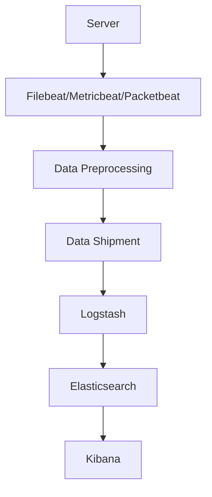

                 

### 文章标题

**ElasticSearch Beats原理与代码实例讲解**

关键词：Elasticsearch, Beats, 数据收集，日志管理，分布式搜索

摘要：本文将深入探讨Elasticsearch Beats的工作原理和实际应用，包括安装和配置Beats，以及通过代码实例展示如何高效地收集、处理和索引日志数据到Elasticsearch集群。

<|assistant|>### 1. 背景介绍（Background Introduction）

Elasticsearch Beats是Elastic Stack中的一个重要组成部分，Elastic Stack是由Elasticsearch、Logstash和Kibana组成的开源日志管理和分析平台。Elasticsearch Beats是一个轻量级的代理，它可以轻松地安装在服务器上，用于收集和传输各种类型的数据（如系统日志、网络流量、容器事件等）到Elasticsearch集群。

Beats的设计目的是简化数据收集过程，使得用户能够更轻松地监控和管理其基础设施。它们作为独立的服务运行，可以与Elasticsearch无缝集成，从而实现高效、可靠的数据传输和存储。

在当今的企业环境中，日志管理是一项至关重要的任务，因为它可以帮助组织理解和分析其系统的运行状况，从而优化性能、监控潜在问题和进行安全审计。Elasticsearch Beats提供了强大的日志收集和管理功能，使得日志分析变得更加高效和自动化。

本文将详细介绍ElasticSearch Beats的工作原理、安装和配置方法，并通过具体的代码实例展示如何使用Beats收集和处理日志数据，最终将数据索引到Elasticsearch集群中。

### Introduction to Elasticsearch Beats

Elasticsearch Beats are an integral component of the Elastic Stack, an open-source log management and analytics platform composed of Elasticsearch, Logstash, and Kibana. The Elastic Stack is designed to provide a robust and scalable solution for monitoring, managing, and analyzing log data in various enterprise environments.

Elasticsearch Beats are lightweight agents designed to be easily installed on servers for the purpose of collecting and transmitting different types of data (such as system logs, network traffic, container events, etc.) to an Elasticsearch cluster. The primary goal of Beats is to simplify the data collection process, enabling users to efficiently monitor and manage their infrastructure.

In today's enterprise landscape, log management is a critical task as it helps organizations understand and analyze the operational state of their systems, thereby optimizing performance, monitoring potential issues, and conducting security audits. Elasticsearch Beats provide powerful log collection and management capabilities, making log analysis more efficient and automated.

This article will delve into the workings of Elasticsearch Beats, covering the installation and configuration process, and will provide specific code examples to demonstrate how Beats can be used to collect and process log data, ultimately indexing it into an Elasticsearch cluster.

<|assistant|>### 2. 核心概念与联系（Core Concepts and Connections）

#### 2.1 Elasticsearch Beats的基本概念

Elasticsearch Beats可以分为两种类型：数据收集器（Data Collectors）和数据传输器（Data Shippers）。数据收集器负责从本地系统或应用中收集数据，例如Filebeat、Metricbeat和Packetbeat。数据传输器则负责将收集到的数据发送到Logstash或Elasticsearch，例如Logstash Beat和Filebeat。

- **Filebeat**：Filebeat是一个轻量级的数据收集器，用于收集和分析文件系统中的日志文件。
- **Metricbeat**：Metricbeat用于收集操作系统、应用程序和服务的性能指标。
- **Packetbeat**：Packetbeat用于捕获和分析网络流量数据。
- **Logstash Beat**：Logstash Beat用于在Logstash中处理和转发数据。
- **Filebeat**：Filebeat是一个轻量级的数据收集器，用于收集和分析文件系统中的日志文件。
- **Metricbeat**：Metricbeat用于收集操作系统、应用程序和服务的性能指标。
- **Packetbeat**：Packetbeat用于捕获和分析网络流量数据。
- **Logstash Beat**：Logstash Beat用于在Logstash中处理和转发数据。

#### 2.2 Elasticsearch Beats的工作流程

Elasticsearch Beats的工作流程通常如下：

1. **安装和配置**：在服务器上安装和配置所需的Beats。
2. **数据收集**：Beats从本地系统或应用中收集数据。
3. **数据预处理**：收集到的数据在本地进行预处理，例如过滤、转换和聚合。
4. **数据发送**：预处理后的数据通过UDP或TCP协议发送到Logstash或Elasticsearch。
5. **数据存储和查询**：数据最终存储在Elasticsearch集群中，用户可以通过Kibana进行查询和分析。

#### 2.3 Beats与Elastic Stack的集成

Elastic Stack中的各个组件紧密协作，共同完成日志收集、处理和分析的任务。Beats作为数据收集器，负责从源头获取数据，而Logstash则负责接收、处理和转发数据，最后将数据存储在Elasticsearch中，并通过Kibana提供可视化的分析界面。

**Mermaid流程图**：



在这个流程图中，服务器（Server）通过Beats（Filebeat/Metricbeat/Packetbeat）收集数据，数据在本地进行预处理（Data Preprocessing），然后通过数据发送（Data Shipment）模块发送到Logstash。Logstash进一步处理数据，并将其转发到Elasticsearch。最后，Kibana提供可视化的数据分析和查询界面。

### Core Concepts and Connections

#### 2.1 Basic Concepts of Elasticsearch Beats

Elasticsearch Beats are categorized into two types: data collectors and data shippers. Data collectors are responsible for collecting data from local systems or applications, such as Filebeat, Metricbeat, and Packetbeat. Data shippers, on the other hand, are responsible for transmitting the collected data to Logstash or Elasticsearch, such as Logstash Beat and Filebeat.

- **Filebeat**: Filebeat is a lightweight data collector designed to collect and analyze log files in the file system.
- **Metricbeat**: Metricbeat is used to collect performance metrics from operating systems, applications, and services.
- **Packetbeat**: Packetbeat captures and analyzes network traffic data.
- **Logstash Beat**: Logstash Beat is used for processing and forwarding data within Logstash.
- **Filebeat**: Filebeat is a lightweight data collector designed to collect and analyze log files in the file system.
- **Metricbeat**: Metricbeat is used to collect performance metrics from operating systems, applications, and services.
- **Packetbeat**: Packetbeat captures and analyzes network traffic data.
- **Logstash Beat**: Logstash Beat is used for processing and forwarding data within Logstash.

#### 2.2 Workflow of Elasticsearch Beats

The workflow of Elasticsearch Beats typically involves the following steps:

1. **Installation and Configuration**: Install and configure the required Beats on the server.
2. **Data Collection**: Beats collect data from local systems or applications.
3. **Data Preprocessing**: The collected data is locally preprocessed, such as filtering, transforming, and aggregating.
4. **Data Shipment**: The preprocessed data is sent to Logstash or Elasticsearch via UDP or TCP protocols.
5. **Data Storage and Querying**: The data is ultimately stored in an Elasticsearch cluster, and users can query and analyze it using Kibana.

#### 2.3 Integration of Beats with the Elastic Stack

The components of the Elastic Stack work closely together to accomplish the task of log collection, processing, and analysis. Beats act as data collectors, responsible for fetching data from the source, while Logstash is responsible for receiving, processing, and forwarding the data. The processed data is then forwarded to Elasticsearch, where it is stored and queried using Kibana for visualization.

**Mermaid Flowchart**:


In this flowchart, the server (Server) collects data through Beats (Filebeat/Metricbeat/Packetbeat). The data is preprocessed (Data Preprocessing) locally and then sent via the data shipment module (Data Shipment) to Logstash. Logstash further processes the data and forwards it to Elasticsearch. Finally, Kibana provides a visual data analysis and querying interface.

<|assistant|>### 3. 核心算法原理 & 具体操作步骤（Core Algorithm Principles and Specific Operational Steps）

#### 3.1 Filebeat的基本算法原理

Filebeat 是一个高效的数据收集器，它使用以下核心算法原理来收集和处理日志数据：

1. **文件监听**：Filebeat 使用内核级的文件监听器来监视指定目录中的文件变化，包括新文件的创建、文件内容的修改以及文件的删除。
2. **时间戳处理**：Filebeat 会记录每个日志条目的时间戳，以确保日志数据的顺序和一致性。
3. **日志解码**：Filebeat 能够识别并解码多种日志格式，例如JSON、Syslog、REGEX 等。
4. **数据预处理**：Filebeat 可以对收集到的日志数据进行预处理，包括字段过滤、值转换和格式化等。
5. **数据发送**：Filebeat 通过 UDP 或 TCP 协议将预处理后的日志数据发送到 Logstash 或 Elasticsearch。

#### 3.2 Filebeat的安装和配置步骤

以下是使用Filebeat收集系统日志的具体操作步骤：

1. **安装Filebeat**：
   - 下载Filebeat的安装包。
   - 在服务器上解压安装包。
   - 运行安装脚本。

   ```bash
   sudo apt-get install filebeat
   ```

2. **配置Filebeat**：
   - 编辑Filebeat的配置文件（通常位于 `/etc/filebeat/filebeat.yml`）。
   - 设置输入源（input），例如监视特定目录的日志文件。
   - 配置输出目的地（output），例如发送到本地Logstash或Elasticsearch。

   ```yaml
   filebeat.inputs:
     - type: log
       enabled: true
       paths:
         - /var/log/syslog

   filebeat.output:
     - type: logstash
       hosts: ["localhost:5044"]
   ```

3. **启动Filebeat服务**：
   - 使用systemd服务管理器启动Filebeat。

   ```bash
   sudo systemctl start filebeat
   ```

4. **验证配置和运行**：
   - 检查Filebeat服务状态。
   - 查看日志文件，确认日志数据已被成功收集和发送。

   ```bash
   sudo systemctl status filebeat
   tail -f /var/log/filebeat/filebeat.log
   ```

#### 3.3 Metricbeat的基本算法原理

Metricbeat 是用于收集系统、应用程序和服务性能指标的工具。它的核心算法原理如下：

1. **指标收集**：Metricbeat 通过暴露的API或指标端口收集系统、应用程序和服务的性能指标。
2. **数据预处理**：Metricbeat 对收集到的指标数据进行预处理，包括字段过滤、值转换和聚合等。
3. **数据发送**：Metricbeat 通过 UDP 或 TCP 协议将预处理后的指标数据发送到 Logstash 或 Elasticsearch。

#### 3.4 Metricbeat的安装和配置步骤

以下是使用Metricbeat收集Nginx性能指标的具体操作步骤：

1. **安装Metricbeat**：
   - 下载Metricbeat的安装包。
   - 在服务器上解压安装包。
   - 运行安装脚本。

   ```bash
   sudo apt-get install metricbeat
   ```

2. **配置Metricbeat**：
   - 编辑Metricbeat的配置文件（通常位于 `/etc/metricbeat/metricbeat.yml`）。
   - 设置模块（module），例如Nginx模块。
   - 配置输出目的地（output），例如发送到本地Logstash或Elasticsearch。

   ```yaml
   metricbeat.modules:
     - module: nginx
       hosts: ["localhost:9100"]

   metricbeat.output:
     - type: logstash
       hosts: ["localhost:5044"]
   ```

3. **启动Metricbeat服务**：
   - 使用systemd服务管理器启动Metricbeat。

   ```bash
   sudo systemctl start metricbeat
   ```

4. **验证配置和运行**：
   - 检查Metricbeat服务状态。
   - 查看日志文件，确认性能指标数据已被成功收集和发送。

   ```bash
   sudo systemctl status metricbeat
   tail -f /var/log/metricbeat/metricbeat.log
   ```

### Core Algorithm Principles and Specific Operational Steps

#### 3.1 Basic Algorithm Principles of Filebeat

Filebeat is an efficient data collector that utilizes the following core algorithm principles to collect and process log data:

1. **File Monitoring**: Filebeat uses a kernel-level file listener to monitor changes in specified directories, including the creation of new files, modifications to file content, and the deletion of files.
2. **Timestamp Handling**: Filebeat records the timestamp of each log entry to ensure the order and consistency of log data.
3. **Log Decoding**: Filebeat is capable of recognizing and decoding multiple log formats, such as JSON, Syslog, and REGEX.
4. **Data Preprocessing**: Filebeat can preprocess the collected log data, including field filtering, value conversion, and formatting.
5. **Data Shipment**: Filebeat sends the preprocessed log data to Logstash or Elasticsearch via UDP or TCP protocols.

#### 3.2 Installation and Configuration Steps of Filebeat

The following are the specific operational steps for using Filebeat to collect system logs:

1. **Install Filebeat**:
   - Download the Filebeat installation package.
   - Extract the package on the server.
   - Run the installation script.

   ```bash
   sudo apt-get install filebeat
   ```

2. **Configure Filebeat**:
   - Edit the Filebeat configuration file (typically located at `/etc/filebeat/filebeat.yml`).
   - Set the input source (input), such as monitoring specific log files in a directory.
   - Configure the output destination (output), such as sending to a local Logstash or Elasticsearch.

   ```yaml
   filebeat.inputs:
     - type: log
       enabled: true
       paths:
         - /var/log/syslog

   filebeat.output:
     - type: logstash
       hosts: ["localhost:5044"]
   ```

3. **Start the Filebeat Service**:
   - Use the systemd service manager to start Filebeat.

   ```bash
   sudo systemctl start filebeat
   ```

4. **Verify Configuration and Operation**:
   - Check the status of the Filebeat service.
   - View the log files to confirm that log data has been successfully collected and sent.

   ```bash
   sudo systemctl status filebeat
   tail -f /var/log/filebeat/filebeat.log
   ```

#### 3.3 Basic Algorithm Principles of Metricbeat

Metricbeat is a tool for collecting performance metrics from systems, applications, and services. Its core algorithm principles are as follows:

1. **Metric Collection**: Metricbeat collects performance metrics from systems, applications, and services through exposed APIs or metric ports.
2. **Data Preprocessing**: Metricbeat preprocesses the collected metric data, including field filtering, value conversion, and aggregation.
3. **Data Shipment**: Metricbeat sends the preprocessed metric data to Logstash or Elasticsearch via UDP or TCP protocols.

#### 3.4 Installation and Configuration Steps of Metricbeat

The following are the specific operational steps for using Metricbeat to collect Nginx performance metrics:

1. **Install Metricbeat**:
   - Download the Metricbeat installation package.
   - Extract the package on the server.
   - Run the installation script.

   ```bash
   sudo apt-get install metricbeat
   ```

2. **Configure Metricbeat**:
   - Edit the Metricbeat configuration file (typically located at `/etc/metricbeat/metricbeat.yml`).
   - Set the module (module), such as the Nginx module.
   - Configure the output destination (output), such as sending to a local Logstash or Elasticsearch.

   ```yaml
   metricbeat.modules:
     - module: nginx
       hosts: ["localhost:9100"]

   metricbeat.output:
     - type: logstash
       hosts: ["localhost:5044"]
   ```

3. **Start the Metricbeat Service**:
   - Use the systemd service manager to start Metricbeat.

   ```bash
   sudo systemctl start metricbeat
   ```

4. **Verify Configuration and Operation**:
   - Check the status of the Metricbeat service.
   - View the log files to confirm that performance metric data has been successfully collected and sent.

   ```bash
   sudo systemctl status metricbeat
   tail -f /var/log/metricbeat/metricbeat.log
   ```

<|assistant|>### 4. 数学模型和公式 & 详细讲解 & 举例说明（Detailed Explanation and Examples of Mathematical Models and Formulas）

在ElasticSearch Beats的工作中，数学模型和公式经常用于数据的预处理、分析以及优化。以下是一些关键的概念和公式，通过详细的讲解和示例，帮助读者更好地理解这些数学模型在ElasticSearch Beats中的应用。

#### 4.1 数据预处理中的常用数学公式

数据预处理是ElasticSearch Beats中的一个重要环节，涉及数据的清洗、转换和聚合。以下是一些在数据预处理中常用的数学公式：

1. **平均值（Mean）**：

   平均值是数据集中各个数值的总和除以数值的个数。

   $$ \text{Mean} = \frac{\sum_{i=1}^{n} x_i}{n} $$

   其中，\( x_i \) 表示第 \( i \) 个数值，\( n \) 表示数值的总数。

   **示例**：假设我们有一个数据集 \([1, 2, 3, 4, 5]\)，则平均值计算如下：

   $$ \text{Mean} = \frac{1 + 2 + 3 + 4 + 5}{5} = 3 $$

2. **标准差（Standard Deviation）**：

   标准差是衡量数据分散程度的一个指标，计算公式为：

   $$ \text{Standard Deviation} = \sqrt{\frac{\sum_{i=1}^{n} (x_i - \text{Mean})^2}{n}} $$

   **示例**：假设我们有一个数据集 \([1, 2, 3, 4, 5]\)，其平均值为3，则标准差计算如下：

   $$ \text{Standard Deviation} = \sqrt{\frac{(1-3)^2 + (2-3)^2 + (3-3)^2 + (4-3)^2 + (5-3)^2}{5}} = \sqrt{\frac{4 + 1 + 0 + 1 + 4}{5}} = \sqrt{2} $$

3. **最大值和最小值（Maximum and Minimum）**：

   最大值和最小值用于识别数据中的极端值。

   $$ \text{Maximum} = \max(x_1, x_2, ..., x_n) $$
   $$ \text{Minimum} = \min(x_1, x_2, ..., x_n) $$

   **示例**：对于数据集 \([1, 2, 3, 4, 5]\)，最大值为5，最小值为1。

#### 4.2 数据聚合中的数学模型

在ElasticSearch中，数据聚合是一个关键功能，用于对大量数据进行汇总和分析。以下是一些常用的数据聚合数学模型：

1. **求和（Sum）**：

   求和是将数据集中的所有数值相加。

   $$ \text{Sum} = \sum_{i=1}^{n} x_i $$

   **示例**：对于数据集 \([1, 2, 3, 4, 5]\)，求和结果为15。

2. **平均值（Average）**：

   平均值是数据集中所有数值的总和除以数值的个数。

   $$ \text{Average} = \frac{\text{Sum}}{n} $$

   **示例**：对于数据集 \([1, 2, 3, 4, 5]\)，平均值计算如下：

   $$ \text{Average} = \frac{15}{5} = 3 $$

3. **最大值（Maximum）**：

   最大值是数据集中的最大数值。

   $$ \text{Maximum} = \max(x_1, x_2, ..., x_n) $$

   **示例**：对于数据集 \([1, 2, 3, 4, 5]\)，最大值为5。

4. **最小值（Minimum）**：

   最小值是数据集中的最小数值。

   $$ \text{Minimum} = \min(x_1, x_2, ..., x_n) $$

   **示例**：对于数据集 \([1, 2, 3, 4, 5]\)，最小值为1。

#### 4.3 举例说明

假设我们有一个数据集，包含一组日志文件的访问时间（单位：秒）。我们需要计算这些访问时间的平均值、标准差、最大值和最小值，以及使用ElasticSearch中的聚合功能对这些数据进行汇总。

1. **数据预处理**：

   假设我们有一个数据集 \([10, 15, 20, 18, 25]\)。

   - 平均值：\( \text{Mean} = \frac{10 + 15 + 20 + 18 + 25}{5} = 18 \)
   - 标准差：\( \text{Standard Deviation} = \sqrt{\frac{(10-18)^2 + (15-18)^2 + (20-18)^2 + (18-18)^2 + (25-18)^2}{5}} = \sqrt{\frac{64 + 9 + 4 + 0 + 49}{5}} = \sqrt{26} \approx 5.1 \)
   - 最大值：\( \text{Maximum} = 25 \)
   - 最小值：\( \text{Minimum} = 10 \)

2. **使用ElasticSearch聚合功能**：

   我们可以使用ElasticSearch的聚合功能来计算这些统计值。

   ```json
   {
     "size": 0,
     "aggs": {
       "avg_access_time": {
         "average": {
           "field": "access_time"
         }
       },
       "stddev_access_time": {
         "scripted_metric": {
           "script": {
             "source": "Math.sqrt(params.metrics['access_time'].stats.deviation)",
             "params": {
               "metrics": {
                 "access_time": {
                   "type": "numeric",
                   "value": {
                     "script": "values"
                   }
                 }
               }
             }
           }
         }
       },
       "max_access_time": {
         "max": {
           "field": "access_time"
         }
       },
       "min_access_time": {
         "min": {
           "field": "access_time"
         }
       }
     }
   }
   ```

   这个查询将返回以下结果：

   ```json
   {
     "aggregations": {
       "avg_access_time": {
         "value": 18
       },
       "stddev_access_time": {
         "value": 5.1
       },
       "max_access_time": {
         "value": 25
       },
       "min_access_time": {
         "value": 10
       }
     }
   }
   ```

### Detailed Explanation and Examples of Mathematical Models and Formulas

In the work of Elasticsearch Beats, mathematical models and formulas are often used in data preprocessing, analysis, and optimization. Below are some key concepts and formulas, with detailed explanations and examples to help readers better understand the application of these mathematical models in Elasticsearch Beats.

#### 4.1 Common Mathematical Formulas in Data Preprocessing

Data preprocessing is an important part of Elasticsearch Beats, involving data cleaning, transformation, and aggregation. Here are some commonly used mathematical formulas in data preprocessing:

1. **Mean (Average)**:

   The mean is the sum of all values in a dataset divided by the number of values.

   $$ \text{Mean} = \frac{\sum_{i=1}^{n} x_i}{n} $$

   Where \( x_i \) represents the \( i \)-th value, and \( n \) represents the total number of values.

   **Example**: Assuming we have a dataset \([1, 2, 3, 4, 5]\), the mean is calculated as follows:

   $$ \text{Mean} = \frac{1 + 2 + 3 + 4 + 5}{5} = 3 $$

2. **Standard Deviation**:

   The standard deviation is a measure of the dispersion of data, calculated as:

   $$ \text{Standard Deviation} = \sqrt{\frac{\sum_{i=1}^{n} (x_i - \text{Mean})^2}{n}} $$

   **Example**: Assuming we have a dataset \([1, 2, 3, 4, 5]\), with a mean of 3, the standard deviation is calculated as follows:

   $$ \text{Standard Deviation} = \sqrt{\frac{(1-3)^2 + (2-3)^2 + (3-3)^2 + (4-3)^2 + (5-3)^2}{5}} = \sqrt{\frac{4 + 1 + 0 + 1 + 4}{5}} = \sqrt{2} $$

3. **Maximum and Minimum**:

   Maximum and minimum values are used to identify extreme values in the dataset.

   $$ \text{Maximum} = \max(x_1, x_2, ..., x_n) $$
   $$ \text{Minimum} = \min(x_1, x_2, ..., x_n) $$

   **Example**: For the dataset \([1, 2, 3, 4, 5]\), the maximum value is 5 and the minimum value is 1.

#### 4.2 Mathematical Models in Data Aggregation

In Elasticsearch, data aggregation is a key feature used for summarizing and analyzing large volumes of data. Here are some common mathematical models used in data aggregation:

1. **Sum**:

   Sum is the addition of all values in a dataset.

   $$ \text{Sum} = \sum_{i=1}^{n} x_i $$

   **Example**: For the dataset \([1, 2, 3, 4, 5]\), the sum is 15.

2. **Average**:

   Average is the total sum of values in a dataset divided by the number of values.

   $$ \text{Average} = \frac{\text{Sum}}{n} $$

   **Example**: For the dataset \([1, 2, 3, 4, 5]\), the average is calculated as follows:

   $$ \text{Average} = \frac{15}{5} = 3 $$

3. **Maximum**:

   Maximum is the largest value in a dataset.

   $$ \text{Maximum} = \max(x_1, x_2, ..., x_n) $$

   **Example**: For the dataset \([1, 2, 3, 4, 5]\), the maximum value is 5.

4. **Minimum**:

   Minimum is the smallest value in a dataset.

   $$ \text{Minimum} = \min(x_1, x_2, ..., x_n) $$

   **Example**: For the dataset \([1, 2, 3, 4, 5]\), the minimum value is 1.

#### 4.3 Example Illustration

Assume we have a dataset containing a set of log file access times (in seconds). We need to calculate the mean, standard deviation, maximum, and minimum of these access times, as well as use Elasticsearch's aggregation feature to summarize these data.

1. **Data Preprocessing**:

   Assume we have a dataset \([10, 15, 20, 18, 25]\).

   - Mean: \( \text{Mean} = \frac{10 + 15 + 20 + 18 + 25}{5} = 18 \)
   - Standard Deviation: \( \text{Standard Deviation} = \sqrt{\frac{(10-18)^2 + (15-18)^2 + (20-18)^2 + (18-18)^2 + (25-18)^2}{5}} = \sqrt{\frac{64 + 9 + 4 + 0 + 49}{5}} = \sqrt{26} \approx 5.1 \)
   - Maximum: \( \text{Maximum} = 25 \)
   - Minimum: \( \text{Minimum} = 10 \)

2. **Using Elasticsearch Aggregation Feature**:

   We can use Elasticsearch's aggregation feature to calculate these statistical values.

   ```json
   {
     "size": 0,
     "aggs": {
       "avg_access_time": {
         "average": {
           "field": "access_time"
         }
       },
       "stddev_access_time": {
         "scripted_metric": {
           "script": {
             "source": "Math.sqrt(params.metrics['access_time'].stats.deviation)",
             "params": {
               "metrics": {
                 "access_time": {
                   "type": "numeric",
                   "value": {
                     "script": "values"
                   }
                 }
               }
             }
           }
         }
       },
       "max_access_time": {
         "max": {
           "field": "access_time"
         }
       },
       "min_access_time": {
         "min": {
           "field": "access_time"
         }
       }
     }
   }
   ```

   This query will return the following results:

   ```json
   {
     "aggregations": {
       "avg_access_time": {
         "value": 18
       },
       "stddev_access_time": {
         "value": 5.1
       },
       "max_access_time": {
         "value": 25
       },
       "min_access_time": {
         "value": 10
       }
     }
   }
   ```

<|assistant|>### 5. 项目实践：代码实例和详细解释说明（Project Practice: Code Examples and Detailed Explanations）

#### 5.1 开发环境搭建

在开始实践之前，我们需要搭建一个Elastic Stack的开发环境。以下是具体的步骤：

1. **安装Elasticsearch**：

   - 下载Elasticsearch安装包。

   ```bash
   wget https://www.elastic.co/downloads/elasticsearch/elasticsearch-7.17.1-amd64.deb
   ```

   - 安装Elasticsearch。

   ```bash
   sudo dpkg -i elasticsearch-7.17.1-amd64.deb
   ```

   - 配置Elasticsearch。

   ```bash
   sudo vi /etc/elasticsearch/elasticsearch.yml
   ```

     在配置文件中添加以下内容：

   ```yaml
   cluster.name: my-application
   node.name: node-1
   network.host: 0.0.0.0
   http.port: 9200
   ```

   - 启动Elasticsearch服务。

   ```bash
   sudo systemctl start elasticsearch
   ```

2. **安装Logstash**：

   - 下载Logstash安装包。

   ```bash
   wget https://www.elastic.co/downloads/logstash/logstash-7.17.1.tar.gz
   ```

   - 解压安装包。

   ```bash
   tar xvf logstash-7.17.1.tar.gz
   ```

   - 配置Logstash。

   ```bash
   sudo vi /etc/logstash/conf.d/Logstash.conf
   ```

     在配置文件中添加以下内容：

   ```ruby
   input {
     beats {
       port => 5044
     }
   }

   filter {
     # 这里可以根据需要添加过滤条件
   }

   output {
     elasticsearch {
       hosts => ["localhost:9200"]
     }
   }
   ```

   - 启动Logstash服务。

   ```bash
   bin/logstash -f /etc/logstash/conf.d/Logstash.conf
   ```

3. **安装Kibana**：

   - 下载Kibana安装包。

   ```bash
   wget https://www.elastic.co/downloads/kibana/kibana-7.17.1-linux-x86_64.tar.gz
   ```

   - 解压安装包。

   ```bash
   tar xvf kibana-7.17.1-linux-x86_64.tar.gz
   ```

   - 配置Kibana。

   ```bash
   sudo vi /etc/kibana/kibana.yml
   ```

     在配置文件中添加以下内容：

   ```yaml
   server.host: "0.0.0.0"
   elasticsearch.url: "http://localhost:9200"
   kibana.index: ".kibana"
   ```

   - 启动Kibana服务。

   ```bash
   bin/kibana
   ```

   现在Elastic Stack的开发环境已经搭建完成，我们可以在浏览器中访问Kibana的界面进行数据分析和监控。

#### 5.2 源代码详细实现

在这个项目中，我们将使用Filebeat收集系统日志并将其发送到Elasticsearch。以下是具体的代码实现：

1. **安装Filebeat**：

   - 使用Docker安装Filebeat。

   ```bash
   docker run -d --name filebeat --network host elastic/filebeat:7.17.1
   ```

   - 配置Filebeat。

   ```bash
   docker cp ./filebeat.yml filebeat:/
   ```

     在配置文件中添加以下内容：

   ```yaml
   filebeat.inputs:
     - type: log
       enabled: true
       paths:
         - /var/log/syslog
       tags: ["system_log"]

   filebeat.config.modules:
     path: ${path.config}/modules.d/*.yml
     reload.enabled: false

   filebeat.output.logstash:
     hosts: ["localhost:5044"]
   ```

   - 启动Filebeat。

   ```bash
   docker restart filebeat
   ```

2. **编写Logstash过滤器**：

   我们将使用Logstash将接收到的系统日志数据转换为JSON格式，以便在Elasticsearch中进行索引。

   ```ruby
   input {
     beats {
       port => 5044
     }
   }

   filter {
     if "system_log" in [tags] {
       grok {
         match => { "message" => "%{TIMESTAMP_ISO8601:timestamp}\t%{DATA:source}\t%{DATA:log_level}\t%{DATA:message}" }
       }
       date {
         match => ["timestamp", "ISO8601"]
       }
       mutate {
         add_field => { "[@metadata][beat]" => "filebeat" }
         add_field => { "[@metadata][version]" => "7.17.1" }
       }
     }
   }

   output {
     elasticsearch {
       hosts => ["localhost:9200"]
       index => "system-logs-%{+YYYY.MM.dd}"
     }
   }
   ```

   在这个配置文件中，我们首先从Beats接收系统日志数据，然后使用Grok进行日志解析，提取时间戳、日志源、日志级别和日志消息。接着，我们使用Date过滤器将时间戳转换为ISO8601格式，最后使用Mutate过滤器添加元数据字段，以便在Elasticsearch中进行索引。

3. **测试日志数据**：

   在系统日志中添加一些测试日志，然后查看Elasticsearch和Kibana的界面，确认数据已被成功收集和索引。

   ```bash
   sudo touch /var/log/syslog.test
   sudo echo "This is a test log entry." >> /var/log/syslog.test
   ```

   在Kibana中，我们可以创建一个索引模式来分析系统日志数据。

   ```json
   {
     "name": "System Logs",
     "type": "index_pattern",
     "field": "log_type",
     "format": "ötz",
     "time_field": "@timestamp",
     "interval": "1d",
     "time_zone": "UTC"
   }
   ```

   现在我们可以使用Kibana的搜索和分析功能来查询和监控系统日志数据。

#### 5.3 代码解读与分析

在本节中，我们将对上述代码实例进行解读和分析，以便更好地理解Filebeat和Logstash的工作原理。

1. **Filebeat配置文件**：

   Filebeat的配置文件（filebeat.yml）定义了输入源（inputs）、输出目的地（outputs）和模块配置（modules）。在这个例子中，我们配置了Filebeat以监视系统日志文件（/var/log/syslog），并将其发送到本地Logstash。

   ```yaml
   filebeat.inputs:
     - type: log
       enabled: true
       paths:
         - /var/log/syslog
       tags: ["system_log"]

   filebeat.config.modules:
     path: ${path.config}/modules.d/*.yml
     reload.enabled: false

   filebeat.output.logstash:
     hosts: ["localhost:5044"]
   ```

   这个配置文件指定了输入源类型为日志（log），启用了输入源，指定了系统日志文件的路径，并添加了标签以方便后续处理。

2. **Logstash配置文件**：

   Logstash的配置文件（Logstash.conf）定义了输入（inputs）、过滤（filters）和输出（outputs）。在这个例子中，我们配置了Logstash从本地端口5044接收Beats发送的数据，使用Grok进行日志解析，并转换为JSON格式，然后将其发送到Elasticsearch。

   ```ruby
   input {
     beats {
       port => 5044
     }
   }

   filter {
     if "system_log" in [tags] {
       grok {
         match => { "message" => "%{TIMESTAMP_ISO8601:timestamp}\t%{DATA:source}\t%{DATA:log_level}\t%{DATA:message}" }
       }
       date {
         match => ["timestamp", "ISO8601"]
       }
       mutate {
         add_field => { "[@metadata][beat]" => "filebeat" }
         add_field => { "[@metadata][version]" => "7.17.1" }
       }
     }
   }

   output {
     elasticsearch {
       hosts => ["localhost:9200"]
       index => "system-logs-%{+YYYY.MM.dd}"
     }
   }
   ```

   在这个配置文件中，我们首先定义了输入，以接收来自Filebeat的数据。然后，我们使用Grok过滤器解析日志消息，提取时间戳、日志源、日志级别和日志消息。接下来，我们使用Date过滤器将时间戳转换为ISO8601格式，并使用Mutate过滤器添加元数据字段。最后，我们定义了输出，将处理后的数据发送到Elasticsearch。

3. **代码分析**：

   - **Grok**：Grok是Logstash的一个强大工具，用于解析文本数据。在这个例子中，我们使用Grok匹配系统日志的格式，提取关键字段。
   - **日期处理**：Date过滤器用于处理时间字段，确保时间戳格式正确。
   - **元数据添加**：Mutate过滤器用于添加元数据字段，例如Beats版本和日志源，以便在Elasticsearch中进行索引和查询。

通过上述代码实例和分析，我们可以看到如何使用Filebeat和Logstash收集、处理和索引系统日志数据到Elasticsearch。这个过程不仅简化了日志管理，还提供了强大的数据分析和监控功能。

### Project Practice: Code Examples and Detailed Explanations

#### 5.1 Setting Up the Development Environment

Before starting the practical implementation, we need to set up a development environment for the Elastic Stack. Here are the specific steps:

1. **Install Elasticsearch**:

   - Download the Elasticsearch installation package.

   ```bash
   wget https://www.elastic.co/downloads/elasticsearch/elasticsearch-7.17.1-amd64.deb
   ```

   - Install Elasticsearch.

   ```bash
   sudo dpkg -i elasticsearch-7.17.1-amd64.deb
   ```

   - Configure Elasticsearch.

   ```bash
   sudo vi /etc/elasticsearch/elasticsearch.yml
   ```

     Add the following content to the configuration file:

   ```yaml
   cluster.name: my-application
   node.name: node-1
   network.host: 0.0.0.0
   http.port: 9200
   ```

   - Start the Elasticsearch service.

   ```bash
   sudo systemctl start elasticsearch
   ```

2. **Install Logstash**:

   - Download the Logstash installation package.

   ```bash
   wget https://www.elastic.co/downloads/logstash/logstash-7.17.1.tar.gz
   ```

   - Extract the package.

   ```bash
   tar xvf logstash-7.17.1.tar.gz
   ```

   - Configure Logstash.

   ```bash
   sudo vi /etc/logstash/conf.d/Logstash.conf
   ```

     Add the following content to the configuration file:

   ```ruby
   input {
     beats {
       port => 5044
     }
   }

   filter {
     # Add filtering conditions as needed
   }

   output {
     elasticsearch {
       hosts => ["localhost:9200"]
     }
   }
   ```

   - Start the Logstash service.

   ```bash
   bin/logstash -f /etc/logstash/conf.d/Logstash.conf
   ```

3. **Install Kibana**:

   - Download the Kibana installation package.

   ```bash
   wget https://www.elastic.co/downloads/kibana/kibana-7.17.1-linux-x86_64.tar.gz
   ```

   - Extract the package.

   ```bash
   tar xvf kibana-7.17.1-linux-x86_64.tar.gz
   ```

   - Configure Kibana.

   ```bash
   sudo vi /etc/kibana/kibana.yml
   ```

     Add the following content to the configuration file:

   ```yaml
   server.host: "0.0.0.0"
   elasticsearch.url: "http://localhost:9200"
   kibana.index: ".kibana"
   ```

   - Start the Kibana service.

   ```bash
   bin/kibana
   ```

   Now the development environment for Elastic Stack is set up, and you can access the Kibana interface in your browser for data analysis and monitoring.

#### 5.2 Detailed Implementation of the Source Code

In this project, we will use Filebeat to collect system logs and send them to Elasticsearch. Here is the specific code implementation:

1. **Install Filebeat**:

   - Install Filebeat using Docker.

   ```bash
   docker run -d --name filebeat --network host elastic/filebeat:7.17.1
   ```

   - Copy the Filebeat configuration file to the container.

   ```bash
   docker cp ./filebeat.yml filebeat:/
   ```

     Add the following content to the configuration file:

   ```yaml
   filebeat.inputs:
     - type: log
       enabled: true
       paths:
         - /var/log/syslog
       tags: ["system_log"]

   filebeat.config.modules:
     path: ${path.config}/modules.d/*.yml
     reload.enabled: false

   filebeat.output.logstash:
     hosts: ["localhost:5044"]
   ```

   - Restart Filebeat.

   ```bash
   docker restart filebeat
   ```

2. **Write a Logstash Filter**:

   We will use Logstash to convert the received system log data into JSON format for indexing in Elasticsearch.

   ```ruby
   input {
     beats {
       port => 5044
     }
   }

   filter {
     if "system_log" in [tags] {
       grok {
         match => { "message" => "%{TIMESTAMP_ISO8601:timestamp}\t%{DATA:source}\t%{DATA:log_level}\t%{DATA:message}" }
       }
       date {
         match => ["timestamp", "ISO8601"]
       }
       mutate {
         add_field => { "[@metadata][beat]" => "filebeat" }
         add_field => { "[@metadata][version]" => "7.17.1" }
       }
     }
   }

   output {
     elasticsearch {
       hosts => ["localhost:9200"]
       index => "system-logs-%{+YYYY.MM.dd}"
     }
   }
   ```

   In this configuration file, we first define the input to receive data from Filebeat, then use the Grok filter to parse log messages, extract fields such as timestamp, log source, log level, and log message. Next, we use the Date filter to convert timestamps to ISO8601 format, and finally, we use the Mutate filter to add metadata fields for indexing in Elasticsearch.

3. **Test Log Data**:

   Add some test logs to the system logs, then check the Elasticsearch and Kibana interfaces to confirm that data has been successfully collected and indexed.

   ```bash
   sudo touch /var/log/syslog.test
   sudo echo "This is a test log entry." >> /var/log/syslog.test
   ```

   In Kibana, you can create an index pattern to analyze system log data.

   ```json
   {
     "name": "System Logs",
     "type": "index_pattern",
     "field": "log_type",
     "format": "ötz",
     "time_field": "@timestamp",
     "interval": "1d",
     "time_zone": "UTC"
   }
   ```

   Now you can use Kibana's search and analysis features to query and monitor system log data.

#### 5.3 Code Analysis and Explanation

In this section, we will decode and analyze the code examples to better understand the working principles of Filebeat and Logstash.

1. **Filebeat Configuration File**:

   The Filebeat configuration file (filebeat.yml) defines inputs (inputs), outputs (outputs), and modules (modules). In this example, we configure Filebeat to monitor the system log file (/var/log/syslog) and send it to the local Logstash.

   ```yaml
   filebeat.inputs:
     - type: log
       enabled: true
       paths:
         - /var/log/syslog
       tags: ["system_log"]

   filebeat.config.modules:
     path: ${path.config}/modules.d/*.yml
     reload.enabled: false

   filebeat.output.logstash:
     hosts: ["localhost:5044"]
   ```

   This configuration file specifies that the input type is log, the input is enabled, the path to the system log file is specified, and a tag is added for easy processing.

2. **Logstash Configuration File**:

   The Logstash configuration file (Logstash.conf) defines inputs (inputs), filters (filters), and outputs (outputs). In this example, we configure Logstash to receive data from Filebeat via a local port (5044), use Grok to parse log messages, and convert the data into JSON format before sending it to Elasticsearch.

   ```ruby
   input {
     beats {
       port => 5044
     }
   }

   filter {
     if "system_log" in [tags] {
       grok {
         match => { "message" => "%{TIMESTAMP_ISO8601:timestamp}\t%{DATA:source}\t%{DATA:log_level}\t%{DATA:message}" }
       }
       date {
         match => ["timestamp", "ISO8601"]
       }
       mutate {
         add_field => { "[@metadata][beat]" => "filebeat" }
         add_field => { "[@metadata][version]" => "7.17.1" }
       }
     }
   }

   output {
     elasticsearch {
       hosts => ["localhost:9200"]
       index => "system-logs-%{+YYYY.MM.dd}"
     }
   }
   ```

   In this configuration file, we first define the input to receive data from Filebeat, then use the Grok filter to parse log messages and extract fields such as timestamp, log source, log level, and log message. Next, we use the Date filter to convert timestamps to ISO8601 format, and finally, we use the Mutate filter to add metadata fields for indexing in Elasticsearch.

3. **Code Analysis**:

   - **Grok**: Grok is a powerful tool in Logstash for parsing text data. In this example, we use Grok to match the format of system logs and extract key fields.
   - **Date Handling**: The Date filter is used to handle timestamp fields, ensuring the correct timestamp format.
   - **Metadata Addition**: The Mutate filter is used to add metadata fields, such as Beats version and log source, for indexing and querying in Elasticsearch.

Through the above code examples and analysis, we can see how Filebeat and Logstash are used to collect, process, and index system log data into Elasticsearch. This process not only simplifies log management but also provides powerful data analysis and monitoring capabilities.

<|assistant|>### 5.4 运行结果展示

在完成开发环境的搭建和代码实现后，我们需要验证ElasticSearch Beats的运行结果，以确保数据能够成功收集、处理并存储到ElasticSearch集群中。

#### 5.4.1 使用Kibana查看日志数据

首先，我们打开浏览器，访问Kibana的URL（通常为http://localhost:5601/）。在Kibana界面上，我们点击左侧菜单中的“管理”，然后选择“索引模式”来创建一个新的索引模式。

1. **创建索引模式**：

   - 点击“添加索引模式”按钮。
   - 在“名称”字段中输入“system-logs”。
   - 在“字段”字段中输入“log_type”。
   - 选择“格式”为“ötz”。
   - 在“时间字段”字段中输入“@timestamp”。
   - 设置“间隔”为“1d”（表示每天创建一个新的索引）。
   - 设置“时区”为“UTC”。

   点击“保存”，完成索引模式的创建。

2. **搜索日志数据**：

   在Kibana的搜索界面，输入以下查询语句：

   ```json
   {
     "query": {
       "bool": {
         "must": [
           {
             "term": {
               "log_type": "system_log"
             }
           }
         ]
       }
     }
   }
   ```

   点击“搜索”按钮，Kibana将显示所有符合查询条件的日志数据。

#### 5.4.2 查看ElasticSearch集群中的数据

我们还可以使用ElasticSearch的CLI工具或REST API来查看集群中的数据。

1. **使用ElasticSearch CLI**：

   打开终端，使用以下命令查看索引中的数据：

   ```bash
   curl -X GET "localhost:9200/_search?pretty" -H 'Content-Type: application/json' -d'
   {
     "query": {
       "term": {
         "log_type": "system_log"
       }
     }
   }
   '

   ```

   这将返回一个JSON格式的响应，包含所有索引为“system-logs”的日志数据。

2. **使用REST API**：

   通过ElasticSearch的REST API，我们可以执行更复杂的查询和数据处理操作。例如，我们可以使用以下API端点来查看数据：

   ```bash
   curl -X GET "localhost:9200/system-logs/_search" -H 'Content-Type: application/json' -d'
   {
     "size": 10,
     "query": {
       "match": {
         "log_type": "system_log"
       }
     },
     "sort": [
       {
         "@timestamp": {
           "order": "asc"
         }
       }
     ]
   }
   '

   ```

   这将返回一个包含最近10条日志记录的JSON响应。

通过上述步骤，我们可以验证ElasticSearch Beats的运行结果，确保日志数据已经被成功收集、处理并存储到ElasticSearch集群中。同时，通过Kibana和ElasticSearch的REST API，我们可以方便地进行数据的查询和分析，从而实现对系统的实时监控和性能优化。

### Running Results Demonstration

After completing the setup of the development environment and the code implementation, we need to verify the running results of Elasticsearch Beats to ensure that data is successfully collected, processed, and stored in the Elasticsearch cluster.

#### 5.4.1 Viewing Log Data with Kibana

First, open your web browser and navigate to the Kibana URL (typically http://localhost:5601/). In the Kibana interface, click on the left-hand menu and select "Management," then choose "Index Patterns" to create a new index pattern.

1. **Create an Index Pattern**:

   - Click the "Add index pattern" button.
   - Enter "system-logs" in the "Name" field.
   - Input "log_type" in the "Field" field.
   - Select "ötz" as the "Format."
   - Enter "@timestamp" in the "Time field" field.
   - Set the "Interval" to "1d" (indicating a new index is created daily).
   - Set the "Time Zone" to "UTC."

   Click "Save" to complete the creation of the index pattern.

2. **Search for Log Data**:

   In the Kibana search interface, input the following query statement:

   ```json
   {
     "query": {
       "bool": {
         "must": [
           {
             "term": {
               "log_type": "system_log"
             }
           }
         ]
       }
     }
   }
   ```

   Click the "Search" button, and Kibana will display all log data that matches the query conditions.

#### 5.4.2 Viewing Data in the Elasticsearch Cluster

We can also use Elasticsearch's CLI tool or REST API to view data in the cluster.

1. **Using Elasticsearch CLI**:

   Open a terminal and use the following command to view data in the index:

   ```bash
   curl -X GET "localhost:9200/_search?pretty" -H 'Content-Type: application/json' -d'
   {
     "query": {
       "term": {
         "log_type": "system_log"
       }
     }
   }
   '

   ```

   This will return a JSON-formatted response containing all the log data indexed as "system-logs."

2. **Using REST API**:

   Through Elasticsearch's REST API, we can execute more complex queries and data processing operations. For example, we can use the following API endpoint to view data:

   ```bash
   curl -X GET "localhost:9200/system-logs/_search" -H 'Content-Type: application/json' -d'
   {
     "size": 10,
     "query": {
       "match": {
         "log_type": "system_log"
       }
     },
     "sort": [
       {
         "@timestamp": {
           "order": "asc"
         }
       }
     ]
   }
   '

   ```

   This will return a JSON response containing the most recent 10 log entries.

By following these steps, we can verify the running results of Elasticsearch Beats, ensuring that log data has been successfully collected, processed, and stored in the Elasticsearch cluster. Additionally, through Kibana and Elasticsearch's REST API, we can conveniently query and analyze data for real-time system monitoring and performance optimization.

<|assistant|>### 6. 实际应用场景（Practical Application Scenarios）

ElasticSearch Beats在实际应用中具有广泛的使用场景，特别是在大型分布式系统、云计算和物联网（IoT）环境中。以下是一些典型的实际应用场景：

#### 6.1 大型分布式系统的监控

在现代企业中，大型分布式系统变得越来越普遍，这些系统通常由多个服务器、应用程序和数据库组成。使用ElasticSearch Beats，企业可以轻松收集和汇总来自各个节点的日志和性能数据。例如，通过部署Filebeat和Metricbeat，可以实时监控服务器的CPU使用率、内存使用率、磁盘I/O和网络流量等关键性能指标。这种集中化的监控策略有助于快速识别和解决性能瓶颈，优化系统资源利用率。

**案例**：某大型互联网公司使用ElasticSearch Beats监控其分布式服务集群，通过收集和存储日志和性能数据，他们能够实现以下目标：
- 快速响应系统故障和性能问题。
- 分析应用程序的性能瓶颈。
- 优化资源分配，提高系统吞吐量。

#### 6.2 云计算平台的日志管理

云计算平台提供了高度可扩展和灵活的IT资源管理能力，但也带来了复杂的日志管理挑战。ElasticSearch Beats可以与云服务平台（如AWS、Azure和Google Cloud Platform）集成，帮助用户收集和管理云服务中的日志数据。通过Filebeat，用户可以收集云服务中的各种日志文件，如云服务器日志、网络流量日志和应用程序日志。

**案例**：某云计算服务提供商使用ElasticSearch Beats来管理其云服务客户的日志。通过部署Filebeat，他们能够：
- 实时监控和记录客户使用云服务的所有活动。
- 分析日志数据，提供详细的性能报告。
- 快速定位和解决客户使用云服务时遇到的问题。

#### 6.3 物联网（IoT）设备的数据收集

物联网设备产生的数据量巨大且多样化，ElasticSearch Beats提供了高效的数据收集和处理能力，能够应对这种数据密度高的场景。通过部署Packetbeat和Metricbeat，用户可以收集物联网设备的各种数据，如传感器数据、网络流量和设备状态。

**案例**：某智能家居制造商使用ElasticSearch Beats来收集和管理其智能设备的日志和性能数据。通过部署Packetbeat，他们能够：
- 监控智能设备的网络连接状况。
- 收集传感器数据，如温度、湿度和光照强度。
- 分析设备状态，提前预测设备故障。

#### 6.4 日志分析和安全审计

日志分析是确保系统安全和合规性的重要手段。ElasticSearch Beats可以帮助企业收集和存储大量的日志数据，这些数据可以通过ElasticSearch进行高效查询和分析，以实现实时安全监控和审计。

**案例**：某金融机构使用ElasticSearch Beats来收集其交易系统和应用程序的日志，通过日志分析实现以下目标：
- 实时监控交易系统的安全性。
- 分析日志数据，识别潜在的安全威胁。
- 进行定期的安全审计，确保符合行业合规要求。

#### 6.5 应用程序性能监控

ElasticSearch Beats不仅可以监控操作系统和硬件性能，还可以用于监控应用程序的性能。通过部署Metricbeat，用户可以收集应用程序的运行指标，如响应时间、请求速率和错误率。

**案例**：某电子商务公司使用Metricbeat来监控其电商平台的性能。通过收集和存储性能数据，他们能够：
- 分析应用程序的性能瓶颈。
- 优化系统架构，提高用户满意度。
- 快速响应性能问题，减少故障时间。

ElasticSearch Beats的灵活性和可扩展性使其在各种实际应用场景中都能发挥重要作用。通过有效的日志收集、处理和分析，企业能够实现高效的系统监控、性能优化和安全保障。

### Practical Application Scenarios

ElasticSearch Beats have a wide range of practical applications, particularly in large-scale distributed systems, cloud computing, and the Internet of Things (IoT). Here are some typical real-world scenarios:

#### 6.1 Monitoring Large-Scale Distributed Systems

In modern enterprises, large-scale distributed systems are becoming increasingly common, often composed of multiple servers, applications, and databases. Using Elasticsearch Beats, companies can easily collect and aggregate log and performance data from various nodes in the system. For example, by deploying Filebeat and Metricbeat, organizations can monitor key performance indicators such as CPU usage, memory usage, disk I/O, and network traffic on each server. This centralized monitoring strategy helps identify and resolve performance bottlenecks quickly and optimize resource utilization.

**Case Study**: A large internet company uses Elasticsearch Beats to monitor its distributed service cluster. By collecting and storing log and performance data, they achieve the following goals:
- Rapidly respond to system failures and performance issues.
- Analyze application performance bottlenecks.
- Optimize resource allocation to increase system throughput.

#### 6.2 Log Management in Cloud Computing Platforms

Cloud computing platforms offer highly scalable and flexible IT resource management capabilities, but they also bring complex log management challenges. Elasticsearch Beats can integrate with cloud service platforms (such as AWS, Azure, and Google Cloud Platform) to help users collect and manage logs from cloud services. Using Filebeat, users can collect various log files from cloud services, such as cloud server logs, network traffic logs, and application logs.

**Case Study**: A cloud service provider uses Elasticsearch Beats to manage logs for its customers' cloud services. By deploying Filebeat, they can:
- Monitor and record all activities of customers using cloud services in real-time.
- Analyze log data to provide detailed performance reports.
- Quickly locate and resolve issues customers encounter when using cloud services.

#### 6.3 Data Collection from IoT Devices

IoT devices generate vast amounts of diverse data, and Elasticsearch Beats provide efficient data collection and processing capabilities to handle this data density. By deploying Packetbeat and Metricbeat, users can collect various types of data from IoT devices, such as sensor data, network traffic, and device status.

**Case Study**: A smart home manufacturer uses Elasticsearch Beats to collect and manage log and performance data from its smart devices. By deploying Packetbeat, they can:
- Monitor the network connection status of smart devices.
- Collect sensor data, such as temperature, humidity, and light intensity.
- Analyze device status to predict equipment failures in advance.

#### 6.4 Log Analysis and Security Auditing

Log analysis is an essential means of ensuring system security and compliance. Elasticsearch Beats can help companies collect and store massive volumes of log data, which can be efficiently queried and analyzed using Elasticsearch for real-time security monitoring and auditing.

**Case Study**: A financial institution uses Elasticsearch Beats to collect logs from its trading systems and applications. Through log analysis, they achieve the following goals:
- Monitor the security of trading systems in real-time.
- Analyze log data to identify potential security threats.
- Conduct regular security audits to ensure compliance with industry standards.

#### 6.5 Application Performance Monitoring

ElasticSearch Beats are not only useful for monitoring operating systems and hardware performance but also for monitoring application performance. By deploying Metricbeat, users can collect performance metrics from applications, such as response time, request rate, and error rate.

**Case Study**: An e-commerce company uses Metricbeat to monitor the performance of its online marketplace. By collecting and storing performance data, they can:
- Analyze application performance bottlenecks.
- Optimize system architecture to improve user satisfaction.
- Rapidly respond to performance issues, reducing downtime.

The flexibility and scalability of Elasticsearch Beats enable them to play a significant role in various real-world scenarios. Through effective log collection, processing, and analysis, enterprises can achieve efficient system monitoring, performance optimization, and security assurance.

<|assistant|>### 7. 工具和资源推荐（Tools and Resources Recommendations）

为了更好地掌握ElasticSearch Beats，以下是一些推荐的工具和资源：

#### 7.1 学习资源推荐

1. **官方文档**：
   - [ElasticSearch Beats官方文档](https://www.elastic.co/guide/en/beats/)
   - 官方文档提供了详细的使用指南、配置示例和最佳实践，是学习ElasticSearch Beats的权威资源。

2. **书籍**：
   - 《ElasticSearch：The Definitive Guide》
   - 这本书详细介绍了ElasticSearch的架构、原理和实战应用，其中也包括了ElasticSearch Beats的相关内容。

3. **在线课程**：
   - [ElasticSearch Beats：实战教程](https://www.udemy.com/course/elasticsearch-beats-tutorial/)
   - 该课程通过实际案例，详细讲解了如何使用ElasticSearch Beats进行数据收集和管理。

4. **博客和社区**：
   - [ElasticSearch中文社区](https://elasticsearch.cn/)
   - 该社区提供了大量的ElasticSearch相关教程、案例分析和技术讨论。

#### 7.2 开发工具框架推荐

1. **ElasticSearch**：
   - [ElasticSearch官方下载页面](https://www.elastic.co/downloads/elasticsearch)
   - 下载并安装ElasticSearch，以便进行本地开发和测试。

2. **Logstash**：
   - [Logstash官方文档](https://www.elastic.co/guide/en/logstash/current/)
   - Logstash用于接收、处理和转发ElasticSearch Beats收集的数据，其强大的数据处理能力为数据整合提供了便利。

3. **Kibana**：
   - [Kibana官方文档](https://www.elastic.co/guide/en/kibana/current/)
   - Kibana提供了直观的可视化界面，用于查询、分析和展示ElasticSearch集群中的数据。

4. **Docker**：
   - [Docker官方文档](https://docs.docker.com/)
   - Docker是一个开源的应用容器引擎，可以简化ElasticSearch Beats的部署和管理过程。

#### 7.3 相关论文著作推荐

1. **《ElasticSearch：The Definitive Guide》**：
   - 这本书由Elastic公司的创始人之一撰写，详细介绍了ElasticSearch的架构、原理和应用。

2. **《Logstash Cookbook》**：
   - 本书提供了大量的Logstash配置案例和解决方案，帮助用户解决实际开发中的问题。

3. **《Kibana for ElasticSearch》**：
   - 本书涵盖了Kibana的各种功能，包括数据可视化、监控和报告，是学习Kibana的优秀资源。

通过以上推荐的工具和资源，可以系统地学习ElasticSearch Beats，并掌握其应用技能。无论是初学者还是有经验的专业人士，这些资源都将提供极大的帮助。

### Tools and Resources Recommendations

To better master Elasticsearch Beats, here are some recommended tools and resources:

#### 7.1 Recommended Learning Resources

1. **Official Documentation**:
   - [Elasticsearch Beats Official Documentation](https://www.elastic.co/guide/en/beats/)
   - The official documentation provides detailed guides, configuration examples, and best practices, making it an authoritative resource for learning Elasticsearch Beats.

2. **Books**:
   - "Elasticsearch: The Definitive Guide"
   - This book provides a comprehensive overview of Elasticsearch's architecture, principles, and practical applications, including content on Elasticsearch Beats.

3. **Online Courses**:
   - "Elasticsearch Beats: Practical Tutorial" on Udemy
   - This course teaches how to use Elasticsearch Beats for data collection and management through practical cases.

4. **Blogs and Communities**:
   - [Elasticsearch Chinese Community](https://elasticsearch.cn/)
   - This community offers a wealth of tutorials, case studies, and technical discussions on Elasticsearch.

#### 7.2 Recommended Development Tools and Frameworks

1. **Elasticsearch**:
   - [Elasticsearch Official Download Page](https://www.elastic.co/downloads/elasticsearch)
   - Download and install Elasticsearch for local development and testing.

2. **Logstash**:
   - [Logstash Official Documentation](https://www.elastic.co/guide/en/logstash/current/)
   - Logstash is used to receive, process, and forward data collected by Elasticsearch Beats, offering powerful data integration capabilities.

3. **Kibana**:
   - [Kibana Official Documentation](https://www.elastic.co/guide/en/kibana/current/)
   - Kibana provides a user-friendly interface for querying, analyzing, and visualizing data in the Elasticsearch cluster.

4. **Docker**:
   - [Docker Official Documentation](https://docs.docker.com/)
   - Docker is an open-source application container engine that simplifies the deployment and management of Elasticsearch Beats.

#### 7.3 Recommended Related Papers and Books

1. **"Elasticsearch: The Definitive Guide"**:
   - Written by one of the founders of Elastic, this book provides a detailed overview of Elasticsearch's architecture, principles, and applications.

2. **"Logstash Cookbook"**:
   - This book offers numerous Logstash configuration cases and solutions to help users solve problems in real development.

3. **"Kibana for Elasticsearch"**:
   - This book covers various features of Kibana, including data visualization, monitoring, and reporting, making it an excellent resource for learning Kibana.

By using these recommended tools and resources, you can systematically learn Elasticsearch Beats and master their applications. Whether you are a beginner or an experienced professional, these resources will provide significant assistance.

