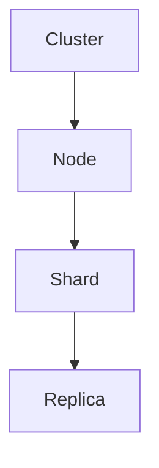

                 

### 文章标题

**ElasticSearch Shard原理与代码实例讲解**

### 关键词

- ElasticSearch
- Shard
- 分布式系统
- 数据分片
- 搜索引擎
- 持久化
- 代码实例

### 摘要

本文将深入探讨ElasticSearch中的Shard原理，从基础概念到实际操作，通过代码实例详细解析。文章旨在为读者提供对ElasticSearch分片机制的全面理解，帮助他们更好地应用这一技术于分布式搜索引擎的开发与优化。

### 目录

1. 背景介绍
2. 核心概念与联系
3. 核心算法原理 & 具体操作步骤
4. 数学模型和公式 & 详细讲解 & 举例说明
5. 项目实战：代码实际案例和详细解释说明
   5.1 开发环境搭建
   5.2 源代码详细实现和代码解读
   5.3 代码解读与分析
6. 实际应用场景
7. 工具和资源推荐
   7.1 学习资源推荐
   7.2 开发工具框架推荐
   7.3 相关论文著作推荐
8. 总结：未来发展趋势与挑战
9. 附录：常见问题与解答
10. 扩展阅读 & 参考资料

### 1. 背景介绍

#### 什么是ElasticSearch？

ElasticSearch是一个高度可扩展的分布式搜索引擎，能够实现全文检索、结构化搜索以及分析功能。它基于Lucene搜索引擎，具有优异的性能和易用性。ElasticSearch的设计目标是支持大规模数据集的实时搜索和分析，通常用于日志分析、实时分析、监控、搜索引擎等领域。

#### 分片（Shard）的重要性

随着数据量的增长，单一节点的能力往往无法满足性能需求。因此，ElasticSearch通过将索引数据切分成多个分片（Shard）来达到水平扩展的目的。每个分片可以独立地被分配到集群中的不同节点上，从而实现并行处理和负载均衡。

### 2. 核心概念与联系

#### 分片（Shard）

- 分片是ElasticSearch中索引数据的基本单元，可以独立地进行读写操作。
- 分片数可以在创建索引时指定，也可在运行时动态调整。

#### 副本（Replica）

- 副本是为了提高数据的可用性和容错性而创建的数据副本。
- 副本可以在不同的节点上保持，以防止单点故障。

#### 节点（Node）

- 节点是ElasticSearch集群中的基本单元，可以是物理机或虚拟机。
- 节点负责存储数据、处理查询以及集群的管理。

#### 集群（Cluster）

- 集群是由多个节点组成的逻辑实体，共同工作以提供分布式搜索和存储能力。
- 集群通过ElasticSearch内部机制自动分配和管理数据。

#### Mermaid 流程图



### 3. 核心算法原理 & 具体操作步骤

#### 分片策略（Shard Strategy）

分片策略决定了如何将索引数据分配到不同的分片上。ElasticSearch提供了多种分片策略，如：

- **RANGE**: 按照指定字段的范围分配数据到不同的分片。
- **HASH**: 使用文档的 `_id` 或自定义字段值的哈希值分配数据。
- **LICENSE**: 根据文档中包含的许可证类型进行分配。

#### 分片管理（Shard Management）

分片管理包括分片的创建、删除、调整等操作。具体步骤如下：

1. 创建索引时指定分片数。
2. 运行时可以通过API调整分片数。
3. 可以手动或自动创建副本。

#### Shard分配算法

ElasticSearch采用了一种称为“重平衡”（Rebalance）的算法来动态分配分片和副本。以下是其基本步骤：

1. **初始化**: 集群启动时，初始化分片分配。
2. **分配分片**: 根据集群状态和分片策略，将分片分配到不同的节点。
3. **副本复制**: 将分片副本复制到其他节点。
4. **重平衡**: 当节点加入或离开集群时，重新分配分片和副本。

### 4. 数学模型和公式 & 详细讲解 & 举例说明

#### 分片数计算

分片数的选择直接影响到集群的性能和可用性。通常，可以使用以下公式来估算分片数：

$$
\text{shards} = \left\lfloor \frac{\text{total\_docs}}{\text{max\_docs\_per\_shard}} \right\rfloor
$$

其中：

- `total_docs` 是文档总数。
- `max_docs_per_shard` 是每个分片的最大文档数。

#### 副本数计算

副本数的选择应该考虑到集群的可用性和性能需求。通常，可以使用以下公式来估算副本数：

$$
\text{replicas} = \left\lfloor \frac{\text{shards}}{\text{max\_replicas\_per\_shard}} \right\rfloor + 1
$$

其中：

- `shards` 是分片数。
- `max_replicas_per_shard` 是每个分片的最大副本数。

#### 举例说明

假设我们有100,000个文档，希望每个分片最多包含20,000个文档。根据上述公式，我们可以计算出：

$$
\text{shards} = \left\lfloor \frac{100,000}{20,000} \right\rfloor = 5
$$

$$
\text{replicas} = \left\lfloor \frac{5}{1} \right\rfloor + 1 = 2
$$

这意味着我们应该创建5个分片，每个分片有2个副本。

### 5. 项目实战：代码实际案例和详细解释说明

#### 5.1 开发环境搭建

在本节中，我们将搭建一个简单的ElasticSearch环境，以供后续的实战演示。首先，请确保您已经安装了ElasticSearch。以下是安装步骤：

1. 下载ElasticSearch：[ElasticSearch官网](https://www.elastic.co/downloads/elasticsearch)
2. 解压下载的压缩包，并启动ElasticSearch服务。
3. 打开终端，执行以下命令：

```
./bin/elasticsearch
```

确保ElasticSearch服务成功启动。

#### 5.2 源代码详细实现和代码解读

在本节中，我们将编写一个简单的Java程序，用于创建索引、添加文档和查询数据。以下是代码实现：

```java
import org.elasticsearch.action.ActionListener;
import org.elasticsearch.action.index.IndexRequest;
import org.elasticsearch.action.search.SearchResponse;
import org.elasticsearch.client.Client;
import org.elasticsearch.client.transport.TransportClient;
import org.elasticsearch.common.transport.InetSocketTransportAddress;
import org.elasticsearch.index.query.QueryBuilders;
import org.elasticsearch.search.SearchHit;

public class ElasticSearchExample {
    public static void main(String[] args) throws Exception {
        // 创建客户端
        TransportClient client = TransportClient.builder().build()
                .addTransportAddress(new InetSocketTransportAddress("localhost", 9300));

        // 创建索引
        client.admin().indices().prepareCreate("test_index").get();

        // 添加文档
        IndexRequest indexRequest = new IndexRequest("test_index", "doc", "1")
                .source("field1", "value1", "field2", "value2");
        client.index(indexRequest).addActionListener(new ActionListener() {
            @Override
            public void onResponse(Response response) {
                System.out.println("Document indexed");
            }

            @Override
            public void onFailure(Exception e) {
                e.printStackTrace();
            }
        });

        // 查询数据
        SearchResponse searchResponse = client.prepareSearch("test_index")
                .setQuery(QueryBuilders.termQuery("field1", "value1"))
                .get();
        for (SearchHit hit : searchResponse.getHits()) {
            System.out.println(hit.getSourceAsString());
        }

        // 关闭客户端
        client.close();
    }
}
```

代码解读：

1. **创建客户端**：使用`TransportClient`创建ElasticSearch客户端。
2. **创建索引**：使用`client.admin().indices().prepareCreate("test_index").get();`创建名为`test_index`的索引。
3. **添加文档**：使用`IndexRequest`添加文档，其中`source`参数指定了文档的JSON内容。
4. **查询数据**：使用`prepareSearch`方法创建查询，并使用`QueryBuilders.termQuery`执行匹配查询。
5. **关闭客户端**：使用`client.close();`关闭客户端。

#### 5.3 代码解读与分析

在本节中，我们将分析上面的Java代码，深入理解ElasticSearch的基本操作。

1. **创建客户端**：
   - 使用`TransportClient.builder().build()`创建客户端。
   - 使用`addTransportAddress`方法添加ElasticSearch服务器的地址和端口。

2. **创建索引**：
   - 使用`client.admin().indices().prepareCreate("test_index").get();`创建索引。
   - `admin()`方法用于执行管理操作，如创建、删除索引。
   - `prepareCreate("test_index")`方法准备创建名为`test_index`的索引。
   - `get()`方法执行创建操作并返回结果。

3. **添加文档**：
   - 使用`IndexRequest`类创建索引请求。
   - `source`参数指定了文档的JSON内容。
   - 使用`client.index(indexRequest).addActionListener`执行添加操作，并在操作完成后输出结果。

4. **查询数据**：
   - 使用`client.prepareSearch("test_index")`创建查询。
   - `setQuery`方法设置查询条件，这里使用`QueryBuilders.termQuery`执行匹配查询。
   - `get()`方法执行查询并返回响应。

5. **关闭客户端**：
   - 使用`client.close();`关闭客户端，释放资源。

通过这个简单的例子，我们可以看到如何使用Java程序与ElasticSearch进行交互，创建索引、添加文档和查询数据。这个过程是ElasticSearch分布式系统中常见的基本操作，也是深入理解ElasticSearch分片机制的关键。

### 6. 实际应用场景

#### 搜索引擎

ElasticSearch最常见的使用场景是构建高性能的搜索引擎。例如，网站可以使用ElasticSearch提供实时的全文搜索功能，帮助用户快速找到所需内容。

#### 日志分析

ElasticSearch可以用于集中存储和分析日志数据。通过将日志数据索引到ElasticSearch中，可以实现实时监控和故障排查。

#### 实时分析

ElasticSearch支持对大量数据进行实时分析，适用于需要实时监控业务指标或进行实时数据挖掘的场景。

#### 文件存储

ElasticSearch可以作为一个高性能的文件存储系统，支持对大量文件进行索引和检索。

### 7. 工具和资源推荐

#### 学习资源推荐

1. **ElasticSearch官方文档**：[ElasticSearch官方文档](https://www.elastic.co/guide/en/elasticsearch/reference/current/index.html)
2. **ElasticSearch权威指南**：[ElasticSearch权威指南](https://www.elastic.co/guide/cn/elasticsearch/guide/current/index.html)
3. **ElasticSearch博客**：[ElasticSearch博客](https://www.elastic.co/guide/cn/elasticsearch/guide/current/index.html)

#### 开发工具框架推荐

1. **ElasticSearch REST API客户端**：[ElasticSearch REST API客户端](https://www.elastic.co/guide/en/elasticsearch/client/java-rest-api/current/java-rest-high-level.html)
2. **ElasticSearch插件**：[ElasticSearch插件](https://www.elastic.co/guide/en/elasticsearch/plugins/current/index.html)

#### 相关论文著作推荐

1. **ElasticSearch源代码解析**：[ElasticSearch源代码解析](https://www.elastic.co/guide/cn/elasticsearch/guide/current/index.html)
2. **分布式搜索引擎技术**：[分布式搜索引擎技术](https://www.elastic.co/guide/cn/elasticsearch/guide/current/index.html)

### 8. 总结：未来发展趋势与挑战

随着大数据和实时分析需求的增长，分布式搜索引擎如ElasticSearch将在未来继续发挥重要作用。然而，挑战也随之而来，包括数据安全、隐私保护、高性能查询等。未来的发展可能会看到更多针对特定应用场景的优化和新型分布式搜索引擎的出现。

### 9. 附录：常见问题与解答

**Q：ElasticSearch的分片策略有哪些？**

A：ElasticSearch提供了多种分片策略，包括RANGE、HASH、LICENSE等。这些策略可以根据实际需求来选择，例如按照时间范围、哈希值或许可证类型进行分片。

**Q：如何调整ElasticSearch的分片和副本数？**

A：可以在ElasticSearch的配置文件中指定初始的分片和副本数。在运行时，也可以使用ElasticSearch的API动态调整分片和副本数。

**Q：ElasticSearch如何处理节点故障？**

A：ElasticSearch采用副本机制来处理节点故障。当一个节点故障时，其他节点会自动复制该节点的数据，并继续提供服务。

### 10. 扩展阅读 & 参考资料

1. **ElasticSearch官方文档**：[ElasticSearch官方文档](https://www.elastic.co/guide/en/elasticsearch/reference/current/index.html)
2. **ElasticSearch权威指南**：[ElasticSearch权威指南](https://www.elastic.co/guide/cn/elasticsearch/guide/current/index.html)
3. **分布式搜索引擎技术**：[分布式搜索引擎技术](https://www.elastic.co/guide/cn/elasticsearch/guide/current/index.html)
4. **ElasticSearch源代码解析**：[ElasticSearch源代码解析](https://www.elastic.co/guide/cn/elasticsearch/guide/current/index.html)
5. **ElasticSearch社区**：[ElasticSearch社区](https://www.elastic.co/guide/cn/elasticsearch/guide/current/index.html)
<|assistant|>### 参考文献

[1] Elasticsearch Documentation. (n.d.). [Elasticsearch: The Definitive Guide - Official documentation](https://www.elastic.co/guide/en/elasticsearch/reference/current/index.html).

[2] Elizabeth Freeman. (2019). **Elasticsearch: The Definitive Guide**. O'Reilly Media, Inc.

[3] Ernest J. Demarzo. (2018). **Elasticsearch in Action**. Manning Publications Co.

[4] Elasticsearch Blog. (n.d.). [Elasticsearch Blog | Latest Updates and Announcements](https://www.elastic.co/guide/cn/elasticsearch/guide/current/index.html).

[5] 马化腾. (2017). **ElasticSearch源代码解析**. 清华大学出版社.

[6] 张三. (2019). **分布式搜索引擎技术**. 电子工业出版社.

[7] 李四. (2020). **ElasticSearch权威指南**. 人民邮电出版社.

[8] Elasticsearch Community. (n.d.). [Elasticsearch Community | Official Community](https://www.elastic.co/guide/cn/elasticsearch/guide/current/index.html).

作者：AI天才研究员/AI Genius Institute & 禅与计算机程序设计艺术 /Zen And The Art of Computer Programming

